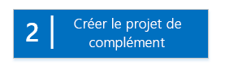
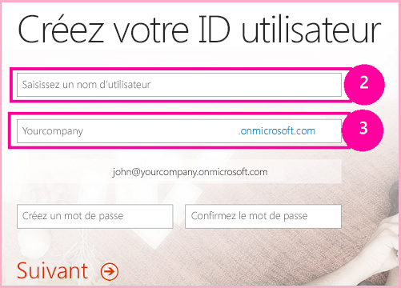

# Commencer à créer des compléments hébergés par un fournisseur pour SharePoint
Configuration d'un environnement de développement et création de votre première Complément SharePoint hébergée par un fournisseur.
Les compléments hébergés par un fournisseur sont l'un des deux principaux types d'Compléments SharePoint. Pour obtenir un aperçu rapide des Compléments SharePoint et des deux types différents, voir  [Compléments](sharepoint-add-ins.md). Voici les informations principales à savoir sur les compléments hébergés par un fournisseur :
  
    
    


- Elles incluent une application, un service ou une base de données web hébergée à l'extérieur de la batterie SharePoint ou de l'abonnement SharePoint Online. Elles peuvent également inclure des composants SharePoint. Les composants externes peuvent être hébergés sur n'importe quelle pile d'hébergement web, notamment la pile LAMP (Linux, Apache, MySQL, PHP).
    
  
- La logique métier personnalisée dans le complément doit être exécutée soit sur les composants externes, soit dans JavaScript sur des pages SharePoint personnalisées.
    
  

 [
  
    
    
](get-started-creating-provider-hosted-sharepoint-add-ins.md#Setup) [
  
    
    
](get-started-creating-provider-hosted-sharepoint-add-ins.md#Create) [
  
    
    
](get-started-creating-provider-hosted-sharepoint-add-ins.md#Code)
  
    
    


## Configuration de votre environnement de développement
<a name="Setup"> </a>

Pour configurer un environnement de développement pour des Compléments SharePoint, plusieurs options s'offrent à vous. Dans cette section, nous vous expliquons l'option la plus simple. Pour connaître les autres options, consultez les  [Ressources supplémentaires](#bk_addresources).
  
    
    

### Obtenir les outils


- Si vous ne disposez pas déjà de **Visual Studio** 2013 ou version ultérieure, installez-le en suivant les instructions figurant à la rubrique [Install Visual Studio](http://msdn.microsoft.com/library/da049020-cfda-40d7-8ff4-7492772b620f.aspx). Nous recommandons d'utiliser la  [dernière version disponible dans le Centre de téléchargement Microsoft](https://www.visualstudio.com/downloads/download-visual-studio-vs).
    
  
- Visual Studio inclut les **Outils de développement Microsoft Office pour Visual Studio**, mais parfois une version des outils est publiée entre les mises à jour de Visual Studio. Pour être sûr que vous avez la dernière version des outils, exécutez le [programme d'installation pour les Outils de développement Office pour Visual Studio 2013](http://aka.ms/OfficeDevToolsForVS2013) ou le [programme d'installation pour les Outils de développement Office pour Visual Studio 2015](http://aka.ms/OfficeDevToolsForVS2015).
    
  

### Inscription à un Site du développeur Office 365
<a name="o365_signup"> </a>


> **REMARQUE**
>  Vous avez peut-être déjà accès à un Site du développeur Office 365 :> **Êtes-vous abonné à MSDN ?** Les abonnés Visual Studio Ultimate et Visual Studio Premium reçoivent également un abonnement à Office 365 Développeur. [Obtenez cet avantage aujourd'hui.](https://msdn.microsoft.com/subscriptions/manage/default.aspx)> **Disposez-vous de l'un des plans d'abonnement Office 365 suivants ?**> **Si oui, un administrateur de l'abonnement à Office 365 peut créer un Site du développeur** à l'aide du [centre d'administration Office 365](https://portal.microsoftonline.com/admin/default.aspx). Pour plus d'informations, voir  [Créer un Site du développeur dans un abonnement Office 365 existant](create-a-developer-site-on-an-existing-office-365-subscription.md). 
  
    
    

Il existe trois options pour obtenir un plan Office 365.
  
    
    

- Ouvrez un compte de développeur Office 365 gratuit d'un an, via le programme de développement d'Office 365.  [Accédez à plus d'information](http://dev.office.com/devprogram) ou remplissez directement le [formulaire d'abonnement](https://profile.microsoft.com/RegSysProfileCenter/wizardnp.aspx?wizid=14b845d0-938c-45af-b061-f798fbb4d170). Une fois l'abonnement réalisé, vous recevrez un e-mail contenant un lien qui vous permettra d'activer votre compte de développeur. Suivez les instructions ci-dessous.
    
  
- Commencer avec un  [essai gratuit de 30 jours](https://portal.microsoftonline.com/Signup/MainSignUp.aspx?OfferId=6881A1CB-F4EB-4db3-9F18-388898DAF510&amp;DL=DEVELOPERPACK) avec une licence utilisateur.
    
  
- Acheter un  [abonnement Office 365 Développeur](https://portal.microsoftonline.com/Signup/MainSignUp.aspx?OfferId=C69E7747-2566-4897-8CBA-B998ED3BAB88&amp;DL=DEVELOPERPACK).
    
  

> **CONSEIL**
> Ouvrez ces liens dans une autre fenêtre ou un nouvel onglet pour que vous puissiez toujours voir les instructions. 
  
    
    


**Figure 1. Nom de domaine d'un Site du développeur Office 365**

  
    
    

  
    
    

  
    
    

  
    
    

  
    
    

1. La première page (non illustrée) du formulaire d'inscription est explicite. Indiquez simplement les informations demandées et choisissez **Suivant**.
    
  
2. Sur la deuxième page (Figure 1), spécifiez l'identificateur d'utilisateur de l'administrateur de l'abonnement.
    
  
3. Créez un sous-domaine de **.onmicrosoft.com**; par exemple, contoso.onmicrosoft.com.
    
    Après l'inscription, vous devez utiliser les informations d'identification obtenues (au format  _UserID_@ _votre_domaine_.onmicrosoft.com) pour vous connecter à votre portail Office 365, où vous pourrez administrer votre compte. Votre Site du développeur SharePoint Online est configuré sur votre nouveau domaine : **http:// _votre_domaine_.sharepoint.com**.
    
  
4. Choisissez **Suivant** et renseignez la page finale du formulaire. Si vous choisissez d'indiquer un numéro de téléphone pour obtenir un code de confirmation, vous pouvez indiquer un numéro de téléphone mobile ou fixe, mais *pas*  un numéro VoIP.
    
  

    
> **REMARQUE**
> Si vous êtes connecté à un autre compte Microsoft lorsque vous tentez de vous connecter à un compte de développeur, il est possible qu'un message semblable à celui-ci s'affiche : « Désolé, l'identifiant utilisateur que vous avez saisi ne fonctionne pas. Il semble ne pas être valide. Veillez à saisir l'identifiant utilisateur que votre organisation vous a affecté. Votre identifiant utilisateur ressemble généralement à  *nom@example.com*  ou *nom@example.onmicrosoft.com*  . »> Si ce message s'affiche, déconnectez-vous du compte Microsoft que vous utilisiez et réessayez. Si vous obtenez toujours ce message, effacez le cache de votre navigateur ou passez en mode **Navigation InPrivate**, puis remplissez le formulaire. 
  
    
    

Une fois que vous avez terminé le processus d'inscription, votre navigateur ouvre la page d'installation d'Office 365. Choisissez l'icône Administrateur pour ouvrir la page Centre d'administration.
  
    
    

**Figure 2. Page Centre d'administration Office 365**

  
    
    

  
    
    

  
    
    

  
    
    

1. Vous devrez attendre la fin de la configuration de votre Site du développeur. Une fois la configuration terminée, actualisez la page Centre d'administration dans votre navigateur.
    
  
2. Ensuite, cliquez sur le lien **Créer des compléments** dans le coin supérieur gauche de la page pour ouvrir le Site du développeur. Le site ressemble à celui présenté dans la Figure 3. Sur la page figure la liste **Compléments en cours de test**. Cela confirme que le site web a été créé avec le modèle Site du développeur de SharePoint. Si, à la place, un site d'équipe s'ouvre, patientez quelques minutes et lancez de nouveau votre site.
    
  
3. Notez l'URL du site. Elle vous servira lorsque vous créerez des projets d'Compléments SharePoint dans Visual Studio.
    
  

**Figure 3. Page d'accueil de votre Site du développeur avec la liste Compléments en cours de test**

  
    
    

  
    
    

  
    
    

  
    
    

  
    
    

## Création du projet de complément
<a name="Create"> </a>


1. Démarrez Visual Studio à l'aide de l'option **Exécuter en tant qu'administrateur**.
    
  
2. Dans Visual Studio, choisissez **Fichier** > **Nouveau** > **Projet**.
    
  
3. Dans la boîte de dialogue **Nouveau projet**, développez le nœud **Visual C#**, le nœud **Office/SharePoint**, puis choisissez **Compléments** > **Complément SharePoint**.
    
  
4. Nommez le projet SampleAddIn, puis choisissez **OK**.
    
  
5. Dans la première boîte de dialogue **Spécifier les paramètres du complément SharePoint**, procédez comme suit :
    
  - Fournissez l'URL complète du site SharePoint que vous souhaitez utiliser pour déboguer votre complément. Il s'agit de l'URL du Site du développeur. Utilisez le protocole HTTPS, pas HTTP dans l'URL. À un moment donné au cours de cette procédure, ou peu de temps après la fin de celle-ci, vous serez invité à ouvrir une session sur ce site. Le délai d'obtention de l'invite varie. Utilisez les informations d'identification d'administrateur (dans le domaine *.onmicrosoft.com) que vous avez créées lors de l'inscription de votre site du développeur ; par exemple MonNom@contoso.onmicrosoft.com.
    
  
  - Sous **Comment souhaitez-vous héberger votre complément pour SharePoint ?**, choisissez **Hébergement par le fournisseur**.
    
  
  - Cliquez sur **Suivant**.
    
  
6. Sur la page **Spécifier la version de SharePoint cible**, sélectionnez **SharePoint Online**, puis choisissez **Suivant**.
    
  
7. Sous **Quel type de projet d'application Web voulez-vous créer ?**, choisissez **Application Web Forms ASP.NET**, puis cliquez sur le bouton **Suivant**.
    
  
8. Sous **Comment souhaitez-vous procéder pour l'authentification de votre complément ?**, choisissez **Utiliser Windows Azure Access Control Service**.
    
  
9. Dans l'Assistant, choisissez **Terminer**.
    
    L'essentiel de la configuration a lieu lors de l'ouverture de la solution. Deux projets sont créés dans la solution Visual Studio, l'un pour l'Complément SharePoint et l'autre pour l'application web ASP.NET.
    
  

## Codage de votre complément
<a name="Code"> </a>


1. Ouvrez le fichier AppManifest.xml. Dans l'onglet **Autorisations**, spécifiez l'étendue de **collection de sites** et le niveau d'autorisation **Lecture**.
    
  
2. Supprimez toutes les marques de révision dans la balise **<body>** du fichier Pages/Default.aspx de votre application web, puis ajoutez les contrôles HTML et ASP.NET suivants dans **<body>**. Cet exemple utilise le contrôle  [UpdatePanel](https://msdn.microsoft.com/library/System.Web.UI.UpdatePanel.aspx) pour permettre un rendu de page partiel.
    
  ```HTML
  
<form id="form1" runat="server">
  <div>
    <asp:ScriptManager ID="ScriptManager1" runat="server"
            EnablePartialRendering="true" />
    <asp:UpdatePanel ID="PopulateData" runat="server" UpdateMode="Conditional">
      <ContentTemplate>      
        <table border="1" cellpadding="10">
         <tr><th><asp:LinkButton ID="CSOM" runat="server" Text="Populate Data" 
                               OnClick="CSOM_Click" /></th></tr>
         <tr><td>

        <h2>SharePoint Site</h2>
        <asp:Label runat="server" ID="WebTitleLabel"/>

        <h2>Current User:</h2>
        <asp:Label runat="server" ID="CurrentUserLabel" />

        <h2>Site Users</h2>
        <asp:ListView ID="UserList" runat="server">     
            <ItemTemplate >
              <asp:Label ID="UserItem" runat="server" 
                                Text="<%# Container.DataItem.ToString()  %>">
              </asp:Label><br />
           </ItemTemplate>
        </asp:ListView>

        <h2>Site Lists</h2>
               <asp:ListView ID="ListList" runat="server">
                   <ItemTemplate >
                     <asp:Label ID="ListItem" runat="server" 
                                Text="<%# Container.DataItem.ToString()  %>">
                    </asp:Label><br />
                  </ItemTemplate>
              </asp:ListView>
            </td>              
          </tr>
         </table>
       </ContentTemplate>
     </asp:UpdatePanel>
  </div>
</form>
  ```

3. Ajoutez les déclarations suivantes au fichier Default.aspx.cs de votre application web.
    
  ```cs
  
using Microsoft.SharePoint.Client;
using Microsoft.IdentityModel.S2S.Tokens;
using System.Net;
using System.IO;
using System.Xml;
  ```

4. Dans le fichier Default.aspx.cs de votre application web, ajoutez ces variables dans la classe  [Page](https://msdn.microsoft.com/library/System.Web.UI.Page.aspx) .
    
  ```cs
  
SharePointContextToken contextToken;
string accessToken;
Uri sharepointUrl;
string siteName;
string currentUser;
List<string> listOfUsers = new List<string>();
List<string> listOfLists = new List<string>();
  ```

5. Ajoutez la méthode  `RetrieveWithCSOM` dans la classe [Page](https://msdn.microsoft.com/library/System.Web.UI.Page.aspx) . Cette méthode utilise le CSOM SharePoint pour récupérer des informations sur votre site et les afficher sur la page.
    
  ```cs
  
// This method retrieves information about the host web by using the CSOM.
private void RetrieveWithCSOM(string accessToken)
{

    if (IsPostBack)
    {
        sharepointUrl = new Uri(Request.QueryString["SPHostUrl"]);
    }            

    ClientContext clientContext =
                    TokenHelper.GetClientContextWithAccessToken(
                        sharepointUrl.ToString(), accessToken);

    // Load the properties for the web object.
    Web web = clientContext.Web;
    clientContext.Load(web);
    clientContext.ExecuteQuery();

    // Get the site name.
    siteName = web.Title;

    // Get the current user.
    clientContext.Load(web.CurrentUser);
    clientContext.ExecuteQuery();
    currentUser = clientContext.Web.CurrentUser.LoginName;

    // Load the lists from the Web object.
    ListCollection lists = web.Lists;
    clientContext.Load<ListCollection>(lists);
    clientContext.ExecuteQuery();

    // Load the current users from the Web object.
    UserCollection users = web.SiteUsers;
    clientContext.Load<UserCollection>(users);
    clientContext.ExecuteQuery();

    foreach (User siteUser in users)
    {
        listOfUsers.Add(siteUser.LoginName);
    }


    foreach (List list in lists)
    {
        listOfLists.Add(list.Title);
    }
}
  ```

6. Ajoutez la méthode  `CSOM_Click` dans la classe [Page](https://msdn.microsoft.com/library/System.Web.UI.Page.aspx) . Cette méthode déclenche l'événement qui se produit lorsque l'utilisateur clique sur le lien **Remplir les données**.
    
  ```cs
  
protected void CSOM_Click(object sender, EventArgs e)
{
    string commandAccessToken = ((LinkButton)sender).CommandArgument;
    RetrieveWithCSOM(commandAccessToken);
    WebTitleLabel.Text = siteName;
    CurrentUserLabel.Text = currentUser;
    UserList.DataSource = listOfUsers;
    UserList.DataBind();
    ListList.DataSource = listOfLists;
    ListList.DataBind();    
 }
  ```

7. Remplacez la méthode  `Page_Load` existante par celle-ci. La méthode `Page_Load` utilise des méthodes du fichier TokenHelper.cs pour récupérer le contexte à partir de l'objet `Request` et obtenir un jeton d'accès auprès de Microsoft Azure Access Control Service (ACS).
    
  ```cs
  
// The Page_load method fetches the context token and the access token.
// The access token is used by all of the data retrieval methods.
protected void Page_Load(object sender, EventArgs e)
{
     string contextTokenString = TokenHelper.GetContextTokenFromRequest(Request);

    if (contextTokenString != null)
    {
        contextToken =
            TokenHelper.ReadAndValidateContextToken(contextTokenString, Request.Url.Authority);

        sharepointUrl = new Uri(Request.QueryString["SPHostUrl"]);
        accessToken =
                    TokenHelper.GetAccessToken(contextToken, sharepointUrl.Authority)
                    .AccessToken;

         // For simplicity, this sample assigns the access token to the button's CommandArgument property. 
         // In a production add-in, this would not be secure. The access token should be cached on the server-side.
        CSOM.CommandArgument = accessToken;
    }
    else if (!IsPostBack)
    {
        Response.Write("Could not find a context token.");
        return;
    }
}
  ```

8. Le fichier Default.aspx.cs doit ressembler à ceci lorsque vous avez terminé.
    
  ```cs
  
using System;
using System.Collections.Generic;
using System.Linq;
using System.Web;
using System.Web.UI;
using System.Web.UI.WebControls;

using Microsoft.SharePoint.Client;
using Microsoft.IdentityModel.S2S.Tokens;
using System.Net;
using System.IO;
using System.Xml;

namespace SampleAddInWeb
{
    public partial class Default : System.Web.UI.Page
    {
        SharePointContextToken contextToken;
        string accessToken;
        Uri sharepointUrl;
        string siteName;
        string currentUser;
        List<string> listOfUsers = new List<string>();
        List<string> listOfLists = new List<string>();

        protected void Page_PreInit(object sender, EventArgs e)
        {
            Uri redirectUrl;
            switch (SharePointContextProvider.CheckRedirectionStatus(Context, out redirectUrl))
            {
                case RedirectionStatus.Ok:
                    return;
                case RedirectionStatus.ShouldRedirect:
                    Response.Redirect(redirectUrl.AbsoluteUri, endResponse: true);
                    break;
                case RedirectionStatus.CanNotRedirect:
                    Response.Write("An error occurred while processing your request.");
                    Response.End();
                    break;
            }
        }

        protected void CSOM_Click(object sender, EventArgs e)
        {
            string commandAccessToken = ((LinkButton)sender).CommandArgument;
            RetrieveWithCSOM(commandAccessToken);
            WebTitleLabel.Text = siteName;
            CurrentUserLabel.Text = currentUser;
            UserList.DataSource = listOfUsers;
            UserList.DataBind();
            ListList.DataSource = listOfLists;
            ListList.DataBind();
        }

        // This method retrieves information about the host web by using the CSOM.
        private void RetrieveWithCSOM(string accessToken)
        {

            if (IsPostBack)
            {
                sharepointUrl = new Uri(Request.QueryString["SPHostUrl"]);
            }


            ClientContext clientContext =
                    TokenHelper.GetClientContextWithAccessToken(
                        sharepointUrl.ToString(), accessToken);


            // Load the properties for the web object.
            Web web = clientContext.Web;
            clientContext.Load(web);
            clientContext.ExecuteQuery();

            // Get the site name.
            siteName = web.Title;

            // Get the current user.
            clientContext.Load(web.CurrentUser);
            clientContext.ExecuteQuery();
            currentUser = clientContext.Web.CurrentUser.LoginName;

            // Load the lists from the Web object.
            ListCollection lists = web.Lists;
            clientContext.Load<ListCollection>(lists);
            clientContext.ExecuteQuery();

            // Load the current users from the Web object.
            UserCollection users = web.SiteUsers;
            clientContext.Load<UserCollection>(users);
            clientContext.ExecuteQuery();

            foreach (User siteUser in users)
            {
                listOfUsers.Add(siteUser.LoginName);
            }

            foreach (List list in lists)
            {
                listOfLists.Add(list.Title);
            }
        }

        protected void Page_Load(object sender, EventArgs e)
        {
            string contextTokenString = 
                 TokenHelper.GetContextTokenFromRequest(Request);

            if (contextTokenString != null)
            {
                contextToken =
                    TokenHelper.ReadAndValidateContextToken(contextTokenString, Request.Url.Authority);

                sharepointUrl = new Uri(Request.QueryString["SPHostUrl"]);
                accessToken =
                    TokenHelper.GetAccessToken(contextToken, sharepointUrl.Authority)
                               .AccessToken;
                CSOM.CommandArgument = accessToken;
            }
            else if (!IsPostBack)
            {
                Response.Write("Could not find a context token.");
                return;
            }
        }
    }
}
  ```

9. Appuyez sur la touche F5 pour déployer et exécuter votre complément. Si une fenêtre **Alerte de sécurité** apparaît et vous demande d'approuver le certificat auto-signé Localhost, répondez **Oui**.
    
    Choisissez **Approuver** sur la page de consentement pour accorder des autorisations au complément. Visual Studio installera d'abord l'application web sur IIS Express, puis le complément sur votre site de test SharePoint et le lancera. Vous verrez une page qui affiche le tableau illustré dans la capture d'écran suivante. Choisissez **Remplir les données** pour afficher des informations de synthèse relatives à votre site SharePoint.
    

   **Page de lancement de l'exemple de complément de base hébergé par le fournisseur**

  

     
  

  

  

## Étapes suivantes
<a name="SP15createprovider_nextsteps"> </a>

Consultez la rubrique  [ Procédure pour donner à votre complément hébergé par un fournisseur l'apparence de SharePoint](give-your-provider-hosted-add-in-the-sharepoint-look-and-feel.md) pour savoir comment intégrer un complément dans le modèle de l'interface utilisateur de SharePoint.
  
    
    

## Ressources supplémentaires
<a name="bk_addresources"> </a>


- Pour connaître les autres options disponibles pour configurer un environnement de développement, comme un environnement « tout local », consultez la section  [Outils](tools-and-environments-for-developing-sharepoint-add-ins.md) dans la table des matières pour les Compléments SharePoint.
    
  

