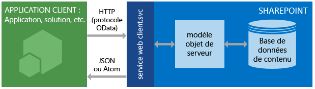

# Familiarisation avec le service REST SharePoint 2013
Intégrez toutes les notions fondamentales sur l'utilisation du service REST SharePoint 2013 pour accéder à des données SharePoint et les mettre à jour au moyen des protocoles web standard REST et OData.
SharePoint 2013 introduit un service REST (Representational State Transfer) comparable aux  [modèles objet client](http://msdn.microsoft.com/library/88e5e1b9-eab2-4f3b-a3f2-75c96b86f1f4%28Office.15%29.aspx) SharePoint existants. Les développeurs peuvent désormais interagir à distance avec les données SharePoint à l'aide d'une technologie prenant en charge les demandes web REST. Cela signifie que les développeurs peuvent effectuer des opérations **Create**, **Read**, **Update** et **Delete** (CRUD) à partir de leurs compléments SharePoint, de leurs solutions et de leurs applications client à l'aide de technologies web REST et de la syntaxe OData (Open Data Protocol) standard.
  
    
    


## Conditions préalables

Cette rubrique suppose que vous connaissez les bases de REST et que vous savez comment créer des demandes REST.
  
    
    

## Fonctionnement du service REST SharePoint 2013
<a name="bk_how"> </a>

SharePoint 2013 vous offre la possibilité d'interagir à distance avec les sites SharePoint à l'aide du service REST. Désormais, vous pouvez interagir directement avec les objets SharePoint en utilisant une technologie prenant en charge les fonctionnalités REST standard.
  
    
    
Pour accéder aux ressources SharePoint à l'aide de REST, créez une requête HTTP RESTful à l'aide de la norme OData (Open Data Protocol), qui correspond à l'API de modèle objet client désirée. Par exemple :
  
    
    
 *Méthode de modèle objet client :* 
  
    
    
List.GetByTitle(listname) 
  
    
    
 *Point de terminaison REST :* 
  
    
    
 `http://server/site/_api/lists/getbytitle('listname')`
  
    
    
Le service web client.svc dans SharePoint gère la requête HTTP et traite la réponse appropriée au format Atom ou JSON (JavaScript Object Notation). Votre application cliente doit ensuite analyser cette réponse. L'illustration ci-dessous montre une vue de haut niveau de l'architecture REST SharePoint.
  
    
    

**Architecture de service REST SharePoint**

  
    
    

  
    
    

  
    
    
En raison de la fonctionnalité et de la facilité d'utilisation fournies par les modèles objet client, ceux-ci demeurent l'option de développement principale pour la communication avec les sites SharePoint à l'aide de code managé .NET Framework, de Silverlight ou de JavaScript.
  
    
    

### Utiliser les commandes HTTP avec le service REST SharePoint 2013
<a name="bk_usingHTTP"> </a>

Pour utiliser les fonctionnalités REST intégrées dans SharePoint 2013, vous devez créer une requête HTTP RESTful à l'aide de la norme OData, qui correspond à l'API du modèle objet client que vous voulez utiliser. Le service web client.svc gère la requête HTTP et traite la réponse appropriée au format Atom ou JavaScript Object Notation (JSON). L'application cliente doit ensuite analyser cette réponse.
  
    
    
Les points de terminaison du service REST SharePoint 2013 correspondent aux types et membres dans les modèles objet client SharePoint. Avec des requêtes HTTP, vous pouvez utiliser ces points de terminaison REST pour effectuer des opérations CRUD standard sur des entités SharePoint, telles que les listes et les sites. 
  
    
    
En règle générale :
  
    
    


|**Si vous voulez effectuer cette action sur un point de terminaison**|**Utilisez cette requête HTTP**|**Gardez à l'esprit**|
|:-----|:-----|:-----|
|Lire une ressource  <br/> |**GET** <br/> ||
|Créer ou mettre à jour une ressource  <br/> |**POST** <br/> |Utilisez **POST** pour créer des entités telles que des listes et des sites. Le service REST SharePoint 2013 prend en charge l'envoi de commandes **POST** incluant les définitions d'objets vers les points de terminaison représentant les collections. <br/> Pour les opérations **POST**, toutes les propriétés non obligatoires sont définies sur leurs valeurs par défaut. Si vous tentez de définir une propriété en lecture seule dans le cadre d'une opération **POST**, le service renvoie une exception.  <br/> |
|Mettre à jour ou insérer une ressource  <br/> |**PUT** <br/> | Utilisez les opérations **PUT** et **MERGE** pour mettre à jour des objets SharePoint existants. <br/>  Tout point de terminaison de service représentant une opération **set** de propriété d'objet prend en charge à la fois les demandes **PUT** et **MERGE**.  <br/>  Pour les demandes **MERGE**, la définition de propriétés est facultative ; toutes les propriétés que vous ne définissez pas explicitement conservent leur valeur actuelle.  <br/>  Pour les demandes **PUT**, si vous ne spécifiez pas toutes les propriétés obligatoires dans les mises à jour d'objet, le service REST renvoie une exception. De plus, les propriétés facultatives qui ne sont pas définies de manière explicite sont définies sur leur valeur par défaut.  <br/> |
|Supprimer une ressource  <br/> |**DELETE** <br/> |Utilisez la commande HTTP **DELETE** sur l'URL spécifique du point de terminaison pour supprimer l'objet SharePoint représenté par ce point de terminaison. <br/> S'il s'agit d'objets recyclables, comme des listes, des fichiers et des éléments de liste, cette action entraîne une opération **Recycle**.  <br/> |
   

### Créer des URL REST pour accéder aux ressources SharePoint
<a name="bk_constructURLs"> </a>

Dès que possible, l'URI de ces points de terminaison REST imite la signature de l'API de la ressource dans le modèle objet client SharePoint. Les principaux points d'entrée pour le service REST représentent la collection de sites et le site du contexte spécifié. 
  
    
    
Pour accéder à une collection de sites spécifique, utilisez la construction suivante :
  
    
    
 `http://server/site/_api/site`
  
    
    
Pour accéder à un site spécifique, utilisez la construction suivante :
  
    
    
 `http://server/site/_api/web`
  
    
    
Dans chaque cas,  *server*  représente le nom du serveur et *site*  indique le nom ou le chemin du site spécifique.
  
    
    
À partir de là, vous pouvez créer des URI REST plus spécifiques en « parcourant » le modèle objet à l'aide des noms des API du modèle objet client séparés par une barre oblique (/).
  
    
    
Cette syntaxe ne s'applique pas aux API REST SocialFeedManager et SocialFollowingManager. Pour plus d'informations, voir  [Référence de l'API REST des flux sociaux pour SharePoint 2013](http://msdn.microsoft.com/library/f1cb914f-1e91-4e23-bf53-d2ab323eac13%28Office.15%29.aspx) et [Référence de l'API REST de suivi des personnes et du contenu pour SharePoint 2013](http://msdn.microsoft.com/library/c05755df-846d-4a39-941d-950d066cc6d4%28Office.15%29.aspx).
  
    
    
Voir  [Déterminer les URI de point de terminaison du service REST SharePoint](determine-sharepoint-rest-service-endpoint-uris.md) pour obtenir plus de consignes relatives à la détermination des URI de point de terminaison REST SharePoint à partir de la signature des API de modèle objet client correspondantes.
  
    
    

## Exemples de points de terminaison REST SharePoint
<a name="bk_URLexamples"> </a>

Le tableau suivant contient des exemples d'URL de point de terminaison REST classiques pour vous aider à commencer à exploiter les données SharePoint. Ajoutez le préfixe  `http://server/site/_api/` aux fragments d'URL affichés dans le tableau pour créer une URL REST complète. Si nécessaire, pour les commandes **POST**, le tableau contient des exemples de données que vous devez transmettre dans le corps de requête HTTP pour créer l'élément SharePoint spécifié. Les éléments en italique représentent les variables que vous devez remplacer par vos valeurs.
  
    
    


|**Description**|**Point de terminaison d'URL**|**Méthode HTTP**|**Contenu du corps**|
|:-----|:-----|:-----|:-----|
|Récupère le titre d'une liste  <br/> | `web/title` <br/> |GET  <br/> |Non applicable  <br/> |
|Récupère toutes les listes d'un site  <br/> | `lists` <br/> |GET  <br/> |Non applicable  <br/> |
|Récupère les métadonnées d'une seule liste  <br/> | `lists/getbytitle('listname')` <br/> |GET  <br/> |Non applicable  <br/> |
|Récupère les éléments d'une liste  <br/> | `lists/getbytitle('listname')/items` <br/> |GET  <br/> |Non applicable  <br/> |
|Récupère une propriété spécifique d'un document (dans ce cas, le titre du document)  <br/> | `lists/getbytitle('listname')?select=Title` <br/> |GET  <br/> |Non applicable  <br/> |
|Crée une liste  <br/> | `lists` <br/> |POST  <br/> |
```

{
  '_metadata':{'type':SP.List},
  'AllowContentTypes': true,
  'BaseTemplate': 104 ,
  'ContentTypesEnabled': true,
  'Description': 'My list description ',
  'Title': 'RestTest '
}
```

|
|Ajoute un élément à une liste  <br/> | `lists/getbytitle('listname')/items` <br/> |POST  <br/> |
```

{
  '_metadata':{'type':SP.listname ListItem},
  'Title': 'MyItem'
}

```

|
   

## Prise en charge du traitement par lots
<a name="batch"> </a>

Le service REST SharePoint Online (et SharePoint sur site 2016 ou ultérieur) prend en charge la combinaison de plusieurs requêtes en un seul appel au service à l'aide de l'option de requête  `$batch` OData. Pour plus de détails et des liens vers des exemples de code, reportez-vous à [Effectuer des requêtes de lot avec les API REST](make-batch-requests-with-the-rest-apis.md).
  
    
    

## Ressources supplémentaires
<a name="bk_learnmore"> </a>

Utilisez les ressources ci-dessous pour en savoir plus sur l'utilisation du service REST SharePoint.
  
    
    

|||
|:-----|:-----|
| [Effectuer des opérations de base à l'aide de terminaux REST SharePoint 2013](complete-basic-operations-using-sharepoint-2013-rest-endpoints.md) <br/> |Découvrez comment effectuer des opérations CRUD (create, read, update et delete ; créer, lire, mettre à jour et supprimer) de base à l'aide de l'interface REST SharePoint 2013.  <br/> |
| [Utilisation d'une liste et de ses éléments avec REST](working-with-lists-and-list-items-with-rest.md) <br/> |Découvrez comment effectuer des opérations CRUD (create, read, update et delete ; créer, lire, mettre à jour et supprimer) de base sur des listes et des éléments de liste à l'aide de l'interface REST SharePoint 2013.  <br/> |
| [Utilisation de dossiers et de fichiers à l'aide de l'interface REST](working-with-folders-and-files-with-rest.md) <br/> |Découvrez comment effectuer des opérations CRUD (create, read, update et delete ; créer, lire, mettre à jour et supprimer) de base sur des dossiers et des fichiers à l'aide de l'interface REST SharePoint 2013.  <br/> |
| [Naviguer dans la structure de données SharePoint représentée dans le service REST](navigate-the-sharepoint-data-structure-represented-in-the-rest-service.md) <br/> |Découvrez comment démarrer à partir d'un point de terminaison REST pour un élément SharePoint donné et accéder aux éléments connexes, tels que les sites parents ou la structure de la bibliothèque dans laquelle cet élément réside.  <br/> |
| [Déterminer les URI de point de terminaison du service REST SharePoint](determine-sharepoint-rest-service-endpoint-uris.md) <br/> |Découvrez les consignes générales pour la détermination des URI de point de terminaison REST SharePoint à partir de la signature des API de modèle objet client correspondantes.  <br/> |
| [Utiliser les opérations de requête OData dans les demandes REST SharePoint](use-odata-query-operations-in-sharepoint-rest-requests.md) <br/> |Découvrez comment utiliser une large gamme d'opérateurs de chaîne de requête OData pour sélectionner, filtrer et trier les données que vous demandez à partir du service REST SharePoint.  <br/> |
| [Exemples, points de terminaison et API REST pour SharePoint 2013](02128c70-9d27-4388-9374-a11bce68fdb8.md) <br/> |Cette page contient des liens vers toutes les ressources REST disponibles pour les développeurs SharePoint 2013 sur MSDN.  <br/> |
| [Vue d'ensemble de l'API REST de recherche SharePoint](http://msdn.microsoft.com/library/8a4f7863-e4c1-4099-9189-a1894db36930%28Office.15%29.aspx) <br/> |Ajoutez une fonctionnalité de recherche aux applications clientes et mobiles à l'aide du service REST de recherche dans SharePoint Server 2013 et toute technologie prenant en charge les requêtes web REST.  <br/> |
| [Référence de l'API REST des flux sociaux pour SharePoint 2013](http://msdn.microsoft.com/library/f1cb914f-1e91-4e23-bf53-d2ab323eac13%28Office.15%29.aspx) <br/> |Découvrez les points de terminaison REST SharePoint 2013 pour les tâches liées au flux.  <br/> |
| [Référence de l'API REST de suivi des personnes et du contenu pour SharePoint 2013](http://msdn.microsoft.com/library/c05755df-846d-4a39-941d-950d066cc6d4%28Office.15%29.aspx) <br/> |Découvrez les points de terminaison REST SharePoint 2013 pour le suivi des personnes et du contenu.  <br/> |
| [Effectuer des requêtes de lot avec les API REST](make-batch-requests-with-the-rest-apis.md) <br/> |Découvrez comment combiner plusieurs requêtes en un seul appel au service REST.  <br/> |
| [Synchroniser les éléments SharePoint à l'aide du service REST](synchronize-sharepoint-items-using-the-rest-service.md) <br/> |Découvrez comment synchroniser des éléments entre SharePoint et vos compléments ou services à l'aide de la ressource **GetListItemChangesSinceToken**, dans le service REST SharePoint.  <br/> |
| [Utiliser des valeurs ETag avec le service REST pour le contrôle de version des éléments de liste](5f7e0579-46b7-44ab-b3b4-cdbc622dcd98.md) <br/> |Découvrez comment utiliser les ETags HTML avec le service REST SharePoint en vue d'un contrôle de simultanéité des listes et des éléments de liste SharePoint.  <br/> |
   

## Ressources OData
<a name="SP15startREST_bk_addlresources"> </a>


  
    
    

-  [Introduction à OData](http://msdn.microsoft.com/fr-fr/data/hh237663)
    
  
-  [Open Data Protocol par exemple](http://msdn.microsoft.com/fr-fr/library/ff478141.aspx)
    
  
-  [Open Data Protocol](http://www.odata.org/)
    
  
-  [Conventions d'URI de protocole OData](http://www.odata.org/documentation/odata-version-2-0/uri-conventions/)
    
  
-  [Opérations de service d'adressage](http://www.odata.org/documentation/odata-version-2-0/uri-conventions#AddressingServiceOperations)
    
  
-  [Opérations de protocole OData](http://www.odata.org/documentation/odata-version-2-0/operations/)
    
  
-  [Conditions d'erreur](http://www.odata.org/documentation/odata-version-2-0/operations#ErrorConditions)
    
  

