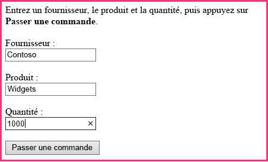
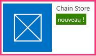
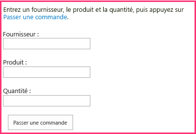
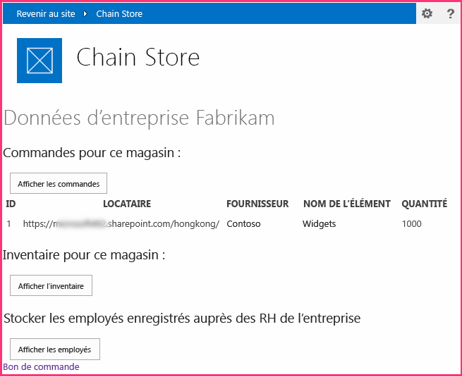
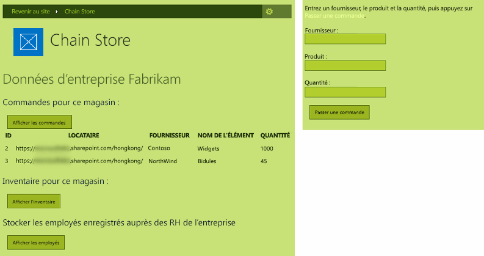

# Procédure pour donner à votre complément hébergé par un fournisseur l'apparence de SharePoint
 Apprenez à donner à vos Compléments SharePoint hébergés par un fournisseur l'apparence de SharePoint.
 Cet article est le deuxième d'une série sur les concepts de base du développement de Compléments SharePoint hébergés par un fournisseur. Familiarisez-vous tout d'abord avec [Compléments](sharepoint-add-ins.md) et les articles précédents de cette série :
  
    
    


-  [Commencer à créer des compléments hébergés par un fournisseur pour SharePoint](get-started-creating-provider-hosted-sharepoint-add-ins.md)
    
  

 Dans l'article précédent de cette série, vous avez appris à mettre en place un environnement de développement et à utiliser Visual Studio pour créer un premier complément de niveau « Hello World » qui expose les données SharePoint dans l'application web distante du complément. Dans cet article, nous allons commencer par une solution de Complément SharePoint qui a déjà été créée. Elle comprend une application Web Forms ASP.NET et une base de données SQL Azure. Nous avons créé ces éléments pour vous, car cette série d'articles est uniquement destinée à se concentrer sur les Compléments SharePoint. Dans chaque article de cette série, vous améliorerez la fonctionnalité et l'intégration SharePoint du complément.
  
    
    


## Familiarisation avec le complément de base

 Dans cette série d'articles, nous n'allons pas vous enseigner la programmation ASP.NET ou T-SQL, mais vous devez connaître les principes de base des composants distants du complément avant de pouvoir l'intégrer à SharePoint. Le scénario du complément imagine une chaîne de magasins de vente au détail, et chaque magasin dispose d'un site web d'équipe dans l'abonnement SharePoint Online de la société mère. Quand un magasin installe le complément sur le site de son équipe, celui-ci permet aux membres de l'équipe d'intégrer leurs données et expérience SharePoint à l'aide de données dans la base de données de la société mère. Chaque instance du complément dispose de son propre client dans la base de données d'entreprise et les utilisateurs peuvent uniquement interagir avec les données d'entreprise associées à leur magasin.
  
    
    

### Création de sites d'équipe pour deux magasins de la chaîne


1.  Ouvrez la page d'accueil de SharePoint Online et cliquez sur le lien **Contenu du site** dans le lancement rapide. Sur la page **Contenu du site**, faites défiler jusqu'à voir le lien **nouveau sous-site**, puis cliquez dessus.
    
  
2.  Sur la page **Nouveau site SharePoint**, remplissez le formulaire pour créer un site d'équipe à l'aide des valeurs indiquées dans la capture d'écran suivante.
    
     
  

  

  
3.  Laissez tous les autres paramètres sur leurs valeurs par défaut et cliquez sur **Créer**.
    
  

### Exploration du complément


1.  Accédez à [SharePoint_Provider-hosted_Add-Ins_Tutorials](https://github.com/OfficeDev/SharePoint_Provider-hosted_Add-ins_Tutorials) et cliquez sur le bouton **Download ZIP** pour télécharger le référentiel sur votre bureau. Décompressez le fichier.
    
  
2.  Lancez Visual Studio *en tant qu'administrateur*  , puis ouvrez le fichier BeforeSharePointUI.sln. La solution comporte trois entités :
    
  - **ChainStore**: le projet de Complément SharePoint.
    
  
  - **ChainStoreWeb**: l'application web distante.
    
  
  - **ChainCorporateDB**: la base de données SQL Azure.
    
  
3.  Sélectionnez le projet **ChainStore**, puis dans la fenêtre **Propriétés**, définissez la propriété **URL du site** sur l'URL complète du site d'équipe de Hong Kong :https://{VOTRE_DOMAINE_SHAREPOINT}/hongkong/. Veillez à inclure le caractère « / » à la fin. Cliquez sur le bouton **Enregistrer**.  *À un certain stade de ce processus, vous serez invité à vous connecter à votre abonnement SharePoint Online.* 
    
  
4.  Cliquez avec le bouton droit sur le nœud de la solution en haut de l' **Explorateur de solutions** et sélectionnez **Définir les projets de démarrage**.
    
  
5.  Assurez-vous que les trois projets sont définis sur **Début** dans la colonne **Action**.
    
  
6.  Utilisez la touche F5 pour déployer et exécuter votre complément. Visual Studio héberge l'application web distante dans IIS Express et héberge la base de données SQL dans SQL Express. Il réalise également une installation temporaire du complément sur votre site SharePoint de test et exécute le complément immédiatement. Vous êtes invité à accorder des autorisations au complément avant l'ouverture de sa page d'accueil.
    
  
7.  La page d'accueil du complément ressemble à la capture d'écran ci-dessous. Tout en haut, le nom du site SharePoint où le complément est installé apparaît. Il s'agit d'un effet secondaire de quelques exemples de code que les Outils de développement Office pour Visual Studio génèrent. Vous modifierez cet élément à une étape ultérieure. La page comporte des zones où les données des tables de base de données SQL **Inventaire**, **Commandes** et **Employés** sont visibles. Ces tables sont initialement vides.
    
     
  

  

  
8.  Ouvrez le lien **Bon de commande** au bas de la page pour ouvrir un bon de commande. Saisissez des valeurs dans le formulaire et cliquez sur **Passer une commande**. La capture d'écran ci-dessous en présente un exemple. Vous aurez l'impression que rien ne s'est produit, mais le code du bouton transmet les valeurs à une procédure stockée paramétrée dans la base de données SQL. L'utilisation de procédures stockées paramétrées protège la base de données contre les attaques par injection de code SQL.
    
     
  

  

  
9.  Utilisez le bouton retour du navigateur pour revenir à la page d'accueil, puis sélectionnez le bouton **Afficher les commandes**. La page est actualisée et votre commande apparaît sur la page, comme sur la capture d'écran ci-dessous.
    
     La table comporte un champ **Client** dont la valeur est l'URL de votre site web SharePoint de test. Cela ne fait pas référence à l'abonnement SharePoint Online, qui est parfois appelé client. Au lieu de cela, chaque instance du complément est un client distinct dans la base de données d'entreprise. Étant donné que plus d'une instance de complément peut être installée sur un site web hôte SharePoint spécifique, l'URL du site web hôte peut être utilisée comme discriminant de client dans la base de données. (Pour obtenir un rappel sur la distinction entre site web hôte et site web de complément, voir [Compléments](sharepoint-add-ins.md).) Toutes les procédures stockées dans le complément comprennent la valeur de discriminant lorsqu'elles interagissent en écriture ou en lecture avec la base de données. Cela garantit que lorsque l'utilisateur clique sur le bouton **Afficher les commandes** (ou **Afficher les employer** ou **Afficher l'inventaire**), seules les données associées au magasin de l'utilisateur sont récupérées auprès de la base de données. Cette conception assure également que les utilisateurs peuvent passer des commandes et ajouter des employés uniquement pour leur propre magasin.
    
     L'application web distante obtient l'URL de site web hôte à partir d'un paramètre de chaîne de requête que SharePoint ajoute à l'URL de la page d'accueil lors du lancement du complément. Étant donné que SSL est utilisé, cette chaîne de requête est chiffrée, car elle est envoyée par Internet à l'application web distante.
    
     
  

  

  
10. Pour mettre fin à la session de débogage, fermez la fenêtre du navigateur ou arrêtez le débogage dans Visual Studio. Chaque fois que vous appuyez sur F5, Visual Studio retire la version précédente du complément et installe la plus récente.
    
  
11.  Par défaut, le complément reste installé sur le site web hôte SharePoint entre les sessions de débogage dans Visual Studio. Pour voir comment les utilisateurs finaux le lancent après sa réinstallation, ouvrez le site SharePoint de Fabrikam Hong Kong dans votre navigateur et accédez à la page **Contenu du site**. La mosaïque du complément apparaît telle que dans la capture d'écran ci-dessous :
    
     
  

    
    > [!REMARQUE]
      >  Si vous cliquez sur la mosaïque, la page d'accueil ne s'ouvre pas, car Visual Studio ferme la session IIS express lorsque vous arrêtez le débogage.

## Configuration de Visual Studio pour régénérer la base de données d'entreprise à chaque session de débogage
<a name="Rebuild"> </a>

 Par défaut, Visual Studio ne régénère *pas*  la base de données SQL Express. De ce fait, les commandes et les autres éléments que vous ajoutez à la base de données en une seule session de débogage sont encore dans la base de données lors des sessions ultérieures. Il est plus facile de commencer avec une base de données vide chaque fois que vous appuyez sur F5. Suivez les étapes ci-dessous :
  
    
    

1.  Cliquez avec le bouton droit sur le projet **ChainCorporateDB** et sélectionnez **Propriétés**.
    
  
2.  Ouvrez l'onglet **Deboguer** et activez l'option **Toujours recréer la base de données**.
    
  

## Procédure pour donner à l'application web distante l'apparence de SharePoint
<a name="Rebuild"> </a>

 Dans certains scénarios, vous pouvez souhaiter que vos pages distantes aient leur propre apparence, mais dans la plupart des cas, il est préférable qu'elles reproduisent l'interface utilisateur SharePoint afin que les utilisateurs aient la sensation d'être sur SharePoint.
  
    
    

### Ajout d'un chrome SharePoint d'une barre supérieure à la page d'accueil


1.  Dans l' **Explorateur de solutions**, accédez à **ChainStoreWeb | Pages**, puis ouvrez le fichier CorporateDataViewer.aspx. Il s'agit de la page d'accueil du complément.
    
  
2.  Dans la section **head**, vous verrez un script qui charge quelques bibliothèques JavaScript. En dessous de celui-ci, ajoutez le script supplémentaire suivant. Ce script charge le fichier SP.UI.Controls.js se trouvant sur chaque site web SharePoint dans le dossier /_layouts/15/. Ce fichier charge, entre autres, la bibliothèque SharePoint CSS.
    
  ```
  
<script type="text/javascript">
    var hostweburl;

    // Load the SharePoint resources.
    $(document).ready(function () {

        // Get the URI decoded add-in web URL.
        hostweburl =
            decodeURIComponent(
                getQueryStringParameter("SPHostUrl")
        );

        // The SharePoint js files URL are in the form:
        // web_url/_layouts/15/resource.js
        var scriptbase = hostweburl + "/_layouts/15/";

        // Load the js file and continue to the 
        // success handler.
        $.getScript(scriptbase + "SP.UI.Controls.js")
    });

    // Function to retrieve a query string value.
    function getQueryStringParameter(paramToRetrieve) {
        var params =
            document.URL.split("?")[1].split("&amp;");
        var strParams = "";
        for (var i = 0; i < params.length; i = i + 1) {
            var singleParam = params[i].split("=");
            if (singleParam[0] == paramToRetrieve)
                return singleParam[1];
        }
    }
</script>
  ```

3.  En haut de la section du corps de la page, ajoutez le balisage suivant. Il permet d'insérer la barre supérieure SharePoint, appeléecontrôle Chrome, dans la page. Les détails de ce balisage seront plus clairs lors du test de ce complément révisé plus loin dans cet article. (La chaîne « app » apparaît dans plusieurs noms de propriétés, car auparavant, les compléments étaient appelés applications, ou « apps ».)
    
  ```
  
<!-- Chrome control placeholder. Options are declared inline.  -->
<div 
    id="chrome_ctrl_container"
    data-ms-control="SP.UI.Controls.Navigation"  
    data-ms-options=
        '{  
            "appHelpPageUrl" : "Help.aspx",
            "appIconUrl" : "/Images/AppIcon.png",
            "appTitle" : "Chain Store",
            "settingsLinks" : [
                {
                    "linkUrl" : "Account.aspx",
                    "displayName" : "Account settings"
                },
                {
                    "linkUrl" : "Contact.aspx",
                    "displayName" : "Contact us"
                }
            ]
         }'>
</div>
  ```

4.  Les en-têtes **H1** et le lien hypertexte du corps de la page utilisent automatiquement les styles définis dans la bibliothèque CSS de SharePoint, il n'est donc pas nécessaire de les modifier. Pour illustrer la façon dont vous pouvez utiliser les styles SharePoint, définissez les en-têtes de colonne des trois contrôles **GridView** sur le style « Tout en majuscules » SharePoint en ajoutant l'attribut **HeaderStyle-CssClass** à chaque contrôle et en définissant sa valeur sur « `ms-uppercase` ». Le code suivant est un exemple. Apportez la même modification aux trois contrôles **GridView**.
    
  ```XML
  
<asp:GridView ID="ordersGridView" runat="server" CellPadding="5" GridLines="None"
HeaderStyle-CssClass="ms-uppercase" />
  ```

5.  Le contrôle chrome utilise l'icône du complément, donc nous avons besoin d'une deuxième copie du fichier d'icône sur le serveur web distant. Dans l' **Explorateur de solutions**, cliquez avec le bouton droit sur le fichier AppIcon.png dans le projet **ChainStore** et choisissez **Copier**. 
    
  
6.  Cliquez avec le bouton droit sur le dossier **Images** du projet **ChainStoreWeb** et choisissez **Coller**.
    
  
7.  Ouvrez le fichier CorporateDataViewer.aspx.cs.
    
  
8.  La classe `CorporateDataViewer` déclare un membre privé de type **SharePointContext**. Cette classe est définie dans le fichier SharePointContext.cs que les Outils de développement Office pour Visual Studio ont généré lors de la création du projet. Vous pouvez le considérer comme un élément semblable à la classe **HttpContextBase** ASP.NET, mais comportant des informations contextuelles SharePoint, telles que l'URL du site web hôte.
    
     Dans la méthode **Page_Load**, il existe une instruction **using** qui écrit le nom du site web hôte SharePoint sur la page d'accueil distante. Il s'agit d'un code d'exemple, donc supprimez l'intégralité de l'instruction **using**. (Toutefois, conservez la ligne qui initialise la variable  `spContext`.) La méthode doit maintenant se présenter comme suit.
    


  ```cs
  
protected void Page_Load(object sender, EventArgs e)
{
    spContext = SharePointContextProvider.Current.GetSharePointContext(Context);
}
  ```

9.  Quatre autres fichiers ASP.NET nécessitent l'interface utilisateur de SharePoint :
    
  -  Account.aspx
    
  
  -  Contact.aspx
    
  
  -  Help.aspx
    
  
  -  OrderForm.aspx
    
  

    > [!REMARQUE]
      >  Le dernier fichier .aspx du projet, EmployeeAdder.aspx, ne fait jamais l'objet d'un rendu, vous ne devez donc pas modifier son interface utilisateur. Vous en apprendrez plus à ce sujet dans un autre article de cette série.

     Toutefois, nous ne souhaitons pas que le contrôle Chrome apparaisse sur ces pages. Nous voulons simplement accéder à la bibliothèque CSS SharePoint. Pour chacune de ces quatre pages, ajoutez le balisage suivant à l'élément **head**.
    


  ```XML
  
<link type="text/css" rel="stylesheet"
href="<%= spContext.SPHostUrl.ToString() + "_layouts/15/defaultcss.ashx" %>" />
  ```

10.  Cette étape et la suivante ont déjà été effectuées pour les pages Bon de commande et Compte, elles s'appliquent donc uniquement aux pages Contact et Aide. Pour obtenir l'objet `spContext` sur ces deux pages, ouvrez les fichiers code-behind *.aspx.cs pour les trois pages .aspx. Dans chacune d'elles, ajoutez le membre suivant à la classe **Page**.
    
  ```cs
  
protected SharePointContext spContext;
  ```

11.  Remplacez la méthode **Page_Load** par la version suivante. L'objet est récupéré à partir du cache de session. Il a été mis en cache à cet endroit lors de sa première création par la méthode **Page_Load** de la page d'accueil du complément.
    
  ```cs
  protected void Page_Load(object sender, EventArgs e)
{
    spContext = Session["SPContext"] as SharePointContext;
}
  ```

12.  Ouvrez la page OrderForm.aspx. Dans l'élément **Label** supérieur, remplacez l'élément **<b>** de l'expression **Passer une commande** par les balises de mise en forme qui référencent la classe CSS `ms-accentText`. L'ensemble du contrôle **Label** doit ressembler à ce qui suit lorsque vous avez terminé.
    
  ```XML
  
<asp:Label ID="lblOrderPrompt" runat="server"
         Text="Enter a supplier, product, and quantity; and then press <span class='ms-accentText'>Place Order</span>.">
</asp:Label>
  ```


## Exécution du complément et test de la nouvelle interface utilisateur SharePoint
<a name="Rebuild"> </a>


  
    
    

1.  Utilisez la touche F5 pour déployer et exécuter votre complément. Visual Studio héberge l'application web distante dans IIS Express et héberge la base de données SQL dans SQL Express. Il réalise également une installation temporaire du complément sur votre site SharePoint de test et l'exécute immédiatement. Vous êtes invité à accorder des autorisations au complément avant l'ouverture de sa page d'accueil.
    
  
2.  Lorsque la page d'accueil du complément s'ouvre, elle ressemble désormais à une page SharePoint. Cliquez sur le lien **Bon de commande**. Il ressemble également à un formulaire SharePoint.
    
     
  

  

  
3.  Créez une commande et cliquez sur **Passer une commande**.
    
  
4.  Utilisez le bouton retour du navigateur pour revenir à la page d'accueil du complément, puis sélectionnez **Afficher les commandes**. La page doit maintenant se présenter comme suit. Notez que les en-têtes de colonnes sont désormais en majuscules. 
    
     
  

  

  
5.  Appuyez sur l'icône **?** à la fin du contrôle Chrome. Une page d'aide simple s'ouvre. Cliquez sur le bouton retour du navigateur.
    
  
6.  Cliquez sur l'icône d'engrenage sur le contrôle Chrome. Un menu s'ouvre comportant des liens vers des pages Compte et Contact. Ouvrez la page Compte et utilisez le bouton retour de votre navigateur pour revenir à la page d'accueil. Répétez l'opération pour la page Contact.
    
  
7.  Cliquez sur le bouton **Retour au site** du contrôle Chrome. La page d'accueil du site web hôte, le site de l'équipe du magasin de Hong Kong, s'ouvre.
    
  
8.  Cliquez sur l'icône d'engrenage sur la barre supérieure, puis choisissez **Modifier l'apparence**.
    
  
9.  Suivez les invites pour modifier le site afin qu'il adopte l'une desapparences alternatives.
    
  
10.  Accédez à la page **Contenu du site** et lancez l'application Chain Store en cliquant sur sa mosaïque. Vos pages personnalisées ont pris l'apparence choisie. Les captures d'écran suivantes présentent l'apparence composée **Nature**.
    
     
  

  

  
11.  Redéfinissez l'apparence sur l'apparence par défaut, qui s'intitule **Office**.
    
  
12. Pour mettre fin à la session de débogage, fermez la fenêtre du navigateur ou arrêtez le débogage dans Visual Studio. Chaque fois que vous appuyez sur F5, Visual Studio retire la version précédente du complément et installe la plus récente.
    
  
13. Vous allez travailler avec ce complément et la solution Visual Studio dans d'autres articles. Il est donc recommandé de retirer le complément une dernière fois lorsque vous avez terminé de travailler et n'allez pas le réutiliser pendant un moment. Cliquez avec le bouton droit de la souris sur le projet dans l' **Explorateur de solutions** et choisissez **Retirer**.
    
  

## 
<a name="Nextsteps"> </a>

 Le complément a désormais l'apparence de SharePoint, mais il s'agit encore d'une simple application web qui ne s'intègre pas vraiment à SharePoint, au-delà du fait d'être lancée à partir d'une mosaïque dans SharePoint. Vous allez découvrir comment ajouter une commande personnalisée, lancée à partir d'un bouton de ruban personnalisé dans l'article suivant : [ Insertion d'un bouton personnalisé dans un complément hébergé par un fournisseur](include-a-custom-button-in-the-provider-hosted-add-in.md).
  
    
    

