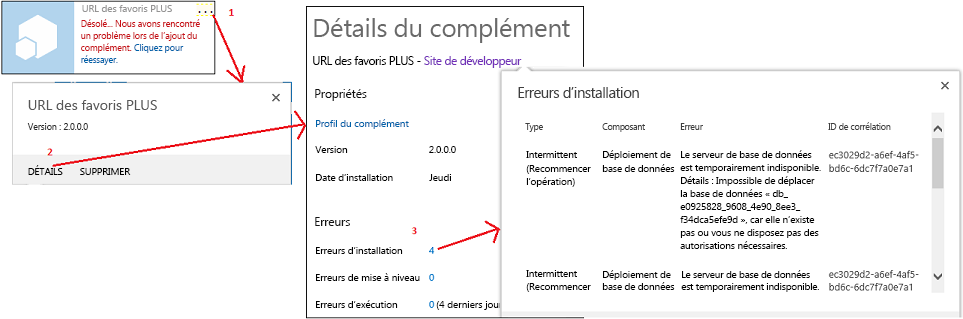
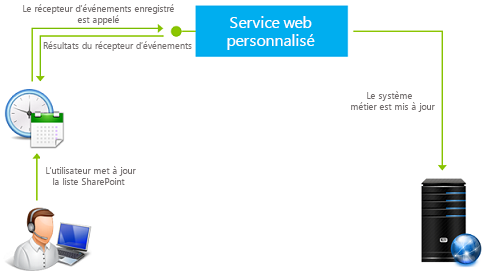

# Gestion des événements dans les compléments pour SharePoint

Votre code personnalisé peut gérer trois catégories d'événements dans les compléments hébergés par un fournisseur :
  
    
    


- **Événements de liste**, comme l'ajout ou la suppression d'une liste sur un site web.
    
  
- **Événements d'élément de liste**, comme la modification d'un élément dans une liste.
    
  
- **Événements d'application**, comme l'installation d'une application.
    
  

Les Compléments SharePoint hébergés par SharePoint ne prennent pas en charge la gestion des événements, mais vous pouvez transformer un flux de travail en une sorte de gestionnaire d'événements de liste ou d'élément de liste en définissant un événement pour déclencher le flux de travail. Voir  [Flux de travail dans SharePoint 2013](http://msdn.microsoft.com/library/e0602371-ae22-44be-8a7e-9e47e9f046d6%28Office.15%29.aspx). Les flux de travail ne peuvent pas être déclenchés par des événements de complément, c'est la raison pour laquelle les événements de complément ne peuvent pas être gérés avec un complément hébergé par SharePoint.
  
    
    


> [!REMARQUE]
> Les événements de site web et de collection de sites ne sont pas pris en charge dans Compléments SharePoint. 
  
    
    

Il existe deux types d'événements :
- Les événements ** *antérieurs* ** sont déclenchés avant que l'infrastructure SharePoint n'effectue sa propre gestion de l'événement (y compris la validation des modifications apportées à la base de données de contenu). Dans SharePoint, **les gestionnaires d'événements antérieurs personnalisés sont toujours exécutés de façon synchrone**. Ils peuvent être utilisés, entre autres, pour annuler l'événement. Par exemple, si un complément dispose d'une fonction de suppression de liste, un gestionnaire de l'événement supprimant la liste peut annuler la suppression si certaines conditions ne sont pas remplies. Si l'événement fait partie d'une séquence d'événements, son annulation empêche les événements ultérieurs de survenir. Par exemple, si le gestionnaire de l'événement **ItemAdding** annule celui-ci, l'événement **ItemAdded**, qui survient normalement ensuite, n'est pas déclenché.
    
  
- Les événements ** *postérieurs* ** sont déclenchés après que l'infrastructure SharePoint a effectué sa propre gestion de l'événement. Dans SharePoint, **les gestionnaires d'événements postérieurs RER, pour les événements de liste et d'élément de liste, s'exécutent toujours de façon asynchrone**. (Les événements d'application constituent une exception.) Ils peuvent être utilisés, entre autres, pour journaliser des événements.
    
  

## Gestion des événements d'élément de liste et de liste
<a name="RER"> </a>

Pour gérer des événements d'élément de liste et de liste, créez des récepteurs d'événement distants (RER). Il s'agit de services web qui s'exécutent hors de la batterie SharePoint ou de SharePoint Online. L'URL du service RER est enregistrée pour les événements qu'il gère. Il existe deux façons d'enregistrer un gestionnaire :
  
    
    

- Les événements dans le site web hôte sont enregistrés par programmation avec le modèle CSOM (modèle objet côté client) ou l'API REST SharePoint. Cette tâche est généralement effectuée dans la logique « Première exécution » dans le complément ou dans un gestionnaire pour un événement de complément. (Voir  [Gestion des événements de complément](#HandlingAppEvents) ci-dessous pour obtenir une vue d'ensemble des événements de complément.) Pour voir un exemple de code qui enregistre par programmation un événement de liste, voir [OfficeDev/PnP/Samples/Core.EventReceivers](https://github.com/OfficeDev/PnP/tree/master/Samples/Core.EventReceivers).
    
  
- Les événements dans le site web de complément sont généralement enregistrés dans une fonctionnalité du site web de complément avec quelques balises XML simples. Pour plus de détails sur la création du balisage et du service, voir  [Créer un récepteur d'événements distant dans des compléments pour SharePoint](create-a-remote-event-receiver-in-sharepoint-add-ins.md). Il est également possible d'enregistrer des événements de site web de complément par programmation.
    
  

> [!REMARQUE]
> Les RER ont le même objectif que les récepteurs d'événements dans les solutions de batterie de serveurs. Toutefois, les récepteurs d'événements ont un code personnalisé qui s'exécute sur les serveurs SharePoint, c'est la raison pour laquelle ils ne peuvent pas être utilisés dans les Compléments SharePoint. 
  
    
    

Votre complément peut gérer les événements de bibliothèque de documents et de liste suivants. Les événements se terminant par « ing » sont des événements antérieurs (synchrones) et ceux se terminant par « ed » sont des événements postérieurs (asynchrones).
  
    
    

|||
|:-----|:-----|
|ListAdding  <br/> |ListAdded  <br/> |
|ListDeleting  <br/> |ListDeleted  <br/> |
|FieldAdding  <br/> |FieldAdded  <br/> |
|FieldDeleting  <br/> |FieldDeleted  <br/> |
|FieldUpdating  <br/> |FieldUpdated  <br/> |
   
Les événements de mise à jour de champ consistent à modifier les propriétés d'un champ (colonne) dans une liste, par exemple s'il est triable, et non à modifier les données dans le champ.
  
    
    
Votre complément peut gérer les événements d'élément de liste suivants.
  
    
    

|||
|:-----|:-----|
|ItemAdding  <br/> |ItemAdded  <br/> |
|ItemUpdating  <br/> |ItemUpdated  <br/> |
|ItemDeleting  <br/> |ItemDeleted  <br/> |
|ItemCheckingOut  <br/> |ItemCheckedOut  <br/> |
|ItemCheckingIn  <br/> |ItemCheckedIn  <br/> |
|ItemUncheckingOut  <br/> |ItemUncheckedOut  <br/> |
|ItemAttachmentAdding  <br/> |ItemAttachmentAdded  <br/> |
|ItemAttachmentDeleting  <br/> |ItemAtttachmentDeleted  <br/> |
|ItemFileMoving  <br/> |ItemFileMoved  <br/> |
|ItemVersionDeleting*  <br/> |ItemVersonDeleted*  <br/> |
||ItemFileConverted  <br/> |
   

> [!REMARQUE]
> * Ces deux nouveaux événements ne sont peut-être pas disponibles dans l'interface de Visual Studio. S'ils ne le sont pas, choisissez ItemDeleting ou ItemDeleted, puis renommez-les manuellement. 
  
    
    

Lorsque vous travaillez dans Visual Studio et que vous ajoutez un RER à un projet de Complément SharePoint, Outils de développement Office pour Visual Studio effectue les opérations suivantes :
  
    
    

- Un fichier de service web, tel que RemoteEventReceiver1.svc, est ajouté à l'application web pour gérer les événements que vous avez spécifiés lorsque vous avez ajouté le récepteur d'événements distants au Complément SharePoint. Le service web contient un fichier de code destiné à gérer les événements distants.
    
    Après avoir créé le récepteur d'événements distants, ajoutez un code au fichier de code du service d'application web pour gérer les événements. Par défaut, le fichier de code contient deux méthodes auxquelles vous pouvez ajouter votre code de gestion :
    
  -  `ProcessEvent()` gère les événements « antérieurs » (tels que ceux apparaissant dans les colonnes de gauche ci-dessus) et renvoie un objet à SharePoint qui indique si l'événement doit être annulé ou poursuivi.
    
  
  -  `ProcessOneWayEvent()` gère les événements « postérieurs ». Il s'exécute de manière asynchrone et ne renvoie rien à SharePoint.
    
  

    Lorsqu'un événement enregistré se produit, SharePoint appelle la méthode appropriée dans votre service et transmet un objet qui fournit des informations de contexte pour votre code. Par exemple, le type d'événement (d'un des deux tableaux ci-dessus) est identifié, de sorte que votre code puisse ajouter une branche à la logique appropriée pour l'événement.
    
  
- Un élément de projet pour le récepteur d'événements distants est ajouté au projet de Complément SharePoint. Le fichier Elements.xml pour le récepteur d'événements distants référence le service web dans l'application web et les événements distants que vous avez spécifiés. L'exemple suivant présente un fichier Elements.xml qui gère l'ajout ou la suppression d'un élément de liste :
    
  ```XML
  
<?xml version="1.0" encoding="utf-8"?>
<Elements xmlns="http://schemas.microsoft.com/sharepoint/">
  <Receivers ListTemplateId="104">
      <Receiver>
        <Name>RemoteEventReceiver1ItemAdding</Name>
        <Type>ItemAdding</Type>
        <SequenceNumber>10000</SequenceNumber>
        <Url>~remoteAppUrl/RemoteEventReceiver1.svc</Url>
      </Receiver>
      <Receiver>
        <Name>RemoteEventReceiver1ItemDeleting</Name>
        <Type>ItemDeleting</Type>
        <SequenceNumber>10000</SequenceNumber>
        <Url>~remoteAppUrl/RemoteEventReceiver1.svc</Url>
      </Receiver>
  </Receivers>
</Elements>
  ```

Pour modifier les événements gérés par le récepteur d'événements, ouvrez l' **Explorateur de solutions**, ouvrez la fenêtre **Propriétés** pour le récepteur d'événements distants, développez le nœud **Événements SharePoint**, puis attribuez la valeur **True** uniquement aux événements que vous souhaitez gérer.
  
    
    

> [!REMARQUE]
> Pour plus d'informations sur les RER, y compris des informations de dépannage, voir  [Questions les plus fréquentes sur les récepteurs d'événements distants](handle-events-in-sharepoint-add-ins.md#RERFAQ). 
  
    
    


## Gestion des événements de complément
<a name="HandlingAppEvents"> </a>

Les événements de complément sont également gérés par des services web distants, mais ils sont configurés différemment dans le package de complément à partir des RER d'éléments de liste et de liste, et sont donc traités comme une catégorie distincte de composants. Pour un événement de complément, le service web distant est enregistré auprès du manifeste de complément, et non dans une fonctionnalité web de complément. Le complément n'a même pas besoin de disposer d'un site web de complément. Il existe trois événements de complément, comme décrit dans les sections suivantes.
  
    
    

### Événement AppInstalled

L'événement **AppInstalled** s'exécute immédiatement une fois que SharePoint a terminé toutes les opérations qu'il doit effectuer lors de l'installation du complément, mais avant que l'utilisateur ne soit averti de la fin de l'installation. Bien qu'il s'agisse d'un événement *postérieur*  , SharePoint exécute le gestionnaire de manière *synchrone*  . Il est impossible d'utiliser le complément avant que le gestionnaire ait terminé et ce dernier peut annuler l'installation (SharePoint annulera alors toute opération effectuée dans le cadre de l'installation). En fait, il est recommandé de détecter les erreurs dans le gestionnaire et de demander à SharePoint d'annuler l'installation. Pour plus d'informations, voir [Inclure une logique de restauration et une logique « Déjà terminé » dans vos gestionnaires d'événements de complément](#Rollback).
  
    
    

> [!REMARQUE]
> Lorsque vous installez un complément avec une  [étendue de location](tenancies-and-deployment-scopes-for-sharepoint-add-ins.md), il est installé dans la collection de sites de catalogue de compléments et l'événement AppInstalled s'exécute uniquement à ce moment-là. Le complément est visible dans plusieurs sites web de la location, mais l'événement ne s'exécute pas séparément pour chacun d'eux. 
  
    
    

Outre l'annulation d'une installation de complément, cet événement peut être utilisé pour bien d'autres fins, y compris :
  
    
    

- Installer sur le site web hôte des composants SharePoint qui ne peuvent pas être installés de façon déclarative avec la fonctionnalité de site web hôte, comme des listes ou des sous-sites web.
    
  
- Enregistrer par programmation des gestionnaires d'événements d'élément de liste et de liste auprès du site web hôte ou du site web de complément.
    
  
- Définir des paramètres d'initialisation relatifs à une instance d'application. Par exemple, votre complément peut avoir un conteneur des propriétés de complément web pour conserver les paramètres variant d'une instance du complément à une autre. Votre gestionnaire AppInstalled peut écrire les différentes valeurs dans le conteneur des propriétés en fonction, par exemple, du type de site web hôte (comme un site d'équipe ou un site blog).
    
    > [!REMARQUE]
      > Vérifier si le site web hôte est un site AppCatalog. Il s'agit d'un bon moyen pour détecter si le complément a été installé avec une étendue de location. Voir  [Locations et étendues de déploiement des compléments pour SharePoint](tenancies-and-deployment-scopes-for-sharepoint-add-ins.md). 
- Effectuer une configuration relative à une instance d'application dans l'application web distante du complément, comme l'ajout d'une table à une base de données.
    
  

> [!IMPORTANTE]
> L'implémentation de l'événement AppInstalled doit être réalisée en moins de 30 secondes, sinon l'infrastructure de l'installation SharePoint considère que l'implémentation a échoué. L'infrastructure réexécute l'événement  *et répète votre code depuis le début*  jusqu'à trois fois. Après quatre expirations, SharePoint annule toute l'installation du complément. Toutes les incidences de cette action sont exposées dans la rubrique [Inclure une logique de restauration et une logique « Déjà terminé » dans vos gestionnaires d'événements de complément](#Rollback). 
  
    
    


### Événement AppUninstalling

L'événement **AppUninstalling** ne s'exécute *pas*  lorsque le complément est supprimé du site web hôte. La suppression d'un complément ne fait que le déplacer vers la Corbeille de l'utilisateur. Deux étapes supplémentaires sont nécessaires pour déclencher l'événement AppUninstalling. Tout d'abord, un utilisateur doit supprimer le complément de sa Corbeille, afin de le déplacer vers la Corbeille second niveau. Ensuite, un **utilisateur doit supprimer le complément de la Corbeille second niveau. Cette dernière tâche déclenche l'événement AppUninstalling**. L'événement AppUninstalling est synchrone et vous pouvez l'utiliser pour annuler la désinstallation, ce qui laisserait le complément dans la Corbeille second niveau.
  
    
    
L'objectif principal d'un gestionnaire pour cet événement consiste à supprimer ou recycler les éléments qui ont été déployés avec un gestionnaire AppInstalled (ou AppUpdated). SharePoint ne peut pas supprimer ces éléments ou les déplacer vers la Corbeille car il ne les connaît pas, du moins en tant que composants du complément. Il est généralement recommandé de supprimer ces éléments. Toutefois, vous ne souhaitez pas supprimer les éléments qui peuvent être utiles une fois le complément désinstallé : si une liste ou un site web créé par le gestionnaire AppInstalled peut encore être utilisé, ne le supprimez pas de votre gestionnaire AppUninstalling.
  
    
    

### Événement AppUpgraded

L'événement **AppUpgraded** s'exécute immédiatement une fois que SharePoint a terminé toutes les opérations qu'il doit effectuer lors de la mise à jour du complément vers une nouvelle version, mais avant que l'utilisateur soit averti que la mise à jour est terminée. Comme l'événement AppInstalled, il s'agit d'un événement postérieur, mais qui est principalement synchrone et il est recommandé de détecter les erreurs et de demander à SharePoint de restaurer la mise à jour.
  
    
    
Exemples d'opérations que peut effectuer un gestionnaire pour cet événement :
  
    
    

- Ajouter, modifier ou supprimer des composants de complément dans le site web hôte.
    
  
- Effectuer des opérations sur le site web de complément qui ne sont pas possibles avec la sémantique de mise à jour déclarative dans une fonctionnalité de site web de complément. Par exemple, vous ne pouvez rien supprimer avec le balisage déclaratif de mise à jour, mais vous pouvez le faire par programmation dans un gestionnaire AppUpgraded.
    
  
- Apporter des modifications à des composants relatifs à une instance d'application dans l'application web ou la base de données distante du complément.
    
  
 *Pour obtenir des instructions détaillées concernant la création de gestionnaires d'événements de complément, voir  [Créer un récepteur d'événements de complément dans SharePoint](create-an-add-in-event-receiver-in-sharepoint-add-ins.md)*  .
  
    
    

### Inclure une logique de restauration et une logique « Déjà terminé » dans vos gestionnaires d'événements de complément
<a name="Rollback"> </a>

Si SharePoint rencontre une erreur lors du traitement de l'un des trois événements de complément, il annule l'événement et restaure les modifications apportées dans le cadre de l'événement. Vos gestionnaires d'événements de complément doivent s'intégrer à ce système car, en cas d'échec de la partie de l'événement que vous implémentez, il est préférable que l'intégralité de l'événement soit restauré plutôt que de poursuivre et de laisser des éléments pouvant être endommagés. Voici ce que votre gestionnaire doit généralement faire :
  
    
    

- Indiquer à SharePoint qu'une erreur s'est produite. Le message SOAP que votre service web de gestion d'événements de complément renvoie à SharePoint comportera une propriété **Status** qui peut avoir la valeur **Continue**, **CancelWithError** ou **CancelWithoutError**. N'importe lequel des statuts **Cancel*** indique à SharePoint de restaurer l'événement.
    
  
- Restaurer ce que le gestionnaire a déjà fait avant qu'il ne rencontre l'erreur. SharePoint ne peut généralement pas effectuer cette opération pour vous, car il ne sait pas ce qu'a fait votre gestionnaire. Il ne s'agit pas d'une règle universelle. Par exemple, si une installation de complément est annulée, SharePoint supprime l'intégralité du site web de complément ; il est donc inutile qu'un gestionnaire d'événements AppInstalled rétablisse les modifications qu'il a apportées au site web du complément. Toutefois, il doit généralement restaurer les modifications apportées au site web hôte ou aux composants distants du complément.
    
  

> [!REMARQUE]
> **Remarque à propos de l'événement AppUninstalling :** les points précédents s'appliquent à l'événement AppUninstalling autant qu'aux deux autres événements de complément. Par exemple, si votre gestionnaire de l'événement de désinstallation supprime une ligne dans une base de données distante et rencontre une erreur, la ligne doit être restaurée. Étant donné que votre service envoie un message d'annulation à SharePoint, le complément n'est pas supprimé de la Corbeille. S'il est restauré à partir de là et réutilisé, il est possible qu'il ne fonctionne pas sans cette entrée de la base de données.> Toutefois, votre gestionnaire AppUninstalling opère  *avant*  que SharePoint supprime le complément de la Corbeille. Par conséquent, si SharePoint lui-même rencontre une erreur et doit annuler la suppression, votre gestionnaire ne peut en aucun cas annuler ce qu'il a effectué.
  
    
    

Si SharePoint ne reçoit pas un message de résultats de la part de votre gestionnaire dans un délai de 30 secondes, il appelle à nouveau le gestionnaire. Après trois nouvelles tentatives (quatre tentatives en tout), il abandonne et annule l'événement. Chaque fois qu'il appelle le gestionnaire, votre code redémarre à partir du début. Toutefois, vous ne souhaitez généralement pas que votre gestionnaire rétablisse tout ce qu'il a déjà fait, comme la création d'une liste sur le site web hôte, et vous ne pouvez pas savoir si votre logique de restauration a été terminée, ou même déclenchée, avant que l'expiration du gestionnaire. Pour cette raison, votre logique de gestionnaire ne doit pas intervenir sans avoir vérifié au préalable si l'action a déjà été effectuée, sauf si le fait de répéter l'action ne comporte aucun risque.
  
    
    
Des erreurs d'installation et de mise à jour sont visibles dans l'interface utilisateur SharePoint, comme illustré dans le graphique suivant :
  
    
    

**Figure 1. Obtention des détails de l'erreur d'installation.**

  
    
    

  
    
    

  
    
    

#### Stratégies d'architecture de gestionnaire d'événements de complément
<a name="Strategies"> </a>

Exprimé en pseudo-code, votre gestionnaire doit généralement être structuré comme suit. Si une erreur se produit dans la section Try, la section Catch and Rollback doit être appelée. (Cela peut se produire automatiquement en fonction de la langue et de l'infrastructure.)
  
    
    

```

Try
    If X not already done,
        Do X.
Catch
    Send cancel message to SharePoint.
    If X not already undone,
        Undo X.

```

Toutefois, l'implémentation de votre logique de restauration et « Déjà terminé » dans votre service web peut ralentir le gestionnaire. Vos logiques d'installation et de restauration apportent généralement des modifications à un élément plus ou moins distant du service web, comme le site web hôte SharePoint ou une base de données principale. Si votre code d'installation et de restauration est réparti entre les sections Try et Catch, le service effectue des appels séparés aux composants distants, souvent plusieurs appels de ce type dans chaque section. En règle générale, il est recommandé d'implémenter la logique d'installation et de restauration sur le composant distant dans une procédure qui peut être appelée à partir de votre gestionnaire dans la section Try. La procédure doit renvoyer un message de réussite ou d'échec et, si elle indique un échec, le code de la section Try appelle la section Catch (par exemple, en générant une exception). La seule chose que la section Catch effectue consiste à informer SharePoint. Nous l'appelons la stratégie de délégation de gestionnaire. Le pseudo-code suivant illustre la stratégie :
  
    
    


```

Try
    Call the "Do X" procedure on remote platform.
    If remote platform reports failure, call Catch.
Catch
    Send cancel message to SharePoint.

```

La procédure « Faire X », qui s'exécute sur le système distant, contient la logique de restauration et « Déjà terminé » suivante :
  
    
    


```

Try
    If X not already done,
        Do X.
        Set success flag to true.
Catch
    If X was done before error,
        Undo X.
    Set success flag to false.
Send
    Return success flag to the event handler.

```

Par exemple, si votre gestionnaire doit effectuer une action sur une base de données SQL Server, vous pouvez installer une procédure stockée sur l'instance SQL Server qui utilise un bloc  [TRY-CATCH](http://msdn.microsoft.com/library/248df62a-7334-4bca-8262-235a28f4b07f%28Office.15%29.aspx) pour implémenter une logique d'installation/de restauration, et les blocs [IF-ELSE](http://msdn.microsoft.com/library/676c881f-dee1-417a-bc51-55da62398e81%28Office.15%29.aspx) pour implémenter une logique « Déjà terminé ».
  
    
    
Le modèle de complément SharePoint ne fournit aucun moyen de stocker du code côté serveur personnalisé sur SharePoint et de l'appeler à partir du modèle CSOM (modèle d'objet côté client). Toutefois, le modèle CSOM permet de grouper les logiques try-catch et if-then-else et de les envoyer au serveur pour exécution. Pour obtenir un exemple détaillé de gestionnaire d'événements de complément qui utilise la stratégie de délégation de gestionnaire pour ajouter une liste à un site web hôte, voir  [Créer un récepteur d'événements de complément dans SharePoint](create-an-add-in-event-receiver-in-sharepoint-add-ins.md). Pour obtenir un exemple de code, voir  [OfficeDev/PnP/Samples/Core.AppEvents.HandlerDelegation](https://github.com/OfficeDev/PnP/tree/master/Samples/Core.AppEvents.HandlerDelegation).
  
    
    
Vous ne pouvez pas toujours utiliser la stratégie de délégation de gestionnaire. Par exemple, lorsque votre gestionnaire appelle plusieurs composants, comme une base de données et le site web hôte SharePoint, il est possible que l'un réussisse et que l'autre échoue. Dans ce cas, la logique de restauration pour le premier composant ne s'exécute pas si vous l'avez conçue avec la stratégie de délégation de gestionnaire. Pour cette raison, si vous appelez les composants de manière synchrone, seul le dernier appelé peut utiliser la stratégie de délégation de gestionnaire. S'ils sont appelés de manière asynchrone, vous ne pouvez utiliser cette stratégie pour aucun d'entre eux. Pour obtenir un exemple de gestionnaire d'événements de complément qui n'utilise pas la stratégie de délégation de gestionnaire, voir  [OfficeDev/PnP/Samples/Core.AppEvents](https://github.com/OfficeDev/PnP/tree/master/Samples/Core.AppEvents).
  
    
    

> [!CONSEIL]
> Si l'événement AppInstalled échoue, SharePoint supprime le site web de complément, le cas échéant. Si l'événement AppUpated échoue, SharePoint restaure le site web de complément à son état avant mise à jour. Par conséquent, vos gestionnaires ne doivent jamais restaurer des actions qu'ils entreprennent sur le site web de complément. Si votre gestionnaire effectue des actions sur le site web hôte et sur le site web de complément, il doit d'abord traiter le site web de complément. Ainsi, l'utilisation de la stratégie de délégation de gestionnaire pour le site web hôte est sécurisée. Même si les actions du site web de complément réussissent et que les actions du site web hôte échouent, il n'existe aucune logique de restauration non exécutée. 
  
    
    


## Récepteurs d'événements distants dans les compléments prenant en charge plusieurs zones de sécurité
<a name="HandlingAppEvents"> </a>

Il existe des restrictions sur la façon de concevoir un complément qui prend en charge plusieurs zones de sécurité et dispose d'un récepteur d'événements distant. Pour plus d'informations, voir l'article 3135876 de la Base de connaissances relatif à l' [impossibilité d'ajouter une application à partir de la banque SharePoint par défaut lorsque vous utilisez des compléments hébergés par un fournisseur dans des zones autres que celles par défaut dans SharePoint 2013](https://support.microsoft.com/fr-fr/kb/3135876).
  
    
    

## Questions les plus fréquentes sur les récepteurs d'événements distants
<a name="RERFAQ"> </a>

Voici les principales questions que vous pouvez vous poser lors de l'utilisation de récepteurs d'événements distants.
  
    
    

### En quoi les récepteurs d'événements distants sont-ils différents des récepteurs d'événements de SharePoint 2010 ?
<a name="RER_HowRERDifferentfrom2010"> </a>

Dans SharePoint 2010, les récepteurs d'événements gèrent les événements qui se produisent sur des listes ou des sites SharePoint, et d'autres objets SharePoint en exécutant le code sur le serveur SharePoint (en confiance totale ou dans un bac à sable (sandbox)). Ce type de récepteur d'événement existe toujours dans SharePoint 2013, mais SharePoint 2013 prend également en charge les récepteurs d'événements  *distants*  dans lesquels le code qui s'exécute au déclenchement de l'événement est hébergé par un service web. Ainsi, si vous enregistrez un récepteur d'événements à distance, vous devez aussi indiquer le service web SharePoint à appeler. Dans le tableau 1, l'exemple de code de gauche (solutions SharePoint) implémente une fonctionnalité à l'aide d'un gestionnaire d'événements. L'exemple sur la droite (Compléments SharePoint) implémente la même fonctionnalité à l'aide d'un récepteur d'événements distants.
  
    
    

**Tableau 1. Exemples de code pour les récepteurs d'événements dans SharePoint 2010 par rapport aux récepteurs d'événements distants dans les compléments**


|**Solutions SharePoint**|**Compléments SharePoint**|
|:-----|:-----|
|
```cs

// Trigger an event when an item is added to the SharePoint list.
Public class OnPlantUpdated : SPItemEventReceiver
{
Public override void ItemAdding (SPItemEventProperties properties)
{
Properties.After.Properties.ChangedProperties.Add("Image",CreateLink(properties));
Properties.status =SPEventReceiverStatus.Continue;
}

/// When an item updates, run the following.
Public override void ItemUpdating(SPItemEventProperties properties)
{
Properties.AfterProperties.ChangedProperties.Add("Image",CreateLink9properties));
Properties.Status= SPEventReceiverStatus.Continue;
}

```

|
```cs

/* Trigger an event when an item is added to the SharePoint list*/
Public class OnPlantUpdated : IRemoteEventService
{
public SPRemoteEventResult ProcessEvent (SPRemoteEventProperties properties)
{
SPRemoteEventResult result =new SPRemoteEventResult();
If (properties.EventType == SPRemoteEventType.ItemAdding ||  
properties.EventType == SPRemoteEventType.ItemUpdating)
{

// Add code that runs when an item is added or updated.
}

```

|
   
Voir  [Ajouter des propriétés d'éléments de liste avec un récepteur d'événements à distance](http://code.msdn.microsoft.com/SharePoint-2013-Add-list-2c6e71e0) pour obtenir un exemple complet de code. Voir [Migration d'un récepteur d'événement SharePoint vers un récepteur d'événements à distance](http://channel9.msdn.com/Series/Reimagine-SharePoint-Development/Migrating-a-SharePoint-Event-Receiver-to-a-Remote-Event-Receiver) pour obtenir une démonstration détaillée de l'exemple de code.
  
    
    

### 
<a name="RER_HowRERDifferentfrom2010"> </a>

Pour plus d'informations, voir  [SPRemoteEventType - Énumération](https://msdn.microsoft.com/fr-fr/library/microsoft.sharepoint.client.eventreceivers.spremoteeventtype.aspx)
  
    
    

### Comment les récepteurs d'événements distants fonctionnent-ils ?
<a name="RER_HowDoRERWork"> </a>

La figure 1 illustre le fonctionnement des récepteurs d'événements distants :
  
    
    

- L'utilisateur effectue une action sur SharePoint (par exemple, il modifie un élément de liste).
    
  
- SharePoint communique ensuite avec le service web inscrit. Vous pouvez effectuer certaines opérations (par exemple, mettre à jour une propriété d'élément de liste ou mettre à jour un système principal).
    
  
- Le service web peut également communiquer avec la fonction de contrôle d'accès (ACS) pour demander son propre jeton signé, afin d'effectuer un rappel vers SharePoint. Avec ce jeton, vous pouvez effectuer des actions à distance à partir du service web suite à l'opération précédente sur l'élément de liste ou dans le système principal.
    
  

**Figure 2. Fonctionnement des récepteurs d'événements distants dans SharePoint**

  
    
    

  
    
    

  
    
    

  
    
    

  
    
    

### Comment déboguer les récepteurs d'événements distants ?
<a name="RER_DebugRER"> </a>

Voir  [Déboguer et dépanner un récepteur d'événement distant dans un complément pour SharePoint](debug-and-troubleshoot-a-remote-event-receiver-in-a-sharepoint-add-in.md). 
  
    
    

### Puis-je exécuter le code côté client (JavaScript) à partir de récepteurs d'événements distants ?
<a name="RER_ClientsideCodeFromRER"> </a>

Non.
  
    
    

### Existe-t-il des restrictions quant à l'endroit où un récepteur d'événements distants peut être hébergé ou quant à son URL ?
<a name="RER_ClientsideCodeFromRER"> </a>

Le récepteur d'événements distants peut être hébergé dans le cloud ou sur un serveur local qui n'est pas également utilisé en tant que serveur SharePoint. L'URL d'un récepteur de production ne peut pas spécifier un port particulier. Cela signifie que vous devez utiliser le port 443 pour HTTPS, ce que nous recommandons, ou le port 80 pour HTTP. Si vous utilisez HTTPS et que le service de récepteur est hébergé en local, mais que le complément est sur Microsoft SharePoint Online, le serveur d'hébergement doit avoir un certificat approuvé publiquement, émanant d'une autorité de certification. (Un certificat auto-signé ne fonctionne que si le complément est dans une batterie de serveurs SharePoint locale.)
  
    
    

### Un gestionnaire d'événements SharePoint 2010 fonctionnera-t-il sur SharePoint 2013 après la mise à niveau ?
<a name="RER_Will2020EventHandlerWillWorkOn2013"> </a>

Si un package de solution SharePoint 2010 contenant un gestionnaire d'événements est mis à niveau vers SharePoint 2013, en fonction de vos personnalisations, le package de solution peut fonctionner sans modification. Cela inclut également le gestionnaire d'événements. Si la solution SharePoint 2010 est remodelée en un Complément SharePoint dans SharePoint 2013, le gestionnaire d'événements doit être réécrit comme un récepteur d'événements distants. (Voir la page relative à la  [migration d'un récepteur d'événements SharePoint vers un récepteur d'événements distants](http://channel9.msdn.com/Series/Reimagine-SharePoint-Development/Migrating-a-SharePoint-Event-Receiver-to-a-Remote-Event-Receiver).)
  
    
    

## Ressources supplémentaires
<a name="SP15handleevents_addlresources"> </a>


-  [Créer un récepteur d'événements distant dans des compléments pour SharePoint](create-a-remote-event-receiver-in-sharepoint-add-ins.md)
    
  
-  [Créer un récepteur d'événements de complément dans SharePoint](create-an-add-in-event-receiver-in-sharepoint-add-ins.md)
    
  
-  [Présentation des récepteurs d'événements distants dans SharePoint 2013](http://www.microsoft.com/resources/msdn/en-us/office/media/video/video.mdl?cid=sdc&amp;from=mscomsdc&amp;VideoID=3ef8f7ae-85a7-44c3-967d-d1620e2a019f)
    
  
-  [Migration d'un récepteur d'événements SharePoint vers un récepteur d'événements à distance](http://channel9.msdn.com/Series/Reimagine-SharePoint-Development/Migrating-a-SharePoint-Event-Receiver-to-a-Remote-Event-Receiver)
    
  

