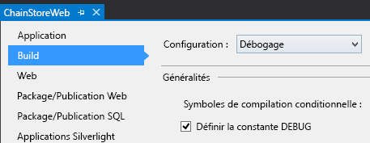
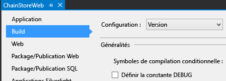

# Gestion des événements d'élément de liste dans un complément hébergé par un fournisseur
 Apprenez à gérer les événements d'élément de liste dans un Complément SharePoint complément hébergé par un fournisseur.
 Cet article est le dixième d'une série sur les concepts de base du développement de Compléments SharePoint hébergés par un fournisseur. Familiarisez-vous tout d'abord avec [Compléments](sharepoint-add-ins.md) et les articles précédents de cette série :
  
    
    


-  [Commencer à créer des compléments hébergés par un fournisseur pour SharePoint](get-started-creating-provider-hosted-sharepoint-add-ins.md)
    
  
-  [ Procédure pour donner à votre complément hébergé par un fournisseur l'apparence de SharePoint](give-your-provider-hosted-add-in-the-sharepoint-look-and-feel.md)
    
  
-  [ Insertion d'un bouton personnalisé dans un complément hébergé par un fournisseur](include-a-custom-button-in-the-provider-hosted-add-in.md)
    
  
-  [ Présentation rapide du modèle objet SharePoint](get-a-quick-overview-of-the-sharepoint-object-model.md)
    
  
-  [ Ajout d'opérations d'écriture SharePoint au complément hébergé par un fournisseur](add-sharepoint-write-operations-to-the-provider-hosted-add-in.md)
    
  
-  [ Insertion d'un composant de complément dans le complément hébergé par un fournisseur](include-an-add-in-part-in-the-provider-hosted-add-in.md)
    
  
-  [ Gestion des événements de complément dans le complément hébergé par un fournisseur](handle-add-in-events-in-the-provider-hosted-add-in.md)
    
  
-  [ Ajout d'une logique de première exécution au complément hébergé par un fournisseur](add-first-run-logic-to-the-provider-hosted-add-in.md)
    
  
-  [ Déploiement par programmation d'un bouton personnalisé dans un complément hébergé par un fournisseur](programmatically-deploy-a-custom-button-in-the-provider-hosted-add-in.md)
    
  

> **REMARQUE**
>  Si vous avez suivi cette série sur les compléments hébergés par un fournisseur, vous disposez d'une solution Visual Studio que vous pouvez continuer à utiliser avec cette rubrique. Vous pouvez également télécharger le référentiel à l'adresse [SharePoint_Provider-hosted_Add-Ins_Tutorials](https://github.com/OfficeDev/SharePoint_Provider-hosted_Add-ins_Tutorials) et ouvrir le fichier BeforeRER.sln.
  
    
    

 Dans un article précédent de cette série, vous avez vu que lorsqu'une commande est passée, elle est ajoutée à la table **Commandes** de la base de données d'entreprise, puis un élément s'y rapportant est automatiquement ajouté à la liste **Livraisons attendues**. Lorsque la commande est livrée au magasin local, un utilisateur définit la colonne **Arrivé** sur **Oui**. La modification d'une valeur de champ pour un élément crée un événement d'élément mis à jour auquel vous pouvez ajouter un gestionnaire personnalisé. Dans cet article, vous allez créer un gestionnaire pour cet événement d'élément de liste, puis le déployer par programmation dans une logique de première exécution du Complément SharePoint. Votre gestionnaire ajoute ainsi l'élément à la table **Inventaire** de la base de données d'entreprise et définit ensuite la colonne **Ajouté à l'inventaire** de la liste **Livraisons attendues** sur **Oui**. Vous allez également découvrir comment empêcher ce deuxième événement d'élément mis à jour de générer un nombre infini de séries d'événements d'élément mis à jour.
## Déploiement par programmation de la liste Livraisons attendues


> **REMARQUE**
>  Les paramètres des projets de démarrage dans Visual Studio ont tendance à revenir aux valeurs par défaut à chaque fois que la solution est rouverte. Veillez à toujours suivre les étapes ci-dessous immédiatement après la réouverture de la solution d'exemple de cette série d'articles :
  
    
    


1.  Dans l' **Explorateur de solutions**, ouvrez le fichier Utilities\\SharePointComponentDeployer.cs dans le projet **ChainStoreWeb**. Ajoutez la méthode suivante à la classe  `SharePointComponentDeployer`. Ce code n'introduit aucune fonctionnalité que vous n'avez pas déjà vue dans un article de cette série, mais notez les points suivants :
    
  -  Il définit l'attribut **Required** du champ **Quantité** Sur **TRUE**, c'est pourquoi le champ doit toujours comporter une valeur. Il définit ensuite la valeur par défaut sur 1.
    
  
  -  Les champs **Arrivé** et **Ajouté à l'inventaire** sont masqués sur le formulaire Nouvel élément.
    
  
  -  Idéalement, le champ **Ajouté à l'inventaire** doit également être masqué sur le formulaire Modifier un élément, car il doit uniquement être modifié pour être défini sur **Oui** lorsque le gestionnaire d'événements d'élément mis à jour a d'abord ajouté l'élément à la table d'entreprise **Inventaire**. Pour des raisons techniques que nous expliquerons plus tard, un champ doit être visible sur le formulaire Modifier un élément si vous souhaitez écrire dessus par programmation dans un gestionnaire d'événements d'élément mis à jour.
    
  

 ```cs
  
private static void CreateExpectedShipmentsList()
 {
    using (var clientContext = sPContext.CreateUserClientContextForSPHost())
    {
        var query = from list in clientContext.Web.Lists
                    where list.Title == "Expected Shipments"
                    select list;
        IEnumerable<List> matchingLists = clientContext.LoadQuery(query);
        clientContext.ExecuteQuery();
                   
        if (matchingLists.Count() == 0)
        {
                ListCreationInformation listInfo = new ListCreationInformation();
                listInfo.Title = "Expected Shipments";
                listInfo.TemplateType = (int)ListTemplateType.GenericList;
                listInfo.Url = "Lists/ExpectedShipments";
                List expectedShipmentsList = clientContext.Web.Lists.Add(listInfo);

                Field field = expectedShipmentsList.Fields.GetByInternalNameOrTitle("Title");
                field.Title = "Product";
                field.Update();

                expectedShipmentsList.Fields.AddFieldAsXml("<Field DisplayName='Supplier'" 
                                                            + " Type='Text' />", 
                                                            true,
                                                            AddFieldOptions.DefaultValue);
                expectedShipmentsList.Fields.AddFieldAsXml("<Field DisplayName='Quantity'" 
                                                            + " Type='Number'" 
                                                            + " Required='TRUE' >" 
                                                            + "<Default>1</Default></Field>",
                                                            true, 
                                                            AddFieldOptions.DefaultValue);
                expectedShipmentsList.Fields.AddFieldAsXml("<Field DisplayName='Arrived'" 
                                                           + " Type='Boolean'"
                                                           + " ShowInNewForm='FALSE'>"
                                                           + "<Default>FALSE</Default></Field>",
                                                            true, 
                                                            AddFieldOptions.DefaultValue);
                expectedShipmentsList.Fields.AddFieldAsXml("<Field DisplayName='Added to Inventory'" 
                                                            + " Type='Boolean'" 
                                                            + " ShowInNewForm='FALSE'>"
                                                            + "<Default>FALSE</Default></Field>", 
                                                            true, 
                                                            AddFieldOptions.DefaultValue);

                clientContext.ExecuteQuery();
        }
     }
 }
 ```

2.  Dans la méthode `DeployChainStoreComponentsToHostWeb`, ajoutez la ligne suivante, juste au-dessus de la ligne  `RemoteTenantVersion = localTenantVersion`.
    
 ```
  
CreateExpectedShipmentsList();
 ```


## Création du récepteur d'événement d'élément de liste


> **REMARQUE**
>  Si vous avez étudié cette série d'articles, vous avez déjà configuré votre environnement de développement pour le débogage de récepteurs d'événements distants. Si vous ne l'avez pas fait, consultez la rubrique relative à la [ Configuration de la solution pour le débogage de récepteurs d'événements](handle-add-in-events-in-the-provider-hosted-add-in.md#RERDebug) avant d'aller plus loin.
  
    
    

 Les Outils de développement Office pour Visual Studio comprennent un élément **Récepteur d'événements distant** qui peut être ajouté à une solution de Complément SharePoint. Cependant, au moment où cet article est rédigé, cet élément du projet suppose que la liste (auprès de laquelle le récepteur sera enregistré) se trouve sur le site web de complément, et par conséquent les outils créent un site web de complément et des artefacts SharePoint dans celui-ci. Toutefois, le récepteur du complément Chain Store va être enregistré (dans une étape ultérieure) auprès de la liste **Livraisons attendues** sur le site web hôte, de sorte que le complément n'ait pas besoin d'un site web de complément. (Pour obtenir un rappel de la distinction entre les sites web de complément et les sites web hôtes, voir [Compléments](sharepoint-add-ins.md).)
  
    
    

> **REMARQUE**
>  Les récepteurs d'événements de liste et d'élément de liste sont appelés desrécepteurs d'événements distants (RER), car leur code est distant de SharePoint et se trouve soit dans le cloud, soit dans un serveur local en dehors de la batterie de serveurs SharePoint. Cependant, les événements qui les déclenchent sont dans SharePoint.
  
    
    


1.  Dans l' **Explorateur de solutions**, cliquez avec le bouton droit sur le dossier **Services** dans le projet **ChainStoreWeb**, puis sélectionnez **Ajouter | Service WCF**.
    
  
2.  Lorsque vous y êtes invité, nommez le serviceRécepteurÉvénementsDistant1, puis appuyez sur **OK**. 
    
  
3.  Les outils créent un fichier d'interface, un fichier *.svc et un fichier code-behind. Nous n'avons pas besoin du fichier d'interface IRemoteEventReceiver1.cs, donc supprimez-le. (Il est possible que les outils se soient ouverts automatiquement. Si c'est le cas, fermez-les et supprimez-les.)
    
    > **REMARQUE**
      >  Lorsque vous avez créé les récepteurs d'événements de complément pour les événements installés et de désinstallation dans le cadre d'un autre article de cette série, les Outils de développement Office pour Visual Studio ont ajouté leurs URL au fichier manifeste d'application. Les récepteurs d'événements de liste et d'élément de liste ne sont pas enregistrés dans le manifeste d''application. Au lieu de cela, ils sont enregistrés par programmation dans un complément hébergé par un fournisseur. Vous réaliserez cette opération à une étape ultérieure.
4.  Ouvrez le fichier code-behind RemoteEventReceiver1.svc.cs. Remplacez l'ensemble de son contenu par le code suivant. Notez ce qui suit à propos de ce code :
    
  -  L'interface `IRemoteEventService` est définie dans l'espace de noms **Microsoft.SharePoint.Client.EventReceivers**.
    
  
  -  Aucun événement préalable ne sera géré dans le complément Chain Store, mais la méthode **ProcessEvent** est requise par l'interface `IRemoteEventService`.
    
  

 ```cs
  using System;
using System.Collections.Generic;
using Microsoft.SharePoint.Client;
using Microsoft.SharePoint.Client.EventReceivers;
using System.Data.SqlClient;
using System.Data;
using ChainStoreWeb.Utilities;

namespace ChainStoreWeb.Services
{
    public class RemoteEventReceiver1 : IRemoteEventService
    {
        /// <summary>
        /// Handles events that occur before an action occurs, 
        /// such as when a user is adding or deleting a list item.
        /// </summary>
        /// <param name="properties">Holds information about the remote event.</param>
        /// <returns>Holds information returned from the remote event.</returns>
        public SPRemoteEventResult ProcessEvent(SPRemoteEventProperties properties)
        {
            throw new NotImplementedException();
        }

        /// <summary>
        /// Handles events that occur after an action occurs, 
        /// such as after a user adds an item to a list or deletes an item from a list.
        /// </summary>
        /// <param name="properties">Holds information about the remote event.</param>
        public void ProcessOneWayEvent(SPRemoteEventProperties properties)
        {

        }
    }
}
 ```

5.  Ajoutez le code suivant à la méthode `ProcessOneWayEvent`. Notez que l'événement **ItemUpdated** est le seul événement géré par cet exemple, c'est pourquoi nous aurions pu utiliser une structure **if** simple au lieu d'une structure **switch**. Toutefois, les récepteurs d'événements gèrent généralement plusieurs événements, nous souhaitons donc vous présenter le modèle que vous allez utiliser le plus souvent dans vos gestionnaires d'événements en tant que développeur de complément SharePoint.
    
 ```cs
  
switch (properties.EventType)
{
    case SPRemoteEventType.ItemUpdated:

        // TODO12: Handle the item updated event.
                    
        break;
}  
 ```

6.  Remplacez `TODO12` par le code suivant. Ici encore, nous utilisons une structure **switch** alors qu'une structure **if** simple suffirait, car nous souhaitons que vous voyiez le modèle courant dans les récepteurs d'événements SharePoint.
    
 ```cs
  
switch (properties.ItemEventProperties.ListTitle)
{
    case "Expected Shipments":

        // TODO13: Handle the arrival of a shipment.

        break;
}
 ```

7.  Le code qui répond à l'arrivée d'une livraison doit générer deux opérations :
    
  -  Ajouter l'élément qui est arrivé au magasin dans l'inventaire de l'entreprise.
    
  
  -  Définir le champ **Ajouté à l'inventaire** de la liste **Livraisons attendues** sur **Oui**. Cela doit se produire uniquement si l'élément a été ajouté à l'inventaire.
    
  

     Ajoutez le code suivant à la place de `TODO13`. Les deux méthodes,  `TryUpdateInventory` et `RecordInventoryUpdateLocally`, sont créées dans des étapes ultérieures.
    


 ```cs
  
bool updateComplete = TryUpdateInventory(properties);
if (updateComplete)
{
    RecordInventoryUpdateLocally(properties);
}
 ```


     La méthode `ProcessOneWayEvent` doit désormais se présenter de la façon suivante :
    


 ```cs
  
public void ProcessOneWayEvent(SPRemoteEventProperties properties)
{
    switch (properties.EventType)
    {
        case SPRemoteEventType.ItemUpdated:

            switch (properties.ItemEventProperties.ListTitle)
            {
                case "Expected Shipments":
                    bool updateComplete = UpdateInventory(properties);
                    if (updateComplete)
                    {
                        RecordInventoryUpdateLocally(properties);
                    }
                    break;
            }
            break;
    }          
}
 ```

8.  Ajoutez la méthode suivante à la classe `RemoteEventReceiver1`.
    
 ```cs
  
private bool TryUpdateInventory(SPRemoteEventProperties properties)
{
    bool successFlag = false;

        // TODO14: Test whether the list item is changing because the product has arrived
        // or for some other reason. If the former, add it to the inventory and set the success flag
        // to true.     

    return successFlag;
}
 ```

9.  Il existe cinq colonnes sur la liste **Livraisons attendues**, mais le gestionnaire ne doit pas réagir à tous les types de mises à jour apportées à un élément. Par exemple, si un utilisateur corrige l'orthographe du nom d'un fournisseur, l'événement d'élément mis à jour est déclenché, mais le gestionnaire ne doit rien faire. Il doit intervenir uniquement lorsque le champ **Arrivé** vient d'être défini sur **Oui**. 
    
     Il existe une autre condition qui doit être testée. Supposons que le champ **Arrivé** est défini sur **Oui** et que le produit de l'élément est ajouté à l'inventaire (le champ **Ajouté à l'inventaire** est donc défini sur **Oui**), mais que plus tard, un utilisateur modifie par erreur le champ **Arrivé** sur **Non**, puis qu'il corrige son erreur en définissant à nouveau le champ **Arrivé** sur Oui. L'erreur et la correction déclenchent toutes deux l'événement d'élément mis à jour. Le gestionnaire ne réagit pas à l'erreur, car il agit uniquement lorsque le champ **Arrivé** est défini sur **Oui**, mais il réagit à la correction qui définit le champ **Arrivé** sur **Oui**, de sorte que le même produit et la même quantité sont ajoutés à l'inventaire une deuxième fois. Pour cette raison, le gestionnaire doit agir uniquement lorsque la valeur **Ajouté à l'inventaire** est **Non**. 
    
     Par conséquent, le gestionnaire doit connaître la nature des valeurs de ces champs juste après la mise à jour de l'élément par un utilisateur. L'objet **SPRemoteEventProperties** dispose d'une propriété **ItemEventProperties**, ainsi que d'une propriété **AfterProperties** qui contient les valeurs des champs de l'élément mis à jour. Le code suivant utilise ces propriétés afin de tester si le gestionnaire doit réagir. Remplacez l'élément `TODO14` par ce code.
    


 ```cs
  
var arrived = Convert.ToBoolean(properties.ItemEventProperties.AfterProperties["Arrived"]);
var addedToInventory = Convert.ToBoolean(properties.ItemEventProperties.AfterProperties["Added_x0020_to_x0020_Inventory"]);

if (arrived &amp;&amp; !addedToInventory)
{

    // TODO15: Add the item to inventory

    successFlag = true;
}
 ```

10.  Remplacez l'élément `TODO15` par le code suivant. Il s'agit essentiellement de programmation SQL et ASP.NET, c'est pourquoi nous n'allons pas en parler dans le détail, mais notez les points suivants :
    
  -  Nous utilisons la propriété **ItemEventProperties.WebUrl** pour obtenir le nom du client, qui correspond à l'URL du site web hôte.
    
  
  -  Nous utilisons à nouveau la propriété **AfterProperties** pour obtenir les valeurs en matière de quantité et de nom du produit.
    
  
  -  Nous faisons référence au champ de nom de produit en tant que « Titre », même si le nom d'affichage a été modifié en « Produit » (dans la méthode `CreateExpectedShipmentsList`), car il est toujours fait référence aux champs par leur nom interne.
    
  

 ```cs
  
using (SqlConnection conn = SQLAzureUtilities.GetActiveSqlConnection())
using (SqlCommand cmd = conn.CreateCommand())
{
    conn.Open();
    cmd.CommandText = "UpdateInventory";
    cmd.CommandType = CommandType.StoredProcedure;
    SqlParameter tenant = cmd.Parameters.Add("@Tenant", SqlDbType.NVarChar);
    tenant.Value = properties.ItemEventProperties.WebUrl + "/";
    SqlParameter product = cmd.Parameters.Add("@ItemName", SqlDbType.NVarChar, 50);
    product.Value = properties.ItemEventProperties.AfterProperties["Title"]; // not "Product"
    SqlParameter quantity = cmd.Parameters.Add("@Quantity", SqlDbType.SmallInt);
    quantity.Value = Convert.ToUInt16(properties.ItemEventProperties.AfterProperties["Quantity"]);
    cmd.ExecuteNonQuery();
}
 ```


     Nous n'avons pas encore terminé de créer la méthode `TryUpdateInventory`, mais à ce stade elle doit se présenter comme suit.
    


 ```cs
  
private bool TryUpdateInventory(SPRemoteEventProperties properties)
{
    bool successFlag = false;

    var arrived = Convert.ToBoolean(properties.ItemEventProperties.AfterProperties["Arrived"]);
    var addedToInventory = Convert.ToBoolean(properties.ItemEventProperties.AfterProperties["Added_x0020_to_x0020_Inventory"]);

    if (arrived &amp;&amp; !addedToInventory)
    {
        using (SqlConnection conn = SQLAzureUtilities.GetActiveSqlConnection())
        using (SqlCommand cmd = conn.CreateCommand())
        {
            conn.Open();
            cmd.CommandText = "UpdateInventory";
            cmd.CommandType = CommandType.StoredProcedure;
            SqlParameter tenant = cmd.Parameters.Add("@Tenant", SqlDbType.NVarChar);
            tenant.Value = properties.ItemEventProperties.WebUrl + "/";
            SqlParameter product = cmd.Parameters.Add("@ItemName", SqlDbType.NVarChar, 50);
            product.Value = properties.ItemEventProperties.AfterProperties["Title"]; // not "Product"
            SqlParameter quantity = cmd.Parameters.Add("@Quantity", SqlDbType.SmallInt);
            quantity.Value = Convert.ToUInt16(properties.ItemEventProperties.AfterProperties["Quantity"]);
            cmd.ExecuteNonQuery();
        }            
        successFlag = true;
    }  
    return successFlag;
}
 ```

11.  Lorsque la méthode `TryUpdateInventory` renvoie **true**, notre gestionnaire appelle une méthode (pas encore écrite) qui met à jour le même élément dans la liste **Livraisons attendues** en définissant le champ **Ajouté à l'inventaire** sur **Oui**. Il s'agit en soi d'un événement d'élément mis à jour, c'est pourquoi le gestionnaire est appelé à nouveau. (Le fait que le champ **Ajouté à l'inventaire** soit désormais défini sur **Oui** empêche le gestionnaire d'ajouter la même livraison à l'inventaire une deuxième fois, mais il est tout de même appelé.)
    
     Cependant, SharePoint se comporte différemment lorsque l'événement d'élément mis à jour est déclenché par une mise à jour de programmation : *il comprend uniquement, dans la propriété **AfterProperties**, les champs modifiés dans la mise à jour.*  Par conséquent, le champ **Arrivé** n'apparaît pas, car seul le champ **Ajouté à l'inventaire** a été modifié. La ligne
    
     `var arrived = Convert.ToBoolean(properties.ItemEventProperties.AfterProperties["Arrived"]);`
    
     génère une exception **KeyNotFoundException**. 
    
     Il existe plusieurs moyens de résoudre ce problème. Dans cet exemple, nous allons maintenant intercepter l'exception et utiliser le bloc **catch** pour s'assurer que l'élément `successFlag` est défini sur **false**. Cette opération permet de garantir que l'élément n'est pas mis à jour une troisième fois.
    
     Placez tous les éléments de la méthode compris entre la première ligne, `bool successFlag = false;`, et la dernière ligne,  `return successFlag;`, dans un bloc **try**.
    
  
12.  Ajoutez le bloc **catch** suivant juste en dessous du bloc **try**.
    
 ```cs
  
catch (KeyNotFoundException)
{
    successFlag = false;
}
 ```


    > **REMARQUE**
      >  L'exception **KeyNotFoundException** est également la raison pour laquelle nous avons laissé le champ **Ajouté à l'inventaire** visible sur le formulaire Modifier l'élément. SharePoint n'inclut pas les champs masqués du formulaire Modifier l'élément dans **AfterProperties**. 

     La méthode doit désormais se présenter comme suit.
    


 ```cs
  
private bool TryUpdateInventory(SPRemoteEventProperties properties)
{
    bool successFlag = false;
    
    try 
    {
        var arrived = Convert.ToBoolean(properties.ItemEventProperties.AfterProperties["Arrived"]);
        var addedToInventory = Convert.ToBoolean(properties.ItemEventProperties.AfterProperties["Added_x0020_to_x0020_Inventory"]);

        if (arrived &amp;&amp; !addedToInventory)
        {
            using (SqlConnection conn = SQLAzureUtilities.GetActiveSqlConnection())
            using (SqlCommand cmd = conn.CreateCommand())
            {
                conn.Open();
                cmd.CommandText = "UpdateInventory";
                cmd.CommandType = CommandType.StoredProcedure;
                SqlParameter tenant = cmd.Parameters.Add("@Tenant", SqlDbType.NVarChar);
                tenant.Value = properties.ItemEventProperties.WebUrl + "/";
                SqlParameter product = cmd.Parameters.Add("@ItemName", SqlDbType.NVarChar, 50);
                product.Value = properties.ItemEventProperties.AfterProperties["Title"]; // not "Product"
                SqlParameter quantity = cmd.Parameters.Add("@Quantity", SqlDbType.SmallInt);
                quantity.Value = Convert.ToUInt16(properties.ItemEventProperties.AfterProperties["Quantity"]);
                cmd.ExecuteNonQuery();
            }            
            successFlag = true;
        }  
    }
    catch (KeyNotFoundException)
    {
        successFlag = false;
    }
    return successFlag;
}
 ```

13.  Ajoutez la méthode suivante à la classe `RemoteEventReceiver1`. À présent, ce modèle de code ressemble à celui des articles précédents de cette série. Toutefois, il convient de noter une différence. Le code obtient l'objet **ClientContext** en appelant la méthode **TokenHelper.CreateRemoteEventReceiverClientContext** au lieu de la méthode **SharePointContext.CreateUserClientContextForSPHost**, que nous avons utilisée dans le code pour appeler SharePoint à partir de pages, telles que la page EmployeeAdder. La principale raison d'utiliser différentes méthodes pour obtenir un objet **ClientContext** réside dans le fait que SharePoint transmet les informations nécessaires pour créer ces objets différemment aux récepteurs d'événements et aux pages. Pour les récepteurs d'événements, il transmet un objet **SPRemoteEventProperties**, mais pour les pages, il transmet un champ spécifique, appelé jeton de contexte, dans le corps de la demande qui lance la page de complément.
    
 ```cs
  
private void RecordInventoryUpdateLocally(SPRemoteEventProperties properties)
{
    using (ClientContext clientContext = TokenHelper.CreateRemoteEventReceiverClientContext(properties))
    {
        List expectedShipmentslist = clientContext.Web.Lists.GetByTitle(properties.ItemEventProperties.ListTitle);
        ListItem arrivedItem = expectedShipmentslist.GetItemById(properties.ItemEventProperties.ListItemId);
        arrivedItem["Added_x0020_to_x0020_Inventory"] = true;
        arrivedItem.Update();
        clientContext.ExecuteQuery();
    }
}
 ```

14.  Enregistrez et fermez le fichier de code de récepteur.
    
  

## Inscription du récepteur

 La dernière tâche consiste à indiquer à SharePoint que nous disposons d'un récepteur personnalisé que SharePoint doit appeler chaque fois qu'un élément de la liste **Livraisons attendues** est mis à jour.
  
    
    

1.  Ouvrez le fichier SharePointContentDeployer.cs et ajoutez la ligne suivante à la méthode `DeployChainStoreComponentsToHostWeb`, juste en dessous de la ligne qui crée la liste **Livraisons attendues**. Nous allons ajouter cette méthode à l'étape suivante. Notez que nous transmettons à la méthode l'objet **HttpRequest** qui a été transmis à la méthode `DeployChainStoreComponentsToHostWeb` par la page d'accueil du complément.
    
 ```cs
  
RegisterExpectedShipmentsEventHandler(request);
 ```

2.  Ajoutez la méthode suivante à la classe `SharePointComponentDeployer`. 
    
 ```cs
  private static void RegisterExpectedShipmentsEventHandler(HttpRequest request)
{
    using (var clientContext = sPContext.CreateUserClientContextForSPHost())    
    {
        var query = from list in clientContext.Web.Lists
                    where list.Title == "Expected Shipments"
                    select list;
        IEnumerable<List> matchingLists = clientContext.LoadQuery(query);
        clientContext.ExecuteQuery();

        List expectedShipmentsList = matchingLists.Single();

        // TODO16: Add the event receiver to the list's collection of event receivers.       

        clientContext.ExecuteQuery();
    }
}
 ```

3.  Remplacez l'élément `TODO16` par les lignes suivantes. Notez qu'il existe une classe ***CreationInformation** non activable pour les récepteurs d'événements, comme pour les listes et les éléments de liste.
    
 ```cs
  
EventReceiverDefinitionCreationInformation receiver = new EventReceiverDefinitionCreationInformation();
receiver.ReceiverName = "ExpectedShipmentsItemUpdated";
receiver.EventType = EventReceiverType.ItemUpdated;

 // TODO17: Set the URL of the receiver.

expectedShipmentsList.EventReceivers.Add(receiver);

 ```

4.  Maintenant, vous devez indiquer l'URL du récepteur d'événements à SharePoint. Dans l'environnement de production, elle appartiendra au même domaine que les pages distantes, avec le chemin d'accès /Services/RemoteEventReceiver1.svc. Étant donné que le gestionnaire est inscrit dans la logique de première exécution à partir de la page d'accueil du complément, le domaine se trouve dans l'en-tête hôte de l'objet **HttpRequest** pour la demande qui a appelé la page. Notre code a transmis cet objet à partir de la page à la méthode `DeployChainStoreComponentsToHostWeb`, qui l'a à son tour transmis à la méthode  `RegisterExpectedShipmentsEventHandler`. Par conséquent, nous pouvons définir les URL du récepteur à l'aide du code suivant.
    
     `receiver.ReceiverUrl = "https://" + request.Headers["Host"] + "/Services/RemoteEventReceiver1.svc";`
    
     Malheureusement, cela ne fonctionne pas lorsque vous déboguez le complément à partir de Visual Studio. Lorsque vous réalisez un débogage, le récepteur est hébergé dans le bus des services Azure, pas dans l'URL d'hôte local où sont hébergées les pages distantes. Nous devons définir des URL distinctes pour le récepteur selon que nous réalisons un débogage ou non. Par conséquent, remplacez l'élément `TODO17` par la structure suivante, qui utilise les directives du compilateur Visual C#. Notez qu'en mode débogage, l'URL du récepteur est lue à partir d'un paramètre web.config. *Vous allez créer ce paramètre à une étape ultérieure.* 
    


 ```cs
  
#if DEBUG
                    receiver.ReceiverUrl = WebConfigurationManager.AppSettings["RERdebuggingServiceBusUrl"].ToString();
#else
                    receiver.ReceiverUrl = "https://" + request.Headers["Host"] + "/Services/RemoteEventReceiver1.svc"; 
#endif

 ```


     L'ensemble de la méthode `RegisterExpectedShipmentsEventHandler` doit désormais se présenter de la façon suivante.
    


 ```cs
  
private static void RegisterExpectedShipmentsEventHandler(HttpRequest request)
{    
    using (var clientContext = sPContext.CreateUserClientContextForSPHost())
    {
        var query = from list in clientContext.Web.Lists
		            where list.Title == "Expected Shipments"
		            select list;
        IEnumerable<List> matchingLists = clientContext.LoadQuery(query);
        clientContext.ExecuteQuery();

        List expectedShipmentsList = matchingLists.Single();

        EventReceiverDefinitionCreationInformation receiver = new EventReceiverDefinitionCreationInformation();
        receiver.ReceiverName = "ExpectedShipmentsItemUpdated";
        receiver.EventType = EventReceiverType.ItemUpdated;

#if DEBUG
        receiver.ReceiverUrl = WebConfigurationManager.AppSettings["RERdebuggingServiceBusUrl"].ToString();
#else
        receiver.ReceiverUrl = "https://" + request.Headers["Host"] + "/Services/RemoteEventReceiver1.svc"; 
#endif
        expectedShipmentsList.EventReceivers.Add(receiver);
        clientContext.ExecuteQuery();
    }
}
 ```

5.  Ajoutez l'instruction **using** suivante en haut du fichier.
    
 ```cs
  
using System.Web.Configuration;
 ```

6.  Pour vous assurer que l'élément `DEBUG` est True si et seulement si le complément est en cours de débogage, suivez la sous-procédure ci-dessous :
    
1.  Dans l' **Explorateur de solutions**, cliquez avec le bouton droit sur le projet **ChainStoreWeb** et sélectionnez **Propriétés**.
    
  
2.  Ouvrez l'onglet **Générer** de l'élément **Propriétés**, puis sélectionnez **Déboguer** dans la liste déroulante ** Configuration**.
    
  
3.  Assurez-vous que la case **Définir la constante DEBUG** est activée. (Généralement, elle est activée par défaut.) La capture d'écran ci-dessous présente le paramétrage correct.
    
     
  

  

  
4.  Modifiez la liste déroulante **Configuration** en **Mise en production**, puis assurez-vous que la case **Définir la constante DEBUG** est ** *désactivée* **. (Généralement, elle est activée par défaut.) La capture d'écran ci-dessous présente le paramétrage correct.
    
     
  

  

  
5.  Si vous avez apporté des modifications, enregistrez et fermez l'onglet **Propriétés**.
    
  
7.  Ouvrez le fichier web.config et ajoutez le balisage suivant comme enfant de l'élément **appSettings**. Nous obtiendrons la valeur du paramètre dans la section suivante.
    
 ```XML
  <add key="RERdebuggingServiceBusUrl" value="" />
 ```


## Obtention de l'URL du récepteur pour le débogage

 Les récepteurs d'événements de complément et d'élément de liste sont des services WCF (Windows Communication Service). Chaque service WCF connaît son propre point de terminaison et le stocke à plusieurs endroits, y compris dans l'objet **System.ServiceModel.OperationContext.Current.Channel.LocalAddress.Uri**. Lorsque vous réalisez le débogage, le récepteur de complément est hébergé sur un point de terminaison du bus des services Azure qui est presque identique à celui du récepteur d'élément de liste. La différence réside dans le fait que l'URL du point de terminaison du complément se termine par « AppEventReceiver.svc » et que l'URL des récepteurs d'élément de liste se termine par « RemoteEventReceiver1.svc ». Nous pouvons obtenir l'URL du point de terminaison dans le récepteur de complément, modifier légèrement la fin de celle-ci, puis l'utiliser comme valeur du paramètre **RERdebuggingServiceBusUrl** web.config.
  
    
    

1.  Ouvrez le fichier AppEventReceiver.svc.cs dans le dossier **Services** du projet **ChainStoreWeb**.
    
  
2.  Ajoutez la ligne suivante en tant que toute première ligne de la méthode **ProcessEvent**.
    
 ```cs
  string debugEndpoint = System.ServiceModel.OperationContext.Current.Channel.LocalAddress.Uri.ToString(); 
 ```

3.  Ajoutez un point d'arrêt sur la ligne suivant la méthode.
    
  
4.  Appuyez sur F5 pour déboguer le complément. Étant donné que le fichier web.config est ouvert et que les Outils de développement Office pour Visual Studio modifient un de ses paramètres chaque fois que vous appuyez sur F5, vous serez invité à le recharger. Sélectionnez **Applications**. 
    
  
5.  Lorsque le point d'arrêt est atteint, placez le curseur sur la variable `debugEndpoint`. Lorsque la fenêtre Bulle d'informations Visual Studio apparaît, cliquez sur la flèche vers le bas et sélectionnez **Visualiseur de texte**.
    
     
  

  

  
6.  Copiez la valeur de chaîne du visualiseur et copiez-la quelque part.
    
  
7.  Fermez le visualiseur, puis arrêtez le débogage dans Visual Studio.
    
  
8.  Supprimez ou commentez la ligne que vous avez ajoutée lors de la deuxième étape de cette procédure, puis supprimez également le point d'arrêt.
    
  
9.  Dans la chaîne que vous avez copiée, remplacez l'élément final « AppEventReceiver.svc » par « RemoteEventReceiver1.svc ».
    
  
10.  Copiez et collez l'URL modifiée en tant que valeur de la clé **RERdebuggingServiceBusUrl** dans le fichier web.config.
    
  

> **REMARQUE**
>  Lors du débogage d'un récepteur d'événements distant, le fait de copier manuellement l'URL du bus de services et de la coller (version modifiée) dans le fichier web.config ne constitue pas la seule façon de répondre à la nécessité d'une URL différente de celle utilisée lors de l'exécution en production.>  Il est possible de stocker par programmation la valeur de l'élément **System.ServiceModel.OperationContext.Current.Channel.LocalAddress.Uri** quelque part dans SharePoint ou sur la base de données distante, de la faire lire par le code de première exécution, puis de l'attribuer à la propriété `receiver.ReceiverUrl`. >  Nous pouvons inscrire le récepteur d'événements d'élément de liste dans le cadre du gestionnaire d'événements de complément installé. Ensuite, nous pouvons lire par programmation l'élément **System.ServiceModel.OperationContext.Current.Channel.LocalAddress.Uri**, le modifier et l'attribuer à l'élément  `receiver.ReceiverUrl` sans avoir à le stocker quelque part. Cette stratégie nécessite que la liste **Livraisons attendues** ait également été créée dans le gestionnaire d'événements de complément installé, car elle doit exister avant que le gestionnaire puisse s'inscrire auprès d'elle. Notez également que nous pouvons combiner notre récepteur d'événements de complément à un récepteur d'événements d'élément de liste afin d'obtenir un seul récepteur (autrement dit, les mêmes fichiers .svc et .svc.cs). Dans ce cas, aucune modification de l'URL n'est nécessaire avant de l'utiliser comme valeur de l'élément `receiver.ReceiverUrl`. 
  
    
    


## Exécution du complément et test du récepteur d'éléments de liste


  
    
    

1.  Ouvrez la page **Contenu du site** du site web du magasin de Hong Kong *et supprimez la liste **Livraisons attendues** s'il en existe une.* 
    
  
2.  Utilisez la touche F5 pour déployer et exécuter votre complément. Visual Studio héberge l'application web distante dans IIS Express et héberge la base de données SQL dans SQL Express. Il réalise également une installation temporaire du complément sur votre site SharePoint de test et l'exécute immédiatement. Vous êtes invité à accorder des autorisations au complément avant l'ouverture de sa page d'accueil.
    
  
3.  Lorsque la page d'accueil du complément s'ouvre, cliquez sur le bouton **Retour au site** qui se trouve dans la partie supérieure du contrôle Chrome.
    
  
4.  À partir de la page d'accueil du magasin de Hong Kong, accédez à la page **Contenu du site** et ouvrez la liste **Livraisons attendues**.
    
  
5.  Créez un élément sur le formulaire des nouveaux éléments. Notez que les champs **Arrivé** et **Ajouté à l'inventaire** ne figurent pas dans le formulaire.
    
  
6.  Une fois que l'élément est créé, ouvrez-le à nouveau pour le modifier. Activez la case **Arrivé** et enregistrez l'élément. Cela déclenche l'événement d'élément mis à jour. L'élément est ajouté à l'inventaire et la valeur du champ **Ajouté à l'inventaire** est modifiée pour être définie sur **Oui**. (Il est possible que vous deviez actualiser la page pour voir la modification du champ **Ajouté à l'inventaire**.)
    
  
7.  Utilisez le bouton de retour du navigateur jusqu'à vous retrouver sur la page d'accueil du complément Chain Store, puis cliquez sur le bouton **Afficher l'inventaire**. L'article que vous avez marqué comme **Arrivé** est maintenant répertorié.
    
  
8.  Revenez à la liste **Livraisons attendues** et ajoutez un autre élément *avec exactement le même nom de produit et nom de fournisseur*  , mais avec une quantité différente.
    
  
9.  Une fois que l'élément est créé, ouvrez-le à nouveau pour le modifier. Définissez le champ **Arrivé** sur **Oui** et enregistrez l'élément.
    
  
10.  Utilisez le bouton de retour du navigateur jusqu'à vous retrouver sur la page d'accueil du complément Chain Store, puis cliquez sur le bouton **Afficher l'inventaire**. Il y a toujours un seul élément pour le nom de produit et de fournisseur, mais la quantité correspond maintenant au total des deux éléments de la liste **Livraisons attendues**.
    
  
11. Pour mettre fin à la session de débogage, fermez la fenêtre du navigateur ou arrêtez le débogage dans Visual Studio. Chaque fois que vous appuyez sur F5, Visual Studio retire la version précédente du complément et installe la plus récente.
    
  
12. Vous allez travailler avec ce complément et la solution Visual Studio dans d'autres articles. Il est donc recommandé de retirer le complément une dernière fois lorsque vous avez terminé de travailler et n'allez pas le réutiliser pendant un moment. Cliquez avec le bouton droit de la souris sur le projet dans l' **Explorateur de solutions** et choisissez **Retirer**.
    
  

## 
<a name="Nextsteps"> </a>

 Voir [Déploiement et installation de compléments pour SharePoint : méthodes et options](deploying-and-installing-sharepoint-add-ins-methods-and-options.md) pour découvrir comment publier votre complément sur un site SharePoint. Sinon, allez plus loin dans le développement de compléments SharePoint avec les nœuds MSDN suivants :
  
    
    

-  [Concevoir des compléments pour SharePoint](design-sharepoint-add-ins.md)
    
  
-  [Développer des compléments pour SharePoint](develop-sharepoint-add-ins.md)
    
  
-  [Publier des compléments pour SharePoint](publish-sharepoint-add-ins.md)
    
  
-  [Outils et environnement de développement de compléments pour SharePoint](tools-and-environments-for-developing-sharepoint-add-ins.md)
    
  

