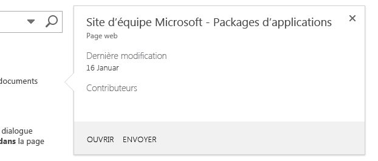
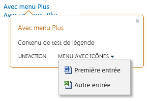

# Mettre du contenu en surbrillance et améliorer les fonctionnalités des compléments hébergés sur SharePoint avec le contrôle de légende
Le contrôle de légende SharePoint fournit une méthode flexible pour interagir avec votre utilisateur et montrer les fonctionnalités de votre application hébergée sur SharePoint. Vous pouvez le configurer de différentes façons pour l'adapter à l'interface utilisateur de votre application. Cet article vous explique comment construire ce contrôle, l'ajouter à votre page et personnaliser son apparence et son comportement.Quand vous effectuez des recherches dans un site SharePoint 2013, vous verrez des exemples de contrôle de légende, car il s'affiche quand vous pointez sur un résultat de recherche. La figure 1 affiche la légende pour un résultat de recherche et certains éléments d'un contrôle de contenu : un titre, des informations sur l'élément dans la page et des actions ( **Ouvrir** et **Envoyer**) que vous pouvez effectuer sur l'élément. Dans ce cas, les informations et les actions sont assez simples, mais déjà deux avantages se dessinent. Tout d'abord, il vous permet d'afficher des informations supplémentaires sur les éléments d'une page quand ils sont nécessaires, ensuite il vous permet d'ajouter des fonctionnalités à la page. 
**Figure 1. Exemple de contrôle de légende sur une page de résultats de la recherche SharePoint 2013**

  
    
    

  
    
    

  
    
    

  
    
    

  
    
    

## Rendre le contrôle disponible à votre page HTML en incluant le fichier callout.js
<a name="GettingStarted"> </a>

Cet exemple utilise la méthode  `SP.SOD.executeFunc` pour garantir le chargement du fichier de script avant l'exécution de code qui en dépend.
  
    
    

```

SP.SOD.executeFunc("callout.js", "Callout", function () {
    });
```

La fonction que vous passez à la fonction  `SP.SOD.executeFunc` contient le code que vous voulez exécuter après le chargement du fichier callout.js. Après avoir chargé ces fichiers, vous utilisez l'objet `CalloutManager` pour créer un objet `Callout` pour chaque élément de page associé à un contrôle de légende. `CalloutManager` est un singleton qui stocke les références à chaque objet `Callout` dans une page dans un tableau associatif. L'objet `Callout` n'a que deux membres requis : `ID` et `launchPoint`. Le membre  `ID` est la clé mappée à l'objet `Callout` dans `CalloutManager`:  `CalloutManager["value of the callout's ID member"]`. Le membre  `launchPoint` est un élément de page HTML. Vous pouvez, par exemple, créer ou obtenir un élément `div` dans votre page et le passer en tant que membre de l'objet `Callout`. Par défaut, le contrôle de légende s'affiche quand un utilisateur clique sur l'élément  `launchPoint`. Cet exemple montre comment créer le contrôle de légende le plus simple possible avec uniquement deux membres requis et une chaîne de titre.
  
    
    



```

var calloutPageElement = document.createElement("div");
var callout = CalloutManager.createNew({
   ID: "unique identifier",
   launchPoint: calloutPageElement,
   title: "callout title"
});

```

Cette légende spécifique est contextuelle et affiche un titre en haut du contrôle quand un utilisateur clique sur l'élément de page. Vous utilisez les membres facultatifs pour personnaliser l'apparence, le comportement, l'emplacement et les actions du contrôle de façon très puissante. Le contrôle de légende utilise également une méthode set pour définir une valeur pour n'importe quel paramètre une fois l'instance d'un contrôle créée.
  
    
    



```

callout.set({openOptions:{event: "hover"}});
```

Vous pouvez également définir des valeurs pour les membres de légende dans un objet  `CalloutOptions`, puis passer cet objet à la méthode  `createNew`.
  
    
    



```
var calloutPageElement = document.createElement("div");
var calloutOptions = new CalloutOptions();
calloutOptions.ID = unique identifier;
calloutOptions.launchPoint = calloutPageElement;
calloutOptions.title = callout title;
var callout = CalloutManager.createNew(calloutOptions);
```


## Comment personnaliser l'apparence du contrôle de légende
<a name="Appearance"> </a>

Vous utilisez les membres suivants pour contrôler l'affichage de la légende.
  
    
    


|**Membre**|**Objectif**|**Valeurs valides (valeur par défaut en gras)**|
|:-----|:-----|:-----|
|title  <br/> |Afficher un titre en haut du contrôle.  <br/> |chaîne, **null**, chaîne contenant du HTML <br/> |
|content  <br/> |Afficher du code HTML dans le contrôle quand le membre  `contentElement` n'a pas de valeur. <br/> |chaîne contenant du HTML, **null**, doit être null si `contentElement` a une valeur <br/> |
|contentElement  <br/> |Afficher un élément HTML dans le contrôle quand le membre  `content` n'a pas de valeur. <br/> |n'importe quel élément HTML, **null**, doit être null si `content` a une valeur <br/> |
|contentWidth  <br/> |Indiquer la largeur, en pixels, du conteneur de corps de la légende. Ce conteneur utilise également une bordure de 1 pixel et une marge intérieure de 15 pixels de chaque côté : le contrôle est donc plus large de 32 pixels par rapport à la largeur que vous indiquez. La propriété CSS  `overflow` du contrôle a la valeur `hidden`, afin que votre contenu soit tronqué s'il ne s'ajuste pas à la largeur que vous spécifiez. Si vous définissez ce membre dans une légende ouverte, la modification sera immédiate. Cela n'est pas le cas pour d'autres membres.  <br/> |N'importe quelle valeur comprise entre 240 et 610, **350** (largeur par défaut de 382 pixels pour le contrôle) <br/> |
|beakOrientation  <br/> |Indiquer l'orientation du bec ou du pointeur du contrôle de légende.  <br/> |**topBottom**, pour ressembler à la Figure 2 : **Figure 2. Emplacement du bec du contrôle de légende avec une orientation de haut en bas**!\[Emplacement du contrôle de légende avec une orientation de haut en bas.](images/SP15_CalloutTopBottom.png) **leftRight**, pour ressembler à la Figure 3 : **Figure 3. Emplacement du bec du contrôle de légende avec une orientation de gauche à droite**!\[Emplacement du contrôle de légende avec une orientation de gauche à droite](images/SP15_CalloutLeftRight.png)|
   

## Comment personnaliser le comportement du contrôle de légende
<a name="Behavior"> </a>

Vous pouvez utiliser les membres suivants pour contrôler le comportement de la légende. Commencez par le membre  `openOptions` (important) car il vous permet d'indiquer la façon dont le contrôle s'ouvrira et se fermera lors d'une interaction de l'utilisateur dans la page.
  
    
    


|**Utilisez ces valeurs pour le membre  `openOptions`**|**Objectif**|
|:-----|:-----|
|**{event: "click", closeCalloutOnBlur: true}** <br/> |Faire apparaître le contrôle de légende quand l'utilisateur clique sur l'élément  `launchPoint` avec une souris et fermer le contrôle quand un utilisateur éloigne la souris de l'élément `launchPoint`. Dans la mesure où la valeur de  `event` est `click`, la valeur de l'option  `showCloseButton` est **true** par défaut et ne peut pas être modifiée. Il s'agit de la combinaison de valeurs par défaut. <br/> |
| `{event: "hover", showCloseButton: true}` <br/> |Faire apparaître le contrôle de légende quand l'utilisateur pointe sur l'élément  `launchPoint` avec une souris et fermer le contrôle quand l'utilisateur clique sur le bouton **X** dans le coin supérieur droit du contrôle. Dans la mesure où la valeur de `event` est `hover`, la valeur de  `closeCalloutOnBlur` n'est pas applicable et ne peut pas être définie. <br/> |
| `{event: "click", closeCalloutOnBlur: false}` <br/> |Faire apparaître le contrôle de légende quand l'utilisateur pointe sur l'élément  `launchPoint` avec une souris et fermer le contrôle uniquement quand l'utilisateur clique sur le bouton **X** dans le coin supérieur droit du contrôle. Dans la mesure où la valeur de `event` est `click`, la valeur de l'option  `showClosebutton` est **true** par défaut et ne peut pas être changée. <br/> |
   
Vous trouverez ci-dessous les autres membres que vous pouvez définir pour contrôler le comportement de la légende.
  
    
    


|**Utiliser ce membre**|**Objectif**|**Valeurs valides (valeur par défaut en gras)**|
|:-----|:-----|:-----|
|onOpeningCallback  <br/> |Effectuer des actions qui doivent avoir lieu avant que le contrôle de légende soit affiché dans la page. Dans la mesure où l'objet  `Callout` doit être passé en tant que paramètre à la fonction que vous fournissez, vous pouvez utiliser ce membre pour définir des valeurs pour n'importe quelle propriété du contrôle avant l'affichage du contrôle. Vous pouvez également utiliser ce membre pour lancer des actions asynchrones pour ajouter ou modifier le contenu du contrôle. Vous pouvez définir une valeur pour ce membre une seule fois. <br/> | `function(callout /*=Callout*/) {...}`, **null** <br/> |
|onOpenedCallback  <br/> |Effectuer des actions qui doivent avoir lieu après l'affichage du contrôle dans la page et une fois le contrôle animé. Vous pouvez utiliser ce membre pour manipuler le modèle DOM (Document Object Model) du contrôle. Vous pouvez définir une valeur pour ce membre une seule fois.  <br/> | `function(callout /*=Callout*/) {...}`, **null** <br/> |
|onClosingCallback  <br/> |Effectuer des actions qui doivent avoir lieu pendant la fermeture du contrôle de légende, mais avant qu'il soit totalement supprimé de la page. Vous pouvez définir une valeur pour ce membre une seule fois.  <br/> | `function(callout /*=Callout*/) {...}`, **null** <br/> |
|onClosedCallback  <br/> |Effectuer des actions qui doivent avoir lieu après la fermeture du contrôle de légende et une fois qu'il a été totalement supprimé de la page. Vous pouvez définir une valeur pour ce membre une seule fois.  <br/> | `function(callout /*=Callout*/) {...}`, **null** <br/> |
   

## Comment utiliser les méthodes de contrôle de légende
<a name="CalloutMethods"> </a>

Vous pouvez utiliser ces méthodes pour personnaliser le comportement du contrôle de légende.
  
    
    


|**Utiliser cette méthode**|**Objectif**|**Valeurs de paramètre valides**|
|:-----|:-----|:-----|
|set({member:value})  <br/> |Définir des valeurs pour les membres après avoir construit une instance du contrôle.  <br/> |Une paire nom/valeur qui définit une valeur pour un membre de contrôle de légende.  <br/>```var callout = new Callout({openOptions:{event: "click"}});callout.set({openOptions:{event: "hover"}});```|
|getOrientation()  <br/> |Retourner un objet  `CalloutOrientation` qui indique la direction du contrôle de légende. Cet objet a quatre membres booléens : `up`,  `down`,  `left` et `right`. Quand le contrôle est ouvert, deux de ces valeurs seront **true** et deux seront **false** ( `up` et `right`, par exemple).  <br/> |Sans paramètre  <br/> |
|addEventCallback(chaîne eventName, rappel CalloutCallback  <br/> |Enregistrer une fonction de rappel qui est appelée quand le contrôle de légende change d'état en fonction de l'état spécifié par le paramètre  `eventName`.  <br/> |Le paramètre  `eventName` doit avoir l'une de ces valeurs : `opening`,  `open`,  `closing`,  `closed`. Le paramètre  `callback` doit être une fonction qui prend une instance du contrôle de légende comme premier paramètre. <br/> |
|open()  <br/> |Afficher le contrôle. Si le contrôle est déjà ouvert ou en cours d'ouverture, cette méthode retourne **false** et ne fait rien. <br/> |Sans paramètre  <br/> |
|close(bool useAnimation)  <br/> |Masquer le contrôle. Si le contrôle est fermé ou en cours de fermeture, cette méthode retourne **false** et ne fait rien. <br/> |Une valeur booléenne qui spécifie si le contrôle est fermé avec une animation. L'animation est désactivée par défaut.  <br/> |
|toggle()  <br/> |Basculer l'état ouvert/fermé du contrôle.  <br/> |Sans paramètre  <br/> |
|addAction(CallOutAction calloutAction)  <br/> |Ajouter un nouveau  `CalloutAction` au tableau d'objets `CalloutAction` du contrôle de légende. Ces objets définissent les actions à afficher dans le pied de page du contrôle. La section [Comment ajouter des actions au contrôle de légende](#AddActions) explique comment construire ces objets. Vous pouvez ajouter des actions uniquement après avoir créé une instance du contrôle. Le contrôle ne peut pas avoir plus de trois actions, et vous obtiendrez une exception si vous essayez d'en ajouter davantage. <br/> |Un objet  `CalloutAction`.  <br/> |
|refreshActions()  <br/> |Recharger toutes les actions qui ont été ajoutées au contrôle. Vous pouvez utiliser cette méthode pour changer, activer ou désactiver des actions quand le contrôle est ouvert.  <br/> |Sans paramètre  <br/> |
   

## Comment ajouter des actions au contrôle de légende
<a name="AddActions"> </a>

Vous ajoutez des actions après avoir créé une instance du contrôle de légende. Une action de légende peut consister en une action unique ou un menu d'actions. Vous pouvez ajouter jusqu'à trois actions à un contrôle de légende. Une fois l'action de légende créée, vous l'ajoutez à l'objet  `CalloutControl` avec sa méthode `addAction`. Cet exemple d'action ouvre une nouvelle fenêtre dans votre navigateur une fois que l'utilisateur a cliqué sur le texte.
  
    
    

```

//Create CalloutAction
var calloutAction = new CalloutAction({
            text: "Open window"
            onClickCallback: function() {                
                window.open(url);
            }
        });

//Add Action to an instance of the CalloutControl        
        myCalloutControl.addAction(calloutAction);
```

Vous pouvez également définir des valeurs pour tous les membres  `CalloutAction` d'un objet `CalloutActionOptions` et passer cet objet au constructeur `CalloutAction`.
  
    
    



```

//Create CalloutAction
var calloutActionOptions = new CalloutActionOptions();
calloutActionOptions.text = "Open window";
actionOptions.onClickCallback = function() {
    window.open(url);
};
var calloutAction = new CalloutAction(calloutActionOptions);

//Add Action to an instance of the CalloutControl        
        myCalloutControl.addAction(calloutAction);
```

Vous pouvez utiliser les membres suivants pour définir le comportement d'une action de légende.
  
    
    


|**Utiliser ce membre**|**Objectif**|**Valeurs valides (valeur par défaut en gras)**|
|:-----|:-----|:-----|
|text (required)  <br/> |Afficher une étiquette de texte pour l'action.  <br/> |chaîne, **null** <br/> |
|onClickCallback  <br/> |Définir l'action qui se produit quand l'utilisateur clique sur l'étiquette de l'action de légende.  <br/> | `function(calloutAction /*=CalloutAction*/) {...}`, **null** <br/> |
|isEnabledCallback  <br/> |Définir une fonction de rappel qui s'exécute avant l'affichage de la légende et détermine si l'action est activée. Si cette fonction retourne **true**, la légende affiche l'action activée. Si elle retourne **false**, la légende affiche le texte de l'action, mais désactive l'action. <br/>  `function(calloutAction /*=CalloutAction*/) {...}`, **null** <br/> |
|isVisibleCallback  <br/> |Définir une fonction de rappel qui s'exécute avant l'affichage de la légende et détermine si le texte de l'action est affiché. Si cette fonction retourne **true**, la légende affiche le texte de l'action. Si elle retourne **false**, la légende masque le texte de l'action. Des actions supplémentaires seront déplacées vers la gauche pour prendre la place de l'action masquée. <br/> | `function(calloutAction /*=CalloutAction*/) {...}`, **null** <br/> |
|tooltip  <br/> |Afficher du texte quand l'utilisateur pointe sur le texte de l'action de la légende.  <br/> |chaîne, **null** <br/> |
|disabledTooltip  <br/> |Afficher du texte quand l'utilisateur pointe sur le texte de l'action de la légende et que l'action de la légende a été désactivée (quand la fonction  `isEnabledCallback` retourne **false** ). <br/> |chaîne, **null** <br/> |
|menuEntries  <br/> |Définir un menu d'actions à la place d'une seule action. La section suivante explique comment créer un  `CalloutActionMenuEntry` et l'ajouter à un objet `CalloutAction`.  <br/> |[ `CalloutActionMenuEntry`, ...], null  <br/> |
   

### Comment ajouter des menus d'actions au contrôle de légende

Quand une action de légende comporte un menu à la place d'une unique action, l'utilisateur voit une flèche en regard du texte de l'action de la légende, comme le montre la figure 4.
  
    
    

**Figure 4. Une action de légende affiche un menu quand un utilisateur clique sur la flèche en regard de l'étiquette de l'action.**

  
    
    

  
    
    

  
    
    
Vous pouvez créer autant d'entrées de menu que vous voulez, puis vous les ajoutez à l'action de légende en les passant dans un tableau, comme valeur du membre  `menuEntries` de l'objet `CalloutAction`.
  
    
    



```

//Create two menu entries.
var menuEntry1 = new CalloutActionMenuEntry("Entry One", calloutActionCallbackFunction, "/_layouts/images/DOC16.GIF");
var menuEntry2 = new CalloutActionMenuEntry("Some Other Entry", calloutActionCallbackFunction, "/_layouts/images/XLS16.GIF");

//Add the menu entries to the callout action.
var calloutAction = new CalloutAction({
   text: "MENU W/ ICONS",
   menuEntries: [menuEntry1, menuEntry2]
})

//Add the callout action to the callout control.
callout.addAction(calloutAction);

```

Le constructeur  `CalloutActionMenuEntry` a trois paramètres. Les deux premiers paramètres sont requis. Le troisième est facultatif, mais il peut être utile car il vous permet d'afficher une icône avec le texte.
  
    
    

- Passez une chaîne comme premier paramètre pour afficher une étiquette de texte pour chaque entrée de menu.
    
  
- Passez une fonction comme deuxième paramètre pour définir l'action qui se produit quand l'utilisateur clique sur le texte d'entrée du menu.
    
  
- Passez une chaîne qui contient l'URL pour l'icône que vous voulez afficher à gauche de l'étiquette de texte.
    
  

## Comment utiliser CalloutManager pour créer et gérer les instances du contrôle de légende
<a name="UseCalloutManager"> </a>

L'objet singleton  `CalloutManager` stocke les références à chaque objet `Callout` dans une page. Il stocke chaque instance du contrôle de légende dans un tableau associatif dans lequel la valeur `ID` de chaque contrôle est la clé. `CalloutManager` contient des méthodes pour créer et gérer les objets `Callout` qu'il stocke.
  
    
    


|**Utiliser cette méthode**|**Objectif**|**Valeurs de paramètre valides**|
|:-----|:-----|:-----|
|createNew(members)  <br/> |Créer un objet  `Callout`. Quand vous faites cela,  `CalloutManager` ajoute une entrée pour le contrôle dans son tableau associatif, avec la valeur du membre requis `ID` comme clé. <br/> |Un tableau associatif qui assigne des valeurs à chaque membre que vous voulez utiliser. Les membres  `ID` et `launchPoint` sont requis. <br/> |
|createNewIfNecessary (membres)  <br/> |Créer un objet  `Callout` si le `launchPoint` que vous passez en tant que paramètre n'a pas encore de contrôle de légende assigné. <br/> |Un tableau associatif qui assigne des valeurs à chaque membre que vous voulez utiliser. Les membres  `ID` et `launchPoint` sont requis. <br/> |
|getFromLaunchPoint: function (/*@type(HTMLElement)*/launchPoint)  <br/> |Obtenir l'objet  `Callout` associé au `launchPoint` fourni dans la fonction. Cette méthode lève une exception si le `launchPoint` n'a pas d'objet `Callout` qui lui est assigné. <br/> |Sans paramètre  <br/> |
|getFromLaunchPointIfExists: function (/*@type(HTMLElement)*/launchPoint)  <br/> |Obtenir l'objet  `Callout` associé au `launchPoint` fourni dans la fonction. Cette méthode retourne null si le `launchPoint` n'a pas d'objet `Callout` qui lui est assigné. <br/> |Sans paramètre  <br/> |
|getFromCalloutDescendant: function (/*@type(HTMLElement)*/descendant)  <br/> |Obtenir l'objet  `Callout` associé à l'élément HTML fourni dans un élément donné de la fonction. Cet élément peut être un descendant de l'élément de légende. Par exemple, vous pouvez passer la valeur du membre `contentElement` que vous avez assignée quand vous avez créé l'objet `Callout`. Cette méthode lève une exception si le descendant n'a pas d'objet  `Callout` qui lui est associé. <br/> |Sans paramètre  <br/> |
|closeAll()  <br/> |Fermer tous les objets  `Callout` ouverts. Cette méthode retourne true si elle ferme au moins une légende. <br/> |Sans paramètre  <br/> |
|isAtLeastOneCalloutOpen()  <br/> |Vérifier si au moins une légende est ouverte.  <br/> |Sans paramètre  <br/> |
   

## Comment positionner le contrôle de légende dans la page
<a name="Positioning"> </a>


|**Utiliser ce membre**|**Objectif**|**Valeurs valides (valeur par défaut en gras)**|
|:-----|:-----|:-----|
|boundingBox  <br/> |Spécifier l'élément HTML qui servira d'équivalent au  `offsetParent` du contrôle de légende. Par défaut, la valeur par défaut sera le `offsetParent` du contrôle de légende, mais vous pouvez utiliser ce membre pour vous assurer que le contrôle est positionné correctement. Le contrôle de légende essaiera de se placer automatiquement afin d'être visible au sein de la zone. Il changera de sens (de haut en bas ou de gauche à droite, en fonction de l'orientation du bec), afin de rester visible. <br/> |n'importe quel élément HTML, **offsetParent de l'élément HTML qui contient le contrôle de légende** <br/> |
|positionAlgorithm  <br/> |Remplacer l'algorithme de positionnement par défaut pour le contrôle de légende. La section suivante décrit comment utiliser l'objet  `calloutPositioningProxy` pour écrire des algorithmes de positionnement pour le contrôle de légende. <br/> |**CalloutOptions.prototype.defaultPositionAlgorithm**, `function(calloutPositioningProxy) { ... }` <br/> |
   

### Comment écrire des algorithmes de positionnement avec calloutPositioningProxy

L'objet  `calloutPositioningProxy` contient des méthodes et des propriétés que vous pouvez utiliser pour remplacer la logique de positionnement utilisée par défaut par le contrôle de légende. Par exemple, si vous voulez que le contrôle s'affiche toujours en dessous et à droite de l'élément `launchPoint`, vous écrivez un algorithme de positionnement identique à celui-ci :
  
    
    

```

function alwaysGoDownAndRight(calloutPositioningProxy)  {
    calloutPositioningProxy.moveDownAndRight();
} 

```

Vous pouvez ensuite passer cette fonction comme valeur du membre  `positionAlgorithm` de l'objet `Callout`. Vous pouvez le faire lors de la création de  `Callout` ou ultérieurement, en définissant la valeur.
  
    
    



```

callout.set({positionAlgorithm: alwaysGoDownAndRight});

```

Vous pouvez toujours observer la logique de positionnement par défaut en lançant la console JavaScript de votre navigateur (Outils de développement F12 Internet Explorer, par exemple).
  
    
    



```

CalloutOptions.prototype.positionAlgorithm.toString()
```

Vous pouvez utiliser ces méthodes dans l'objet  `CalloutPositioningProxy` pour écrire votre propre logique de positionnement.
  
    
    


|**Méthode**|**Description**|
|:-----|:-----|
|isCalloutTooFarTop()  <br/> |Retourne une valeur booléenne.  <br/> |
|isCalloutTooFarRight()  <br/> |Retourne une valeur booléenne.  <br/> |
|isCalloutTooFarBottom()  <br/> |Retourne une valeur booléenne.  <br/> |
|isCalloutTooFarLeft()  <br/> |Retourne une valeur booléenne.  <br/> |
|isCalloutLeftOfHardBoundingBox()  <br/> |Retourne une valeur booléenne. Si **true**, le côté gauche du contrôle se trouve en dehors de son élément conteneur. Il n'est pas visible et l'utilisateur ne peut pas l'afficher par défilement.  <br/> |
|isCalloutRightOfHardBoundingBox()  <br/> |Retourne une valeur booléenne. Si **true**, le côté droit du contrôle se trouve en dehors de son élément conteneur. Il n'est pas visible et l'utilisateur ne peut pas l'afficher par défilement.  <br/> |
|isCalloutAboveHardBoundingBox()  <br/> |Retourne une valeur booléenne. Si **true**, le bord supérieur du contrôle se trouve en dehors de son élément conteneur. Il n'est pas visible et l'utilisateur ne peut pas l'afficher par défilement.  <br/> |
|isCalloutBelowHardBoundingBox()  <br/> |Retourne une valeur booléenne. Si **true**, le bord inférieur du contrôle se trouve en dehors de son élément conteneur. Il n'est pas visible et l'utilisateur ne peut pas l'afficher par défilement.  <br/> |
|isOrientedUp()  <br/> |Retourne une valeur booléenne.  <br/> |
|isOrientedDown()  <br/> |Retourne une valeur booléenne.  <br/> |
|isOrientedLeft()  <br/> |Retourne une valeur booléenne.  <br/> |
|isOrientedRight()  <br/> |Retourne une valeur booléenne.  <br/> |
|moveUpAndRight()  <br/> |Ne retourne rien. Change la direction du contrôle.  <br/> |
|moveUpAndLeft()  <br/> |Ne retourne rien. Change la direction du contrôle.  <br/> |
|moveDownAndRight()  <br/> |Ne retourne rien. Change la direction du contrôle.  <br/> |
|moveDownAndLeft()  <br/> |Ne retourne rien. Change la direction du contrôle.  <br/> |
|moveTowardsOppositeQuadrant()  <br/> |Ne retourne rien. Change la direction du contrôle.  <br/> |
|flipHorizontal()  <br/> |Ne retourne rien. Change la direction du contrôle.  <br/> |
|flipVertical()  <br/> |Ne retourne rien. Change la direction du contrôle.  <br/> |
|numberOfEdgesCollidingWithBoundingBox()  <br/> |Retourne un entier compris entre 0 et 4 qui représente le nombre de bords qui entrent en collision avec le cadre englobant visible. Par exemple, si le haut du contrôle est tronqué par le haut du corps du document après l'appel de la méthode  `moveUpAndRight()`, la méthode  `numberOfEdgesCollidingWithBoundingBox()` retourne un nombre supérieur à 1. <br/> |
   
Avec cet algorithme de positionnement, le contrôle est placé au-dessus ou au-dessous du texte. La propriété  `isRTL` de `CalloutPositioningProxy` vous indique si le texte affiche une langue de droite à gauche. Vous contrôlez cette propriété pour vous assurer que le contrôle est toujours positionné correctement par rapport au texte de la page.
  
    
    



```
function examplePositionAlgorithm(calloutPositioningProxy) {
    if (!calloutPositioningProxy.isRTL) {
        calloutPositioningProxy.moveDownAndRight();
        if (calloutPositioningProxy.isCalloutTooFarBottom()) {
            calloutPositioningProxy.moveUpAndRight();
        }
    }
    else {
        calloutPositioningProxy.moveDownAndLeft();
        if (calloutPositioningProxy.isCalloutTooFarBottom()) {
            calloutPositioningProxy.moveUpAndLeft();
        }
    }
}
callout.set({positionAlgorithm: examplePositionAlgorithm});

```

Cet algorithme de positionnement change le sens par défaut du contrôle en  `downAndRight` au lieu de `upAndRight`, mais il utilise l'algorithme par défaut en cas de collisions.
  
    
    



```

function tryDownAndRightThenGoDefault(calloutPositioningProxy) {
    if (!calloutPositioningProxy.isRTL)
        calloutPositioningProxy.moveDownAndRight();
    else
        calloutPositioningProxy.moveDownAndLeft();
    
    if (calloutPositioningProxy.numberOfEdgesCollidingWithBoundingBox() > 0)
        return CalloutOptions.prototype.positionAlgorithm.apply(this, arguments);
};
callout.set({positionAlgorithm: tryDownAndRightThenGoDefault});

```


## Ressources supplémentaires
<a name="bk_addresources"> </a>


-  [SharePoint 2013 : utiliser des affichages de liste, des légendes et des boîtes de dialogue dans les compléments hébergés sur SharePoint](http://code.msdn.microsoft.com/officeapps/SharePoint-2013-Use-list-cb3e4e14)
    
  
-  [Commencer à créer des compléments SharePoint hébergés par SharePoint](get-started-creating-sharepoint-hosted-sharepoint-add-ins.md)
    
  
-  [Créer un complément de base hébergé par SharePoint à l'aide des outils de développement Office 365 « Napa »](create-a-basic-sharepoint-hosted-add-in-by-using-napa-office-365-development-too.md)
    
  
-  [Conception de l'expérience utilisateur pour les compléments dans SharePoint](ux-design-for-sharepoint-add-ins.md)
    
  

  
    
    
