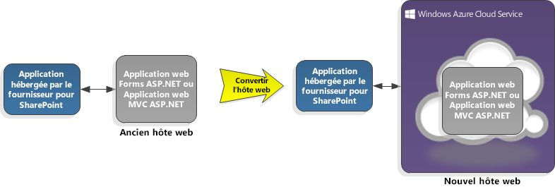

# Compléments hôte pour SharePoint sur un service cloud Microsoft Azure
Découvrez comment héberger une Complément SharePoint hébergée par un fournisseur sur un service cloud Microsoft Azure plutôt que sur une application web et comment ajouter une Complément SharePoint à un rôle web Azure, et pourquoi un hébergement sur Azure peut être meilleur que sur une application web.

|||
|:-----|:-----|
|**Dans cet article**   [Conditions requises](#SP15createselfhostapp_bk_prereq)   [Hébergement d'un Complément SharePoint sur un service cloud Azure](#SP15HostAzure_bk_HowTo)   [Pourquoi utiliser Azure ?](#SP15HostAzure_bk_Why)   [Ressources supplémentaires](#SP15Devapps_AddtionalResources)||
 

## Conditions requises

- Les composants requis pour :  [Commencer à créer des compléments hébergés par un fournisseur pour SharePoint](get-started-creating-provider-hosted-sharepoint-add-ins.md).

- Kit de développement logiciel (SDK) Microsoft Azure pour .NET (VS 2012) 1.8.1, que vous pouvez installer à l'aide de  [Web Platform Installer](http://www.microsoft.com/web/downloads/platform.aspx).

## Hébergement d'un Complément SharePoint sur un service cloud Azure

### Ajouter un service de cloud à un complément existant

Si vous disposez déjà d'un Complément SharePoint hébergé par un fournisseur que vous souhaitez héberger sur Azure, choisissez le projet d'application web dans la solution pour le complément SharePoint. Dans la barre de menus, choisissez **Projet**, **Ajouter un projet de service cloud Microsoft Azure**. Un projet Azure nommé  _NameOfTheWebAppProject_.Azure est ajouté à la solution pour votre Complément SharePoint. Un rôle web pour le projet web est également ajouté au projet pour le service cloud Azure. Les Outils de développement Office pour Visual Studio 2012 définissent les propriétés de projet nécessaires pour que le rôle web puisse fonctionner avec le Complément SharePoint.

La figure 1 illustre la conversion d'un Complément SharePoint pour utiliser un service cloud Azure.

**Figure 1. Conversion d'un complément SharePoint pour l'utilisation d'un service cloud Azure**

### Ajouter un complément à un rôle web existant

Si vous disposez déjà d'un rôle web dans un service cloud Azure et que vous souhaitez l'utiliser comme hôte pour un Complément SharePoint hébergé par un fournisseur, ouvrez le projet cloud Azure dans Visual Studio. Ensuite, dans l' **Explorateur de solutions**, choisissez le projet de rôle web. Dans la barre de menus, choisissez **Projet**, **Ajouter un projet de complément SharePoint**. Un projet pour un Complément SharePoint hébergé par un fournisseur nommé  _NameOfTheWebAppProject_.Azure est créé et ajouté à la solution. Visual Studio référence le rôle web Azure en tant qu'hôte de projet web pour le Complément SharePoint.

La figure 2 illustre l'ajout d'un Complément SharePoint à un rôle web existant.

**Figure 2. Ajout d'un complément SharePoint à un rôle web existant**

## Pourquoi utiliser Azure ?

Vous pouvez profiter des services d'hébergement et de l'évolutivité de Azure en transférant l'application web de votre Complément SharePoint hébergé par un fournisseur vers un service cloud Azure. Vous pouvez également améliorer les performances et la convivialité de votre Complément SharePoint, en particulier si le complément est très utilisé ou si la demande à son égard varie dans le temps. Vous pouvez exécuter une application web dans Azure en apportant des modifications minimes au Complément SharePoint existant. Un rôle web Azure est un site web basé sur le service Internet Information Services (IIS) et hébergé sur Azure. 

Pour comprendre en quoi Azure peut vous aider, vous avez besoin de quelques informations générales. Un projet pour un Complément SharePoint sur le cloud (c'est-à-dire hébergé par un fournisseur) est généralement associé à un projet d'application web, ou « application web ». L'application web est déployée et hébergée hors de la batterie de serveurs SharePoint. Les Compléments SharePoint hébergées par un fournisseur interagissent avec un site SharePoint via un service dans l'application web et peuvent également utiliser des ressources et services qui résident sur le site distant.

Consultez les liens suivants pour obtenir plus d'informations.

-  [Aspects importants du contexte de développement et de l'architecture des compléments pour SharePoint](important-aspects-of-the-sharepoint-add-in-architecture-and-development-landscap.md)

-  [Qu'est-ce qu'un service cloud ?](http://www.windowsazure.com/fr-fr/manage/services/cloud-services/what-is-a-cloud-service/)

-  [Choisir les modèles de développement et l'hébergement d'un complément pour SharePoint](choose-patterns-for-developing-and-hosting-your-sharepoint-add-in.md)

-  [Présentation de Microsoft Azure](http://www.windowsazure.com/fr-fr/develop/net/fundamentals/intro-to-windows-azure/)

L'application web de votre Complément SharePoint peut résider sur une batterie de serveurs sur site qui nécessite du matériel, des installations et du personnel pour la maintenance. Azure gère tout cela pour vous, éliminant ainsi les coûts et les tracas liés au développement et à la maintenance d'une batterie de serveurs. Si le Complément SharePoint nécessite plus de ressources de serveur, Azure peut en affecter de manière dynamique au complément. En basculant un Complément SharePoint vers un service cloud Azure, vous donnez à votre complément plus d'espace pour se développer. Voir  [Mise à l'échelle automatique et Microsoft Azure](http://msdn.microsoft.com/fr-fr/library/hh680945%28v=pandp.50%29.aspx).

Si vous possédez déjà un rôle web dans Azure, vous pouvez en tirer parti en le transformant en hôte de votre Complément SharePoint, plutôt que de créer un autre rôle web. Vous pouvez également créer un package de votre site web en tant que complément SharePoint, puis le publier sur l'Office Store, ce qui permet de diriger potentiellement plus de clients sur votre site web.

## Ressources supplémentaires

-  [Qu'est-ce que Microsoft Azure ?](http://www.windowsazure.com/fr-fr/documentation/)

-  [Création et déploiement d'un service de nuage](http://www.windowsazure.com/fr-fr/manage/services/cloud-services/how-to-create-and-deploy-a-cloud-service/)

-  [Déploiement d'une application web ASP.NET sur un site web Microsoft Azure](http://www.windowsazure.com/fr-fr/develop/net/tutorials/get-started/)

-  [Choix entre les sites web Microsoft Azure, les rôles web et les machines virtuelles](http://dotnetthread.com/articles/30-Choosing-between-Windows-Azure-Web-Sites-Web-Roles-and-VMs.aspx)

  