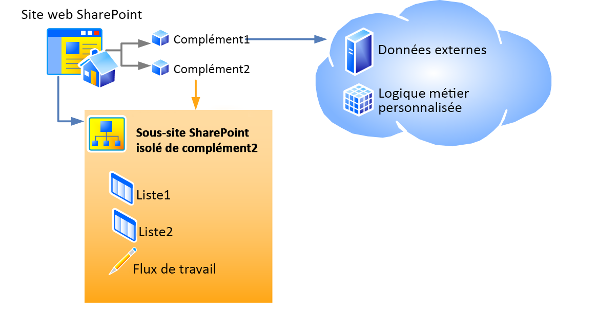

# Héberger des sites web, des sites web de complément et des composants SharePoint dans SharePoint 2013
Découvrez la différence entre les sites web hôtes et les sites web de compléments. Découvrez également les composants SharePoint 2013 qui peuvent être inclus dans un Complément SharePoint, ceux qui sont déployés sur le site web hôte, ceux qui sont déployés sur le site web de complément, ainsi que la façon dont le site web de complément est déployé dans un domaine isolé.
## Sites web hôtes, sites web de compléments et domaine isolé
<a name="IsolatedDomain"> </a>

Lorsqu'un complément qui comporte des composants SharePoint est installé sur un site web, il figure dans une liste sur la page **Contenu du site** à partir de laquelle il peut être lancé. Cette liste, qui constitue le point de lancement du complément, est le seul élément à ajouter obligatoirement au site web, bien que d'autres éléments puissent éventuellement être ajoutés, par exemple une action personnalisée ou un composant de complément. Pour plus d'informations sur ces options, voir [Accéder au complément à partir de l'interface utilisateur](important-aspects-of-the-sharepoint-add-in-architecture-and-development-landscap.md#AccessingApp). À la différence des éléments d'interface utilisateur, les composants et le contenu d'un Complément SharePoint, tels que les listes, les types de contenu, les flux de travail et les pages, sont déployés sur un autre site web dans un domaine isolé spécifique. Ceci est en grande partie invisible pour l'utilisateur. Le site web sur lequel le complément est  *déployé*  est nommésite web de complément. Le site web sur lequel le complément est  *installé*  est nommésite web hôte. Bien que le site web de complément possède son propre domaine isolé, il se trouve dans la même collection de sites que le site web hôte. (Une exception à cette règle se produit lorsque le complément est installé avec une étendue de location. Dans ce cas, le site web de complément se trouve dans la collection de sites du catalogue de compléments d'entreprise.) 


La figure 1 représente un site web hôte avec deux Compléments SharePoint installés. Le complément 1 est doté de composants distants, mais pas de composants SharePoint : elle ne dispose donc pas de site web de complément. Le complément 2 n'est pas doté de composants distants, mais de deux listes SharePoint et d'un flux de travail. Ces éléments ont été déployés sur un sous-site isolé. (Un Complément SharePoint peut être doté à la fois de composants distants et de composants hébergés sur SharePoint, ce qui n'est pas le cas pour les deux compléments représentés dans ce schéma.)


**Figure 1 : site web hôte avec un complément hébergé par un fournisseur et un complément hébergé sur SharePoint**





Supposons par exemple qu'un complément doté de composants SharePoint légèrement au-delà des éléments d'interface utilisateur pouvant être déployés sur un site web hôte soit installé sur un site web hôte à l'URL suivante :


 `https://www.fabrikam.com/sites/Marketing`


Le Complément SharePoint sera déployé sur un nouveau site web avec une URL telle que :


 `http://add-in-bdf2016ea7dacb.fabrikamadd-ins.com/sites/Marketing/Scheduler`


Notez la structure de cette URL :


 `https://` _Préfixe_du_complément_ `-` _Identifiant_du_complément_ `.` _Domaine_de_base_du_complément_ `/` _URL_relative_du_domaine_du_site_web_hôte_ `/` _Nom_du_complément_


Les espaces réservés sont définis ci-dessous :


-  _Préfixe_du_complément_ est une chaîne de caractères définie par l'administrateur de la batterie de serveurs au niveau de l'Administration centrale. Sa valeur par défaut est « default ». Dans cet exemple, l'administrateur l'a remplacée par « add-in ».


-  _Identifiant_du_complément_ est un nombre hexadécimal généré de manière interne lors de l'installation du complément.


-  _Domaine_de_base_du_complément_ est une chaîne de caractères définie par l'administrateur de la batterie de serveurs au niveau de l'Administration centrale ou avec SharePoint Management Shell. Cette valeur ne doit *pas*  être définie sur un sous-domaine de l'application web SharePoint, car l'isolation de complément ne serait pas respectée. Dans cet exemple, l'administrateur a supprimé « www » et a ajouté « add-ins » au nom de la société. `fabrikamadd-ins.com` est donc le domaine de base du complément.


-  _URL_relative_du_domaine_du_Web_hôte_ est l'URL relative du Web hôte parent ( `sites/Marketing` dans cet exemple).


-  _Nom_du_complément_ est la valeur de l'attribut **Name** de l'élément **App** dans le fichier appmanifest.xml.


Le fait que les composants SharePoint soient déployés sur des sites web de complément plutôt que sur le site web hôte tient à deux raisons principales. Les deux sont liées à la sécurité.


- **Application des autorisations de complément :** dans le modèle de complément SharePoint, un complément possède sa propre identité et il est doté d'autorisations qui ne correspondent pas nécessairement aux autorisations de l'utilisateur qui l'exécute. Ces autorisations sont demandées lorsque le complément est installé et elles sont accordées par l'installateur du complément, tant que celui-ci dispose de toutes les autorisations demandées par le complément. (Un l'utilisateur qui tente d'installer le complément sans disposer de toutes les autorisations demandées par celui-ci ne pourra pas mener à bien cette installation.) En attribuant à chaque complément son propre domaine, SharePoint 2013 peut identifier de manière fiable les demandes effectuées par le complément et vérifier les autorisations de celui-ci. Pour plus d'informations sur les autorisations de complément, voir [Autorisations de complément](important-aspects-of-the-sharepoint-add-in-architecture-and-development-landscap.md#AppPermissions).


- **Sécurité des scripts à domaines multiples :** les navigateurs actuels pratiquent la « stratégie d'origine identique » en ce qui concerne les appels de méthodes JavaScript. En déployant chaque Complément SharePoint sur son propre domaine, SharePoint tire parti de cette stratégie pour s'assurer que le code JavaScript du Complément SharePoint ne peut exécuter aucun code JavaScript d'un autre domaine, y compris du domaine dans lequel est installé le complément, du point de vue de l'utilisateur final.

    SharePoint propose également un moyen de s'affranchir en toute sécurité des limites de cette stratégie. Entre autres aspects, les composants distants d'un Complément SharePoint peuvent interroger des données de tout site web qui dépend à la fois du site web hôte et des sites web de complément. Pour plus d'informations, voir  [Accéder à des données SharePoint 2013 à partir de compléments à l'aide de la bibliothèque inter-domaines](access-sharepoint-2013-data-from-add-ins-using-the-cross-domain-library.md).


## Types de composants SharePoint pouvant se trouver dans un complément SharePoint
<a name="TypesOfSPComponentsInApps"> </a>

Un Complément SharePoint peut généralement contenir un ou plusieurs des composants de la liste ci-dessous. Sauf exception, ces composants doivent être déployés dans des fonctionnalités d'étendue **Web**, contenues dans un fichier de type .wsp (package de solution SharePoint) :


> **REMARQUE**
> ***** Les composants marqués d'un astérisque (*) sont présentés de manière plus détaillée dans la section [Points à observer lors du déploiement des composants SharePoint](#SpecialCases) plus loin dans cet article.


- Fonctionnalités (d'étendue **Web** uniquement)


- Actions personnalisées (notamment les éléments des menus contextuels et les personnalisations du ruban)*


- Récepteurs d'événements distants*


- Balisage référençant les composants WebPart (notamment les composants de complément) qui sont inclus dans SharePoint (mais pas les composants WebPart personnalisés)*


- Fichiers de feuilles de style en cascade personnalisées (CSS) utilisés par les pages SharePoint


- Fichiers JavaScript personnalisés utilisés par les pages SharePoint


- Modules (ensembles de fichiers)


- Pages


- Modèles de listes


- Instances de listes et de bibliothèques


- Formulaires de liste personnalisés


- Listes d'affichage personnalisées


- Types de contenu personnalisés


- Champs (des types de champ créés dans SharePoint)


- Modèles Microsoft Business Connectivity Services (BCS) (d'étendue **Web** uniquement), types de contenu externe basés sur le modèle, listes qui utilisent les types de contenu*


- Flux de travail*


- Conteneurs de propriétés


- Modèles Web (mais pas les définitions de site)*


Aucun autre type de composant SharePoint ne peut être déployé dans un Complément SharePoint. Pour plus d'informations sur les éléments qui ne peuvent être inclus dans un Complément SharePoint, reportez-vous à  [Comparaison des compléments pour SharePoint et des solutions SharePoint](http://msdn.microsoft.com/library/0e9efadb-aaf2-4c0d-afd5-d6cf25c4e7a8%28Office.15%29.aspx).


## Points à observer lors du déploiement des composants SharePoint
<a name="SpecialCases"> </a>

Certains points à observer lors du déploiement de composants SharePoint dans un complément ainsi que d'autres informations à ce sujet sont détaillés ci-dessous : 


- **Actions personnalisées :** vous pouvez ajouter des actions personnalisées dans le site web de complément, mais également dans le site web hôte. Pour ajouter une action personnalisée dans le site web de complément, vous devez l'inclure dans une fonctionnalité d'étendue **Web** contenue dans un fichier .wsp, de la même manière que pour tout composant à insérer dans le site web de complément. Pour ajouter une action personnalisée dans le site web hôte, vous pouvez inclure (même dans un complément externe) le balisage **CustomAction** dans une fonctionnalité contenue dans le package de complément mais en dehors de tout fichier .wsp. Les composants d'une telle fonctionnalité isolée s'appliquent au site web hôte et non au site web de complément. Ce type de fonctionnalité s'appelle donc unefonctionnalité de site web hôte .


- **Composants WebPart :** un seul type de composant WebPart (le composant de complément) peut être déployé dans un complément. Les composants de complément peuvent être déployés sur le site web de complément comme sur le site web hôte. Tous les autres types de composant WebPart peuvent être référencés dans les compléments, mais ils ne peuvent pas être déployés par ceux-ci. Si un composant de complément est déployé sur le site web hôte, il doit être inclus dans une fonctionnalité de site web hôte.


- **Récepteurs d'événements distants :** il s'agit d'une nouveauté de SharePoint 2013. Les récepteurs d'événements distants sont semblables à des récepteurs d'événements SharePoint classiques, à ceci près que le code s'exécute dans le cloud. Ils ne sont pas disponibles dans les compléments hébergés sur SharePoint.


- **Flux de travail :** Les flux de travail de SharePoint 2013 utilisent le moteur runtime de flux de travail hébergé dans Microsoft Azure, qui est une nouveauté de SharePoint 2013. Les flux de travail codés qui utilisent le moteur runtime de flux de travail hébergé dans SharePoint ne peuvent pas être inclus dans un Complément SharePoint. Seuls les flux de travail déclaratifs ou les flux de travail qui utilisent ce nouveau moteur runtime sont autorisés.


- Modèles **Microsoft Business Connectivity Services (BCS), types de contenu externe et listes externes :** les modèles Service Business Data Connectivity (BDC) ont habituellement une étendue plus large qu'une collection de sites. Toutefois, lorsqu'un modèle Service Business Data Connectivity (BDC) est déployé dans un complément, son étendue est limitée au site web de complément. Lorsqu'un modèle Service Business Data Connectivity (BDC) est inclus dans un complément, il n'est pas stocké dans le magasin de service partagé Service Business Data Connectivity (BDC). En revanche, il est stocké sous forme de fichier dans le site web de complément.


- **Modèles web :** dans la plupart des cas, il est recommandé que le site web de complément instancie la nouvelle configuration de définition de site intégrée **APP#0**, optimisée pour les sites web de complément. Pour plus d'informations à ce sujet, voir  [Accéder au complément à partir de l'interface utilisateur](important-aspects-of-the-sharepoint-add-in-architecture-and-development-landscap.md#AccessingApp). SharePoint 2013 utilise automatiquement **APP#0** lorsque le package de complément ne contient pas d'élément [WebTemplate](http://msdn.microsoft.com/library/ff4ba91a-cc5f-47ff-9101-a7651f452185%28Office.15%29.aspx). 

    Vous pouvez également définir un type de site personnalisé pour le site web de complément. Pour ce faire, il faut effectuer les deux étapes principales suivantes :

  - Intégrez un  [WebTemplate, élément (modèle Web)](http://msdn.microsoft.com/library/ff4ba91a-cc5f-47ff-9101-a7651f452185%28Office.15%29.aspx) personnalisé, un fichier one.xml, et si possible d'autres fichiers associés dans la fonctionnalité de site web de complément pour votre complément. Déployez de la manière habituelle le modèle web de la fonctionnalité d'étendue web dans un fichier .wsp au sein du package de complément.


  - Ajoutez un  [WebTemplate, élément (PropertiesDefinition, complexType) (manifeste SharePoint Add-in)](http://msdn.microsoft.com/library/62302903-e97a-a9a3-a64e-13176a7c4e1e%28Office.15%29.aspx) dans le manifeste du complément en tant qu'enfant de l'élément **Properties**. Définissez son attribut **Id** sur le GUID de la fonctionnalité de site web de complément et la valeur de l'attribut **Name** de l'élément [WebTemplate, élément (modèle Web)](http://msdn.microsoft.com/library/ff4ba91a-cc5f-47ff-9101-a7651f452185%28Office.15%29.aspx). Le GUID doit être séparé par des tirets et encadré par des accolades « {} », et le GUID et le nom de modèle doivent être séparés par le caractère « # », comme le montre l'exemple suivant :

 ```XML

<WebTemplate Id="{81dd4ae5-873b-4759-9838-4ad9c3dd2952}#NewSiteType" />
 ```


    > **REMARQUE**
      > Le nouvel élément  [WebTemplate](http://msdn.microsoft.com/library/62302903-e97a-a9a3-a64e-13176a7c4e1e%28Office.15%29.aspx) pour les manifestes de compléments n'a pas le même balisage que l'élément [WebTemplate](http://msdn.microsoft.com/library/ff4ba91a-cc5f-47ff-9101-a7651f452185%28Office.15%29.aspx) qui peut être inclus dans les fonctionnalités. L'élément **WebTemplate** qui peut être inclus dans les fonctionnalités définit un type de site, mais l'élément **WebTemplate** pour les manifestes de compléments détermine simplement le type de site à utiliser. Pour plus d'informations sur le manifeste de complément d'un Complément SharePoint, voir [Structure du package de complément](important-aspects-of-the-sharepoint-add-in-architecture-and-development-landscap.md#SPAppModelArch_Package). 

    > **ATTENTION**
      > N'utilisez pas l'élément **WebTemplate** dans le manifeste de complément pour désigner l'une des configurations de définition de site SharePoint intégrées en tant que type de site web de complément. Nous ne prenons pas en charge les configurations de définition de site intégrées autres que **APP#0** pour les sites web de complément.

    Pour plus d'informations sur les configurations de définition de site et les éléments WebTemplate, reportez-vous à  [Utilisation des modèles et des définitions](http://msdn.microsoft.com/library/1edf6d4d-eddb-4cb5-9034-ed394e8a3e01%28Office.15%29.aspx).


## Ressources supplémentaires
<a name="SP15hostedwebs_bk_addlresources"> </a>


-  [Aspects importants du contexte de développement et de l'architecture des compléments pour SharePoint](important-aspects-of-the-sharepoint-add-in-architecture-and-development-landscap.md)


-  [Comparaison des compléments pour SharePoint et des solutions SharePoint](http://msdn.microsoft.com/library/0e9efadb-aaf2-4c0d-afd5-d6cf25c4e7a8%28Office.15%29.aspx)


