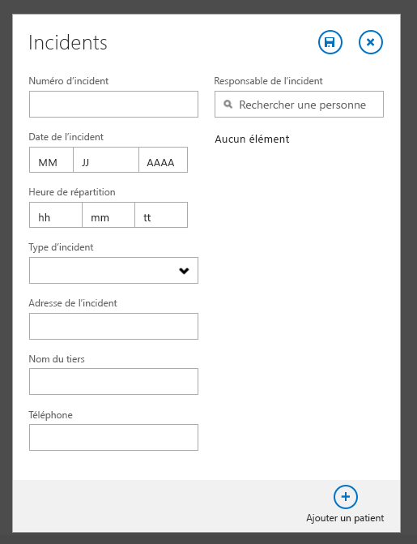
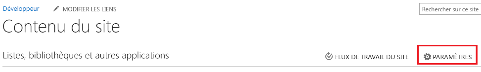
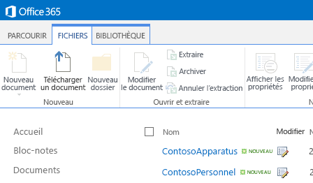
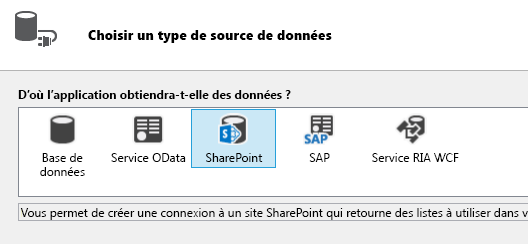
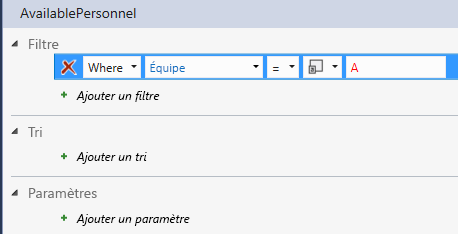
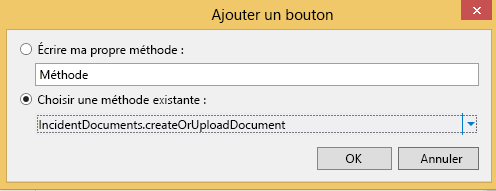
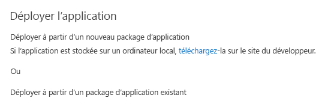

# Gestionnaire d'incident : didacticiel pour complément d'informations professionnelles en nuage
Avec un modèle **Complément de gestion des informations professionnelles dans le Cloud**, vous pouvez créer dans Visual Studio un complément hébergé par SharePoint permettant aux utilisateurs d'afficher, ajouter et mettre à jour des données depuis des emplacements distants avec des périphériques tactiles modernes, tels que des téléphones et des tablettes. Dans ce didacticiel, vous allez créer un complément pour un service d'incendie fictif, Contoso, pour assurer la gestion des incidents sur les sites d'intervention. La procédure pas à pas traite des concepts de base de la création d'un complément de gestion des informations professionnelles dans le Cloud ainsi que des concepts plus avancés, par exemple l'intégration des listes et des bibliothèques de documents SharePoint.Vous pouvez télécharger l'exemple d'application de gestion des incidents et les fichiers associés depuis la Galerie d'exemples MSDN.  [Gestionnaire d'incident : didacticiel de complément de gestion des informations professionnelles dans le Cloud](http://code.msdn.microsoft.com/Incident-Manager-A-Cloud-c32d9b04).
## Conditions préalables

Cette procédure pas à pas requiert Visual Studio 2013 Update 1 et les outils de développement Microsoft pour Visual Studio 2013 - Mise à jour de mars 2014.


Pour héberger le complément, vous aurez besoin d'un site du développeur SharePoint sur Office 365, que vous pouvez obtenir en réalisant une  [Inscription à un site du développeur Office 365](http://go.microsoft.com/fwlink/?LinkId=263490).


> **REMARQUE**
> Vous pouvez également héberger un complément de gestion des informations professionnelles dans le Cloud sur un site SharePoint 2013. 


## Création de l'application de gestion des incidents
<a name="add-in"> </a>

Le service d'incendie Contoso intervient sur des incendies, des urgences médicales, des accidents de véhicule à moteur et autres situations d'urgence. Chaque incident des urgences nécessite l'exécution de nombreuses tâches administratives à des fins de documentation. Actuellement, les informations sont saisies sur les sites d'intervention à l'aide de formulaires papier, puis les informations sont entrées dans leur système informatique après le retour à la caserne. Le service a récemment adopté SharePoint pour Office 365 pour la gestion de dossiers, et a acheté des tablettes pour permettre au responsable de l'intervention de saisir les données sur site.


Vous allez élaborer le complément nomade qui va être utilisé pour saisir des informations de base sur l'incident. Comme de nombreuses interventions impliquent également les urgences médicales, le complément devra permettre la saisie des données correspondant à de nombreux patients pour chaque incident. Dans cette section, vous réaliserez l'application de base et durant la procédure, vous apprendrez les concepts fondamentaux des compléments de gestion des informations professionnelles dans le Cloud.


### Pour créer un projet


1. Dans la barre de menus, choisissez **Fichier** > **Nouveau** > **Projet**.

    La boîte de dialogue **Nouveau projet** s'ouvre.


2. Dans la liste des modèles, développez d'abord le nœud **Visual Basic** ou **Visual C#**, puis le nœud **Office/SharePoint**. Choisissez le nœud **Compléments**, puis le modèle **Complément de gestion des informations professionnelles dans le Cloud**, comme indiqué à la figure 1.

   **Figure 1. Modèle de complément de gestion des informations professionnelles dans le Cloud**


3. Dans la zone de texte **Nom**, saisissez IncidentManager, puis cliquez sur le bouton **OK**.

    L'Assistant **Nouveau complément de gestion des informations professionnelles dans le Cloud** s'ouvre.


4. Dans l'Assistant **Nouveau complément de gestion des informations professionnelles dans le Cloud**, saisissez l'URL de votre site du développeur Office 365, puis cliquez sur le bouton **Terminer**.

    L'URL se présente sous la forme suivante : https://  _Mon Site_.sharepoint.com/sites/Developer/.

    Une solution **IncidentManager** est ajoutée à l'Explorateur de solutions avec quatre projets : un projet de niveau supérieur **IncidentManager**, puis trois projets, respectivement **IncidentManager.HTMLClient**, **IncidentManager.Server** et **IncidentManager.SharePoint**.


    Dans l'étape suivante, vous allez ajouter une entité qui représentera une collection d'incidents. L'entité crée une table de base de données SQL Server intrinsèque au complément. Elle conservera les informations relatives à chaque incident.


### Pour ajouter l'entité Incident


1. Dans l'écran **Démarrer**, cliquez sur le lien hypertexte **Créer une nouvelle Table**.

    Le concepteur d'entités s'ouvre.


2. Dans la fenêtre **Propriétés**, dans la zone de texte correspondant à la propriété **Nom**, entrez Incident.


3. Dans le concepteur d'entités, choisissez le lien **<Ajouter une propriété>**, puis saisissez IncidentNumber.


4. Appuyez sur la touche Entrée, en acceptant le **Type** par défaut, **String**, et cochant la case **Obligatoire**.


5. Dans la fenêtre **Propriétés**, cochez la case **Inclure dans un index unique**.

    Chaque incident doit avoir un numéro unique


6. Choisissez le lien **<Ajouter une propriété>** et entrezDateIncident, puis appuyez sur la touche **Tabulation**.


7. Dans la colonne **Type**, sélectionnez **Date**, puis appuyez deux fois sur la touche Tabulation.


8. Dans la colonne **Nom**, saisissez DispatchTime et, dans la colonne **Type**, choisissez le type de données **DateTime**.


9. Dans la ligne suivante, entrez IncidentType et choisissez **Integer** comme type de données.


10. Dans la ligne suivante, entrez IncidentAddress et choisissez **String** comme type de données.


11. Dans la ligne suivante, entrez ReportingPartyName et choisissez le type de données **String**. Décochez la case **Obligatoire**.

    Il arrive que des incidents soient signalés de manière anonyme, auquel cas ce champ ne doit pas être renseigné.


12. Dans la ligne suivante, entrez ReportingPhone et cliquez sur le type de données **PhoneNumber**.

    Le **numéro de téléphone** est untype d'information d'entreprise personnalisé qui est formaté automatiquement et permet de valider les numéros de téléphone .


13. Dans la fenêtre **Propriétés**, cliquez sur le lien hypertexte **Formats de numéro de téléphone**.

    La boîte de dialogue **Formats de numéro de téléphone** s'ouvre.


14. Dans la boîte de dialogue **Formats de numéro de téléphone**, choissez le format qui convient à vos paramètres régionaux, puis cliquez sur le bouton **Monter** pour le placer en tête de liste.


15. Dans la zone de texte **Validation du numéro de téléphone à tester**, saisissez un numéro de téléphone et vérifiez qu'il est correctement formaté, puis cliquez sur le bouton **Enregistrer**.

    Les données professionnelles de type **Numéro de téléphone** gèrent le formatage et la validation pour vous sur n'importe quel écran où il apparaît.


16. Dans la ligne suivante, entrez ResponsableIncident, puis cliquez sur le type de données **Person**.

    Le type **Personne** permet de se connecter au service de profil utilisateur SharePoint, qui extrait les informations utilisateur d'Active Directory.

    La figure 2 montre l'entité terminée.


   **Figure 2. Entité Incidents**


    Lors de l'étape suivante, vous ajouterez une Liste de choix qui permet à l'utilisateur de choisir parmi un ensemble de valeurs déterminées. Dans ce cas, le service incendie dispose d'un ensemble de types d'incidents communs.


### Pour ajouter une liste de choix


1. Dans le concepteur d'entités, choisissez le champ **IncidentType**, puis, dans la fenêtre **Propriétés**, sélectionnez le lien hypertexte **Liste de choix**.

    La boîte de dialogue **Liste de choix** s'ouvre.


2. Dans la boîte de dialogue **Liste de choix**, choisissez le lien **Ajouter une valeur** et entrez1.


3. Dans la colonne **Nom complet**, entrez **Incendie - Commercial**.


4. Entrez les valeurs et les noms complets suivants, et puis cliquez sur le bouton **OK**.


|**Valeur**|**Nom complet**|
|:-----|:-----|
|4.11  <br/> |Feu - résidentiel  <br/> |
|4.11  <br/> |Incendie - réponse de moteur unique  <br/> |
|4.11  <br/> | Aide - Réanimation d'urgence <br/> |
|4.11  <br/> | Aide - Premiers soins <br/> |
|4.11  <br/> |Collision de véhicule à moteur  <br/> |
|4.11  <br/> |Appel de service  <br/> |
|||
 

    Au moment de l'exécution, la liste des noms complets est présentée à l'utilisateur. Lorsqu'il fait un choix, la valeur **Integer** correspondante est stockée dans la base de données.


    Lors de l'étape suivante, vous allez ajouter une entité Patient. De nombreuses interventions du service anti-incendie nécessitent des interventions médicales et un seul incident peut générer plusieurs patients.


### Pour ajouter l'entité Patient


1. Dans l' **Explorateur de solutions**, ouvrez le menu contextuel pour accéder au nœud **Sources de données**, puis choisissez **Ajouter un tableau**.


2. Dans la fenêtre **Propriétés**, dans la zone de texte de la propriété **Nom**, saisissez Patient.


3. Dans le concepteur d'entités, ajoutez les champs suivants, comme illustré à la figure 3 :

   **Figure 3. Entité Patient**


    Lors de l'étape suivante, vous allez définir une relation entre l'incident et des entités patient. Un incident peut être associé à plusieurs patients.


### Pour définir une relation


1. Dans l' **Explorateur de solutions**, ouvrez le menu contextuel du projet pour accéder au nœud **Incidents.lsml**, puis sélectionnez **Ouvrir**.


2. Dans la barre d'outils, cliquez sur le bouton **Relation**.

    La boîte de dialogue **Ajouter une nouvelle relation** s'affiche.


3. Dans la boîte de dialogue **Ajouter une nouvelle relation**, dans la colonne **À** de la ligne **Nom**, choisissez **Patient**.


4. Sur la ligne **Multiplicité**, dans la colonne **De**, choisissez **Zéro ou un**.


5. Dans la colonne **À**, choisissez **Plusieurs**, puis cliquez sur le bouton **OK**.

    La figure 4 montre la relation.


   **Figure 4. Relations entre incidents et patients**


    Cette opération crée zéro ou une ou plusieurs relations entre les incidents et les patients. Un dossier d'incident ne comporte pas nécessairement de patient, mais un numéro d'incident doit impérativement être attribué à chaque patient.


    Lors de l'étape suivante, vous ajouterez des écrans permettant d'afficher, d'ajouter et de modifier aussi bien les dossiers de patients que les dossiers d'incidents.


### Pour ajouter des écrans


1. Dans l' **Explorateur de solutions**, ouvrez le menu contextuel du nœud **Incidents.Isml**, puis choisissez **Ouvrir**.


2. Dans le concepteur d'écran, dans la barre **Perspective**, choisissez l'onglet **Client HTML**, puis, sur la barre d'outils, cliquez sur le bouton **Écran**.

    La boîte de dialogue **Ajouter un nouvel écran** s'ouvre.


3. Dans la boîte de dialogue **Ajouter un nouvel écran**, dans la liste **Sélectionner une liste de modèle d'écran**, choisissez l' **ensemble d'écrans communs**.


4. Dans la zone de texte de **définition du nom d'écran**, entrez Incidents.


5. Dans la liste **Données de l'écran**, choisissez **Incidents**.


6. Sélectionnez les cases à cocher **Détails de l'incident** et **Patients d'incidents**, puis cliquez sur le bouton **OK**.

    La figure 5 illustre la boîte de dialogue Ajouter un nouvel écran.


   **Figure 5. Boîte de dialogue Ajouter un nouvel écran**


    Des écrans Parcourir, Afficher les détails et Ajouter/Modifier sont ajoutés au projet HTMLClient. L'écran de navigation est automatiquement défini comme écran d'accueil de l'application et les commandes nécessaires au lancement des écrans Afficher et Ajouter/Modifier sont automatiquement fournis.


7. Dans la barre de menus, choisissez **Débogage**, puis ** Démarrer le débogage**. Dans la boîte de dialogue **Se connecter à SharePoint**, saisissez votre nom d'utilisateur et votre mot de passe.


8. À l'invite, cliquez sur le bouton **Approuver**. Le complément ouvre un écran vierge. Notez que le titre de l'écran est **IncidentsSet**.


9. Cliquez sur le bouton **Ajouter**.

    La boîte de dialogue **Incidents** s'ouvre. Notez que pendant que vous saisissez des données d'incident, rien n'est prévu pour ajouter les patients. Vous résoudrez ce problème et d'autres problèmes de conception en personnalisant les écrans.


    À l'étape suivante, vous allez personnaliser l'écran Parcourir.


10. Fermez la boîte de dialogue **Incident**, puis fermez la fenêtre de l'explorateur pour revenir en mode conception.


### Pour personnaliser l'écran de navigation


1. Dans l' **Explorateur de solutions**, ouvrez le menu contextuel à partir du nœud **BrowseIncidentsSet.lsml** et cliquez sur **Ouvrir**.


2. Dans la fenêtre **Propriétés**, choisissez la propriété **Nom complet**, puis entrez Incidents.


3. Dans le concepteur d'écran, choisissez le nœud **Disposition des lignes | lignes**, puis développez la liste **Ajouter** et sélectionnez **Adresse de l'incident**.


4. Choisissez le nœud **Heure de répartition**, puis, dans la barre d'outils, cliquez sur le bouton **Supprimer**.

    La figure 6 illustre la disposition de l'écran de fin.


   **Figure 6. Disposition de l'écran de navigation**


    Au moment de l'exécution, l'écran affiche une mosaïque pour chaque incident et chacune d'elle affiche un numéro d'incident, une date et une adresse.


    À l'étape suivante, vous allez personnaliser l'écran Ajouter/Modifier.


### Pour personnaliser l'écran Ajouter/Modifier


1. Dans l'écran de l' **Explorateur de solutions**, ouvrez le menu contextuel du nœud **AddEditIncidents.lsml** et choisissez **Ouvrir**.


2. Choisissez les nœuds **Adresse de l'incident**, **Nom du rapporteur** et **Téléphone de rapport** et faites-les glisser sur la section **Disposition des lignes | gauche**, sous le nœud **Type d'incident**.


3. Choisissez le nœud **Heure de répartition** et, dans la fenêtre de **Propriétés** décochez la case **Sélecteur de case activé**.

    La date n'est pas nécessaire, car il s'agit toujours de la date de l'incident.


4. Dans le volet de gauche du concepteur d'écran, choisissez le lien **Ajouter des patients** comme indiqué à la figure 7.

   **Figure 7. Lien Ajouter des patients**


5. Dans le volet de gauche, choisissez le nœud **Patients** et faites-le glisser sous le nœud **Responsable incident** dans le volet central.

    La figure 8 illustre la disposition de l'écran de fin.


   **Figure 8. Disposition de l'écran Ajouter/Modifier**


    Dans l'étape suivante, vous allez créer un écran pour ajouter des dossiers de patients.


### Pour ajouter un écran de Patients


1. Dans l'écran de l' **Explorateur de solutions**, ouvrez le menu contextuel du nœud **AddEditIncidents.lsml** et cliquez sur **Ouvrir**.


2. Dans le concepteur d'écran, sous le nœud **Disposition des lignes | Détails (Onglet)**, ouvrez le menu contextuel du nœud **Barre de commandes**, puis choisissez **Ajouter un bouton**.


3. Dans la boîte de dialogue **Ajouter un bouton**, développez la liste **showTab**, puis, dans le groupe **Patients**, choisissez **addAndEditNew**, puis cliquez sur le bouton **OK**.

    La boîte de dialogue **Ajouter un nouvel écran** s'ouvre.


4. Dans la boîte de dialogue **Ajouter un nouvel écran**, acceptez les valeurs par défaut et cliquez sur le bouton **OK**.

    L'écran **AddEditPatient** s'ouvre dans le concepteur d'écran.


5. Dans la fenêtre Propriétés, cliquez sur la propriété **Nom complet**, puis entrez Ajouter un patient.


6. Dans le concepteur d'écran, choisissez le nœud **Incident**, puis supprimez-le.

    Le champ **Incidents** n'est pas nécessaire dans la mesure où le patient est déjà associé à un incident.

    La figure 9 illustre la disposition de l'écran de fin.


   **Figure 9. Disposition de l'écran Ajouter/Modifier**


    Dans l'étape suivante, vous allez exécuter le complément et ajouter des données.


### Pour tester le complément


1. Dans la barre de menus, choisissez **Débogage**, ** Démarrer le débogage**.


2. Dans le complément en cours d'exécution, cliquez sur le bouton **Ajouter**.

    Le menu contextuel **Incidents** s'ouvre, comme illustré à la figure 10.


   **Figure 10. Menu contextuel Incidents**





3. Dans la zone de texte **Numéro d'incident**, entrez 2014-1.


4. Dans les champs **Date d'incident** et **Heure de répartition**, utilisez les contrôles **Sélecteur de date** et **Sélecteur d'heure** pour sélectionner une date et une heure.


5. Dans la liste **Type d'Incident**, choisissez **Aide/permiers soins**.


6. Dans la zone de texte **Adresse d'incident**, entrez une adresse postale dans votre ville.

     N'y incluez pas la ville, l'état ni le code postal. En principe, le service d'incendie n'opère que dans une ville.


7. Dans le contrôle **Responsable incident**, **Sélecteur de personne**, saisissez le nom d'un utilisateur de votre site SharePoint.

    Notez que lorsque vous saisissez une liste, tous les noms correspondants s'affichent.


8. Cliquez sur le bouton **Ajouter un patient**.

    Le menu contextuel **Ajouter un patient** s'ouvre, comme illustré à la figure 11.


   **Figure 11. Menu contextuel Ajouter un patient**


9. Entrez des informations d'un patient et cliquez sur le bouton **Enregistrer**.

    Le nom du patient que vous avez ajouté s'affiche dans le menu contextuel **Incidents**. Si vous le souhaitez, vous pouvez ajouter d'autres patients.


10. Sur le menu contextuel **Incidents**, cliquez sur le bouton **Enregistrer**.

    Si vous suivez les instructions, vous verrez un message d'erreur de validation. Le champ **Rapport de téléphone** est un champ obligatoire. Les compléments de gestion des informations professionnelles dans le Cloud disposent d'une validation intégrée pour les champs requis.


11. Entrez un numéro de téléphone et cliquez sur le bouton **Enregistrer** à nouveau.

    Une mosaïque s'affiche sur l'écran d'accueil **Incidents**, avec le numéro de l'incident, sa date et une adresse.


12. Cliquez sur la mosaïque pour ouvrir l'écran d'affichage de l'incident.

    Notez que le champ **Téléphone de rapport** est affiché en tant que lien hypertexte, offrant un accès direct à votre application téléphonique par défaut.


13. Cliquez sur le bouton **Modifier** pour ouvrir l'écran **AddEditIncidents**. Le choix du bouton **Rejeter** revient à l'écran **Afficher**.


14. Choisissez l'onglet **Patients** pour afficher une liste de patients, puis sélectionnez une mosaïque de patient.

    Notez qu'aucun écran n'est ouvert pour le patient car vous n'en avez pas encore créé.


15. Cliquez sur le bouton **Fermer** de votre navigateur pour revenir en mode Conception.


    Dans l'étape suivante, vous allez ajouter un écran pour afficher des patients.


### Pour ajouter un écran d'affichage


1. Dans l' **Explorateur de solutions**, ouvrez le menu contextuel du fichier **Patients.lsml** et sélectionnez **Ouvrir**.


2. Dans le concepteur d'entités, dans la barre **Perspective**, choisissez **Client HTML**, puis, sur la barre d'outils, Cliquez sur le bouton **Écran**. 

    La boîte de dialogue **Ajouter un nouvel écran** s'ouvre.


3. Dans la boîte de dialogue **Ajouter un nouvel écran**, dans la liste **Sélectionner un modèle d'écran**, choisissez **Afficher les détails de l'écran**.


4. Dans la zone de texte **Nom d'écran**, saisissez **ViewPatient**, choisissez **Patient** dans la liste **Données d'écran**, puis cliquez sur le bouton **OK**.

    L'écran **ViewPatient** s'ouvre dans le concepteur d'écran.


5. Dans le concepteur d'écran, sous le nœud **Disposition des lignes | Détails (onglet)**, ouvrez le menu contextuel du nœud **Barre de commandes**, puis cliquez sur **Ajouter un bouton**.


6. Dans la boîte de dialogue **Ajouter un bouton**, développez la liste **showTab**, puis, dans le groupe **Patient**, choisissez **Modifier**, puis cliquez sur le bouton **OK**.


7. Exécutez l'application et vérifiez que vous pouvez désormais afficher et modifier des patients.


    Vous avez maintenant créé un complément de gestion des incidents fonctionnel, mais vous pouvez faire bien plus avec les compléments de gestion des informations professionnelles dans le Cloud. La prochaine section vous apprendra à utiliser des ressources sur le site SharePoint depuis le complément.


## Intégrer les ressources SharePoint
<a name="integrate"> </a>

Le service incendie Contoso a commencé à utiliser le complément de gestion des incidents, et, comme c'est souvent le cas dans les projets de développement informatique, il demande une nouvelle fonctionnalité. Outre les données du patient et de l'incident, il a besoin de gérer des ressources, telles que les équipements et le personnel. Le site SharePoint contient déjà les listes des équipements et du personnel, alors vous allez utiliser ces listes comme une autre source de données pour le complément.


La première étape consiste à ajouter des listes de modèles pré-renseignées à votre site de développeur.


### Pour ajouter des modèles de liste


1. Dans la barre de menus, choisissez **Débogage**, **Démarrer le débogage** pour exécuter le complément.


2. Dans le complément en cours d'exécution, sur la barre Chrome, choisissez le lien **Retour au site** pour accéder à votre site du développeur SharePoint, comme indiqué à la figure 12.

   **Figure 12. Lien Retour au site**


3. Sur la page **Développeur**, choisissez le lien **Contenu du Site**.


4. Sur la page **Contenu du Site**, choisissez **Paramètres**, comme illustré dans la figure 13.

   **Figure 13. Lien Paramètres**





5. Sur la page **Paramètres de site**, dans la liste **Galeries du concepteur web**, choisissez le lien **Modèles de liste** comme indiqué dans la figure 14.

   **Figure 14. Lien Modèles de liste**


6. Sur la page **Galerie de modèles de listes**, choisissez l'onglet **Fichiers** puis, dans le ruban cliquez sur le bouton **Télécharger le document**.


7. Dans la boîte de dialogue **Ajouter un modèle**, cliquez sur le bouton **Parcourir**, puis naviguez vers le dossier **Ressources** pour accéder au modèle de gestion d'incident téléchargé.


8. Choisissez le fichier **ContosoApparatus.stp**, cliquez sur le bouton **Ouvrir**, puis sur le bouton **OK**.


9. Dans la boîte de dialogue **Galerie de modèle de listes**, cliquez sur le bouton **Enregistrer**.


10. Répétez le processus et téléchargez le fichier **ContosoPersonnel.stp**.

   **Figure 15. Fichiers téléchargés**





11. Choisissez le lien **Contenu du site**, puis, sur la page **Contenu du site**, choisissez la vignette **Ajouter un complément**.


12. Sur la page **Contenu du site > Vos compléments**, choisissez la vignette **Appareil Contoso**.

    > **REMARQUE**
      > Il se peut que vous deviez accéder à la seconde page des compléments pour trouver la vignette **Appareil Contoso**. 
13. Dans la boîte de dialogue **Ajouter une liste personnalisée**, choisissez la zone de texte **Nom**, saisissez Appareil Contoso, puis cliquez sur le bouton **Créer**.


14. Répétez le processus et ajoutez la liste **Contoso Personnel**, avec Personnel Contoso comme nom.


15. Sur la page **Contenu du fichier**, vérifiez que les listes **Appareil Contoso** et **Personnel Contoso** apparaissent bien.


    Dans l'étape suivante, vous allez ajouter votre site SharePoint comme source de données.


### Pour ajouter une source de données SharePoint


1. Dans l' **Explorateur de solutions**, ouvrez le menu contextuel du nœud **Source de données**, puis choisissez **Ajouter une source données**.

    L' **Assistant Attacher la source de données** s'ouvre.


2. Dans l' **Assistant Attacher la source de données**, choisissez l'icône **SharePoint** comme indiqué à figure 16, puis cliquez sur le bouton **Suivant**.

   **Figure 16. Source de données SharePoint**





3. Sur la page de **saisie des informations**, vérifiez que l'URL de votre site de développeur SharePoint est correcte, puis cliquez sur le bouton **Suivant**.


4. Sur la page **Choisir vos éléments SharePoint**, sélectionnez les cases à cocher des listes **AppareilContoso** et **PersonnelContoso** comme indiqué à la figure 17, puis cliquez sur le bouton **Terminer**.

   **Figure 17. Listes sélectionnées**


    Les entités sont ajoutées au nouveau nœud **Données de développeur**, sous le nœud **Sources de données** dans l' **Explorateur de solutions** et l'entité **AppareilContoso** s'ouvre dans le concepteur d'entités.


    > **REMARQUE**
      > Vous avez peut-être remarqué qu'une entité **UserInformationLists** a également été ajoutée. Cette liste est ajoutée par SharePoint afin de gérer les champs ou les listes **CreatedBy** et **ModifiedBy**. 
5. Dans la fenêtre **Propriétés**, choisissez la propriété **Nom complet**, et changez-la en Équipement.


    Lors de la prochaine étape, vous allez définir une requête pour limiter les données renvoyées par l'entité **ApparatusSet**. Dans ce cas, vous souhaitez uniquement voir les appareils en service.


### Pour définir la requête AvailableApparatus


1. Dans l' **Explorateur de solutions**, ouvrez le menu contextuel du nœud **ApparatusSet.lsml** et sélectionnez **Ajouter une requête**.

    Le concepteur de requêtes s'ouvre.


2. Dans la fenêtre **Propriétés**, choisissez la propriété **Nom**, puis saisissez Appareils disponibles


3. Dans le concepteur de requêtes, choisissez le lien **Ajouter un filtre** et dans la seconde liste déroulante, choisissez **Disponible**.


4. Dans la zone de texte, changez **False** en **True**.

    La figure 18 affiche la requête.


   **Figure 18. Requête AvailableApparatus**


    À l'étape suivante, vous allez définir une autre requête pour l'entité **ContosoPersonnel**. Dans ce cas, vous voulez voir les personnes affectées à l'équipe « A ».


### Pour définir la requête AvailablePersonnel


1. Dans l' **Explorateur de solutions**, ouvrez le menu contextuel **ContosoPersonnels.lsml**, puis choisissez **Ajouter une requête**.

    Le concepteur de requêtes s'ouvre.


2. Dans la fenêtre **Propriétés**, choisissez la propriété **Nom**, puis entrez AvailablePersonnel.


3. Dans le concepteur de requêtes, choisissez le lien **Ajouter un filtre**, et dans la seconde liste déroulante, choisissez **Équipe de travail**.


4. Dans la zone de texte, entrez **A**.

    La figure 19 représente la requête.


   **Figure 19. Requête AvailablePersonnel**





    À l'étape suivante, vous allez ajouter des listes d'équipements disponibles et de personnel disponible pour l'écran **ViewIncidents**.


### Pour ajouter des requêtes à l'écran


1. Dans l' **Explorateur de solutions**, ouvrez le menu contextuel du nœud **ViewIncidents.lsml**, puis choisissez **Ouvrir**


2. Dans l'écran de concepteur d'écrans, ouvrez le menu contextuel du nœud **Onglet**, puis sélectionnez **Ajouter un onglet**.


3. Dans la fenêtre **Propriétés**, définissez la propriété **Nom** surRessources.


4. Dans le concepteur d'écran, sur la barre d'outils, choisissez **Ajouter un élément de données**.

    La boîte de dialogue **Ajouter un élément de données** s'ouvre.


5. Dans la boîte de dialogue **Ajouter un élément de données**, cliquez sur le bouton d'option **Requête**


6. Dans la liste, sélectionnez **DeveloperData.AvailableApparatus**, comme indiqué dans la figure 20, puis cliquez sur le bouton **OK**.

   **Figure 20. Requête AvailableApparatus**


    La collection **AvailableApparatus** est ajoutée dans le volet gauche du concepteur d'écran.


7. Répétez le processus pour ajouter la requête **AvailablePersonnel** à l'écran.


8. Sous **Disposition des lignes | Ressources**, ouvrez la liste **Ajouter** puis choisissez **Appareils disponibles**.


9. Choisissez **Liste | Appareils disponibles**, ouvrez la liste **Liste** et choisissez **Liste des mosaïques**.


10. Supprimez tous les éléments sous le nœud **Disposition des lignes | Équipements Contoso**, excepté pour **Numéro d'équipement** et **Type d'appareil**.


11. Sous le nœud **Disposition de lignes | Ressources**, ouvrez la liste **Ajouter**, puis choisissez ** Personnel disponible**.


12. Choisissez le nœud **Liste | Personnel disponible**, ouvrez la liste **Liste** et choisissez le **Tableau**.


13. Supprimez tous les éléments sous le nœud **Ligne de tableau | Personnel Contoso** excepté **Nom**, **Rang** et **Affectation**.

    La figure 21 représente la disposition de l'écran.


   **Figure 21. Disposition de l'écran**


14. Exécutez le complément et observez les modifications. Choisissez un incident, puis sélectionnez l'onglet **Ressources** pour afficher la liste des ressources disponibles.


    Les modifications sont maintenant terminées. Dans la prochaine section, vous allez apprendre à ajouter et à associer une bibliothèque de documents SharePoint à un complément.


## Associer une bibliothèque de documents
<a name="associate"> </a>

Sur la scène de l'incident, le responsable des incidents doit documenter de nombreux détails, certains à l'aide de formulaires et d'autres de manière ad hoc. Les documents créés sur les lieux doivent être accessibles plus tard, et ils doivent être organisés par incident, pour une extraction facile. Pour la gestion de compléments d'incidents, vous pouvez utiliser la fonctionnalité de bibliothèque de documents personnalisée dans SharePoint et associer des documents à chaque incident.


### Pour ajouter une bibliothèque de documents sur le site SharePoint


1. Dans la barre de menus, choisissez **Débogage**, **Démarrer le débogage** pour exécuter le complément.


2. Dans le complément en cours d'exécution, choisissez le lien **Retour au site**, comme indiqué dans la figure 22 pour naviguer vers votre site du développeur SharePoint.

   **Figure 22. Lien de retour vers le site**


3. Sur la page **Développeur**, choisissez le lien **Contenu du Site**.


4. Sur la page **Contenu du site**, choisissez la vignette **Ajouter un complément**.


5. Sur la page **Contenu du site > Vos compléments**, choisissez la vignette **Bibliothèque de documents**.


6. Dans la boîte **Ajouter une bibliothèque de documents**, dans la zone de texte **Nom**, entrez Documents d'incidents, puis cliquez sur le bouton **Créer**.


7. Sur la page **Contenus du Site**, choisissez la mosaïque **Documents d'incident** pour ouvrir la bibliothèque, puis choisissez l'onglet **BIBLIOTHÈQUE**.


8. Sur le **ruban**, cliquez sur le bouton **Créer une colonne**.


9. Dans la base de données **Créer une colonne**, saisissez la zone de texte **Nom de colonne**, entrez IncidentNumber, puis cliquez sur le bouton **OK**.

    La figure 23 affiche la colonne qui vient d'être ajoutée.


   **Figure 23. Bibliothèque de douments d'incident**


    Pour associer la bibliothèque de documents à votre complément, la bibliothèque de documents doit contenir une colonne personnalisée mappée sur un champ unique dans votre entité. Dans ce cas, la colonne **IncidentNumber** correspond au champ **IncidentNumber** de l'entité **Incidents**.


    À l'étape suivante, vous allez ajouter la bibliothèque de documents à votre complément.


### Pour ajouter une bibliothèque de documents à un projet


1. Dans l' **Explorateur de solutions**, ouvrez le menu contextuel du nœud **Données du développeur**, puis choisissez **Mettre à jour la source de données**.


2. Sur la page **Choisissez des éléments SharePoint**, dans le volet de gauche, choisissez l'élément de liste **Bibliothèques de documents**, puis, dans le volet de droite, cochez la case **IncidentDocuments** affichée dans la figure 24, puis cliquez sur le bouton **Terminer**.

   **Figure 24. Entité IncidentDocuments**


    Un nœud **IncidentDocuments.lsml** est ajouté à l'Explorateur de solutions.


    Lors de l'opération suivante, vous allez créer une relation entre la bibliothèque de documents et l'entité Incidents.


### Pour créer une relation entre les sources de données


1. Dans l' **Explorateur de solutions**, ouvrez le menu contextuel pour le nœud **IncidentDocuments.lsml** et cliquez sur **Ouvrir**.


2. Dans le concepteur d'entités, sur la barre **Perspective**, choisissez **Serveur**, puis, dans la barre d'outils, choisissez **Relation**.


3. Dans la boîte de dialogue **Ajouter une nouvelle relation**, dans la liste déroulante **À**, choisissez **Incident** comme indiqué dans la figure 25.

   **Figure 25. Boîte de dialogue Ajouter un nouvelle relation**


4. Dans la liste déroulante **Étranger**, choisissez le champ **IncidentNumber (Chaîne)** dans l'entité **IncidentDocuments**.


5. Dans la liste déroulante **Principal** choisisez le champ **IncidentNumber (Chaîne)** à partir de l'entité **Incidents**, puis cliquez sur le bouton **OK**.

    La figure 26 montre les clés primaires et étrangères.


   **Figure 26. Clés étrangères et principale**


    Dans l'étape suivante, vous allez ajouter la bibliothèque de documents à l'écran **ViewIncidents**.


### Pour ajouter une bibliothèque de documents à un écran


1. Dans l' **Explorateur de solutions**, ouvrez le menu contextuel du nœud **ViewIncidents.lsml**, puis choisissez **Ouvrir**


2. Dans le concepteur d'écran, ouvrez le menu contextuel pour le nœud **Onglet** et choisissez **Ajouter un onglet**.


3. Dans la fenêtre **Propriétés**, définissez la propriété **Nom** surDocuments.


4. Dans le concepteur d'écran, dans le volet gauche, cliquez sur le lien **Ajouter IncidentDocuments**.


5. Dans le volet central, sous le nœud **Disposition des lignes | Documents**, ouvrez la liste **Ajouter**et choisissez **Documents de l'incident**.


6. Sous le nœud **Disposition des lignes | Documents**, ouvrez le menu contextuel du nœud **Barre de commandes** et choisissez **Ajouter un bouton**.


7. Dans la boîte de dialogue **Ajouter un bouton**, développez la liste **showTab**, puis dans le groupe **IncidentDocuments**, choisissez **createOrUploadDocument** comme indiqué dans la figure 27, puis cliquez sur le bouton **OK**.

   **Figure 27. Boîte de dialogue Ajouter un bouton**





8. Dans la fenetre **Propriétés**, choisissez la propriété **Nom complet**, puis entrez Ajouter le document.


9. Développez la propriété de liste **icône**, puis choisissez **Pièce jointe**.


10. Dans la barre de menus, choisissez **Débogage**, **Démarrer le débogage** pour exécuter le complément.


11. Choisissez un incident, sélectionnez l'onglet **Documents**, puis cliquez sur le bouton **Ajouter un documnet**.

    La boîte de dialogue SharePoint **Créer un nouveau fichier** s'ouvre, comme illustré à la figure 28.


   **Figure 28. Boîte de dialogue Créer un nouveau fichier**


12. Sélectionnez le lien **TÉLÉCHARGER FICHIER EXISTANT** et choisissez un fichier pour télécharger , puis cliquez sur le bouton **Ouvrir**.

    Le fichier est ajouté à l'onglet **Documents**.

    > **CONSEIL**
      > Si vous choisissez un document Office, vous pouvez l'afficher dans le complément. 
13. Cliquez sur le bouton Ajouter un document, puis, dans la boîte de dialogue **Créer un nouveau fichier**, choisissez le **Document Word**.

    Un nouveau document Word s'ouvre dans **Word en ligne**.


14. Sur la barre de titre, choisissez le champ du nom **Document**, comme indiqué à la figure 29, puis saisissez Rapport d'incident.

   **Figure 29. Champ Nom de document**


    Ce nom sera utilisé comme nom de fichier pour le document.


    > **REMARQUE**
      > Si vous n'entrez pas un nom de fichier, il sera enregistré avec le nom par défaut **Document.docx**. Une fois enregistré, le nom de fichier peut être modifié en y accédant dans la bibliothèque de documents dans SharePoint. 
15. Cliquez sur le bouton précédent dans votre navigateur pour revenir au complément. Le **Rapport d'incident** doit apparaître sur l'onglet **Documents**.


16. Cliquez sur le bouton **Fermer** de votre navigateur pour revenir en mode Conception.


    Dans la section suivante, vous allez personnaliser le complément et ajouter du code JavaScript.


## Personnaliser le complément
<a name="custom"> </a>

Le service incendie Contoso est satisfait de l'ajout du complément Gestionnaire d'incidents, mais il existe quelques éléments à ajuster et à terminer sur leur liste. Ils souhaitent afficher leur logo sur les écrans au lieu de l'icône par défaut. Ils n'aiment pas le contrôle **FlipSwitch** du champ **Assuré** sur l'écran **AddEditPatient** et veulent qu'il soit remplacé par une case à cocher. Enfin, comme tous les incidents ne sont pas liés à des patients, ils ne souhaitent pas que l'onglet **Patients** de l'écran **ViewIncidents** apparaisse si aucun patient n'est impliqué.


### Pour afficher un logo personnalisé


1. Dans l' **Explorateur de solutions**, dans le projet **IncidentManager.HtmlClient**, développez les nœuds **Contenu** et **Images**.


2. Choisissez les fichiers **user-logo.png** et **user-splash-screen.png** comme indiqué à la figure 30 et les supprime.

   **Figure 30. Fichiers à supprimer**


3. Ouvrir le menu contextuel du nœud **Images**, choisissez **Ajouter**, **Élément existant**.


4. Dans la boîte de dialogue **Ajouter un élément existant**, cliquez sur le bouton **Parcourir**, puis naviguez jusqu'au dossier **Ressources** pour y trouver l'exemple pour l'exemple l'exemple de gestion d'incident.


5. Choisissez les fichiers **user-logo.png** et **utilisateurser-splash-screen.png**, puis cliquez sur le bouton **Ajouter**.

    Une fois le complément en cours de chargement, les nouvelles images seront affichées sur la barre de titre du complément et dans l'écran de démarrage indiqué.


    Dans l'étape suivante, vous allez remplacer le bouton **bascule** par une case à cocher.


### Pour remplacer le contrôle FlipSwitch


1. Dans l' **Explorateur de solutions**, ouvrez le menu contextuel du nœud d'écran **AddEditPatient.lsml** et choisissez **Ouvrir**.


2. Dans le concepteur d'écran, développez la liste du nœud **Assuré** et choisissez **Contrôle personnalisé**.


3. Dans la fenêtre **Propriétés**, choisissez le lien **Modifier le code Render**.


4. Dans l'éditeur de code, ajoutez le code suivant à la méthode **Insured_render**.

 ```

// Create the checkbox and add it to the DOM.
    var checkbox = $("<input type='checkbox'/>")
            .css({
                height: 20,
                width: 20,
                margin: "10px"
            })
            .appendTo($(element));

    // Determine if the change was initiated by the user.
    var changingValue = false;

    checkbox.change(function () {
        changingValue = true;
        contentItem.value = checkbox[0].checked;
        changingValue = false;
    });
    contentItem.dataBind("value", function (newValue) {
        if (!changingValue) {
            checkbox[0].checked = newValue;
        }
    });
 ```


    Ce code crée un contrôle **Case à cocher** lorsque l'écran est affiché. Vous devez également ajouter du code pour définir une valeur initiale.


5. Dans l' **Explorateur de solutions**, ouvrez le menu contextuel du nœud d'entité **Patients.lsml** et sélectionnez **Ouvrir**.


6. Dans le concepteur d'entités, sur la barre **Perspective**, cliquez sur le client **HTMLClient**.


7. Dans la barre d'outils, développez la liste **Écrire le code**, puis choisissez **Créé**.


8. Dans l'éditeur de code, ajoutez le code suivant à la méthode **created**.

 ```

entity.Insured = new Boolean();
    entity.Insured = 'true';
 ```


    Ce code définit la valeur initiale de la commande à cocher (true) une fois l'écran créé.


    Lors de l'étape suivante, vous ajouterez du code afin de masquer l'onglet **Patients** s'il n'y a aucun patient.


### Pour masquer un onglet de façon conditionnelle


1. Dans l' **Explorateur de solutions**, ouvrez le menu contextuel du nœud d'écran **ViewIncidents.lsml**, puis choisissez **Ouvrir**.


2. Sur la barre d'outils, ouvrez la liste **Écrire le code**, puis choisissez **Créé**.


3. Dans l'éditeur de code, ajoutez le code suivant à la méthode **ViewIncidents_created**:

 ```

screen.getPatients().then(function (results) {
        var queryCount = results.count;
        if (queryCount == 0 ) {
            screen.findContentItem("Patients").isVisible = false;
        }
    });
 ```


    Ce code exécute la requête **GetPatients** qui permet d'obtenir un nombre de **Patients**. Si le résultat est zéro, la méthode **findContentItem** définit la propriété **isVisible** de l'onglet **Patients** sur false et le masque.


4. Dans la barre de menus, cliquez sur **Déboguer**, **Démarrer le débogage** pour exécuter le complément. Notez que le nouveau logo apparaît sur les écrans. Ouvrez le premier incident que vous avez créé et modifiez les données le concernant. Vérifiez que le champ Assuré est désormais associé à une case à cocher. Ajoutez un nouvel incident à un patient quelconque, puis vérifiez que l'onglet **Patients** est masqué sur l'écran d'affichage.


    Dans la dernière section, vous allez publier le complément finalisé vers SharePoint.


## Publier sur SharePoint
<a name="pub"> </a>

Jusqu'ici, vous avez simplement exécuté le complément en mode Débogage, qui utilise SharePoint pour offrir une authentification et assurer la redirection vers l'instance IIS Express sur l'ordinateur local. Vous allez ensuite publier le complément en tant que complément SharePoint auto-hébergé, ce qui lui affectera automatiquement l'espace dans Office 365, à la fois pour le complément et la base de données intrinsèque. Plus précisément, le complément sera hébergé dans Microsoft Azure et la base de données dans SQL Azure. Une fois votre complément publié, les autres utilisateurs peuvent travailler depuis SharePoint sur leurs ordinateurs ou leurs périphériques mobiles.


### Pour publier le complément


1. Sur la barre d'outils Visual Studio, ouvrez la liste **Déboguer** et choisissez **Version**.


2. Dans l' **Explorateur de solutions**, ouvrez le menu contextuel du nœud **IncidentManager**, comme indiqué à la figure 31, puis choisissez **Publier**.

   **Figure 31. Nœud IncidentManager**


    L' **Assistant Application de publication LightSwitch** s'affiche.


3. Sur la page d'options **SharePoint**, cliquez sur le bouton d'option **Autohébergement** comme indiqué à la figure 32, puis cliquez sur le bouton **Publier**.

   **Figure 32. Option Autohébergement**


    Lorsque votre complément est publié, l' **Explorateur de fichiers** apparaît et affiche le dossier **Publier** de votre projet.


4. Dans le navigateur, accédez à votre site de développeur SharePoint.


5. Dans la liste **Compléments en cours de test**, choisissez le lien (…) en regard du projet **IncidentManager**, puis cliquez sur le lien **Supprimer** comme indiqué à la figure 33.

   **Figure 33. Lien Supprimer**


6. Choisissez le lien **nouveau complément à déployer**.


7. Dans la boîte de dialogue **Déployer le complément**, cliquez sur le lien **Télécharger**, comme indiqué à la figure 34.

   **Figure 34. Lien Télécharger**





    La boîte de dialogue **Télécharger le complément** s'ouvre.


8. Dans la boîte de dialogue **Télécharger le complément**, choisissez le bouton **Parcourir**, accédez au dossier **Publier** de votre complément et sélectionnez le fichier **IncidentManager.SharePoint.app**, cliquez sur le bouton **Ouvrir**, puis cliquez sur le bouton **OK**.

    Une fois que le fichier a été téléchargé, la boîte de dialogue **Déployer le complément** s'ouvre.


9. Dans la boîte de dialogue **Déployer le complément**, choisissez **Déployer**.


10. Dans la boîte de dialogue **Télécharger le complément**, cliquez sur le bouton **Approuver**.

    Le complément va être installé sur votre site SharePoint. Le processus peut prendre quelques minutes.

    La figure 35 montre la liste des compléments en cours de test pendant l'installation du complément.


   **Figure 35. Liste des compléments en cours de test**


11. Choisissez le lien **Contenu du Site**.

    La figure 37 montre la liste du contenu du site, pendant l'installation du complément.


   **Figure 37. Le complément est en cours d'installation**


12. Une fois l'installation du complément terminée, choisissez la vignette **Gestionnaire d'incident** pour exécuter le complément.

    La figure 38 affiche la liste du contenu du site après l'installation du complément.


   **Figure 38. Le complément est installé**


    Le complément ouvre le navigateur et sa présentation est exactement la même que celle obtenue lorsque vous avez exécuté le complément en mode Débogage. Notez que les données saisies au cours du développement ont disparu. Lors du déploiement du complément, la base de données est déployée, mais les données ne le sont pas.


13. Permet d'entrer des données et de vérifier que tout fonctionne comme prévu.

    La figure 39 montre le complément tel qu'il est affiché dans un navigateur de bureau.


   **Figure 39. Vue en mosaïque**


    Vous pouvez également vérifier votre complément sur un périphérique mobile. Connectez-vous à votre site SharePoint à partir du navigateur web de votre appareil, puis lancez le complément.

    La figure 40 montre le complément tel qu'il est affiché dans un navigateur mobile.


   **Figure 40. Vue de liste**


Félicitations ! Vous avez maintenant terminé le didacticiel et vous connaissez les bases de la création d'un complément de gestion des informations professionnelles dans le Cloud. Maintenant, vous pouvez créer votre propre complément. La ressource supplémentaire ci-dessous devrait vous aider à aller plus loin.
## Ressources supplémentaires
<a name="bk_addresources"> </a>


-  [Initiation au développement de compléments de gestion des informations professionnelles dans le Cloud](get-started-developing-cloud-business-add-ins.md)


-  [Développement de compléments de gestion d'informations professionnelles dans le Cloud](develop-cloud-business-add-ins.md)


-  [Publier des compléments de gestion d'informations professionnelles en nuage](publish-cloud-business-add-ins.md)


