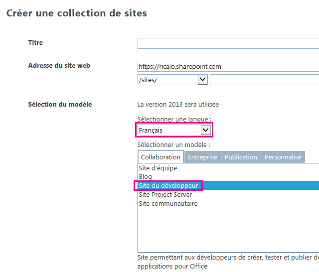

# Localiser les compléments pour SharePoint
Localisez un Complément SharePoint à l'aide de fichiers de ressources, de fichiers de ressources JavaScript et d'autres techniques.
> **REMARQUE**
> Cette rubrique présuppose que vous connaissez la procédure de création de base de Compléments SharePoint et les fonctionnalités SharePoint, la distinction entre les sites web de complément et les sites web hôtes,  [les types de composant SharePoint qui peuvent être présents dans un complément](host-webs-add-in-webs-and-sharepoint-components-in-sharepoint-2013.md#TypesOfSPComponentsInApps) et les concepts de base de la localisation des fichiers .resx.


## Se préparer à la localisation d'un complément SharePoint
<a name="Prerequisites"> </a>

Avant de commencer, identifiez les éléments suivants :


- Les paramètres régionaux que votre complément doit prendre en charge. SharePoint Online et SharePoint sur site avec les modules linguistiques installés permettent aux utilisateurs de créer des sites web dans une langue et selon une culture spécifique. Vous devez connaître les sites web localisés que vos clients vont utiliser et déterminer ceux qui doivent être pris en charge par une version localisée des composants de votre complément.


- Les composants à localiser dans votre complément.


En outre, tenez compte des éléments suivants :


-  Les procédures décrites dans cet article présupposent que vous utilisez la version la plus récente des [outils de développement Office pour Visual Studio 2013](http://aka.ms/OfficeDevToolsForVS2013) ou des [outils de développement Office pour Visual Studio 2015](http://aka.ms/OfficeDevToolsForVS2015).

    > **REMARQUE**
      > Si votre site web SharePoint de test est une batterie de serveurs SharePoint sur site au lieu d'un site du développeur Microsoft SharePoint Online, vous devez installer les modules linguistiques pour les langues dans lesquelles vous traduisez votre Complément SharePoint. Pour plus d'informations, consultez les rubriques  [Installer ou désinstaller des modules linguistiques pour SharePoint 2013](http://technet.microsoft.com/fr-fr/library/cc262108%28v=office.15%29.aspx) et [Modules linguistiques dans SharePoint Server 2013](http://technet.microsoft.com/fr-fr/library/ff463597%28v=office.15%29.aspx) (et les liens de téléchargement dans cette rubrique).
- Les captures d'écran et les exemples de code de cet article proviennent de l'exemple  [SharePoint-Add-in-Localization](https://github.com/OfficeDev/SharePoint-Add-in-Localization). Vous pouvez télécharger cet exemple pour visualiser les résultats des procédures décrites dans cet article.


## Localiser les composants du site web de complément
<a name="LocalizingAppWeb"> </a>

Un site web de complément peut contenir des types spécifiques de composants SharePoint. Pour plus d'informations sur les types de composant SharePoint pouvant se trouver dans un complément SharePoint, consultez la section  [Types de composants SharePoint pouvant se trouver dans un complément SharePoint](host-webs-add-in-webs-and-sharepoint-components-in-sharepoint-2013.md#TypesOfSPComponentsInApps). Pour localiser les composants déployés sur un site web de complément, ajoutez des fichiers .resx dans les modules de la fonctionnalité contenant le composant de site web du complément. Référencez ensuite les ressources dans la balise du composant. Cette procédure est expliquée plus loin dans cet article. Cependant, les pages de sites personnalisées dans un Complément SharePoint utilisent les fichiers de variables de chaîne JavaScript au lieu des fichiers .resx, comme décrit plus loin dans cette section.


> **REMARQUE**
> Les fichiers de ressources ne peuvent pas être partagés par plusieurs fonctionnalités de sites web de complément. Pour chaque fonctionnalité du fichier .wsp, vous devez créer des ensembles de fichiers de ressources distincts. 


### Pour créer des fichiers de ressources du site web de complément


1. Ouvrez le projet de Complément SharePoint dans Visual Studio. (Les captures d'écran de cette rubrique ont été prises dans un complément hébergé par un fournisseur ayant des formulaires web ASP.NET comme partie d'application web distante du projet.)


2. Dans l' **Explorateur de solutions**, ouvrez le menu contextuel du nom de la fonctionnalité et choisissez **Ajouter une ressource de fonctionnalité**.


3. Dans la boîte de dialogue **Ajouter une ressource**, choisissez **Langue indifférente (pays/région indifférent)**, puis sélectionnez le bouton **OK**. Un fichier Resources.resx est ajouté au dossier de la fonctionnalité dans l' **Explorateur de solutions**, et le fichier s'ouvre dans l' **Éditeur de ressources**Visual Studio. 

    Quand il est modifié, le fichier « Langue indifférente » contient les chaînes utilisées dans la galerie **Fonctionnalité** sur tous les sites dans les langues pour lesquelles vous n'allez *pas*  fournir de version localisée des chaînes. Ainsi, la langue utilisée pour les chaînes de ce fichier doit être la langue qui sera probablement la deuxième langue employée par les utilisateurs de SharePoint. En général, l'anglais est utilisé, mais dans certains cas, l'utilisation d'une autre langue est préférable. Par exemple, le français sera peut-être, dans certaines régions, la deuxième langue la plus employée, avant l'anglais. L'exemple de cette rubrique utilise l'anglais comme langue indifférente.

    > **REMARQUE**
      > Un Complément SharePoint ne peut pas être installé sur un site web dont la langue n'est pas répertoriée dans la section **Paramètres régionaux pris en charge** du manifeste de complément. N'oubliez pas que même si cet article traite de langues dans lesquelles vous n'allez *pas*  fournir de complément localisé, vous devez quand même ajouter ces langues au manifeste de complément. Consultez la procédure **Pour créer les fichiers de ressources du site web hôte** dans cet article pour en savoir plus sur les paramètres régionaux pris en charge dans le manifeste de complément.
4. Dans la colonne **Nom** de la première ligne de l' **Éditeur de ressources**, entrez un nom descriptif pour la chaîne (ou une autre ressource). Par exemple, OrdersListInstance_Title etOrdersListInstance_Description. Ces noms de ressources localisables ne sont pas eux-mêmes localisés. Chaque ressource doit avoir son propre nom. 


5. Dans la colonne **Valeur**, entrez une chaîne appropriée (ou une URL ou une autre ressource) dans la langue indifférente. Par exemple, Commandes etUne liste pour stocker les commandes.


6. Ajoutez des paires de nom et de valeur supplémentaires pour toutes les chaînes et les ressources à localiser pour pouvoir les utiliser dans n'importe quel composant de votre fonctionnalité.


7. Enregistrez le fichier.


8. Ajoutez un autre fichier de ressources à la fonctionnalité comme vous l'avez fait auparavant, mais sélectionnez une langue spécifique au lieu de **Langue indifférente (pays/région indifférent)**. Par exemple, vous pouvez choisir **Espagnol (Espagne)**. Un fichier Resources.LL-CC.resx (où  `LL` et `CC` sont des codes de langue et de culture [conformes au Groupe de travail IETF](http://tools.ietf.org/html/rfc1766)) est ajouté au dossier de la fonctionnalité dans l' **Explorateur de solutions** et le fichier s'ouvre dans l' **Éditeur de ressources**Visual Studio. 


9. À l'aide de l' **Éditeur de ressources**, copiez toutes les lignes du fichier Resources.resx et collez-les dans le nouveau fichier Resources.LL-CC.resx. (Si l'option **Copier** n'est pas activée dans le menu contextuel de l'éditeur de ressources, utilisez Ctrl-C pour copier les lignes dans le Presse-papiers).


10. Dans le fichier Resources.LL-CC.resx, remplacez les cellules **Valeur** par les versions traduites des valeurs de chaîne. Pour les URL et les ressources autres que des chaînes, remplacez la valeur par une nouvelle valeur correspondant à la langue et la culture.


11. Enregistrez le nouveau fichier.


12. Répétez les quatre dernières étapes pour chaque langue étrangère.

    > **REMARQUE**
      > Pensez à ajouter un fichier spécifique d'une langue pour la langue correspondant à votre langue indifférente. Ainsi, vous pouvez copier les lignes sans modifier les valeurs des chaînes. Dans de nombreux cas, il n'est pas nécessaire d'avoir un fichier spécifique d'une langue pour la langue utilisée dans le fichier de ressources pour la langue indifférente, notamment quand les seules ressources des fichiers sont des chaînes. Cependant, les fichiers de ressources peuvent contenir des images, des icônes, des fichiers et d'autres types de ressources. Parfois, le fichier de ressources de la langue indifférente doit utiliser une image ou une autre ressource dans  *n'importe quel*  fichier spécifique d'une langue.
13. Pour chaque fichier, vérifiez que la propriété **Action de génération** est définie sur **Contenu**.


### Pour appeler les ressources localisées dans des listes personnalisées


1. Pour localiser les propriétés de titre et de description d'une liste personnalisée, ouvrez le fichier **Elements.xml** de l'instance de la liste. Par exemple, dans l'exemple figurant dans cette rubrique, accédez à **BookstoreApp** > **Statut de la commande** > **OrderStatusInstance** > **Elements.xml** dans l' **Explorateur de solutions**.


2. Dans l'attribut **Title**, entrez $Resources: _StringName_, où  _StringName_ est le nom (et non la valeur) que vous avez donné au cours de la procédure précédente à la chaîne nommant la liste personnalisée. Par exemple,$Resources: OrdersListInstance_Title. Contrairement à certains cas où les fichiers .resx sont utilisés, le nom du fichier de ressources ne fait  *pas*  partie de ce que vous entrez.


3. Utilisez l'attribut **Description** pour appeler la ressource de chaîne de la description de liste de la même façon. Par exemple,$Resources: OrdersListInstance_Description. Vous trouverez ci-dessous la balise qui utilise les chaînes localisées dans le fichier Elements.xml de l'instance d'une liste.

 ```XML

<?xml version="1.0" encoding="utf-8"?>
<Elements xmlns="http://schemas.microsoft.com/sharepoint/">
  <ListInstance 
      Title="$Resources:OrdersListInstance_Title" 
      OnQuickLaunch="TRUE" 
      TemplateType="10000" 
      Url="Lists/Orders" 
      Description="$Resources:OrdersListInstance_Description">
  </ListInstance>
</Elements>
 ```


    L'image suivante montre la liste personnalisée localisée en anglais.


   **Liste personnalisée localisée**


!\[Liste personnalisée localisée](images/LocSPApp_AppwebList.png)


### Pour localiser les noms de colonne d'une liste personnalisée


1. Vous ne pouvez pas localiser les noms de colonne de la liste personnalisée de la même façon que le titre ou la description. Pour localiser les noms de colonne, vous devez déclarer les champs de la liste dans un fichier **Elements.xml** et définir la valeur d'attribut **DisplayName** avec les références des fichiers de ressources web du complément. Pour commencer, ouvrez le fichier **Schema.xml** de votre liste personnalisée. Localisez le nœud **Fields** et copiez tous ses nœuds **Field**.


2. Ouvrez le fichier **Elements.xml** de votre liste personnalisée. Assurez-vous d'avoir ouvert le fichier Elements.xml de la définition de liste, et non de l'instance de la liste. Collez les nœuds de l'étape précédente en tant qu'enfants du nœud **Elements**.


3. Pour chaque nœud **Field**, entrez une valeur de $Resources: _StringName_ dans l'attribut **DisplayName** où _StringName_ est le nom d'une entrée dans le fichier de ressources web du complément.


4. Dans le fichier **Schema.xml** de votre liste personnalisée, supprimez l'attribut **DisplayName** de chaque nœud **Field** précédemment copié. Dans l'exemple suivant, la balise utilise les chaînes localisées du fichier **Elements.xml** de la définition de liste.

 ```

<?xml version="1.0" encoding="utf-8"?>
<Elements xmlns="http://schemas.microsoft.com/sharepoint/">
    <ListTemplate
        Name="Orders"
        Type="10000"
        BaseType="0"
        OnQuickLaunch="TRUE"
        SecurityBits="11"
        Sequence="410"
        DisplayName="Orders"
        Description="My List Definition"
        Image="/_layouts/15/images/itgen.png"/>
    <Field
        Name="Bookname"
        ID="{2ef60a05-29b6-41db-9611-c0cf7d8e73c5}"
        DisplayName="$Resources:OrdersListColumn_Bookname"
        Type="Text"
        Required="TRUE" />
    <Field
        Name="Price"
        ID="{7af42815-d69e-426a-a1c8-9da5610e362c}"
        DisplayName="$Resources:OrdersListColumn_Price"
        Type="Currency"
        Required="FALSE" />
    <Field
        Name="Orderstatus"
        ID="{687ee751-2e0a-4099-966e-d2c225d48234}"
        DisplayName="$Resources:OrdersListColumn_Orderstatus"
        Type="Lookup"
        Required="FALSE"
        List="Lists/Order status"
        ShowField="Title" />
</Elements>
 ```


### Pour créer les fichiers de ressources JavaScript pour les pages personnalisées


1. Les pages de site personnalisées d'un Complément SharePoint utilisent des fichiers de variables de chaînes JavaScript au lieu de fichiers .resx. 

    Pour commencer, dans l' **Explorateur de solutions**, ajoutez un nom de dossier Scripts dans le projet de complément SharePoint (et non le projet d'application web) s'il n'en existe pas déjà un. Cliquez avec le bouton droit de la souris sur le dossier **Scripts** et sélectionnez **Ajouter** > **Nouvel élément** > **Web** > **Fichier JavaScript**. Nommez le fichier Resources. _LL_- _CC_.js (où  _LL_ est un code de langue et _CC_ est un code de pays/région ou de culture). Par exemple,Resources.en-US.js.


2. Répétez l'étape précédente pour chaque langue étrangère. Les fichiers JavaScript devraient maintenant être vides pour chaque langue. Ne créez  *pas*  de fichier de langue indifférente nommé « Resources.js ». Vous découvrirez pourquoi plus loin.


3. Ouvrez le premier des nouveaux fichiers JavaScript.


4. Pour chaque chaîne localisable de chaque page personnalisée, déclarez une variable dans le fichier avec un nom identifiant l'objectif de la chaîne et affectez-lui la valeur correspondant à la langue. Vous trouverez ci-dessous le contenu du fichier Resources.en-US.js.

 ```

var instructionstitle = "Instructions:";
var step01 = "Go to any document library in the host web.";
var step02 = "Go to the Library tab.";
var step03 = "Click \\"Request a book\\" in the Settings group.";
var step04 = "Click the contextual menu in any document.";
var step05 = "Click \\"Buy this book\\" in the contextual menu.";
var step06 = "Go to any SharePoint page in the host web and add the" +
    " Bookstore orders add-in part.";
var step07 = "Review the localized <a href=\\"../Lists/Orders\\">Orders</a>" +
    " and <a href=\\"../Lists/Order status\\">Order status</a> custom lists.";

 ```

5. Copiez le contenu du fichier dans chacun des fichiers JavaScript restants, puis enregistrez tous les fichiers.


6. Dans chaque fichier, remplacez la valeur de chaque variable par une nouvelle valeur adaptée à la langue du fichier.  *Ne modifiez pas le nom des variables.* 


### Pour appeler les variables localisées dans les pages ASPX personnalisées


1. Dans **l'Explorateur de solutions**, ouvrez un fichier de page ASPX personnalisée.


2. Assurez-vous que seul un des fichiers JavaScript localisés est chargé pendant le chargement de votre page. Il doit s'agir du fichier correspondant à la langue du site web de complément SharePoint. Pour cela, ajoutez la balise suivante à l'élément **asp:content** de la page dont la valeur `PlaceholderAdditionalPageHead` est accompagnée de `ContentPlaceholderId`.  *Cette balise ne contient aucun espace réservé. Entrez la balise telle qu'elle apparaît ici.* 

 ```HTML

<script type="text/javascript" src="../scripts/Resources.<SharePoint:EncodedLiteral runat='server' text='<%$Resources:wss,language_value%>' EncodeMethod='HtmlEncode' />.js"></script>
 ```


    Cette balise charge un de vos fichiers JavaScript. Elle détermine le fichier de langue à charger en lisant la ressource SharePoint nommée « language_value ». Cette ressource génère le nom d'une culture/langue selon le schéma  _LL_- _CC_ décrit précédemment. Plus précisément, elle correspond à la langue du site web de complément.

    > **REMARQUE**
      > La ressource SharePoint « language_value » n'est jamais NULL. Ce script n'appelle jamais un fichier nommé « Resources.js ». C'est pourquoi vous n'en avez créé aucun au cours de la procédure précédente. Quand la valeur de « language_value » est une langue pour laquelle il n'existe pas de fichier .js, ce script ne charge rien. L'étape suivante explique comment les chaînes reçoivent une valeur de langue indifférente dans cette situation. 
3. Attribuez une valeur par défaut dans la langue indifférente à chaque valeur d'attribut et d'élément localisable sur la page, puis utilisez JavaScript pour lui affecter la variable appropriée du fichier Resources. _LL_- _CC_.js. Par exemple, si la page a un titre dans un élément **h2**, donnez à cet élément un attribut **id** et insérez un élément **script** sous les éléments localisés pour affecter des chaînes localisées à la propriété **innerText** de ces derniers. Ce code de localisation ne doit être exécuté que si le fichier Resources. _LL_- _CC_.js a chargé et déclaré les variables. Par conséquent, placez-le dans un bloc conditionnel pour d'abord vérifier si l'une des variables est définie. Si ce n'est pas le cas, aucun script de ressources n'est chargé et les valeurs par défaut (indifférentes) doivent demeurer inchangées. Voici un exemple. 

    > **CONSEIL**
      > Le mot « INDIFFÉRENT » a été ajouté à la première des chaînes indifférentes. Évitez de le faire dans un complément de production. Par contre, il s'agit d'un moyen utile pendant votre test de vérifier en un clin d'œil si les chaînes de langue indifférentes sont utilisées ou si le fichier Resources. _LL_- _CC_.js pour la langue indifférente a été chargé. 

 ```HTML
  <h2 id="instructionsheading">INVARIANT Instructions</h2>
<ol>
    <li id="step01">Go to any document library in the host web.</li>
    <li id="step02">Go to the Library tab.</li>
    <li id="step03">Click "Request a book" in the Settings group.</li>
    <li id="step04">Click the contextual menu in any document.</li>
    <li id="step05">Click "Buy this book" in the contextual menu.</li>
    <li id="step06">Go to any SharePoint page in the host web and add the Bookstore orders add-in part.</li>
    <li id="step07">Review the localized <a href="../Lists/Orders">Orders</a> and <a href="../Lists/Order status">Order status</a> custom lists.</li>
</ol>

<!-- Use the localized strings in the resource JavaScript file -->
<script type="text/javascript">
    window.onload = function () {
        <!-- Test whether a Resources.LL-CC.js loaded.
             If none was, the invariant values remain unchanged. -->
        if (typeof instructionstitle != 'undefined')
        {
            document.getElementById("instructionsheading").innerText = instructionstitle;
            document.getElementById("step01").innerText = step01;
            document.getElementById("step02").innerText = step02;
            document.getElementById("step03").innerText = step03;
            document.getElementById("step04").innerText = step04;
            document.getElementById("step05").innerText = step05;
            document.getElementById("step06").innerText = step06;
            document.getElementById("step07").innerHTML = step07;
        }
    }
</script>

 ```


    L'image suivante vous donne un aperçu de l'apparence de la version anglaise de la page une fois le complément achevé. 


   **Page web utilisant des chaînes localisées d'un fichier de ressources JavaScript**


!\[Page SharePoint avec des chaînes localisées](images/LocSPApp_AppwebPage.png)


## Localiser les composants du site web hôte
<a name="LocalizingHostWeb"> </a>

Vous pouvez localiser le titre du complément spécifié dans le fichier AppManifest.xml. C'est le titre qui apparaît sur la page **Your Add-ins**. Le site web hôte d'un Complément SharePoint peut également inclure une action personnalisée, un composant de complément ou les deux. Ils sont déployés dans une fonctionnalité du site web hôte. Ces deux composants peuvent utiliser des chaînes localisables.


La méthode de base pour localiser les composants du site web hôte est la même que pour localiser les composants du site web de complément : les ressources localisées sont répertoriées dans un fichier .resx et sont appelées depuis les fichiers de balises. Cependant, Visual Studio n'a pas autant d'outils de prise en charge du processus, car il s'applique aux fonctionnalités du site web hôte. Pour cela, il existe un processus manuel, décrit plus loin dans cette section.


### Pour créer les fichiers de ressources du site web hôte


1. Dans l' **Explorateur de solutions**, choisissez le fichier AppManifest.xml pour ouvrir l'outil de conception du manifeste du complément.


2. Ouvrez l'onglet **Paramètres régionaux pris en charge**.


3. Dans la première cellule vide de la colonne **Paramètres régionaux**, ouvrez la liste déroulante et choisissez le premier paramètre régional à prendre en charge. Deux fichiers sont créés et ajoutés au projet Complément SharePoint : Resources.resx, qui est le fichier de ressources de langue indifférente, et Resources. _LL_- _CC_.resx, qui contient les ressources localisées.  *Ne modifiez pas les noms de ces fichiers.* 


4. Répétez l'étape précédente pour chaque paramètre régional à prendre en charge avec une version localisée du complément. Un fichier Resources. _LL_- _CC_.resx supplémentaire est créé pour chaque paramètre régional.

    > **REMARQUE**
      > La propriété **Action de génération** de chacun de ces fichiers a la valeur **Contenu**, et non **Ressource**.  *Ne changez pas ce paramètre.* 
5. Ajoutez également des entrées de paramètres régionaux pour chaque paramètre régional dans lequel votre complément peut être installable, mais où la langue indifférente doit être utilisée, autrement dit pour les paramètres régionaux pour lesquels vous ne fournirez  *pas*  de version localisée du complément. *Supprimez les fichiers .resx créés pour ces paramètres régionaux.* 


6. Ouvrez le fichier Resources.resx et ajoutez les noms et les valeurs des ressources au fichier de la même manière que pour les fichiers de ressources du site web de complément. Vous devez disposer au minimum d'une ressource pour le titre du complément. La fonctionnalité du site web hôte n'apparaît pas dans l'interface utilisateur SharePoint. Par conséquent, vous n'avez pas besoin de chaînes localisées pour le titre ou la description de la fonctionnalité du site web hôte. Si la fonctionnalité a une action personnalisée, vous avez besoin d'une ressource pour l'attribut **Title** de l'élément **CustomAction**, et éventuellement d'autres chaînes dans la balise de l'action personnalisée. S'il existe un composant de complément, vous avez besoin de ressources pour les attributs **Title** et **Description** de l'élément **ClientWebPart**. Si le composant de complément a des propriétés personnalisées, chaque **Property** comporte des attributs à localiser. Vous avez besoin d'une ligne pour chacun d'entre eux dans le fichier de ressources.


7. Copiez le contenu du fichier Resources.resx dans les fichiers Resources. _LL_- _CC_.resx.


8. Localisez chaque ressource dans chaque fichier Resources. _LL_- _CC_.resx de la même manière que pour les fichiers de ressources du site web de complément.


### Pour appeler les ressources localisées dans le manifeste du complément et d'autres fichiers XML


1. Ouvrez le fichier AppManifest.xml et remplacez la valeur de l'élément **Title** par un appel à la chaîne de ressources appropriée. Par exemple, si vous avez nommé la chaîneAddin_Title, l'élément **Title** doit ressembler à ceci :

 ```XML

<Title>$Resources:Addin_Title;</Title>
 ```


    > **ATTENTION**
      > La valeur de **Title** peut *uniquement*  contenir l'appel à la ressource. Il ne peut y avoir d'autres textes, symboles ou espaces.
2. Pour appeler des ressources localisées dans d'autres fichiers XML (par exemple, Elements.xml pour des composants de complément et des actions personnalisées), utilisez le même format que celui utilisé dans le fichier manifeste du complément.


## Localiser les composants distants dans un complément SharePoint
<a name="LocalizingAutohosted"> </a>

Si les composants distants sont au format PHP ou des formats autres que Microsoft, consultez les conseils de localisation correspondant à la plateforme appropriée. Si les composants distants sont ASP.NET, localisez-les de la même façon que pour toute autre application ASP.NET. Pour plus d'informations, consultez la rubrique  [Globalisation et localisation ASP.NET](http://msdn.microsoft.com/library/8ef3838e-9d05-4236-9dd0-ceecff9df80d.aspx).


Remplacez la langue de la page et la langue de thread pour qu'elles correspondent à la langue du site web hôte. Pour cela, remplacez la méthode **InitializeCulture** héritée dans le code-behind de vos pages ASP.NET. Pour identifier la langue du site web hôte, utilisez le paramètre de requête **SPLanguage** que SharePoint transmet à la page distante. Le code suivant montre comment procéder dans ASP.NET. Vous devez effectuer une opération semblable dans une application web PHP ou une autre plateforme.



```cs
protected override void InitializeCulture()
{
    if (Request.QueryString["SPLanguage"] != null)
    {
        string selectedLanguage = Request.QueryString["SPLanguage"];
    
        // Override the page language.
        UICulture = selectedLanguage;
        Culture = selectedLanguage;

        // Reset the thread language.
        Thread.CurrentThread.CurrentCulture =
            CultureInfo.CreateSpecificCulture(selectedLanguage);
        Thread.CurrentThread.CurrentUICulture = new
            CultureInfo(selectedLanguage);
    }
    base.InitializeCulture();
}
```


## Localisez le contrôle Chrome SharePoint et JavaScript à distance
<a name="JSandChrome"> </a>

Si le JavaScript de votre application web contient des valeurs de chaîne localisables, vous pouvez les localiser à l'aide des fichiers de ressources JavaScript. Un exemple particulièrement important de JavaScript localisable est le  [contrôle Chrome SharePoint](use-the-client-chrome-control-in-sharepoint-add-ins.md), qui peut être utilisé pour donner à des pages distantes l'apparence de pages SharePoint. Dans cette section, nous utiliserons la localisation du contrôle Chrome à titre d'exemple.


> **REMARQUE**
> Cette section aborde uniquement la localisation des chaînes. Si vous avez besoin d'une localisation plus puissante, telle que la localisation du format de date ou de devise, utilisez une bibliothèque de globalisation ou de localisation, comme le  [module complémentaire Globalize pour jQuery](https://github.com/jquery/globalize). 


### Pour localiser le contrôle Chrome


1. Une fois que le contrôle Chrome fonctionne, revenez à la méthode  `renderChrome` où vous avez défini les options Chrome.

 ```

function renderChrome() {
    var options = {
        "appIconUrl": "siteicon.png",
        "appTitle": "My SharePoint add-in", // Localizable string
        "appHelpPageUrl": "Help.html?"
            + document.URL.split("?")[1],
        "onCssLoaded": "chromeLoaded()",
        "settingsLinks": [
            {
                "linkUrl": "Account.html?"
                    + document.URL.split("?")[1],
                "displayName": "Account settings" // Localizable string
            },
            {
                "linkUrl": "Contact.html?"
                    + document.URL.split("?")[1],
                "displayName": "Contact us" // Localizable string
            }
        ]
    };

 ```

2. Comme indiqué dans les commentaires, il existe au moins trois chaînes localisables. Remplacez chacune d'elle par un nom de variable que vous déclarerez à une étape ultérieure. 

 ```

function renderChrome() {
    var options = {
        "appIconUrl": "siteicon.png",
        "appTitle": chromeAppTitle, // Localized value
        "appHelpPageUrl": "Help.html?"
            + document.URL.split("?")[1],
        "onCssLoaded": "chromeLoaded()",
        "settingsLinks": [
            {
                "linkUrl": "Account.html?"
                    + document.URL.split("?")[1],
                "displayName": chromeAccountLinkName // Localized value
            },
            {
                "linkUrl": "Contact.html?"
                    + document.URL.split("?")[1],
                "displayName": chromeContactUsLinkName // Localized value
            }
        ]
    };

 ```

3. Ajoutez un fichier JavaScript nommé ChromeStrings.js au projet d'application web. Il doit déclarer les variables utilisées à l'étape précédente et attribuer à chacune une valeur dans la langue indifférente. 

 ```

var chromeAppTitle = "My SharePoint add-in";
var chromeAccountLinkName = "Account settings";
var chromeContactUsLinkName = "Contact us";

 ```

4. Pour chaque langue dans laquelle vous localisez le complément, ajoutez un autre fichier JavaScript nommé ChromeStrings. _LL-CC_.js ( _LL-CC_ est l'ID de la langue). *La base du nom de fichier (ici, « ChromeStrings ») doit être identique à celle utilisée pour le fichier de langue indifférente.*  Copiez le contenu du fichier de langue indifférente dans chaque fichier localisé et remplacez les valeurs par les versions traduites.

 ```

var chromeAppTitle = "Mi aplicación SharePoint";
var chromeAccountLinkName = "Preferencias";
var chromeContactUsLinkName = "Contacto";

 ```

5. Dans l'un des fichiers de page où le fichier de script SP.UI.controls.js est appelé, ajoutez un appel au fichier ChromeStrings.js situé au-dessus. Par exemple, si l'appel au fichier SP.UI.controls.js est chargé dans un fichier intermédiaire nommé ChromeLoader.js, la balise de la page doit être, à ce stade, semblable à l'exemple suivant.

 ```

<Scripts>
  <asp:ScriptReference Path="Scripts/ChromeStrings.js" />
  <asp:ScriptReference Path="Scripts/ChromeLoader.js" />
</Scripts>
 ```

6. Ajoutez un attribut **ResourceUICultures** à l'élément **ScriptReference** qui appelle vos chaînes. Sa valeur est une liste des langues que vous prenez en charge, séparées par des virgules.

 ```

<Scripts>
  <asp:ScriptReference Path="Scripts/ChromeStrings.js" ResourceUICultures="en-US,es-ES" />
  <asp:ScriptReference Path="Scripts/ChromeLoader.js" />
</Scripts>
 ```


    L'attribut **ResourceUICultures** permet à ASP.NET de rechercher un fichier nommé ChromeStrings. _LL-CC_.js (où  _LL-CC_ est la langue de la page) et de le charger. S'il ne le trouve pas, il charge le fichier ChromeStrings.js.


## Tester son complément SharePoint localisé
<a name="TestingLocalizedApps"> </a>

Testez votre complément en le déployant sur un site web SharePoint configuré dans l'une des langues prises en charge par votre complément. Vous pouvez tester votre complément sur un site web SharePoint Online ou un site web local.


### Pour tester votre complément sur un site web SharePoint Online


1. Accédez à votre centre d'administration Office 365.


2. Sélectionnez **Paramètres de service** dans le menu de navigation, puis **Sites**.


3. Sous Collections de sites, sélectionnez **Créer une collection de sites**.


4. Sous **Sélectionner une langue**, choisissez la langue dans laquelle vous voulez tester votre complément.


5. Sous **Sélectionner un modèle**, choisissez **Site du développeur**.


6. Dans votre projet Complément SharePoint, mettez à jour la propriété **SiteUrl** avec l'URL de la nouvelle collection de sites.


7. Appuyez sur F5 pour exécuter le complément.


**Page Créer une collection de sites**





### Pour tester votre complément sur un site web local


1. Installez le module linguistique dans lequel vous voulez tester votre complément. Pour plus d'informations, consultez les rubriques  [Installer ou désinstaller des modules linguistiques pour SharePoint 2013](http://technet.microsoft.com/fr-fr/library/cc262108.aspx) et [Modules linguistiques dans SharePoint Server 2013](http://technet.microsoft.com/fr-fr/library/ff463597%28v=office.15%29.aspx).


2. Ouvrez l'Administration centrale de la batterie de serveurs.


3. Sous **Gestion des applications**, choisissez **Créer des collections de sites**.


4. Sous **Sélectionner une langue**, choisissez la langue dans laquelle vous voulez tester votre complément.


5. Sous **Sélectionner un modèle**, choisissez **Site du développeur**.


6. Dans votre projet de Complément SharePoint, mettez à jour la propriété **SiteUrl** avec l'URL de la collection de sites récemment créée.


7. Appuyez sur F5 pour exécuter le complément.


## Ressources supplémentaires
<a name="SP15Localizeapp_addlresources"> </a>


-  [Développer des compléments pour SharePoint](develop-sharepoint-add-ins.md)


-  [Localisation des compléments Office](http://msdn.microsoft.com/library/5a1a1cd7-b716-4597-b51f-fa70357d0833%28Office.15%29.aspx)


-  [ASP.NET Globalization and Localization](http://msdn.microsoft.com/library/8ef3838e-9d05-4236-9dd0-ceecff9df80d.aspx)


-  [SharePoint-Add-in-Localization](https://github.com/OfficeDev/SharePoint-Add-in-Localization)


