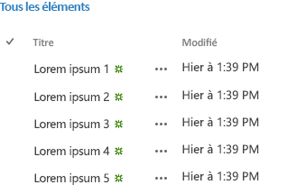

# Vue d'ensemble d'Office Web Widgets - Expérimental
Découvrez les Office Web Widgets - Expérimental et leur utilisation dans les Compléments Office, les Compléments SharePoint et les sites web.
> **ATTENTION**
> Les Office Web Widgets - Expérimental ne sont fournis qu'à des fins de recherche et de commentaires de la part des utilisateurs. Ne les employez pas en phase de production. Le comportement des Office Web Widgets peut changer considérablement dans les prochaines versions. Lisez les  [Termes du contrat de licence Office Web Widgets - Expérimental](office-web-widgetsexperimental-license-terms.md). 

Les contrôles clients, tels que les Office Web Widgets - Expérimental, peuvent nettement réduire la durée de développement des compléments, et simultanément, améliorer leur qualité. Pour ce faire, les widgets doivent répondre à certains critères :
- Les widgets doivent être conçus pour être utilisables dans n'importe quelle page web, même si la page n'est pas hébergée dans SharePoint.

- Les widgets fonctionnent dans le runtime des contrôles Office. Il est ainsi possible de fournir un ensemble d'exigences commun et une syntaxe cohérente pour leur utilisation.

- Les widgets qui communiquent en retour avec SharePoint utilisent la bibliothèque inter-domaines. Les widgets ne dépendent pas d'une technologie ou d'une plate-forme côté serveur particulière. Vous pouvez les utiliser quelle que soit la technologie de serveur choisie.

- Les widgets doivent coexister avec les autres éléments de la page. L'inclusion d'un widget dans une page ne doit pas modifier les autres éléments qui s'y trouvent.

- Ne malmenez pas les infrastructures existantes. Nous voulons être sûrs que vous pouvez toujours utiliser les outils et technologies auxquels vous êtes habitué.

**Figure 1. Complément utilisant les Office Web Widgets - Expérimental**

Vous pouvez utiliser les widgets en installant le package NuGet **Office Web Widgets - Expérimental** à partir de Visual Studio. Pour plus d'informations, voir la page web relative à la [gestion des packages NuGet à l'aide de la boîte de dialogue](http://docs.nuget.org/docs/start-here/managing-nuget-packages-using-the-dialog). Vous pouvez aussi parcourir cette  [page NuGet gallery](http://www.nuget.org/packages/Microsoft.Office.WebWidgets.Experimental/).Vos remarques et commentaires nous ont aidés à choisir les widgets à fournir. Comme le montre la figure 1, (1) le widget Sélecteur de personnes et (2) le widget d'affichage de liste de bureau sont prêts pour que vous les expérimentiez. Saisissez vos éventuels commentaires sur le  [site Office Developer Platform UserVoice](http://officespdev.uservoice.com/)Vous pouvez également voir les widgets en action dans l'exemple de code de  [démonstration Office Web Widgets - Expérimental](http://code.msdn.microsoft.com/SharePoint-2013-Office-Web-6d44aa9e).
## Widget Sélecteur de personnes

Vous pouvez utiliser le widget Sélecteur de personnes expérimental dans les compléments pour faciliter la recherche et la sélection de personnes et de groupes sur un client. Les utilisateurs commencent la saisie dans la zone de texte et le widget récupère les personnes dont le nom ou l'adresse de messagerie correspond au texte entré.

**Figure 2. Widget Sélecteur de personnes résolvant une requête**

Vous pouvez déclarer le widget dans le code HTML ou par programmation avec JavaScript. Dans les deux cas, un élément **div** est utilisé en tant qu'espace réservé pour le widget. Vous pouvez également définir des propriétés et des gestionnaires d'événements pour le widget Sélecteur de personnes. Le tableau suivant présente les propriétés et événements disponibles pour le widget Sélecteur de personnes.

|**Propriété/Événement**|**Type**|**Description**|
|:-----|:-----|:-----|
|**objectType**   |Objet JSON (liste de chaînes)    | Type des éléments résolus par le widget. Options :    User    Group    Seule valeur par défaut : User.   |
|**allowMultipleSelections**   |Valeur booléenne    |True/False. Avec False, le widget permet la sélection d'un seul élément à la fois.           Valeur par défaut=False.    |
|**rootGroupName**   |Chaîne    |S'il est renseigné, le widget limite la sélection aux éléments du groupe.           Sinon, il interroge les objets de l'ensemble de la location.    |
|**selectedItems**   |Tableau JSON    |Liste des éléments sélectionnés. Chaque élément renvoie un objet représentant un utilisateur ou un groupe.    |
|**onAdded**   |Fonction    |Événement qui se déclenche quand un nouvel objet est ajouté à la sélection. L'objet ajouté est reçu par la fonction de gestionnaire.    |
|**onRemoved**   |Fonction    |Événement qui se déclenche quand un nouvel objet est supprimé de la sélection. L'objet supprimé est reçu par la fonction de gestionnaire.    |
|**onChange**   |Fonction    |Événement qui se déclenche en cas d'ajout ou de suppression d'objets. Aucun paramètre n'est transmis à la fonction de gestionnaire.    |
|**validationErrors**   |Tableau    | Tableau des erreurs de validation possibles :    empty    unresolvedItem    tooManyItems   |
|**autoShowValidationMessage**   |Valeur booléenne    |True=Afficher          False=Ne pas afficher    |
|**hasErrors**   |Valeur booléenne    |True=1 ou plusieurs erreurs de validation          False=Aucune erreur de validation    |
|**errors**   |Tableau    | Tableau des erreurs de validation possibles :    empty    unresolvedItem    tooManyItems   |
|**displayErrors**   |Valeur booléenne    |True=Afficher les erreurs          False=Ne pas afficher les erreurs    |
 
Les classes CSS du widget Sélecteur de personnes sont définies dans la feuille de style **Office.Controls.css**. Vous pouvez remplacer les classes et choisir le style du widget pour votre complément.

Pour plus d'informations, voir  [Utiliser le widget expérimental Sélecteur de personnes dans les compléments pour SharePoint](use-the-experimental-people-picker-widget-in-sharepoint-add-ins.md) et l'exemple de code relatif à l' [utilisation du widget expérimental Sélecteur de personnes dans un complément](http://code.msdn.microsoft.com/SharePoint-2013-Use-the-57859f85). 

## Widget d'affichage de liste de bureau

Comme le widget d'affichage de liste standard, le widget d'affichage de liste permet à vos utilisateurs d'afficher les données dans une liste. Il n'est en outre pas limité aux compléments hébergés par SharePoint.

**Figure 3. Widget d'affichage de liste de bureau affichant des données dans une liste**

Vous pouvez spécifier un affichage existant dans la liste, le widget présente les champs dans l'ordre dans lequel ils apparaissent dans l'affichage.

> **REMARQUE**
> Pour le moment, le widget d'affichage de liste de bureau permet seulement d'afficher les données, pas de les modifier. 

Vous pouvez fournir un espace réservé au widget à l'aide d'un élément **div**. Vous pouvez utiliser le widget par programmation ou de façon déclarative.

Vous pouvez également définir des propriétés ou des gestionnaires d'événements pour le widget d'affichage de liste de bureau. Le tableau suivant présente les propriétés et événements disponibles pour le widget d'affichage de liste de bureau.

|**Propriété/Événement**|**Type**|**Description**|
|:-----|:-----|:-----|
|**listUrl**   |URL    |URL de l'affichage de liste duquel tirer les éléments. Il peut s'agir d'une URL relative, auquel cas l'emplacement supposé sera le site web de complément lui-même, ou d'une URL absolue.    |
|**viewName**   |Chaîne    |Nom de l'affichage à faire apparaître. Il s'agit du nom de programmation de l'affichage (pas de son nom complet).    |
|**onItemSelected**   |Fonction    |Événement qui se déclenche quand un élément est sélectionné dans la liste.    |
|**onItemAdded**   |Fonction    |Événement qui se déclenche quand un nouvel élément est ajouté à la liste.    |
|**onItemRemoved**   |Fonction    |Événement qui se déclenche quand un élément est supprimé de la liste.    |
|**selectedItems**   |Tableau    |Liste des éléments sélectionnés au format JSON.    |
 
Le widget requiert la feuille de style du site web SharePoint. Vous pouvez référencer la feuille de style SharePoint directement ou utiliser le widget de chrome. Pour plus d'informations sur la feuille de style, voir  [Utilisation d'une feuille de style de site web SharePoint dans les compléments pour SharePoint](use-a-sharepoint-website-s-style-sheet-in-sharepoint-add-ins.md) et [Utiliser le contrôle de chrome client dans les compléments pour SharePoint](use-the-client-chrome-control-in-sharepoint-add-ins.md). 

Pour voir le widget d'affichage de liste en action, voir l'exemple de code relatif à l' [utilisation du widget expérimental d'affichage de liste de bureau dans un complément](http://code.msdn.microsoft.com/SharePoint-2013-Use-the-c3edb076). Voir aussi  [Utiliser le widget expérimental d'affichage de liste de bureau dans les compléments pour SharePoint](use-the-experimental-desktop-list-view-widget-in-sharepoint-add-ins.md).

## Conclusion

Les widgets peuvent vous aider à accélérer le processus de développement et la sortie sur le marché de vos compléments, ainsi qu'à en réduire le coût. Office Web Widgets - Expérimental fournit des widgets utilisables dans vos compléments hors environnement de production. Vos remarques et commentaires sont les bienvenus sur le  [site Office Developer Platform UserVoice](http://officespdev.uservoice.com/).

## Ressources supplémentaires

-  [Termes du contrat de licence Office Web Widgets - Expérimental](office-web-widgetsexperimental-license-terms.md)

-  [Page NuGet gallery sur Office Web Widgets - Expérimental](http://www.nuget.org/packages/Microsoft.Office.WebWidgets.Experimental/)

-  [Utiliser le widget expérimental Sélecteur de personnes dans les compléments pour SharePoint](use-the-experimental-people-picker-widget-in-sharepoint-add-ins.md)

-  [Exemple de code de démonstration Office Web Widgets - Expérimental](http://code.msdn.microsoft.com/SharePoint-2013-Office-Web-6d44aa9e)

-  [Utiliser le widget expérimental d'affichage de liste de bureau dans les compléments pour SharePoint](use-the-experimental-desktop-list-view-widget-in-sharepoint-add-ins.md)

-  [Exemple de code relatif à l'utilisation du widget expérimental Sélecteur de personnes dans un complément](http://code.msdn.microsoft.com/SharePoint-2013-Use-the-57859f85)

-  [Exemple de code relatif à l'utilisation du widget expérimental d'affichage de liste de bureau dans un complément](http://code.msdn.microsoft.com/SharePoint-2013-Use-the-c3edb076)

