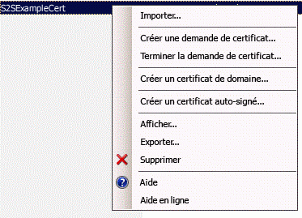

# Empaquetage et publication de compléments SharePoint à haut niveau de fiabilité
Découvrez comment empaqueter et publier un Complément SharePoint à haut niveau de fiabilité en vue d'une utilisation locale.
## Conditions préalables à l'empaquetage et à la publication de compléments à haut niveau de fiabilité
<a name="Prereqs"> </a>

Vous devez disposer des éléments suivants :
  
    
    

- Un environnement de développement SharePoint 2013 local. Voir  [Configurer un environnement de développement local pour les compléments pour SharePoint](set-up-an-on-premises-development-environment-for-sharepoint-add-ins.md) pour obtenir des instructions d'installation.
    
  
- Un serveur Web IIS pour héberger l'application Web distante. Le gestionnaire des services IIS doit être installé.
    
  
- Visual Studio installé à distance ou sur l'ordinateur sur lequel vous avez installé SharePoint 2013.
    
  
- Outils de développement Microsoft Office pour Visual Studio
    
  
-  [Web Deploy](http://www.iis.net/downloads/microsoft/web-deploy) installé sur l'ordinateur Visual Studio et la même version de **Web Deploy** installée sur le serveur d'applications Web distant.
    
  
Le Tableau 1 répertorie des articles utiles vous aidant à comprendre les concepts nécessaires pour créer des Compléments SharePoint.
  
    
    

**Tableau 1. Principaux concepts pour la publication de compléments à haut niveau de fiabilité**


|**Titre de l'article**|**Description**|
|:-----|:-----|
| [Commencer à créer des compléments hébergés par un fournisseur pour SharePoint](get-started-creating-provider-hosted-sharepoint-add-ins.md) <br/> |Découvrez comment créer un Complément SharePoint hébergé par le fournisseur au moyen des Outils de développement Office pour Visual Studio.  <br/> |
| [Créer des compléments à haut niveau de fiabilité pour SharePoint 2013](create-high-trust-sharepoint-add-ins.md) <br/> |Découvrez comment créer un Complément SharePoint à haut niveau de fiabilité de base à l'aide des Outils de développement Office pour Visual Studio en utilisant un certificat auto-signé et un ID d'émetteur associé.  <br/> |
| [Web Deploy](http://www.iis.net/downloads/microsoft/web-deploy) <br/> |Web Deploy simplifie le déploiement d'applications et de sites Web sur des serveurs IIS.  <br/> |
| [Digital Certificates](http://msdn.microsoft.com/library/e523b335-0156-4f47-b55c-b80495587c4f.aspx) et [Working with Certificates](http://msdn.microsoft.com/library/6ffb8682-8f07-4a45-afbb-8d2487e9dbc3.aspx) <br/> |Découvrez les concepts de base liés aux certificats numériques.  <br/> |
   

> **REMARQUE**
> Les Compléments SharePoint à haut niveau de fiabilité peuvent uniquement être installés sur les installations SharePoint locales et non sur Microsoft SharePoint Online, et sont principalement destinés à être utilisés avec une application web locale plutôt que dans le cloud. Cet article explique comment publier le complément dans ce scénario. Par ailleurs, dans cet article, le terme « client » désigne l'entreprise qui installe le Complément SharePoint et héberge les composants distants de celui-ci. 
  
    
    


## Inscrire le complément à haut niveau de fiabilité
<a name="Register"> </a>

Avant de publier le complément, vous devez l'inscrire dans le système de gestion des compléments de la batterie de serveurs SharePoint. Les Compléments SharePoint à haut niveau de fiabilité sont toujours inscrits dans la batterie sur laquelle le complément doit être installé. (Ils ne peuvent pas être vendus via l'Office Store.) L'inscription s'effectue sur la page http:// _SharePoint_website_/_layouts/15/appregnew.aspx, comme indiqué dans la procédure suivante.
  
    
    

### Pour inscrire le complément


1. Accédez à la page http:// _SharePoint_website_/_layouts/15/appregnew.aspx. Choisissez les boutons **Générer** pour générer des valeurs pour votre ID de complément et votre clé secrète. (La clé secrète n'est pas réellement utilisée dans les Compléments SharePoint à haut niveau de fiabilité, mais le formulaire en exige une.) Indiquez l'URL de base du domaine où l'application web distante de votre complément s'exécutera. N'ajoutez pas le protocole (HTTPS) dans le domaine, mais indiquez le port que les composants distants utiliseront pour les requêtes HTTPS s'il ne s'agit pas de 443 (par exemple,www.contoso.com:5555 ouMonServeurApp:4444).
    
    Si vous avez besoin d'un URI de redirection, entrez également une valeur pour cela. Voir  [Flux OAuth de code d'authentification pour les compléments SharePoint](authorization-code-oauth-flow-for-sharepoint-add-ins.md) pour obtenir une explication de la façon dont l'URI de redirection peut être utilisé.
    
    Le formulaire affiché sur la page devrait ressembler à la figure 1. Dans cet exemple, le serveur d'applications web distant est à l'écoute des requêtes HTTPS sur le port par défaut 443 et il n'est donc pas nécessaire d'indiquer le port dans le domaine du complément.
    

   **Figure 1. Inscrire le complément sur appregnew.aspx**

  

     
  

  

  
2. Choisissez **Créer**. Les informations que vous avez entrées pour le complément s'affichent sur la page suivante. Veillez à garantir la disponibilité de ces informations, car vous en aurez besoin lorsque vous utiliserez les outils de publication de Visual Studio. Il peut s'avérer judicieux d'effectuer une capture d'écran rapide de cette page.
    
  

## Choisir une stratégie pour obtenir, tenir à jour et déployer des certificats pour vos Compléments SharePoint à haut niveau de fiabilité
<a name="Certificate"> </a>

Lorsqu'un développeur utilise **F5** dans Visual Studio pour développer et déboguer un Complément SharePoint à haut niveau de fiabilité, il peut utiliser un certificat auto-signé, comme le décrit l'article [Créer des compléments à haut niveau de fiabilité pour SharePoint 2013](create-high-trust-sharepoint-add-ins.md). Toutefois, au moment de la  *publication*  du complément, le certificat auto-signé déclenche l'affichage d'une page d'avertissement dans le navigateur avant d'ouvrir la page de démarrage de l'application web distante. L'utilisateur doit alors choisir s'il souhaite continuer. Des exemples de ces avertissements sont présentés dans la figure 3.
  
    
    

**Figure 3. Avertissements pour les certificats auto-signés**

  
    
    

  
    
    

  
    
    
Ce désagrément est éventuellement acceptable pour un développeur, mais pas pour les clients. En l'occurrence, avant la publication finale dans un environnement de production, le client doit obtenir un certificat signé par un tiers approuvé. Il peut s'agir d'une autorité de certification (CA - Certificate Authority) commerciale ou d'une CA locale. Concernant les CA commerciales, notez que le secteur d'activité met en place l'abandon progressif des certificats « intranet seulement » pour les serveurs Web. Il est toujours possible de les acheter, mais ces certificats expireront en novembre 2016 ou plus tôt. Il n'est pas nécessaire de disposer de ce type de certificat pour un Complément SharePoint à haut niveau de fiabilité, car les certificats pouvant être utilisés pour les serveurs Web accessibles sur Internet peuvent également l'être pour les serveurs Web d'intranets, mais ces derniers sont généralement plus coûteux.
  
    
    
Le certificat doit être dans deux formats, Échange d'informations personnelles (.pfx) et Certificat de sécurité (.cer). Si le client ne l'obtient pas initialement dans l'un de ces formats, il peut le convertir à l'aide d'un utilitaire. Par ailleurs, une fois la version au format .pfx obtenue, le fichier pfx peut être importé dans IIS, puis réexporté au format .cer, comme indiqué ci-dessous.
  
    
    
Si le certificat obtenu initialement est au format .cer, il contient à la fois les clés privée et publique. En règle générale, le fichier .cer utilisé par SharePoint ne doit pas contenir la clé privée. Envisagez d'importer le certificat d'origine dans IIS, puis d'exporter une nouvelle version .cer qui ne contient pas la clé privé, comme décrit ci-dessous. Pour plus d'informations sur les fichiers .pfx et .cer, voir  [Certificat de publication de logiciels](http://msdn.microsoft.com/fr-fr/library/windows/hardware/ff552299%28v=vs.85%29.aspx).
  
    
    
De plus, le client doit choisir entre l'utilisation d'un seul certificat pour tous les Compléments SharePoint à haut niveau de fiabilité ou des certificats distincts pour chacun d'entre eux. Pour plus d'informations sur ce choix, voir  [Décision entre l'utilisation d'un seul certificat ou de plusieurs certificats pour les Compléments SharePoint à haut niveau de fiabilité.](creating-sharepoint-add-ins-that-use-high-trust-authorization.md#Deciding)
  
    
    

## Configurer le serveur Web distant avec le certificat
<a name="ConfigureRemote"> </a>

Les procédures suivantes sont effectuées sur le serveur Web distant qui héberge l'application Web distante.
  
    
    

### Pour configurer le serveur Web distant et le certificat .pfx


1. Attribuez un mot de passe fort au certificat .pfx. Pour plus d'informations, voir  [Consignes de création de mots de passe forts](http://msdn.microsoft.com/fr-fr/library/bb416446.aspx) et [Mots de passe forts](http://msdn.microsoft.com/fr-fr/library/ms161962.aspx).
    
  
2. Importez le certificat dans IIS sur le serveur web distant en procédant comme suit :
    
1. Dans le Gestionnaire des services Internet, sélectionnez le nœud  _NomServeur_ dans l'arborescence sur la gauche.
    
  
2. Double-cliquez sur l'icône **Certificats de serveur**.
    
  
3. Dans le volet **Actions** sur la droite, sélectionnez **Importer**.
    
  
4. Dans la boîte de dialogue **Importer un certificat**, utilisez le bouton de navigation pour accéder au fichier .ptx, puis entrez le mot de passe du certificat.
    
  
5. Si vous utilisez le Gestionnaire des services Internet 8, vous trouverez une liste déroulante **Sélectionner un magasin de certificat**. Choisissez **Personnel**. (Il s'agit du stockage du certificat « personnel » de l'ordinateur, pas de l'utilisateur.)
    
  
6. Si vous ne disposez pas encore d'une version .cer, ou si celle-ci existe, mais contient la clé privée, activez l'option **Autoriser l'exportation du certificat**.
    
  
7. Cliquez sur **OK**.
    
  

### Pour ouvrir le magasin de certificats Windows


1. Sur le même serveur, ouvrez la console **Microsoft Management Console** en suivant les instructions de l'article [Ouvrir MMC 3.0](http://technet.microsoft.com/fr-fr/library/cc766121.aspx).
    
  
2. Ajoutez le composant logiciel enfichable **Certificats** du compte de l'ordinateur comme décrit dans l'article [Ajouter le composant logiciel enfichable Certificats à une console MMC](http://technet.microsoft.com/fr-fr/library/cc754431.aspx). Veillez à utiliser la procédure pour l' *ordinateur*  , et non pour un utilisateur ou un service. Choisissez l'ordinateur *local*  , et non un « autre » ordinateur lorsque vous y êtes invité.
    
  
Ignorez la procédure suivante si vous utilisez le Gestionaire des services Internet 8.
  
    
    

### Étapes supplémentaires pour obtenir le certificat dans le magasin de certificats Windows avec le Gestionnaire des services Internet 7


1. Créez un dossier sur le système de fichiers de serveur à utiliser comme emplacement de stockage temporaire pour le certificat.
    
  
2. Dans le Gestionnaire des services Internet, sélectionnez le nœud  _NomServeur_ dans l'arborescence sur la gauche.
    
  
3. Double-cliquez sur l'icône **Certificats de serveur**.
    
  
4. Dans la liste **Certificats de serveur**, cliquez avec le bouton droit sur le certificat, puis sélectionnez **Exporter**, comme le montre la Figure 4.
    
   **Figure 4. Exportation d'un certificat**

  

     
  

  

  
5. Exportez le fichier vers le dossier que vous avez créé et entrez son mot de passe.
    
  
6. Dans la console **Microsoft Management Console**, importez le certificat comme décrit dans l'article  [Importer un certificat](http://technet.microsoft.com/fr-fr/library/cc754489.aspx). N'oubliez pas de spécifier le magassin **Personnel**.
    
  
7. Laissez la console ouverte pour la procédure suivante.
    
  
8.  *Supprimez le dossier que vous avez créé à la première étape et le fichier de certificat qu'il contient.*  En effet, les avantages de sécurité liés à la conservation du certificat dans le magasin de certificats disparaissent s'il réside également dans le système de fichiers.
    
  
La procédure suivante est applicable au Gestionnaire de services Internet 7 et 8.
  
    
    

### Pour obtenir le numéro de série du certificat


1. Dans la console **Microsoft Management Console**, accédez au dossier **Certificats** sous le dossier **Personnel** du composant logiciel enfichable **Certificats (ordinateur local)**, s'il n'est pas déjà ouvert.
    
  
2. Double-cliquez sur le certificat de votre Complément SharePoint pour l'ouvrir, puis ouvrez l'onglet **Détails**.
    
  
3. Sélectionnez le champ **Numéro de série** pour faire apparaître le numéro de série complet dans la zone.
    
  
4. Copiez le numéro de série  *sans espaces*  dans un fichier texte, puis communiquez-le au développeur du Complément SharePoint.
    
    > **CONSEIL**
      > Des blogs et des questions posées sur des forums de développeurs laissent entendre que la copie directe du numéro de série dans le Presse-papiers crée une chaîne contenant des caractères masqués, impossible à reconnaître par le code du Complément SharePoint. Envisagez de saisir manuellement le numéro plutôt que de le copier. 
Vous devez ensuite créer une version .cer du certificat. Celle-ci contient la clé publique du serveur Web distant et est utilisée par SharePoint pour déchiffrer les demandes provenant de l'application Web distante et valider les jetons d'accès de ces demandes. Elle est créée sur le serveur Web distant, puis déplacée vers la batterie de serveurs SharePoint.
  
    
    

### Pour créer le certificat .cer


1. Dans le Gestionnaire des services Internet, sélectionnez le nœud  _NomServeur_ dans l'arborescence de gauche.
    
  
2. Double-cliquez sur **Certificats de serveur**.
    
  
3. Dans la vue **Certificats de serveur**, double-cliquez sur le certificat pour en afficher les détails.
    
  
4. Sous l'onglet **Détails**, choisissez **Copier dans un fichier** pour lancer l' **Assistant Exportation du certificat**, puis cliquez sur **Suivant**.
    
  
5. Utilisez la valeur par défaut **Non, ne pas exporter la clé privée**, puis cliquez sur **Suivant**.
    
  
6. Utilisez les valeurs par défaut de la page suivante. Choisissez **Suivant**.
    
  
7. Choisissez **Parcourir**, puis accédez à n'importe quel dossier. (Le fichier .cer va être déplacé en dehors de cet ordinateur de toute façon.) Attribuez au fichier le même nom que le fichier .pfx, puis choisissez **Enregistrer**. Le certificat est enregistré dans un fichier .cer.
    
  
8. Cliquez sur **Suivant**.
    
  
9. Cliquez sur **Terminer**.
    
  

## Configurer SharePoint pour utiliser le certificat
<a name="ConfigureSP"> </a>

Les procédures décrites dans cette section peuvent être effectuées sur un serveur SharePoint sur lequel le **SharePoint Management Shell** est installé.
  
    
    

### Pour distribuer le fichier .cer sur SharePoint


1. Créez un dossier et assurez-vous que les identités des pools de complément IIS suivants ont une autorisation en lecture :
    
  - **SecurityTokenServiceApplicationPool**
    
  
  - Pool de compléments servant le site web IIS hébergeant l'application web SharePoint parente pour votre Site web SharePoint de test. Pour le site web IIS **SharePoint - 80**, le pool est nommé **OServerPortalAppPool**.
    
  
2.  *Déplacez*  (ne copiez pas simplement) le fichier .cer à partir du serveur web distant vers le dossier vous venez de créer sur le serveur SharePoint. Le fichier ne résidera que de façon temporaire dans ce dossier.
    
  
La procédure suivante configure le certificat en tant qu'émetteur de jeton approuvé dans SharePoint. Elle n'est exécutée qu'une fois (pour chaque Complément SharePoint à haut niveau de fiabilité).
  
    
    

### Pour configurer le certificat


1. Si ce n'est pas déjà fait, créez les scripts Windows PowerShell à haut niveau de fiabilité dont vous avez besoin, comme décrit dans  [Scripts de configuration à haut niveau de fiabilité pour SharePoint 2013](high-trust-configuration-scripts-for-sharepoint-2013.md).
    
  
2. Copiez les scripts sur le serveur SharePoint.
    
  
3. Ouvrez le **SharePoint Management Shell** en tant qu'administrateur et exécutez les scripts appropriés.
    
  
4. L'un des scripts permet au client de partager un seul certificat entre plusieurs Compléments SharePoint. Il génère un fichier qui contient le GUID de l'émetteur de jeton. Si vous utilisez ce script, fournissez le fichier renvoyé au développeur du Complément SharePoint à haut niveau de fiabilité.
    
  
5.  *Supprimez le fichier .cer du système de fichiers du serveur SharePoint.* 
    
  

> **REMARQUE**
> L'inscription du certificat en tant qu'émetteur de jeton n'est pas immédiatement effective et le complément ne fonctionnera pas tant qu'il n'est pas inscrit. Il peut s'écouler 24 heures avant que tous les serveurs SharePoint ne reconnaissent le nouvel émetteur de jeton. Si cela ne perturbe pas les utilisateurs de SharePoint, vous pouvez exécuter une commande iisreset sur tous les serveurs SharePoint pour permettre la reconnaissance immédiate de l'émetteur. 
  
    
    


## Modifier le fichier web.config
<a name="WebConfig"> </a>


> **CONSEIL**
> Pour obtenir un exemple de code qui inclut un fichier web.config modifié, voir  [PnP / Samples / Core.OnPrem.S2S.WindowsCertStore](https://github.com/OfficeDev/PnP/tree/dev/Samples/Core.OnPrem.S2S.WindowsCertStore). 
  
    
    

Modifiez le fichier web.config de telle sorte qu'il contienne de nouvelles valeurs pour les clés suivantes dans le nœud  `appSettings`.
  
    
    

- **ClientID :** ID (GUID) du client de l'application web, qui a été généré sur appregnew.aspx.
    
  
- ** ClientSigningCertificateSerialNumber :** *(Vous devez ajouter cette clé si les Outils de développement Microsoft Office pour Visual Studio ne l'ont pas ajoutée.)*  Il s'agit du numéro de série du certificat. Cette valeur ne doit pas contenir d'espaces, ni de tirets.
    
  
- **IssuerId :** GUID de l'émetteur de jeton ( *qui doit être en minuscules*  ). Sa valeur dépend de la stratégie de certificat du client :
    
  - Si le Complément SharePoint à haut niveau de fiabilité dispose de son propre certificat qui n'est pas partagé avec d'autres Compléments SharePoint, la valeur  `IssuerId` est la même que pour `ClientId`.
    
  
  - Si le Complément SharePoint partage un même certificat avec d'autres Compléments SharePoint, la valeur  `IssuerId` est un GUID arbitraire. Le script de ce scénario, disponible dans l'article [Scripts de configuration à haut niveau de fiabilité pour SharePoint 2013](high-trust-configuration-scripts-for-sharepoint-2013.md) génère un fichier de texte contenant ce GUID. Le personnel informatique peut transmettre le fichier de sortie au développeur du complément pour que celui-ci l'insère dans le fichier web.config au titre de valeur `IssuerId`.
    
  

> **REMARQUE**
> Les Outils de développement Office pour Visual Studio peuvent avoir ajouté des clés de paramétrage de complément pour **ClientSigningCertificatePath** et **ClientSigningCertificatePassword**. Celles-ci ne sont pas utilisées dans les compléments de production et doivent être supprimées. 
  
    
    

Un exemple est fourni ci-dessous. Notez qu'il n'y a pas de clé **ClientSecret** pour un Complément SharePoint à haut niveau de fiabilité.
  
    
    


```XML

<appSettings>
  <add key="ClientID" value="c1c12d4c-4900-43c2-8b89-c05725e0ba30" />
  <add key="ClientSigningCertificateSerialNumber" value="556a1c9c5a5415994941abd0ef2f947b" />
  <add key="IssuerId" value="f94591d5-89e3-47cd-972d-f1895cc158c6" />
</appSettings>

```


## Modifier le fichier TokenHelper
<a name="WebConfig"> </a>

Le fichier TokenHelper.cs (ou .vb) généré par les Outils de développement Office pour Visual Studio doit être modifié pour fonctionner avec le certificat stocké dans le magasin de certificats Windows et pour être récupérable par son numéro de série. L'une des méthodes utilisables est présentée dans l'exemple ci-dessous. Cet exemple utilise C#.
  
    
    

> **CONSEIL**
> Pour obtenir un exemple de code qui inclut un fichier tokenhelper.cs modifié, voir  [PnP / Samples / Core.OnPrem.S2S.WindowsCertStore](https://github.com/OfficeDev/PnP/tree/dev/Samples/Core.OnPrem.S2S.WindowsCertStore). 
  
    
    


### Pour modifier le fichier TokenHelper


1. Vers la fin de la partie  `#region private fields` du fichier, vous trouverez des déclarations pour `ClientSigningCertificatePath`,  `ClientSigningCertificatePassword` et `ClientCertificate`. Supprimez-les toutes les trois.
    
  
2. À la place, ajoutez la ligne suivante :
    
  ```
  
private static readonly string ClientSigningCertificateSerialNumber
    = WebConfigurationManager.AppSettings.Get("ClientSigningCertificateSerialNumber");
  ```

3. Recherchez la ligne qui déclare le champ  `SigningCredentials`. Remplacez-la par la ligne suivante :
    
  ```
  
private static readonly X509SigningCredentials SigningCredentials
    = GetSigningCredentials(GetCertificateFromStore());
  ```

4. Accédez à la partie  `#region private methods` du fichier et ajoutez les deux méthodes suivantes :
    
  ```
  
private static X509SigningCredentials GetSigningCredentials(X509Certificate2 cert)
{
    return (cert == null) ? null 
                          : new X509SigningCredentials(cert, 
                                                       SecurityAlgorithms.RsaSha256Signature, 
                                                       SecurityAlgorithms.Sha256Digest);
}

private static X509Certificate2 GetCertificateFromStore()
{
    if (string.IsNullOrEmpty(ClientSigningCertificateSerialNumber))
    {
        return null;
    }  

    // Get the machine's personal store
    X509Certificate2 storedCert;
    X509Store store = new X509Store(StoreName.My, StoreLocation.LocalMachine); 

    try
    {
        // Open for read-only access                 
        store.Open(OpenFlags.ReadOnly);

        // Find the cert
        storedCert = store.Certificates.Find(X509FindType.FindBySerialNumber, 
                                             ClientSigningCertificateSerialNumber, 
                                             true)
                       .OfType<X509Certificate2>().SingleOrDefault();
    }
    finally
    {
        store.Close();
    }

    return storedCert;
}
  ```


## Utiliser les Assistants Visual Studio pour empaqueter votre application web distante et le Complément SharePoint en vue de la publication
<a name="Package"> </a>


> **CONSEIL**
> Microsoft met à jour Visual Studio et Outils de développement Office pour Visual Studio bien plus fréquemment qu'auparavant et il n'est pas toujours possible de mettre à jour la documentation au rythme des modifications. Cet article a été écrit à partir de la version de Visual Studio publiée en octobre 2013 et de la version de Outils de développement Office pour Visual Studio fournie avec. Si vous travaillez avec une version antérieure ou ultérieure de Visual Studio ou des outils, il peut s'avérer nécessaire de consulter l'aide de Visual Studio et les publications dans les blogs afin de trouver des méthodes équivalentes d'exécution pour les étapes de ces procédures. 
  
    
    


### Pour empaqueter l'application web à distance


1. Dans l' **Explorateur de solutions**, cliquez avec le bouton droit de la souris sur le projet d'application web (et non le projet de Complément SharePoint) et sélectionnez ** Publier**.
    
  
2. Sous l'onglet **Profil**, sélectionnez **Nouveau profil** dans la liste déroulante.
    
  
3. Lorsque vous y êtes invité, attribuez un nom approprié au profil. Par exemple, Complément SP de paie - Application web distante.
    
  
4. Dans l'onglet **Connexion**, sélectionnez **Package Web Deploy** dans la liste déroulante **Méthode de publication**.
    
  
5. Désignez n'importe quel dossier pour la valeur **Emplacement du package**. Pour simplifier les procédures ultérieures, il doit s'agir d'un dossier vide. Un sous-dossier du dossier bin du projet est généralement utilisé.
    
  
6. Pour le nom du site, entrez le nom du site Web IIS qui héberge l'application web. N'incluez pas de protocole, de port ou de barre oblique dans le nom (par exemple, « SiteDePaie »). Si vous souhaitez que l'application web soit un enfant du site Web par défaut, utilisez Site Web par défaut _/<nom du site web>_ (par exemple, « Site Web par /SiteDePaie »). (Si le site Web IIS n'existe pas déjà, il est créé lorsque vous exécutez le package Web Deploy au cours d'une procédure ultérieure.)
    
  
7. Cliquez sur **Suivant**.
    
  
8. Dans l'onglet **Paramètres**, sélectionnez **Publier** ou **Déboguer** dans la liste déroulante **Configuration**.
    
  
9. Cliquez sur **Suivant**, puis sur **Publier**. Un fichier .zip et divers autres fichiers utilisés pour installer l'application web au cours d'une procédure ultérieure sont créés à l'emplacement du package.
    
  

### Pour créer un package de Complément SharePoint


1. Cliquez avec le bouton droit sur le projet de Complément SharePoint dans votre solution, puis choisissez **Publier**.
    
  
2. Dans la liste déroulante **Profil actuel**, sélectionnez le profil que vous avez créé pendant la dernière procédure.
    
  
3. Si un petit symbole d'avertissement jaune apparaît en regard du bouton **Modifier**, cliquez sur **Modifier**. Un formulaire s'ouvre pour vous demander les informations que vous avez incluses dans le fichier web.config. Ces informations ne sont pas obligatoires car vous utilisez la méthode de publication **Package Web Deploy**, mais vous ne pouvez pas laisser ce formulaire vide. Entrez des caractères dans les quatre zones de texte, puis cliquez sur **Terminer**.
    
  
4. Cliquez sur le bouton **Empaqueter le complément**. (Ne cliquez pas sur **Déployer votre projet web**. En effet, ce bouton répète simplement la dernière étape de la dernière procédure.) Le formulaire **Empaqueter le complément** apparaît.
    
  
5. Dans la zone de texte **Où est hébergé votre site web ?**, entrez l'URL du domaine de l'application web distante. Vous devez inclure le protocole, HTTPS, et si le port sur lequel l'application web écoute les requêtes HTTPS n'est pas 443, indiquez également le port (par exemple, https://MonServeur:4444). (Il s'agit de la valeur que les Outils de développement Office pour Visual Studio utilisent pour remplacer le jeton ~remoteAppUrl dans le manifeste du Complément SharePoint.)
    
  
6. Dans la zone de texte **Quel est l'ID client du complément ?**, entrez l'identifiant client qui a été généré sur la page appregnew.aspx et que vous avez également entré dans le fichier web.config.
    
  
7. Cliquez sur **Terminer**. Votre package de complément est créé.
    
  

## Publier l'application web à distance et installer le Complément SharePoint
<a name="PublishRemote"> </a>


  
    
    

### Pour publier l'application web


1. Accédez au dossier que vous avez utilisé comme **emplacement du package** lorsque vous avez empaqueté l'application web distante, puis copiez tous les fichiers qu'il contient dans un dossier du serveur distant.
    
  
2. Dans ce dossier, ouvrez le fichier  _nom_projet_.deploy-readme.txt (où  _nom_projet_ est le nom du projet d'application web Visual Studio) et suivez les instructions figurant dans le fichier pour installer l'application web à l'aide du fichier _nom_projet_.deploy.cmd.
    
  

### Pour configurer la liaison de protocole pour l'application web


1. Dans le Gestionnaire des services Internet, sélectionnez le nouveau site Web dans le volet **Connexions**. (Si la nouvelle application web est un enfant du **site web par défaut**, mettez le **site web par défaut** en surbrillance et exécutez cette procédure pour ce **site**.)
    
  
2. Cliquez sur **Liaisons** dans le volet **Actions**.
    
  
3. Dans la boîte de dialogue **Liaisons de site**, cliquez sur **Ajouter**. Dans la boîte de dialogue **Ajouter la liaison de site** qui apparaît, effectuez les opérations suivantes.
    
1. Sélectionnez **HTTPS** dans la liste déroulante **Type**.
    
  
2. Sélectionnez **Toutes non attribuées** dans la liste déroulante **Adresse IP**.
    
  
3. Entrez le port dans la zone de texte **Port**. Si vous avez indiqué un port du domaine de complément dans lequel vous avez inscrit le Complément SharePoint dans appregnew.aspx (comme indiqué dans  [Inscrire le complément à haut niveau de fiabilité](#Register)), utilisez le même numéro ici. Si vous n'avez indiqué aucun port dans appregnew, utilisez le port 443.
    
  
4. Dans la liste déroulante **Certificat SSL**, sélectionnez le certificat que vous avez utilisé plus haut pour configurer le serveur, dans  [Configurer le serveur Web distant avec le certificat](#ConfigureRemote).
    
  
5. Cliquez sur **OK**.
    
  
4. Cliquez sur **Fermer**.
    
  

### Pour configurer l'authentification pour l'application web


1. À l'installation initiale d'une nouvelle application web dans IIS, celle-ci est configurée pour un accès anonyme, mais le Complément SharePoint étant pratiquement toujours conçu pour demander l'authentification des utilisateurs, vous devez modifier ce paramètre. Dans le Gestionnaire des services Internet, mettez en surbrillance l'application web dans le volet **Connexions**. Il doit s'agir d'un site web homologue du site web par défaut ou d'un enfant de ce site.
    
  
2. Double-cliquez sur l'icône **Authentification** dans le volet central pour ouvrir le volet **Authentification**.
    
  
3. Mettez en surbrillance **Authentification anonyme**, puis cliquez sur **Désactiver** dans le volet **Actions**.
    
  
4. Mettez en surbrillance le système d'authentification compatible avec l'application web, puis cliquez sur **Activer** dans le volet **Actions**.
    
    Si le code de l'application web utilise le code généré dans les fichiers TokenHelper et SharePointContext sans modification des parties authentification de l'utilisateur des fichiers, cela signifie que l'application web utilise l' **authentification Windows** et c'est l'option que vous devez donc activer.
    
  
5. Si vous utilisez les fichiers de code générés sans modification des parties authentification de l'utilisateur, procédez comme suit pour configurer le fournisseur d'authentification :
    
1. Mettez en surbrillance **Authentification Windows** dans le volet **Authentification**.
    
  
2. Cliquez sur **Fournisseurs**.
    
  
3. Dans la boîte de dialogue **Fournisseurs**, vérifiez que la mention **NTLM** apparaît *au-dessus*  de **Négocier**.
    
  
4. Cliquez sur **OK**.
    
  

### Pour télécharger et installer le Complément SharePoint


1. Téléchargez le fichier de package *.app du Complément SharePoint dans le catalogue de compléments de l'organisation. (Les Compléments SharePoint à haut niveau de fiabilité ne peuvent pas être distribués par le Office Store.) Pour plus de détails, voir  [Ajouter des compléments dans le Catalogue de compléments](http://technet.microsoft.com/fr-fr/library/fp161234.aspx#AddApps).
    
  
2. Installez le complément dans n'importe quel site web, au sein de l'application web SharePoint parent qui contient le catalogue de compléments. Pour plus de détails sur le chargement et l'installation du Complément SharePoint, voir  [Ajouter des compléments SharePoint à un site SharePoint 2013](http://technet.microsoft.com/fr-fr/library/fp161231).
    
  

## Ressources supplémentaires
<a name="bk_addresources"> </a>


-  [Créer des compléments à haut niveau de fiabilité pour SharePoint 2013](create-high-trust-sharepoint-add-ins.md)
    
  
-  [Publier des compléments pour SharePoint à l'aide de Visual Studio](publish-sharepoint-add-ins-by-using-visual-studio.md)
    
  
-  [Enregistrer des compléments dans SharePoint 2013](register-sharepoint-add-ins-2013.md)
    
  
-  [Commencer à créer des compléments hébergés par un fournisseur pour SharePoint](get-started-creating-provider-hosted-sharepoint-add-ins.md)
    
  

