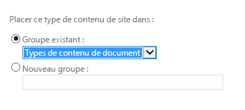

# Fournir un modèle pour une bibliothèque de documents dans un complément de gestion d'informations professionnelles en nuage
En plus des modèles Office à votre disposition lorsque vous ajoutez un document à une bibliothèque de documents SharePoint, vous pouvez fournir vos propres modèles. Par exemple, vous disposez peut-être de votre propre modèle de devis, et vous souhaitez l'utiliser lors de la saisie de nouvelles commandes.
## 

Si ce n'est pas encore fait, associez une bibliothèque de documents à votre complément professionnel dans le Cloud. Voir  [Associer une bibliothèque de documents à une entité](associate-a-document-library-with-an-entity.md)
  
    
    

### Pour ajouter un modèle

1. Rendez-vous sur votre site de développement SharePoint et sur la page ** Développeur**, choisissez **Contenu du site**.
    
  
2. Sur la page **Contenu du Site**, choisissez **Paramètres**, comme illustré dans la figure 1.
    
   **Figure 1. Lien Paramètres**

  

     
  

  

  
3. Sur la page **Paramètres de site**, dans la liste **Galeries du concepteur web**, choisissez **Types de contenu de site**, comme indiqué dans la figure 2.
    
   **Figure 2. Lien Types de contenu de site**

  

     
  

  

  
4. Sur la page **Types de contenu de site**, choisissez **Créer**, comme indiqué à la figure 3.
    
   **Figure 3. Lien Créer**

  

     
  

  

  
5. Sur la page **Nouveau type de contenu de site**, saisissez un nom et une description pour votre modèle. Pour **Type de contenu parent**, choisissez **Types de contenu de document**, puis **Document**, comme indiqué à la figure 4.
    
   **Figure 4. Sélections du type de contenu parent**

  

     
  

  

  
6. Dans la section **Groupe**, dans la liste **Groupe existant**, choisissez **Types de contenu de document**, comme indiqué à la figure 5, puis choisissez **OK**.
    
   **Figure 5. Définition de groupe**

  

     
  

  

  
7. Sur la page **Type de contenu de Site**, choisissez **Paramètres avancés**.
    
  
8. Sur la page **Paramètres avancés**, entrez l'URL d'un document existant, ou téléchargez un nouveau modéle de document, comme indiqué à la figure 6, puis choisissez **OK**.
    
   **Figure 6. Spécifiez le modèle de document**

  

     
  

  

  
9. Rendez-vous sur la page **Contenu de site** et choisissez votre bibliothèque de documents, puis accédez à la page **Paramètres**.
    
  
10. Sur la page **Paramètres**, choisissez **Ajouter à partir de types de contenu de site existants**.
    
  
11. Sur la page **Ajouter des types de contenu**, ajoutez votre modèle comme indiqué à la figure 7, puis cliquez sur **OK**.
    
   **Figure 7. Ajout du modèle**

  

     
  

  

  
12. Exécutez votre complément et ajoutez un document. Votre modèle doit figurer dans la boîte de dialogue **Créer un nouveau fichier** comme indiqué dans la figure 8.
    
   **Figure 8. Boîte de dialogue Ajouter un nouveau fichier avec le nouveau modèle**

  

     
  

  

  

## Ressources supplémentaires

-  [Développement de compléments de gestion d'informations professionnelles dans le Cloud](develop-cloud-business-add-ins.md)
    
  
-  [Associer une bibliothèque de documents à une entité](associate-a-document-library-with-an-entity.md)
    
  

