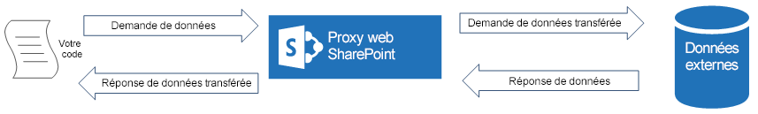
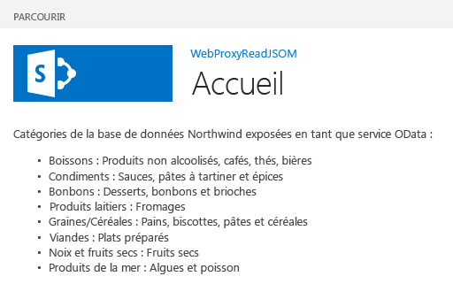

# Interroger un service distant à l'aide du proxy web
Découvrez comment accéder aux données dans un domaine à distance à partir d'une page hébergée dans SharePoint 2013 à l'aide d'un proxy web.
Lorsque vous créez des Compléments SharePoint, vous devez généralement incorporer des données en provenance de différentes sources. Pour des raisons de sécurité, des mécanismes de blocage empêchant la communication entre les domaines sont mis en place. Lorsque vous utilisez le proxy web, les pages web dans votre complément peuvent accéder aux données dans votre domaine à distance et dans le domaine SharePoint.


En tant que développeur, vous pouvez utiliser le proxy web exposé dans les API clientes (par exemple, les modèles objets clients JavaScript et .NET). Lorsque vous utilisez le proxy web, la première requête est destinée à SharePoint. À son tour, SharePoint demande les données au point de terminaison spécifié et retransfère la réponse vers votre page. Utilisez le proxy web lorsque vous souhaitez que la communication ait lieu au niveau du serveur. Pour plus d'informations, voir  [Accès aux données sécurisé et modèles d'objet client pour les compléments SharePoint](secure-data-access-and-client-object-models-for-sharepoint-add-ins.md).
**Le proxy web SharePoint est l'intermédiaire entre votre code et la source de données externe**





## Conditions préalables à l'utilisation des exemples de cet article
<a name="SP15Queryremoteservice_Prereq"> </a>

Pour suivre les étapes dans cet exemple, il vous faut les éléments suivants :


-  [Visual Studio 2015 et outils de développement Microsoft Office les plus récents](https://www.visualstudio.com/features/office-tools-vs.aspx)


- Un environnement de développement SharePoint 2013 (isolation de complément requise pour les scénarios locaux)


### Concepts principaux avant d'utiliser le proxy web

Le tableau suivant contient des articles très utiles pour vous aider dans la compréhension des concepts impliqués dans un scénario multidomaine dans des Compléments SharePoint.


**Tableau 1. Concepts principaux d'un proxy web**


|**Titre de l'article**|**Description**|
|:-----|:-----|
| [Compléments](sharepoint-add-ins.md) <br/> |Découvrez le nouveau modèle de complément SharePoint 2013 qui vous permet de créer des compléments, qui sont des solutions faciles à utiliser et de taille réduite destinées aux utilisateurs finaux.  <br/> |
| [Accès aux données sécurisé et modèles d'objet client pour les compléments SharePoint](secure-data-access-and-client-object-models-for-sharepoint-add-ins.md) <br/> |Découvrez les options d'accès aux données des Compléments SharePoint. Cet article contient des informations sur les principales options parmi lesquelles vous devez effectuer un choix lors de l'utilisation de données dans votre complément.  <br/> |
| [Héberger des sites web, des sites web de complément et des composants SharePoint dans SharePoint 2013](host-webs-add-in-webs-and-sharepoint-components-in-sharepoint-2013.md) <br/> |Découvrez la différence entre les sites web hôtes et les sites web de complément. Découvrez les composants SharePoint 2013 pouvant être inclus dans un Complément SharePoint, les composants déployés sur le site web hôte, les composants déployés sur le site web de complément et la façon dont le site web de complément est déployé dans un domaine isolé.  <br/> |
| [Sécurité inter-domaines côté client](http://msdn.microsoft.com/fr-fr/library/cc709423%28vs.85%29.aspx) <br/> |Explorez les menaces multidomaine et les cas d'utilisation, les principes de sécurité pour les requêtes d'origine multiple, et pesez les risques pour les développeurs qui doivent améliorer l'accès multidomaine à partir d'applications web qui s'exécutent dans le navigateur.  <br/> |
 

## Exemple de code : accédez aux données dans un service à distance à l'aide du proxy web
<a name="SP15Queryremoteservice_Codeexample"> </a>

Pour lire les données à partir d'un service à distance, vous devez procéder comme suit :


1. Créez un projet de Complément SharePoint.


2. Modifiez la page **Default.aspx** pour utiliser le proxy web et interroger le service à distance.


3. Modifiez le manifeste du complément pour autoriser la communication au domaine à distance.


La figure 1 montre la fenêtre du navigateur avec les données du service à distance dans une page web SharePoint.


**Figure 1. Page web SharePoint avec des données du service à distance**





### Création d'un projet de complément SharePoint


1. Ouvrez 2015 en tant qu'administrateur. (Pour cela, cliquez avec le bouton droit de la souris sur l'icône 2015 dans le menu **Démarrer**, et choisissez **Exécuter en tant qu'administrateur**.)


2. Créer un projet à l'aide du modèle **Complément SharePoint**

    La Figure 2 montre l'emplacement du modèle **Complément SharePoint** dans 2015, sous **Modèles**, **Visual C#**, **Office/SharePoint**, **Compléments Office**.


   **Figure 2. Modèle de complément SharePoint dans Visual Studio**


!\[Modèle d'application pour SharePoint 2013 de Visual Studio](images/AppForSharePointVSTemplate.PNG)


3. Indiquez l'URL du site web SharePoint que vous souhaitez utiliser pour le débogage.


4. Sélectionnez **Hébergé par SharePoint** comme option d'hébergement pour votre complément.


### Pour modifier la page Default.aspx et utiliser le proxy web à l'aide du modèle objet JavaScript


1. Double-cliquez sur la page **Default.aspx** dans le dossier **Pages**.


2. Copiez le balisage suivant dans la balise de contenu **PlaceHolderMain** de la page. Le balisage effectue les tâches suivantes :

  - Il fournit un espace réservé pour les données à distance.


  - Il fait référence aux fichiers JavaScript de SharePoint.


  - Il prépare la requête avec un objet **WebRequestInfo**.


  - Il prépare l'en-tête **Accept** de la requête pour fournir la réponse au format JavaScript Object Notation (JSON).


  - Il lance un appel au point terminal à distance.


  - Il gère l'opération de A à Z en reproduisant les données distantes dans la page web SharePoint.


  - Il gère les erreurs, en rendant le message d'erreur dans la page web SharePoint.


 ```

Categories from the Northwind database exposed as an OData service:

<!-- Placeholder for the remote content -->
<span id="categories"></span>

<!-- Add references to the JavaScript libraries. -->
<script 
    type="text/javascript" 
    src="../_layouts/15/SP.Runtime.js">
</script>
<script 
    type="text/javascript" 
    src="../_layouts/15/SP.js">
</script>
<script type="text/javascript">
(function () {
    "use strict";

    // Prepare the request to an OData source
    // using the GET verb.
    var context = SP.ClientContext.get_current();
    var request = new SP.WebRequestInfo();
    request.set_url(
        "http://services.odata.org/Northwind/Northwind.svc/Categories"
        );
    request.set_method("GET");

    // We need the response formatted as JSON.
    request.set_headers({ "Accept": "application/json;odata=verbose" });
    var response = SP.WebProxy.invoke(context, request);

    // Let users know that there is some
    // processing going on.
    document.getElementById("categories").innerHTML =
                "<P>Loading categories...</P>";

    // Set the event handlers and invoke the request.
    context.executeQueryAsync(successHandler, errorHandler);

    // Event handler for the success event.
    // Get the totalResults node in the response.
    // Render the value in the placeholder.
    function successHandler() {

        // Check for status code == 200
        // Some other status codes, such as 302 redirect
        // do not trigger the errorHandler. 
        if (response.get_statusCode() == 200) {
            var categories;
            var output;

            // Load the OData source from the response.
            categories = JSON.parse(response.get_body());

            // Extract the CategoryName and Description
            // from each result in the response.
            // Build the output as a list.
            output = "<UL>";
            for (var i = 0; i < categories.d.results.length; i++) {
                var categoryName;
                var description;
                categoryName = categories.d.results[i].CategoryName;
                description = categories.d.results[i].Description;
                output += "<LI>" + categoryName + ":&amp;nbsp;" +
                    description + "</LI>";
            }
            output += "</UL>";

            document.getElementById("categories").innerHTML = output;
        }
        else {
            var errordesc;

            errordesc = "<P>Status code: " +
                response.get_statusCode() + "<br/>";
            errordesc += response.get_body();
            document.getElementById("categories").innerHTML = errordesc;
        }
    }

    // Event handler for the error event.
    // Render the response body in the placeholder.
    // The body includes the error message.
    function errorHandler() {
        document.getElementById("categories").innerHTML =
            response.get_body();
    }
})();
</script>
 ```


### (Facultatif) Pour modifier la page Default.aspx et utiliser le proxy web à l'aide du point de terminaison REST


1. Double-cliquez sur la page **Default.aspx** dans le dossier **Pages**.


2. Copiez le balisage suivant dans la balise de contenu **PlaceHolderMain** de la page. Le balisage effectue les tâches suivantes :

  - Il fournit un espace réservé pour les données à distance.


  - Il fait référence à la bibliothèque jQuery.


  - Il prépare la requête au point de terminaison **SP.WebRequest.Invoke**.


  - Il prépare le corps de la requête avec un objet **SP.WebrequestInfo**. L'objet comprend un en-tête **Accept** qui fournit la réponse au format JavaScript Object Notation (JSON).


  - Il lance un appel au point de terminaison distant.


  - Il gère l'opération de A à Z en reproduisant les données distantes dans la page web SharePoint.


  - Il gère toutes les erreurs avec un rendu du message d'erreur dans la page web SharePoint.


 ```

Categories from the Northwind database exposed as an OData service:

<!-- Placeholder for the remote content -->
<span id="categories"></span>

<script 
    type="text/javascript" 
    src="//ajax.aspnetcdn.com/ajax/jQuery/jquery-1.8.0.min.js">
</script>

<script type="text/javascript">
(function () {
    "use strict";

    // The Northwind categories endpoint.
    var url =
        "http://services.odata.org/Northwind/Northwind.svc/Categories";

    // Let users know that there is some
    // processing going on.
    document.getElementById("categories").innerHTML =
                "<P>Loading categories...</P>";

    // Issue a POST request to the SP.WebProxy.Invoke endpoint.
    // The body has the information to issue a GET request
    // to the Northwind service.
    $.ajax({
        url: "../_api/SP.WebProxy.invoke",
        type: "POST",
        data: JSON.stringify(
            {
                "requestInfo": {
                    "__metadata": { "type": "SP.WebRequestInfo" },
                    "Url": url,
                    "Method": "GET",
                    "Headers": {
                        "results": [{
                            "__metadata": { "type": "SP.KeyValue" },
                            "Key": "Accept",
                            "Value": "application/json;odata=verbose",
                            "ValueType": "Edm.String"
                        }]
                    }
                }
            }),
        headers: {
            "Accept": "application/json;odata=verbose",
            "Content-Type": "application/json;odata=verbose",
            "X-RequestDigest": $("#__REQUESTDIGEST").val()
        },
        success: successHandler,
        error: errorHandler
    });

    // Event handler for the success event.
    // Get the totalResults node in the response.
    // Render the value in the placeholder.
    function successHandler(data) {
        // Check for status code == 200
        // Some other status codes, such as 302 redirect,
        // do not trigger the errorHandler. 
        if (data.d.Invoke.StatusCode == 200) {
            var categories;
            var output;

            // Load the OData source from the response.
            categories = JSON.parse(data.d.Invoke.Body);

            // Extract the CategoryName and Description
            // from each result in the response.
            // Build the output as a list
            output = "<UL>";
            for (var i = 0; i < categories.d.results.length; i++) {
                var categoryName;
                var description;
                categoryName = categories.d.results[i].CategoryName;
                description = categories.d.results[i].Description;
                output += "<LI>" + categoryName + ":&amp;nbsp;" +
                    description + "</LI>";
            }
            output += "</UL>";

            document.getElementById("categories").innerHTML = output;
        }
        else {
            var errordesc;

            errordesc = "<P>Status code: " +
                data.d.Invoke.StatusCode + "<br/>";
            errordesc += response.get_body();
            document.getElementById("categories").innerHTML = errordesc;
        }
    }

    // Event handler for the error event.
    // Render the response body in the placeholder.
    // The 2nd argument includes the error message.
    function errorHandler() {
        document.getElementById("categories").innerHTML =
            arguments[2];
    }
})();
</script>

 ```


### Pour modifier le fichier manifeste du complément


1. Dans l' **Explorateur de solutions**, ouvrez le menu contextuel du fichier **AppManifest.xml** et sélectionnez **Afficher le code**.


2. Copiez la définition **RemoteEndPoints** suivante comme enfant du nœud **App**.

 ```XML

<RemoteEndpoints>
    <RemoteEndpoint Url=" http://services.odata.org" />
</RemoteEndpoints>
 ```


    L'élément **RemoteEndpoint** est utilisé pour spécifier le domaine à distance. Le proxy web s'assure que les demandes envoyées aux domaines à distance sont déclarées dans le manifeste du complément. Vous pouvez créer jusqu'à 20 entrées dans l'élément **RemoteEndpoints**. Seule la partie autorisée est prise en compte ;  `http://domain:port` et `http://domain:port/website` sont considérés comme étant le même point de terminaison. Vous pouvez envoyer des appels à différents points de terminaison dans un même domaine avec une seule définition **RemoteEndpoint**.


### Pour créer et exécuter la solution


1. Appuyez sur la touche F5.

    > **REMARQUE**
      > Lorsque vous appuyez sur F5, Visual Studio génère la solution, déploie le complément et ouvre la page des autorisations pour le complément. 
2. Choisissez le bouton **Approuver**.


3. Cliquez sur l'icône du complément dans la page Contenu du site.

    La figure 3 montre les données à distance dans la page web SharePoint.


   **Figure 3. Données à distance dans la page web SharePoint**


!\[Page SharePoint avec des données du service distant](images/WebProxy_result.png)


**Tableau 2. Dépannage de la solution**


|**Problème**|**Solution**|
|:-----|:-----|
|Visual Studio n'ouvre pas le navigateur après avoir appuyé sur la touche F5.  <br/> |Définissez le projet de Complément SharePoint comme projet de démarrage.  <br/> |
|La combinaison modèle-port n'est pas prise en charge.  <br/> |La combinaison d'appel modèle-port doit présenter les critères suivants :  <br/> |**Modèle**|**Port**|
|:-----|:-----|
|http  <br/> |80  <br/> |
|https  <br/> |443  <br/> |
|http ou https  <br/> |7 000-10 000  <br/> |
 

> **IMPORTANTE**
> La disponibilité des ports sortants est tributaire du pare-feu de l'hôte. Plus particulièrement, seuls http-80 et https-443 sont disponibles sur SharePoint Online. 


|
|Exception non gérée **SP n'est pas défini**. <br/> |Assurez-vous d'avoir accédé au fichier SP.RequestExecutor.js dans une fenêtre de navigateur.  <br/> Si vous utilisez votre serveur local comme environnement de développement, vous devez désactiver la vérification en boucle d'IIS (Internet Information Services). Exécutez la commande suivante à partir d'une invite de commandes Windows PowerShell.  <br/>```New-ItemProperty HKLM:\\System\\CurrentControlSet\\Control\\Lsa -Name "DisableLoopbackCheck" -value "1" -PropertyType dword```> **ATTENTION**> La désactivation de la vérification en boucle d'IIS n'est pas recommandée dans un environnement de production.           |
|La taille de la réponse du point de terminaison distant va au-delà de la limite configurée.  <br/> |La taille de la réponse des requêtes du proxy web ne doit pas dépasser 200 Ko.  <br/> |
 

## Étapes suivantes
<a name="SP15Queryremoteservice_Next"> </a>

Cet article a montré comment lire les données dans un service à distance à partir d'une page web SharePoint. Dans l'étape suivante, vous pourrez apprendre à connaître les autres options d'accès aux données disponibles dans les Compléments SharePoint. Pour plus d'informations, voir les rubriques suivantes :


-  [Exemple de code : obtenir des données d'un service web à l'aide d'un proxy web](http://code.msdn.microsoft.com/SharePoint-2013-Get-data-705bdcd5)


-  [Créer une page de proxy personnalisée pour la bibliothèque inter-domaines dans SharePoint 2013](create-a-custom-proxy-page-for-the-cross-domain-library-in-sharepoint-2013.md)


-  [Accéder à des données SharePoint 2013 à partir de compléments à l'aide de la bibliothèque inter-domaines](access-sharepoint-2013-data-from-add-ins-using-the-cross-domain-library.md)


-  [Comment : accéder aux données externes avec reste en SharePoint 2013](http://msdn.microsoft.com/library/0663cc8c-a736-434d-9858-6ce12ce7f748%28Office.15%29.aspx)


## Ressources supplémentaires
<a name="SP15Queryremoteservice_Addresources"> </a>


-  [Configurer un environnement de développement local pour les compléments pour SharePoint](set-up-an-on-premises-development-environment-for-sharepoint-add-ins.md)


-  [Utiliser des données externes dans SharePoint 2013](work-with-external-data-in-sharepoint-2013.md)


-  [Accès aux données sécurisé et modèles d'objet client pour les compléments SharePoint](secure-data-access-and-client-object-models-for-sharepoint-add-ins.md)


-  [Autorisation et authentification des compléments dans SharePoint](authorization-and-authentication-of-sharepoint-add-ins.md)


-  [Utiliser les opérations de requête OData dans les demandes REST SharePoint](use-odata-query-operations-in-sharepoint-rest-requests.md)


-  [Penser de trois manières différentes les options de conception des compléments pour SharePoint](three-ways-to-think-about-design-options-for-sharepoint-add-ins.md)


-  [Aspects importants du contexte de développement et de l'architecture des compléments pour SharePoint](important-aspects-of-the-sharepoint-add-in-architecture-and-development-landscap.md)


-  [Stockage des données dans les compléments SharePoint](important-aspects-of-the-sharepoint-add-in-architecture-and-development-landscap.md#Data)


