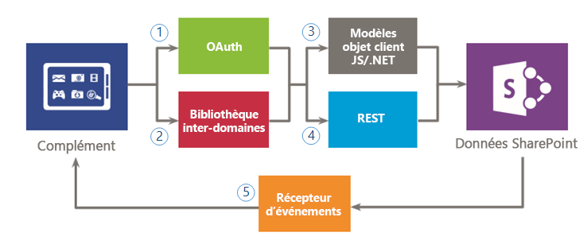
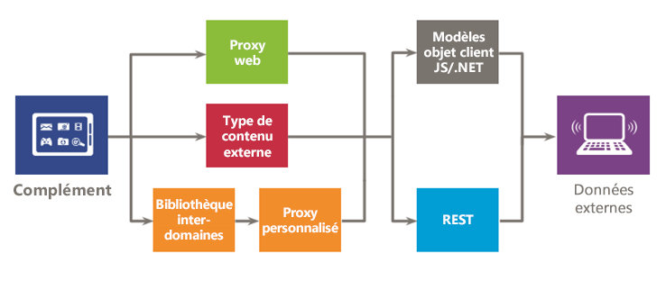

# Accès aux données sécurisé et modèles d'objet client pour les compléments SharePoint
Découvrez les options d'accès aux données disponibles lorsque vous créez des Compléments SharePoint, y compris les options de connectivité pour accéder aux données sur SharePoint et sur les systèmes externes, ainsi que les API qui sont disponibles lorsque vous voulez accéder aux données à partir de votre complément.
Lors de l'évaluation de vos options d'accès aux données pour les Compléments SharePoint, vous devez évaluer votre environnement de complément et prendre en compte plusieurs facteurs, tels que la communication entre le client et le serveur, ainsi que le niveau d'autorisation nécessaire pour permettre à votre complément d'effectuer les tâches requises. Vous devez également évaluer les API qui sont disponibles dans le modèle de complément SharePoint.
  
    
    

## Vue d'ensemble de haut niveau des données dans les Compléments SharePoint

Il est difficile d'imaginer un Complément SharePoint (ou n'importe quel complément, d'ailleurs) qui n'ait pas besoin d'interroger, de stocker ou de manipuler des données. Dans votre complément, vous êtes fréquemment amené à récupérer et manipuler des données SharePoint, telles que des éléments dans des bibliothèques et des listes de documents, des métadonnées ou des profils d'utilisateur. De la même façon, vous êtes peut-être confronté à des scénarios où vous devez accéder à des données externes dans votre complément. Le modèle de complément SharePoint offre plusieurs options de connectivité et un ensemble complet d'API permettant d'accéder aux données et services résidant sur SharePoint et sur des systèmes externes.
  
    
    
Lorsque vous concevez votre complément et planifiez l'accès aux données, vous devez prendre deux décisions clés :
  
    
    

1. Quelle option de connectivité dois-je utiliser ?
    
  
2. Quelles API dois-je utiliser pour accéder aux données dont j'ai besoin ?
    
  
Les illustrations ci-dessous résument les différentes options fournies par le modèle de complément SharePoint. Dans les sections qui suivent, vous examinerez chaque option en détail et découvrirez comment les utiliser.
  
    
    
La figure 1 illustre les options à votre disposition pour accéder aux données SharePoint dans votre complément. Lorsque vous avez affaire à ces scénarios, vous devez décider si vous voulez vous authentifier et communiquer avec SharePoint au moyen (1) d'OAuth, ou (2) de la bibliothèque inter-domaines. Ensuite, pour l'API d'accès aux données, vous devez effectuer un choix entre (3) le modèle objet client (modèles objets clients JavaScript/.NET) ou (4)REST (Representational State Transfer).
  
    
    
Gardez à l'esprit que vous pouvez également accéder à certaines données en utilisant (5) des  *récepteurs d'événements distants*  , cependant, le scénario principal pour les récepteurs d'événements distants est l'exécution de code distante.
  
    
    

**Figure 1. Options d'utilisation des données SharePoint dans votre complément**

  
    
    

  
    
    

  
    
    
La figure 2 illustre les options à votre disposition pour accéder aux données externes sur votre complément. Lorsque vous avez affaire à ces scénarios, vous devez décider si vous voulez utiliser (1) le  *proxy web*  , (2) les *types de contenu externe*  ou (3) la *bibliothèque inter-domaines avec une page proxy personnalisée*  pour vous authentifier et communiquer avec des services ou des systèmes externes. Vous pouvez également utiliser (4) lemodèle objet client (modèles objets clients JavaScript/.NET) ou (5)REST (Representational State Transfer).
  
    
    

**Figure 2. Options d'utilisation des données externes dans votre complément**

  
    
    

  
    
    

  
    
    

  
    
    

  
    
    

## Options de connectivité de données pour Compléments SharePoint

Vous devez prendre en considération plusieurs aspects lorsque vous utilisez des données dans votre complément. Par exemple, quel itinéraire est utilisé par les données ? Les données proviennent-elles du serveur ou passent-elles par ce dernier ? Passent-elles par le client ? Est-il acceptable de s'authentifier en tant qu'utilisateur connecté ? Le complément a-t-il besoin de privilèges élevés ? Les sections suivantes tentent de répondre à ces questions et à d'autres questions que vous pourriez avoir.
  
    
    

### Connectivité des données SharePoint

Les options de connectivité suivantes sont disponibles lors de l'accès à SharePoint (voir figure 1) :
  
    
    

- **OAuth :** protocole ouvert permettant une autorisation sécurisée de façon simple et standardisée. OAuth permet aux utilisateurs d'approuver une application agissant en leur nom sans partager leurs nom d'utilisateur et mot de passe. Vous pouvez utiliser OAuth avec du code côté serveur. C'est une bonne solution si vous devez exécuter un processus non interactif, ou si vous devez élever d'autres privilèges que ceux de l'utilisateur connecté. Pour plus d'informations sur OAuth, voir [Autorisation et authentification des compléments dans SharePoint](authorization-and-authentication-of-sharepoint-add-ins.md).
    
  
- **Bibliothèque inter-domaines :** alternative côté client sous la forme d'un fichier JavaScript ( **SP.RequestExecutor.js** ) hébergé par le site web SharePoint que vous pouvez référencer dans votre complément distant. La bibliothèque inter-domaines vous permet d'interagir avec plusieurs domaines sur votre page de complément distant par le biais d'un proxy. C'est une bonne solution si vous préférez que votre code de complément s'exécute sur le client plutôt que sur le serveur, ou en cas de barrières de connectivité, telles que des pare-feu, entre SharePoint et votre infrastructure distante. Pour plus d'informations, voir [Accéder à des données SharePoint 2013 à partir de compléments à l'aide de la bibliothèque inter-domaines](access-sharepoint-2013-data-from-add-ins-using-the-cross-domain-library.md).
    
  
- **Récepteurs d'événements distants :** vous pouvez utiliser des récepteurs d'événements distants pour gérer des événements qui se produisent pour un élément du complément (par exemple, une liste, un élément de liste ou un site web). Ces événements ressemblent à ceux d'une solution traditionnelle SharePoint, à ceci près qu'ils peuvent fonctionner avec les composants distants du Complément SharePoint. Vous remarquerez que certaines propriétés de l'élément sont disponibles pour le récepteur d'événements distant. Pour plus d'informations, voir [Créer un récepteur d'événements distant dans des compléments pour SharePoint](create-a-remote-event-receiver-in-sharepoint-add-ins.md). De même, vous pouvez utiliser les récepteurs d'événements de complément pour personnaliser l'installation, la mise à jour et la désinstallation de votre complément. Pour plus d'informations, voir  [Créer un récepteur d'événements de complément dans SharePoint](create-an-add-in-event-receiver-in-sharepoint-add-ins.md).
    
  

### Options de connectivité des données SharePoint : laquelle choisir ?

Le tableau suivant indique les exigences et scénarios fréquents que vous êtes susceptibles de rencontrer lorsque vous créez des compléments. Un **x** dans la colonne indique l'option que vous pouvez utiliser dans chaque cas.
  
    
    

**Tableau 1. SharePoint Options de connectivité de données**

|**Exigence/scénario**|**OAuth**|**Bibliothèque entre domaines**|
|:-----|:-----|:-----|
|J'utilise des technologies côté client (HTML + JavaScript).    ||x    |
|Je veux utiliser des interfaces REST.    |x    |x    |
|Il y a un pare-feu entre SharePoint et mon complément distant, et je dois émettre les appels par le biais du navigateur.    ||x    |
|Mon complément doit accéder aux ressources en tant qu'utilisateur connecté.    |x    |x    |
|Mon complément doit élever les privilèges à d'autres que ceux de l'utilisateur actuellement connecté.    |x    ||
|Mon complément doit agir au nom d'un autre utilisateur que celui qui est connecté.    |x    ||
|Mon complément doit effectuer des opérations uniquement lorsque l'utilisateur est connecté.    |x    |x    |
|Mon complément doit effectuer des opérations même lorsque l'utilisateur n'est pas connecté.    |x    ||
|Mon complément doit exécuter du code distant en réponse à un événement dans SharePoint.    |||
   
Puisque les récepteurs d'événements distants sont créés par-dessus OAuth, l'utilisation d'une comparaison dans ce tableau n'est pas la meilleure façon de décider si vous devez les utiliser ou non. Utilisez des récepteurs d'événements distants lorsque vous devez exécuter du code distant en plus de l'échange de données.
  
    
    

### Connectivité des données externes

Les options de connectivité suivantes sont disponibles lors de l'accès aux données externes (voir figure 2) :
  
    
    

- **Proxy web :** en tant que développeur, vous pouvez utiliser le proxy web exposé dans les API clientes telles que le JSOM. Lorsque vous utilisez le proxy web, vous envoyez la requête initiale à SharePoint. À son tour, SharePoint demande les données au point de terminaison spécifié et renvoie la réponse à votre page. Utilisez le proxy web lorsque vous voulez que la communication se produise au niveau du serveur. Le proxy web est conçu pour accéder à des données non structurées qui ne requièrent pas d'authentification. Pour plus d'informations, voir [Interroger un service distant à l'aide du proxy web](query-a-remote-service-using-the-web-proxy-in-sharepoint-2013.md).
    
  
- **Types de contenu externe :** vous pouvez créer des compléments qui accèdent aux données externes à partir de SAP, Netflix et des types de données propriétaires ou autres sans passer par l'administrateur client. L'accès aux applications externes est géré via Business Connectivity Services (BCS), qui fournit une interface cohérente et uniforme pouvant être utilisée par d'autres applications SharePoint. Les ECT d'étendue d'application constituent une bonne option lorsque vous utilisez un modèle BCS et que l'accès aux données requiert une authentification. Pour plus d'informations, voir [Ajoutez dans-étendue de types de contenu externe dans SharePoint 2013](http://msdn.microsoft.com/library/a34cbbba-dc38-4d3d-b796-d54b5848bdfb%28Office.15%29.aspx).
    
  
- **Page proxy personnalisée pour la bibliothèque inter-domaines :** vous pouvez utiliser la bibliothèque inter-domaines pour accéder aux données de votre complément distant si vous fournissez une page proxy personnalisée qui est hébergée dans l'infrastructure de complément distant. En tant que développeur, vous êtes responsable de la mise en œuvre de la page proxy personnalisée et vous devez fournir la logique personnalisée, telle que le mécanisme d'authentification, sur le complément distant. Utilisez la bibliothèque inter-domaines avec une page proxy personnalisée si vous voulez que la communication se produise au niveau du client. Pour plus d'informations, voir [Créer une page de proxy personnalisée pour la bibliothèque inter-domaines dans SharePoint 2013](create-a-custom-proxy-page-for-the-cross-domain-library-in-sharepoint-2013.md).
    
  

### Options de connectivité des données externes : laquelle choisir ?

Le tableau suivant indique les exigences et scénarios fréquents que vous êtes susceptibles de rencontrer lorsque vous créez des compléments. Un **x** dans la colonne indique l'option que vous pouvez utiliser dans chaque cas.
  
    
    

**Tableau 2. Options de connectivité des données externes**

|**Exigence/scénario**|**Proxy web**|**Types de contenu externe**|**Bibliothèque inter-domaines avec page de proxy personnalisée**|
|:-----|:-----|:-----|:-----|
|J'utilise des technologies côté client (HTML + JavaScript).    |x    |x    |x    |
|Je ne peux pas ajouter des pages ou des composants au complément ou au service distant.    |x    |x    ||
|Je veux utiliser des interfaces REST.    |x    |x    |x    |
|Je veux utiliser le modèle CSOM JavaScript.    |x    |x    |x    |
|Je veux utiliser le modèle CSOM .NET.    |x    |x    ||
|Il n'y a pas de connectivité directe entre l'infrastructure SharePoint et mon complément. Je dois émettre les appels par le biais du navigateur.    ||x    |x    |
|Mon complément doit accéder aux ressources en tant qu'utilisateur connecté.    |x    |x    |x    |
   

## API d'accès aux données disponibles pour les Compléments SharePoint

Les choix d'API suivants sont disponibles lorsque vous voulez accéder à des données SharePoint à partir de votre complément :
  
    
    

- **REST (Representational State Transfer) :** pour les scénarios dans lesquels vous devez accéder aux entités SharePoint à partir de technologies clientes n'utilisant pas JavaScript et non intégrées à la plateforme .NET Framework, SharePoint fournit une mise en œuvre d'un service web REST qui utilise le [protocole OData (Open Data)](http://www.odata.org/) pour effectuer des opérations CRUDQ (Create, Read, Update, Delete, and Query) dans des données SharePoint. En outre, pratiquement chaque API dans les modèles objets clients présente un point de terminaison REST correspondant. Cela permet à votre code d'interagir directement avec SharePoint en utilisant une technologie prenant en charge les fonctionnalités REST standard. Pour utiliser les fonctionnalités REST intégrées dans SharePoint, votre code crée une requête HTTP RESTful vers un point de terminaison correspondant à l'objet SharePoint souhaité. Le service REST traite la requête HTTP et envoie une réponse au format Atom ou JavaScript Object Notation (JSON). Pour plus d'informations sur REST dans SharePoint, voir [Utiliser les opérations de requête OData dans les demandes REST SharePoint](use-odata-query-operations-in-sharepoint-rest-requests.md).
    
  
- **Modèle objet client .NET Framework (modèle objet client .NET) :** pratiquement chaque classe dans le modèle objet côté client du site principal et de la liste présente une classe correspondante dans le modèle objet client .NET Framework. En outre, le modèle objet client .NET Framework expose également un jeu complet d'API pour étendre d'autres fonctionnalités, y compris certaines fonctionnalités de niveau SharePoint, telles que la gestion de contenu d'entreprise (ECM), la taxonomie, les profils utilisateurs, la recherche avancée, les analyses, BCS et d'autres encore. Pour plus d'informations sur les modèles objets côté client, voir [Choisir l'ensemble d'API approprié dans SharePoint 2013](http://msdn.microsoft.com/library/f36645da-77c5-47f1-a2ca-13d4b62b320d%28Office.15%29.aspx).
    
  
- Modèle objet client **JavaScript (JSOM) :** SharePoint fournit un modèle objet JavaScript pouvant être utilisé dans des scripts inline ou des fichiers .js séparés. Il inclut les mêmes fonctionnalités que les modèles objets clients .NET Framework. Le JSOM est une façon utile d'inclure du code SharePoint personnalisé dans un complément, particulièrement dans un Application hébergée par SharePoint, où le code côté serveur personnalisé n'est pas autorisé. Il permet également aux développeurs web d'utiliser leurs compétences existantes en JavaScript pour créer des Compléments SharePoint avec une courbe d'apprentissage minimale. Pour plus d'informations sur les modèles objets côté client, voir [Choisir l'ensemble d'API approprié dans SharePoint 2013](http://msdn.microsoft.com/library/f36645da-77c5-47f1-a2ca-13d4b62b320d%28Office.15%29.aspx).
    
  
Il pourrait y avoir des API supplémentaires susceptibles d'être utilisées dans votre Complément SharePoint lors de l'accès aux données externes. Cela dépend des interfaces que les services et systèmes externes proposent. Il est également recommandé de tenir compte de ces interfaces dans votre conception.
  
    
    

## Ressources supplémentaires

-  [Autorisation et authentification des compléments dans SharePoint](authorization-and-authentication-of-sharepoint-add-ins.md)
    
  
-  [Accéder à des données SharePoint 2013 à partir de compléments à l'aide de la bibliothèque inter-domaines](access-sharepoint-2013-data-from-add-ins-using-the-cross-domain-library.md)
    
  
-  [Créer une page de proxy personnalisée pour la bibliothèque inter-domaines dans SharePoint 2013](create-a-custom-proxy-page-for-the-cross-domain-library-in-sharepoint-2013.md)
    
  
-  [Interroger un service distant à l'aide du proxy web](query-a-remote-service-using-the-web-proxy-in-sharepoint-2013.md)
    
  
-  [Créer un récepteur d'événements distant dans des compléments pour SharePoint](create-a-remote-event-receiver-in-sharepoint-add-ins.md)
    
  
-  [Choisir l'ensemble d'API approprié dans SharePoint 2013](http://msdn.microsoft.com/library/f36645da-77c5-47f1-a2ca-13d4b62b320d%28Office.15%29.aspx)
    
  
-  [Utiliser les opérations de requête OData dans les demandes REST SharePoint](use-odata-query-operations-in-sharepoint-rest-requests.md)
    
  

