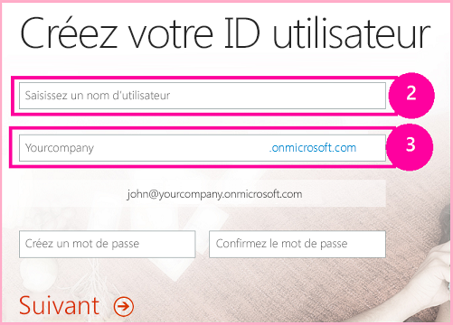
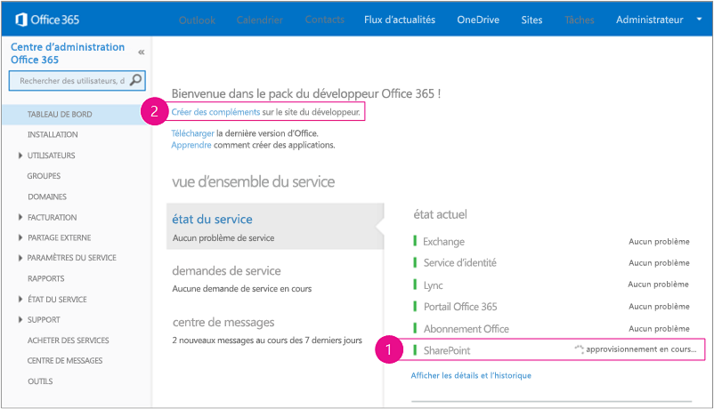
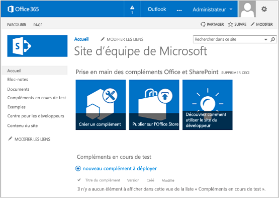

# Configurer un environnement de développement pour les compléments pour SharePoint dans Office 365
Configurez un environnement de développement pour les Compléments SharePoint sur un Site du développeur Office 365.
Vous pouvez consulter la rubrique  [Outils et environnement de développement de compléments pour SharePoint](tools-and-environments-for-developing-sharepoint-add-ins.md) pour connaître les possibilités avant d'effectuer les procédures décrites dans cet article. Voir [Compléments](sharepoint-add-ins.md) si vous n'êtes pas sûr du type d'Compléments SharePoint que vous voulez créer.
  
    
    

## Installer Visual Studio et des outils sur votre ordinateur

- Si vous ne disposez pas déjà de **Visual Studio** 2013 ou version ultérieure, installez-le en suivant les instructions figurant à la rubrique [Install Visual Studio](http://msdn.microsoft.com/library/da049020-cfda-40d7-8ff4-7492772b620f.aspx). Nous recommandons d'utiliser la  [dernière version disponible dans le Centre de téléchargement Microsoft](https://www.visualstudio.com/downloads/download-visual-studio-vs).
    
  
- Visual Studio inclut les **Outils de développement Microsoft Office pour Visual Studio**, mais parfois une version des outils est publiée entre les mises à jour de Visual Studio. Pour être sûr que vous avez la dernière version des outils, exécutez le [programme d'installation pour Office Developer Tools pour Visual Studio 2013](http://aka.ms/OfficeDevToolsForVS2013) ou le [programme d'installation pour Office Developer Tools pour Visual Studio 2015](http://aka.ms/OfficeDevToolsForVS2015). 
    
  

### Journalisation détaillée dans Visual Studio

Si vous souhaitez activer la journalisation détaillée, procédez comme suit :
  
    
    

1. Ouvrez le Registre et accédez à **HKEY_CURRENT_USER\\Software\\Microsoft\\VisualStudio\\ _nn.n_\\SharePointTools**, où _nn.n_ est la version de Visual Studio, par exemple 12.0 ou 14.0.
    
  
2. Ajoutez une clé DWORD appelée **EnableDiagnostics**.
    
  
3. Attribuez la valeur **1** à la clé.
    
  
Le chemin d'accès du Registre sera modifié dans les futures versions de Visual Studio.
  
    
    

## Inscription à un Site du développeur Office 365

> [!REMARQUE]
>  Vous avez peut-être déjà accès à un Site du développeur Office 365 :> **Êtes-vous abonné à MSDN ?** Les abonnés Visual Studio Enterprise avec MSDN reçoivent également un abonnement à Office 365 Développeur. [Obtenez cet avantage aujourd'hui.](https://msdn.microsoft.com/subscriptions/manage/default.aspx)> **Disposez-vous de l'un des plans d'abonnement Office 365 suivants ?**> **Si oui, un administrateur de l'abonnement à Office 365 peut créer un Site du développeur** à l'aide du [centre d'administration Office 365](https://portal.microsoftonline.com/admin/default.aspx). Pour plus d'informations, voir  [Créer un Site du développeur dans un abonnement Office 365 existant](create-a-developer-site-on-an-existing-office-365-subscription.md). 
  
    
    

 Trois options pour obtenir un plan Office 365 :
  
    
    

-  Ouvrez un compte de développeur Office 365 gratuit d'un an, via le programme de développement d'Office 365. [Accédez à plus d'information](http://dev.office.com/devprogram) ou remplissez directement le [formulaire d'abonnement](https://profile.microsoft.com/RegSysProfileCenter/wizardnp.aspx?wizid=14b845d0-938c-45af-b061-f798fbb4d170). Une fois l'abonnement réalisé, vous recevrez un e-mail contenant un lien qui vous permettra d'activer votre compte de développeur. Suivez les instructions ci-dessous.
    
  
- Commencer avec un  [essai gratuit de 30 jours](https://portal.microsoftonline.com/Signup/MainSignUp.aspx?OfferId=6881A1CB-F4EB-4db3-9F18-388898DAF510&amp;DL=DEVELOPERPACK) avec une licence utilisateur.
    
  
- Acheter un  [abonnement Office 365 Développeur](https://portal.microsoftonline.com/Signup/MainSignUp.aspx?OfferId=C69E7747-2566-4897-8CBA-B998ED3BAB88&amp;DL=DEVELOPERPACK). 
    
  

> [!CONSEIL]
>  Ouvrez ces liens dans une autre fenêtre ou un nouvel onglet pour que vous puissiez toujours voir les instructions.
  
    
    

**Figure 1. Nom de domaine d'un Site du développeur Office 365**

  
    
    

  
    
    

  
    
    

  
    
    

  
    
    

1. La première page (non illustrée) du formulaire d'inscription est explicite. Indiquez simplement les informations demandées vous concernant et choisissez **Suivant**.
    
  
2. Sur la deuxième page (Figure 1), spécifiez l'identificateur d'utilisateur de l'administrateur de l'abonnement.
    
  
3. Créez un sous-domaine de **.onmicrosoft.com**. 
    
    Après l'inscription, vous devez utiliser les informations d'identification obtenues (au format  _UserID_@ _votre_domaine_.onmicrosoft.com) pour vous connecter à votre portail Office 365, où vous pourrez administrer votre compte. Votre Site du développeur SharePoint Online est configuré sur votre nouveau domaine : **http:// _votre_domaine_.sharepoint.com**.
    
  
4. Choisissez **Suivant** et renseignez la page finale du formulaire. Si vous choisissez d'indiquer un numéro de téléphone pour obtenir un code de confirmation, vous pouvez indiquer un numéro de téléphone mobile ou fixe, mais *pas*  un numéro VoIP.
    
  

    
> [!REMARQUE]
> Si vous êtes connecté à un autre compte Microsoft lorsque vous tentez de vous connecter à un compte de développeur, il est possible qu'un message semblable à celui-ci s'affiche : « Désolé, l'identifiant utilisateur que vous avez saisi ne fonctionne pas. Il semble ne pas être valide. Veillez à saisir l'identifiant utilisateur que votre organisation vous a affecté. Votre identifiant utilisateur ressemble généralement à  *nom@exemple.com*  ou *nom@exemple.onmicrosoft.com*  . »> Si ce message s'affiche, déconnectez-vous du compte Microsoft que vous utilisiez et réessayez. Si vous obtenez toujours ce message, effacez le cache de votre navigateur ou passez en mode **Navigation InPrivate**, puis remplissez le formulaire. 
  
    
    

Une fois que vous avez terminé le processus d'inscription, votre navigateur ouvre la page d'installation d'Office 365. Choisissez l'icône Administrateur pour ouvrir la page Centre d'administration.
  
    
    

**Figure 2. Page Centre d'administration Office 365**

  
    
    

  
    
    

  
    
    

  
    
    

1. Vous devrez attendre la fin de la configuration de votre Site du développeur. Une fois la configuration terminée, actualisez la page Centre d'administration dans votre navigateur.
    
  
2. Ensuite, cliquez sur le lien **Créer des compléments** dans le coin supérieur gauche de la page pour ouvrir le Site du développeur. Le site ressemble à celui présenté dans la Figure 3. Sur la page figure la liste **Compléments en cours de test**. Cela confirme que le site web a été créé avec le modèle Site du développeur de SharePoint. Si, à la place, un site d'équipe s'ouvre, patientez quelques minutes et lancez de nouveau votre site.
    
  
3. Notez l'URL du site. Elle est utilisée lorsque vous créez des projets d'Compléments SharePoint dans Visual Studio.
    
  

**Figure 3. Page d'accueil de votre Site du développeur avec la liste Compléments en cours de test**

  
    
    

  
    
    

  
    
    

  
    
    

  
    
    

## Ressources supplémentaires

-  [Compléments](sharepoint-add-ins.md)
    
  
-  [Commencer à créer des compléments hébergés par un fournisseur pour SharePoint](get-started-creating-provider-hosted-sharepoint-add-ins.md)
    
  
-  [Commencer à créer des compléments SharePoint hébergés par SharePoint](get-started-creating-sharepoint-hosted-sharepoint-add-ins.md)
    
  

  
    
    

