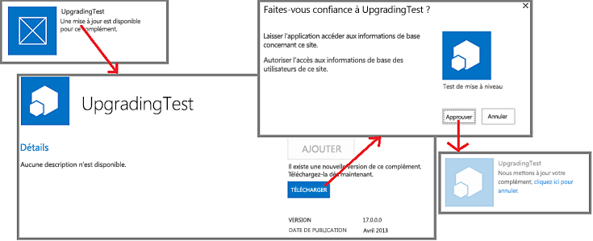

# Processus de mise à jour des compléments pour SharePoint
Découvrez la procédure de mise à jour des compléments SharePoint.
Vous devez mettre à jour un complément SharePoint si vous ajoutez des fonctionnalités, résolvez un bogue ou effectuez une mise à jour de sécurité. Une mise à jour d'un complément est déployée dans un package de Complément SharePoint de la même façon que pour le déploiement de la première version du complément. La procédure de mise à jour du complément SharePoint permet de s'assurer que les données du complément sont conservées si la mise à jour échoue pour une raison ou une autre.
  
    
    

> **IMPORTANTE**
> Vous ne pouvez pas modifier le  *type de complément*  à l'aide du système de mise à jour. Par exemple, vous ne pouvez pas profiter d'une mise à jour pour transformer un complément hébergé par SharePoint en complément hébergé par un fournisseur. Pour changer de type, vous devez [migrer d'un ancien complément vers un nouveau complément](#Major). En particulier, puisque  [le programme de prévisualisation pour les compléments auto-hébergés a été fermé](http://blogs.office.com/2014/05/16/update-on-autohosted-apps-preview-program/), vous devez savoir que vous ne pouvez pas mettre à jour un complément auto-hébergé en complément hébergé par un fournisseur. Vous devez convertir le complément tel qu'expliqué dans  [Conversion d'un complément auto-hébergé pour SharePoint en complément hébergé par un fournisseur](convert-an-autohosted-sharepoint-add-in-to-a-provider-hosted-add-in.md). 
  
    
    

## Procédure de mise à jour d'un complément SharePoint

Pour une mise à jour, vous utilisez le même ID de produit dans le manifeste de complément que celui que vous avez utilisé dans la version d'origine. Le numéro de version dans le manifeste de complément doit être supérieur au numéro de version du complément d'origine ou de la mise à jour la plus récente.
  
    
    
Dans les 24 heures suivant le téléchargement de votre mise à jour vers le catalogue de compléments d'une organisation, et dans la semaine suivant son téléchargement vers l'Office Store, l'indication de disponibilité d'une mise à jour apparaît en regard de l'entrée du complément sur la page **Contenu du site** de chaque site web sur lequel il est installé. Vous pouvez cliquer sur un lien pour mettre à jour le complément comme le montre la figure 1. Les mises à jour disponibles sont également présentées dans l'interface utilisateur de gestion des locataires.
  
    
    

**Figure 1. Processus de mise à niveau d'un complément SharePoint**

  
    
    

  
    
    

  
    
    

    
> **CONSEIL**
>  Lorsque vous développez une mise à jour, vous ne voulez pas attendre 24 heures à chaque fois que vous téléchargez une nouvelle version vers votre catalogue de compléments SharePoint de test. Pour plus d'informations sur la façon de mettre à jour un complément immédiatement, voir [Mettre à jour un complément sans attendre 24 heures](update-sharepoint-add-ins.md#ImmediateUpdateNotice). >  Par défaut, SharePoint recherche toutes les 24 heures des mises à jour des compléments installés. Un administrateur de batterie de serveurs peut définir la fréquence sur une autre valeur à l'aide de la commande SharePoint Management Shell suivante, oùn est le nombre d'heures entre les recherches.>  `Set-SPInternalAppStateUpdateInterval -AppStateSyncHours n`>  Si la valeur est définie sur 0, la vérification est effectuée à chaque exécution du travail du minuteur intégré **Mise à jour interne de l'état du complément**, soit toutes les heures par défaut. Les administrateurs de batterie de serveurs peuvent utiliser l'administration centrale pour modifier la fréquence du travail du minuteur ou l'exécuter immédiatement. 
  
    
    

SharePoint 2013 effectue les actions suivantes lorsqu'un utilisateur installe une mise à jour dans un Complément SharePoint. Ces événements ne se produisent pas nécessairement dans cet ordre précis et certains d'entre eux peuvent se produire en parallèle. En outre, si la mise à jour échoue, une restauration complète est effectuée.
  
    
    

- SharePoint 2013 invite l'utilisateur à approuver les autorisations demandées par le complément.
    
  
- SharePoint 2013 rend le complément temporairement inaccessible pour les utilisateurs.
    
  
- Si le complément contient un package de solution SharePoint (.wsp) et que le contenu du package de solution a changé d'une façon ou d'une autre, SharePoint procède comme suit :
    
  - il crée une sauvegarde du site web de complément (toutefois, dans SharePoint Online et dans SharePoint 2016 sur site ou versions ultérieures, les données réelles figurant dans des listes SharePoint sont sauvegardées uniquement si la mise à jour apporte une modification au schéma de liste) ;
    
  
  - il teste la mise à jour de la sauvegarde ;
    
  
  - si le test réussit, il met à jour le site web de complément d'origine. Remarquez que le nouveau fichier .wsp dans le package de complément est utilisé pour mettre à jour les fonctionnalités et autres éléments du site web de complément (les composants de mise à jour du schéma Feature ont été étendus dans SharePoint 2013) ;
    
  
- SharePoint 2013 exécute le service web **UpgradedEventEndpoint**, si un tel service est enregistré dans le manifeste du complément.
    
    > **REMARQUE**
      > Si le complément est hébergé par un fournisseur, vous fournissez la logique de mise à jour pour tous les composants hors SharePoint du complément. Vous pouvez mettre à jour la plupart de ces composants séparément par rapport à la mise à jour du Complément SharePoint lui-même, de la même façon que vous avez installé ces composants séparément par rapport à l'installation du complément. Certaines modifications ne doivent néanmoins être effectuées que lorsque l'utilisateur met à jour le Complément SharePoint. Cette logique peut être intégrée à un service web **UpgradedEventEndpoint** ou dans une logique de « première exécution après mise à jour » du complément lui-même.
- SharePoint 2013 rend le complément et ses composants disponibles à nouveau.
    
  

    
> **REMARQUE**
> Si le schéma d'une liste dans le site web de complément est modifié, la liste est sauvegardée avec le reste du site web de complément. Cette opération peut prendre un certain temps si la liste contient un grand volume de données. Si le processus de mise à jour ne peut pas être effectué en 1 heure, il s'arrête et la mise à jour est annulée. 
  
    
    

## Migration d'un ancien complément vers un nouveau complément

Dans certains scénarios, vous souhaiterez peut-être créer un complément entièrement nouveau pour remplacer un ancien complément, au lieu de mettre à jour le complément d'origine. Le nouveau complément peut avoir le même nom convivial que l'ancien, mais un nouvel ID de produit doit lui être attribué dans le manifeste de complément. En outre, il apparaîtra dans l'Office Store public et sur la page **Ajouter un complément** des sites web SharePoint en tant qu'élément distinct de la version d'origine.
  
    
    

> **REMARQUE**
> Les éléments du catalogue de compléments d'une organisation se distinguent par le  *nom de fichier*  du package du complément et non par l'ID de produit ou le nom du complément. Si le nouveau complément possède le même nom de fichier de package que l'ancien, il remplacera l'ancien dans le catalogue de compléments, et l'ancien complément n'apparaîtra plus sur la page **Ajouter un complément**. Si vous activez le contrôle de version sur le package du complément lorsque vous le téléchargez vers le catalogue, l'ancienne version du fichier (qui correspond à l'ancien complément) est toujours disponible dans l'historique de l'élément. Vous pouvez télécharger l'ancien package du complément ou le restaurer, mais il est impossible d'avoir l'ancien complément et le nouveau en tant qu'éléments distincts dans le catalogue ou sur la page **Ajouter un complément**, à moins qu'ils n'aient des noms de fichier différents. 
  
    
    

Dans certains cas, il vous faudra peut-être transférer les données. Par exemple, le nouveau complément utilise peut-être une Base de données SQL Microsoft Azure présentant un autre schéma que celui de l'ancien complément. Le nouveau complément peut également utiliser un mécanisme de stockage de données différent ; par exemple, une base de données externe au lieu de listes SharePoint. Vous devez fournir le code pour le transfert des données.
  
    
    
Si vos anciennes données se trouvent à un emplacement accessible pour un gestionnaire d'événements distant, vous pouvez implémenter la logique de transfert dans un service web **InstalledEventEndpoint** du nouveau complément. Si le nouveau complément a accès aux anciennes données, vous pouvez également insérer la logique de transfert dans du code s'exécutant lorsqu'un utilisateur démarre le nouveau complément pour la première fois. Si les anciennes données sont inaccessibles à la fois pour les gestionnaires distants ou le nouveau complément, vous pouvez créer une mise à jour de l'ancien complément qui ajoute une fonctionnalité d'exportation des données et une interface utilisateur pour celle-ci. Les utilisateurs mettront d'abord à jour l'ancien complément, puis l'utiliseront pour exporter les données vers un emplacement accessible pour le nouveau complément. Vous incluez les fonctionnalités et l'interface utilisateur permettant d'importer les données dans le nouveau complément.
  
    
    
En principe, vous pouvez réutiliser dans le nouveau complément une source de données externe, un composant de calcul ou un autre composant externe utilisé dans l'ancien complément. Toutefois, tenez compte du fait que lors de la désinstallation d'un Complément SharePoint, l'infrastructure SharePoint 2013 désinstallera tous les composants qu'il a installés. Par conséquent, il est généralement recommandé qu'un Complément SharePoint ne dépende que des composants qu'il a installés ou de composants externes qui n'ont pas été installés par l'infrastructure SharePoint 2013.
  
    
    

> **REMARQUE**
> Si vous implémentez un service web **InstalledEventEndpoint** ou **UpgradedEventEndpoint** qui installe des composants, nous vous recommandons d'implémenter également un service web **UninstallingEventEndpoint** permettant de désinstaller ces mêmes composants. Vous vous conformerez ainsi aux principes de conception selon lesquels les compléments doivent être autonomes et désinstallés correctement. Cependant, les données utiles pour les utilisateurs une fois le complément désinstallé ne doivent pas être supprimées. Les sites web créés par un complément autre que le site web de complément sont généralement considérés comme des données.
  
    
    

Si l'ancien complément et le nouveau contiennent chacun un site web de complément, considérez qu'un nouveau site web de complément est créé lors de l'installation de votre nouveau complément. Pour cette raison, n'utilisez pas le code XML lié à la mise à jour dans le schéma Feature de SharePoint 2013. Un tel code ne fonctionne pas, parce que vous ne mettez pas à jour les composants SharePoint existants ; vous remplacez un ancien complément par un nouveau.
  
    
    

## Ressources supplémentaires

-  [Mise à jour des compléments pour SharePoint](update-sharepoint-add-ins.md)
    
  
-  [Mettre à jour des composants de compléments web dans SharePoint 2013](update-add-in-web-components-in-sharepoint-2013.md)
    
  
-  [Mettre à jour des composants web hôte dans SharePoint 2013](update-host-web-components-in-sharepoint-2013.md)
    
  
-  [Créer un gestionnaire pour l'événement de mise à jour dans des compléments pour SharePoint](create-a-handler-for-the-update-event-in-sharepoint-add-ins.md)
    
  
-  [Mettre à jour des composants distants dans les compléments pour SharePoint](update-remote-components-in-sharepoint-add-ins.md)
    
  
-  [Publier des compléments pour SharePoint](publish-sharepoint-add-ins.md)
    
  
-  [Aspects importants du contexte de développement et de l'architecture des compléments pour SharePoint](important-aspects-of-the-sharepoint-add-in-architecture-and-development-landscap.md)
    
  
-  [Déploiement et installation de compléments pour SharePoint : méthodes et options](deploying-and-installing-sharepoint-add-ins-methods-and-options.md)
    
  

