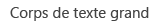
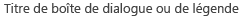
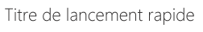
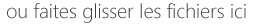
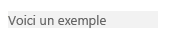

# Conseils pour la conception de l'expérience utilisateur des compléments pour SharePoint
Découvrez les instructions de conception de l'expérience utilisateur pour les compléments de SharePoint 2013, notamment le choix du chrome à l'aide de CSS, la gestion des licences utilisateur ainsi que d'autres tâches de conception.
Les compléments sont un nouveau concept dans SharePoint 2013. Ils permettent aux utilisateurs d'ajouter de nouvelles fonctionnalités à leurs sites, tout en garantissant la fiabilité du site SharePoint proprement dit. Réussir un complément ne consiste pas uniquement à développer des fonctionnalités performantes, bien qu'il s'agisse évidemment d'un point important. Il faut également le doter d'une apparence cohérente et l'intégrer de manière transparente au site dans lequel il est installé.
  
    
    


## Choix du chrome pour votre complément
<a name="UXGuide_AppChrome"> </a>

Le premier point à déterminer lors du développement d'un complément est le degré de personnalisation de vos pages et l'emplacement de leur hébergement. Une fois ces options définies, le choix de la technologie à utiliser pour faire fonctionner votre chrome sera assez simple :
  
    
    

- **Pages ASPX hébergées par SharePoint :** utilisez le modèle de complément.
    
  
- **Pages HTML hébergées dans SharePoint ou pages de tout type hébergées en dehors de SharePoint :**utilisez le contrôle de chrome.
    
  
- **Pages personnalisées :** utilisez votre propre chrome.
    
  

### Utilisation du modèle de complément pour les pages hébergées par SharePoint
<a name="UXGuide_AppTemplate"> </a>

Le modèle de complément ne peut être utilisé que pour les pages ASPX hébergées par SharePoint. Ce modèle comprend la page maître **app.master** (contenant le chrome approprié pour un complément et conçue pour servir de thème au site hébergeur). Il masque certaines fonctionnalités de SharePoint qui ne fonctionneraient pas ou seraient inappropriées dans un site web de complément. La figure 1 présente une page hébergée par SharePoint et utilisant le modèle de complément.
  
    
    

**Figure 1. Page hébergée par SharePoint et utilisant le modèle de complément**

  
    
    

  
    
    

  
    
    
Le modèle de complément est l'option par défaut dans Visual Studio lorsque vous créez un site web de complément et les pages contenues dans celui-ci.
  
    
    

### Utilisation du contrôle Chrome dans les Compléments SharePoint
<a name="UXGuide_ChromeControl"> </a>

Si vous ne créez pas de pages ASPX hébergées par SharePoint, tout en souhaitant que votre complément s'intègre naturellement dans le site hôte qu'il utilise, le contrôle de chrome est la solution appropriée. La figure 2 illustre le contrôle de chrome.
  
    
    

**Figure 2. Contrôle de chrome dans une page Web**

  
    
    

  
    
    

  
    
    

  
    
    

**Regardez la vidéo : contrôle de chrome dans SharePoint 2013**

  
    
    

  
    
    

  
    
    

  
    
    

  
    
    

  
    
    

### Pour utiliser le contrôle de chrome


1. Ajoutez une référence dans la bibliothèque des contrôles. Pour ce faire, deux méthodes sont possibles :
    
  - Pointez sur la bibliothèque située à la racine du dossier de dispositions, comme illustré dans l'exemple suivant.
    
 ```
  
<script
    type="text/javascript" 
    src="http://{server URL}/_layouts/15/sp.ui.controls.js">
</script>
 ```

  - Copiez cette bibliothèque dans votre propre site Web, et référencez-la à partir de celui-ci.
    
    > **ATTENTION**
      > Si vous optez pour cette méthode, votre complément ne bénéficiera pas des mises à jour du contrôle. 
2. Ajoutez l'élément DOM de l'espace réservé dans lequel le contrôle sera affiché, tel qu'illustré dans cet exemple.
    
 ```
  
<div id='chromeControlContainer'></div>
 ```

3. Instanciez le contrôle.
    
 ```
  function addchromecontrol(){
    var options = {};
    options.siteTitle ="{host site title}";
    options.siteUrl = "{host URL}";
    options.appHelpPageUrl = "{help page URL}";
    options.appIconUrl = "{app icon URL}";
    options.appTitle = "add-in Title";
    nav = new SP.UI.Controls.Navigation("chromeControlContainer", options);
    nav.setVisible(true);
}
 ```

4. (Facultatif) Si vous ne souhaitez pas de zone de titre dans votre page, vous pouvez supprimer cette zone en exécutant le code JavaScript suivant.
    
 ```
  
nav.setBottomHeaderVisible(false);
 ```

Le contrôle de chrome fournit en option deux icônes de complément, l'une sur la barre de navigation supérieure et l'autre sur la zone de titre. La taille de l'icône de complément située sur la barre de navigation supérieure est de 24 x 24 pixels (px), et l'icône située dans la zone de titre a la même taille que les icônes du site SharePoint (64 px max. en hauteur par 180 px max. en longueur). Nous vous conseillons d'utiliser une image PNG testée sur des arrière-plans noirs, blancs, gris, brillants et atténués, car les utilisateurs et les administrateurs peuvent modifier le thème du site. Pour plus d'informations sur l'utilisation du contrôle de chrome, reportez-vous à  [Utiliser le contrôle de chrome client dans les compléments pour SharePoint](use-the-client-chrome-control-in-sharepoint-add-ins.md).
  
    
    

### Création d'une interface utilisateur personnalisée dans les Compléments SharePoint
<a name="UXGuide_CustomUI"> </a>

Si, au lieu de vous aligner sur le thème du site hôte et de vous adapter au site SharePoint dans lequel votre complément est installé, vous souhaitez utiliser votre personnalisation dans votre complément, vous devrez créer votre chrome dans sa totalité. Toutefois, vous devez disposer d'un lien de type « Retour au site » dans le coin supérieur gauche de la page (coin supérieur droit pour les langues s'écrivant de la droite vers la gauche) qui redirige l'utilisateur sur le site dans lequel le complément est installé.
  
    
    

## Utilisation du CSS du site web hôte dans les Compléments SharePoint
<a name="UXGuide_CSS"> </a>

En utilisant des styles identiques à ceux utilisés dans le site web hôte, vous assurez l'homogénéité de vos compléments avec le site SharePoint dont ils sont issus. Les styles réels peuvent varier suivant la conception du site, mais le référencement du fichier CSS du site web hôte permet de garantir la bonne intégration de votre complément quel que soit son emplacement.
  
    
    
Pour obtenir les styles CSS du Web hôte, vous devez référencer le fichier CSS de celui-ci. Vous pouvez effectuer cette opération de plusieurs manières.
  
    
    

### Pour référencer le fichier CSS du Web hôte


1. Si vous utilisez le modèle de complément ou le contrôle de chrome de complément, cette opération est automatisée.
    
  
2. Si vous êtes dans le site web de complément, vous pouvez utiliser les contrôles **CssRegistration** et **CssLink** pour référencer le fichier CSS en ajoutant le code suivant sur votre page maître ou votre page ASPX :
    
 ```HTML
  <SharePoint:CssRegistration runat="server" name="default" />
<SharePoint:CssLink runat="server />

 ```

3. Vous pouvez utiliser un élément de <lien> pour référencer le fichier CSS en créant une URL à partir de l'URL du Web hôte, comme illustré dans cet exemple.
    
 ```HTML
  
<link rel="stylesheet" href="{host web URL}/_layouts/15/defaultcss.ashx" />
 ```


    Si vous utilisez cette approche, vous devez ࠵exécuter JavaScript dans la page afin d'obtenir l'URL du Web hôte à partir de la chaîne de requête. Vous pouvez ensuite insérer l'URL du Web hôte dans l'élément de **link** avant d'écrire cet élément dans le DOM de la page.
    
  
Lorsque vous appliquez un style à votre complément, vous devez d'abord utiliser le HTML sémantique le plus possible. Cela implique d'utiliser **H1**, **H2**, **H3**, etc. pour les différents en-têtes, et d'utiliser les étiquettes d'entrée pour les boutons. Vous devez également essayer d'utiliser les styles SharePoint principaux autant que possible afin que votre complément détecte automatiquement et en toute transparence les changements de thème du site hôte lorsque ceux-ci se produisent. Les tableaux suivants illustrent la manière dont les styles sont utilisés dans le thème par défaut.
  
    
    

**Tableau 1. Styles de corps de texte**


|**Exemple**|**Utilisation**|**Style**|
|:-----|:-----|:-----|
||Corps de texte extra-large  <br/> |.ms-textXLarge  <br/> |
||Corps de texte large  <br/> |.ms-textLarge  <br/> |
||Corps de texte normal  <br/> |Hérité automatiquement  <br/> |
||Corps de texte petit  <br/> |.ms-textSmall  <br/> |
||Texte de métadonnées  <br/> |.ms-metadata  <br/> |
   

**Tableau 2. Styles de titre et d'en-tête**


|**Exemple**|**Utilisation**|**Style**|
|:-----|:-----|:-----|
||Titr࠵e principal sur la page  <br/> |.ms-core-pageTitle  <br/> |
||Titre des boîtes de dialogue, des formulaires, des blogs et des fils de discussion (titre « principal » alternatif pour des types de contenu ou des compléments spécifiques occupant la totalité de la page que vous souhaitez distinguer d'une page wiki classique ou d'une page de composants WebPart).  <br/> |H1  <br/> |
||En-tête secondaire en relation avec H1. Par exemple, « Réseau social d'entreprise »utilise l'accentuation H1 pour le titre d'un commentaire, et l'accentuation H 2 pour la meilleure « réponse » à ce commentaire.  <br/> |H2  <br/> |
||Sous-en-tête sous H2 (en général)  <br/> |H3  <br/> |
||Sous-en-têtes sous H3  <br/> |H4  <br/> |
||Titre du composant WebPart principal sur une page, ou titre des en-têtes de la section principale  <br/> |.ms-webpart-titleText  <br/> |
||Titre des en-têtes situées dans des boîtes de dialogue ou des légendes  <br/> |.ms-dlg-heading  <br/> |
   

**Tableau 3. Styles de navigation**


|**Exemple**|**Utilisation**|**Style**|
|:-----|:-----|:-----|
||En-tête de la barre de navigation gauche  <br/> |.ms-core-listMenu-verticalBox > .ms-core-listMenu-root > li > .ms-core-listMenu-item  <br/> |
||Lien dans la barre de navigation gauche  <br/> |.ms-core-listMenu-verticalBox  <br/> |
||Élément sélectionné dans la barre de navigation gauche  <br/> |.ms-core-listMenu-verticalBox + .ms-accentText  <br/> |
||Élément dans la barre de navigation supérieure  <br/> ||
||Élément sélectionné dans la barre de navigation supérieure  <br/> ||
   

**Tableau 4. Styles de commande**


|**Exemple**|**Utilisation**|**Style**|
|:-----|:-----|:-----|
||Liens d'action principaux que l'utilisateur doit prendre dans une page ou un conteneur spécifiques (style à appliquer pour des commandes situées sous une légende, par exemple). La couleur sera toujours la même pour les commandes visitées et non visitées.  <br/> |.ms-commandLink  <br/> |
||Style également appliqué pour les liens d'action, mais dans le cas d'actions secondaires par rapport au contenu (et ne devant donc pas attirer l'attention sur elles)  <br/> |.ms-secondaryCommandLink  <br/> |
||Liens dans la légende  <br/> |.ms-calloutLink  <br/> |
   

**Tableau 5. Styles de modificateur**


|**Exemple**|**Utilisation**|**Style**|
|:-----|:-----|:-----|
||Classe d'assistance qui fournit la couleur d'accentuation à partir du thème courant du texte  <br/> |.ms-accentText  <br/> |
||Les liens dans le contenu doivent hériter du style et du comportement de l'hyperlien par défaut. Le style de l'hyperlien crée une couleur et un effet de survol pour spécifier qu'il s'agit d'un lien et non d'un simple texte.  <br/> |Hérité de l'utilisation de <a>.  <br/> |
||Messages d'erreur dans les formulaires  <br/> |.ms-error  <br/> |
||Classe d'assistance qui fournit un gris atténué pour des textes à mettre au second plan par rapport à un corps de de texte normal  <br/> |.ms-soften  <br/> |
||Classe d'assistance qui applique au texte la couleur « désactivé », utilisée pour indiquer les états désactivés.  <br/> |.ms-disabled  <br/> |
||Classe d'assistance qui met le texte en majuscules  <br/> |.ms-uppercase  <br/> |
||Classe d'assistance utilisée pour appliquer un style aux formulaires de type texte  <br/> |.ms-helper  <br/> |
||Séparateur en pointillés utilisé pour séparer les sections dans le Lancement rapide et les menus  <br/> |HR  <br/> |
   

**Tableau 6. Styles de l'interface utilisateur pour les composants**


|**Exemple**|**Utilisation**|**Style**|
|:-----|:-----|:-----|
||Texte en ligne principal en haut d'un composant  <br/> |.ms-textXLarge + .ms-soften  <br/> |
||Commandes sur la ligne supérieure d'un composant (il doit y avoir au plus une ou deux commandes par composant)  <br/> |.ms-heroCommandLink  <br/> |
||Texte affiché pour inviter l'utilisateur à interagir avec le composant lorsque celui-ci ne contient pas de données.  <br/> |.ms-attractMode  <br/> |
||Texte affiché lorsqu'il n'y a pas de données disponibles  <br/> |.ms-emptyMode  <br/> |
||Affichage de contrôles (tableau croisé dynamique, p.ex.)  <br/> |.ms-pivot-link  <br/> |
||Éléments de liste qui sont aussi des liens  <br/> |.ms-listLink  <br/> |
   

**Tableau 7. Styles d'arrière-plan et de bordure**


|**Exemple**|**Utilisation**|**Style**|
|:-----|:-----|:-----|
||Style appliqué pour bien mettre en évidence un rectangle sur la page  <br/> |.ms-emphasis  <br/> |
||Bordure d'un élément mis en évidence  <br/> |.ms-emphasisBorder  <br/> |
||Mise en évidence moins voyante d'un élément  <br/> |.ms-subtleEmphasis  <br/> |
||Commandes dans un élément auquel est appliqué le style .ms-subtleEmphasis  <br/> |.ms-subtleEmphasisCommand  <br/> |
||Commande désactivée dans un élément auquel est appliqué le style .ms-subtleEmphasis  <br/> |.ms-subtleEmphasisCommand-disabled  <br/> |
||Éléments de navigation latérale  <br/> |.ms-sideNav  <br/> |
||Style appliqué à l'élément de navigation latérale sélectionné  <br/> |.ms-sideNav-selected  <br/> |
||Mise en évidence d'un élément au moyen d'une bordure  <br/> |.ms-lines  <br/> |
||Mise en évidence d'un élément au moyen d'une bordure peu voyante  <br/> |.ms-subtleLines  <br/> |
||Mise en évidence d'un élément au moyen d'une bordure voyante ou colorée  <br/> |.ms-strongLines  <br/> |
||Mise en évidence d'un élément désactivé au moyen d'une bordure  <br/> |.ms-disabledLines  <br/> |
||Mise en évidence d'un élément désactivé au moyen d'une bordure accentuée.  <br/> |.ms-accentLines  <br/> |
||Cadre de fenêtre contextuelle  <br/> |.ms-popupBorder  <br/> |
||Application d'une superposition sur l'élément d'arrière-plan  <br/> |.ms-bgOverlay  <br/> |
||Affichage en mode désactivé de l'arrière-plan d'un élément  <br/> |.ms-bgDisabled  <br/> |
||Application de la couleur d'arrière-plan de l'en-tête  <br/> |.ms-bgHeader  <br/> |
||Application de la couleur d'arrière-plan du pied de page  <br/> |.ms-bgFooter  <br/> |
||Éléments qui doivent s'afficher en surbrillance lors de leur survol par la souris. Cet exemple montre l'élément lorsque la souris ne pointe pas sur lui.  <br/> |.ms-bgHoverable  <br/> |
||Éléments qui doivent s'afficher en surbrillance lors de leur survol par la souris. Cet exemple montre l'élément lorsque la souris pointe sur lui.  <br/> |.ms-bgHoverable  <br/> |
||Affichage d'un élément sélectionné  <br/> |.ms-bgSelected  <br/> |
||Éléments sur la barre supérieure de la page  <br/> |.ms-topBar  <br/> |
   
Pour plus d'informations, reportez-vous à  [Utilisation d'une feuille de style de site web SharePoint dans les compléments pour SharePoint](use-a-sharepoint-website-s-style-sheet-in-sharepoint-add-ins.md).
  
    
    

## Application d'un style homogène aux éléments communs dans les Compléments SharePoint
<a name="UXGuide_Styling"> </a>

Afin d'aider les utilisateurs à acquérir des compétences transposables entre SharePoint et les compléments, vous devez appliquer un style homogène à plusieurs éléments communs.
  
    
    

### Navigation interne

Si vous souhaitez offrir des fonctionnalités de navigation au sein de votre complément, vous devez utiliser les deux principaux types suivants : la navigation gauche et la navigation supérieure. L'option que vous choisirez dépendra dans une certaine mesure du contenu du reste de votre complément. En général, la navigation gauche s'avérera un bon choix, en particulier si vous basculez entre différentes listes ou si l'affichage de votre complément est de type maître/détail. En revanche, si votre navigation consiste principalement à basculer entre les différentes vues d'une même liste, vous pouvez plutôt opter pour la navigation supérieure.
  
    
    
La navigation gauche comme la navigation supérieure possèdent des représentations de modèle d'objet auxquelles on applique un style adéquat lorsqu'elles sont définies dans SharePoint. En dehors des pages SharePoint, vous devrez travailler un peu plus pour créer le balisage de ces navigations, puis pour ajouter les classes CSS appropriées afin de leur appliquer un style adéquat.
  
    
    

### Barres d'outils

Dans de nombreux cas, vous souhaiterez exposer rapidement un petit nombre de commandes à l'utilisateur. Si vous utilisez déjà le ruban sur votre page, la meilleure option consiste à ajouter ces commandes sur les emplacements logiques dans le ruban existant. Toutefois, si vous ne disposez pas de ruban sur la page, il est probablement inutile d'en ajouter un pour quelques commandes. Dans ce cas, nous vous conseillons d'ajouter une barre d'outils contextuelle à l'élément auquel s'appliquent les commandes. Vous pouvez utiliser au choix un glyphe, un texte auquel est appliqué le style ms-commandLink, ou les deux, pour afficher sur la barre d'outils vos commandes, qui doivent avoir la même couleur d'arrière-plan que le reste de la page.
  
    
    

### Listes

Les listes sont un moyen courant de représentation des données à l'attention des utilisateurs. Si votre complément utilise des pages SharePoint, vous pouvez utiliser le composant WebPart d'affichage de liste pour représenter les données et obtenir le style ainsi que l'interaction qui l'accompagne. Toutefois, si vos pages sont situées à un autre emplacement, ou si vous souhaitez mieux contrôler les interactions entre les utilisateurs et votre liste, vous devrez simuler l'application d'un style aux listes dans SharePoint, tout en fournissant votre rendu et vos interactions. Ci-dessous sont exposés certains problèmes liés au style, à garder à l'esprit lorsque vous utilisez des listes dans votre complément :
  
    
    

- **Vues :** Lorsque vous représentez des vues multiples sur une seule liste, vous devez utiliser un tableau croisé dynamique en haut de cette liste, à l'exemple des listes SharePoint standard. Vous ne devez jamais utiliser les tableaux croisés dynamiques pour représenter des données maître/détail.
    
  
- **Filtres :** Lorsque vous fournissez un filtre sur une liste existante ou sur une disposition maître/détail, vous devez utiliser une barre latérale sur le côté gauche de la zone de contenu et d'une largeur d'au moins 300 pixels. Vous devez également copier l'application du style de sélection de SharePoint afin d'indiquer à l'utilisateur les filtres ou les éléments sélectionnés.
    
  
- **Formulaires :**Lorsqu'un utilisateur consulte ou modifie un seul élément, vous devez utiliser les formulaires SharePoint intégrés ou simuler leur style pour offrir une expérience cohérente.
    
  

### Formulaires, boîtes de dialogue et légendes

Trois modèles différents permettent de fournir à l'utilisateur plus d'informations sur un objet ou de lui proposer une interface de saisie : les formulaires plein écran, les boîtes de dialogue et les légendes. Vous choisirez l'un ou l'autre de ces modèles en fonction des objectifs de l'utilisateur et de la quantité d'informations qui seront affichées ou demandées.
  
    
    

- **Formulaires plein écran :** Cette option est la meilleure lorsque vous souhaitez permettre aux utilisateurs de saisir différentes informations, ou que vous voulez leur montrer simultanément un grand nombre d'informations structurées. Les formulaires plein écran constituent également le choix le plus judicieux pour des scénarios qui nécessitent des modèles d'interaction plus complexes tels que les rubans. Dans ce cas, vous ferez pointer l'utilisateur vers la page du formulaire si nécessaire. Vérifiez que leurs modifications peuvent être facilement enregistrées ou annulées à l'aide des boutons ou du ruban. Pour les formulaires très longs, qui peuvent nécessiter un défilement, il est conseillé de placer les options **Enregistrer** et **Annuler** à la fois en haut et en bas du formulaire.
    
  
- **Boîtes de dialogue :** Il s'agit de conteneurs modaux d'interface utilisateur, utilisés habituellement pour l'affichage contextuel d'un plus grand nombre d'informations ou d'actions. Les boîtes de dialogue sont également utilisées pour des formulaires courts ou des entrées utilisateur. En général, l'interface utilisateur hébergée dans une boîte de dialogue doit être simple et adaptée à une petite surface de rendu. Les formulaires plus longs ou les modèles d'interactions plus complexes tels que le ruban, sont mieux représentés par des formulaires pleine page.
    
  
- **Légendes :** Les légendes fournissent des informations et des actions contextuelles pertinentes par rapport à un élément particulier. Les légendes servent en général à montrer l'utilisateur plus d'informations ou d'actions sur un élément dans une interface utilisateur allégée. Si le recours à des barres de défilement ou à l'entrée utilisateur est nécessaire, la légende n'est sans doute pas un choix judicieux.
    
  

### Animation

Bien que les animations puissent créer une expérience dynamique et attrayante, vous devez veiller à ne pas trop les utiliser dans votre interface utilisateur. Une animation bien réalisée sera à peine perceptible par l'utilisateur, mais elle donnera l'impression d'une interface utilisateur plus rapide et plus performante. Lorsque vous utilisez une animation, vous devez vous assurer de respecter les notions de physique et d'inertie, et vous devez proposer une interface utilisateur naturelle et conviviale. Nous déconseillons vivement les animations exagérées telle qu'une élasticité ou des rebonds excessifs, ou bien des objets qui volent à l'écran à la moindre action de l'utilisateur. Les objets doivent en général se déplacer directement vers leur destination, et n'auront souvent besoin que des premiers ou derniers 10 % du changement réel pour être animés afin de donner à l'utilisateur l'impression qu'ils ont été déplacés.
  
    
    

### Onglets et tableaux croisés dynamiques

Dans SharePoint, le ruban est seul endroit où utiliser les onglets. Partout ailleurs dans SharePoint, vous devez utiliser les tableaux croisés dynamiques pour exprimer le concept de changement de zone de contenu.
  
    
    

## Forum aux questions sur l'utilisation d'Office UI Fabric avec les compléments SharePoint
<a name="Fabric"> </a>

Utilisez ce forum aux questions pour comprendre comment utiliser Office UI Fabric et appliquer l'apparence d'Office 365 à votre Complément SharePoint.
  
    
    
 **1. Qu'est-ce que Office UI Fabric ?**
  
    
    
Office UI Fabric est une infrastructure réactive, conçue pour une navigation mobile et frontale qui vous permet de créer des expériences web en utilisant le langage de création Office. Cette infrastructure est implémentée avec un ensemble de polices et de classes CSS qui fournissent des composants d'interface utilisateur, des icônes, des animations et la palette de couleurs Office officielle. Pour plus d'informations, voir  [Office UI Fabric](https://github.com/OfficeDev/Office-UI-Fabric).
  
    
    
 **2. Puis-je utiliser Office UI Fabric dans mes compléments SharePoint ?**
  
    
    
Oui. Les pages de vos compléments peuvent référencer les fichiers Office UI Fabric de la même manière que les autres infrastructures CSS, comme l'amorçage, sont référencées.
  
    
    
 **3. Quand dois-je utiliser Office UI Fabric avec les compléments SharePoint ?**
  
    
    
Vous pouvez l'utiliser si vous souhaitez que votre complément ait l'apparence d'Office 365. Il s'agit d'une alternative à l'utilisation du fichier CSS du site web hôte SharePoint.
  
    
    
 **4. Comment Office UI Fabric peut-il être utilisé dans les compléments SharePoint ?**
  
    
    
Ajoutez simplement les fichiers Office UI Fabric à votre projet de développement et incluez une référence à la bibliothèque fabric.css à votre page HTML ou ASPX. Pour plus d'informations, voir l'article de  [prise en main](https://github.com/OfficeDev/Office-UI-Fabric#get-started).
  
    
    
 **5. Comment les composants Office UI Fabric peuvent-ils être utilisés dans les compléments SharePoint ?**
  
    
    
Ajoutez simplement une référence à la bibliothèque fabric.components.css à votre page HTML ou ASPX. Pour plus d'informations, voir cet article concernant la  [prise en main](https://github.com/OfficeDev/Office-UI-Fabric/blob/master/ghdocs/GETTINGSTARTED.md).
  
    
    
 **6. Puis-je utilise Office UI Fabric avec le CSS du site web hôte d'un complément SharePoint ?**
  
    
    
Actuellement, nous vous déconseillons de combiner Office UI Fabric avec le CSS du site web hôte, afin d'empêcher les conflits de noms de classe et les différences de style.
  
    
    
 **7. Office UI Fabric prend-il en charge les thèmes SharePoint ?**
  
    
    
Non. Office UI Fabric ne prend pas en charge les thèmes SharePoint. Toutefois, l'application des thèmes Office UI Fabric ne créera pas de conflits avec les thèmes SharePoint.
  
    
    

## Extension de l'interface SharePoint dans les compléments
<a name="UXGuide_Extending"> </a>

Avec SharePoint, les compléments peuvent étendre certaines des interfaces utilisateur existantes, ce qui permet de rendre votre complément disponible là où les utilisateurs en ont besoin. Vous pouvez étendre l'interface utilisateur du site web hôte à l'aide des méthodes suivantes :
  
    
    

- **Composants de complément :** Permet d'exposer un élément **iframe** pour stocker du contenu de votre complément.
    
  
- **Actions personnalisées :** Vous pouvez étendre le ruban ou le menu contextuel au moyen d'actions personnalisées. Les actions personnalisées rendent votre complément disponible sur les éléments de liste, les documents ou dans tous les emplacements sur lesquels apparaît le ruban.
    
  

### Ajout de composants de complément dans le site web hôte

Les composants permettent à votre complément d'exposer des informations ou un petit point d'interaction dans le site web hôte où le complément est installé. Les utilisateurs finaux peuvent incorporer ces composants dans leurs pages à l'aide de l'infrastructure de composants WebPart de SharePoint. La figure 3 montre un exemple de composant (composant cloud de balises).
  
    
    

**Figure 3. Composant nuage de tags**

  
    
    

  
    
    

  
    
    
Dans la figure 3, le titre du composant est **Cloud de balises du complément Conception d'expérience utilisateur**. Le cloud de balises lui-même est présenté depuis le contenu du complément. Il est hébergé dans un élément **iframe** et il est totalement isolé de la page hôte. Comme le contenu du complément utilise le fichier CSS du site web hôte, il s'adapte en toute transparence à la page hôte.
  
    
    
Certains types d'interface utilisateur se prêtent bien à être exposés via une interface utilisateur de composant. Par exemple, vous pouvez fournir une série de raccourcis vers les différentes expériences de votre complément, ou même un point de lancement unique que les utilisateurs peuvent incorporer sur d'autres pages. Vous pouvez également afficher un petit sous-ensemble des données du complément, ou bien montrer les dernières modifications d'un élément. Vous pouvez fournir une petite zone interactive permettant d'effectuer des actions rapides avec le complément sans avoir besoin de l'ouvrir. Le type de composant fourni sera déterminé en fonction des scénarios pris en charge par votre complément. Vous devez garder à l'esprit que les compléments n'ont pas tous des composants, et que vous devez les proposer uniquement s'ils sont pertinents pour l'expérience utilisateur.
  
    
    
Comme la page affichée à l'intérieur du composant sera hébergée dans un **iframe**, vous devez vérifier que tous les JavaScript que vous écrivez prennent en compte cet aspect et sont en mesure d'accéder à des objets tels que l'objet fenêtre. Même si le reste de votre complément est fortement personnalisé, vous devez envisager d'appliquer le style du site web hôte à votre composant, car il sera incorporé dans les pages de celui-ci et apparaîtra de manière discordante s'il ne s'y intègre pas. Afin d'utiliser le style du site web hôte, vous devrez créer manuellement le lien vers le fichier CSS par défaut. Pour plus d'informations, reportez-vous à  [Référencer le fichier CSS du site web hôte](sharepoint-add-ins-ux-design-guidelines.md#UXGuide_CSSHowto) dans cet article. Il ne doit également exister aucun chrome sur la page, car ce chrome serait incorporé sur une page qui en possède déjà un.
  
    
    
Comme la page doit fonctionner dans un **iframe**sur plusieurs domaines, vous devez veiller à ne pas spécifier qu'une seule origine pour les X-Frame-Options de cette page. Par défaut, les pages SharePoint spécifient que leur seul emplacement doit se trouver dans un **iframe**, au sein du même domaine. Par conséquent, dans le cas des pages hébergées dans SharePoint, vous devrez renoncer à choisir ce comportement pour les pages à afficher par composants, en ajoutant le composant WebPart **AllowFraming** dans un endroit quelconque de la page, comme l'illustre l'exemple suivant.
  
    
    



```

<WebPartPages:AllowFraming ID="AllowFraming1" runat="server" />
```

Comme vous ne pouvez pas vérifier les domaines pour lesquels vos pages sont insérées dans un iframe, les pages que vous hébergez dans des composants de complément sont vulnérables à une attaque de sécurité de type « clickjacking » (détournement de clic). Dans ce type d'attaques, les pages peuvent se trouver dans un iframe sur une page malveillante, et les utilisateurs peuvent être invités par ruse à choisir des boutons afin d'effectuer des actions dont ils n'ont pas conscience. Gardez cela à l'esprit, lorsque vous concevez votre page. De même, assurez-vous de n'exposer aucune fonctionnalité dans la page du composant qui présenterait un risque s'il était exposé dans une page malveillante.
  
    
    
Bien que les utilisateurs puissent définir manuellement une taille différente pour votre composant, vous pouvez définir une taille spécifique pour celui-ci. Vous avez également la possibilité de demander que votre composant soit redimensionné dynamiquement à l'aide de **postmessages**. Par défaut, nous vous conseillons de choisir un composant qui se dimensionne par incréments de 30 px (150 px ou 210 px, par exemple). Ainsi, lorsque des composants de plusieurs compléments sont associés dans la même page, l'utilisateur peut encore avoir conscience du fait que chacun des composants a été créé pour fonctionner dans le même espace. Si votre composant est conçu pour simuler une vignette depuis l'expérience de démarrage, il doit avoir une largeur et une hauteur de 150 px. S'il est conçu pour afficher des informations dans une colonne latérale, il doit avoir une largeur de 300 px.
  
    
    
Si votre composant affiche un contenu dynamique, il est conseillé de demander un redimensionnement afin de limiter l'éventualité d'avoir des barres de défilement dans une page. L'exemple suivant montre comment utiliser des **postmessages** pour redimensionner le composant :
  
    
    



```
window.parent.postMessage('<message senderId={your ID}>resize(120, 300)</message>', {hostweburl});
```

Dans l'exemple ci-dessus, la valeur de **senderId** est définie automatiquement sur la chaîne de requête de la page par le code du composant de complément lorsque cette page est affichée. Votre page doit simplement lire la valeur **SenderId** à partir de la chaîne de requête et l'utiliser lors d'une demande de redimensionnement. Vous pouvez récupérer l'URL du site web hôte à partir de la chaîne de requête en ajoutant le jeton **StandardTokens** ou **HostUrl** à l'attribut **Src** dans la définition du composant de complément.
  
    
    
Si vous souhaitez spécifier un composant pour le site web hôte, vous devez indiquer un composant WebPart client dans le fichier de fonctionnalités du package du complément (et non le fichier de fonctionnalités du fichier WSP dans le package). Vous pouvez créer un composant configurable par l'utilisateur final (définition d'un code postal, par exemple). Le balisage suivant définit un composant de complément, et l'élément **Properties** est facultatif :
  
    
    



```XML
<ClientWebPart
    Name="Sample Add-in Part" 
    DefaultWidth="600" 
    DefaultHeight="300" 
    Title="Sample Add-in Part" 
    Description="This is a sample part with properties.">
    <Content Type="html" Src="~appWebUrl/Pages/Part.aspx?Property1=_prop1_&amp;amp;Property2=_prop2_&amp;amp;Property3=_prop3_&amp;amp;Property4=_prop4_" />
    <Properties>
        <Property 
            Name="prop1" 
            Type="string" 
            WebBrowsable="true" 
            WebDisplayName="First Property" 
            WebDescription="Description 1" 
            WebCategory="Custom Properties" 
            DefaultValue="String Property" 
            RequiresDesignerPermission="true" />
        <Property 
            Name="prop2" 
            Type="boolean" 
            WebBrowsable="true" 
            WebDisplayName="Second Property" 
            WebDescription="Description 2" 
            WebCategory="Custom Properties" 
            DefaultValue="TRUE" 
            RequiresDesignerPermission="true" />
        <Property 
            Name="prop3" 
            Type="int" 
            WebBrowsable="true" 
            WebDisplayName="Third Property" 
            WebDescription="Description 3" 
            WebCategory="Custom Properties" 
            DefaultValue="1" 
            RequiresDesignerPermission="true" />
        <Property 
            Name="prop4" 
            Type="enum" 
            WebBrowsable="true" 
            WebDisplayName="Fourth Property" 
            WebDescription="Description 4" 
            WebCategory="Custom Properties" 
            DefaultValue="one" 
            RequiresDesignerPermission="true" >
            <EnumItems>
                <EnumItem Value="one" WebDisplayName="One" />
                <EnumItem Value="two" WebDisplayName="Two" />
                <EnumItem Value="three" WebDisplayName="Three" />
            </EnumItems>
        </Property>
    </Properties>
</ClientWebPart>
```

Dans votre élément **ClientWebPart**, vous pourrez spécifier ce qui suit :
  
    
    

- **Nom :** nom interne utilisé pour identifier le complément (ce nom doit être unique).
    
  
- **Largeur par défaut/Hauteur par défaut :** Taille par défaut du composant WebPart. Si nécessaire, vous pouvez redimensionner la page dans le composant.
    
  
- **Titre :** Nom qui s'affiche lorsque les utilisateurs finaux ajoutent votre composant sur une page via l'extension de composant WebPart.
    
  
- **Description :** Description qui s'affiche lorsque l'utilisateur final ajoute votre composant sur une page via l'extension de composant WebPart.
    
  
Vous pouvez définir des propriétés de composant de type **string**, **enum**, **int** et **Boolean**. Vous pouvez définir la catégorie **toolpart** pour laquelle vous souhaitez faire apparaître vos propriétés en utilisant l'attribut **WebCategory**. Les attributs de l'élément **Property** à spécifier sont les suivants :
  
    
    

- **Name :** Nom utilisé pour associer cette propriété avec le jeton sur la chaîne de requête à remplacer.
    
  
- **WebDisplayName :** Nom utilisé dans le composant d'outil.
    
  
- **WebCategory :** Composant dֹ'outil dans le volet des outils auquel cette propriété doit être ajoutée.
    
  
- **Type :** Type de données en entré࠵e attendu de la part de l'utilisateur. Ce type peut être **string**, **enum**, **int** ou **Boolean**.
    
  
- **DefaultValue :** Valeur par défaut de votre propriété.
    
  
Lorsque le composant est ajouté sur la page, toutes les chaînes de la chaîne de requête qui correspondent au modèle _propertyName_ sont automatiquement remplacées par la valeur de la propriété qui possède ce nom sur l'instance de composant WebPart, ou par la valeur par défaut si l'utilisateur ne l'a pas définie. Vous devez ensuite exécuter le code dans la page pour analyser la chaîne de requête et en extraire les propriétés afin de les utiliser pour l'affichage et les interactions sur votre page.
  
    
    
Vous pouvez également décider que l'ID de composant WebPart soit envoyé sur la chaîne de requête à l'aide de la chaîne _wpid_, afin de représenter l'emplacement dans lequel il doit être remplacé sur la chaîne de requête. Ceci peut servir à distinguer les différentes instances des composants si vous souhaitez pouvoir stocker par instance les informations relatives aux interactions et aux choix des utilisateurs. Pour plus d'informations, reportez-vous à  [Créer des composants de complément à installer avec votre complément pour SharePoint](create-add-in-parts-to-install-with-your-sharepoint-add-in.md).
  
    
    

### Ajout d'actions personnalisées sur le Web hôte

S'il s'avère judicieux d'exposer certaines de vos fonctionnalités dans le cadre d'éléments de liste ou de documents, ou sur des onglets de ruban spécifiques dans le site web hôte, vous pouvez ajouter ces fonctionnalités au menu contextuel ou au ruban à l'aide d'actions personnalisées. Pour exposer ces actions dans le site web hôte, vous devez les définir dans un type de fichier de fonctionnalités isolé (dans le package de complément) identique à celui qui contient des définitions de **ClientWebPart**.
  
    
    

**Figure 4. Action personnalisée dans le menu contextuel**

  
    
    

  
    
    

  
    
    
Le code des actions personnalisées exposées dans le Web hôte est le même que dans les versions précédentes de SharePoint, avec les restrictions suivantes :
  
    
    

- L'attribut **Location** doit être **CommandUI.Ribbon** ou **EditControlBlock**.
    
  
- **CustomAction** ne peut contenir du JavaScript :
    
  - Toutes les **UrlActions** ou les **CommandActions** doivent être une URL accessible. Cette URL peut être paramétrée avec des jetons d'actions personnalisés classiques, mais également avec des jetons d'actions spécifiques aux apps.
    
  
  - **EnabledScript** n'est pas autorisé dans les personnalisations de ruban.
    
  
Normalement, lorsqu'un utilisateur choisit une action personnalisée, celle-ci le fait accéder à l'URL que vous avez spécifiée avec tous les jetons résolus, en fonction de ses choix. Toutefois, dans certains cas, vous pouvez souhaiter que l'utilisateur demeure dans le contexte de la page, notamment pour effectu࠵er des actions rapides sur un document particulier. Si vous souhaitez que votre action personnalisée ouvre une boîte de dialogue sans effectuer de navigation, vous devez ajouter les attributs suivants à l'élément **CustomAction**.
  
    
    



```

HostWebDialog="TRUE"
HostWebDialogHeight="500" 
HostWebDialogWidth="500"
```

Les attributs **HostWebDialogHeight** et **HostWebDialogWidth** sont facultatifs. Si ces attributs ne sont pas spécifiés, la taille par défaut des boîtes de dialogue de SharePoint sera utilisée. Cependant, vous devez généralement spécifier la taille de votre boîte de dialogue afin qu'elle s'affiche correctement et n'utilise pas les barres de défilement lorsqu'elle apparaît à l'utilisateur.
  
    
    
La boîte de dialogue comporte toujours un bouton **Fermer** dans son chrome. Vous pouvez également insérer dans votre page des boutons qui fermeront la boîte de dialogue et indiqueront à la page d'origine si elle doit être actualisée. Si vous avez effectué une action qui doit être reflétée dans la vue que consulte l'utilisateur (mise à jour de propriétés sur un document, par exemple), vous devez actualiser la page. En revanche, si vous n'avez effectué aucune mise à jour (action d'annulation ou envoi d'un fichier vers une archive sans mise à jour de propriétés, par exemple), vous pouvez indiquer à la page qu'aucune actualisation n'est nécessaire. Les exemples suivants montrent comment envoyer des messages POST pour fermer la boîte de dialogue.
  
    
    



```

window.parent.postMessage('CloseCustomActionDialogRefresh', '*');
window.parent.postMessage('CloseCustomActionDialogNoRefresh', '*');
```

La boîte de dialogue se ferme, et elle actualise ou non la page sous-jacente suivant que vous utilisez **CloseCustomActionDialogRefresh** ou **CloseCustomActionDialogNoRefresh**.
  
    
    
Vous ne pouvez pas ajouter d'onglet personnalisé au ruban du site web hôte à partir de votre complément. Vous pouvez uniquement ajouter des groupes personnalisés ou des contrôles individuels. Vous ne devez modifier aucun des contrôles de ruban SharePoint par défaut. Vos contrôles doivent exister côte à côte avec les contrôles SharePoint.
  
    
    
Si vous disposez de contrôles qui sont reliés entre eux, ou que l'utilisateur associera probablement lorsqu'il utilisera votre complément, vous devez assembler ces contrôles dans leur propre groupe afin que l'utilisateur puisse les trouver plus facilement. En revanche, si la fonctionnalité que vous ajoutez a plus de chances d'être considérée par l'utilisateur comme un élément de l'expérience principale de son site, vous devrez essayer d'intégrer ce contrôle dans une position logique au sein des emplacements de ruban existants. Pour plus d'informations, reportez-vous à  [Créer des actions personnalisées à déployer avec les compléments pour SharePoint](create-custom-actions-to-deploy-with-sharepoint-add-ins.md).
  
    
    

## Fourniture d'une page de paramètres pour la configuration du complément
<a name="UXGuide_Settings"> </a>

Dans de nombreux cas, il est logique pour votre complément de disposer d'informations modifiables par l'utilisateur, et d'exposer ces informations à l'aide d'une page de paramètres. Idéalement, vous pouvez choisir des valeurs par défaut acceptables pour ces paramètres, et les utilisateurs peuvent décider d'accéder à l'interface uniquement s'ils doivent modifier ces valeurs par défaut. Dans certains cas, le complément aura besoin d'obtenir des informations ou des choix spécifiques avant de pouvoir fonctionner. Vous devez alors proposer une expérience utilisateur qui dirige celui-ci sur la page des paramètres pour mettre à jour la configuration.
  
    
    
Si nécessaire, vous devez ajouter l'URL de la page des paramètres dans le menu supérieur droit du complément afin que les utilisateurs puissent le trouver facilement. Si votre complément possède une expérience de démarrage ou d'autres paramètres, vous pouvez également les ajouter. Pour plus d'informations, reportez-vous à  [Utiliser le contrôle de chrome client dans les compléments pour SharePoint](use-the-client-chrome-control-in-sharepoint-add-ins.md).
  
    
    
Vous devez également vous souvenir que l'utilisateur qui consulte le complément peut ne pas être en mesure de le configurer. De même, votre interface utilisateur ne doit pas partir du principe que l'utilisateur actuel peut effectuer la configuration. Votre complément doit aider l'utilisateur à trouver la personne capable de mener à bien cette tâche s'il n'en a pas la capacité.
  
    
    

## Gestion des licences utilisateur dans les compléments
<a name="UXGuide_License"> </a>

Si votre complément est payant, vous devez trouver le bon équilibre entre les fonctionnalités disponibles ou limitées dans les versions d'évaluation ou sans licence et celles proposées dans la version payante.
  
    
    
Si vous fournissez une version d'évaluation limitée dans le temps, celle-ci doit fonctionner de la même manière que la version payante pendant la période d'évaluation. Fournissez aux utilisateurs un aperçu réaliste de qu'ils obtiendront lorsqu'ils auront payé le complément. Si vous choisissez de limiter une fonctionnalité pendant la période d'évaluation, expliquez clairement que les utilisateurs bénéficieront d'une version payante plus complète. Pour les versions d'évaluation illimitées, vous devez présenter autant de fonctionnalités que nécessaire pour que les utilisateurs puissent se faire une idée précise de la valeur de votre complément. Mettez en évidence les avantages supplémentaires dont ils pourraient bénéficier en achetant la version payante.
  
    
    
Lorsque les utilisateurs entrent en contact avec votre complément, ils ne disposent peut-être pas d'une licence d'utilisation. Un utilisateur a pu ajouter votre complément sur un site d'équipe en oubliant d'accorder des licences, par exemple. D'autres utilisateurs du site d'équipe peuvent ainsi utiliser votre complément sans licence tant que le gestionnaire de licences ne règle pas la situation. Vous devez veiller à ce que les utilisateurs soient favorablement impressionnés pour qu'ils soient plus incités à demander ou à acheter une licence. Il est conseillé de laisser les utilisateurs visualiser et parcourir les données de votre complément. Expliquez clairement que l'acquisition d'une licence permet d'accéder à plus de fonctionnalités, mais ne le rappelez pas plus d'une fois par session.
  
    
    
Si le principal atout de votre complément réside dans l'affichage de données (et si vous ne souhaitez pas en faire bénéficier tout le monde gratuitement), vous devez proposer une partie limitée de ces données, ou bien afficher ces données sans aucune interactivité. Vous ne devez pas empêcher les utilisateurs non licenciés de consulter votre complément. Ces utilisateurs doivent avoir un aperçu des avantages qu'ils peuvent en retirer afin qu'ils soient incités à en faire l'acquisition.
  
    
    

### Incitation à l'acquisition une licence

Si un utilisateur sans licence ou disposant d'une version d'évaluation utilise votre complément, vous devez l'encourager à acquérir une licence complète. Il existe deux manières d'inciter les utilisateurs à effectuer cette acquisition :
  
    
    

- Avec une barre d'état en haut de la page, qui indique leur situation vis-à-vis des licences .
    
  
- En situation, lorsque l'utilisateur tente d'accéder à un contenu ou à une fonctionnalité qui nécessite une licence.
    
  
Vous devez faire très attention à ne pas trop utiliser cette méthode. Si les utilisateurs acceptent la présence d'un message d'état de haut niveau et la désactivation des fonctionnalités non autorisées, ils seront désagréablement surpris par l'impossibilité d'effectuer une action. Dans tous les cas, votre message doit être convivial et motivant, et non pas péremptoire. Vous devez fournir à l'utilisateur un lien vers la page des informations détaillées de la vitrine de compléments, afin qu'ils puissent y obtenir une licence pour votre complément.
  
    
    

### Barre d'état des licences

Vous pouvez utiliser sur les pages SharePoint une barre d'état intégrée, en appelant l'API JavaScript. Vous pouvez également copier le style de cette barre d'état intégrée. Vous devez utiliser la couleur jaune « avertissement », avec un message adapté à la situation dans laquelle se trouve l'utilisateur, par exemple :
  
    
    

- Pour les utilisateurs d'une **version d'évaluation illimitée**: Version d'évaluation de _<nom de l'app>_. Vous pouvez acheter ici la version complète et activer ses  _<fonctionnalités payantes>_.
    
  
- Pour les utilisateurs d'une **version d'évaluation limitée dans le temps et non expirée**: Il vous reste _<intervalle de temps, exprimé dans une unité compréhensible telle que « 3 jours » et non « 73:42:12 »>_ pour utiliser cette version d'évaluation de _<nom de l'app>_. Vous pouvez acheter ici la version complète pour être certain de pouvoir l'utiliser.
    
  
- Pour les utilisateurs d'une **version d'évaluation limitée dans le temps et expirée**: Nous sommes désolés, mais votre période d'évaluation de _<nom de l'app>_ a expiré. Vous pouvez acheter ici la version complète et accéder à toutes ses fonctionnalités.
    
  
- Pour les utilisateurs **ne disposant d'aucune licence**: Nous sommes désolés, mais vous possédez pas de licence d'utilisation de _<nom de l'app>_. Vous pouvez acheter ici la version complète et activer ses  _<fonctionnalités payantes>_.
    
  

## Autres considérations de conception pour les Compléments SharePoint
<a name="UXGuide_Other"> </a>

En plus des points détaillés précédemment, vous devez garder à l'esprit les considérations suivantes lorsque vous créez votre complément SharePoint.
  
    
    

### Conservation des informations nécessaires dans les cookies

Pour interagir avec SharePoint, votre complément aura besoin d'un grand nombre d'informations telles que l'URL du site hôte ou le message POST avec les identifiants SharePoint. Si ces informations sont conservées dans un cookie client, votre complément n'aura pas à les demander continuellement à SharePoint. L'expérience utilisateur gagnera ainsi en souplesse et en performance.
  
    
    

### Demande d'un nouveau jeton OAuth

Si votre complément ne dispose pas d'informations d'identification, vous pouvez en demander de nouvelles en envoyant l'utilisateur sur la page de redirection, avec l'identifiant de votre complément et l'URL à laquelle il tente d'accéder. Cette URL doit rester sous le domaine de l'URL de redirection inscrite pour l'identifiant de complément OAuth utilisé. L'URL suivante montre comment rediriger les utilisateurs de votre complément. (Les espaces réservés figurent entre accolades.)
  
    
    
 `{hostWebURL}/_layouts/15/appredirect.aspx?client_id={OAuth_app_ID}&amp;redirect_uri={redirectUrl}`
  
    
    

### Mode lecture seule sur les sites SharePoint

En raison des mises à niveau et de la maintenance du site, SharePoint peut parfois se trouver en mode lecture seule au moment où l'utilisateur accède à votre complément. Si vous permettez à l'utilisateur de manipuler les données SharePoint, vous devez vérifier que vous ne lui laissez pas la possibilité d'effectuer des modifications impossibles à enregistrer sur le serveur. Désactivez l'interface d'édition si le site est en mode lecture seule. Pour vérifier si tel est le cas, vous pouvez appeler l'API suivante :
  
    
    
 `{hostWebUrl}/_api/site/ReadOnly`
  
    
    

## Ressources supplémentaires
<a name="bk_addresources"> </a>


-  [Conception de l'expérience utilisateur pour les compléments dans SharePoint](ux-design-for-sharepoint-add-ins.md)
    
  
-  [Créer des composants d'expérience utilisateur dans SharePoint 2013](create-ux-components-in-sharepoint-2013.md)
    
  
-  [Utilisation d'une feuille de style de site web SharePoint dans les compléments pour SharePoint](use-a-sharepoint-website-s-style-sheet-in-sharepoint-add-ins.md)
    
  
-  [Utiliser le contrôle de chrome client dans les compléments pour SharePoint](use-the-client-chrome-control-in-sharepoint-add-ins.md)
    
  
-  [Créer des composants de complément à installer avec votre complément pour SharePoint](create-add-in-parts-to-install-with-your-sharepoint-add-in.md)
    
  
-  [Créer des actions personnalisées à déployer avec les compléments pour SharePoint](create-custom-actions-to-deploy-with-sharepoint-add-ins.md)
    
  
-  [Personnaliser le mode Liste dans les compléments pour SharePoint à l'aide du rendu côté client](customize-a-list-view-in-sharepoint-add-ins-using-client-side-rendering.md)
    
  

  
    
    

