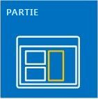
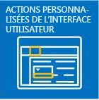
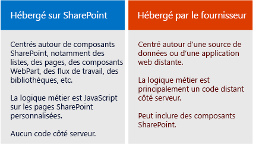

# Compléments
Les Compléments SharePoint sont des extensions autonomes des sites web SharePoint que vous créez et qui s'exécutent sans code personnalisé sur le serveur SharePoint.
## Présentation des Compléments

Il existe deux types d'Compléments SharePoint de base : celles hébergées par SharePoint et celles hébergées par un fournisseur. Pour choisir le meilleur type d'application à développer pour votre scénario, commencez par apprendre ce que les deux types d'Compléments SharePoint ont en commun.
  
    
    

> [!REMARQUE]
> Une application pour périphérique, telle qu'une application mobile, n'est pas vraiment une « Complément SharePoint », même si elle accède à SharePoint. Ceci est également vrai pour une application web qui est lancée à partir d'un environnement extérieur à SharePoint. Si vous souhaitez développer l'un de ces types d'application, voir  [SharePoint de l'accès à partir d'applications de l'appareil mobile et native](http://msdn.microsoft.com/library/42014171-5ee5-421d-9cde-413efc3aecef%28Office.15%29.aspx). 
  
    
    

- **Une Complément SharePoint est une partie de fonctionnalité autonome** qui étend les fonctionnalités des sites web SharePoint pour résoudre un problème d'entreprise bien défini.
    
  
- **Les compléments n'ont pas de code personnalisé qui s'exécute sur les serveurs SharePoint**. À la place, toutes les logiques personnalisées sont envoyées dans le nuage ou sur des ordinateurs clients, ou encore à un serveur sur site qui se trouve en dehors de la batterie SharePoint ou de l'abonnement SharePoint Online. Le fait de maintenir le code personnalisé hors des serveurs SharePoint permet de garantir aux administrateurs SharePoint que le complément ne peut pas nuire à leurs serveurs ou réduire les performances de leurs sites web SharePoint Online.
    
  
- **La logique métier dans une Complément SharePoint peut accéder aux données SharePoint par l'une des nombreuses API clientes incluses dans SharePoint**. Le choix des API utilisées par votre complément dépendra d'autres décisions de conception que vous prendrez.
    
  
- **Pratiquement chaque type principal de composant SharePoint peut faire partie d'une Complément SharePoint**, y compris les pages, listes, flux de travail, types de contenus personnalisés, modèles de liste, composants WebPart, etc.
    
  
- **Les sites web SharePoint où les Compléments SharePoint sont installées et à partir desquels les utilisateurs les lancent sont appelés des sites web hôtes.** Toutefois, les composants SharePoint sont généralement dans un site web enfant spécial du site web hôte appelé lesite web de complément.
    
  
- Les **Compléments SharePoint peuvent être intégrées à un site web SharePoint de plusieurs façons**:
    
|||
|:-----|:-----|
||**En tant qu'expérience pleine page immersive** qui peut prendre l'apparence d'une page SharePoint.   |
||**Dans le cadre d'une page web, en utilisant un type de commande particulier appelé composant de complément**, pour exposer un élément iframe contenant le complément.   |
||**En tant que commandes d'interface utilisateur qui étendent les rubans et les menus** pour les listes, les documents, etc.   |
   
- **Toutes les Compléments SharePoint que les utilisateurs installent ont une vignette sur la page **Contenu du site** du site web SharePoint.** Le fait de cliquer sur la vignette lance le complément.
    
  
- **Une Complément SharePoint est configurée à l'aide d'un  *manifeste de complément* **, c'est-à-dire un fichier XML qui déclare les propriétés de base du complément, l'endroit où il est exécuté et l'action à exécuter par SharePoint au démarrage du complément. Entre autres choses, le manifeste peut spécifier les langues que le complément prend en charge, les services et fonctionnalités SharePoint desquels il dépend et les autorisations d'accès ausite web hôte dont le complément a besoin. (Les Compléments SharePoint ont un contrôle total sur leur propresite web de complément.)
    
  
- **Les Compléments SharePoint sont distribuées en tant que packages de complément**, lesquels contiennent toujours au moins le manifeste du complément. (Si le complément ne possède aucun composant SharePoint, le manifeste de complément peut être le seul élément présent dans le package de complément). Si le complément possède des composants SharePoint dans un site web de complément, ceux-ci sont inclus dans le package en tant qu'ensemble de fichiers XML. Les composants distants hébergés en dehors de SharePoint, par exemple une application ou une base de données web distante, ne sont pas inclus dans le package et sont déployés séparément du package de complément. (Cependant, le manifeste de complément spécifie bien les URL des composants distants.)
    
  
- **Les packages de complément peuvent également contenir des Compléments Office.** Lorsque l'Complément SharePoint est installée, l'Complément Office est ajoutée à un catalogue d'Compléments Office dans SharePoint. Les utilisateurs peuvent l'installer à partir du catalogue dans les applications Office comme Word ou Excel.
    
  

> [!CONSEIL]
> **Pour savoir quelles Compléments SharePoint vous pouvez développer, le mieux est de jeter un œil à quelques-unes d'entre elles dans l'** [Office Store](https://store.office.com/appshome.aspx?productgroup=SharePoint). Vous pouvez aller encore plus loin en ouvrant un site web SharePoint 2013 et en installant quelques Compléments SharePoint gratuites. Il suffit d'accéder à **Contenu du site | Ajouter un complément | SharePoint Store**. 
  
    
    

### Quelques points pour les développeurs SharePoint expérimentés

Nous déconseillons d'utiliser du solutions bac à sable qui contient du code personnalisé côté serveur. Le solutions bac à sable « sans code » et le solutions bac à sable qui contient uniquement du code JavaScript sont toujours pris en charge.
  
    
    
Les Compléments SharePoint n'utilisent pas le modèle objet SharePoint côté serveur. Les modèles objet côté client sont largement développés dans SharePoint 2013. Bien que certaines API dans le modèle objet serveur SharePoint ne soient pas disponibles dans les modèles objet client, il s'agit presque toujours de classes liées à la sécurité et administratives. La logique SharePoint personnalisée apportant une solution à ces domaines est plus appropriée pour un script Windows PowerShell ou une solution de batterie de serveurs SharePoint classique. Pour plus d'informations sur le choix entre des Compléments SharePoint, des solutions de batterie de serveurs SharePoint classiques et du solutions bac à sable, voir  [Comparaison des compléments pour SharePoint et des solutions SharePoint](http://msdn.microsoft.com/library/0e9efadb-aaf2-4c0d-afd5-d6cf25c4e7a8%28Office.15%29.aspx).
  
    
    

## Deux façons pour distribuer et vendre un package de complément

Vous pouvez distribuer un package de complément de deux manières distinctes :
  
    
    

- **Dans le catalogue de compléments d'une organisation**, c'est-à-dire une collection de sites SharePoint dédiée dans la batterie de serveurs sur site ou l'abonnement SharePoint Online. Cette méthode est utilisée lorsque le complément est créé sur-mesure pour une organisation spécifique.
    
  
- **Dans l' [Office Store](https://store.office.com/appshome.aspx?productgroup=SharePoint)**. L'Office Store gère le processus marketing pour vous, de la découverte à l'achat, en passant par les mises à jour. De plus, Microsoft a mis en place le service **Mon tableau de bord vendeur** pour vous aider à vendre des compléments via le Office Store.
    
  
Une fois que vous avez déployé le complément, quelle que soit la méthode choisie, il est disponible et prêt à être installé sur la page **Ajouter un complément** des sites web SharePoint. Si le complément requiert des autorisations pour accéder au site web hôte ou à son abonnement parent, SharePoint demande à l'utilisateur qui a installé le complément d'accorder ces autorisations.
  
    
    
Si vous devez mettre à jour un complément pour résoudre un bogue ou ajouter des fonctionnalités, apportez les modifications et augmentez le numéro de version du complément dans le manifeste de complément. Ensuite, redéployez le package de complément dans l'Office Store ou le catalogue de compléments. Dans un délai de 24 heures, les utilisateurs recevront une notification dans l'interface utilisateur SharePoint leur indiquant qu'une mise à jour est disponible. Ils peuvent installer la mise à jour en un simple clic.
  
    
    

## Deux types d'Compléments SharePoint : applications hébergées par SharePoint et applications hébergées par un fournisseur

  
    
    

  
    
    

### Compléments SharePoint hébergées par SharePoint

Les compléments hébergés par SharePoint sont essentiellement constitués de composants SharePoint dans un site web de complément. On dit parfois que leur « centre de gravité est sur SharePoint ».
  
    
    
Comme pour toutes les Compléments SharePoint, un utilisateur peut exécuter un complément hébergé par SharePoint à partir d'une vignette de la page **Contenu du site** des sites web SharePoint sur lesquels il est installé. Si vous le souhaitez, le site web hôte peut également contenir deux autres types de composants d'interface utilisateur (c'est-à-dire, des boutons personnalisés du ruban ou des éléments de menu). **Tous les autres éléments d'un complément hébergé par SharePoint sont déployés dans le site web de complément.** Ces composants sont définis de façon déclarative à l'aide de fichiers XML et peuvent inclure, entre autres, les éléments suivants :
  
    
    

||||
|:-----|:-----|:-----|
|Pages personnalisées    |Flux de travail    |Modules (ensembles de fichiers)    |
|Modèles de listes    |Instances de listes et de bibliothèques    |Vues et formulaires de liste personnalisés    |
|Types de contenu personnalisés    |Modèles web    |Colonnes intégrées (colonnes non personnalisées)    |
|Composants WebPart intégrés (composants WebPart non personnalisés)    |Fichiers JavaScript    |Boutons et éléments de menu personnalisés pour le site web du complément    |
   

  
    
    
Toutes les logiques métier dans un complément hébergé par SharePoint utilisent JavaScript, soit directement sur une page personnalisée, soit dans un fichier JavaScript référencé à partir d'une page personnalisée. Une version JavaScript du modèle objet SharePoint (JSOM) est disponible pour que le complément effectue les opérations CRUD (création, lecture, mise à jour et suppression) sur les données SharePoint.
  
    
    
Les pages personnalisées dans un complément hébergé par SharePoint sont généralement des pages ASP.NET (ASPX) qui peuvent référencer de manière déclarative les commandes SharePoint prêtes-à-utiliser et ASP.NET, mais il ne peut pas y avoir de code derrière. Toutefois, vous pouvez personnaliser les commandes SharePoint à l'aide d'une option d'affichage côté client et d'un élément JavaScript personnalisé.
  
    
    
Le code JavaScript dans les compléments hébergés par SharePoint peut accéder aux données et ressources qui se trouvent en dehors du site web de complément en utilisant au choix l'une des deux techniques pour travailler en toute sécurité autour de la même stratégie d'origine du navigateur : une bibliothèque inter-domaines JavaScript spéciale ou une classe WebProxy JavaScript spécifique. Grâce à ces techniques, un complément hébergé par SharePoint peut utiliser des données sur le site web hôte, son abonnement parent ou n'importe où sur Internet.
  
    
    

### Compléments SharePoint hébergées par un fournisseur

Tout composant SharePoint pouvant se trouver dans un complément hébergé par SharePoint peut également être un complément hébergé par un fournisseur. Cependant, les compléments hébergés par un fournisseur se distinguent des compléments hébergés par SharePoint parce qu'ils incluent au moins un composant distant, comme une application, un service ou une base de données web hébergé en dehors de la batterie SharePoint ou d'un abonnement SharePoint Online. Il peut s'agir d'un serveur dans le même réseau d'entreprise qu'une batterie SharePoint ou un compte de nuage. Les composants externes peuvent être hébergés sur n'importe quelle pile d'hébergement web, notamment la pile Linux, Apache, MySQL, PHP (LAMP).
  
    
    

> [!REMARQUE]
> **Le « fournisseur » est celui qui possède le compte de serveur ou de nuage.** Il peut s'agir de la même société ou organisation que celle qui est propriétaire de la batterie SharePoint ou du client SharePoint Online sur lequel le complément doit être installé. Toutefois, le développeur du complément peut également être le fournisseur. Généralement, quand un complément est créé pour une organisation en particulier, cette organisation fournit l'hébergement. Cependant, quand un complément est créé pour plusieurs organisations, il est plus probable que le développeur héberge les composants distants. L'hébergement par le développeur s'avère obligatoire si l'Complément SharePoint est commercialisée via le Office Store, car le développeur n'a pas les coordonnées des acheteurs du complément. Dans ce scénario, les diverses instances du complément connaissent l'URI du composant distant, car il est spécifié dans le manifeste du complément.
  
    
    

Vous pouvez utiliser l'infrastructure d'hébergement que vous voulez pour les composants distants. Il n'est pas nécessaire d'utiliser une pile Microsoft. N'importe quel type d'infrastructure d'hébergement web peut être utilisé, y compris la pile LAMP (Linux, Apache, MySQL, PHP), MEAN (MongoDB, ExpressJS, AngularJS, Nodejs), Java, Python, etc. Vous pouvez également utiliser des outils de développement non Microsoft. En outre, les composants distants peuvent être hébergés dans des services cloud non Microsoft.
  
    
    
 **Vous pouvez donner aux pages distantes du complément l'apparence de pages SharePoint** à l'aide d'un contrôle Chrome spécial.
  
    
    
 **Les données distantes peuvent être des objets BLOB, des caches, des files d'attente de messages, des réseaux de distribution de contenu et des bases de données**, entre autres. De plus, les bases de données peuvent être de n'importe quel type, par exemple des bases de données relationnelles et orientées objet. Les données distantes sont accessibles de différentes façons. Par exemple, vous pouvez utiliser Business Connectivity Services (BCS) pour exposer les données dans une liste SharePoint. Une autre possibilité consiste à exposer les données dans une grille sur la page d'une application web distante.
  
    
    
 **Les Compléments SharePoint utilisent des API SharePoint pour se connecter aux fonctionnalités SharePoint** (recherche, flux de travail, réseau social, taxonomie, profils utilisateur, BCS, etc.) et les intégrer. Elles peuvent alors, entre autres, lire des documents, effectuer des recherches, mettre des personnes en relation et exécuter des opérations CRUD. Il existe plusieurs ensembles d'API :
  
    
    

- Lorsque les composants distants sont mis en œuvre avec .NET, la bibliothèque **modèle CSOM (Client-Side Object Model) SharePoint** de code managé est disponible.
    
  
- Pour les composants distants qui ne reposent pas sur .NET, il existe un ensemble d' **API REST/OData** qui peuvent également être utilisées pour accéder aux données SharePoint. Elles peuvent également être utilisées à partir d'un client .NET si vous préférez travailler dans une interface OData.
    
  
- La **bibliothèque JSOM**, mentionnée précédemment, ne peut pas être utilisée sur une page distante, mais les compléments hébergés par un fournisseur peuvent posséder des pages SharePoint personnalisées dans un site web de complément et le code JavaScript sur ces pages peut utiliser la bibliothèque JSOM.
    
  
 **Les compléments hébergés par un fournisseur qui accèdent à SharePoint sont des principaux de sécurité tout comme les utilisateurs et les groupes**. Le principal de complément doit être authentifié et autorisé, tout comme l'utilisateur. Le complément a besoin d'autorisations pour exécuter des opérations sur les données SharePoint dans le site web hôte. Dans la plupart des scénarios, les autorisations effectives d'un utilisateur utilisant SharePoint via une Complément SharePoint sont l'intersection entre les autorisations de l'utilisateur et celles du complément, bien qu'il existe quelques scénarios dans lesquels un utilisateur peut exécuter des opérations avec un complément qu'il n'aurait autrement pas été autorisé à faire.
  
    
    
 **Les compléments hébergés par un fournisseur peuvent se connecter à n'importe quel service web public ou interne**; et, contrairement aux compléments hébergés par SharePoint, ils peuvent **gérer des événements d'élément de liste et de liste SharePoint**, comme l'ajout d'un élément à une bibliothèque de documents.
  
    
    

## Choisir votre développement SharePoint

Vous êtes prêt ?
  
    
    

- **Si vous êtes un développeur SharePoint expérimenté, nous vous recommandons de commencer avec les compléments hébergés par SharePoint.**. Ils représentent la solution la plus proche des types d'extensions SharePoint que vous avez créées par le passé.
    
     [Commencer à créer des compléments SharePoint hébergés par SharePoint](get-started-creating-sharepoint-hosted-sharepoint-add-ins.md)
    
  
- **Si vous êtes un développeur d'applications web ASP.NET expérimenté, nous vous recommandons de commencer avec des compléments hébergés par un fournisseur.** Leur conception repose sur des applications web.
    
     [Commencer à créer des compléments hébergés par un fournisseur pour SharePoint](get-started-creating-provider-hosted-sharepoint-add-ins.md)
    
  
- **Si vous voulez développer un complément hébergé par un fournisseur sur une pile non-Microsoft, voici par où commencer :**
    
  - Si vous n'avez pas encore installé les outils appropriés pour votre pile, installez-les.
    
  
  - Ouvrez un compte de développeur sur Office 365 à des fins de test et de débogage. Pour obtenir des détails, accédez à  [Configurer un environnement de développement pour les compléments pour SharePoint dans Office 365](set-up-a-development-environment-for-sharepoint-add-ins-on-office-365.md), ou si vous avez déjà un abonnement à Office 365, vous devez simplement  [créer un site du développeur dessus](create-a-developer-site-on-an-existing-office-365-subscription.md).
    
  
  - Votre complément utilisera des API REST/OData de SharePoint pour exécuter des opérations CRUD sur les données SharePoint :
    
  - Notre documentation explicative se trouve dans l'article  [Familiarisation avec le service REST SharePoint 2013](get-to-know-the-sharepoint-2013-rest-service.md) et dans d'autres articles que ce dernier indique également.
    
  
  - Les documents de référence se trouvent dans  [Référence d'API REST pour SharePoint 2013](http://msdn.microsoft.com/library/3514e753-19f9-4b41-a1ae-f35c5ffc17d2%28Office.15%29.aspx).
    
  
  - Si vous n'utilisez pas Visual Studio, vous devez créer le fichier manifeste du complément et le package du complément. Pour plus d'informations, voir  [Explorer la structure du manifeste d'application et le package d'un complément pour SharePoint](explore-the-app-manifest-structure-and-the-package-of-a-sharepoint-add-in.md). L'utilisation de Visual Studio et des Outils de développement Microsoft Office pour Visual Studio pour l'élaboration de votre manifeste et de votre package présente un grand nombre d'avantages qui vous permettront de gagner du temps. Nous vous recommandons d'envisager de les utiliser, même si vous utilisez un autre outil pour créer l'application web distante en elle-même. La version  [Community Edition de Visual Studio](https://www.visualstudio.com/news/vs2013-community-vs.aspx) est gratuite.
    
  
  - Voici des exemples de compléments hébergés par un fournisseur pour certaines langues et plateformes non-Microsoft dans la  [section OfficeDev de GitHub](https://github.com/OfficeDev) ; par exemple, [Application PHP pour SharePoint](https://github.com/OfficeDev/PHP-App-for-SharePoint).
    
  

> [!REMARQUE]
> Si vous débutez en développement SharePoint et web, le mieux pour vous est de commencer par le cours gratuit de Microsoft Virtual Academy ou de parcourir un livre sur le développement SharePoint 2013. 
  
    
    

## Voir aussi

#### Autres ressources

  
    
    
 [Démarrer rapidement en développement de solutions principales Microsoft SharePoint Server 2013](http://www.microsoftvirtualacademy.com/training-courses/developing-microsoft-sharepoint-server-2013-core-solutions-jump-start)
