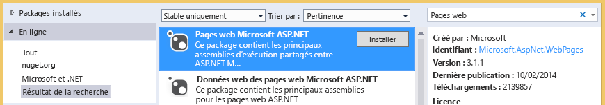

# Résolution des problèmes des bibliothèques de documents
Dans cette rubrique, vous en saurez plus sur les problèmes qui peuvent se produire lorsque vous accédez à une bibliothèque de documents SharePoint à partir d'un complément de gestion des informations professionnelles dans le Cloud et sur les techniques permettant de résoudre ces problèmes.

## Erreur : ce complément ne prend pas en charge le téléchargement de documents à partir de votre navigateur actuel.

Lorsque vous tentez de télécharger un document dans la bibliothèque de documents d'un complément de gestion des informations professionnelles dans le Cloud, le téléchargement échoue avec le message d'erreur suivant : « Ce complément ne prend pas en charge le téléchargement de documents à partir du navigateur actuel. Utilisez la dernière version. » Ce problème se produit uniquement sur certains anciens navigateurs qui ne prennent pas en charge l'API HTML5 FileReader. Pour le résoudre, ajoutez un package NuGet à votre projet et redéployez le complément.

### Pour éviter l'erreur

1. Dans **Explorateur de solutions**, ouvrez le menu contextuel du projet **Serveur**, puis choisissez **Gérer les packages NuGet**.

2. Dans la boîte de dialogue **Gérer les packages NuGet**, développez le nœud **En ligne** et, dans le champ **Rechercher en ligne**, entrez les pages web, comme le montre la figure 1.

   **Figure 1. Sélections dans la boîte de dialogue de gestion des packages NuGet**

3. Dans la liste des résultats, choisissez **Pages Web Microsoft ASP.NET**, puis cliquez sur le bouton **Installer**.

    La boîte de dialogue **Acception de la licence**.

4. Dans la boîte de dialogue **Acception de la licence**, lisez les conditions de la licence et, si vous les acceptez, cliquez sur le bouton **J'accepte**.

5. Lorsque le package est installé, cliquez sur le bouton **Fermer**.

6. Publiez le complément mis à jour sur votre site SharePoint.

## Ressources supplémentaires

-  [Associer une bibliothèque de documents à une entité](associate-a-document-library-with-an-entity.md)

