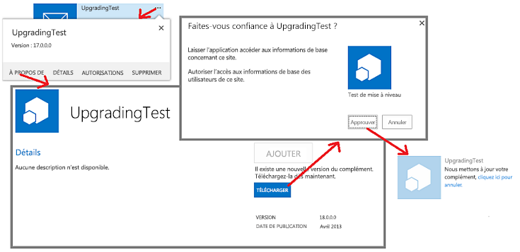

# Mise à jour des compléments pour SharePoint
Découvrez comment créer et déployer une mise à jour pour un Complément SharePoint.
Vous pouvez mettre à jour votre Complément SharePoint en utilisant le support de mise à jour intégré à SharePoint 2013. Dans les 24 heures suivant le téléchargement d'une version mise à jour du complément dans le catalogue de compléments de l'organisation ou l'acceptation du complément dans l'Office Store, une notification indiquant qu'une mise à jour est disponible apparaît à côté du complément sur la page **Contenu du site** de chaque site web où il est installé. Comme vous pouvez le voir sur la figure 1, un lien est accessible pour que les utilisateurs installent immédiatement la mise à jour.

**Figure 1. Processus de mise à jour d'un complément SharePoint**

Vous pouvez installer la mise à jour sans avoir au préalable désinstallé la version antérieure. L'infrastructure de la mise à jour teste l'installation et l'annule s'il existe des erreurs.

> **IMPORTANTE**
> Vous ne pouvez pas modifier le  *type de complément*  à l'aide du système de mise à jour. Par exemple, vous ne pouvez pas profiter d'une mise à jour pour transformer un complément hébergé par SharePoint en complément hébergé par un fournisseur. Pour changer de type, vous devez [migrer d'un ancien complément vers un nouveau complément](sharepoint-add-ins-update-process.md#Major). En particulier, puisque  [le programme de prévisualisation pour les compléments auto-hébergés a été fermé](http://blogs.office.com/2014/05/16/update-on-autohosted-apps-preview-program/), vous devez savoir que vous ne pouvez pas mettre à jour un complément auto-hébergé en complément hébergé par un fournisseur. Vous devez convertir le complément tel qu'expliqué dans  [Conversion d'un complément auto-hébergé pour SharePoint en complément hébergé par un fournisseur](convert-an-autohosted-sharepoint-add-in-to-a-provider-hosted-add-in.md). 

## Conditions requises pour la mise à jour d'un complément SharePoint

- Une installation SharePoint 2013 de test configurée pour l'isolation du complément. Voir  [Configurer un environnement de développement pour les compléments pour SharePoint dans Office 365](set-up-a-development-environment-for-sharepoint-add-ins-on-office-365.md) pour obtenir des instructions sur la configuration d'un Site du développeur Office 365.

- Les outils qui sont utilisés pour la création d'un Complément SharePoint sont aussi généralement utilisés pour le mettre à jour. Par exemple, la plupart des développeurs utilisent Visual Studio et Outils de développement Microsoft Office pour Visual Studio pour créer des Compléments SharePoint.

### Concepts fondamentaux à maîtriser pour mettre à jour un complément SharePoint

**Tableau 1. Concepts fondamentaux pour la mise à jour d'un complément SharePoint**

|**Titre d'article**|**Description**|
|:-----|:-----|
| [Choisir les modèles de développement et l'hébergement d'un complément pour SharePoint](choose-patterns-for-developing-and-hosting-your-sharepoint-add-in.md)   |Découvrez les différents types de Compléments SharePoint. Le processus de mise à jour diffère en fonction du type.    |
| [Processus de mise à jour des compléments pour SharePoint](sharepoint-add-ins-update-process.md)   |Découvrez le processus de mise à jour des Compléments SharePoint.    |
| [Mise à niveau des fonctionnalités](http://msdn.microsoft.com/library/e917f709-6491-4d50-adbe-2ab8f35da990%28Office.15%29.aspx)   |Découvrez le processus de mise à jour des fonctionnalités (Kit de développement logiciel (SDK) SharePoint 2010).    |
| [Déploiement et installation de compléments pour SharePoint : méthodes et options](deploying-and-installing-sharepoint-add-ins-methods-and-options.md)   |Découvrez les méthodes de publication, d'installation et de désinstallation d'un Complément SharePoint.    |
| [Gestion des événements dans les compléments pour SharePoint](handle-events-in-sharepoint-add-ins.md)   |Découvrez les récepteurs d'événements distants dans SharePoint 2013.    |
 

## Étapes principales de mise à jour d'un complément

Voici les principales étapes qui peuvent être nécessaires lorsque vous créez une mise à jour pour un Complément SharePoint. Chaque étape est décrite en détail dans les sections ou les articles faisant l'objet d'un lien. Toutes les étapes ne sont pas nécessaires dans tous les projets de mise à jour. Ce que vous devez faire dépend des composants déjà présents dans votre complément et des composants que vous ajoutez. Seuls les éléments marqués par ***** sont obligatoires.

- Mettez à jour le manifeste du complément.

  - ***** Incrémentez le numéro **Version** dans l'élément [App](http://msdn.microsoft.com/library/d5f30dfe-7500-5f85-0f08-f4f220c0c692%28Office.15%29.aspx) du fichier appmanifest.xml. (Les compléments étaient appelés « applications » lorsque le schéma a été libéré.) *Ne modifiez pas*  le numéro **ProductID**.

  - Modifiez la section  [AppPermissionRequests](http://msdn.microsoft.com/library/4e617622-78d3-3d23-677d-9957eb1fb107%28Office.15%29.aspx) du fichier appmanifest.xml.

  - Modifiez la section  [AppPrerequisites](http://msdn.microsoft.com/library/7622b55f-01a1-2c39-9daa-7cfb1a3c890f%28Office.15%29.aspx) du fichier appmanifest.xml.

    Pour plus d'informations, voir  [Mettre à jour la version du complément, les demandes d'autorisation et les conditions requises](#UpdateManifest).

- Ajoutez ou mettez à jour le balisage pour les composants de site web de complément. Pour plus d'informations, voir  [Mettre à jour des composants de compléments web dans SharePoint 2013](update-add-in-web-components-in-sharepoint-2013.md).

- Ajoutez ou mettez à jour le balisage pour les composants web hôtes. Pour plus d'informations, voir  [Mettre à jour des composants web hôte dans SharePoint 2013](update-host-web-components-in-sharepoint-2013.md).

- Ajoutez une logique personnalisée à un élément  [UpgradedEventEndpoint](http://msdn.microsoft.com/library/09a93d44-d295-47bb-f91c-d243178b0f53%28Office.15%29.aspx) et enregistrez-la dans le fichier appmanifest.xml. Pour plus d'informations, voir [Créer un gestionnaire pour l'événement de mise à jour dans des compléments pour SharePoint](create-a-handler-for-the-update-event-in-sharepoint-add-ins.md).

- Mettez à jour les composants distants :

  - Pour un complément hébergé par un fournisseur, mettez à jour les composants distants en utilisant les techniques appropriées pour la pile de la plateforme d'hébergement.

    Pour plus d'informations, voir  [Mettre à jour des composants distants dans les compléments pour SharePoint](update-remote-components-in-sharepoint-add-ins.md).

- ***** Téléchargez le package de complément vers l'Office Store ou le catalogue de compléments de l'organisation.

## Meilleures pratiques pour les mises à jour de complément

Les sections suivantes décrivent les pratiques à respecter et les points importants à prendre en compte lorsque vous planifiez une mise à jour.

### Déterminer si la mise à jour est réellement nécessaire

Pour un Complément SharePoint hébergé par un fournisseur, les améliorations apportées au complément ne nécessitent pas forcément la mise à jour du complément. Si toutes les modifications sont apportées à des composants distants et qu'elles n'ont pas à être reflétées dans les composants SharePoint, vous pouvez modifier les composants distants sans mettre à jour le complément. Tant que les URL et les chaînes de connexion utilisées par les composants SharePoint pour accéder aux composants distants ne changent pas, le Complément SharePoint continue de fonctionner. Par exemple, supposons que vous ajoutiez un bouton à une application web distante qui lit une colonne d'une liste SharePoint que l'application web n'avait pas lue auparavant. Si la colonne existe déjà dans la liste, vous n'avez rien à modifier dans SharePoint. Vous pouvez télécharger la page web révisée, ainsi que le code révisé correspondant ou JavaScript, vers l'application web distante. La nouvelle fonctionnalité est immédiatement disponible pour les utilisateurs lorsqu'ils démarrent le Complément SharePoint.

### Penser que la mise à jour est facultative pour les utilisateurs

Lorsqu'une nouvelle version de votre Complément SharePoint devient disponible dans l'Office Store ou le catalogue de compléments de l'organisation, un message apparaît sur la vignette du complément sur la page **Contenu du site** et informe les utilisateurs qu'une mise à jour est disponible. Ce message s'affiche en moins de 24 heures. Cependant, rien dans l'infrastructure SharePoint n'oblige les utilisateurs à procéder aux mises à jour. Les modifications que vous apportez aux composants distants ne doivent donc pas « casser » les versions antérieures du complément. En règle générale, mais pas de manière universelle, vous pouvez *ajouter*  des éléments aux composants distants, mais évitez de supprimer, renommer, déplacer ou modifier le schéma, la chaîne de connexion ou l'URL d'un composant existant.

Si un composant distant doit connaître la version de l'instance de complément qui l'appelle, vous pouvez transmettre cette information à partir de SharePoint. Par exemple, vous pouvez ajouter la version du complément en tant que paramètre de requête sur l'URL  [StartPage](http://msdn.microsoft.com/library/3092674c-a6c3-9021-3d7e-e716562a4a4f%28Office.15%29.aspx) du complément.

### Créer et déboguer la nouvelle version comme s'il s'agissait d'un nouveau complément

Vous devez séparer le développement et le débogage de la nouvelle version du complément du débogage du balisage et de la logique de la mise à jour. Pour ce faire, désinstallez la version antérieure du complément de votre site SharePoint de test de développement. Enregistrez une copie de sauvegarde du fichier de package de complément pour la version antérieure. Ajoutez et modifiez les composants du complément tel que nécessaire, puis testez-les et déboguez-les par rapport au site de test, comme s'il s'agissait d'un tout nouveau complément créé de A à Z.

### Tester la mise à jour avec chaque version antérieure du complément

Lorsque la nouvelle version du complément fonctionne correctement en tant que « nouveau complément », restructurez le code et le balisage afin que le projet soit une mise à jour de l'ancien complément. Par exemple, incrémentez le numéro de version du complément, comme indiqué à la section  [Étapes principales de mise à jour d'un complément](#MajorAppUpgradeSteps). Pour plus d'informations sur la manière de transformer un projet en mise à jour, consultez les rubriques enfants de cette rubrique.

Lorsque vous êtes prêt à tester votre mise à jour, retirez la nouvelle version du site de test et redéployez la version antérieure de façon à pouvoir tester la logique de mise à jour. Si vous avez fourni plusieurs versions antérieures du complément, installez chaque version antérieure sur un sous-site web distinct de votre site de test. Ensuite, téléchargez la dernière version du complément sur le catalogue de compléments de votre site de test et mettez à jour chaque instance du complément. Assurez-vous que chacune d'entre elles possède le dernier numéro de version du complément et la dernière version de tous les composants. S'il existe un site web de complément dans le complément, vérifiez que les composants de site web de complément ont été déployés conformément à la procédure décrite dans  [Vérifier le déploiement des composants de site web de complément](update-add-in-web-components-in-sharepoint-2013.md#VerifyDeployAppWebComp).

### Mettre à jour un complément sans attendre 24 heures

Lorsque vous développez une mise à jour pour un complément sur votre site de test SharePoint, il n'est pas pratique d'attendre 24 heures entre les mises à jour. Vous (et les utilisateurs d'un site SharePoint de production) pouvez mettre à jour un complément immédiatement après son téléchargement sur l'Office Store ou le catalogue de compléments de l'organisation en suivant ces étapes :

### Pour mettre à jour un complément immédiatement

1. Une fois la dernière mise à jour téléchargée sur le catalogue de complément, ouvrez la page **Contenu du site** sur le site web où le complément est installé et cliquez sur le bouton **...** sur la vignette du complément.

2. Dans la légende qui s'affiche, choisissez l'onglet **À propos de**. Sur la page **À propos de** qui s'affiche, une notification indique qu'une nouvelle version est disponible.

3. Choisissez le bouton **Obtenir**. La page **Contenu du site** se rouvre et une notification sur la vignette du complément indique que le complément est en cours de mise à jour.

La figure 2 illustre ces étapes.

**Figure 2. Processus de mise à jour immédiate d'un complément SharePoint**

> **REMARQUE**
> Si la fréquence de 24 heures pour l'affichage de la notification de « mise à jour disponible » sur la vignette du complément n'est pas assez élevée pour vous, vous pouvez utiliser la méthode décrite dans  [Procédure de mise à jour d'un complément SharePoint](sharepoint-add-ins-update-process.md#Minor) pour que la notification apparaisse immédiatement.

## Mettre à jour la version du complément, les demandes d'autorisation et les conditions requises

Après avoir effectué une copie de sauvegarde du dossier de projet Visual Studio, ouvrez le projet de complément. Ouvrez le manifeste de complément et incrémentez le numéro de version sur l'onglet **Général** du concepteur de manifeste.

Si la version mise à jour du complément requiert plus (ou moins) d'autorisations pour accéder aux composants du site web hôte, apportez les modifications nécessaires à la section  [AppPermissionRequests ](http://msdn.microsoft.com/library/4e617622-78d3-3d23-677d-9957eb1fb107%28Office.15%29.aspx) du complément. Dans Visual Studio, utilisez l'onglet **Autorisations** du concepteur de manifeste. Lorsqu'un complément est mis à jour, l'utilisateur est toujours invité à accorder des autorisations, que les autorisations aient changé ou non depuis la version précédente. Si la nouvelle version demande *moins*  d'autorisations que la version précédente, les autorisations supplémentaires de la version précédente *ne sont pas révoquées*  . La seule façon pour l'utilisateur de limiter le complément aux autorisations nécessaires à la version la plus récente est d'ouvrir la page *{DomaineSharePoint}*  `/_layouts/15/appinv.aspx` une fois que le complément a été mis à jour, puis d'entrer manuellement un balisage d'autorisation conforme au schéma [AppPermissionRequests](http://msdn.microsoft.com/library/4e617622-78d3-3d23-677d-9957eb1fb107%28Office.15%29.aspx).

Si la version mise à jour du complément comporte des composants requis qui n'existaient pas dans les versions précédentes (ou ne contient plus les composants requis qui existaient dans les versions précédentes), apportez les modifications nécessaires à la section  [AppPrerequisites](http://msdn.microsoft.com/library/7622b55f-01a1-2c39-9daa-7cfb1a3c890f%28Office.15%29.aspx) du complément. Dans Visual Studio, utilisez l'onglet **Composants requis** du concepteur de manifeste.

## Étapes suivantes

Continuez avec le point suivant de la section  [Étapes principales de mise à jour d'un complément](#MajorAppUpgradeSteps) ou accédez directement à l'un des articles suivants :

-  [Mettre à jour des composants de compléments web dans SharePoint 2013](update-add-in-web-components-in-sharepoint-2013.md)

-  [Mettre à jour des composants web hôte dans SharePoint 2013](update-host-web-components-in-sharepoint-2013.md)

-  [Créer un gestionnaire pour l'événement de mise à jour dans des compléments pour SharePoint](create-a-handler-for-the-update-event-in-sharepoint-add-ins.md)

-  [Mettre à jour des composants distants dans les compléments pour SharePoint](update-remote-components-in-sharepoint-add-ins.md)

## Ressources supplémentaires

-  [Développer des compléments pour SharePoint](develop-sharepoint-add-ins.md)

-  [Processus de mise à jour des compléments pour SharePoint](sharepoint-add-ins-update-process.md)

