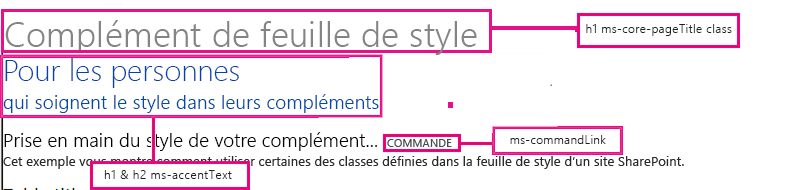
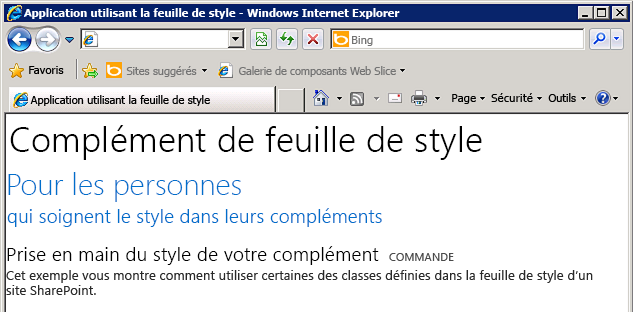

# Utilisation d'une feuille de style de site web SharePoint dans les compléments pour SharePoint
Découvrez comment utiliser la feuille de style d'un site web SharePoint dans un Complément SharePoint.
Vous pouvez référencer la feuille de style d'un site web SharePoint dans votre Complément SharePoint et l'utiliser pour donner un style à vos pages web en utilisant la feuille de style dans SharePoint. En outre, si quelqu'un modifie la feuille de style ou le thème du site web SharePoint, vous pouvez adopter le nouvel ensemble de styles dans votre complément sans modifier la référence de la feuille de style dans celui-ci.


> **IMPORTANTE**
> Si vos pages web utilisent le contrôle Chrome ou la page maître du complément, les styles sont déjà disponibles et prêts à l'emploi et vous n'avez pas besoin de référencer manuellement la feuille de style en suivant la procédure de cet article. 


## Conditions préalables à l'utilisation des exemples de cet article
<a name="SP15Usestylesheetcontrol_Prereq"> </a>

Vous avez besoin d'un environnement de développement comme indiqué dans  [Commencer à créer des compléments hébergés par un fournisseur pour SharePoint](get-started-creating-provider-hosted-sharepoint-add-ins.md).


### Principaux concepts à connaître avant d'utiliser la feuille de style SharePoint dans un Complément SharePoint

Le tableau suivant indique les articles utiles pouvant vous aider à comprendre les concepts figurant dans un scénario basé sur la feuille de style SharePoint.


**Tableau 1. Principaux concepts préalables à l'utilisation de la feuille de style**


|**Titre d'article**|**Description**|
|:-----|:-----|
| [Compléments](sharepoint-add-ins.md) <br/> |Découvrez le nouveau modèle de complément SharePoint qui vous permet de créer des compléments, qui sont des solutions faciles à utiliser et de taille réduite destinées aux utilisateurs finaux.  <br/> |
| [Conception de l'expérience utilisateur pour les compléments dans SharePoint](ux-design-for-sharepoint-add-ins.md) <br/> |Découvrez les options d'expérience utilisateur et les solutions à votre disposition lorsque vous créez des Compléments SharePoint.  <br/> |
| [Héberger des sites web, des sites web de complément et des composants SharePoint dans SharePoint 2013](host-webs-add-in-webs-and-sharepoint-components-in-sharepoint-2013.md) <br/> |Découvrez la différence entre les sites web hôtes et les sites web de complément. Découvrez les composants SharePoint pouvant être inclus dans un Complément SharePoint, les composants déployés sur le site web hôte, les composants déployés sur le site web de complément et la façon dont le site web de complément est déployé dans un domaine isolé.  <br/> |
 

## Exemple de code : utiliser la feuille de style d'un site web SharePoint dans un Complément SharePoint
<a name="SP15Usestylesheetcontrol_Example"> </a>

Cet exemple de code vous montre comment utiliser la feuille de style du site web SharePoint. Cela permet à vos pages d'application web à distance de correspondre à l'apparence des pages dans le site web hôte SharePoint.


Pour utiliser la feuille de style dans un Complément SharePoint, procédez comme suit :


1. Créez le Complément SharePoint hébergé par un fournisseur.


2. Forcez la mise en service du site web du complément en créant une page vierge.


3. Ajoutez une page web au projet web et référencez la feuille de style.


4. Modifiez l'élément dans le manifeste du complément.


La Figure 1 illustre une page web SharePoint utilisant une feuille de style.


**Figure 1. Page web utilisant la feuille de style**





### Pour créer le complément SharePoint et les projets web distants


1. Ouvrez Visual Studio en tant qu'administrateur. (Pour cela, cliquez avec le bouton droit de la souris sur l'icône Visual Studio dans le menu **Démarrer**, puis choisissez **Exécuter en tant qu'administrateur**.)


2. Créez le Complément SharePoint hébergé par un fournisseur, comme indiqué dans  [Commencer à créer des compléments hébergés par un fournisseur pour SharePoint](get-started-creating-provider-hosted-sharepoint-add-ins.md) et nommez-leStylesheetAdd-in (Complément feuille de style).


### Pour forcer la mise en service du site web du complément en créant une page vierge


1. Cliquez avec le bouton droit sur le projet de Complément SharePoint et ajoutez un nouveau module.


2. Cliquez avec le bouton droit sur le nouveau module et ajoutez un nouvel élément.


3. Sous **Éléments Visual C#**, **Web**, choisissez **Page HTML**. Renommez la page **blank.html**.


4. Supprimez le contenu du fichier blank.html.


### Pour ajouter une page web qui fait référence à la feuille de style dans le projet web


1. Cliquez avec le bouton droit sur le projet web et ajoutez un nouveau formulaire web. Renommez le formulaire web **StyleConsumer.aspx**.


2. Remplacez le contenu du fichier .aspx du formulaire web par le code suivant. Le code effectue les tâches suivantes :

  - Charge la page blank.html à partir du site web du complément dans un IFrame invisible.


  - Charge le fichier defaultcss.ashx à partir du site web du complément.


  - Utilise les styles disponibles.


 ```

<%@ Page Language="C#" AutoEventWireup="true" CodeBehind="StyleConsumer.aspx.cs" Inherits="StylesheetAppWeb.StyleConsumer" %>

<!DOCTYPE html>
<html>
<head>
    <title>Add-in using stylesheet</title>
</head>
<body>

    <!-- The main page title -->
    <h1 class="ms-core-pageTitle">Stylesheet add-in</h1>

    <!-- Some subtitle -->
    <h1 class="ms-accentText">For people</h1>

    <!-- Subtitle comments -->
    <h2 class="ms-accentText">who care about the style in their add-ins</h2>
    <p></p>
    <div>
        <h2 class="ms-webpart-titleText">Get started with style in your add-in... </h2>
        <a class="ms-commandLink" href="#">some command</a>
        <br />
        This sample shows you how to use some of the classes defined in the SharePoint website's style sheet.
    </div>

    <!-- Script to load SharePoint resources
        and load the blank.html page in
        the invisible iframe
        -->
    <script type="text/javascript">
        "use strict";
        var appweburl;

        (function () {
            var ctag;

            // Get the URI decoded add-in web URL.
            appweburl =
                decodeURIComponent(
                    getQueryStringParameter("SPAppWebUrl")
            );
            // Get the ctag from the SPClientTag token.
            ctag =
                decodeURIComponent(
                    getQueryStringParameter("SPClientTag")
            );

            // The resource files are in a URL in the form:
            // web_url/_layouts/15/Resource.ashx
            var scriptbase = appweburl + "/_layouts/15/";

            // Dynamically create the invisible iframe.
            var blankiframe;
            var blankurl;
            var body;
            blankurl = appweburl + "/Pages/blank.html";
            blankiframe = document.createElement("iframe");
            blankiframe.setAttribute("src", blankurl);
            blankiframe.setAttribute("style", "display: none");
            body = document.getElementsByTagName("body");
            body[0].appendChild(blankiframe);

            // Dynamically create the link element.
            var dclink;
            var head;
            dclink = document.createElement("link");
            dclink.setAttribute("rel", "stylesheet");
            dclink.setAttribute("href", scriptbase + "defaultcss.ashx?ctag=" + ctag);
            head = document.getElementsByTagName("head");
            head[0].appendChild(dclink);
        })();

        // Function to retrieve a query string value.
        // For production purposes you may want to use
        //  a library to handle the query string.
        function getQueryStringParameter(paramToRetrieve) {
            var params;
            var strParams;

            params = document.URL.split("?")[1].split("&amp;");
            strParams = "";
            for (var i = 0; i < params.length; i = i + 1) {
                var singleParam = params[i].split("=");
                if (singleParam[0] == paramToRetrieve)
                    return singleParam[1];
            }
        }
    </script>
</body>
</html>

 ```


    Dans certains cas, l'utilisateur doit être authentifié dans SharePoint avant que votre page ne puisse télécharger la feuille de style CSS et les images pour le style. Les balises de liens n'authentifient pas automatiquement un utilisateur qui n'est pas déjà connecté. Si possible, chargez une ressource de page du site web du complément vers votre page web pour forcer l'authentification de l'utilisateur avant la liaison avec le fichier CSS. Dans cet exemple, la page blank.html est chargée dans un IFrame invisible.


### Pour modifier l'élément StartPage dans le manifeste du complément


1. Double-cliquez sur le fichier **AppManifest.xml** dans l' **Explorateur de solutions**.


2. Dans le menu déroulant **Page de démarrage**, choisissez la page web qui utilise la feuille de style.


### Pour générer et exécuter la solution


1. Vérifiez que le projet de Complément SharePoint est défini en tant que projet de démarrage.


2. Appuyez sur la touche F5.

    > **REMARQUE**
      > Lorsque vous appuyez sur F5, Visual Studio génère la solution, déploie le complément et ouvre la page des autorisations pour le complément. 
3. Choisissez le bouton **Approuver**.


4. Cliquez sur l'icône de complément **StylesheetBasic**.


5. La Figure 2 illustre la page web obtenue, qui utilise les styles SharePoint.

   **Figure 2. Feuille de style utilisée dans la page**





6. Vous pouvez également accéder au site web hôte et modifier le thème. Ensuite, rechargez la page web de complément pour utiliser les nouveaux styles.


**Tableau 2. Dépannage de la solution**


|**Problème**|**Solution**|
|:-----|:-----|
|Visual Studio n'ouvre pas le navigateur après avoir appuyé sur la touche F5.  <br/> |Définissez le projet de Complément SharePoint comme projet de démarrage.  <br/> |
|Erreur de certificat.  <br/> |Définissez la propriété **SSL activé** de votre projet web sur False. Dans le projet de Complément SharePoint, définissez la propriété **Projet Web** surAucun, puis redéfinissez la propriété conformément au nom de votre projet web.  <br/> |
 

## Étapes suivantes
<a name="SP15Usestylesheetcontrol_Nextsteps"> </a>

Cet article a illustré l'utilisation de la feuille de style dans un Complément SharePoint. Pour plus d'informations, vous pouvez découvrir les autres composants d'expérience utilisateur disponibles pour les Compléments SharePoint. Pour plus d'informations, voir :


-  [Exemple de code : utiliser la feuille de style SharePoint dans un complément](http://code.msdn.microsoft.com/SharePoint-2013-Use-the-7a8684e2)


-  [Utiliser le contrôle de chrome client dans les compléments pour SharePoint](use-the-client-chrome-control-in-sharepoint-add-ins.md)


-  [Créer des actions personnalisées à déployer avec les compléments pour SharePoint](create-custom-actions-to-deploy-with-sharepoint-add-ins.md)


-  [Créer des composants de complément à installer avec votre complément pour SharePoint](create-add-in-parts-to-install-with-your-sharepoint-add-in.md)


## Ressources supplémentaires
<a name="SP15Usestylesheetcontrol_Addresources"> </a>


-  [Conception de l'expérience utilisateur pour les compléments dans SharePoint](ux-design-for-sharepoint-add-ins.md)


-  [Conseils pour la conception de l'expérience utilisateur des compléments pour SharePoint](sharepoint-add-ins-ux-design-guidelines.md)


-  [Créer des composants d'expérience utilisateur dans SharePoint 2013](create-ux-components-in-sharepoint-2013.md)


-  [Penser de trois manières différentes les options de conception des compléments pour SharePoint](three-ways-to-think-about-design-options-for-sharepoint-add-ins.md)


-  [Aspects importants du contexte de développement et de l'architecture des compléments pour SharePoint](important-aspects-of-the-sharepoint-add-in-architecture-and-development-landscap.md)


