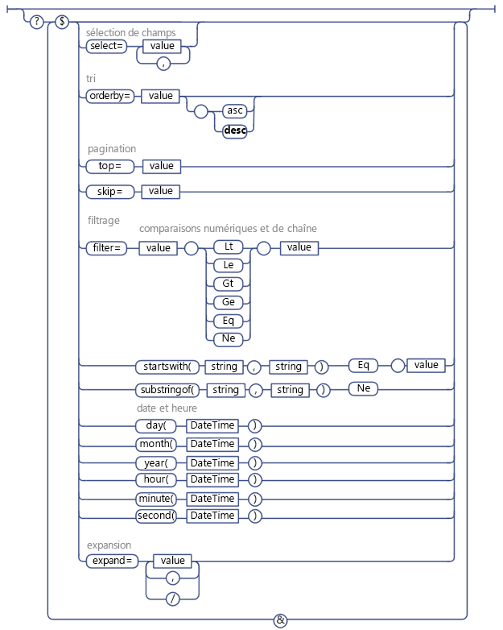

# Utiliser les opérations de requête OData dans les demandes REST SharePoint
Découvrez comment utiliser une large gamme d'opérateurs de chaîne de requête OData pour sélectionner, filtrer et trier les données que vous demandez à partir du service REST SharePoint.
 **Avant de commencer**
  
    
    

-  [Familiarisation avec le service REST SharePoint 2013](get-to-know-the-sharepoint-2013-rest-service.md)
    
  
-  [Naviguer dans la structure de données SharePoint représentée dans le service REST](navigate-the-sharepoint-data-structure-represented-in-the-rest-service.md)
    
  
-  [Déterminer les URI de point de terminaison du service REST SharePoint](determine-sharepoint-rest-service-endpoint-uris.md)
    
  

Le service REST SharePoint prend en charge un large éventail d'opérateurs de chaîne de requête OData, qui vous permettent de sélectionner, de filtrer et d'ordonner les données demandées.
  
    
    

> **CONSEIL**
> Le service REST SharePoint Online (et SharePoint sur site 2016 et ultérieur) prend en charge la combinaison de plusieurs requêtes en un seul appel au service à l'aide de l'option de requête  `$batch` OData. Pour plus de détails et des liens vers des exemples de code, reportez-vous à [Effectuer des requêtes de lot avec les API REST](make-batch-requests-with-the-rest-apis.md). 
  
    
    

## Sélectionner les champs à renvoyer

L'option de requête  [$select](http://www.odata.org/documentation/odata-version-2-0/uri-conventions#SelectSystemQueryOption) permet d'indiquer les champs à renvoyer pour une liste, un élément de liste ou un autre objet SharePoint particulier représenté par un jeu d'entités. Vous pouvez utiliser `$select=*` pour renvoyer tous les champs disponibles.
  
    
    

> **REMARQUE**
> En général, si vous n'indiquez pas l'option de requête  `$select`, le service REST renvoie tous les champs disponibles par défaut. Mais il arrive que des objets SharePoint comprennent des propriétés dont la récupération mobilise beaucoup de ressources ; pour optimiser les performances du service REST, ces propriétés ne sont pas incluses dans la requête par défaut et doivent faire l'objet d'une demande explicite. > Par exemple, la propriété **SPWeb.EffectiveBasePermissions** n'est pas renvoyée par défaut et doit être demandée explicitement à l'aide de l'option de requête `$select`. 
  
    
    

En outre, vous pouvez spécifier que la demande renvoie des champs projetés à partir d'autres listes, ainsi que les valeurs de recherche. Pour ce faire, indiquez le nom de champ dans les options de requête  `$select` et `$expand`. Par exemple :
  
    
    
 `http://server/site/_api/web/lists('guid')/items?$select=Title,Products/Name&amp;$expand=Products/Name`
  
    
    
L'expansion en bloc et la sélection d'éléments connexes ne sont pas prises en charge.
  
    
    

## Sélectionner les éléments à renvoyer

L'option de requête  [$filter](http://www.odata.org/documentation/odata-version-2-0/uri-conventions#FilterSystemQueryOption) permet de sélectionner les éléments à renvoyer. La section [Opérateurs de requête OData pris en charge dans le service REST SharePoint](#bk_supported) répertorie les options de comparaison de requête de filtre et les fonctions disponibles avec le service REST SharePoint.
  
    
    

## Requête pour les champs Liste de choix à valeur unique

Les champs Liste de choix à valeur unique sont représentés par deux champs distincts dans le service REST SharePoint : l'un représentant la valeur du champ en question, l'autre le nom du champ. Vous pouvez effectuer des requêtes sur la valeur du champ Liste de choix comme vous le feriez avec n'importe quel champ de ce type de données. Par exemple, si la valeur du champ Liste de choix est une chaîne, vous pouvez utiliser les options de comparaison de chaîne dans votre requête.
  
    
    

## Requête pour les utilisateurs

Dans le service REST SharePoint, les utilisateurs sont représentés par leur nom (d'affichage) convivial, et non par leur alias ou leur combinaison domaine\\alias. Par conséquent, vous devez créer les requêtes d'utilisateurs sur leurs noms conviviaux.
  
    
    

> **REMARQUE**
> Les requêtes d'utilisateurs basées sur l'appartenance ne sont pas prises en charge. > L'utilisation de l'opérateur **Current** pour lancer des requêtes à l'aide de l'ID de l'utilisateur en cours n'est pas prise en charge.
  
    
    

## Requête pour les champs Liste de choix à valeurs multiples et les utilisateurs

Les champs Liste de choix à valeurs multiples étant renvoyés sous la forme d'une chaîne à valeurs multiples, il est impossible de les rechercher (par exemple, l'équivalent d'un élément **Includes** ou **NotIncludes** n'est pas pris en charge).
  
    
    

## Trier les éléments renvoyés

Utilisez l'option de requête  [$orderby](http://www.odata.org/documentation/odata-version-2-0/uri-conventions#OrderBySystemQueryOption) pour indiquer comment trier les éléments dans l'ensemble des réponses de la requête. Pour trier en fonction de plusieurs champs, spécifiez une liste de champs séparés par des virgules. Vous pouvez aussi indiquer si les éléments doivent être triés par ordre croissant ou décroissant en ajoutant le mot clé **asc** ou **desc** à votre requête.
  
    
    

## Parcourir les éléments renvoyés

Les options de requête  [$top](http://www.odata.org/documentation/odata-version-2-0/uri-conventions#TopSystemQueryOption) et [$skiptoken](http://msdn.microsoft.com/library/dd942121.aspx) permettent de ne sélectionner qu'un sous-ensemble des éléments qui auraient sinon été renvoyés par la requête.
  
    
    

> **REMARQUE**
> L'option de requête $skip ne fonctionne pas avec les requêtes pour les éléments de liste SharePoint. 
  
    
    

L'option  `$top` permet de ne sélectionner que les *n*  premiers éléments devant être renvoyés par la requête. Par exemple, l'URI suivant demande de ne renvoyer que les dix premiers éléments de l'ensemble des éléments pouvant être renvoyés :
  
    
    
 `http://server/site/_api/web/lists('<guid>')/items$top=10`
  
    
    
L'option $skiptoken permet d'ignorer des éléments jusqu'à celui spécifié et de renvoyer les autres.
  
    
    
 `$skiptoken=Paged=TRUE&amp;p_ID=5`
  
    
    

> **REMARQUE**
> Lorsque vous utilisez ces options de requête, tenez compte du fait que la pagination dans OData est ordinale. Par exemple, supposons que vous implémentez un bouton Page suivante pour afficher des éléments de liste SharePoint. Vous utilisez le service REST pour activer le bouton et pour qu'il renvoie les éléments 1 à 20 lorsque vous cliquez dessus, puis les éléments 21 à 40, et ainsi de suite. Toutefois, imaginons qu'un autre utilisateur supprime les éléments 4 et 18 entre deux clics sur le bouton Suivant. Dans ce cas, l'ordre des éléments restants est réinitialisé et l'affichage des éléments 21 à 40 ignore deux éléments. 
  
    
    

## Opérateurs de requête OData pris en charge dans le service REST SharePoint

|**Pris en charge**|**Non pris en charge**|
|:-----|:-----|
|**Comparaisons numériques**    Lt    Le    Gt    Ge    Eq    Ne   | Opérateurs arithmétiques           (Add, Sub, Mul, Div, Mod)    Fonctions mathématiques de base          (arrondi, plancher, plafond)    |
|**Comparaisons de chaînes**    startsWith    substringof    Eq    Ne   | endsWith    replace    substring    tolower    toupper    trim    concat   |
|**Fonctions de date et d'heure**    day()    month()    year()    hour()    minute()    second()   | Opérateur DateTimeRangesOverlap    Si une date/heure appartient à un modèle de date/heure récurrent   |
   
La figure ci-dessous présente les options de requête OData prises en charge.
  
    
    

**Options de requête OData prises en charge**

  
    
    

  
    
    

  
    
    

  
    
    

  
    
    

## Ressources supplémentaires

-  [Familiarisation avec le service REST SharePoint 2013](get-to-know-the-sharepoint-2013-rest-service.md)
    
  
-  [Effectuer des opérations de base à l'aide de terminaux REST SharePoint 2013](complete-basic-operations-using-sharepoint-2013-rest-endpoints.md)
    
  
-  [Utilisation d'une liste et de ses éléments avec REST](working-with-lists-and-list-items-with-rest.md)
    
  
-  [Utilisation de dossiers et de fichiers à l'aide de l'interface REST](working-with-folders-and-files-with-rest.md)
    
  
-  [Naviguer dans la structure de données SharePoint représentée dans le service REST](navigate-the-sharepoint-data-structure-represented-in-the-rest-service.md)
    
  
-  [Déterminer les URI de point de terminaison du service REST SharePoint](determine-sharepoint-rest-service-endpoint-uris.md)
    
  
-  [Exemples, points de terminaison et API REST pour SharePoint 2013](02128c70-9d27-4388-9374-a11bce68fdb8.md)
    
  

  
    
    
