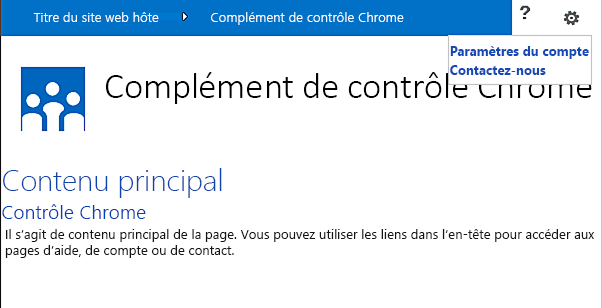
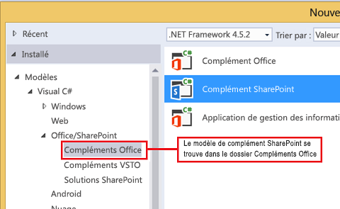
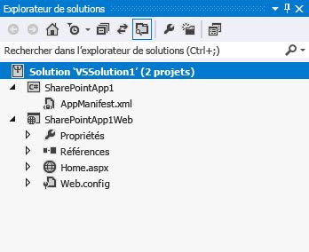
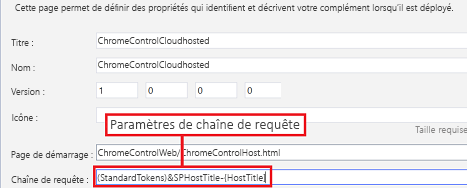
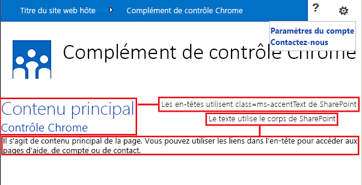

# Utiliser le contrôle de chrome client dans les compléments pour SharePoint
Découvrez comment utiliser le contrôle Chrome avec les compléments dans SharePoint 2013.
Le contrôle Chrome dans SharePoint 2013 vous permet d'utiliser les styles d'en-tête d'un site SharePoint spécifique dans votre complément sans avoir à inscrire dans le Registre une bibliothèque de serveur ou utiliser une technologie ou un outil spécifique. Pour utiliser cette fonctionnalité, vous devez inscrire dans le Registre une bibliothèque JavaScript SharePoint par le biais d'une balise <script> standard. Vous pouvez fournir un espace réservé au moyen d'un élément HTML **div** et personnaliser davantage le contrôle au moyen des options disponibles. Le contrôle hérite de son aspect à partir du site web SharePoint spécifié.
  
    
    


## Conditions préalables à l'utilisation des exemples de cet article
<a name="SP15Usechromecontrol_Prereq"> </a>

Pour suivre les étapes de cet exemple, vous avez besoin des éléments suivants :
  
    
    

- Visual Studio 2015
    
  
- Un environnement de développement SharePoint 2013 (isolation de complément requise pour les scénarios locaux)
    
  
Pour obtenir des instructions sur la manière de configurer un environnement de développement adapté à vos besoins, voir  [Commencer à créer des applications pour Office et SharePoint](http://msdn.microsoft.com/library/187f8c8c-1b15-471c-80b5-69a40e67deea%28Office.15%29.aspx).
  
    
    

### Concepts clés à connaître avant d'utiliser le contrôle Chrome

Le tableau suivant indique les articles utiles pouvant vous aider à comprendre les concepts figurant dans un scénario utilisant le contrôle Chrome.
  
    
    

**Tableau 1. Principaux concepts pour l'utilisation du contrôle Chrome**


|**Titre d'article**|**Description**|
|:-----|:-----|
| [Compléments](sharepoint-add-ins.md) <br/> |Découvrez le nouveau modèle de complément SharePoint 2013 qui vous permet de créer des compléments, qui sont des solutions faciles à utiliser et de taille réduite destinées aux utilisateurs finaux.  <br/> |
| [Conception de l'expérience utilisateur pour les compléments dans SharePoint](ux-design-for-sharepoint-add-ins.md) <br/> |Découvrez les options d'expérience utilisateur et les solutions à votre disposition lorsque vous créez des Compléments SharePoint.  <br/> |
| [Héberger des sites web, des sites web de complément et des composants SharePoint dans SharePoint 2013](host-webs-add-in-webs-and-sharepoint-components-in-sharepoint-2013.md) <br/> |Découvrez la différence entre les sites web hôtes et les sites web de complément. Découvrez les composants SharePoint 2013 pouvant être inclus dans un Complément SharePoint, les composants déployés sur le site web hôte, les composants déployés sur le site web de complément et la façon dont le site web de complément est déployé dans un domaine isolé.  <br/> |
   

## Exemple de code : utiliser le contrôle Chrome dans votre complément hébergé par le cloud
<a name="SP15Usechromecontrol_Codeexample"> </a>

Un complément hébergé par le cloud inclut au moins un composant distant. Pour plus d'informations, voir  [Choisir les modèles de développement et l'hébergement d'un complément pour SharePoint](choose-patterns-for-developing-and-hosting-your-sharepoint-add-in.md). Pour utiliser le contrôle Chrome dans votre complément hébergé sur le cloud, procédez comme suit :
  
    
    

1. Créez le Complément SharePoint et les projets web distants.
    
  
2. Envoyez les options de configuration par défaut dans la chaîne de requête.
    
  
3. Ajoutez une page web au projet web.
    
  
La Figure 1 présente une page web avec le contrôle Chrome.
  
    
    

**Figure 1. Page web avec le contrôle Chrome**

  
    
    

  
    
    

  
    
    

### Pour créer le Complément SharePoint et les projets web distants


1. Ouvrez Visual Studio 2015 en tant qu'administrateur. (Pour cela, cliquez avec le bouton droit de la souris sur l'icône Visual Studio 2015 dans le menu **Démarrer**, puis choisissez **Exécuter en tant qu'administrateur**.)
    
  
2. Créez un projet à l'aide du modèle **Complément SharePoint**.
    
    La Figure 2 montre l'emplacement du modèle **Complément SharePoint** dans Visual Studio 2015, sous **Modèles**, **Visual C#**, **Office/SharePoint**, **Compléments Office**.
    

   **Figure 2. Modèle de complément SharePoint dans Visual Studio**

  

     
  

  

  
3. Fournissez l'URL du site web SharePoint que vous voulez utiliser pour le débogage.
    
  
4. Sélectionnez **Hébergement par le fournisseur** comme option d'hébergement pour votre complément. Pour obtenir un exemple de code hébergé sur SharePoint, voir [SharePoint-Add-in-JSOM-BasicDataOperations](https://github.com/OfficeDev/SharePoint-Add-in-JSOM-BasicDataOperations).
    
    À la fin de l'Assistant, votre structure dans l' **Explorateur de solutions** devrait ressembler à celle illustrée dans la Figure 3.
    

   **Figure 3. Projets Complément pour SharePoint dans l'Explorateur de solutions**

  

     
  

  

  

### Pour envoyer les options de configuration par défaut dans la chaîne de requête


1. Ouvrez le fichier Appmanifest.xml dans l'éditeur du manifeste.
    
  
2. Ajoutez le jeton **{StandardTokens}** et un paramètre _SPHostTitle_ supplémentaire à la chaîne de requête. La Figure 4 illustre l'éditeur de manifeste avec les paramètres de chaîne de requête configurés.
    
   **Figure 4. Éditeur de manifeste avec les paramètres de chaîne de requête pour le contrôle Chrome**

  

     
  

    Le contrôle Chrome prend automatiquement les valeurs suivantes dans la chaîne de requête :
    
  - **SPHostUrl**
    
  
  - **SPHostTitle**
    
  
  - **SPAppWebUrl**
    
  
  - **SPLanguage**
    
  

    **{StandardTokens}** inclut **SPHostUrl** et **SPAppWebUrl**.
    
  

### Pour ajouter une page utilisant le contrôle Chrome dans le projet web


1. Cliquez avec le bouton droit sur le projet web et ajoutez un nouveau formulaire web.
    
  
2. Copiez le balisage suivant et collez-le dans la page ASPX. Le balisage effectue les tâches suivantes :
    
  - Charge la bibliothèque AJAX à partir du réseau de distribution de contenu Microsoft (CDN).
    
  
  - Charge la bibliothèque jQuery à partir du réseau de distribution de contenu Microsoft.
    
  
  - Charge le fichier SP.UI.Controls.js au moyen de la fonction jQuery **getScript**.
    
  
  - Définit une fonction de rappel pour l'événement **onCssLoaded**.
    
  
  - Prépare les options pour le contrôle Chrome.
    
  
  - Initialise le contrôle Chrome.
    
  

  ```HTML
  
<!DOCTYPE html>
<html xmlns="http://www.w3.org/1999/xhtml">
<head>
    <title>Chrome control host page</title>
    <script 
        src="//ajax.aspnetcdn.com/ajax/4.0/1/MicrosoftAjax.js" 
        type="text/javascript">
    </script>
    <script 
        type="text/javascript" 
        src="//ajax.aspnetcdn.com/ajax/jQuery/jquery-1.7.2.min.js">
    </script>      
    <script 
        type="text/javascript"
        src="ChromeLoader.js">
    </script>
<script type="text/javascript">
"use strict";

var hostweburl;

//load the SharePoint resources
$(document).ready(function () {
    //Get the URI decoded URL.
    hostweburl =
        decodeURIComponent(
            getQueryStringParameter("SPHostUrl")
    );

    // The SharePoint js files URL are in the form:
    // web_url/_layouts/15/resource
    var scriptbase = hostweburl + "/_layouts/15/";

    // Load the js file and continue to the 
    //   success handler
    $.getScript(scriptbase + "SP.UI.Controls.js", renderChrome)
});

// Callback for the onCssLoaded event defined
//  in the options object of the chrome control
function chromeLoaded() {
    // When the page has loaded the required
    //  resources for the chrome control,
    //  display the page body.
    $("body").show();
}

//Function to prepare the options and render the control
function renderChrome() {
    // The Help, Account and Contact pages receive the 
    //   same query string parameters as the main page
    var options = {
        "appIconUrl": "siteicon.png",
        "appTitle": "Chrome control add-in",
        "appHelpPageUrl": "Help.html?"
            + document.URL.split("?")[1],
        // The onCssLoaded event allows you to 
        //  specify a callback to execute when the
        //  chrome resources have been loaded.
        "onCssLoaded": "chromeLoaded()",
        "settingsLinks": [
            {
                "linkUrl": "Account.html?"
                    + document.URL.split("?")[1],
                "displayName": "Account settings"
            },
            {
                "linkUrl": "Contact.html?"
                    + document.URL.split("?")[1],
                "displayName": "Contact us"
            }
        ]
    };

    var nav = new SP.UI.Controls.Navigation(
                            "chrome_ctrl_placeholder",
                            options
                        );
    nav.setVisible(true);
}

// Function to retrieve a query string value.
// For production purposes you may want to use
//  a library to handle the query string.
function getQueryStringParameter(paramToRetrieve) {
    var params =
        document.URL.split("?")[1].split("&amp;");
    var strParams = "";
    for (var i = 0; i < params.length; i = i + 1) {
        var singleParam = params[i].split("=");
        if (singleParam[0] == paramToRetrieve)
            return singleParam[1];
    }
}
</script>
</head>

<!-- The body is initally hidden. 
     The onCssLoaded callback allows you to 
     display the content after the required
     resources for the chrome control have
     been loaded.  -->
<body style="display: none">

    <!-- Chrome control placeholder -->
    <div id="chrome_ctrl_placeholder"></div>

    <!-- The chrome control also makes the SharePoint
          Website stylesheet available to your page -->
    <h1 class="ms-accentText">Main content</h1>
    <h2 class="ms-accentText">The chrome control</h2>
    <div id="MainContent">
        This is the page's main content. 
        You can use the links in the header to go to the help, 
        account or contact pages.
    </div>
</body>
</html>
  ```

3. Vous pouvez également utiliser le contrôle Chrome de façon déclarative. Dans l'exemple de code suivant, le code HTML déclare le contrôle sans utiliser de code JavaScript pour configurer et initialiser le contrôle. Le code effectue les tâches suivantes :
    
  - Fournit un espace réservé pour le fichier SP.UI.Controls.js JavaScript.
    
  
  - Charge de façon dynamique le fichier SP.UI.Controls.js.
    
  
  - Fournit un espace réservé pour le contrôle Chrome et spécifie les options en les incorporant dans le code HTML.
    
  

  ```HTML
  
<!DOCTYPE html>
<html xmlns="http://www.w3.org/1999/xhtml">
<head>
    <title>Chrome control host page</title>
    <script 
        src="http://ajax.aspnetcdn.com/ajax/4.0/1/MicrosoftAjax.js" 
        type="text/javascript">
    </script>
    <script 
        type="text/javascript" 
        src="http://ajax.aspnetcdn.com/ajax/jQuery/jquery-1.7.2.min.js">
    </script>      
    <script type="text/javascript">
    var hostweburl;

    // Load the SharePoint resources.
    $(document).ready(function () {

        // Get the URI decoded add-in web URL.
        hostweburl =
            decodeURIComponent(
                getQueryStringParameter("SPHostUrl")
        );

        // The SharePoint js files URL are in the form:
        // web_url/_layouts/15/resource.js
        var scriptbase = hostweburl + "/_layouts/15/";

        // Load the js file and continue to the 
        // success handler.
        $.getScript(scriptbase + "SP.UI.Controls.js")
    });

    // Function to retrieve a query string value.
    // For production purposes you may want to use
    // a library to handle the query string.
    function getQueryStringParameter(paramToRetrieve) {
        var params =
            document.URL.split("?")[1].split("&amp;");
        var strParams = "";
        for (var i = 0; i < params.length; i = i + 1) {
            var singleParam = params[i].split("=");
            if (singleParam[0] == paramToRetrieve)
                return singleParam[1];
        }
    }
    </script>
</head>
<body>

    <!-- Chrome control placeholder 
           Options are declared inline.  -->
    <div 
        id="chrome_ctrl_container"
        data-ms-control="SP.UI.Controls.Navigation"  
        data-ms-options=
            '{  
                "appHelpPageUrl" : "Help.html",
                "appIconUrl" : "siteIcon.png",
                "appTitle" : "Chrome control add-in",
                "settingsLinks" : [
                    {
                        "linkUrl" : "Account.html",
                        "displayName" : "Account settings"
                    },
                    {
                        "linkUrl" : "Contact.html",
                        "displayName" : "Contact us"
                    }
                ]
             }'>
    </div>
    
    <!-- The chrome control also makes the SharePoint
          Website style sheet available to your page. -->
    <h1 class="ms-accentText">Main content</h1>
    <h2 class="ms-accentText">The chrome control</h2>
    <div id="MainContent">
        This is the page's main content. 
        You can use the links in the header to go to the help, 
        account or contact pages.
    </div>
</body>
</html>
  ```


    La bibliothèque SP.UI.Controls.js effectue automatiquement un rendu du contrôle si elle trouve l'attribut **data-ms-control="SP.UI.Controls.Navigation"** dans un élément **div**.
    
  

### Pour modifier l'élément StartPage dans le manifeste du complément


1. Double-cliquez sur le fichier **AppManifest.xml** dans l' **Explorateur de solutions**.
    
  
2. Dans le menu déroulant **Page de démarrage**, choisissez la page web qui utilise le contrôle Chrome.
    
  

### Pour générer et exécuter la solution


1. Vérifiez que le projet de Complément SharePoint est défini en tant que projet de démarrage.
    
  
2. Appuyez sur la touche F5.
    
    > **REMARQUE**
      > Lorsque vous appuyez sur F5, Visual Studio génère la solution, déploie le complément et ouvre la page des autorisations pour le complément. 
3. Choisissez le bouton **Approuver**.
    
  
4. Cliquez sur l'icône de complément **ContrôleChromeHébergéNuage**.
    
  
5. Lorsque vous utilisez le contrôle Chrome dans vos pages web, vous pouvez également utiliser la feuille de style du site web SharePoint, comme illustré dans la Figure 4.
    
   **Figure 5. Feuille de style du site web SharePoint utilisée dans la page**

  

     
  

  

  

**Tableau 2. Dépannage de la solution**


|**Problème**|**Solution**|
|:-----|:-----|
|Exception non gérée **SP n'est pas défini**. <br/> |Vérifiez que votre navigateur charge le fichier SP.UI.Controls.js.  <br/> |
|Le contrôle Chrome ne s'affiche pas correctement.  <br/> |Le contrôle Chrome prend en charge uniquement les modes de document Internet Explorer 8 et supérieur. Assurez-vous que votre navigateur affiche la page en mode de document Internet Explorer 8 ou supérieur.  <br/> |
|Erreur de certificat.  <br/> |Définissez la propriété **SSL activé** de votre projet web sur False. Dans le projet de Complément SharePoint, définissez la propriété **Projet Web** surAucun, puis redéfinissez la propriété conformément au nom de votre projet web.  <br/> |
   

## Étapes suivantes
<a name="SP15Usechromecontrol_Nextsteps"> </a>

Cet article a illustré l'utilisation du contrôle Chrome dans un Complément SharePoint. Pour plus d'informations, vous pouvez découvrir les autres composants d'expérience utilisateur disponibles pour les Compléments SharePoint. Pour plus d'informations, voir :
  
    
    

-  [Exemple de code : utiliser le contrôle Chrome dans un complément hébergé sur le cloud](http://code.msdn.microsoft.com/SharePoint-2013-Work-with-089ecc6f)
    
  
-  [Exemple de code : utiliser le contrôle Chrome et la bibliothèque inter-domaines (CSOM)](http://code.msdn.microsoft.com/SharePoint-2013-Use-the-97c30a2e)
    
  
-  [Exemple de code : utiliser le contrôle Chrome et la bibliothèque inter-domaines (REST)](http://code.msdn.microsoft.com/SharePoint-2013-Use-the-a759e9f8)
    
  
-  [Utilisation d'une feuille de style de site web SharePoint dans les compléments pour SharePoint](use-a-sharepoint-website-s-style-sheet-in-sharepoint-add-ins.md)
    
  
-  [Créer des actions personnalisées à déployer avec les compléments pour SharePoint](create-custom-actions-to-deploy-with-sharepoint-add-ins.md)
    
  
-  [Créer des composants de complément à installer avec votre complément pour SharePoint](create-add-in-parts-to-install-with-your-sharepoint-add-in.md)
    
  

## Ressources supplémentaires
<a name="SP15Usechromecontrol_Addresources"> </a>


-  [Configurer un environnement de développement local pour les compléments pour SharePoint](set-up-an-on-premises-development-environment-for-sharepoint-add-ins.md)
    
  
-  [Conception de l'expérience utilisateur pour les compléments dans SharePoint](ux-design-for-sharepoint-add-ins.md)
    
  
-  [Conseils pour la conception de l'expérience utilisateur des compléments pour SharePoint](sharepoint-add-ins-ux-design-guidelines.md)
    
  
-  [Créer des composants d'expérience utilisateur dans SharePoint 2013](create-ux-components-in-sharepoint-2013.md)
    
  
-  [Penser de trois manières différentes les options de conception des compléments pour SharePoint](three-ways-to-think-about-design-options-for-sharepoint-add-ins.md)
    
  
-  [Aspects importants du contexte de développement et de l'architecture des compléments pour SharePoint](important-aspects-of-the-sharepoint-add-in-architecture-and-development-landscap.md)
    
  

