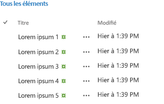

# Utiliser le widget expérimental d'affichage de liste de bureau dans les compléments pour SharePoint
Découvrez comment utiliser le widget d'affichage de liste de bureau sur n'importe quelle page web, même si celle-ci n'est pas hébergée par SharePoint. Employez le widget d'affichage de liste dans vos compléments pour afficher des données dans des listes hébergées par un site SharePoint.
> **REMARQUE**
> Les Office Web Widgets - Expérimental ne sont fournis qu'à des fins de recherche et de commentaires de la part des utilisateurs. Ne les employez pas en phase de production. Le comportement des Office Web Widgets peut changer considérablement dans les prochaines versions. Lisez les  [Termes du contrat de licence Office Web Widgets - Expérimental](office-web-widgetsexperimental-license-terms.md). 


Comme le widget d'affichage de liste standard, le widget d'affichage de liste vous permet d'afficher les données dans une liste SharePoint. Il n'est en outre pas limité aux compléments et sites web hébergés par SharePoint.
**Figure 1. Widget d'affichage de liste de bureau affichant des données dans une liste**





## Introduction

Vous pouvez spécifier l'affichage à utiliser pour afficher les données dans la liste SharePoint. Le widget d'affichage de liste affiche les colonnes et les éléments dans l'ordre spécifié par l'affichage.


Le widget d'affichage de liste utilise la bibliothèque inter-domaines pour obtenir les données de la liste. Pour cette raison, la communication s'effectue au niveau du client.


> **ATTENTION**
> Le widget d'affichage de liste de bureau n'active pas tous les scénarios de l'affichage de liste natif. 


Les scénarios suivants n'ont pas été activés dans la version actuelle du widget :


- Utilisation du widget dans des schémas d'authentification non pris en charge nativement par la bibliothèque inter-domaines.


- Utilisation du widget avec des sources de données autres que des listes ou des bibliothèques SharePoint.


- Liaison des données du widget.


- Affichages utilisateur tactiles.


- Édition utilisateur incorporée.


- Affichage des informations de présence.


- Fourniture de modèles de rendu personnalisés.


- Scénarios locaux. Pour le moment, le widget ne fonctionne qu'avec SharePoint Online.


## Conditions requises pour utiliser les exemples de cet article

Pour suivre les exemples de cet article, vous avez besoin des éléments suivants :


- Visual Studio 2013


- Le Gestionnaire de package NuGet. Pour plus d'informations, voir la page relative à l' [installation de NuGet](http://go.microsoft.com/fwlink/?LinkId=271465).


- Un environnement de développement SharePoint 2013 (isolation d'application nécessaire pour les scénarios locaux). 


- Le package NuGet Office Web Widgets - Expérimental. Pour plus d'informations sur la façon d'installer un package NuGet, voir la page web relative à la  [gestion des packages NuGet à l'aide de la boîte de dialogue](http://docs.nuget.org/docs/start-here/managing-nuget-packages-using-the-dialog). Vous pouvez aussi parcourir cette  [page NuGet gallery](http://www.nuget.org/packages/Microsoft.Office.WebWidgets.Experimental/).


## Utiliser le widget d'affichage de liste de bureau dans un Complément SharePoint hébergé par un fournisseur

Dans cet exemple, il existe une page simple hébergée à l'extérieur de SharePoint qui déclare un widget d'affichage de liste de bureau.


Pour utiliser le widget d'affichage de liste, vous devez effectuer les opérations suivantes :


- Créer un Complément SharePoint et des projets web.


- Créer une liste dans le site web de complément. Cette étape garantit également qu'un site web de complément est créé lorsque les utilisateurs déploient le complément.

    > **REMARQUE**
    > La bibliothèque inter-domaines nécessite l'existence d'un site web de complément. Le widget d'affichage de liste communique avec SharePoint à l'aide de la bibliothèque inter-domaines. 
- Créer une page de complément déclarant une instance de widget d'affichage de liste à l'aide du code HTML.


### Création d'un Complément SharePoint et de projets web


1. Ouvrez Visual Studio 2013 en tant qu'administrateur. Pour ce faire, cliquez sur l'icône Visual Studio 2013 dans le menu **Démarrer** et sélectionnez **Exécuter en tant qu'administrateur**.


2. Créez un projet en utilisant le modèle **Complément SharePoint 2013**. Le modèle Complément SharePoint 2013 se trouve sous **Modèles**> **Visual C#**, **Office/SharePoint**> **Compléments**.


3. Indiquez l'URL du site web SharePoint à utiliser pour le débogage.


4. Sélectionnez **Hébergement par le fournisseur** comme option d'hébergement pour votre complément.

    > **REMARQUE**
      > Vous pouvez également utiliser le widget d'affichage de liste de bureau avec d'autres options d'hébergement ou même avec des compléments Office ou votre propre site web. 
5. Sélectionnez **Application Web Forms ASP.NET** comme type de projet d'application web.


6. Sélectionnez **Windows Azure Access Control Service** comme option d'authentification.


### Pour créer une liste sur le site web de complément


1. Choisissez le projet de Complément SharePoint dans l' **Explorateur de solutions**. Choisissez **Ajouter**> **Nouvel élément...**


2. Choisissez **Éléments Visual C#**> **Office/SharePoint**> **Liste**. Saisissez **Annonces** dans la zone de texte **Nom**. Choisissez **Ajouter**.


3. Choisissez **Créer une instance de liste basée sur un modèle de liste existant**. Choisissez le modèle **Annonces**. Choisissez **Terminer**.


### Pour ajouter une nouvelle page qui utilise le widget d'affichage de liste de bureau


1. Choisissez le dossier **Pages** dans le projet web dans l' **Explorateur de solutions**.


2. Copiez le code ci-dessous et collez-le dans un fichier **ASPX** du projet. Le code effectue les tâches suivantes :

  - Ajoute des références aux ressources et aux bibliothèques Office requises.


  - Fournit un espace réservé pour le widget d'affichage de liste.


  - Initialise le runtime des contrôles.


  - Exécute la méthode **renderAll** du runtime des contrôles Office.


 ```

<!DOCTYPE html>
<html>
<head>
    <!-- IE9 or superior -->
    <meta http-equiv="x-ua-compatible" content="IE=10">
    <title>Desktop List View HTML Markup</title>

    <!-- Controls Specific CSS File -->
    <link rel="stylesheet" type="text/css" href="/Scripts/Office.Controls.css" />

    <!-- Ajax, jQuery, and utils -->
    <script 
        src=" https://ajax.aspnetcdn.com/ajax/4.0/1/MicrosoftAjax.js.js">
    </script>
    <script 
        src=" https://ajax.aspnetcdn.com/ajax/jQuery/jquery-1.9.1.min.js">
    </script>
    <script type="text/javascript">

        // Function to retrieve a query string value.
        // For production purposes you may want to use
        //  a library to handle the query string.
        function getQueryStringParameter(paramToRetrieve) {
            var params =
                document.URL.split("?")[1].split("&amp;");
            var strParams = "";
            for (var i = 0; i < params.length; i = i + 1) {
                var singleParam = params[i].split("=");
                if (singleParam[0] == paramToRetrieve)
                    return singleParam[1];
            }
        }
    </script>

    <!-- Cross-Domain Library and Office controls runtime -->
    <script type="text/javascript">
        //Register namespace and variables used through the sample
        Type.registerNamespace("Office.Samples.ListViewBasic");
        //Retrieve context tokens from the querystring
        Office.Samples.ListViewBasic.appWebUrl =
            decodeURIComponent(getQueryStringParameter("SPAppWebUrl"));
        Office.Samples.ListViewBasic.hostWebUrl =
            decodeURIComponent(getQueryStringParameter("SPHostUrl"));
        Office.Samples.ListViewBasic.ctag =
            decodeURIComponent(getQueryStringParameter("SPClientTag"));

        //Pattern to dynamically load JSOM and the cross-domain library
        var scriptbase =
            Office.Samples.ListViewBasic.hostWebUrl + "/_layouts/15/";

        //Get the cross-domain library
        $.getScript(scriptbase + "SP.RequestExecutor.js", 
            //Get the Office controls runtime and 
            //  continue to the createControl function
            function () {
                $.getScript("../Scripts/Office.Controls.js", createControl);
            }
        );
    </script>

    <!-- List View -->
    <script 
        src="../Scripts/Office.Controls.ListView.debug.js" 
        type="text/javascript">
    </script>

    <!-- SharePoint CSS -->
    <script type="text/javascript">
        document.addEventListener("DOMContentLoaded", function () {
            // The resource files are in a URL in the form:
            // web_url/_layouts/15/Resource.ashx
            var scriptbase =
                Office.Samples.ListViewBasic.appWebUrl + "/_layouts/15/";

            // Dynamically create the invisible iframe.
            var blankiframe;
            var blankurl;
            var body;
            blankurl =
                Office.Samples.ListViewBasic.appWebUrl + "/Pages/blank.html";
            blankiframe = document.createElement("iframe");
            blankiframe.setAttribute("src", blankurl);
            blankiframe.setAttribute("style", "display: none");
            body = document.getElementsByTagName("body");
            body[0].appendChild(blankiframe);

            // Dynamically create the link element.
            var dclink;
            var head;
            dclink = document.createElement("link");
            dclink.setAttribute("rel", "stylesheet");
            dclink.setAttribute("href",
                                scriptbase +
                                "defaultcss.ashx?ctag=" +
                                Office.Samples.ListViewBasic.ctag
                                );
            head = document.getElementsByTagName("head");
            head[0].appendChild(dclink);
        }, false);
    </script>
</head>
<body>
    Basic List View sample (HTML markup declaration):
    <div id="ListViewDiv"
         data-office-control="Office.Controls.ListView"
         data-office-options='{"listUrl" : getListUrl()}'>
    </div>

    <script type="text/javascript">
        function createControl() {
            //Initialize Controls Runtime
            Office.Controls.Runtime.initialize({
                sharePointHostUrl: Office.Samples.ListViewBasic.hostWebUrl,
                appWebUrl: Office.Samples.ListViewBasic.appWebUrl
            });

            //Render the widget, this must be executed after the
            //placeholder DOM is loaded
            Office.Controls.Runtime.renderAll();
        }

        function getListUrl() {
            return Office.Samples.ListViewBasic.appWebUrl +
                    "/_api/web/lists/getbytitle('Announcements')";
        }
    </script>
</body>
</html>
 ```


> **REMARQUE**
> L'exemple de code ci-dessus spécifie explicitement les URL de site web hôte et de complément pour initialiser le runtime des contrôles Office. Toutefois, si les URL de site web hôte et de complément sont précisées respectivement dans les paramètres de chaîne de requête **SPAppWebUrl** et **SPHostUrl**, vous pouvez transmettre un objet vide et le code tentera d'obtenir les paramètres automatiquement. Les paramètres **SPAppWebUrl** et **SPHostUrl** sont inclus dans la chaîne de requête lorsque vous utilisez le jeton **{StandardTokens}**.


L'exemple suivant montre comment transmettre un objet vide à la méthode d'initialisation :


```

// Initialize with an empty object and the code
// will attempt to get the tokens from the
// query string directly.
Office.Controls.Runtime.initialize({});
```


### Pour générer et exécuter la solution


1. Appuyez sur la touche F5.

    > **REMARQUE**
      > Lorsque vous appuyez sur F5, Visual Studio génère la solution, déploie le complément et ouvre la page des autorisations pour le complément. 
2. Sélectionnez le bouton **Approuver**.


3. Choisissez l'icône de complément de la page **Contenu du site**.


Vous pouvez également télécharger cet exemple à partir de la bibliothèque de code. Voir l'exemple de code relatif à l' [utilisation du widget expérimental d'affichage de liste de bureau dans un complément](http://code.msdn.microsoft.com/SharePoint-2013-Use-the-c3edb076).


## 

Cet article montre comment utiliser le widget d'affichage de liste de bureau dans votre complément à l'aide de code HTML. Vous pouvez également explorer les scénarios et détails suivants concernant le widget.


### Utiliser JavaScript pour déclarer le widget d'affichage de liste de bureau

Selon vos préférences, vous pouvez utiliser du code JavaScript au lieu de code HTML pour déclarer le widget. Dans ce cas, vous pouvez employer le balisage suivant en tant qu'espace réservé pour le widget.


```HTML

<div id="ListViewDiv"></div>
```

Utilisez le code JavaScript suivant pour instancier l'affichage de liste.


```
new Office.Controls.ListView(
    document.getElementById("ListViewDiv"), {
        listUrl: Office.Samples.ListViewBasic.appWebUrl + "/_api/web/lists/getbytitle('Announcements')"
    });
```

Pour obtenir un exemple qui montre comment effectuer les tâches, voir la page **JSSimple.html** de l'exemple de code relatif à l' [utilisation du widget expérimental d'affichage de liste de bureau dans un complément](http://code.msdn.microsoft.com/SharePoint-2013-Use-the-c3edb076).


### Spécifier l'affichage de présentation des données

Vous pouvez spécifier un affichage existant dans votre liste SharePoint, le widget d'affichage de liste présente les données en utilisant la spécification d'affichage.


Si vous utilisez du code HTML pour déclarer le widget, vous pouvez utiliser la syntaxe suivante pour spécifier un affichage.


```

<div id="ListViewDiv"
        data-office-control="Office.Controls.ListView"
        data-office-options="{listUrl: 'list URL',
                            viewID: 'GUID'
                            }">
</div> 

```

Si vous déclarez le widget avec du code JavaScript, utilisez la syntaxe suivante pour spécifier un affichage.


```

new Office.Controls.ListView(
    document.getElementById("ListViewDiv"), {
        listUrl: "list URL",
        viewID: "GUID"
    });
```


## Conclusion

Vous pouvez utiliser le widget expérimental d'affichage de liste de bureau pour afficher des données dans des listes SharePoint. Le widget affiche les données en mode lecture seule. Saisissez vos idées et commentaires éventuels sur le  [site Office Developer Platform UserVoice](http://officespdev.uservoice.com/).


## Ressources supplémentaires
<a name="bk_addresources"> </a>


-  [Vue d'ensemble d'Office Web Widgets - Expérimental](office-web-widgetsexperimental-overview.md)


-  [Termes du contrat de licence Office Web Widgets - Expérimental](office-web-widgetsexperimental-license-terms.md)


-  [Page NuGet gallery sur Office Web Widgets - Expérimental](http://www.nuget.org/packages/Microsoft.Office.WebWidgets.Experimental/)


-  [Exemple de code relatif à l'utilisation du widget expérimental d'affichage de liste de bureau dans un complément](http://code.msdn.microsoft.com/SharePoint-2013-Use-the-c3edb076)


-  [Utiliser le widget expérimental d'affichage de liste de bureau dans les compléments pour SharePoint](use-the-experimental-desktop-list-view-widget-in-sharepoint-add-ins.md)


