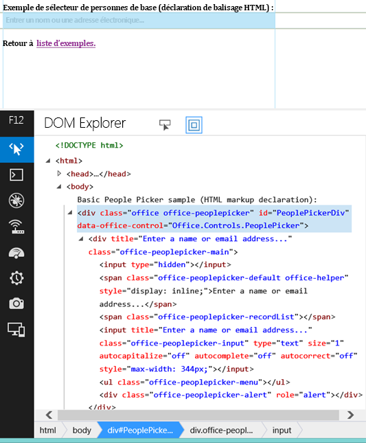

# Utiliser le widget expérimental Sélecteur de personnes dans les compléments pour SharePoint
Découvrez comment utiliser le widget Sélecteur de personnes sur n'importe quelle page web, même si celle-ci n'est pas hébergée sur SharePoint. Utilisez le widget Sélecteur de personnes dans vos compléments pour aider les utilisateurs à trouver et à sélectionner des personnes et des groupes.
> **ATTENTION**
> Les Office Web Widgets - Expérimental ne sont fournis qu'à des fins de recherche et de commentaires de la part des utilisateurs. Ne les employez pas en phase de production. Le comportement des Office Web Widgets peut changer considérablement dans les prochaines versions. Lisez les  [Termes du contrat de licence Office Web Widgets - Expérimental](office-web-widgetsexperimental-license-terms.md). 
  
    
    

Vous pouvez utiliser le widget Sélecteur de personnes expérimental dans les compléments pour faciliter la recherche et la sélection de personnes et de groupes sur un client. Les utilisateurs commencent la saisie dans la zone de texte et le widget récupère les personnes dont le nom ou l'adresse de messagerie correspond au texte entré.
**Figure 1. Widget Sélecteur de personnes résolvant une requête**

  
    
    

  
    
    

  
    
    

  
    
    

  
    
    
Votre complément peut accéder aux personnes sélectionnées en lisant la propriété **selectedItems** du widget. Cette propriété est un tableau d'objets représentant des personnes ou des groupes. Le tableau suivant présente les propriétés disponibles de l'objet utilisateur.

|**Propriété**|**Description**|
|:-----|:-----|
|**department** <br/> |Représente le service de l'utilisateur ou du groupe.  <br/> |
|**displayName** <br/> |Représente le nom complet de l'utilisateur ou du groupe.  <br/> |
|**email** <br/> |Représente l'adresse de messagerie de l'utilisateur ou du groupe.  <br/> |
|**isResolved** <br/> |Indique si le widget a réussi à résoudre le texte du widget avec un utilisateur ou un groupe du client.  <br/> |
|**jobTitle** <br/> |Représente la fonction de l'utilisateur.  <br/> |
|**loginName** <br/> |Représente le nom de connexion de l'utilisateur ou du groupe.  <br/> |
|**mobile** <br/> |Représente le numéro de téléphone mobile de l'utilisateur ou du groupe.  <br/> |
|**principalId** <br/> |Représente l'ID de principal de l'utilisateur ou du groupe.  <br/> |
|**principalType** <br/> |Indique si l'élément est un utilisateur ou un groupe. La valeur est 1 dans le cas d'un utilisateur, 4 dans le cas d'un groupe.  <br/> |
|**sipAddress** <br/> |Représente l'adresse SIP de l'utilisateur ou du groupe.  <br/> |
|**text** <br/> |Représente le titre du texte du nom de l'utilisateur ou du groupe.  <br/> |
   
Le widget Sélecteur de personnes dispose d'un cache des entrées les plus récemment utilisées. Le cache stocke les cinq dernières entrées résolues par le widget.
## Conditions requises pour utiliser les exemples de cet article

Pour utiliser les exemples de cet article, vous avez besoin des éléments suivants :
  
    
    

- Visual Studio 2013.
    
  
- Le Gestionnaire de package NuGet. Pour plus d'informations, voir la page relative à l' [installation de NuGet](http://go.microsoft.com/fwlink/?LinkId=271465).
    
  
- Un environnement de développement SharePoint 2013 (isolation d'application nécessaire pour les scénarios locaux).
    
  
- Le package NuGet Office Web Widgets - Expérimental. Pour plus d'informations sur la façon d'installer un package NuGet, voir la page web relative à la  [gestion des packages NuGet à l'aide de la boîte de dialogue](http://docs.nuget.org/docs/start-here/managing-nuget-packages-using-the-dialog). Vous pouvez aussi parcourir cette  [page NuGet gallery](http://www.nuget.org/packages/Microsoft.Office.WebWidgets.Experimental/).
    
  

## Utilisation du widget Sélecteur de personnes dans un Complément SharePoint hébergé par un fournisseur

Dans cet exemple, il existe une page simple hébergée à l'extérieur de SharePoint qui déclare un widget Sélecteur de personnes avec du code. Dans un souci de simplicité, cet exemple ne déclare pas d'option, mais vous pouvez voir un exemple avec des options dans la section  [Étapes suivantes](use-the-experimental-people-picker-widget-in-sharepoint-add-ins.md#NextSteps).
  
    
    
Pour utiliser le widget Sélecteur de personnes, vous devez effectuer les opérations suivantes :
  
    
    

- Créer un Complément SharePoint et des projets web.
    
  
- Créer un module dans le site web de complément. Cette étape garantit qu'un site web de complément est créé lorsque les utilisateurs déploient le complément.
    
    > **REMARQUE**
      > La bibliothèque inter-domaines nécessite l'existence d'un site web de complément. Le widget Sélecteur de personnes communique avec SharePoint à l'aide de la bibliothèque inter-domaines. 
- Créer une page de complément déclarant une instance de widget Sélecteur de personnes à l'aide de code.
    
  

### Création d'un Complément SharePoint et de projets web


1. Ouvrez Visual Studio 2013 en tant qu'administrateur. Pour ce faire, cliquez sur l'icône Visual Studio 2013 dans le menu **Démarrer** et sélectionnez **Exécuter en tant qu'administrateur**.
    
  
2. Créez un projet en utilisant le modèle Complément SharePoint 2013. Le modèle **Complément SharePoint 2013** se trouve sous **Modèles**> **Visual C#**, **Office/SharePoint**> **Compléments**.
    
  
3. Indiquez l'URL du site web SharePoint à utiliser pour le débogage.
    
  
4. Sélectionnez **Hébergement par le fournisseur** comme option d'hébergement pour votre complément.
    
    > **REMARQUE**
      > Vous pouvez également utiliser le widget Sélecteur de personnes avec d'autres options d'hébergement ou même avec des compléments Office ou votre propre site web. 
5. Sélectionnez **Application Web Forms ASP.NET** comme type de projet d'application web.
    
  
6. Sélectionnez **Windows Azure Access Control Service** comme option d'authentification.
    
  

### Pour créer un module sur le site web de complément


1. Choisissez le projet de Complément SharePoint dans l' **Explorateur de solutions**. Choisissez **Ajouter**> **Nouvel élément...**
    
  
2. Choisissez **Éléments Visual C#**> **Office/SharePoint**> **Module**. Donnez un nom à votre module.
    
    > **REMARQUE**
      > Si vous créez une Application hébergée par SharePoint, vous n'avez pas besoin de créer de module supplémentaire. 

### Pour ajouter une nouvelle page utilisant le widget Sélecteur de personnes


1. Choisissez le dossier **Pages** dans le projet web dans l' **Explorateur de solutions**.
    
  
2. Copiez le code ci-dessous et collez-le dans un fichier **ASPX** du projet. Le code effectue les tâches suivantes :
    
  - Ajoute des références aux ressources et aux bibliothèques Office requises.
    
  
  - Initialise le runtime des contrôles.
    
  
  - Exécute la méthode **renderAll** du runtime des contrôles Office.
    
  
  - Déclare un espace réservé pour le widget Sélecteur de personnes.
    
  

  ```
  
<!DOCTYPE html>
<html>
<head>
    <!-- IE9 or superior -->
    <meta http-equiv="X-UA-Compatible" content="IE=9" >
    <title>People Picker HTML Markup</title>

    <!-- Widgets Specific CSS File -->
    <link 
        rel="stylesheet" 
        type="text/css" 
        href="../Scripts/Office.Controls.css" 
    />

    <!-- Ajax, jQuery, and utils --> 
    <script 
        src=" https://ajax.aspnetcdn.com/ajax/4.0/1/MicrosoftAjax.js.js">
    </script>
    <script 
        src=" https://ajax.aspnetcdn.com/ajax/jQuery/jquery-1.9.1.min.js">
    </script>
    <script type="text/javascript">
        // Function to retrieve a query string value.
        // For production purposes you may want to use
        //  a library to handle the query string.
        function getQueryStringParameter(paramToRetrieve) {
            var params =
                document.URL.split("?")[1].split("&amp;");
            var strParams = "";
            for (var i = 0; i < params.length; i = i + 1) {
                var singleParam = params[i].split("=");
                if (singleParam[0] == paramToRetrieve)
                    return singleParam[1];
            }
        }
    </script>

    <!-- Cross-Domain Library and Office controls runtime -->
    <script type="text/javascript">
        //Register namespace and variables used through the sample
        Type.registerNamespace("Office.Samples.PeoplePickerBasic");
        //Retrieve context tokens from the querystring
        Office.Samples.PeoplePickerBasic.appWebUrl =
            decodeURIComponent(getQueryStringParameter("SPAppWebUrl"));
        Office.Samples.PeoplePickerBasic.hostWebUrl =
            decodeURIComponent(getQueryStringParameter("SPHostUrl"));

        //Pattern to dynamically load JSOM and and the cross-domain library
        var scriptbase =
            Office.Samples.PeoplePickerBasic.hostWebUrl + "/_layouts/15/";

        //Get the cross-domain library
        $.getScript(scriptbase + "SP.RequestExecutor.js",
            //Get the Office controls runtime and 
            //  continue to the createControl function
            function () {
                $.getScript("../Scripts/Office.Controls.js", createControl)
            }
        );
    </script>

    <!--People Picker -->
    <script 
        src="../Scripts/Office.Controls.PeoplePicker.js" 
        type="text/javascript">
    </script>
</head>
<body>
Basic People Picker sample (HTML markup declaration):
<div 
        id="PeoplePickerDiv" 
        data-office-control="Office.Controls.PeoplePicker">
</div>

<script type="text/javascript">
    function createControl() {
        //Initialize Controls Runtime
        Office.Controls.Runtime.initialize({
            sharePointHostUrl: Office.Samples.PeoplePickerBasic.hostWebUrl,
            appWebUrl: Office.Samples.PeoplePickerBasic.appWebUrl
        });

        //Render the widget, this must be executed after the
        //placeholder DOM is loaded
        Office.Controls.Runtime.renderAll();
    }
</script>
</body>
</html>

  ```


> **REMARQUE**
> L'exemple de code ci-dessus spécifie explicitement les URL de site web hôte et de complément pour initialiser le runtime des contrôles Office. Toutefois, si les URL de site web de complément et hôte sont précisées respectivement dans les paramètres de chaîne de requête **SPAppWebUrl** et **SPHostUrl**, vous pouvez transmettre un objet vide et le code tentera d'obtenir les paramètres automatiquement. Les paramètres **SPAppWebUrl** et **SPHostUrl** sont inclus dans la chaîne de requête lorsque vous utilisez le jeton **{StandardTokens}**.
  
    
    

L'exemple suivant montre comment transmettre un objet vide à la méthode d'initialisation :
  
    
    


```

// Initialize with an empty object and the code
// will attempt to get the tokens from the
// query string directly.
Office.Controls.Runtime.initialize({});
```


### Pour générer et exécuter la solution


1. Appuyez sur la touche F5.
    
    > **REMARQUE**
      > Lorsque vous appuyez sur F5, Visual Studio génère la solution, déploie le complément et ouvre la page des autorisations pour le complément. 
2. Sélectionnez le bouton **Approuver**.
    
  
3. Choisissez l'icône de complément de la page de **Contenu du site**.
    
  
Vous pouvez également télécharger cet exemple à partir de la bibliothèque de code. Voir l'exemple de code relatif à l' [utilisation du widget expérimental Sélecteur de personnes dans un complément](http://code.msdn.microsoft.com/SharePoint-2013-Use-the-57859f85). 
  
    
    

## 
<a name="NextSteps"> </a>

Cet article montre comment utiliser le widget Sélecteur de personnes dans votre complément à l'aide de code HTML. Vous pouvez également explorer les scénarios et détails suivants concernant le widget.
  
    
    

### Utiliser JavaScript pour déclarer le widget Sélecteur de personnes

Selon vos préférences, vous pouvez utiliser du code JavaScript au lieu de code HTML pour déclarer le widget. Dans ce cas, vous pouvez employer le balisage suivant en tant qu'espace réservé pour le widget.
  
    
    

```HTML

<div id="PeoplePickerDiv"></div>
```

Utilisez le code JavaScript suivant pour instancier le sélecteur de personnes.
  
    
    


```
new Office.Controls.PeoplePicker(
    document.getElementById("PeoplePickerDiv"), {});
```

Pour obtenir un exemple de code qui montre comment effectuer les tâches, voir la page **JSSimple.html** de l'exemple de code relatif à l' [utilisation du widget expérimental Sélecteur de personnes dans un complément](http://code.msdn.microsoft.com/SharePoint-2013-Use-the-57859f85).
  
    
    

### Spécifier des options pour le widget

Vous pouvez spécifier des options pour le widget en utilisant l'attribut **data-office-options** dans la déclaration de widget. Le code HTML suivant montre comment spécifier des options pour le widget Sélecteur de personnes.
  
    
    

```HTML

<div id="PeoplePickerDiv"
        data-office-control="Office.Controls.PeoplePicker"
        data-office-options='{
        "allowMultipleSelections" : true,
        "onChange" : handleChange,
        "placeholder" : "Check the count message, it changes when you add names..."
    }'>
</div>
```

Le code suivant montre comment spécifier des options lorsque vous déclarez le widget Sélecteur de personnes avec du code JavaScript.
  
    
    


```

new Office.Controls.PeoplePicker(
    document.getElementById("PeoplePickerDiv"), {
        allowMultipleSelections: true,
        placeholder: "Check the count message, it changes when you add names...",
        onChange: function (ctrl) {
            document.getElementById("count").textContent = 
ctrl.selectedItems.length.toString();
        }
    });
```

Vous pouvez également spécifier des gestionnaires d'événements pour les événements **onChange**, **onAdded** et **onRemoved**. Dans le code ci-dessus, notez que le gestionnaire d'événements pour l'événement onChange reçoit un seul paramètre **ctrl**, qui est une référence au widget.
  
    
    
Pour un exemple de la façon de spécifier des options, voir les pages **MarkupOptions.html** et **JSOptions.html** dans l'exemple de code relatif à l' [utilisation du widget expérimental Sélecteur de personnes dans un complément](http://code.msdn.microsoft.com/SharePoint-2013-Use-the-57859f85).
  
    
    

### Récupérer les personnes ou groupes sélectionnés dans le widget

Pour récupérer les personnes dans le widget, vous devez effectuer les tâches suivantes :
  
    
    

- Obtenir une référence au widget.
    
  
- Accéder à la propriété **selectedItems** du widget.
    
  
Vous pouvez obtenir une référence au widget à l'aide de la syntaxe suivante.
  
    
    


```

var pplPicker = document.getElementById("PeoplePickerDiv")._officeControl;
```

Vous pouvez également enregistrer une référence lorsque vous instanciez le widget.
  
    
    


```
var pplPicker = new Office.Controls.PeoplePicker(
                        document.getElementById("PeoplePickerDiv"), {});
```

La propriété **selectedItems** est un tableau d'objets représentant des personnes ou des groupes. Les personnes ou les groupes du tableau selectedItems peuvent être résolus ou non, ce que vous pouvez vérifier avec la propriété **isResolved**. L'exemple suivant montre comment accéder à l'élément *i*  dans le tableau et utiliser le nom de la personne ou du groupe.
  
    
    


```

var principal = pplPicker.selectedItems[i];
$("#msg").text(principal.text + " is selected in the control.");
```

Pour un exemple de la façon de récupérer les personnes ou groupes sélectionnés à partir du widget, voir la page **demo.html** de l'exemple de code de [démonstration Office Web Widgets - Expérimental](http://code.msdn.microsoft.com/SharePoint-2013-Office-Web-6d44aa9e).
  
    
    

### Personnaliser le style du widget

En tant que développeur, vous souhaiterez peut-être personnaliser l'apparence du widget. L'image suivante montre la hiérarchie HTML dans le widget après affichage.
  
    
    

**Figure 2. Hiérarchie HTML dans le widget Sélecteur de personnes**

  
    
    

  
    
    

  
    
    
Le widget définit plusieurs classes portant le préfixe **office-peoplepicker**, que vous pouvez trouver et personnaliser dans la feuille de style **Office.Controls.css**.
  
    
    

## Conclusion
<a name="NextSteps"> </a>

Vous pouvez utiliser le widget expérimental Sélecteur de personnes pour sélectionner des personnes et des groupes sur votre client. Votre complément peut alors utiliser les principaux choisis par vos utilisateurs. Saisissez vos idées et commentaires éventuels sur le  [site Office Developer Platform UserVoice](http://officespdev.uservoice.com/).
  
    
    

## Ressources supplémentaires
<a name="bk_addresources"> </a>


-  [Vue d'ensemble d'Office Web Widgets - Expérimental](office-web-widgetsexperimental-overview.md)
    
  
-  [Termes du contrat de licence Office Web Widgets - Expérimental](office-web-widgetsexperimental-license-terms.md)
    
  
-  [Page NuGet gallery sur Office Web Widgets - Expérimental](http://www.nuget.org/packages/Microsoft.Office.WebWidgets.Experimental/)
    
  
-  [Exemple de code relatif à l'utilisation du widget expérimental Sélecteur de personnes dans un complément](http://code.msdn.microsoft.com/SharePoint-2013-Use-the-57859f85).
    
  
-  [Utiliser le widget expérimental d'affichage de liste de bureau dans les compléments pour SharePoint](use-the-experimental-desktop-list-view-widget-in-sharepoint-add-ins.md) .
    
  

