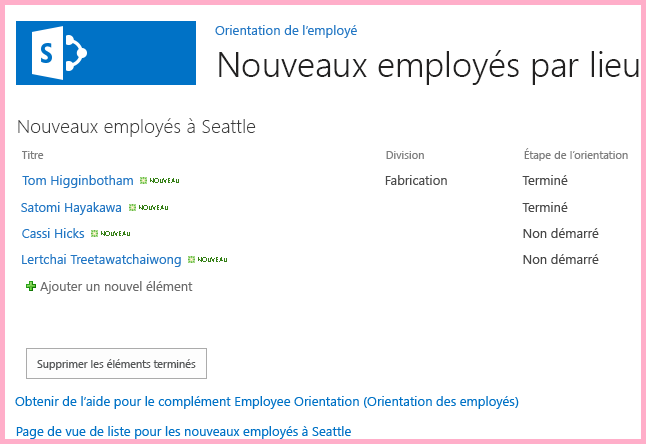
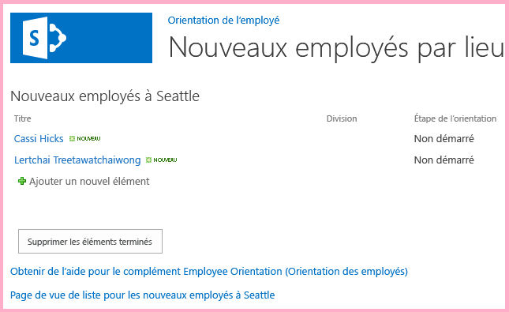

# Utilisation des API JavaScript SharePoint pour exploiter les données SharePoint
Utilisez le modèle objet JavaScript SharePoint pour exploiter les données SharePoint à partir de JavaScript sur les pages du site web de complément.
Cet article est le dixième d'une série sur les concepts de base du développement de Compléments SharePoint hébergés par SharePoint. Vous devez tout d'abord avoir pris connaissance de  [Compléments](sharepoint-add-ins.md) et des articles précédents de la série :


-  [Commencer à créer des compléments SharePoint hébergés par SharePoint](get-started-creating-sharepoint-hosted-sharepoint-add-ins.md)


-  [Déployer et installer un complément hébergé par SharePoint pour SharePoint](deploy-and-install-a-sharepoint-hosted-sharepoint-add-in.md)


-  [Ajouter des colonnes personnalisées à un complément hébergé par SharePoint pour SharePoint](add-custom-columns-to-a-sharepoint-hostedsharepoint-add-in.md)


-  [Ajouter un type de contenu personnalisé à un complément hébergé par SharePoint pour SharePoint](add-a-custom-content-type-to-a-sharepoint-hostedsharepoint-add-in.md)


-  [Ajouter un composant WebPart à une page dans un complément hébergé par SharePoint pour SharePoint](add-a-web-part-to-a-page-in-a-sharepoint-hosted-sharepoint-add-in.md)


-  [Ajouter un flux de travail à un complément hébergé par SharePoint pour SharePoint](add-a-workflow-to-a-sharepoint-hosted-sharepoint-add-in.md)


-  [Ajouter une page et un style personnalisés à un complément hébergé par SharePoint pour SharePoint](add-a-custom-page-and-style-to-a-sharepoint-hosted-sharepoint-add-in.md)


-  [ Ajout de rendu côté client personnalisé à un complément SharePoint hébergé par SharePoint](add-custom-client-side-rendering-to-a-sharepoint-hosted-sharepoint-add-in.md)


-  [ Création d'un bouton de ruban personnalisé dans le site web hôte d'un complément SharePoint](create-a-custom-ribbon-button-in-the-host-web-of-a-sharepoint-add-in.md)


> **REMARQUE**
> Si vous avez suivi cette série sur les compléments hébergés par SharePoint, vous disposez d'une solution Visual Studio que vous pouvez continuer à utiliser avec cette rubrique. Vous pouvez également télécharger le référentiel à l'adresse  [SharePoint_SP-hosted_Add-Ins_Tutorials](https://github.com/OfficeDev/SharePoint_SP-hosted_Add-Ins_Tutorials) et ouvrir le fichier BeforeJSOM.sln.


Même si les Compléments SharePoint hébergés par SharePoint ne peuvent pas avoir de code côté serveur, vous pouvez toujours disposer d'interactions d'exécution et de logique métier avec des composants SharePoint dans un Complément SharePoint hébergé par SharePoint à l'aide de JavaScript et de la bibliothèque SharePoint de modèle objet client JavaScript. (Nous appellerons ce dernier JSOM. Notez qu'il s'agit bien d'un « M » à la fin et qu'il ne faut pas confondre ce terme avec JSO **N** [JavaScript Object Notation].) Dans cet article, vous allez utiliser le modèle objet JavaScript pour trouver et supprimer les anciens éléments de la liste **Nouveaux employés à Seattle**.
## Créer le JavaScript et un bouton pour appeler


1. Vérifiez que l'étape ci-dessous du premier didacticiel de cette série a été effectuée : 

    Ouvrez le fichier **/Pages/Default.aspx** depuis la racine du projet. Entre autres, ce fichier généré charge un des deux ou les deux scripts hébergés sur SharePoint : sp.runtime.js et sp.js. Le balisage pour le chargement de ces fichiers se trouve dans le contrôle **Content** situé en haut du fichier ayant l'ID **PlaceHolderAdditionalPageHead**. Le balisage varie selon la version des **Outils de développement Microsoft Office pour Visual Studio** que vous utilisez. Cette série de didacticiels exige que les deux fichiers soient chargés avec des balises **<script>** ordinaires dans le code HTML, et non des balises **<SharePoint:ScriptLink>**. Vérifiez que les lignes suivantes sont dans le contrôle **PlaceHolderAdditionalPageHead**,  *juste au-dessus*  de la ligne `<meta name="WebPartPageExpansion" content="full" />` :


 ```

<script type="text/javascript" src="/_layouts/15/sp.runtime.js"></script>
<script type="text/javascript" src="/_layouts/15/sp.js"></script> 

 ```


    Recherchez tout autre balisage dans le fichier, qui charge également l'un ou l'autre de ces fichiers, puis supprimez le balisage redondant. Enregistrez et fermez le fichier.


2. Dans le nœud **Scripts** de l' **Explorateur de solutions**, il est possible qu'il existe déjà un fichier Add-in.js. Si ce n'est pas le cas, mais que vous disposez d'un fichier App.js, cliquez avec le bouton droit sur App.js et renommez-le Add-in.js. S'il n'existe aucun de ces deux fichiers, créez-en un en suivant les étapes ci-dessous :

1. Cliquez avec le bouton droit sur le nœud **Scripts** et choisissez **Ajouter** > **Nouvel élément** > **Web**.


2. Choisissez **Fichier JavaScript** et nommez-leAdd-in.js.


3. Ouvrez le fichier Add-in.js et supprimez son contenu, le cas échéant.


4. Ajoutez les lignes suivantes au fichier. Notez ce qui suit à propos de ce code :

  - La ligne  `'use strict';` garantit que l'exécution de JavaScript dans le navigateur génère une exception si vous utilisez par inadvertance certaines pratiques incorrectes dans le code JavaScript.


  - La variable  `clientContext` contient un objet **SP.ClientContext** qui fait référence au site web SharePoint. L'ensemble du code JSOM commence par créer ou obtenir une référence à un objet de ce type.


  - La variable  `employeeList` comporte une référence à l'instance de liste **Nouveaux employés à Seattle**.


  - La variable  `completedItems` comporte les éléments de la liste que le script va supprimer : les éléments dont le champ **ÉtapeOrientation** est défini sur **Terminée**.


 ```

'use strict';

var clientContext = SP.ClientContext.get_current(); 
var employeeList = clientContext.get_web().get_lists().getByTitle('New Employees In Seattle'); 
var completedItems; 
 ```

5. Pour réduire les messages entre le navigateur client et le serveur SharePoint, le JSOM utilise un système de traitement par lots. Une seule fonction, **SP.ClientContext.executeQueryAsync**, envoie réellement des messages au serveur (et reçoit des réponses). Les appels aux API JSOM émis entre les appels de l'élément **executeQueryAsync** sont regroupés et envoyés au serveur dans un lot la prochaine fois que l'élément **executeQueryAsync** est appelé. Toutefois, il n'est généralement pas possible d'appeler une méthode d'un objet JSOM, sauf si l'objet a été transmis au client dans un appel précédent de l'élément **executeQueryAsync**. Votre script va appeler la méthode **SP.ListItem.deleteObject** de chaque élément terminé de la liste, il va donc réaliser deux appels auprès de l'élément **executeQueryAsync**: un pour obtenir une collection des éléments de liste terminés et un deuxième pour regrouper les appels de **deleteObject** et les envoyer au serveur pour exécution.

    Par conséquent, commencez par créer une méthode afin d'obtenir les éléments de liste auprès du serveur. Ajoutez le code suivant au fichier.


 ```

function purgeCompletedItems() {

   var camlQuery = new SP.CamlQuery(); 
   camlQuery.set_viewXml( 
         '<View><Query><Where><Eq>' + 
           '<FieldRef Name=\\'OrientationStage\\'/><Value Type=\\'Choice\\'>Completed</Value>' + 
         '</Eq></Where></Query></View>'); 
     completedItems = employeeList.getItems(camlQuery); 
}
 ```

6. Lorsque ces lignes sont envoyées au serveur et exécutées, elles créent une collection d'éléments de liste, mais le script doit transmettre cette collection au client. Cette opération est effectuée par un appel à la fonction **SP.ClientContext.load**. Ajoutez la ligne suivante à la fin de la méthode.

 ```

clientContext.load(completedItems);
 ```

7. Ajoutez un appel de l'élément **executeQueryAsync**. Cette méthode a deux paramètres, qui sont tous deux des fonctions de rappel. Le premier s'exécute si le serveur exécute toutes les commandes du lot. Le deuxième s'exécute si le serveur échoue pour une raison quelconque. Vous allez créer ces deux fonctions lors des étapes ultérieures. Ajoutez la ligne suivante à la fin de la méthode.

 ```
  clientContext.executeQueryAsync(deleteCompletedItems, onGetCompletedItemsFail);
 ```

8. Enfin, ajoutez la ligne suivante à la fin de la méthode. En renvoyant **false** au bouton ASP.NET qui appelle la fonction, nous annulons le comportement par défaut des boutons ASP.NET, qui consiste à recharger la page. Le rechargement de la page provoque un rechargement du fichier Add-in.js, qui à son tour réinitialise l'objet `clientContext`. Si ce rechargement est effectué entre le moment où l'élément **executeQueryAsync** envoie sa demande et celui où le serveur SharePoint renvoie la réponse, l'objet `clientContext` d'origine n'existe plus et ne peut pas traiter la réponse. La fonction est interrompue sans que les rappels d'échec ou de réussite soient exécutés. (Le comportement exact peut varier selon le navigateur.)

 ```
  return false;
 ```

9. Ajoutez la fonction suivante,  `deleteCompletedItems`, au fichier. Il s'agit de la fonction qui s'exécute si la fonction  `purgeCompletedItems` aboutit. Notez ce qui suit à propos de ce code :

  - La méthode **SP.ListItem.get_id** renvoie l'ID de l'élément de liste. Chaque élément du tableau est un objet **SP.ListItem**.


  - La méthode **SP.List.getItemById** renvoie l'objet **SP.ListItem** avec l'ID spécifié.


  - La méthode **SP.ListItem.deleteObject** marque l'élément de liste à supprimer du serveur lors de l'appel de l'élément **executeQueryAsync**.


  - Les éléments de liste doivent être copiés à partir de la collection qui est envoyée du serveur à un tableau avant d'être supprimés. Si le script a appelé la méthode **deleteObject** pour chaque élément directement dans la boucle **while**, le code JavaScript génère une erreur indiquant que la longueur de la collection est modifiée pendant l'énumération. Le message d'erreur n'est pas réellement vrai, car l'élément n'est pas vraiment supprimé jusqu'à ce que les appels **deleteObject** soient regroupés et envoyés au serveur. Toutefois, le JSOM est conçu pour simuler les exceptions qui se produisent sur le serveur (où le code ne doit pas modifier la taille d'une collection pendant l'énumération de celle-ci). Cependant, les tableaux ont une taille fixe, par conséquent, l'appel de l'élément **deleteObject** sur un élément d'un tableau supprime l'élément de la liste, mais ne modifie pas la taille du tableau.


 ```
  function deleteCompletedItems() {

    var itemArray = new Array();
    var listItemEnumerator = completedItems.getEnumerator();

    while (listItemEnumerator.moveNext()) {
        var item = listItemEnumerator.get_current();
        itemArray.push(item);
    }

    var i;
    for (i = 0; i < itemArray.length; i++) {
        employeeList.getItemById(itemArray[i].get_id()).deleteObject();
    }

    clientContext.executeQueryAsync(onDeleteCompletedItemsSuccess, onDeleteCompletedItemsFail);
}
 ```

10. Ajoutez la fonction suivante,  `onDeleteCompletedItemsSuccess`, au fichier. Il s'agit de la fonction qui s'exécute si les éléments terminés sont supprimés (ou si la liste ne comporte aucun élément terminé). La deuxième ligne,  `location.reload(true);`, entraîne le rechargement de la page à partir du serveur. Cette opération est pratique, car le composant WebPart de vue de liste de la page affiche les éléments terminés jusqu'à l'actualisation de la page. (Le fichier Add-in.js est rechargé également, mais cela n'entraîne aucun problème, car il le fait d'une manière qui n'interrompt pas de fonction JavaScript en cours d'exécution.)

 ```

function onDeleteCompletedItemsSuccess() {
    alert('Completed orientations have been deleted.');
    location.reload(true);
}
 ```

11. Ajoutez au fichier les deux fonctions suivantes de rappel en cas d'échec.

 ```

// Failure callbacks

function onGetCompletedItemsFail(sender, args) {
    alert('Unable to get completed items. Error:' + args.get_message() + '\\n' + args.get_stackTrace());
}

function onDeleteCompletedItemsFail(sender, args) {
    alert('Unable to delete completed items. Error:' + args.get_message() + '\\n' + args.get_stackTrace());
}
 ```

12. Ouvrez le fichier default.aspx et recherchez l'élément **asp:Content** avec l'ID **PlaceHolderMain**.


13. Ajoutez le balisage suivant entre l'élément **WebPartPages:WebPartZone** et le premier des deux éléments **asp:Hyperlink**. Notez que la valeur du gestionnaire **OnClientClick** est `return purgeCompletedItems()` au lieu de `purgeCompletedItems()`. L'élément  `false` renvoyé par la fonction indique à ASP.NET de ne pas recharger la page.

 ```HTML

<p><asp:Button runat="server" OnClientClick="return purgeCompletedItems()"
  ID="purgecompleteditemsbutton" Text="Purge Completed Items" /></p>
 ```

14. Régénérez le projet dans Visual Studio.


15. Pour limiter la nécessité de définir manuellement l' **étape d'orientation** des éléments de liste surTerminée lors du test du complément, ouvrez le fichier elements.xml pour l'instance de liste **NouveauxEmployésÀSeattle** (et pas le fichier elements.xml pour le modèle de liste **OrientationDesNouveauxEmployés**) et ajoutez le balisage  `<Field Name="OrientationStage">Completed</Field>` comme dernier enfant aux éléments **Row**.

    Voici un exemple de la façon dont l'élément **Rows** doit se présenter.


 ```

<Rows>
  <Row>
    <Field Name="Title">Tom Higginbotham</Field>
    <Field Name="Division">Manufacturing</Field>
    <Field Name="OrientationStage">Completed</Field>
  </Row>
  <Row>
    <Field Name="Title">Satomi Hayakawa</Field>
    <Field Name="OrientationStage">Completed</Field>
  </Row>
  <Row>
    <Field Name="Title">Cassi Hicks</Field>
  </Row>
  <Row>
    <Field Name="Title">Lertchai Treetawatchaiwong</Field>
  </Row>
</Rows>
 ```


## Exécuter et tester le complément


1. Activez les fenêtres contextuelles sur le navigateur utilisé par Visual Studio lors du débogage.


2. Utilisez la touche F5 pour déployer et exécuter votre complément. Visual Studio effectue une installation temporaire du complément sur votre site SharePoint de test et exécute immédiatement celui-ci.


3. La page d'accueil du complément s'ouvre et la liste comporte au moins un élément dont le champ **Étape d'orientation** est défini sur **Terminée**.

   **Liste avant la suppression des éléments terminés**





4. Lorsque la page d'accueil du complément est complètement chargée, choisissez le bouton **Supprimer les éléments terminés**. Si l'opération aboutit (en d'autres termes, si vous ne recevez aucun message d'échec), tous les éléments **terminés** ont été supprimés et un message contextuel vous indique **Les orientations terminées ont été supprimées**.


5. Fermez la fenêtre contextuelle afin que la page se recharge et que les éléments **terminés** n'apparaissent plus dans le composant WebPart de vue de liste.

   **Liste après la suppression des éléments terminés**





6. Pour mettre fin à la session de débogage, fermez la fenêtre du navigateur ou arrêtez le débogage dans Visual Studio. Chaque fois que vous appuyez sur F5, Visual Studio retire la version précédente du complément et installe la plus récente.


7. Vous allez travailler avec ce complément et la solution Visual Studio dans d'autres articles. Il est donc recommandé de retirer le complément une dernière fois lorsque vous avez terminé de travailler et n'allez pas le réutiliser pendant un moment. Cliquez avec le bouton droit de la souris sur le projet dans l' **Explorateur de solutions** et choisissez **Retirer**.


## 
<a name="Nextsteps"> </a>

Dans l'article suivant de cette série, vous allez ajouter du code JavaScript à une page du site web de complément qui fonctionne avec des données SharePoint sur le site web hôte :  [ Utilisation de données de site web hôte JavaScript dans le site web de complément](work-with-host-web-data-from-javascript-in-the-add-in-web.md).


