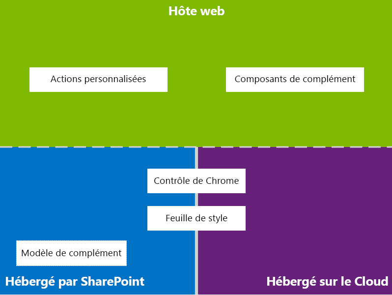
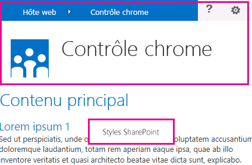
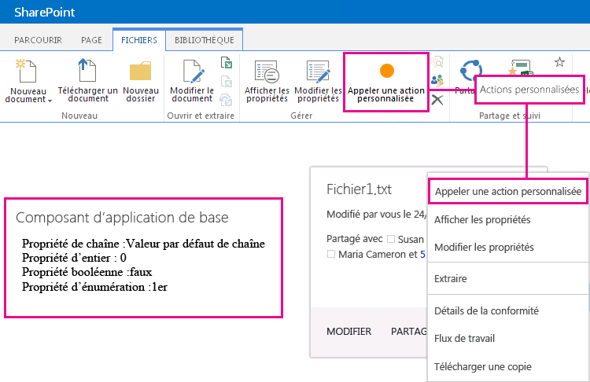

# Conception de l'expérience utilisateur pour les compléments dans SharePoint
Découvrez les options d'expérience utilisateur dont vous disposez lorsque vous créez des compléments dans SharePoint 2013.
En tant que développeur, vous devez toujours mettre l'expérience utilisateur au premier rang de vos priorités lorsque vous créez des compléments. Le modèle de complément SharePoint propose un grand nombre de composants et de mécanismes qui vous permettent de créer une expérience utilisateur incomparable. L'expérience utilisateur dans le modèle de complément est suffisamment flexible pour que vous puissiez utiliser les techniques et les plateformes les plus adaptées aux besoins des utilisateurs finaux.
  
    
    

## Vue d'ensemble de l'expérience utilisateur de complément dans SharePoint 2013

En tant que développeur d'un complément, vous devez connaître l'architecture de celui-ci. Après avoir déterminé le mode de distribution de votre complément sur des plateformes distantes et des plateformes SharePoint, vous pouvez choisir parmi les différentes options de création de l'expérience utilisateur de votre complément. Posez-vous les questions suivantes :
  
    
    

- Quelles options choisir si je crée un complément hébergé dans le cloud ?
    
  
- Quelles options choisir si je crée un complément hébergé sur SharePoint ? Pour plus d'informations, reportez-vous à [Choisir les modèles de développement et l'hébergement d'un complément pour SharePoint](choose-patterns-for-developing-and-hosting-your-sharepoint-add-in.md).
    
  
- Comment connecter mon expérience utilisateur avec le Web hôte ? Pour plus d'informations, reportez-vous à  [Héberger des sites web, des sites web de complément et des composants SharePoint dans SharePoint 2013](host-webs-add-in-webs-and-sharepoint-components-in-sharepoint-2013.md).
    
  
Le schéma suivant représente les principaux scénarios et options à envisager lorsque vous concevez l'expérience utilisateur de votre complément.
  
    
    

**Figure 1. Principaux scénarios et options d'expérience utilisateur de complément**

  
    
    

  
    
    

  
    
    
En choisissant votre type de conception, vous devez avant tout déterminer les composants de votre complément qui seront hébergés sur SharePoint et ceux qui ne le seront pas. Vous devez également analyser la manière dont votre complément interagit avec le site web hôte.
  
    
    

## Scénarios d'expérience utilisateur pour les compléments hébergés dans le cloud

Supposons que vous avez identifié des expériences utilisateur non hébergées sur SharePoint. Dans de tels scénarios, on peut s'attendre à ce que les utilisateurs finaux fassent des allers-retours entre un site web SharePoint et le complément hébergé dans le cloud. Vous pouvez utiliser les techniques et les outils de la plateforme, mais SharePoint propose également des ressources qui vous permettent de concevoir une expérience homogène pour les utilisateurs.
  
    
    
Les ressources d'expérience utilisateur suivantes sont disponibles dans SharePoint 2013 pour les compléments hébergés dans le cloud :
  
    
    

- **Contrôle de chrome :** le contrôle de chrome permet d'utiliser le cadre de navigation d'un site SharePoint spécifique dans votre complément sans devoir vous inscrire à une bibliothèque de serveurs ou d'utiliser une technologie ou un outil spécifique. Pour utiliser cette fonctionnalité, vous devez vous inscrire à la bibliothèque JavaScript SharePoint via des balises <script> standard. Vous pouvez fournir un espace réservé en utilisant un élément HTML **div**, puis continuer à personnaliser le contrôle à l'aide des options disponibles. Le contrôle hérite son apparence du site web SharePoint spécifié. Pour plus d'informations, voir  [Utiliser le contrôle de chrome client dans les compléments pour SharePoint](use-the-client-chrome-control-in-sharepoint-add-ins.md).
    
   **Regarder la vidéo : Contrôle Chrome SharePoint 2013**

  

  
    
    

  
    
    

  
    
    

  
    
    
- **Feuille de style :** vous pouvez référencer la feuille de style d'un site web SharePoint dans votre Complément SharePoint et l'utiliser pour appliquer un style à vos pages web à l'aide des classes disponibles. De plus, si les utilisateurs finaux modifient le thème du site web SharePoint, le complément peut adopter le nouvel ensemble de styles sans modifier la référence dans celui-ci. Pour plus d'informations, voir [Utilisation d'une feuille de style de site web SharePoint dans les compléments pour SharePoint](use-a-sharepoint-website-s-style-sheet-in-sharepoint-add-ins.md).
    
  
La figure 2 représente les ressources du modèle de complément SharePoint pour les compléments hébergés dans le cloud.
  
    
    

**Figure 2. Ressources d'expérience utilisateur pour les compléments hébergés dans le cloud**

  
    
    

  
    
    

  
    
    

  
    
    

  
    
    

## Scénarios d'expérience utilisateur pour les compléments hébergés sur SharePoint

Si votre complément est hébergé sur SharePoint, l'expérience utilisateur est moins susceptible d'évoluer si les utilisateurs font des allers-retours entre le site web hôte et le site web de complément. Lorsque le complément est déployé, le site web de complément applique la feuille de style et le thème du site web hôte. Vous pouvez encore utiliser le contrôle de chrome et la feuille de style d'un complément hébergé sur SharePoint, mais la disponibilité du modèle de complément constitue la différence la plus significative avec les scénarios d'hébergement dans le cloud.
  
    
    
La ressource d'expérience utilisateur suivante est disponible pour les compléments hébergés sur SharePoint :
  
    
    

- **Modèle de complément :** le modèle de complément inclut la page maître **app.master**. Il s'agit de l'option par défaut lorsque vous créez un site web de complément.
    
  
Les compléments hébergés sur SharePoint bénéficient également de ressources et de technologies existantes de SharePoint, telles que le Ruban, l'infrastructure de composants Web et le rendu côté client.
  
    
    

## Scénarios pour connecter l'expérience utilisateur de complément et le site web hôte

Certaines utilisations de votre complément peuvent être déclenchées à partir du site web hôte. SharePoint offre des moyens d'ouvrir votre complément à partir d'une bibliothèque de documents ou d'une liste, en plus des fonctions d'affichage d'une partie de l'expérience utilisateur de votre complément dans les pages hébergées sur SharePoint.
  
    
    
Les ressources d'expérience utilisateur suivantes sont disponibles pour connecter l'expérience utilisateur de votre complément au site web hôte :
  
    
    

- **Actions personnalisées**: vous pouvez utiliser les actions personnalisées pour connecter l'expérience utilisateur du site web hôte avec votre complément. Il existe deux types d'actions personnalisées :Ruban etECB. Une action personnalisée peut envoyer vers une page distante des paramètres tels que la liste ou l'élément sur lequel elle a été appelée. Pour plus d'informations, voir  [Créer des actions personnalisées à déployer avec les compléments pour SharePoint](create-custom-actions-to-deploy-with-sharepoint-add-ins.md).
    
  
- **Composants de complément :** vous pouvez inclure une partie de votre expérience utilisateur de complément dans le site web hôte à l'aide de composants de complément. Le composant de complément est disponible dans la galerie des composants WebPart sur le site web hôte lorsque vous déployez le composant. Les utilisateurs peuvent ajouter le composant de complément sur une page à l'aide du contrôle **Web Part Adder**. Pour plus d'informations, voir [Créer des composants de complément à installer avec votre complément pour SharePoint](create-add-in-parts-to-install-with-your-sharepoint-add-in.md).
    
  
La figure 3 représente les ressources du modèle de complément SharePoint permettant de connecter l'expérience utilisateur de votre complément au site web hôte.
  
    
    

**Figure 3. Ressources d'expérience utilisateur de complément pour le site web hôte**

  
    
    

  
    
    

  
    
    

  
    
    

  
    
    

## Ressources supplémentaires

Pour apprendre à utiliser les options d'expérience utilisateur de complément dans les Compléments SharePoint, consultez les ressources suivantes :
  
    
    

-  [Concevoir des compléments pour SharePoint](design-sharepoint-add-ins.md)
    
  
-  [Compléments](sharepoint-add-ins.md)
    
  
-  [Penser de trois manières différentes les options de conception des compléments pour SharePoint](three-ways-to-think-about-design-options-for-sharepoint-add-ins.md)
    
  
-  [Aspects importants du contexte de développement et de l'architecture des compléments pour SharePoint](important-aspects-of-the-sharepoint-add-in-architecture-and-development-landscap.md)
    
  
-  [Héberger des sites web, des sites web de complément et des composants SharePoint dans SharePoint 2013](host-webs-add-in-webs-and-sharepoint-components-in-sharepoint-2013.md)
    
  
-  [Conseils pour la conception de l'expérience utilisateur des compléments pour SharePoint](sharepoint-add-ins-ux-design-guidelines.md)
    
  
-  [Créer des composants d'expérience utilisateur dans SharePoint 2013](create-ux-components-in-sharepoint-2013.md)
    
  
-  [Utilisation d'une feuille de style de site web SharePoint dans les compléments pour SharePoint](use-a-sharepoint-website-s-style-sheet-in-sharepoint-add-ins.md)
    
  
-  [Utiliser le contrôle de chrome client dans les compléments pour SharePoint](use-the-client-chrome-control-in-sharepoint-add-ins.md)
    
  
-  [Créer des composants de complément à installer avec votre complément pour SharePoint](create-add-in-parts-to-install-with-your-sharepoint-add-in.md)
    
  
-  [Créer des actions personnalisées à déployer avec les compléments pour SharePoint](create-custom-actions-to-deploy-with-sharepoint-add-ins.md)
    
  

