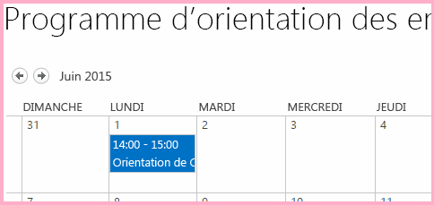
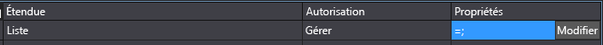
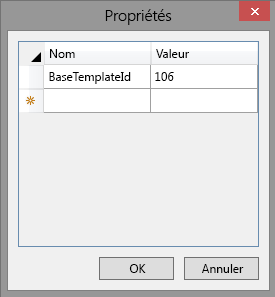
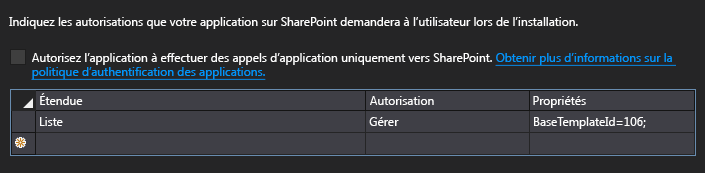
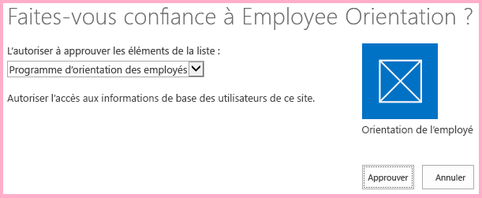
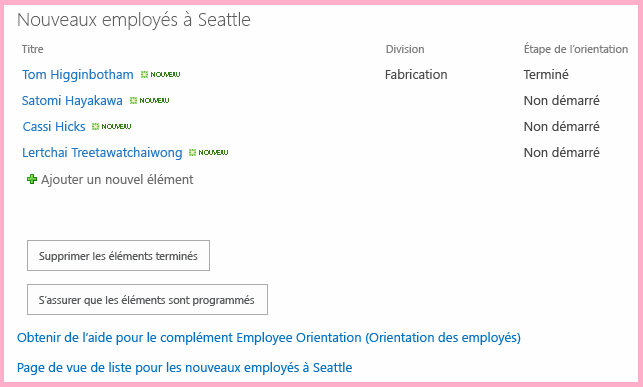

# Utilisation de données de site web hôte JavaScript dans le site web de complément
 Utilisez le modèle objet SharePoint JavaScript (JSOM) pour employer des données SharePoint dans le site web hôte JavaScript sur les pages du site web de complément.
 Cet article est le onzième d'une série sur les concepts de base du développement de Compléments SharePoint hébergés par SharePoint. Vous devez tout d'abord avoir pris connaissance de [Compléments](sharepoint-add-ins.md) et des articles précédents de la série :


-  [Commencer à créer des compléments SharePoint hébergés par SharePoint](get-started-creating-sharepoint-hosted-sharepoint-add-ins.md)


-  [Déployer et installer un complément hébergé par SharePoint pour SharePoint](deploy-and-install-a-sharepoint-hosted-sharepoint-add-in.md)


-  [Ajouter des colonnes personnalisées à un complément hébergé par SharePoint pour SharePoint](add-custom-columns-to-a-sharepoint-hostedsharepoint-add-in.md)


-  [Ajouter un type de contenu personnalisé à un complément hébergé par SharePoint pour SharePoint](add-a-custom-content-type-to-a-sharepoint-hostedsharepoint-add-in.md)


-  [Ajouter un composant WebPart à une page dans un complément hébergé par SharePoint pour SharePoint](add-a-web-part-to-a-page-in-a-sharepoint-hosted-sharepoint-add-in.md)


-  [Ajouter un flux de travail à un complément hébergé par SharePoint pour SharePoint](add-a-workflow-to-a-sharepoint-hosted-sharepoint-add-in.md)


-  [Ajouter une page et un style personnalisés à un complément hébergé par SharePoint pour SharePoint](add-a-custom-page-and-style-to-a-sharepoint-hosted-sharepoint-add-in.md)


-  [ Ajout de rendu côté client personnalisé à un complément SharePoint hébergé par SharePoint](add-custom-client-side-rendering-to-a-sharepoint-hosted-sharepoint-add-in.md)


-  [ Création d'un bouton de ruban personnalisé dans le site web hôte d'un complément SharePoint](create-a-custom-ribbon-button-in-the-host-web-of-a-sharepoint-add-in.md)


-  [Utilisation des API JavaScript SharePoint pour exploiter les données SharePoint](use-the-sharepoint-javascript-apis-to-work-with-sharepoint-data.md)


> **REMARQUE**
>  Si vous avez suivi cette série sur les compléments hébergés par SharePoint, vous disposez d'une solution Visual Studio que vous pouvez continuer à utiliser avec cette rubrique. Vous pouvez également télécharger le référentiel à l'adresse [SharePoint_SP-hosted_Add-Ins_Tutorials](https://github.com/OfficeDev/SharePoint_SP-hosted_Add-Ins_Tutorials) et ouvrir le fichier BeforeHostWebData.sln.


 Par défaut, SharePoint est conçu pour empêcher le code JavaScript d'un complément d'avoir accès à des données se trouvant dans d'autres sites SharePoint de la batterie de serveurs. Cela permet d'empêcher que le script d'un complément non autorisé ait accès à des données sensibles. Toutefois, un complément doit souvent avoir accès au site web hôte ou à d'autres sites d'une même collection de sites en tant que site web hôte. L'autorisation de ce scénario dans votre complément compte deux étapes :
-  Vous demandez l'autorisation au site web hôte dans le fichier manifeste de votre complément. L'utilisateur qui installe le complément est invité à accorder cette autorisation. S'il ne le fait pas, le complément ne peut pas être installé.


-  Au lieu d'utiliser un objet **SP.ClientContext** pour émettre des appels JSOM vers le site web hôte, vous utilisez un objet **SP.AppContextSite**. Cet objet permet au complément d'obtenir des objets de contexte pour les sites web autres que le site web de complément, mais uniquement pour les sites web de la même collection de sites. (Il existe également un moyen d'accéder à un site web de l'abonnement SharePoint Online [ou de l'application web SharePoint locale], mais il s'agit d'un sujet plus avancé.) 


 Dans cet article, vous utilisez le JSOM pour trouver les orientations qui n'ont pas encore commencé et pour veiller à ce qu'elles soient programmées dans un calendrier du site web hôte.
## Préparation du calendrier de site web hôte

 Ouvrez le site web hôte (votre site de test de développeur) et vérifiez qu'il comporte un calendrier nommé « Programme d'orientation des employés » et qu'un seul événement y est inscrit : « Orientation de Charline Leblanc ». S'il n'existe aucun calendrier, procédez comme suit :


1.  Sur la page d'accueil du site, choisissez **Contenu du site** > **Ajouter un complément** > **Calendrier**.


2.  Dans la boîte de dialogue **Ajout de calendrier**, saisissez Programme d'orientation des employés pour le **nom**, puis sélectionnez **Créer**.


3.  Lorsque le calendrier s'ouvre, placez le curseur sur une date jusqu'à ce que le lien **Ajouter** apparaisse, puis cliquez sur **Ajouter**. 


4.  Dans la boîte de dialogue **Programme d'orientation des employés - Nouvel élément**, saisissez Orientation de Charline Leblanc pour le **titre**. Laissez les valeurs par défaut des autres champs et cliquez sur **Enregistrer**.

     Le calendrier doit ressembler à ce qui suit :


   **Calendrier personnalisé**





## Créer le JavaScript et un bouton pour appeler


1.  Ouvrez le fichier Add-in.js dans le nœud **Scripts** dans l' **Explorateur de solutions**. 


2.  Ajoutez les déclarations suivantes en dessous de la déclaration pour `completedItems`. 

  -  L'élément `notStartedItems` fait référence à la liste **Nouveaux employés à Seattle** dont l' **étape d'orientation** est **non démarrée**.


  -  L'élément `calendarList` fait référence au calendrier que vous avez créé sur le site web hôte.


  -  L'élément `scheduledItems` fait référence à une collection d'éléments sur le calendrier.


 ```

var notStartedItems;
var calendarList;
var scheduledItems;
 ```

3.  Lorsqu'un Complément SharePoint est exécuté, SharePoint appelle sa page de démarrage et ajoute quelques paramètres de requête à l'URL de celle-ci. L'un de ces paramètres est `SPHostUrl`, qui correspond à l'URL du site web hôte. Le complément a besoin de ces informations afin d'émettre des appels pour héberger les données du site web. Par conséquent, en haut du fichier Add-in.js, juste sous la déclaration des variables pour  `scheduledItems`, ajoutez la ligne suivante. Notez ce qui suit à propos de ce code :

  -  L'élément `getQueryStringParameter` est une fonction utilitaire que vous créez à l'étape suivante.


  -  L'élément `decodeUriComponent` est une fonction JavaScript standard qui annule l'encodage URI réalisé par SharePoint sur les paramètres de requête ; par exemple, une barre oblique codée, « %2F », est transformée en « / ».


 ```

var hostWebURL = decodeURIComponent(getQueryStringParameter("SPHostUrl"));
 ```

4.  Ajoutez le code suivant au bas du fichier. Cette fonction peut être utilisée pour lire les paramètres de la requête.

 ```
  // Utility functions

function getQueryStringParameter(paramToRetrieve) {
     var params = document.URL.split("?")[1].split("&amp;");
     var strParams = "";
     for (var i = 0; i < params.length; i = i + 1) {
         var singleParam = params[i].split("=");
         if (singleParam[0] == paramToRetrieve) {
             return singleParam[1];
        }
     }
 }
 ```

5.  Ajoutez la fonction suivante au fichier Add-in.js, au-dessus de la section Rappels d'échec. Notez ce qui suit à propos de ce code :

  -  Il est presque identique à la méthode de requête de liste qui obtient les éléments **terminés**, à la différence qu'il obtient des éléments **non démarrés** au lieu d'éléments **terminés**. Seuls les éléments **non démarrés** nous intéressent, car le script suppose que si une orientation n'est plus **non démarrée**, cela signifie qu'elle est déjà programmée.


  -  Vous créez les deux méthodes de rappel dans l'appel **executeQueryAsync** ultérieurement.


 ```

function ensureOrientationScheduling() {

    var camlQuery = new SP.CamlQuery();
    camlQuery.set_viewXml(
        '<View><Query><Where><Eq>' +
            '<FieldRef Name=\\'OrientationStage\\'/><Value Type=\\'Choice\\'>Not started</Value>' +
        '</Eq></Where></Query></View>');
    notStartedItems = employeeList.getItems(camlQuery);

    clientContext.load(notStartedItems);
    clientContext.executeQueryAsync(getScheduledOrientations, onGetNotStartedItemsFail);
    return false;
}
 ```

6.  Ajoutez la fonction suivante au fichier Add-in.js, juste en dessous de la fonction précédente. Notez qu'elle utilise l'objet `hostWebContext` pour identifier la liste interrogée.

    > **REMARQUE**
      >  Notez qu'aucune balise de requête n'est ajoutée à la requête CAML. Le fait de ne disposer d'aucune requête réelle dans l'objet de requête permet de s'assurer que *l'ensemble*  des heures de la liste seront récupérées. Si la liste est très volumineuse, cela peut entraîner une durée d'exécution de la requête au serveur inacceptable. Dans ce cas, nous souhaitons trouver une autre façon d'atteindre notre objectif. Mais dans ce cas de figure où nous disposons d'une liste très courte (sans oublier que les listes de calendrier sont presque toujours courtes), l'obtention de la liste entière afin de pouvoir l'itérer sur le client nous permettra de réduire le nombre d'appels vers le serveur, autrement dit les appels de l'élément **executeQueryAsync**. 

 ```

function getScheduledOrientations() {

    var hostWebContext = new SP.AppContextSite(clientContext, hostWebURL);
    calendarList = hostWebContext.get_web().get_lists().getByTitle('Employee Orientation Schedule');

    var camlQuery = new SP.CamlQuery();
    scheduledItems = calendarList.getItems(camlQuery);

    clientContext.load(scheduledItems);
    clientContext.executeQueryAsync(scheduleAsNeeded, onGetScheduledItemsFail);
}
 ```

7.  Ajoutez la fonction suivante au fichier. Notez les points suivants concernant ce code :

  -  La méthode réalise une vérification pour voir si le titre d'un élément **non démarré** dans la liste **Nouveaux employés à Seattle**, qui est le nom d'un employé, est contenu dans le titre d'un événement du calendrier **Programme d'orientation des employés**. Par conséquent, il est supposé que toutes les entrées du calendrier sont créées avec le nom complet de l'employé dans le titre de l'événement.


  -  Si aucun événement déjà présent dans le calendrier ne correspond à un élément **non démarré**, le script crée un élément de calendrier pour l'élément **non démarré**.


  -  JSOM utilise un objet **ListItemCreationInformation** non activable au lieu d'un objet **SPListItem** pour réduire la taille de la charge utile qui est envoyée au serveur SharePoint.


  -  Les deux champs de date/heure du nouvel événement de calendrier sont définis sur des jours du mois où cet article a été rédigé : `2015-06`.  *Modifiez ces dates pour qu'elles correspondent à un jour du mois et de l'année en cours, de façon à ce que vous puissiez trouver facilement les éléments dans votre calendrier.* 


  -  Si des éléments **non démarrés** ne sont pas programmés, le premier est programmé pour le 10 du mois. Chaque élément imprévu supplémentaire est programmé pour le jour suivant. Il est donc supposé qu'il n'existera pas plus d'éléments non programmés que de jours dans le mois, de façon à ne pas obtenir des jours inexistants, comme « 32 ».


  -  La plupart de ce code est du JavaScript standard. Des commentaires ont été insérés aux lignes qui utilisent le modèle objet JavaScript SharePoint.


 ```

function scheduleAsNeeded() {

    var unscheduledItems = false;
    var dayOfMonth = '10';

    var listItemEnumerator = notStartedItems.getEnumerator();

    while (listItemEnumerator.moveNext()) {
        var alreadyScheduled = false;
        var notStartedItem = listItemEnumerator.get_current();

        var calendarEventEnumerator = scheduledItems.getEnumerator();
        while (calendarEventEnumerator.moveNext()) {
            var scheduledEvent = calendarEventEnumerator.get_current();

             // The SP.ListItem.get_item('field_name ') method gets the value of the specified field.
            if (scheduledEvent.get_item('Title').indexOf(notStartedItem.get_item('Title')) > -1) {
                alreadyScheduled = true;
                break;
            }
        }
        if (alreadyScheduled === false) {

             // SP.ListItemCreationInformation holds the information the SharePoint server needs to
             // create a list item
            var calendarItem = new SP.ListItemCreationInformation();

             // The some_list .additem method tells the server which list to add 
             // the item to.
            var itemToCreate = calendarList.addItem(calendarItem);

             // The some_item .set_item method sets the value of the specified field.
            itemToCreate.set_item('Title', 'Orient ' + notStartedItem.get_item('Title'));

             // The EventDate and EndDate are the start and stop times of an event.
            itemToCreate.set_item('EventDate', '2015-06-' + dayOfMonth + 'T21:00:00Z');
            itemToCreate.set_item('EndDate', '2015-06-' + dayOfMonth + 'T23:00:00Z');
            dayOfMonth++;

             // The update method tells the server to commit the changes to the SharePoint database.
            itemToCreate.update();
            unscheduledItems = true;
        }
    }
    if (unscheduledItems) {
        calendarList.update();
        clientContext.executeQueryAsync(onScheduleItemsSuccess, onScheduleItemsFail);
    }
}
 ```

8.  Ajoutez le gestionnaire de réussite suivant qui est appelé lorsque les éléments imprévus précédemment sont ajoutés au calendrier.

 ```

function onScheduleItemsSuccess() {
    alert('There was one or more unscheduled orientations and they have been added to the '
              + 'Employee Orientation Schedule calendar.');
}
 ```

9.  Ajoutez les fonctions de défaillance suivantes à la section Rappels d'échec du fichier.

 ```

function onGetNotStartedItemsFail(sender, args) {
    alert('Unable to get the not-started items. Error:' 
        + args.get_message() + '\\n' + args.get_stackTrace());
}

function onGetScheduledItemsFail(sender, args) {
    alert('Unable to get scheduled items from host web. Error:' 
        + args.get_message() + '\\n' + args.get_stackTrace());
}

function onScheduleItemsFail(sender, args) {
    alert('Unable to schedule items on host web calendar. Error:' 
        + args.get_message() + '\\n' + args.get_stackTrace());
}
 ```

10.  Ouvrez le fichier default.aspx et recherchez l'élément **asp:Content** avec l'ID **PlaceHolderMain**.


11.  Ajoutez le balisage suivant juste en dessous du bouton `purgeCompletedItems`.

 ```HTML

<p><asp:Button runat="server" OnClientClick="return ensureOrientationScheduling()"
  ID="ensureorientationschedulingbutton" Text="Ensure all items are on the Calendar" /></p>
 ```

12.  Régénérez le projet dans Visual Studio.


13.  Pour limiter la nécessité de définir manuellement l' **étape d'orientation** des éléments de liste sur un étatnon démarré lors du test du complément, ouvrez le fichier elements.xml pour l'instance de liste **NouveauxEmployésÀSeattle** (pas le fichier elements.xml pour le modèle de liste **OrientationDesNouveauxEmployés**). Assurez-vous ensuite que la valeur de l'étape d'orientation d'au moins trois des éléments **Row**,  *y compris la ligne de Charline Leblanc*  , a la valeurnon démarrée. Étant donné qu'il s'agit de la valeur par défaut, la façon la plus simple consiste à s'assurer qu'il n'existe aucun élément **Field** pour `OrientationStage` pour les trois lignes (ou plus).

     Voici un exemple de la façon dont l'élément **Rows** doit se présenter.


 ```

<Rows>
  <Row>
    <Field Name="Title">Tom Higginbotham</Field>
    <Field Name="Division">Manufacturing</Field>
    <Field Name="OrientationStage">Completed</Field>
  </Row>
  <Row>
    <Field Name="Title">Satomi Hayakawa</Field>
  </Row>
  <Row>
    <Field Name="Title">Cassi Hicks</Field>
  </Row>
  <Row>
    <Field Name="Title">Lertchai Treetawatchaiwong</Field>
  </Row>
</Rows>
 ```


## Spécification des autorisations au site web hôte dont le complément a besoin

 Votre complément dispose automatiquement de l'autorisation Contrôle total sur son site web de complément, c'est pourquoi jusqu'à maintenant vous n'avez pas dû spécifier les autorisations dont il avait besoin. Toutefois, vous devez demander expressément des autorisations au site web hôte pour interagir avec ses données. Le complément Orientation des employés a besoin d'autorisations pour ajouter des éléments au calendrier du site web hôte.


1.  Dans l' **Explorateur de solutions**, ouvrez le fichier appManifest.xml. 


2.  Dans le concepteur de manifeste, ouvrez l'onglet **Autorisations**.


3.  Dans la ligne supérieure de la colonne **Portée**, choisissez **Liste** dans le menu déroulant.


4.  Dans la colonne **Autorisation**, choisissez **Gérer**.


5.  Si la colonne **Propriétés** est vide, le complément demande une autorisation en écriture pour chaque liste du site web hôte. Il est recommandé de limiter les compléments aux autorisations dont ils ont besoin. Dans le manifeste de complément, il n'existe aucune manière de limiter les autorisations à une instance de liste spécifique, mais il est possible de limiter le complément uniquement aux instances de liste fondées sur un modèle de liste de base spécifique. Le modèle de liste de base d'un calendrier est **Events** dont l'ID numérique est 106.

     Cliquez sur la cellule **Propriétés** de la même ligne pour faire apparaître le bouton **Modifier** dans la cellule. La liste des autorisations doit maintenant ressembler à ce qui suit :


   **Liste des autorisations avec le bouton Modifier visible**





6.  Choisissez **Modifier** pour ouvrir la boîte de dialogue **Propriétés**.


7.  Définissez **Nom** surIDModèleBase et **Valeur** sur106. La boîte de dialogue doit maintenant ressembler à ce qui suit :

   **Boîte de dialogue de propriétés d'autorisation de liste**





     Sélectionnez **OK**. L'onglet **Autorisations** doit maintenant ressembler à ce qui suit :


   **Onglet Autorisations du concepteur de manifeste de complément dans Visual Studio**





## Exécuter et tester le complément


1.  Assurez-vous que le calendrier du site web hôte est préparé comme décrit plus haut dans cet article. Il doit comporter un seul événement, appelé « Orientation de Charline Leblanc ».


2.  Activez les fenêtres contextuelles sur le navigateur utilisé par Visual Studio lors du débogage.


3. Utilisez la touche F5 pour déployer et exécuter votre complément. Visual Studio effectue une installation temporaire du complément sur votre site SharePoint de test et exécute immédiatement celui-ci. 


4.  Le formulaire de consentement d'autorisation s'ouvre là où vous pouvez octroyer au complément l'autorisation dont il a besoin. La page comporte une liste déroulante dans laquelle vous pouvez choisir parmi l'ensemble des calendriers du site web hôte. Choisissez **Programme d'orientation des employés**, puis **Approuver**.

   **Invite de consentement de complément SharePoint**





5.  Une fois que la page d'accueil du complément est entièrement chargée, cliquez sur le bouton **S'assurer que les éléments sont programmés**.

   **Page d'accueil d'orientation des employés avec ce nouveau bouton**





6.  Si l'une des fonctions de rappel d'échec est exécutée, l'erreur de message d'alerte créée par vos fonctions de rappel apparaît. Sinon, vous verrez le message de réussite créé par le rappel de succès final : **Au moins une orientation non programmée a été détectée et ajoutée au calendrier Programme d'orientation des employés.**.


7.  Accédez au calendrier **Programme d'orientation des employés** sur le site web hôte. Par exemple, choisissez le lien de navigation vers la page d'accueil de votre site du développeur et cliquez sur **Contenu du site**. Ensuite, sélectionnez la mosaïque **Programme d'orientation des employés** (et non celle intitulée **Orientation des employés**).

     Le calendrier doit ressembler à ce qui suit. Le script a détecté qu'il existait déjà un événement pour Charline Leblanc, c'est pourquoi il n'en a pas créé un deuxième pour elle. Il a toutefois créé des événements pour les deux autres employés dont l'orientation était **non démarrée**. Il n'a pas non plus créé d'événement pour l'employé dont l'orientation n'était plus **non démarrée**. 


   **Calendrier après avoir ajouté deux nouveaux événements**


8.  *Veillez à supprimer les deux nouveaux événements du calendrier avant d'appuyer à nouveau sur **S'assurer que les éléments sont programmés**.* 


9. Pour mettre fin à la session de débogage, fermez la fenêtre du navigateur ou arrêtez le débogage dans Visual Studio. Chaque fois que vous appuyez sur F5, Visual Studio retire la version précédente du complément et installe la plus récente.


10. Vous allez travailler avec ce complément et la solution Visual Studio dans d'autres articles. Il est donc recommandé de retirer le complément une dernière fois lorsque vous avez terminé de travailler et n'allez pas le réutiliser pendant un moment. Cliquez avec le bouton droit de la souris sur le projet dans l' **Explorateur de solutions** et choisissez **Retirer**.


## 
<a name="Nextsteps"> </a>

Passer aux tâches avancées dans les Compléments SharePoint hébergées par SharePoint : 


-  [Concevoir des compléments pour SharePoint](design-sharepoint-add-ins.md)


-  [Développer des compléments pour SharePoint](develop-sharepoint-add-ins.md)


-  [Publier des compléments pour SharePoint](publish-sharepoint-add-ins.md)


-  [Outils et environnement de développement de compléments pour SharePoint](tools-and-environments-for-developing-sharepoint-add-ins.md)


