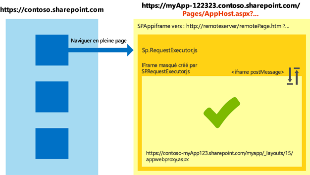

# Utiliser la bibliothèque inter-domaines dans différentes zones de sécurité Internet Explorer dans les compléments pour SharePoint
Découvrez comment utiliser la bibliothèque inter-domaines dans SharePoint 2013 lorsque le site web hôte et les pages de complément se trouvent dans différentes zones de sécurité dans Windows Internet Explorer.
Si vous utilisez la bibliothèque inter-domaines SharePoint 2013 pour vos compléments, prenez en compte la façon dont les zones de sécurité fonctionnent dans Internet Explorer. Votre complément peut être confronté à certains problèmes de communication si le site web SharePoint et le complément se trouvent dans des zones différentes. Cet article décrit ce qu'il se passe lorsque vous utilisez la bibliothèque inter-domaines dans différentes zones de sécurité Internet Explorer.


## Scénarios inter-zones dans Internet Explorer au moyen de la bibliothèque inter-domaines SharePoint
<a name="bk_crosszonescenarios"> </a>

Pour des raisons de sécurité, Internet Explorer empêche les pages se trouvant à des niveaux d'intégrité différents (également connus sous le nom de zones de sécurité) de partager des cookies, étant donné que chaque niveau d'intégrité dispose de son propre magasin de cookies. Le niveau d'intégrité d'une page est déterminé par la page située tout en haut, et tout cadre au sein de cette page partagera le même niveau d'intégrité. Pour plus d'informations, voir  [Partage de cookies dans les scénarios inter-zones](http://blogs.msdn.com/b/ieinternals/archive/2011/03/10/internet-explorer-beware-cookie-sharing-in-cross-zone-scenarios.aspx).


La bibliothèque inter-domaines SharePoint utilise un **IFrame** masqué et une page proxy côté client hébergée sur SharePoint pour permettre la communication côté client au moyen JavaScript. La bibliothèque inter-domaines est disponible lorsque vous référencez le fichier sp.requestexecutor.js dans vos pages. Pour plus d'informations, voir [Accéder à des données SharePoint 2013 à partir de compléments à l'aide de la bibliothèque inter-domaines](access-sharepoint-2013-data-from-add-ins-using-the-cross-domain-library.md).


Lorsque la page de complément distante et le site web SharePoint se trouvent dans des zones de sécurité différentes, les cookies d'autorisation ne peuvent pas être envoyés. En l'absence de cookies d'autorisation, si l' **IFrame** essaye de charger la page proxy, il est redirigé vers la page de connexion SharePoint. La page de connexion SharePoint ne peut pas se trouver dans un **IFrame** pour des raisons de sécurité. Dans ces scénarios, la bibliothèque ne peut pas charger la page proxy et la communication avec SharePoint n'est pas possible.


Le diagramme suivant illustre un scénario inter-zones dans lequel la page proxy ne peut pas être chargée. La page supérieure place le cadre dans la même zone de sécurité que  `http://remoteserver/remotepage.html`. La page proxy ne se charge pas.


**Figure 1. Scénario inter-zones dans lequel la page proxy ne peut pas être chargée**


Voici quelques exemples dans lesquels la bibliothèque inter-domaines est susceptible de ne pas pouvoir charger la page proxy :


- Vos clients utilisent SharePoint Online et votre page de complément distante est hébergée sur un serveur intranet. Ce scénario est susceptible d'entraîner une erreur de chargement de la page proxy parce que l'URL de SharePoint Online ne se trouve généralement pas dans la zone intranet locale. Il s'agit d'un scénario très courant pendant le développement initial d'un complément car vous utilisez peut-être IIS Express ou un autre serveur local pour héberger votre page sans domaine Internet complet.


- Vos clients utilisent SharePoint sur site avec l'authentification basée sur les formulaires et votre page distante est hébergée sur un service de nuage (par exemple, Microsoft Azure).


## Gestion de scénarios inter-zones dans les Compléments SharePoint
<a name="bk_handlingcrosszone"> </a>

Il existe plusieurs façons de résoudre ce problème à la fois au moment du développement du complément (vivement recommandé) et au moment de l'exécution du complément.


### Pratique recommandée : utiliser le modèle apphost

Pour gérer un scénario inter-zones, nous vous recommandons d'avoir une page apphost dans SharePoint. La page apphost est une page SharePoint qui contient la page distante dans un **IFrame**. Tout élément dans l' **IFrame** sur la page apphost se trouve dans la même zone de sécurité que le site web de complément. La bibliothèque inter-domaines dans la page distante peut recevoir les cookies d'autorisation et charge la page proxy correctement.


Le diagramme suivant illustre un scénario inter-zones géré au moyen du modèle de page apphost. 


**Figure 2. Gestion de scénario inter-zones au moyen du modèle de page apphost**





Le code requis pour la page apphost est simple. La partie principale de la page apphost est un élément **SPAppIFrame**. Vous devez utiliser CSS pour rendre l' **IFrame** invisible de façon à ce qu'il n'interfère pas avec votre complément.


Le code suivant est un exemple de page apphost simple. Le code effectue les tâches suivantes :


- déclare les directives nécessaires lors de l'utilisation de composants SharePoint ;


- déclare des styles pour rendre l' **IFrame** invisible ;


- déclare le **SPAppIFrame** et définit la cible sur la page de démarrage du complément.



```HTML

<%@ Page
    Inherits="Microsoft.SharePoint.WebPartPages.WebPartPage, Microsoft.SharePoint, Version=15.0.0.0, Culture=neutral, PublicKeyToken=71e9bce111e9429c" 
    language="C#" %>
<%@ Register 
    Tagprefix="SharePoint" 
    Namespace="Microsoft.SharePoint.WebControls" 
    Assembly="Microsoft.SharePoint, Version=15.0.0.0, Culture=neutral, PublicKeyToken=71e9bce111e9429c" %>
<%@ Register 
    Tagprefix="Utilities" 
    Namespace="Microsoft.SharePoint.Utilities" 
    Assembly="Microsoft.SharePoint, Version=15.0.0.0, Culture=neutral, PublicKeyToken=71e9bce111e9429c" %>
<%@ Register 
    Tagprefix="WebPartPages" 
    Namespace="Microsoft.SharePoint.WebPartPages" 
    Assembly="Microsoft.SharePoint, Version=15.0.0.0, Culture=neutral, PublicKeyToken=71e9bce111e9429c" %>

<html>
<head>
    <title>Your add-in page title</title>
    <style type="text/css">
        html, body
        {
            overflow:hidden;
        }
    
        body
        {
            margin:0px;
            padding:0px;
        }
     
        iframe 
        {
            border:0px;
            height:100%;
            width:100%;
        }
    </style>
</head>

<body>
    <SharePoint:SPAppIFrame 
        runat="server" 
        src="~remoteAppUrl/StartPage.html?{StandardTokens}" 
        frameborder="0">
    </SharePoint:SPAppIFrame>
</body>
</html>
```

Si vous voulez que vos utilisateurs créent des liens profonds vers des parties de votre complément, votre page apphost et le contenu de l' **IFrame** peuvent collaborer pour que cela soit possible. Une autre possibilité consiste à utiliser une communication via PostMessage **IFrame** et des URL individuelles par page dans le complément distant. Pour avoir des URL individuelles par page, vous pouvez créer des pages individuelles dans le site web de complément ou utiliser des paramètres de chaîne de requête sur une page.


### Méthode alternative : ajouter les sites dans la même zone de sécurité dans Internet Explorer

Si un complément n'a pas été conçu au moyen du modèle apphost, vous pouvez toujours lui permettre de fonctionner en ajoutant les domaines suivants dans la même zone de sécurité : 


- le domaine de votre site SharePoint (par exemple,  `https://contoso.sharepoint.com`) ;


- le domaine du complément hébergé par le cloud ( `http://remoteserver`) ;


- le domaine des services et pages de connexion hébergés par Microsoft ( `*.microsoftonline.com`).


Les administrateurs peuvent utiliser des stratégies Active Directory pour propager les modifications sur tous les ordinateurs de l'organisation.


## Implications en termes de sécurité lors de l'utilisation du modèle apphost
<a name="bk_securityimplications"> </a>

Il est important de signaler qu'en fait le modèle apphost insère votre page distante dans la même zone de sécurité que le site web de complément. Veillez à bien comprendre les implications de l'ajout d'un site dans une zone de sécurité. Pour plus d'informations, voir  [Utilisation des zones de sécurité dans Internet Explorer](http://support.microsoft.com/kb/174360).


## Utilisation d'autres navigateurs : Chrome, Firefox et Safari
<a name="bk_otherbrowsers"> </a>

Les autres navigateurs, tels que Google Chrome, Mozilla Firefox et Apple Safari, ne mettent pas en œuvre le concept de zone de sécurité. Si un navigateur n'isole pas les cookies dans un stockage séparé, il ne rencontrera probablement pas les difficultés décrites dans cet article. Nous vous recommandons de suivre le modèle apphost dans vos compléments. L'utilisation du modèle apphost permet de s'assurer que votre complément fonctionne dans les navigateurs mentionnés et Internet Explorer, quelle que soit la zone de sécurité dans laquelle SharePoint se trouve.


## Ressources supplémentaires
<a name="bk_addresources"> </a>


-  [Accès aux données sécurisé et modèles d'objet client pour les compléments SharePoint](secure-data-access-and-client-object-models-for-sharepoint-add-ins.md)


-  [Accéder à des données SharePoint 2013 à partir de compléments à l'aide de la bibliothèque inter-domaines](access-sharepoint-2013-data-from-add-ins-using-the-cross-domain-library.md)


-  [Compléments](sharepoint-add-ins.md)


-  [Autorisation et authentification des compléments dans SharePoint](authorization-and-authentication-of-sharepoint-add-ins.md)


-  [Penser de trois manières différentes les options de conception des compléments pour SharePoint](three-ways-to-think-about-design-options-for-sharepoint-add-ins.md)


-  [Aspects importants du contexte de développement et de l'architecture des compléments pour SharePoint](important-aspects-of-the-sharepoint-add-in-architecture-and-development-landscap.md)


-  [Héberger des sites web, des sites web de complément et des composants SharePoint dans SharePoint 2013](host-webs-add-in-webs-and-sharepoint-components-in-sharepoint-2013.md)


-  [Stockage des données dans les compléments SharePoint](important-aspects-of-the-sharepoint-add-in-architecture-and-development-landscap.md#Data)


-  [Créer une page de proxy personnalisée pour la bibliothèque inter-domaines dans SharePoint 2013](create-a-custom-proxy-page-for-the-cross-domain-library-in-sharepoint-2013.md)


-  [Sécurité inter-domaines côté client](http://msdn.microsoft.com/fr-fr/library/cc709423%28v=vs.85%29.aspx)


