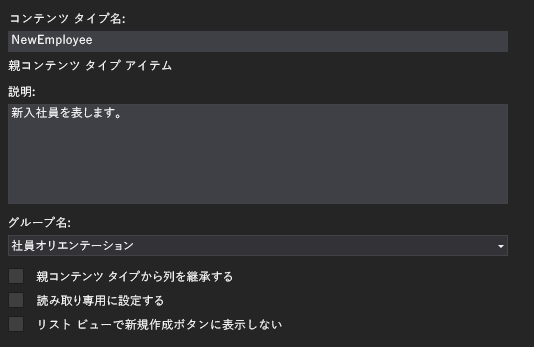
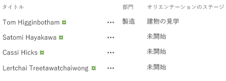

# SharePoint ホスト型 SharePoint アドインにカスタム コンテンツ タイプを追加する
SharePoint アドインにカスタム コンテンツ タイプを含める方法について説明します。
これは、SharePoint ホスト型の SharePoint アドインの開発の基本に関する記事のシリーズの 4 番目です。「 [SharePoint アドイン](sharepoint-add-ins.md)」とこのシリーズの前の記事をよく理解しておいてください。
  
    
    


-  [SharePoint ホスト型の SharePoint アドインの作成を始める](get-started-creating-sharepoint-hosted-sharepoint-add-ins.md)
    
  
-  [SharePoint 用の SharePoint ホスト型アドインを展開してインストールする](deploy-and-install-a-sharepoint-hosted-sharepoint-add-in.md)
    
  
-  [SharePoint 用の SharePoint ホスト型アドインにカスタム列を追加する](add-custom-columns-to-a-sharepoint-hostedsharepoint-add-in.md)
    
  

> **メモ**
> SharePoint ホスト型アドインに関するこのシリーズを続けて学習している場合は、このトピックを続行するために利用できる Visual Studio ソリューションがあります。また、 [SharePoint_SP-hosted_Add-Ins_Tutorials](https://github.com/OfficeDev/SharePoint_SP-hosted_Add-Ins_Tutorials) でリポジトリをダウンロードして、BeforeContentType.sln ファイルを開くこともできます。
  
    
    

この記事では、新入社員オリエンテーション SharePoint アドインにカスタム コンテンツ タイプを追加します。
## カスタム コンテンツ タイプを作成する


  
    
    

1. [ **ソリューション エクスプローラー**] で、プロジェクトを右クリックして [ **追加**] > [ **新しいフォルダー**] を選択します。フォルダーに Content Types という名前を付けます。
    
  
2. 新しいフォルダーを右クリックして、[ **追加**] > [ **新しい項目**] を選択します。[ **新しい項目の追加**] ダイアログ ボックスで [ **Office/SharePoint**] の各ノードを開きます。
    
  
3. [ **コンテンツ タイプ**] を選択して、NewEmployee という名前を付け、[ **追加**] を選択します。ウィザードで基本のコンテンツ タイプを選択するように求められたら、[ **アイテム**] を選択して、[ **完了**] を選択します。
    
  
4. コンテンツ タイプ デザイナーが自動的に開かない場合は、 **ソリューション エクスプローラー**で [ **NewEmployee**] コンテンツ タイプを選択して開きます。
    
  
5. デザイナーで [ **コンテンツ タイプ**] タブを開き、テキスト ボックスに次のように入力します。
    
  - [ **コンテンツ タイプ名**]: NewEmployee
    
  
  - **説明**: 新しい従業員を表します。
    
  
  - **グループ名**: 新入社員オリエンテーション
    
  
6. このタブのチェック ボックスがすべて *オフ*  になっていることを確認します。[ **親コンテンツ タイプから列を継承する**] チェック ボックスは既定でオンになっている場合があります。 *これをオフにするのを忘れないようにしてください。*  タブの外観は、次のようになります。
    
   **[コンテンツ タイプ] タブ**

  

     
  

    
    
  
7. デザイナーの [ **列**] タブを開きます。
    
  
8. グリッドで、[ **列を追加するにはここをクリックします**] を選択し、列のドロップダウン リストを表示して、[ **Division**] 列を追加します。ドロップダウンリストには、表示名 [ **Division**] としてリストされます。[ **Orientation Stage**] 列でも同じ手順を実行します。(一覧にない場合は、適切な Visual Studio ソリューションを開始していない可能性があります。BeforeContentType.sln を開始してください。) 完了すると、グリッドは次のようになります。
    
   **[列] タブ**

  

     ![グリッドに "従業員"、"部門"、および "オリエンテーション ステージ" が一覧表示されているコンテンツ タイプ デザイナーの [列] タブです。](images/835e78b3-a073-45b2-b4ee-3f9be9d88495.PNG)
  

    
    
  
9. ファイルを保存し、デザイナーを閉じます。
    
  
10. 次の手順では、未加工の XML でコンテンツ タイプを直接操作する必要があるので、 **ソリューション エクスプローラー**で **NewEmployee** コンテンツ タイプの子の elements.xml ファイルを選択します。
    
  
11. このファイルには、先ほど追加した 2 つの列に対する **FieldRef** 要素が既に存在します。既に存在する 2 つの要素と対になるように、2 つの組み込みの SharePoint 列に対する **FieldRef** 要素を追加します。以下は、これらの要素のマークアップです。 *これらは、固定された ID を持つ組み込みのフィールドの種類なので、ID 属性に対して同じ GUID を使用する必要があります。*  これらを、カスタムのサイト列に対する 2 つの **FieldRef** 要素よりも *上*  に追加します。
    
 ```
  
<FieldRef Name="LinkTitle" ID="{82642ec8-ef9b-478f-acf9-31f7d45fbc31}" DisplayName="Employee" />
<FieldRef Name="Title" ID="{fa564e0f-0c70-4ab9-b863-0177e6ddd247}" DisplayName="Employee" />
 ```


    これらのフィールドにカスタムの表示名 [ **Employee**] を設定しました。
    
  
12. ファイルを保存して閉じます。
    
  
13. **ソリューション エクスプローラー**の [ **一覧**] ノードを展開して、[ **NewEmployeeOrientation**] を選択し、リスト タイプ デザイナーを開きます。
    
  
14. デザイナーで [ **列**] タブを開き、[ **コンテンツ タイプ**] ボタンを選択します。
    
  
15. [ **コンテンツ タイプの設定**] ダイアログ ボックスで、 **NewEmployee** コンテンツ タイプを追加します。
    
  
16. タイプの一覧で **NewEmployee** コンテンツ タイプを選択し、[ **既定値として設定**] ボタンを選択します。
    
  
17. [ **アイテム**] コンテンツ タイプを選択し、コンテンツ タイプ名の左に表示される小さな矢印を右クリックして [ **削除**] を選択します。
    
  
18. この手順を [ **フォルダー**] コンテンツ タイプについても繰り返し、 **NewEmployee** だけがコンテンツ タイプの一覧に表示されるようにします。ダイアログ ボックスは次のようになります。
    
   **[コンテンツ タイプの設定] ダイアログ ボックス**

  

     ![NewEmployee という名前の単一のコンテンツの種類だけが一覧表示されている [コンテンツ タイプの設定] ダイアログ。](images/b90699f4-40de-4f50-ad47-3e8773d0eb92.PNG)
  

    
    
  
19.  [ **OK**] を選択してダイアログ ボックスを閉じ、ファイルを保存して閉じます。
    
  
20. schema.xml ファイルを開きます。
    
  
21. **Fields** 要素を探します。これは、 **Title**、Division、および OrientationStage の 3 つの **Field** 要素を持っています。(これらの要素は、この生成されたファイル内で 1 列になっている可能性があります。その場合は改行で分割します。)
    
  
22. ファイルを開いたまま、 **ソリューション エクスプローラー**で [ **Site Columns**] フォルダーと Division ノードを展開し、Division の elements.xml ファイルを開きます。schema.xml のDivision の **Field** 要素は、Division elements.xml の **Field** 要素と正確に重複している必要があります。正確に一致していない場合は、サイト列の elements.xml ファイルから **Field** 要素をコピーして、schema.xml ファイルの一致しない **Field** 要素の代わりに貼り付けます。その後、element.xml ファイルを閉じます。
    
  
23. OrientationStage の elements.xml ファイルを開きます。ここでも、 **CHOICES** 要素や **MAPPINGS** 要素などのすべての子要素を含むOrientationStage の 2 つのファイルの **Field** 要素に完全に一致している必要があります。一致していない場合は、elements.xml ファイルの **Field** をコピーして、schema.xml ファイルの中で一致していない **Field** 要素の代わりに貼り付けます。その後、element.xml ファイルを閉じます。
    
  
24. 引き続き schema.xml ファイルで、 **BaseViewID** の値が "1" の **View** 要素で、子の **ViewFields** 要素を探し、次の 2 つの **FieldRef** 要素をその子として追加します。既にここに存在することがありますが、 **ID** 属性が欠けている可能性があります。その場合は、ID 属性を追加します。
    
 ```
  
<FieldRef Name="Division" ID="{GUID from the Field element}" />
<FieldRef Name="OrientationStage" ID="{GUID from the Field element}" />

 ```

25. 2 つのプレースホルダーの **ID** 属性の値を、schema.xml ファイルのそれ以前の **NewEmployee** の **ContentType** 要素の該当する **Field** 要素の GUID で置き換えます。また、"{}" で囲むのを忘れないようにします。
    
    "1" **View** の **ViewFields** は、次のようになります。(GUID は異なる可能性があります。)
    


 ```
  
<ViewFields>
   <FieldRef Name="LinkTitle" ID="{82642ec8-ef9b-478f-acf9-31f7d45fbc31}" DisplayName="Employee" />
   <FieldRef Name="Division" ID="{509d2d67-9a96-4596-9b3b-58449cdcc6ff}" />
   <FieldRef Name="OrientationStage" ID="{38a3b54c-acf3-4ddf-b748-55c7c28d4cc2}" />        
</ViewFields>
 ```

26. 引き続き schema.xml ファイルで、 **BaseViewID** の値が "0" の **View** 要素を探します。その中の **ViewFields** 要素を探します。
    
  
27. ビュー "1" の **ViewFields** セクション全体をビュー "0" の **ViewFields** セクションにコピーします。2 つのビューは、同一の **ViewFields** セクションを持つようになります。
    
  
28. schema.xml ファイルを保存して閉じます。
    
  
29. **リスト** フォルダーで、 **NewEmployeeOrientation** ノードとその子リストのインスタンス **NewEmployeesInSeattle** の両方を展開します。テンプレートの elements.xml を、インスタンスの elements.xml と明確に区別できるようになります。インスタンスの方のファイルを開きます。
    
  
30. 2 つの **Field** 要素を最初の **Row** 要素に追加して、 **Row** 要素が次のようになるようにします。
    
 ```
  
<Row>
  <Field Name="Title">Tom Higginbotham</Field>
  <Field Name="Division">Manufacturing</Field>
  <Field Name="OrientationStage">Tour of building</Field>
</Row>
   
 ```

31. ファイルを保存して閉じます。
    
  

## アドインを実行してテストする


  
    
    

1. F5 キーを使用して、アドインを展開して実行します。Visual Studio が、テスト用 SharePoint サイトにアドインを一時的にインストールして、すぐにアドインを実行します。 
    
  
2. アドインの既定のページが開いたら、[ **New Employees in Seattle**] リンクを選択してカスタムのリスト インスタンスを開きます。
    
  
3. リスト ページが開き、Division とOrientationStage 列があります。これらはリストのコンテンツ タイプの一部であるため、ユーザーが手動で追加する必要はありません。上部の項目は、追加したデータです。
    
   **New Employees in Seattle リスト**

  

     
  

    
    
  
4. リストに新しい項目を追加して、既存の項目を編集します。
    
  
5. デバッグ セッションを終了するには、ブラウザー ウィンドウを閉じるか、Visual Studio でデバッグを停止します。F5 を押すたびに、Visual Studio は以前のバージョンのアドインを取り消し、最新のアドインをインストールします。
    
  
6. このアドインと Visual Studio ソリューションは他の記事でも操作するので、ひととおり操作を終了したらアドインを取り消すとよいでしょう。[ **ソリューション エクスプローラー**] でプロジェクトを右クリックして、[ **取り消し**] を選択します。
    
  

## 
<a name="Nextsteps"> </a>

このシリーズの次の記事では、リスト ビュー Web パーツを SharePoint アドイン:  [SharePoint ホスト型 SharePoint アドイン内のページに Web パーツを追加する](add-a-web-part-to-a-page-in-a-sharepoint-hosted-sharepoint-add-in.md) の既定のページに追加します。
  
    
    

