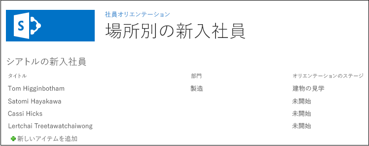

# SharePoint ホスト型 SharePoint アドイン内のページに Web パーツを追加する
SharePoint アドイン内のページに Web パーツを含める方法について説明します。
これは、SharePoint ホスト型の SharePoint アドインの開発の基本に関する記事のシリーズの 5 番目です。 [SharePoint アドイン](sharepoint-add-ins.md) とこのシリーズの前の記事をよく理解しておいてください。
  
    
    


-  [SharePoint ホスト型の SharePoint アドインの作成を始める](get-started-creating-sharepoint-hosted-sharepoint-add-ins.md)
    
  
-  [SharePoint 用の SharePoint ホスト型アドインを展開してインストールする](deploy-and-install-a-sharepoint-hosted-sharepoint-add-in.md)
    
  
-  [SharePoint 用の SharePoint ホスト型アドインにカスタム列を追加する](add-custom-columns-to-a-sharepoint-hostedsharepoint-add-in.md)
    
  
-  [SharePoint ホスト型 SharePoint アドインにカスタム コンテンツ タイプを追加する](add-a-custom-content-type-to-a-sharepoint-hostedsharepoint-add-in.md)
    
  

> **メモ**
> SharePoint ホスト型アドインに関するこのシリーズを学習している場合は、このトピックを続行するために利用できる Visual Studio ソリューションがあります。また、 [SharePoint_SP-hosted_Add-Ins_Tutorials](https://github.com/OfficeDev/SharePoint_SP-hosted_Add-Ins_Tutorials) でリポジトリをダウンロードして、BeforeWebPart.sln ファイルを開くこともできます。
  
    
    

この記事では、新入社員オリエンテーション SharePoint アドイン の既定のページに Web パーツを追加します。
## ページに Web パーツを追加する


  
    
    

1. **ソリューション エクスプローラー**で、Default.aspx ファイルを開きます。 
    
  
2. シアトルの新入社員] リスト リストを表示するリスト ビュー Web パーツをページに追加し、このリストのリスト ビュー ページへのリンクが必要なくなります。 **<asp:HyperLink>** 要素を、 **ContentPlaceHolderId** が `PlaceHolderMain` である **<asp:Content>** 要素から削除します。
    
  
3. 同じ **<asp:Content>** 要素の内部で、次の **WebPartZone** を追加します。
    
 ```XML
  
<WebPartPages:WebPartZone runat="server" FrameType="TitleBarOnly"
      ID="HomePage1" Title="loc:full" />

 ```

4. ファイルを保存して閉じます。
    
  
5. **ソリューション エクスプローラー**の [ **ページ**] ノードでページの elements.xml ファイルを開きます。 
    
  
6. **File** 要素が自己終了の場合は、"/" の文字を削除し、終了タグ `</File>` を追加します。
    
  
7. **File** 要素で、子 **AllUsersWebPart** 要素を追加して、 **WebPartZoneID** をページで作成した Web パーツ領域の ID に設定します。ファイルのコンテンツは、次のようになります。このマークアップは、SharePoint に **AllUsersWebPart** を "HomePage1" という名前の Web パーツ領域に挿入するよう指示します。
    
 ```
  
<Elements xmlns="http://schemas.microsoft.com/sharepoint/">
  <Module Name="Pages">
    <File Path="Pages\\Default.aspx" Url="Pages/Default.aspx" ReplaceContent="TRUE" >
      <AllUsersWebPart WebPartZoneID="HomePage1" WebPartOrder="1">

      </AllUsersWebPart>
    </File>
  </Module>
</Elements>

 ```

8. 次のマークアップに示すように、 **CDATA** 要素を **AllUsersWebPart** の子として追加し、次に **webParts** 要素を **CDATA** の子として追加します。
    
 ```
  
<AllUsersWebPart WebPartZoneID="HomePage1" WebPartOrder="1">
  <![CDATA[
    <webParts>

    </webParts>
  ]]>
</AllUsersWebPart>
 ```

9. 次の **webPart** マークアップを **webParts** 要素の子として追加します。このマークアップは **XsltListViewWebPart** を追加し、Web パーツに [シアトルの新入社員] リスト] リストを表示するよう指示します。 **ViewContentTypeId** プロパティ値は "0x" であり、NewEmployee コンテンツ タイプの実際の ID ではないことに注意してください。
    
 ```
  
  <webPart xmlns="http://schemas.microsoft.com/WebPart/v3">
    <metaData>
      <type name="Microsoft.SharePoint.WebPartPages.XsltListViewWebPart, 
                   Microsoft.SharePoint, Version=15.0.0.0, Culture=neutral, 
                   PublicKeyToken=71e9bce111e9429c" />
    </metaData>
    <data>
      <properties>
        <property name="ListUrl">Lists/NewEmployeesInSeattle</property>
        <property name="IsIncluded">True</property>
        <property name="NoDefaultStyle">True</property>
        <property name="Title">New Employees in Seattle</property>
        <property name="PageType">PAGE_NORMALVIEW</property>
        <property name="Default">False</property>
        <property name="ViewContentTypeId">0x</property>
      </properties>
    </data>
  </webPart>
 ```


## アドインを実行してテストする


  
    
    

1. F5 キーを使用して、アドインを展開して実行します。Visual Studio が、テスト用 SharePoint サイトにアドインを一時的にインストールして、すぐにアドインを実行します。 
    
  
2. アドインの既定のページが開き、リスト ビュー Web パーツがその上にあり、リストが表示されます。 
    
   **リスト ビュー Web パーツがある既定のページ**

  

     
  

    
    
  
3. リストに新しい項目を追加して、既存の項目を編集します。
    
  
4. デバッグ セッションを終了するには、ブラウザー ウィンドウを閉じるか、Visual Studio でデバッグを停止します。F5 を押すたびに、Visual Studio は以前のバージョンのアドインを取り消し、最新のアドインをインストールします。
    
  
5. このアドインおよび他の記事の Visual Studio ソリューションを操作し、それが終了したら前回のアドインを取り消すとよいでしょう。[ **ソリューション エクスプローラー**] のプロジェクトを右クリックして、[ **取り消し**] を選択します。
    
  

## 
<a name="Nextsteps"> </a>

このシリーズの次の記事では、ワークフローを SharePoint アドインに追加します ( [SharePoint ホスト型 SharePoint アドインにワークフローを追加する](add-a-workflow-to-a-sharepoint-hosted-sharepoint-add-in.md))。
  
    
    

