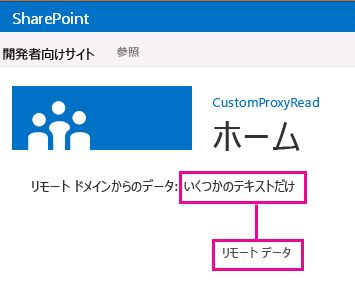

# SharePoint 2013 のクロスドメイン ライブラリのカスタム プロキシ ページを作成する
カスタム プロキシ ページを作成し、SharePoint のクロスドメイン ライブラリを使用して SharePoint Web ページからリモート サービスのデータにアクセスする方法について説明します。 
SharePoint アドインを構築するときは、通常、さまざまなソースからのデータを組み込む必要があります。ただし、セキュリティのために、一度に複数のドメインと通信することを防ぐブロック メカニズムがあります。
  
    
    

リモート アドイン インフラストラクチャにホストされるカスタム プロキシ ページを提供する場合は、クロスドメイン ライブラリを使用して、リモート アドインのデータにアクセスできます。開発者は、カスタム プロキシ ページを実装し、リモート アドインに対する認証のメカニズムなどのカスタム ロジックを扱う必要があります。クライアント レベルで通信する場合は、クロスドメイン ライブラリとカスタム プロキシ ページを使用します。
## この記事の例を使用するための前提条件
<a name="SP15Createcustomproxypage_Prereq"> </a>

 [プロバイダー ホスト型 SharePoint アドインの作成を始める](get-started-creating-provider-hosted-sharepoint-add-ins.md) で説明するように、開発環境が必要です。
  
    
    

### SharePoint アドインでカスタム プロキシ ページを使用する前に知る必要のある中心概念

次の表に、SharePoint アドインのクロスドメイン シナリオに関連する概念の理解に役立ついくつかの有用な記事を示します。
  
    
    

**表 1. カスタム プロキシ ページの使用に関する中心概念**


|**記事のタイトル**|**説明**|
|:-----|:-----|
| [SharePoint アドイン](sharepoint-add-ins.md) <br/> |エンドユーザー向けの小型で使いやすいソリューションであるアドインを作成できる、SharePoint の新しいアドイン モデルについて説明します。  <br/> |
| [SharePoint アドインのセキュリティで保護されたデータ アクセスとクライアント オブジェクト モデル](secure-data-access-and-client-object-models-for-sharepoint-add-ins.md) <br/> |SharePoint アドイン のデータ アクセス オプションについて説明します。このトピックでは、アドインのデータを扱うときに選択する必要のある高レベルの代替手段に関するガイダンスを提供します。  <br/> |
| [SharePoint 2013 のホスト Web、アドイン Web、および SharePoint コンポーネント](host-webs-add-in-webs-and-sharepoint-components-in-sharepoint-2013.md) <br/> |ホスト Web とアドイン Web の違いについて説明します。SharePoint アドイン に含めることのできる SharePoint コンポーネント、ホスト Web に展開するコンポーネント、アドイン Web に展開するコンポーネント、およびアドイン Web を分離ドメインに展開する方法について説明します。  <br/> |
| [クライアント側のクロスドメイン セキュリティ](http://msdn.microsoft.com/ja-jp/library/cc709423%28VS.85%29.aspx) <br/> |クロスドメインの脅威とユース ケース、および cross-origin 要求のセキュリティ原則について説明し、ブラウザーで実行する Web アプリケーションからのクロスドメイン アクセスを強化する場合の開発者にとってのリスクを評価します。  <br/> |
   

## コード例: クロスドメイン ライブラリのカスタム プロキシ ページを使用してリモート データにアクセスする
<a name="SP15Createcustomproxypage_Codeexample"> </a>

リモート サービスからデータを読み取るには、次のことを実行する必要があります。 
  
    
    

1. SharePoint アドイン 用プロジェクトを作成します。
    
  
2. アドイン マニフェストを変更して、リモート アドインからの通信を許可します。
    
  
3. Web プロジェクトでカスタム プロキシ ページとコンテンツ ページを作成します。
    
  
4. SharePoint アドイン プロジェクトのクロスドメイン ライブラリを使用するページを作成します。
    
  

### SharePoint アドイン プロジェクトを作成するには


1. 管理者として Visual Studio を開きます (そのためには、[ **スタート**] メニューの Visual Studio アイコンを右クリックし、[ **管理者として実行**] を選択します)。
    
  
2.  [プロバイダー ホスト型 SharePoint アドインの作成を始める](get-started-creating-provider-hosted-sharepoint-add-ins.md) で説明するように、プロバイダー ホスト型 SharePoint アドイン を作成して、ProxyPageApp という名前を付けます。
    
  

### アプリのマニフェスト ファイルを編集するには


1. **ソリューション エクスプローラー**で、 **AppManifest.xml** ファイルを右クリックし、[ **コードの表示**] を選択します。
    
  
2. **AppPrincipal** 要素全体を次で置き換えます。
    
 ```XML
  
<AppPrincipal>
    <Internal AllowedRemoteHostUrl="~remoteAppUrl"/>
</AppPrincipal>
 ```


    > **メモ**
      > **AllowedRemoteHostUrl** 属性を使用してリモート ドメインを指定します。 **~remoteAppUrl** はリモート アドインの URL に解決します。トークンの詳細ついては、「 [SharePoint アドインのアプリ マニフェスト構造とパッケージを調べる](explore-the-app-manifest-structure-and-the-package-of-a-sharepoint-add-in.md)」を参照してください。 

### カスタム プロキシ ページを作成するには


1. Visual Studio ソリューションの作成後、(SharePoint アドイン プロジェクトではなく) Web アプリケーション プロジェクトを右クリックして、[ **追加**] > [ **新しい項目**] > [ **Web**] > [ **Web フォーム**] を選択して、新しい Web フォームを追加します。フォームに Proxy.aspx という名前を付けます。
    
  
2. Proxy.aspx ファイルで、html 要素全体と子を、以下の HTML コードで置き換えます。html 要素上にあるすべてのマークアップはそのままにします。HTML コードには、次のタスクを実行するマークアップと JavaScript が含まれます。
    
  - クロスドメイン ライブラリ JavaScript ファイルのプレースホルダーを提供します。
    
  
  - 参照元からアドイン Web URL を抽出します。
    
  
  - クロスドメイン ライブラリ JavaScript ファイルをプレースホルダーに動的に読み込みます。
    
  
  - **RequestExecutorMessageProcessor** オブジェクトの設定を指定します。
    
  
  - **RequestExecutorMessageProcessor** オブジェクトを初期化します。
    
  

 ```HTML
  
<html xmlns="http://www.w3.org/1999/xhtml">
<head runat="server">
    <meta http-equiv="X-UA-Compatible" content="IE=8" /> 
    <title>Custom Proxy Host Page</title>
    <script 
        src="http://ajax.aspnetcdn.com/ajax/4.0/1/MicrosoftAjax.js" 
        type="text/javascript">
    </script>
    <script 
        type="text/javascript" 
        src="http://ajax.aspnetcdn.com/ajax/jQuery/jquery-1.7.2.min.js">
    </script>

    <!-- Script to load the cross-domain library js file -->
    <script type="text/javascript">
        var hostweburl;

        $(document).ready(function(){
            //Get the URI decoded host web URL.
            hostweburl =
                decodeURIComponent(
                    getQueryStringParameter("SPHostUrl")
            );

            // The cross-domain js file is in a URL in the form:
            // host_web_url/_layouts/15/SP.RequestExecutor.js
            var scriptbase = hostweburl + "/_layouts/15/";

            // Load the js file 
            $.getScript(scriptbase + "SP.RequestExecutor.js", initCustomProxy);
        });

        //Function to initialize the custom proxy page
        //  must set the appropriate settings and implement
        //  proper authentication mechanism
        function initCustomProxy() {
            var settings =
            {
                originAuthorityValidator: function (messageOriginAuthority) {
                    // This page must implement the authentication for the
                    //   remote add-in.
                       // You should validate if messageOriginAuthority is
                       //  an approved domain to receive calls from.
                    return true;
                }
            };
            SP.RequestExecutorMessageProcessor.init(settings);
        }

        // Function to retrieve a query string value.
        // For production purposes you may want to use
        //  a library to handle the query string.
        function getQueryStringParameter(paramToRetrieve) {
            var params =
                document.URL.split("?")[1].split("&amp;");
            var strParams = "";
            for (var i = 0; i < params.length; i = i + 1) {
                var singleParam = params[i].split("=");
                if (singleParam[0] == paramToRetrieve)
                    return singleParam[1];
            }
        }
    </script>
</head>
<body>
    
</body>
</html>


 ```


    > **重要**
      > 運用 SharePoint アドイン では、承認ロジックを指定し、設定の **originAuthorityValidator** オブジェクトで、適切な値を返す必要があります。

### コンテンツ ページを作成するには


1. **ソリューション エクスプローラー**で Web アプリケーション プロジェクトを右クリックし、[ **追加**] > [ **新しいアイテム**] > [ **Web**] > [ **Web フォーム**] を選択して、新しい Web フォームを追加します。フォームに Content.aspx という名前を付けます。
    
  
2. 次のコードをコピーして分離コード ファイルの **Page_Load** メソッドに貼り付けます。コードは以下のタスクを実行します。
    
  - 出力 **content-type** を **text/plain** に設定します。
    
  
  - コンテンツを出力バッファーに書き込みます。
    
  
  - 接続を終了します。
    
  

 ```cs
  
string content;
content = "Just some text.";
Response.ContentType="text/plain";
Response.Write(content);
Response.End();

 ```


### クロスドメイン ライブラリを使用する SharePoint Web ページを作成するには


1. SharePoint アドイン プロジェクトを右クリックして、[ **追加**] > [ **新しいアイテム**] > [ **Office/SharePoint**] > [ **モジュール**] を選択します。
    
  
2. モジュールに Pages という名前を付けて、[ **追加**] を選択します。
    
  
3. [ **Pages**]フォルダーを右クリックして、[ **追加**] > [ **新しいアイテム**]> [ **Office/SharePoint**] > [ **ページ**] の順に選択します。 
    
  
4. ページに Home.aspx という名前を付け、[ **追加**] を選択します。
    
  
5. **Home.aspx** ページが自動的に開かない場合は開きます。
    
  
6. 次のコードをコピーして **PlaceHolderMain** コンテンツ タグに貼り付けます。
    
 ```
  
<!-- The page dynamically loads the cross-domain library's
    js file, rescript acts as the placeholder. -->
<script 
    type="text/javascript"
    id="rescript"
    src="../_layouts/15/SP.RequestExecutor.js">
</script>
    Data from the remote domain: <span id="TextData"></span>

    <!-- Main script to retrieve the host web's title -->
    <script type="text/javascript">
    (function () {
        var executor;
        var hostweburl;
        var remotedomain;

        remotedomain = "<your_remote_add-in_domain>";

        //Get the URI decoded host web URL.
        hostweburl =
            decodeURIComponent(
                getQueryStringParameter("SPHostUrl")
        );

        // Initialize the RequestExecutor with the custom proxy URL.
        executor = new SP.RequestExecutor(remotedomain);
        executor.iFrameSourceUrl = "Proxy.aspx?SPHostUrl=" + hostweburl;

        // Issue the call against the remote endpoint.
        // The response formats the data in plain text.
        // The functions successHandler and errorHandler attend the
        //      sucess and error events respectively.
        executor.executeAsync(
            {
                url:
                    remotedomain + "Content.aspx",
                method: "GET",
                headers: { "Accept": "text/plain" },
                success: successHandler,
                error: errorHandler
            }
        );
    })();

    // Function to handle the success event.
    // Prints the data to the placeholder.
    function successHandler(data) {
        document.getElementById("TextData").innerText =
            data.body;
    }

    // Function to handle the error event.
    // Prints the error message to the page.
    function errorHandler(data, errorCode, errorMessage) {
        document.getElementById("TextData").innerText =
            "Could not complete cross-domain call: " + errorMessage;
    }

    // Function to retrieve a query string value.
    // For production purposes you may want to use
    //  a library to handle the query string.
    function getQueryStringParameter(paramToRetrieve) {
        var params =
            document.URL.split("?")[1].split("&amp;");
        var strParams = "";
        for (var i = 0; i < params.length; i = i + 1) {
            var singleParam = params[i].split("=");
            if (singleParam[0] == paramToRetrieve)
                return singleParam[1];
        }
    }
    </script>

 ```

7. 先に貼り付けたコードで、 `remotedomain = "<your_remote_add-in_domain>";` という行を探して、プレースホルダー _<your_remote_add-in_domain>_ を、Visual Studio で F5 を押してアドインを実行するときに Web アプリケーションが使用する「localhost」の URL に置き換えます。この値を見つけるには、 **ソリューション エクスプローラー**で Web アプリケーション プロジェクトを選択します。 **URL** プロパティは [ **プロパティ**] ペインにあります。「http://localhost:45072」のように、プロトコル、ポート、終了のスラッシュを含む値全体を使用します。
    
  
8. ファイルを保存して閉じます。
    
  
9. appmanifest.xml ファイルを開き、[ **スタート ページ**] の値を **ProxyPageApp/Pages/Home.aspx** に設定します。
    
  

### ソリューションを構築して実行するには


1. SharePoint アドイン プロジェクトがスタートアップ プロジェクトとして設定さていることを確認します。
    
  
2. F5 キーを押します。
    
    > **メモ**
      > F5 キーを押すと、Visual Studio がソリューションを構築して、アドインを展開し、アドインのアクセス許可ページを開きます。 
3. [ **信頼する**] ボタンをクリックします。
    
    ホーム ページが開き、次のようになります。語句 "Just some text" が表示されるまで数秒かかる場合がありますが、これはリモート ドメインの Content.aspx ページからフェッチされるためです。
    

   **SharePoint Web ページのリモート サービスのデータ**

  

     
  

  

  

**表 2. ソリューションのトラブルシューティング**


|**問題**|**ソリューション**|
|:-----|:-----|
|F5 キーを押した後、Visual Studio でブラウザーが開かない。  <br/> |SharePoint アドイン プロジェクトをスタートアップ プロジェクトとして設定します。  <br/> |
|ハンドルされない例外 **SP** が定義されていない。 <br/> |ブラウザー ウィンドウで SP.RequestExecutor.js ファイルにアクセスできることを確認します。  <br/> |
   

## 次の手順
<a name="SP15Createcustomproxypage_Nextsteps"> </a>

この記事では、SharePoint のクロスドメイン ライブラリのカスタム プロキシ ページを使用して、リモート データにアクセスする方法について説明しました。次の手順では、SharePoint アドインで使用できるその他のデータ アクセス オプションについて説明します。詳細については、次のトピックを参照してください。
  
    
    

-  [コード サンプル: クロスドメイン ライブラリのプロキシ ページを使用してデータを取得する](http://code.msdn.microsoft.com/SharePoint-2013-Get-data-10039ff1)
    
  
-  [クロスドメイン ライブラリを使用してアドインから SharePoint 2013 のデータにアクセスする](access-sharepoint-2013-data-from-add-ins-using-the-cross-domain-library.md)
    
  
-  [SharePoint 2013 で Web プロキシを使用してリモート サービスのクエリを実行する](query-a-remote-service-using-the-web-proxy-in-sharepoint-2013.md)
    
  

## その他の技術情報
<a name="SP15Createcustomproxypage_Addresources"> </a>


-  [SharePoint アドインのオンプレミスの開発環境をセットアップする](set-up-an-on-premises-development-environment-for-sharepoint-add-ins.md)
    
  
-  [SharePoint 2013 の外部データの操作](work-with-external-data-in-sharepoint-2013.md)
    
  
-  [SharePoint アドインのセキュリティで保護されたデータ アクセスとクライアント オブジェクト モデル](secure-data-access-and-client-object-models-for-sharepoint-add-ins.md)
    
  
-  [SharePoint アドインの承認と認証](authorization-and-authentication-of-sharepoint-add-ins.md)
    
  
-  [SharePoint REST 要求で OData クエリ操作を使用する](use-odata-query-operations-in-sharepoint-rest-requests.md)
    
  
-  [SharePoint アドインの設計オプションを考慮するときの 3 つの方法](three-ways-to-think-about-design-options-for-sharepoint-add-ins.md)
    
  
-  [SharePoint アドインのアーキテクチャおよび開発環境に関する重要な要素](important-aspects-of-the-sharepoint-add-in-architecture-and-development-landscap.md)
    
  
-  [SharePoint アドインのデータ ストレージ](important-aspects-of-the-sharepoint-add-in-architecture-and-development-landscap.md#Data)
    
  

