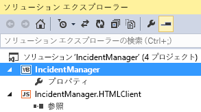

# クラウド ビジネス アドインを SharePoint に発行する
クラウド ビジネス アドインをプロバイダー向けのホスト型 SharePoint アドインとして発行できます。プロバイダー向けのホスト型アドインには、Web アドインとデータベースをオンプレミスの SharePoint サイト、Microsoft Azure、またはサードパーティがホストするサイトに展開する柔軟性があります。アドインを発行すれば、他のユーザーが各自のコンピューターやモバイル デバイスで SharePoint から実行できるようになります。WebDeploy を使用してアドインをサイトに直接発行することも、複数のサーバーに展開するアドインのパッケージを作成することもできます。
## アドインを発行するには

1. [ **ソリューション エクスプローラー**] で、図 1 のように、トップレベルのアプリケーション ノードのショートカット メニューを開き、[ **発行**] をクリックします。
    
   **図 1. トップレベル ノード**

  

     
  

  

  
2. LightSwitch アプリケーション発行ウィザードの、[ **SharePoint オプション**] ページで、[ **プロバイダー向けのホスト型**] オプション ボタンをクリックし、[ **次へ**] をクリックします。
    
  
3. [ **アプリケーション サーバーの構成**] ページで、[ **IIS サーバー**] オプション ボタンをクリックし、[ **次へ**] をクリックします。
    
    > **メモ**
      > 他のアドイン用に作成した発行設定 (.publishsettings または .pubxml) ファイルがある場合、そのファイルを使用して、発行に必要な残りの情報を指定できます。その場合、ウィザードで [ **設定のインポート**] ボタンをクリックしてください。 
4. [ **発行の出力**] ページで、[ **サーバーに直接発行する**] オプション ボタンをクリックして、[ **次へ**] をクリックします。
    
  
5. [ **発行の設定**] ページの [ **サービス URL**] テキスト ボックスに、アドインを発行するサーバーの URL を入力します。
    
    ホストする企業に発行する場合は、その企業がこの値を提供します。これは、次のいずれの形式でもかまいません。
    
  -  _HostingCompanyURL_ (たとえば、 `contoso.com`)
    
  
  -  `https://` _HostingCompanyURL_ (たとえば、 `https://contoso.com`)
    
  
  -  `https://` _HostingCompanyURL_ `:8172/msdeploy.axd` (たとえば、 `https://contoso.com:8172/msdeploy.axd`)
    
  

    テストのために自分のコンピューターのインターネット インフォメーション サービス (IIS) に発行する場合は、 `localhost` または自分のコンピューターの名前を入力してください。
    
    自分のネットワーク上のサーバーに公開する場合は、これらの URL のいずれかを入力します。
    
  -  `http://` _ServerName_
    
  
  -  `http://` _ServerName_ `/msdeployagentservice`
    
  

    > **メモ**
      > ファイアウォールを経由して公開する場合、ポート 8172 を開けなければならない場合があります。 
6. [ **サイト/アプリケーション**] テキスト ボックスに、IIS Web サイトとアドインの名前を入力します。
    
    ホスト企業に公開する場合は、その企業がこの値を提供します。通常は、ドメイン名 (たとえば、 `contoso.com`) かドメイン名とアドイン名 (たとえば、 `contoso.com/MyApp`) になります。
    
    テストのために自分のコンピューターの IIS に公開する場合、または内部ネットワークのサーバーに公開する場合、サイトとアドインの名前を IIS Manager に表示されるように入力します。たとえば、アドイン MyApp を IIS の既定の Web サイトに公開する場合は、「既定の Web サイト/MyApp」と入力します。
    
    > **メモ**
      > 既存の Web フォルダーに公開し、既存のコンテンツをすべて削除する場合は、[ **公開先のその他のファイルを削除する**] チェック ボックスをオンにします。 
7. [ **ユーザー名**] および [ **パスワード**] テキスト ボックスに、展開先の Web サーバーで展開タスクを行うのに十分の権限があるアカウントの資格情報を入力し、[ **次へ**] をクリックします。
    
    ホスト企業に公開する場合は、その企業がこれらの値を提供します。
    
  
8. [ **セキュリティ設定**] ページで、[ **はい、ユーザーは HTTPS を使って接続する必要があります**] オプション ボタンをクリックし、[ **次へ**] をクリックします。
    
  
9. [ **データ接続**] ページの [ **データベース接続**] タブで、アドインのデータベースを公開するデータベース サーバーの管理者接続文字列およびユーザー接続文字列を入力します。
    
    > **メモ**
      > データベースは、アドインを公開しているサーバーに配置する必要はありません。 
10. [ **アタッチされたデータ ソース**] タブで、必要に応じて追加の接続の接続文字列を更新し、[ **次へ**] をクリックします。
    
  
11. [ **プロバイダー ホスティング**] ページの [ **LightSwitch アプリケーションがホストされている場所**] テキスト ボックスに、アドインの完全 URL を入力します。
    
    ほとんどの場合、この URL は前の部分で入力した [ **サービス URL**] と [ **サイト/アプリケーション**] 値と同じです (たとえば、 `https://contoso.com/MyApplication`)。
    
  
12. アドインの [ **クライアント ID**] 値および [ **クライアント シークレット**] 値を入力します。
    
    これらの値は、使用する SharePoint サイトの [ **appregnew**] ページまたは販売者のダッシュボードから入手できます。詳しくは、「 [SharePoint アドイン 2013 を登録する](http://msdn.microsoft.com/ja-jp/library/office/jj687469%28v=office.15%29.aspx)」をご覧ください。
    
  
13. [ **発行**] を選択してアドインを発行します。
    
    アドインが発行されると、[ **ファイル エクスプローラー**] が開き、プロジェクトの [ **Publish**] ディレクトリを表示します。
    
  

## アドインをパッケージ化するには

1. [ **ソリューション エクスプローラー**] で、図 1 のように、トップレベル アプリケーション ノードのショートカット メニューを開き、[ **公開**] をクリックします。
    
   **図 1。トップレベル ノード**

  

     
  

    
    
  
2. LightSwitch アプリケーション発行ウィザードの、[ **SharePoint オプション**] ページで、[ **プロバイダーでホストされる**] オプション ボタンをクリックし、[ **次へ**] をクリックします。
    
  
3. [ **アプリケーション サーバーの構成**] ページで、[ **IIS サーバー**] オプション ボタンをクリックし、ます。[ **次へ**] をクリックします。
    
    > **メモ**
      > 他のアドイン用に作成した発行設定 (.publishsettings または .pubxml) ファイルがある場合、そのファイルを使用して、発行に必要な残りの情報を指定できます。その場合、ウィザードで [ **設定のインポート**] ボタンをクリックしてください。 
4. [ **発行の出力**] ページで、[ **パッケージをディスク上に作成する**] オプション ボタンをクリックして、[ **次へ**] をクリックします。
    
  
5. [ **公開設定**] ページの [ **Web サイトの名前**] テキスト ボックスに Web サイトの名前を入力します。
    
    既定の名前は、アドインの名前です。
    
  
6. [ **パッケージの作成場所**] テキスト ボックスに、出力を公開する場所のパスを入力し、[ **次へ**] をクリックします。
    
    既定の場所は、プロジェクト ディレクトリの [Publish] サブディレクトリです。
    
  
7. [ **セキュリティ設定**] ページで、[ **はい、ユーザーは HTTPS を使って接続する必要があります**] オプション ボタンをクリックし、[ **次へ**] をクリックします。
    
  
8. [ **データベース構成**] ページで、[ **次の名前で新しいデータベースを生成する**] オプション ボタンをクリックして、アドインの名前をデータベース名として入力します。
    
  
9. [ **アタッチされたデータ ソース**] タブをクリックし、必要に応じて追加の接続の接続文字列を更新し、[ **次へ**] をクリックします。
    
  
10. [ **プロバイダー ホスティング**] ページの [ **LightSwitch アプリケーションがホストされている場所**] テキスト ボックスに、アドインの完全 URL を入力します。
    
    ほとんどの場合、この URL は前の部分で入力した [ **サービス URL**] と [ **サイト/アプリケーション**] 値と同じです (たとえば、 `https://contoso.com/MyApplication`)。
    
  
11. アドインの [ **クライアント ID**] および [ **クライアント シークレット**] を入力します。
    
    これらの値は、使用する SharePoint サイトの [ **appregnew**] ページまたは販売者のダッシュボードから入手できます。詳しくは、「 [SharePoint アドイン 2013 を登録する](http://msdn.microsoft.com/ja-jp/library/office/jj687469%28v=office.15%29.aspx)」をご覧ください。
    
  
12. [ **発行**] を選択してアドインを発行します。
    
    アドインが発行されると、パッケージが入った .zip ファイルがステップ 4 で指定したディレクトリに置かれます。このパッケージが作成された後、サーバー管理者は MSDeploy ツールを使用して、IIS とSQL Server を実行しているサーバーにアドインを展開できます。
    
  

## その他の技術情報

-  [SharePoint アドイン 2013 を登録する](register-sharepoint-add-ins-2013.md)
    
  
-  [クラウド ビジネス アドインの発行](publish-cloud-business-add-ins.md)
    
  

