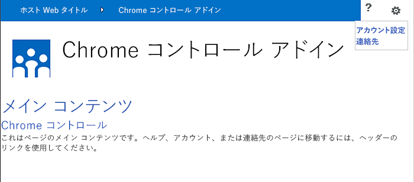
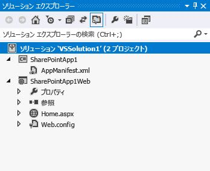
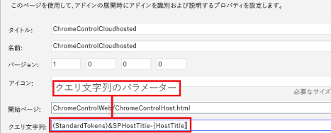
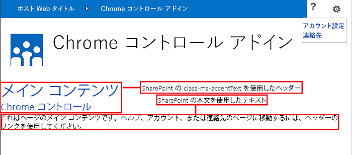

# SharePoint アドインのクライアント クロム コントロールを使用する
SharePoint 2013 アドインでクロム コントロールを使用する方法を説明します。
SharePoint 2013 でクロム コントロールを使用すると、サーバー ライブラリを登録したり、特定のテクノロジやツールを使用したりすることなく、アドインの特定の SharePoint サイトのヘッダー スタイルを使用できるようになります。この機能を使用するには、標準の <script> タグを介して SharePoint JavaScript ライブラリを登録する必要があります。プレースホルダーを指定するには、HTML の **div** 要素を使用します。また、用意されているオプションを使用して、さらにコントロールをカスタマイズできます。コントロールは、指定された SharePoint Web サイトの外観を継承します。
  
    
    


## この記事の例を使用するための前提条件
<a name="SP15Usechromecontrol_Prereq"> </a>

この例の手順を行うには、以下が必要です。
  
    
    

- Visual Studio 2015
    
  
- SharePoint 2013 開発環境 (オンプレミスのシナリオでは、アドインの分離が必要)
    
  
ニーズに合った開発環境をセットアップする方法については、「 [Office 用アプリおよび SharePoint 用アプリの作成を開始する](http://msdn.microsoft.com/library/187f8c8c-1b15-471c-80b5-69a40e67deea%28Office.15%29.aspx)」を参照してください。
  
    
    

### クロム コントロールを使用する前に知る必要がある中心概念

次の表に、クロム コントロールを使用するシナリオに関係する概念を理解するために役立つ記事を示します。
  
    
    

**表 1. クロム コントロールの使用に関する中心概念**


|**記事のタイトル**|**説明**|
|:-----|:-----|
| [SharePoint アドイン](sharepoint-add-ins.md) <br/> |エンドユーザー向けの小型で使いやすいソリューションであるアドインを作成できる、SharePoint 2013 の新しいアドイン モデルについて説明します。  <br/> |
| [SharePoint アドインの UX 設計](ux-design-for-sharepoint-add-ins.md) <br/> |SharePoint アドインの作成時に使用できるユーザー エクスペリエンス (UX) オプションと代替方法について説明します。  <br/> |
| [SharePoint 2013 のホスト Web、アドイン Web、および SharePoint コンポーネント](host-webs-add-in-webs-and-sharepoint-components-in-sharepoint-2013.md) <br/> |ホスト Web とアドイン Web の区別について説明します。SharePoint 2013 のどのコンポーネントを SharePoint アドイン に組み込むことができるか、どのコンポーネントがホスト Web に展開されるか、どのコンポーネントがアドイン Web に展開されるか、および分離ドメインにアドイン Web がどのように展開されるかがわかります。  <br/> |
   

## コード サンプル: クロム コントロールをクラウド ホスト型アドインで使用する
<a name="SP15Usechromecontrol_Codeexample"> </a>

クラウド ホスト型アドインには、少なくとも 1 つのリモート コンポーネントが含まれます。詳細については、「 [SharePoint アドインを開発およびホスティングするためのパターンを選択する](choose-patterns-for-developing-and-hosting-your-sharepoint-add-in.md)」を参照してください。クラウド ホスト型アドインでクロム コントロールを使用するには、次の手順に従います。
  
    
    

1. SharePoint アドイン プロジェクトとリモート Web プロジェクトを作成します。
    
  
2. 既定の構成オプションをクエリ文字列で送信します。
    
  
3. Web ページを Web プロジェクトに追加します。
    
  
図 1 に、クロム コントロールを使用するリモート Web ページを示します。
  
    
    

**図 1. クロム コントロールを使用するリモート Web ページ**

  
    
    

  
    
    

  
    
    

### SharePoint アドイン プロジェクトとリモート Web プロジェクトを作成する


1. 管理者として Visual Studio 2015 を開きます。(これを行うには、 **[スタート]** メニューの [Visual Studio 2015] アイコンを右クリックし、 **[管理者として実行]** を選択します。)
    
  
2. **SharePoint アドイン** テンプレートを使用して、新しいプロジェクトを作成します。
    
    図 2 は、 **[Office アドイン]**、 **[Office/SharePoint]**、 **[Visual C#]**、 **[テンプレート]** の下の Visual Studio 2015 の **SharePoint アドイン** テンプレートの場所を示しています。
    

   **図 2. SharePoint アドイン Visual Studio テンプレート**

  

     
  

  

  
3. デバッグに使用する SharePoint Web サイトの URL を入力します。
    
  
4. アドインのホスティング オプションとして [ **プロバイダー向けのホスト型**] を選択します。SharePoint ホスト型のコード サンプルについては、「 [SharePoint-Add-in-JSOM-BasicDataOperations](https://github.com/OfficeDev/SharePoint-Add-in-JSOM-BasicDataOperations)」を参照してください。
    
    ウィザードが終了すると、図 3 に示すような構造が **ソリューション エクスプローラー**に表示されます。
    

   **図 3. ソリューション エクスプローラーに表示された SharePoint 用アドイン プロジェクト**

  

     
  

  

  

### 既定の構成オプションをクエリ文字列で送信するには


1. マニフェスト エディターで Appmanifest.xml ファイルを開きます。
    
  
2. **{StandardTokens}** トークンと、追加の _SPHostTitle_ パラメーターをクエリ文字列に追加します。図 4 に、構成されたクエリ文字列パラメーターを表示しているマニフェスト エディターを示します。
    
   **図 4. クロム コントロール用のクエリ文字列パラメーターを表示しているマニフェスト エディター**

  

     
  

    クロム コントロールは、次の値をクエリ文字列から自動的に取得します。
    
  - **SPHostUrl**
    
  
  - **SPHostTitle**
    
  
  - **SPAppWebUrl**
    
  
  - **SPLanguage**
    
  

    **{StandardTokens}** には、 **SPHostUrl** と **SPAppWebUrl** が含まれます。
    
  

### クロム コントロールを使用するページを Web プロジェクトに追加するには


1. Web プロジェクトを右クリックし、新しい Web フォームを追加します。
    
  
2. 次のマークアップをコピーし、ASPX ページに貼り付けます。このマークアップは、以下のタスクを実行します。
    
  - Microsoft CDN (Content Delivery Network) から AJAX ライブラリを読み込みます。
    
  
  - Microsoft CDN から jQuery ライブラリを読み込みます。
    
  
  - jQuery 関数を使用して SP.UI.Controls.js ファイルを読み込みます。 **getScript**.
    
  
  - **onCssLoaded** イベントのコールバック関数を定義します。
    
  
  - クロム コントロール用のオプションを準備します。
    
  
  - クロム コントロールを初期化します。
    
  

 ```HTML
  
<!DOCTYPE html>
<html xmlns="http://www.w3.org/1999/xhtml">
<head>
    <title>Chrome control host page</title>
    <script 
        src="//ajax.aspnetcdn.com/ajax/4.0/1/MicrosoftAjax.js" 
        type="text/javascript">
    </script>
    <script 
        type="text/javascript" 
        src="//ajax.aspnetcdn.com/ajax/jQuery/jquery-1.7.2.min.js">
    </script>      
    <script 
        type="text/javascript"
        src="ChromeLoader.js">
    </script>
<script type="text/javascript">
"use strict";

var hostweburl;

//load the SharePoint resources
$(document).ready(function () {
    //Get the URI decoded URL.
    hostweburl =
        decodeURIComponent(
            getQueryStringParameter("SPHostUrl")
    );

    // The SharePoint js files URL are in the form:
    // web_url/_layouts/15/resource
    var scriptbase = hostweburl + "/_layouts/15/";

    // Load the js file and continue to the 
    //   success handler
    $.getScript(scriptbase + "SP.UI.Controls.js", renderChrome)
});

// Callback for the onCssLoaded event defined
//  in the options object of the chrome control
function chromeLoaded() {
    // When the page has loaded the required
    //  resources for the chrome control,
    //  display the page body.
    $("body").show();
}

//Function to prepare the options and render the control
function renderChrome() {
    // The Help, Account and Contact pages receive the 
    //   same query string parameters as the main page
    var options = {
        "appIconUrl": "siteicon.png",
        "appTitle": "Chrome control add-in",
        "appHelpPageUrl": "Help.html?"
            + document.URL.split("?")[1],
        // The onCssLoaded event allows you to 
        //  specify a callback to execute when the
        //  chrome resources have been loaded.
        "onCssLoaded": "chromeLoaded()",
        "settingsLinks": [
            {
                "linkUrl": "Account.html?"
                    + document.URL.split("?")[1],
                "displayName": "Account settings"
            },
            {
                "linkUrl": "Contact.html?"
                    + document.URL.split("?")[1],
                "displayName": "Contact us"
            }
        ]
    };

    var nav = new SP.UI.Controls.Navigation(
                            "chrome_ctrl_placeholder",
                            options
                        );
    nav.setVisible(true);
}

// Function to retrieve a query string value.
// For production purposes you may want to use
//  a library to handle the query string.
function getQueryStringParameter(paramToRetrieve) {
    var params =
        document.URL.split("?")[1].split("&amp;");
    var strParams = "";
    for (var i = 0; i < params.length; i = i + 1) {
        var singleParam = params[i].split("=");
        if (singleParam[0] == paramToRetrieve)
            return singleParam[1];
    }
}
</script>
</head>

<!-- The body is initally hidden. 
     The onCssLoaded callback allows you to 
     display the content after the required
     resources for the chrome control have
     been loaded.  -->
<body style="display: none">

    <!-- Chrome control placeholder -->
    <div id="chrome_ctrl_placeholder"></div>

    <!-- The chrome control also makes the SharePoint
          Website stylesheet available to your page -->
    <h1 class="ms-accentText">Main content</h1>
    <h2 class="ms-accentText">The chrome control</h2>
    <div id="MainContent">
        This is the page's main content. 
        You can use the links in the header to go to the help, 
        account or contact pages.
    </div>
</body>
</html>
 ```

3. クロム コントロールは、宣言する方法でも使用できます。次のコード サンプルの HTML マークアップでは、構成と初期化を行う JavaScript コードを使用しないでコントロールを宣言しています。このマークアップは、以下のタスクを実行します。
    
  - JavaScript ファイル SP.UI.Controls.js のプレースホルダーを用意します。
    
  
  - SP.UI.Controls.js ファイルを動的に読み込みます。
    
  
  - クロム コントロール用のプレースホルダーを用意し、HTML マークアップを使用してオプションをインラインで指定します。
    
  

 ```HTML
  
<!DOCTYPE html>
<html xmlns="http://www.w3.org/1999/xhtml">
<head>
    <title>Chrome control host page</title>
    <script 
        src="http://ajax.aspnetcdn.com/ajax/4.0/1/MicrosoftAjax.js" 
        type="text/javascript">
    </script>
    <script 
        type="text/javascript" 
        src="http://ajax.aspnetcdn.com/ajax/jQuery/jquery-1.7.2.min.js">
    </script>      
    <script type="text/javascript">
    var hostweburl;

    // Load the SharePoint resources.
    $(document).ready(function () {

        // Get the URI decoded add-in web URL.
        hostweburl =
            decodeURIComponent(
                getQueryStringParameter("SPHostUrl")
        );

        // The SharePoint js files URL are in the form:
        // web_url/_layouts/15/resource.js
        var scriptbase = hostweburl + "/_layouts/15/";

        // Load the js file and continue to the 
        // success handler.
        $.getScript(scriptbase + "SP.UI.Controls.js")
    });

    // Function to retrieve a query string value.
    // For production purposes you may want to use
    // a library to handle the query string.
    function getQueryStringParameter(paramToRetrieve) {
        var params =
            document.URL.split("?")[1].split("&amp;");
        var strParams = "";
        for (var i = 0; i < params.length; i = i + 1) {
            var singleParam = params[i].split("=");
            if (singleParam[0] == paramToRetrieve)
                return singleParam[1];
        }
    }
    </script>
</head>
<body>

    <!-- Chrome control placeholder 
           Options are declared inline.  -->
    <div 
        id="chrome_ctrl_container"
        data-ms-control="SP.UI.Controls.Navigation"  
        data-ms-options=
            '{  
                "appHelpPageUrl" : "Help.html",
                "appIconUrl" : "siteIcon.png",
                "appTitle" : "Chrome control add-in",
                "settingsLinks" : [
                    {
                        "linkUrl" : "Account.html",
                        "displayName" : "Account settings"
                    },
                    {
                        "linkUrl" : "Contact.html",
                        "displayName" : "Contact us"
                    }
                ]
             }'>
    </div>
    
    <!-- The chrome control also makes the SharePoint
          Website style sheet available to your page. -->
    <h1 class="ms-accentText">Main content</h1>
    <h2 class="ms-accentText">The chrome control</h2>
    <div id="MainContent">
        This is the page's main content. 
        You can use the links in the header to go to the help, 
        account or contact pages.
    </div>
</body>
</html>
 ```


    SP.UI.Controls.js ライブラリは、 **div** 要素の **data-ms-control="SP.UI.Controls.Navigation"** 属性を検出した場合は、自動的にコントロールをレンダリングします。
    
  

### アドイン マニフェストの StartPage 要素を編集するには


1. **ソリューション エクスプローラー**で、 **AppManifest.xml** ファイルをダブルクリックします。
    
  
2. [ **スタート ページ**] ドロップダウン メニューで、クロム コントロールを使用する Web ページを選択します。
    
  

### ソリューションを構築して実行するには


1. SharePoint アドイン プロジェクトがスタートアップ プロジェクトとして設定さていることを確認します。
    
  
2. F5 キーを押します。
    
    > **メモ**
      > F5 キーを押すと、Visual Studio によってソリューションが構築され、アドインが展開され、アドインのアクセス許可ページが表示されます。 
3. [ **信頼する**] ボタンをクリックします。
    
  
4. [ **ChromeControlCloudhosted**] アドイン アイコンをクリックします。
    
  
5. クロム コントロールを Web ページで使用するときは、図 4 に示すように、SharePoint Web サイト スタイルシートも使用できます。
    
   **図 5. ページで使用されている SharePoint Web サイト スタイル シート**

  

     
  

  

  

**表 2. ソリューションのトラブルシューティング**


|**問題**|**解決策**|
|:-----|:-----|
|" **SP は定義されていません。** " というハンドルされない例外が発生します。 <br/> |ブラウザーで SP.UI.Controls.js ファイルを読み込んでください。  <br/> |
|Chrome コントロールは正しくレンダリングされません。  <br/> |Chrome コントロールは、Internet Explorer 8 以降のドキュメント モードのみをサポートしています。Internet Explorer 8 以降のブラウザーのドキュメント モードでページをレンダリングしてください。  <br/> |
|証明書エラー。  <br/> |Web プロジェクトの [ **SSL 有効** ] プロパティを false に設定します。SharePoint アドイン プロジェクトで、[ **Web プロジェクト** ] プロパティを [なし] に設定し、プロパティを Web プロジェクトの名前に戻します。  <br/> |
   

## 次の手順
<a name="SP15Usechromecontrol_Nextsteps"> </a>

この記事では、SharePoint アドイン でクロム コントロールを使用する方法を示しました。次の手順として、SharePoint アドイン で使用できるその他の UX コンポーネントについて学習できます。さらに学習するには、以下を参照してください。
  
    
    

-  [コード サンプル: クラウド ホスト型アドインでクロム コントロールを使用する](http://code.msdn.microsoft.com/SharePoint-2013-Work-with-089ecc6f)
    
  
-  [Code sample: Use the chrome control and the cross-domain library (CSOM) (コード サンプル: クロム コントロールとクロス ドメイン ライブラリを使用する (CSOM) )](http://code.msdn.microsoft.com/SharePoint-2013-Use-the-97c30a2e)
    
  
-  [コード サンプル: クロム コントロールとクロス ドメイン ライブラリ (REST) を使用する](http://code.msdn.microsoft.com/SharePoint-2013-Use-the-a759e9f8)
    
  
-  [SharePoint アドインで SharePoint Web サイトのスタイル シートを使用する](use-a-sharepoint-website-s-style-sheet-in-sharepoint-add-ins.md)
    
  
-  [カスタム アクションを作成して SharePoint アドインで展開する](create-custom-actions-to-deploy-with-sharepoint-add-ins.md)
    
  
-  [アドイン パーツを作成して SharePoint アドインと共にインストールする](create-add-in-parts-to-install-with-your-sharepoint-add-in.md)
    
  

## その他の技術情報
<a name="SP15Usechromecontrol_Addresources"> </a>


-  [SharePoint アドインのオンプレミスの開発環境をセットアップする](set-up-an-on-premises-development-environment-for-sharepoint-add-ins.md)
    
  
-  [SharePoint アドインの UX 設計](ux-design-for-sharepoint-add-ins.md)
    
  
-  [SharePoint アドインの UX 設計ガイドライン](sharepoint-add-ins-ux-design-guidelines.md)
    
  
-  [SharePoint 2013 での UX コンポーネントの作成](create-ux-components-in-sharepoint-2013.md)
    
  
-  [SharePoint アドインの設計オプションを考慮するときの 3 つの方法](three-ways-to-think-about-design-options-for-sharepoint-add-ins.md)
    
  
-  [SharePoint アドインのアーキテクチャおよび開発環境に関する重要な要素](important-aspects-of-the-sharepoint-add-in-architecture-and-development-landscap.md)
    
  

