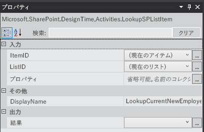
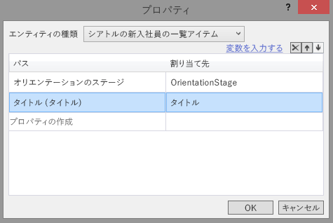
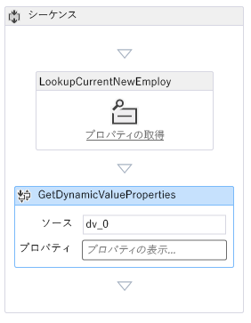
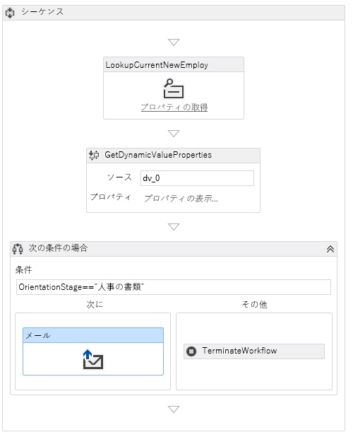
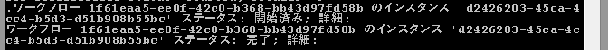
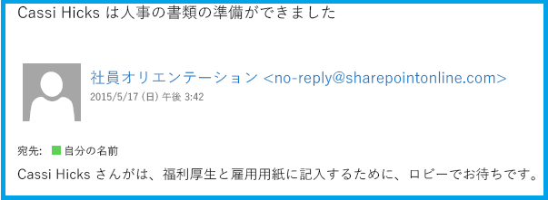

# SharePoint ホスト型 SharePoint アドインにワークフローを追加する
SharePoint アドインにワークフローを含める方法について説明します。
これは、SharePoint ホスト型の SharePoint アドインの開発の基本に関する記事のシリーズの 6 番目です。 [SharePoint アドイン](sharepoint-add-ins.md) とこのシリーズの前の記事をよく理解しておいてください。
  
    
    

-  [SharePoint ホスト型の SharePoint アドインの作成を始める](get-started-creating-sharepoint-hosted-sharepoint-add-ins.md)
    
  
-  [SharePoint 用の SharePoint ホスト型アドインを展開してインストールする](deploy-and-install-a-sharepoint-hosted-sharepoint-add-in.md)
    
  
-  [SharePoint 用の SharePoint ホスト型アドインにカスタム列を追加する](add-custom-columns-to-a-sharepoint-hostedsharepoint-add-in.md)
    
  
-  [SharePoint ホスト型 SharePoint アドインにカスタム コンテンツ タイプを追加する](add-a-custom-content-type-to-a-sharepoint-hostedsharepoint-add-in.md)
    
  
-  [SharePoint ホスト型 SharePoint アドイン内のページに Web パーツを追加する](add-a-web-part-to-a-page-in-a-sharepoint-hosted-sharepoint-add-in.md)
    
  

> [!メモ]
> SharePoint ホスト型アドインに関するこのシリーズを学習している場合は、このトピックを続行するために利用できる Visual Studio ソリューションがあります。また、 [SharePoint_SP-hosted_Add-Ins_Tutorials](https://github.com/OfficeDev/SharePoint_SP-hosted_Add-Ins_Tutorials) でリポジトリをダウンロードして、BeforeWorkflow.sln ファイルを開くこともできます。
  
    
    

この記事では、新入社員が人事書類に記入する準備ができたおことを人事 (HR) 部門に通知する新入社員オリエンテーション ワークフロー SharePoint アドイン を追加します。
## ワークフローをアドインに追加する

  
    
    

1. [ **ソリューション エクスプローラー**] で、プロジェクトを右クリックして [ **追加**] > [ **新しいフォルダー**] を選択します。フォルダーに Workflows という名前を付けます。
    
  
2. 新しいフォルダーを右クリックして、[ **追加**] > [ **新しい項目**] を選択します。[ **新しい項目の追加**] ダイアログで [ **Office/SharePoint**] の各ノードを開きます。
    
  
3. [ **ワークフロー**] を選択し、HR_Intake という名前を付けます。ワークフローの種類の選択を求められたら、[ **リスト ワークフロー**] を選択し、[ **次へ**] を選択します。
    
  
4. ウィザードの次のページで、[ **はい...関連付けます**] オプションを有効にして、ドロップダウン コントロールを次の値に設定します。
    
  - **ワークフローを関連付けるライブラリまたはリスト**
    
    New Employees in Seattle
    
  
  - **履歴リスト...**
    
    <新規作成>
    
  
  - **タスク リスト**
    
    <新規作成>
    
  

    [ **次へ**] をクリックします。
    
  
5. ウィザードの最後のページで、項目が *変更された*  場合にワークフローを自動的に開始するオプション *のみ*  を有効にします。
    
  
6. [ **完了**] を選択します。
    
    Office Developer Tools for Visual Studio が次の処理を実行します。
    
  - HR_Intake ワークフローを、ワークフロー デザイナーで開いている子 Workflow.xaml ファイルと共に **Workflow** フォルダーに作成します。
    
  
  - ワークフローの一部であるタスクが作成および更新される **WorkflowTaskList** リスト インスタンスを作成します。
    
  
  - **WorkflowHistoryList** リスト インスタンスを作成します。これは、ワークフローが実行されるたびに、様々な手順を記録するログです。
    
  
7. 2 つの新しいリスト インスタンスを **Lists** フォルダーにドラッグします。
    
  

## ワークフローを設計する

ワークフローは、電子メールを送信し、新入社員がオリエンテーションの **建物のツアー**のステージを終了し、人事採用書類に記入する準備ができたことを HR のスタッフに通知します。New Employees in Seattle リストの既存の項目に変更を加えると、ワークフローがトリガーされますが、ワークフローはリスト項目の [オリエンテーションのステージ] フィールドが「HR の書類」に設定されていない限り、何もしません。設定されると、電子メールが HR スタッフに送信され、従業員のタスクが **WorkflowTaskList** に追加されます。
  
    
    

> [!メモ]
> ワークフローの設計のさまざまなタイミングで、内側に感嘆符がある青いダイヤ型の記号 
  
    
    

  
    
    
がワークフロー デザイナーの 1 つ以上の項目に表示されます。これらは一時的なエラーを示します。(カーソルを記号の上に移動すると、短いメッセージが表示されます。詳細 Visual Studio の [ **エラー一覧**] を参照。) これらは不完全なワークフローの副作用です。この手順を終了すると、これらはすべて解決されるはずです。 
  
    
    

1. Visual Studio で [ **ツールボックス**] ペインを開き、[ **SharePoint - リスト**] ノードを展開して、デザイナーで **LookupSPListItem** を **Sequence** にドラッグします。
    
  
2. **LookupSPListItem** を選択し、プロパティが Visual Studio の [ **プロパティ**] ペインに表示されるようにします。次のプロパティを以下の値に設定します。
    
  - **ItemID:** (現在の項目)
    
  
  - **ListID:** (現在のリスト)
    
  
  - **DisplayName:** LookupCurrentNewEmployee
    
  

    [ **プロパティ**] ペインは、次のようになります。
    

   **LookupSPListItem のプロパティ ペイン**

  

     
  

    ウィンドウの外側の任意の場所をクリックして変更内容を保存すると、デザイナー画面は次のようになります。
    

   **ワークフロー デザイナのシーケンス**

  

     ![[シーケンス] ボックスのあるワークフロー デザイナーで、その中には、「現在の新入社員を確認する」という名前のアクティビティがあります。](images/c8fbf801-e8e4-444a-9d2e-c14e29f537de.PNG)
  

    
    
  
3. デザイナーの (新しく名前が変更された) LookupCurrentNewEmployee アクティビティの内側にある [ **プロパティを取得**] リンクをクリックします。これにより、シーケンスに **GetDynamicValueProperties** アクティビティが追加されます。
    
  
4. **GetDynamicValueProperties** アクティビティの [ **定義…**] テキストをクリックします。これにより [ **プロパティ**] ダイアログが表示されます。
    
  
5. [ **エンティティ型**] を  _list_instance_name_ の [ **リスト項目**] に設定します。 _list_instance_name_ はNew Employees in Seattle になります。
    
  
6. [ **パス**] 列で、一番上のセルをクリックして、ドロップダウンからオリエンテーションのステージを選択します。
    
  
7. 下のセルをクリックして、ドロップダウンから [ **タイトル (タイトル)**] を選択します。
    
  
8. [ **変数の読み込み**] をクリックします。これにより、OrientationStage と **Title** という名前の変数が作成され、New Employees in Seattle リストの現在の項目に、該当するフィールドの値がそれぞれ割り当てられます。[ **プロパティ**] ダイアログは、次のようになります。
    
   **ワークフロー アクティビティの [プロパティ] ダイアログ**

  

     
  

  

  
9. [ **OK**] を選択します。デザイナーの外観は、次のようになります。
    
   **ワークフロー デザイナー**

  

     
  

    
    
  
10. Visual Studio で [ **ツールボックス**] ペインを開き、[ **制御フロー**] ノードを展開して、 **If** を **GetDynamicValueProperties** の下の **Sequence** の下にドラッグします。
    
  
11. **If** の [ **条件**] ボックスで、「OrientationStage=="HR paperwork"」と入力します。
    
  
12. Visual Studio で [ **ツールボックス**] ペインを開き、[ **SharePoint - ユーティリティ**] ノードを展開して、[ **電子メール**] を **If** アクティビティの [ **Then**] ボックスにドラッグします。
    
  
13. **電子メール**のアクティビティを選択します。[ **プロパティ**] ペインで、Body、Subject、および To プロパティの値を設定します。それぞれのプロパティで吹き出しボタン ( **. . .**) を選択して、表示される **式エディター**を使用し、プロパティの値を後の表のように設定します。これらは C# 文字列式なので、引用符を表に示すとおりに使用してください。ここの  `Title` は、リスト項目の [ **Title**] フィールドで以前割り当てた変数です (従業員の名前を保持しています)。
    
  - **Body:** `Title + " is waiting in the lobby to fill out benefits and employment forms."`
    
  
  - **Subject:** `Title + " is ready for HR paperwork"`
    
  
  - **To:** `new System.Collections.ObjectModel.Collection<string>() {"your_O365_email"}`
    
    プレースホルダ  *your_O365_email*  を、Office 365 開発者アカウントでログインに使用している ID ( *alias*  @ *O365domain*  .sharepoint.com など) に置き換えます。これは C# 文字列なので、引用符で囲む必要があります。
    
  
14. Visual Studio で [ **ツールボックス**] ペインを開き、[ **ランタイム**] ノードを展開して、[ **TerminateWorkflow**] を **If** アクティビティの [ **Else**] ボックスにドラッグします。
    
  
15. **TerminateWorkflow** アクティビティを選択して、[ **プロパティ**] ペインで [ **理由**] を *引用符も含めて*  次のように設定します。"Not at HR paperwork stage."。デザイナーは次のようになります。
    
   **ワークフローが完了したときのワークフロー デザイナー**

  

     
  

  

  

## アドインを実行してテストする

  
    
    

1. F5 キーを使用してアドインを展開して実行します。Visual Studio により、テスト用の SharePoint サイトにアドインが一時的にインストールされ、すぐにアドインが実行されます。ワークフロー マネージャーの **Test Service Host** コンソールも開きます。
    
  
2. アドインの既定のページが開くとき、編集用に項目の 1 つが開くので、オリエンテーションのステージの値を人事書類に設定します。 
    
    **Test Service Host** コンソールで、ワークフローが開始されたことが示されます。その後すぐに、ワークフローが完了したことが示されます。例を次に示します。
    

   **Service Test Host コンソール**

  

     
  

    
    
    
    > [!メモ]
      > **Test Service Host** コンソールが開かない場合は、ワークフローのデバッグを有効にする必要があります。 **ソリューション エクスプローラー**でプロジェクトの名前を右クリックして、[ **プロパティ**] を選択します。[ **プロパティ**] ペインの [ **SharePoint**] タブを開き、[ **ワークフロー デバッグの有効化**] ボックスをオンにします。 
3. Office 365 開発者アカウントの電子メールの受信ボックス (Outlook) に移動します。" *Employee*  is ready for HR paperwork." という件名の電子メールがあります。 *Employee*  は項目を編集した従業員の名前です。電子メールの本文には、" *Employee*  is waiting in the lobby to fill out benefits and employment forms." と記載されています。例を次に示します。
    
   **ワークフローによって送信された電子メール**

  

     
  

    
    
    
    > [!ヒント]
      > ワークフローが開始しても完了せず、電子メールが送信されない場合は、デバッグ セッションを終了して、コードに問題があると判断する前に、さらに F5 キーを数回押してみてください。問題が SharePoint Online にある場合があります。 > それでも問題が解決しないときは、 **ListFieldsContentType** というコンテンツ タイプがない場合は schema.xml ファイルの **ContentTypes** セクションに追加します。マークアップの例を次に示します。>  `<ContentType ID="0x0100781dd48170b94fdc9706313c82b3d04c" Name="ListFieldsContentType" Hidden="TRUE">`
  
    
    
 `</ContentType>`> **NewEmployee** コンテンツ タイプの **FieldRefs** セクション全体をこの新しいコンテンツ タイプにコピーします。> プロジェクトを保存し、取り消してから、F5 キーをもう一度試してください。 
4. デバッグ セッションを終了するには、ブラウザー ウィンドウを閉じるか、Visual Studio でデバッグを停止します。F5 を押すたびに、Visual Studio は以前のバージョンのアドインを取り消し、最新のアドインをインストールします。
    
  
5. このアドインおよび他の記事の Visual Studio ソリューションを操作し、それが終了したら前回のアドインを取り消すとよいでしょう。[ **ソリューション エクスプローラー**] のプロジェクトを右クリックして、[ **取り消し**] を選択します。
    
  

## 

このシリーズの次の記事では、カスタム ページとスタイルをSharePoint アドイン [SharePoint ホスト型 SharePoint アドインにカスタム ページとスタイルを追加する](add-a-custom-page-and-style-to-a-sharepoint-hosted-sharepoint-add-in.md) に追加します。
  
    
    

