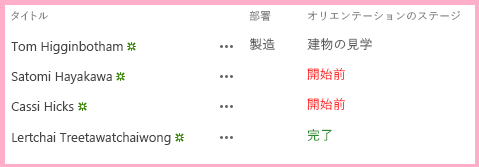

# SharePoint ホスト型 SharePoint アドインにカスタムのクライアント側レンダリングを追加する
SharePoint アドイン ページ でコントロールのレンダリングと検証をカスタマイズします。
これは、SharePoint ホスト型の SharePoint アドインの開発の基本に関する記事のシリーズの 8 番目です。 [SharePoint アドイン](sharepoint-add-ins.md) とこのシリーズの前の記事をよく理解しておいてください。


-  [SharePoint ホスト型の SharePoint アドインの作成を始める](get-started-creating-sharepoint-hosted-sharepoint-add-ins.md)


-  [SharePoint 用の SharePoint ホスト型アドインを展開してインストールする](deploy-and-install-a-sharepoint-hosted-sharepoint-add-in.md)


-  [SharePoint 用の SharePoint ホスト型アドインにカスタム列を追加する](add-custom-columns-to-a-sharepoint-hostedsharepoint-add-in.md)


-  [SharePoint ホスト型 SharePoint アドインにカスタム コンテンツ タイプを追加する](add-a-custom-content-type-to-a-sharepoint-hostedsharepoint-add-in.md)


-  [SharePoint ホスト型 SharePoint アドイン内のページに Web パーツを追加する](add-a-web-part-to-a-page-in-a-sharepoint-hosted-sharepoint-add-in.md)


-  [SharePoint ホスト型 SharePoint アドインにワークフローを追加する](add-a-workflow-to-a-sharepoint-hosted-sharepoint-add-in.md)


-  [SharePoint ホスト型 SharePoint アドインにカスタム ページとスタイルを追加する](add-a-custom-page-and-style-to-a-sharepoint-hosted-sharepoint-add-in.md)


> **メモ**
> SharePoint ホスト型アドインに関するこのシリーズを学習している場合は、このトピックを続行するために利用できる Visual Studio ソリューションがあります。また、 [SharePoint_SP-hosted_Add-Ins_Tutorials](https://github.com/OfficeDev/SharePoint_SP-hosted_Add-Ins_Tutorials) でリポジトリをダウンロードして、BeforeClientRenderedControl.sln ファイルを開くこともできます。


簡単なクライアント側の JavaScript を使用して、Web パーツのレンダリング、ほとんどのタイプのフィールド (列)、およびその他のいくつかのコントロールをカスタマイズできます。これは、 **SPField.JSLink** など、コントロールの **JSLink** プロパティに JavaScript ファイルを割り当てることで行います。また、クライアント側の検証ロジックをこの方法で追加することもできます。この記事では、クライアント側のレンダリングを使用することで、新入社員オリエンテーション SharePoint アドイン のリストにあるフィールドのレンダリングをカスタマイズします。
> **メモ**
> エンドユーザーのブラウザーで JavaScript が無効になっている場合、SharePoint はサーバー側のレンダリングと検証にフォールバックします。 


> **メモ**
> JSLink プロパティは、アンケート リストやイベント リストではサポートされません。SharePoint の予定表は、イベント リストです。 


## JavaScript の作成と登録


1. **ソリューション エクスプローラー**で、[ **スクリプト**] ノードを右クリックして、[ **追加**] > [ **新しい項目**] > [Web] を選択します。


2. [ **JavaScript ファイル**] を選択して、OrientationStageRendering.js という名前を付けます。


3. フィールドのカスタム レンダリングが自動的に行われる必要があるため、次のコードを使用して、ファイルが読み込まれるときに自動的に実行される匿名メソッドを JavaScript に追加します。

 ```

(function () {

})();
 ```

4. このメソッドの本文 ({ } 文字の間) で、次のコードを追加し、レンダリング上書きコンテキストの JSON (Javascript Object Notation) オブジェクト、コンテキストのテンプレート、フィールドのテンプレートを作成します。

 ```

var customRenderingOverride = {};
customRenderingOverride.Templates = {};
customRenderingOverride.Templates.Fields = {

}
 ```

5.  `Fields` テンプレート オブジェクトの本文で、次の JSON を追加します。プロパティ名 `OrientationStage` は、カスタマイズされたレンダリングを持つフィールドを識別します。プロパティの値は、別の JSON オブジェクトです。 `View` プロパティは、カスタム レンダリングが適用されるページのコンテキストを特定します。この場合、オブジェクトはリスト ビューでカスタマイズされたレンダリングを使用するよう SharePoint に通知します。(その他のオプションは、編集、新規作成、表示フォーム用です)。プロパティの値 `renderOrientationStage` は、後の手順で作成するカスタム レンダリング メソッドの名前です。

 ```

"OrientationStage": { "View": renderOrientationStage }
 ```

6. 匿名メソッドが実行すべき最後の処理は、SharePoint のテンプレート マネージャーへのレンダリングの上書きについての通知です。次の行をメソッドの本文の終わりに追加します。

 ```
  SPClientTemplates.TemplateManager.RegisterTemplateOverrides(customRenderingOverride);
 ```


メソッドは、次のようになります。


 ```
  (function () {
    var customRenderingOverride = {};
    customRenderingOverride.Templates = {};
    customRenderingOverride.Templates.Fields = {
        "OrientationStage": { "View": renderOrientationStage }
    }

    SPClientTemplates.TemplateManager.RegisterTemplateOverrides(customRenderingOverride);
})();
 ```

7. 次のメソッドをファイルに追加します。 [ **オリエンテーション ステージ**] 列の色を、値が「未開始」の場合は赤、値が[完了] の場合は緑に設定します。( `ctx` オブジェクトは、組み込みの SharePoint スクリプトで宣言されるクライアントのコンテキスト オブジェクトです。)

 ```

function renderOrientationStage(ctx) {
    var orientationStageValue = ctx.CurrentItem[ctx.CurrentFieldSchema.Name];
    if (orientationStageValue == "Not Started")  {
        return "<span style='color:red'>" + orientationStageValue + "</span>"
    }
    else if (orientationStageValue == "Completed") {
        return "<span style='color:green'>" + orientationStageValue + "</span>"
    }
    else {
        return orientationStageValue;
    }
}
 ```

8. **ソリューション エクスプローラー**で、[ **サイト列**]、次に [ **オリエンテーション ステージ**] を展開し、elements.xml ファイルを開きます。


9. SharePoint にカスタム JavaScript を使用するよう指示するには、新しい属性 **JSLink** を **Field** 要素に追加して、次の URL を値として割り当てます。 `~site/Scripts/OrientationStageRendering.js`

    > **メモ**
      > **JSLink** プロパティは、常にメソッドではなくファイルです。SharePoint にどのメソッドを実行するか指示する方法はありません。このため、自動的に動作するメソッドがファイルに含まれます。

    **Field** 要素の開始タグは、次のようになります。


 ```

<Field
       ID="{some_guid_here}"
       Name="OrientationStage"
       Title="OrientationStage"
       DisplayName="Orientation Stage"
       Description="The current orientation stage of the employee."
       Type="Choice"
       Required="TRUE"
       Group="Employee Orientation" 
       JSLink="~site/Scripts/OrientationStageRendering.js">
<!-- child elements and end tag omitted -->
 ```

10. Default.aspx ページを開き、 **ContentPlaceHolderID** が **PlaceHolderMain** に設定されている **asp:Content** 要素の最後の子として次のコードを追加します。

 ```XML

<p><asp:HyperLink runat="server" NavigateUrl="JavaScript:window.location = _spPageContextInfo.webAbsoluteUrl + '/Lists/NewEmployeesInSeattle/AllItems.aspx';"
    Text="List View Page for New Employees in Seattle" /></p>

 ```


## アドインを実行してテストする


1. F5 キーを使用して、アドインを展開して実行します。Visual Studio が、テスト用 SharePoint サイトにアドインを一時的にインストールして、すぐにアドインを実行します。 


2. 構成したクライアント側のレンダリングは、ホームページに配置したリスト ビュー Web パーツではなく、リスト ビュー ページのフィールドのレンダリングのみに影響します。これは、Web パーツがサーバー側のレンダリングに既定で設定されているためです。これを取り消す方法がありますが、このシンプルな例には高度すぎます。このため、実行中のクライアント側のレンダリングを確認するために、[ **シアトルの新入社員のリスト ビュー ページ**] ページの下部にあるリンクをクリックします。


3. リスト ビュー ページが開いたら、いくつかの項目の [ **オリエンテーション ステージ**] の値を [ **未開始**] に設定し、他の値を [ **完了**] に設定して、カスタム カラー レンダリングを確認します。 

   **カスタムのクライアント側レンダリングのリスト**





4. デバッグ セッションを終了するには、ブラウザー ウィンドウを閉じるか、Visual Studio でデバッグを停止します。F5 を押すたびに、Visual Studio は以前のバージョンのアドインを取り消し、最新のアドインをインストールします。


5. このアドインおよび他の記事の Visual Studio ソリューションを操作し、それが終了したら前回のアドインを取り消すとよいでしょう。 **ソリューション エクスプローラー**のプロジェクトを右クリックして、[ **取り消し**] を選択します。


## 
<a name="Nextsteps"> </a>

このシリーズの次の記事では、カスタム メニュー項目とカスタム ボタンを SharePoint アドイン:  [SharePoint アドインのホスト Web にカスタムのリボンのボタンを作成する](create-a-custom-ribbon-button-in-the-host-web-of-a-sharepoint-add-in.md) のリボンに追加します。


