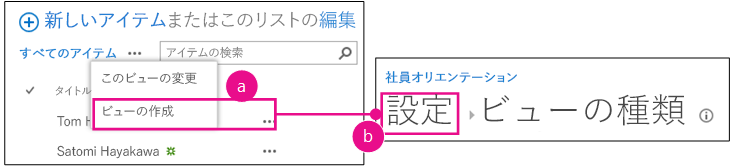

# SharePoint 用の SharePoint ホスト型アドインにカスタム列を追加する
SharePoint アドインにカスタム列を含める方法について説明します。
これは、SharePoint ホスト型の SharePoint アドインの開発の基本に関する記事のシリーズの 3 番目です。 [SharePoint アドイン](sharepoint-add-ins.md) とこのシリーズの前の記事をよく理解しておいてください。
  
    
    


-  [SharePoint ホスト型の SharePoint アドインの作成を始める](get-started-creating-sharepoint-hosted-sharepoint-add-ins.md)
    
  
-  [SharePoint 用の SharePoint ホスト型アドインを展開してインストールする](deploy-and-install-a-sharepoint-hosted-sharepoint-add-in.md)
    
  

> [!メモ]
> SharePoint ホスト型アドインに関するこのシリーズを学習している場合は、このトピックを続行するために利用できる Visual Studio ソリューションがあります。また、 [SharePoint_SP-hosted_Add-Ins_Tutorials](https://github.com/OfficeDev/SharePoint_SP-hosted_Add-Ins_Tutorials) でリポジトリをダウンロードして、BeforeColumns.sln ファイルを開くこともできます。
  
    
    

この記事では、新入社員オリエンテーション SharePoint アドインにいくつかのサイト列を追加することでコーディングに戻ります。
## カスタムの列の種類を作成します。


  
    
    

1. [ **ソリューション エクスプローラー**] で、プロジェクトを右クリックして [ **追加**] > [ **新しいフォルダー**] を選択します。フォルダーに Site Columns という名前を付けます。
    
  
2. 新しいフォルダーを右クリックして、[ **追加**] > [ **新しい項目**] を選択します。[ **新しい項目の追加**] ダイアログで [ **Office/SharePoint**] の各ノードを開きます。
    
  
3. [ **サイト列**] を選択して、Division という名前を付け、[ **追加**] を選択します。
    
  
4. 新しいサイト列の elements.xml ファイルで、以下の例に示す属性と値を持つよう **Field** 要素を編集します。ただし、Visual Studio が生成した値から **ID** 属性の *GUID を変更 **しないでください*** 。このため、 *コピーして貼り付けを使用するときは注意してください*  。
    
  ```
  
<Field ID="{generated GUID}"
       Name="Division" 
       Title="Division" 
       DisplayName="Division" 
       Description="The division of the company where the employee works." 
       Group="Employee Orientation" 
       Type="Text" 
       Required ="FALSE">
</Field>
  ```

5. 別の [ **サイト列**] を OrientationStage という名前の同じフォルダーに追加します。
    
  
6. 新しいサイト列に対する elements.xml ファイルで、次の例に示す属性と値が設定されるように **Field** 要素を編集します。ただし、 **ID** 属性の GUID は、Visual Studio が生成した値から変更しないでください。
    
  ```
  
<Field ID="{generated GUID}"
       Name="OrientationStage" 
       Title="OrientationStage"
       DisplayName="Orientation Stage" 
       Group="Employee Orientation" 
       Description="The current orientation stage of the employee." 
       Type="Choice"
       Required ="TRUE">
</Field>
  ```

7. これは選択肢フィールドなので、選択可能な項目とユーザーが選択するときにドロップダウン リストに表示する順序を指定する必要があります。また、これは必須フィールドなので、既定値を指定してください。次の子マークアップを **Field** 要素に追加します。
    
  ```
  
<CHOICES>
      <CHOICE>Not Started</CHOICE>
      <CHOICE>Tour of building</CHOICE>
      <CHOICE>HR paperwork</CHOICE>
      <CHOICE>Corporate network access</CHOICE>
      <CHOICE>Completed</CHOICE>
</CHOICES>
<MAPPINGS>
      <MAPPING Value="1">Not Started</MAPPING>
      <MAPPING Value="2">Tour of building</MAPPING>
      <MAPPING Value="3">HR paperwork</MAPPING>
      <MAPPING Value="4">Corp network access</MAPPING>
      <MAPPING Value="5">Completed</MAPPING>
</MAPPINGS>
<Default>Not Started</Default>
  ```

8. すべてのファイルを保存します。
    
  

## アドインを実行して列をテストする


  
    
    

1. F5 キーを使用して、アドインを展開して実行します。Visual Studio が、テスト用 SharePoint サイトにアドインを一時的にインストールして、すぐにアドインを実行します。 
    
  
2. アドインの既定のページが開いたら、[ **New Employees in Seattle**] リンクを選択してカスタムのリスト インスタンスを開きます。
    
  
3. リストの [ **設定**] ページを開き、次の手順で 2 つの列を追加します。
    
1. リストのすぐ上の吹き出しボタン ( **· · ·**) をクリックして、[ **ビューの作成**] を選択します。
    
  
2. [ **ビューの種類**] ページが開き、階層リスト構造の **[設定] > [ビューの種類]** が上部に表示されます。階層リストの [ **設定**] をクリックします。
    
   **リストの設定ページを開く手順**

  

     
  

    
    
  
3. [ **設定**] ページで、約半ページ下の左側にある [ **既存のサイト列から追加**] リンクを開きます。
    
   **[リストの設定] ページ**

  

     
  

    
    
  
4. [ **サイト列から列を追加**] ページで、[ **サイト列の選択元**] ドロップダウンリストから [ **新入社員オリエンテーション**] を選択します。
    
   **サイト列のページから列を追加する**

  

     
  

    
    
  
5. [ **Division**] 列と [ **OrientationStage**] 列を [ **追加する列**] ボックスに追加します。
    
  
6. [ **OK**] を選択して [ **設定**] ページに戻り、ページ上部の構造リストの [ **New Employees in Seattle**] をクリックします。
    
  
4. これで、新しい列がリストに追加されました。新しいアイテムをリストに追加します。編集フォームで、[ **オリエンテーションのステージ**] フィールドには、既に既定値の「未開始」が入力されています。(既存のアイテムはフィールドがリストに追加される前に作成されているため、このフィールドでは空白になります。)
    
   **新しい列があるリスト**

  

     
  

    
    
  
5. デバッグ セッションを終了するには、ブラウザー ウィンドウを閉じるか、Visual Studio でデバッグを停止します。F5 を押すたびに、Visual Studio は以前のバージョンのアドインを取り消し、最新のアドインをインストールします。
    
  
6. このアドインおよび他の記事の Visual Studio ソリューションを操作し、それが終了したら前回のアドインを取り消すとよいでしょう。[ **ソリューション エクスプローラー**] のプロジェクトを右クリックして、[ **取り消し**] を選択します。
    
  

## 
<a name="Nextsteps"> </a>

ユーザーがカスタム列をリストに手動で追加できないようにするために、このシリーズの次の記事では、カスタム列を含むカスタムのコンテンツ タイプを作成して、新しい従業員のリストのテンプレートに自動的に関連付けるようにします。 [SharePoint ホスト型 SharePoint アドインにカスタム コンテンツ タイプを追加する](add-a-custom-content-type-to-a-sharepoint-hostedsharepoint-add-in.md)
  
    
    

