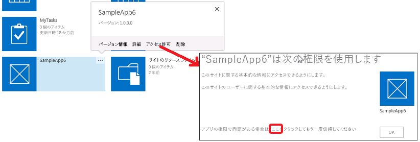

# SharePoint 2013 でのアドインのアクセス許可
SharePoint におけるアドインのアクセス許可について説明します。アドインのアクセス許可の種類、アクセス許可要求範囲、およびアクセス許可の管理を含みます。この記事では、アドインのアクセス許可権限、ユーザー権限、および Office ストア アプリ権限の違いについても説明します。
この記事を読む前に、「 [SharePoint アドインの承認と認証](authorization-and-authentication-of-sharepoint-add-ins.md)」トピックの内容を把握しておく必要があります。


**アドインのアクセス許可についてのビデオをご覧ください。**


## SharePoint におけるアドインのアクセス許可の概要
<a name="Perm_intro"> </a>

SharePoint アドインは、ユーザーがアドインをインストールするときに、アドインが必要とするアクセス許可をユーザーに要求します。アドインの開発者は、アドイン マニフェスト ファイルを通して、特定のアドインを実行するために必要なアクセス許可を要求する必要があります。(SharePoint にアクセスするデバイスや Web アドインは、SharePoint の Web サイトにインストールされない場合、アドインを実行しているユーザーから実行時にアクセス許可を付与される必要があります。詳細については、「 [実行時に SharePoint のアクセス許可を要求するアドインの概要を取得する](authorization-code-oauth-flow-for-sharepoint-add-ins.md#Overview)」を参照してください。) ユーザーは、自分が所有しているアクセス許可のみを付与できます。ユーザーは、アドインが要求しているアクセス許可のすべてを付与するか、1 つも付与しないかの、どちらかしか行えません。一部を選択的に付与することはできません。(実行時にアクセス許可を要求するアドインの場合、アドインが必要とする SharePoint リソースの Manage アクセス許可を持つユーザーだけがアドインを実行できます。これは、アドインが要求するアクセス許可が、たとえば Read など、低いアクセス許可だけの場合にも当てはまります。)


アドインに付与されたアクセス許可は、SharePoint ファームまたは SharePoint Online テナンシーのコンテンツ データベースにも格納されます。それらがセキュリティで保護されたトークン サービス (Microsoft Azure アクセス制御サービス (ACS) など) を使用して格納されることはありません。ユーザーがアドインにアクセス許可を最初に付与すると、SharePoint は、アドインに関する情報を ACS から取得します。その後、SharePoint は、アドインに関する基本情報をアドインのアクセス許可と一緒に、アドイン管理サービスおよびコンテンツ データベースに格納します。ACS の詳細については、「 [低信頼承認を使用する SharePoint アドインの作成](creating-sharepoint-add-ins-that-use-low-trust-authorization.md)」を参照してください。


アドインにアクセス許可を付与されたオブジェクトが削除される場合、対応する許可も同様に削除されます。アドインにアクセス許可を付与されたオブジェクトがリサイクルされる場合、SharePoint は対応する許可を変更しません。これは、オブジェクトがごみ箱から復元される場合に、許可が変更されないようにするためです。


アドインが削除されると、アドインを削除した範囲でアドインに付与されていたすべてのアクセス許可が取り消されます。これは、ユーザーが SharePoint からアドインを削除した後で、アドインがその資格情報を使用して SharePoint の保護されたリソースにリモートでアクセスし続けることができないようにするためです。


## アドインのアクセス許可の種類とアクセス許可の範囲を理解する
<a name="Perm_types"> </a>

SharePoint アドインはアクセス許可要求を使用して、正常に機能するために必要なアクセス許可を指定します。このアクセス許可要求は、アドインが必要とする権限とその権限を必要とする範囲の両方を指定します。これらのアクセス許可は、アドイン マニフェストの一部として要求されます。


> **メモ**
> このセクションで説明する範囲は、リストコンテンツとライブラリ コンテンツのみに適用されます。他の機能の範囲の詳細については、この記事の「 [アドインのアクセス許可の種類とアクセス許可の範囲を理解する](#Perm_types)」セクションを参照してください。 


アクセス許可要求の範囲は、アクセス許可要求が適用される SharePoint 階層の場所を示します。


> **メモ**
> SharePoint アドインは独自の ID を持つ、アドイン プリンシパルと呼ばれるセキュリティ プリンシパルです。ユーザーやグループと同じように、アドイン プリンシパルには一定のアクセス許可または権限があります。アドイン プリンシパルには、アドイン Web に対するフル コントロール権限があるため、必要なのは、ホスト Web や他の場所など、アドイン Web の外側にある SharePoint リソースのアクセス許可を要求することだけです。アドイン Web の詳細については、「 [SharePoint アドインのアーキテクチャおよび開発環境に関する重要な要素](important-aspects-of-the-sharepoint-add-in-architecture-and-development-landscap.md)」および「 [SharePoint 2013 のホスト Web、アドイン Web、および SharePoint コンポーネント](host-webs-add-in-webs-and-sharepoint-components-in-sharepoint-2013.md)」を参照してください。 


SharePoint は、コンテンツ データベースおよびテナンシー内で 4 種類のアクセス許可範囲をサポートしています (表 1 を参照)。アクセス許可範囲は "http:" というプレフィックスを含む URI で名前が付けられていますが、これらは URL ではなく、プレースホルダーは含まれていません。この表およびこの記事の中では、アクセス許可範囲はリテラル文字列です。


**表 1. SharePoint アドインのアクセス許可要求範囲 URI および説明**

|||
|:-----|:-----|
|**範囲 URI** <br/> |**説明** <br/> |
|テナント  <br/> http://sharepoint/content/tenant  <br/> |アドインがインストールされるテナンシー。この範囲のすべての子を含みます。  <br/> |
|サイト コレクション  <br/> http://sharepoint/content/sitecollection  <br/> |アドインがインストールされるサイト コレクション。この範囲のすべての子を含みます。  <br/> |
|Web サイト  <br/> http://sharepoint/content/sitecollection/web  <br/> |アドインがインストールされる Web サイト。この範囲のすべての子を含みます。  <br/> |
|リスト  <br/> http://sharepoint/content/sitecollection/web/list  <br/> |アドインがインストールされる Web サイト内の 1 つのリストです。ユーザーがアドインをインストールする際に、アクセス許可の付与を求めるプロンプトが表示された場合は、そのダイアログで、アドインにアクセス許可を付与するリストを 1 つ選択できます。アドインに複数のリストへのアクセス許可が必要な場合、そのアドインは Web スコープへのアクセス許可を要求する必要があります。また、開発者はユーザーが選択するリストを指定することも、選択するリストをユーザーに指示することもできないため、特定のリストへのアクセス許可がアドインに必要な場合は Web 範囲を使用する必要があります (ただし、アクセス許可要求をリストの特定のサブセットに限定する方法もあります。この後の「 [関連するプロパティがあるアクセス許可範囲](#AssociatedProperties)」を参照してください)。  <br/> |
 
アドインがいずれかの範囲に対するアクセス許可を付与された場合、そのアクセス許可は、その範囲のすべての子にも適用されます。たとえば、Web サイトに対するアクセス許可がアドインに付与された場合、その Web サイトに含まれている各リストと、各リストに含まれるすべてのリスト アイテムに対するアクセス許可もアドインに付与されます。


アクセス許可要求は、アドインがインストールされるサイト コレクションのトポロジに関する情報なしで行われるため、範囲は、特定のインスタンスの URL ではなく、種類として表現されます。これらの範囲の種類は URI で表現されます。SharePoint コンテンツ データベースに格納されているリソースに対するアクセス許可は、URI " `http://sharepoint/content`" の下に整理されます。


## アドインのアクセス許可権限とユーザー権限の違いを理解する
<a name="Perm_diff"> </a>

アクセス許可は、要求した範囲内でアドインが実行することを許可されるアクティビティを示します。SharePoint では、コンテンツ データベース内の 4 つの権限レベルがサポートされます。各範囲で、アドインは、以下の権限を持つことができます。


- Read


- Write


- Manage


- FullControl


> **メモ**
> Read、Write、Manage、および FullControl 権限の内容の詳細については、「 [SharePoint 2013 でアドインの権限管理を計画する](http://technet.microsoft.com/ja-jp/library/jj219576%28office.15%29.aspx)」を参照してください。 


> **メモ**
> これらの権限は、SharePoint の既定のユーザー アクセス許可レベルである、読み取り、投稿、デザイン、およびフル コントロールに対応します。ユーザーのアクセス許可レベルの詳細については、「 [ユーザー権限とアクセス許可レベル](http://technet.microsoft.com/ja-jp/library/cc288074.aspx)を参照してください。 > アドインの権限名は、SharePoint ユーザー ロールの権限名とは一致しません。これは、ユーザー ロールの権限とアドインの権限の混同を避けるためです。SharePoint ユーザー ロールに関連付けられるアクセス許可をカスタマイズしても、アドインのアクセス許可要求レベルに影響しないため、アドインの権限名は、フル コントロール以外は対応する SharePoint ユーザー ロールと一致せず、アクセス許可管理ユーザー インターフェイスを通してカスタマイズすることはできません。 


上記に加えて、


- 検索の場合のみ、アドインは、Query 権限を持つことができます。


- Microsoft Project Server 2013 の一部の範囲では、SubmitStatus 権限または Elevate 権限もあります。Project Server 2013 の大半の範囲では、Read および Write のみを使用できます。詳細については、この記事の「 [アドインのアクセス許可の種類とアクセス許可の範囲を理解する](#Perm_types)」セクションを参照してください。


- タクソノミーの場合は、Read および Write を使用できます。


> **メモ**
> Office ストア アプリには、アドインが要求できる権限の種類に関して、いくつかの制限があります。詳細については、この記事の「 [アドインのアクセス許可の種類とアクセス許可の範囲を理解する](#Perm_types)」セクションを参照してください。 


SharePoint ユーザー ロールとは異なり、これらの権限レベルはカスタマイズできません。これは、アドインにアクセス許可要求が付与されるときに、予測可能な機能セットがアドインに対して保証されるようにするためです。これにより、アドインは、期待するレベルよりも低いアクセス許可が付与される可能性を考慮する必要がありません。


ユーザーは、ユーザー自身が持っているアドイン アクセス許可しか付与することができません。ユーザーがインストールを試みているアドインが、そのユーザーが持っているアクセス許可より高いアクセス許可を要求している場合は、アドインの要求を承認するにはアクセス許可が不足していることをユーザーに通知するエラー メッセージが表示されます。


SharePoint が認識しないアクセス許可は無視されます。これは、SharePoint が認識しないアクセス許可をアドインが要求した場合でもアドインをインストールできますが、アクセス許可を付与するようにとのメッセージがユーザーに出されることはなく、アドインにはアクセス許可が付与されないことを意味します。


## 使用可能な範囲とアクセス許可、および Office ストア アプリのアクセス許可に対する制限事項
<a name="Perm_rightlist"> </a>

アドインが要求できる権限セットは、範囲ごとに異なります。このセクションでは、各範囲で使用できる権限のセットについて説明します。Office ストア で販売される SharePoint アドインの制限事項についても説明します。


### Office ストア アプリの権限

Office ストア アプリでは、Read、Write、および、Manage 権限のみが許可されます。FullControl 権限が必要なアプリを Office ストア に送信しようとすると、アプリの送信はブロックされます。ブロックが行われるのは Office ストア の送信パイプライン内なので、Manage アクセス権を超える要求をするアプリであっても、アドイン カタログを通して展開することができます。


### リスト コンテンツとライブラリ コンテンツに対するアクセス許可要求範囲
<a name="PermissionsForLists"> </a>

表 2 に、リスト コンテンツとライブラリ コンテンツ用のアクセス許可範囲を示します。各範囲 URI で指定できる権限も同時に示します。


> **メモ**
> 表 2 で使用されている URI はリテラル値です。 


**表 2. SharePoint アドインのアクセス許可範囲 URI と使用可能な権限**

|||
|:-----|:-----|
|**範囲 URI** <br/> |**使用可能な権限** <br/> |
|http://sharepoint/content/sitecollection  <br/> |Read、Write、Manage、FullControl  <br/> |
|http://sharepoint/content/sitecollection/web  <br/> |Read、Write、Manage、FullControl  <br/> |
|http://sharepoint/content/sitecollection/web/list  <br/> |Read、Write、Manage、FullControl  <br/> |
|http://sharepoint/content/tenant  <br/> |Read、Write、Manage、FullControl  <br/> |
 
次のコードは、AppManifest.xml ファイル内でアクセス許可範囲と権限をどのように使用するかを示しています。最初の例では、アドインは、リスト範囲への Write アクセス許可を要求しています。



```XML

<?xml version="1.0" encoding="utf-8" ?>
<App xmlns="http://schemas.microsoft.com/sharepoint/2012/app/manifest"
     ProductID="{4a07f3bd-803d-45f2-a710-b9e944c3396e}"
     Version="1.0.0.0"
     SharePointMinVersion="15.0.0.0"
     Name="MySampleAddIn"
>
  <Properties>
    <Title>My Sample Add-in</Title>
    <StartPage>~remoteAppUrl/Home.aspx?{StandardTokens}</StartPage>
  </Properties>

  <AppPrincipal>
    <RemoteWebApplication ClientId="1ee82b34-7c1b-471b-b27e-ff272accd564" />
  </AppPrincipal>

  <AppPermissionRequests>
    <AppPermissionRequest Scope="http://sharepoint/content/sitecollection/web/list" Right="Write"/>
  </AppPermissionRequests>
</App>
```

次のコードは、Web 範囲への Read アクセス許可と、リスト範囲への Write アクセス許可を求めるアドインを示しています。



```XML

<?xml version="1.0" encoding="utf-8" ?>
<App xmlns="http://schemas.microsoft.com/sharepoint/2012/app/manifest"
     ProductID="{4a07f3bd-803d-45f2-a710-b9e944c3396e}"
     Version="1.0.0.0"
     SharePointMinVersion="15.0.0.0"
     Name="MySampleAddIn"
>
  <Properties>
    <Title>My Sample Add-in</Title>
    <StartPage>~remoteAppUrl/Home.aspx?{StandardTokens}</StartPage>
  </Properties>

  <AppPrincipal>
    <RemoteWebApplication ClientId="6daebfdd-6516-4506-a7a9-168862921986" />
  </AppPrincipal>

  <AppPermissionRequests>
    <AppPermissionRequest Scope="http://sharepoint/content/sitecollection/web" Right="Read"/>
    <AppPermissionRequest Scope="http://sharepoint/content/sitecollection/web/list" Right="Write"/>
  </AppPermissionRequests>
</App>
```


### SharePoint の他の機能に対するアクセス許可要求の範囲
<a name="PermissionsForLists"> </a>

SharePoint の他の機能に対するアクセス許可要求の範囲を以下の表に示します。 


> **メモ**
> 表で使用されている URI はリテラル値です。 


表 3 に、Business Connectivity Services (BCS) 用のアクセス許可範囲を示します。各範囲 URI で指定できる権限も同時に示します。


**表 3. BCS アドインのアクセス許可範囲 URI と使用可能な権限**

|||
|:-----|:-----|
|**範囲 URI** <br/> |**使用可能な権限** <br/> |
|http://sharepoint/bcs/connection  <br/> |Read  <br/> |
 

> **メモ**
> BCS アドインのアクセス許可要求範囲の詳細については、「 [SharePoint 2013 の Business Connectivity Services](http://msdn.microsoft.com/library/64b7d032-4b83-4e9e-bc08-f0a161af5457%28Office.15%29.aspx)」を参照してください。 


表 4 に、検索用のアクセス許可要求の範囲を示します。その範囲の URI で指定できる権限も同時に示します。


**表 4. 検索アドインのアクセス許可範囲 URI と使用可能な権限**

|||
|:-----|:-----|
|**範囲 URI** <br/> |**使用可能な権限** <br/> |
|http://sharepoint/search  <br/> |QueryAsUserIgnoreAppPrincipal  <br/> |
 

> **メモ**
> 検索アドインのアクセス許可要求範囲の詳細については、「 [SharePoint 2013 の検索](http://msdn.microsoft.com/library/59220f81-0e5e-4945-8056-cf0a116446cb%28Office.15%29.aspx)」を参照してください。 


表 5 に、Project Server 2013 用のアクセス許可範囲を示します。各範囲 URI で指定できる権限も同時に示します。


> **メモ**
> Project Server 2013 の機能とサービスを使用するアドインは、必要な Project Server の機能とサービスが用意された環境でテストする必要があります。Project Server 2013 のアクセス許可範囲を認識する Project Server 2013 のアクセス許可プロバイダー アセンブリは、既定では SharePoint Server にインストールされません。詳細については、Project Server 2013 の開発者ドキュメントを参照してください。 


**表 5. Project Server アドインのアクセス許可範囲 URI と使用可能な権限**

|||
|:-----|:-----|
|**範囲** <br/> |**使用可能な権限** <br/> |
|http://sharepoint/projectserver  <br/> |Manage  <br/> |
|http://sharepoint/projectserver/projects  <br/> |Read、Write  <br/> |
|http://sharepoint/projectserver/projects/project  <br/> |Read、Write  <br/> |
|http://sharepoint/projectserver/enterpriseresources  <br/> |Read、Write  <br/> |
|http://sharepoint/projectserver/statusing  <br/> |SubmitStatus  <br/> |
|http://sharepoint/projectserver/reporting  <br/> |Read  <br/> |
|http://sharepoint/projectserver/workflow  <br/> |Elevate  <br/> |
 


表 6 に、ソーシャル フィーチャー用のアクセス許可範囲を示します。各範囲 URI で指定できる権限も同時に示します。


**表 6. ソーシャル フィーチャー アドインのアクセス許可範囲 URI と使用可能な権限**

|||
|:-----|:-----|
|**範囲 URI** <br/> |**使用可能な権限** <br/> |
|http://sharepoint/social/tenant  <br/> |Read、Write、Manage、FullControl  <br/> |
|http://sharepoint/social/core  <br/> |Read、Write、Manage、FullControl  <br/> |
|http://sharepoint/social/microfeed  <br/> |Read、Write、Manage、FullControl  <br/> |
 

> **メモ**
> ソーシャル機能アドインでのアクセス許可の要求スコープの詳細については、「 [ソーシャル機能にアクセスするためのアドインのアクセス許可要求](http://msdn.microsoft.com/library/8852ce36-8309-45a7-a141-2e10ac17a123%28Office.15%29.aspx#bkmk_AppPerms)」を参照してください。 


表 7 に、タクソノミー用のアクセス許可要求範囲を示します。その範囲 URI で指定できる権限も同時に示します。


**表 7. タクソノミー アドインのアクセス許可範囲 URI と使用可能な権限**

|||
|:-----|:-----|
|**範囲 URI** <br/> |**使用可能な権限** <br/> |
|http://sharepoint/taxonomy  <br/> |Read、Write  <br/> |
 

> **メモ**
> タクソノミー アドインのアクセス許可要求範囲の詳細については、「 [SharePoint 2013 機能の追加](http://msdn.microsoft.com/library/11ecb65e-6dc5-4cf1-80ca-3c16418697b6%28Office.15%29.aspx)」を参照してください。 


### 関連するプロパティがあるアクセス許可範囲
<a name="AssociatedProperties"> </a>

リストのアクセス許可範囲には、オプションのプロパティがあります。リスト範囲には、次のマークアップ例に示すように、 **BaseTemplateId** という名前のプロパティと、リスト ベース テンプレートに対応する整数値を指定できます。ベース テンプレート ID を指定しない場合、アドインをインストールするユーザーが、Web のすべてのリストのうちの 1 つのリストへのアクセス許可をそのアドインに付与するかどうかを選択できます。ベース テンプレート ID を指定する場合、ユーザーが選択できるリスト セットが、 **BaseTemplateId** プロパティの指定内容と一致するリスト セットに限定されます。


 **BaseTemplateId** プロパティは子要素であり、 **AppPermissionRequest** 要素の属性ではありません。次のコードは、 **BaseTemplateId** プロパティの使用方法を示しています。



```XML

<AppPermissionRequest Scope="http://sharepoint/content/sitecollection/web/list" Right="Write">
  <Property Name="BaseTemplateId" Value="101"/>
</AppPermissionRequest>
```


**表 7. 関連するプロパティがあるアクセス許可範囲**

||||
|:-----|:-----|:-----|
|**範囲 URI** <br/> |**プロパティ** <br/> |**型** <br/> |
|http://sharepoint/content/sitecollection/web/list  <br/> |**BaseTemplateId** <br/> |Integer  <br/> > **メモ**> **BaseTemplateId** およびリスト ベース テンプレートに対応する整数値の詳細については、 [List 要素 (リスト)](http://msdn.microsoft.com/library/b2b26fee-eb45-48ac-99f1-65f725da293f%28Office.15%29.aspx) の **Type** 属性を参照してください。          |
 

## アドインのアクセス許可の管理とトラブルシューティング
<a name="Perm_manage"> </a>

SharePoint にインストールされる SharePoint アドインは、インストール時にアクセス許可を付与されます。他のプラットフォームにインストールされるアドインが SharePoint にアクセスする場合のアクセス許可は、アドインを実行しているユーザーによって実行時に付与されます。時おり、前者の種類のアドインがアクセス許可を失うことがあります。アドインにアクセス許可を再度付与するには、次の手順を実行してください。


1. アドインがアクセス許可を失ったと思われる Web サイトの [ **サイト コンテンツ**] ページで、アドインのタイルにある [ **…**] ボタンをクリックします。これにより、[ **アクセス許可**] リンクのある吹き出しか、別の [ **…**] ボタンのある吹き出しが開きます。 


2. [ **アクセス許可**] リンクがある場合は、それをクリックし、次のステップをスキップします。ない場合は、[ **…**] ボタンをクリックします。


3. [ **アクセス許可**] リンクをクリックします。


4. 開いたページで、最後の文にある [ **ここ**] リンクをクリックします。これにより、アドインにアクセス許可が再度付与され、ブラウザーは元の [ **サイト コンテンツ**] ページにリダイレクトされます。





アドインの開発やトラブルシューティングを行っている場合、既にインストールしたアドインのアクセス許可を変更、または再度付与する必要が生じることがあります。それらを行うには、次の手順を実行してください。


1.  `http://<SharePointWebSite>/_layouts/15/AppInv.aspx` に移動します。ここで、 _<SharePointWebSite>_ は、アドインがインストールされている Web サイトの URL です。この URL にクエリ パラメーターを追加しないように注意してください。URL が上記のとおりのページにしか、必要なフォームは表示されません。


2. アドインの ID (クライアント ID ともいう) を [ **アドイン ID**] ボックスに入力し、[ **参照**] をクリックします。フォーム上の他のボックスに、アドインに関する情報が読み込まれます。


3. [ **権限の要求 XML**] ボックスに、アドイン マニフェストに入力するのと同じアクセス許可要求を正確に入力します。例については、この記事の前のほうにある「 [リスト コンテンツとライブラリ コンテンツに対するアクセス許可要求範囲](#PermissionsForLists)」を参照してください。完全な構文情報については、「 [AppPermissionRequest 要素](http://msdn.microsoft.com/library/4ad90fb0-33b2-aee5-69c2-5b97ca5334f8%28Office.15%29.aspx)」を参照してください。


4. [ **作成**] をクリックします。 


特定の範囲に対するアドインのアクセス許可は、アドインがその範囲から削除された時点で取り消されます。


## アドインをユーザーに対して非表示にできない理由
<a name="CannotBeHidden"> </a>

SharePoint の Web サイトに対するブラウズ権限を持つすべてのユーザーは、そのサイトにインストールされた任意の SharePoint アドインを起動できます。ユーザーがそのアドインを使用して実行できる内容は、ユーザーの他のアクセス許可と、アドインで使用されている [承認ポリシーの種類](add-in-authorization-policy-types-in-sharepoint-2013.md)によって異なります。ユーザーがそのアドインを使用して何かの処理を実行しようとしたとき、それを実行するアクセス許可をユーザーが持っていない場合に、SharePoint に対する呼び出しでユーザー + アドイン ポリシーが使用されていると、その呼び出しは失敗します。


## その他の技術情報
<a name="Filename_AdditionalResources"> </a>


-  [SharePoint アドインの承認と認証](authorization-and-authentication-of-sharepoint-add-ins.md)


-  [SharePoint アドイン](sharepoint-add-ins.md)


-  [SharePoint アドインのオンプレミスの開発環境をセットアップする](set-up-an-on-premises-development-environment-for-sharepoint-add-ins.md)


-  [プロバイダー ホスト型 SharePoint アドインの作成を始める](get-started-creating-provider-hosted-sharepoint-add-ins.md)


-  [SharePoint ホスト型の SharePoint アドインの作成を始める](get-started-creating-sharepoint-hosted-sharepoint-add-ins.md)


