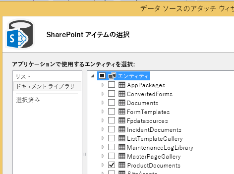
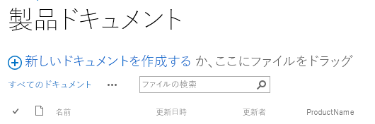
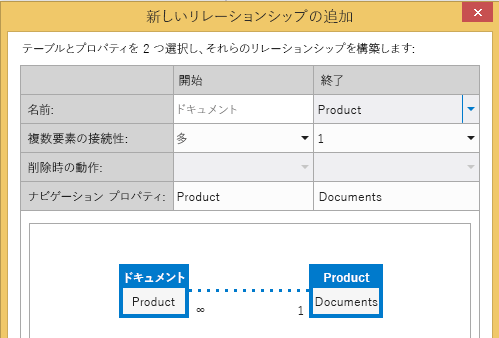
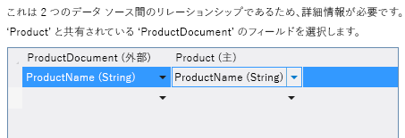
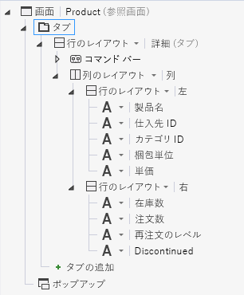
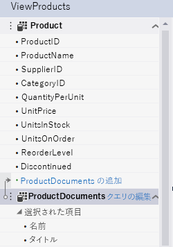
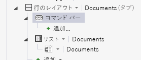

# ドキュメント ライブラリをエンティティに関連付ける
SharePoint のドキュメント ライブラリ機能を使用して、リスト内の個々の項目やエンティティに関連するドキュメントを作成したりアップロードしたりできます。たとえば、ドキュメント ライブラリを使用して、リストの各製品の営業資料や製品マニュアルを保存する場合があるかもしれません。クラウド ビジネス アドインでは、リレーションシップを作成することによってエンティティにドキュメント ライブラリを関連付けることができます。
## ドキュメント ライブラリを関連付ける

エンティティにドキュメント ライブラリを関連付けるには次の 3 つの手順を行います。

1. データ ソースとして、SharePoint ドキュメント ライブラリをプロジェクトに追加します。

    > **重要**
      > まず、SharePoint サイトにドキュメント ライブラリを作成する必要があります。 エンティティ内の一意なフィールドに対応するカスタム列が含まれている必要があります。 
2. ドキュメント ライブラリとエンティティ間のリレーションシップを作成します。

3. 画面にドキュメント ライブラリを追加します。 プロセスは、新しい画面を作成するのかそれとも既存の画面に追加するのかによって異なります。

### ドキュメント ライブラリを追加するには

1. [ **ソリューション エクスプローラー**] で、[ **データ ソース**] ノードのショート カット メニューを開き [ **データ ソースの追加**] を選択します。

2. [ **データ ソースのアタッチ**] ウィザードで、[ **SharePoint**] アイコンを選択してから、[ **次へ**] ボタンをクリックします。

3. [ **接続情報の入力**] ページで、[ **SharePoint サイトのアドレスを指定してください**] テキスト ボックスに、SharePoint 開発者向けサイトの URL を入力してから、[ **次へ**] ボタンをクリックします。

4. 図 1 に示すように、[ **SharePoint アイテムの選択**] ページで、左側のウィンドウの [ **ドキュメント ライブラリ**] リスト項目を選択し、ドキュメント ライブラリに含めるものを右側のウィンドウのチェックボックスで選択します。

   **図 1. ドキュメント ライブラリの選択**

図 2 は、SharePoint サイトのドキュメント ライブラリを示します。

   **図 2. カスタムの [ProductName] 列に注目します**

> **重要**
> ドキュメント ライブラリは既に存在しており、エンティティの固有フィールドに対応するカスタム列がなければなりません。 
5. [ **データ ソースの名前を指定してください**] で、名前を入力して、[ **終了**] ボタンをクリックします。

### リレーションシップを作成するには

1. [ **ソリューション エクスプローラー**] で、ドキュメント ライブラリ エンティティを開き、[ **Perspective**] バーで、[ **サーバー**] タブを選択します。

2. ツールバーで、[ **リレーションシップ**] を選択します。

3. 図 3 に示すように、[ **新しいリレーションシップの追加**] ダイアログ ボックスで、[ **To**] ドロップダウン リストから、関連付けるエンティティを選択します。

   **図 3. リレーションシップの作成。**

4. [ **外部**] キー ドロップ ダウン リストで、ドキュメント ライブラリからカスタム列を選択します。

5. [ **主**] キー ドロップダウン リストで、ドキュメント ライブラリのカスタム列に対応するエンティティからのフィールドを選択し、[ **OK**] ボタンをクリックします。 たとえば、図 4 に示すように、[ProductName] カスタムの列に対して、[ProductName] フィールドを選択します。

   **図 4. 関連する外部キーと主キー**

> **メモ**
> フィールドのデータ型は [ **外部**] キー フィールドと同じにする必要があります。 

### 新しい画面セットにドキュメント ライブラリを追加するには

1. [ **ソリューション エクスプローラー**] で、ドキュメント ライブラリに関連したエンティティを開き、[ **Perspective**] バーで、[ **HTMLClient**] タブを選択します。

2. ツールバーで、[ **画面**] を選択します。

3. [ **新しい画面の追加**] ダイアログ ボックスで、[ **画面セット名**] テキスト ボックスに画面セット名を入力します。

4. [ **画面データ**] リストで、エンティティを選択します。

5. [ **含める追加データ**] リストで、ドキュメント ライブラリのチェックボックスを選択し、[ **OK**] ボタンをクリックします。

    製品エンティティの画面セットを図 5 に示します。

   **図 5. 製品画面セット**

![[Add New Screen] ダイアログボックス](images/CBAScreenSet.PNG)

選択したエンティティ用に作成した [ **表示**] 画面には、[ **ドキュメント**] タブがあり、そのタブには [ **ドキュメントの追加**] ボタンがあります。このボタンを押すと、ドキュメントの追加またはアップロードを行うポップアップが表示されます。

### 既存画面にドキュメント ライブラリを追加するには

1. [ **ソリューション エクスプローラー**] で、ドキュメント ライブラリに関連させる画面のショートカット メニューを開き [ **開く**] をクリックします。

2. 画面デザイナーで、図 6 に示すように [ **タブ**] ノードを選択し、[ **タブの追加**] ノードを選択します。

   **図 6. [タブ] ノード**

3. [ **プロパティ**] ウィンドウで、[ **表示名**] プロパティを選択し、新しく追加するタブの意味が分かるような名前を入力します (たとえば、ドキュメントなど)。

4. 図 7 に示すように、画面デザイナーの左側のウィンドウで、[ _DocumentLibraryName_ **の追加**] リンクを選択します。ここで、 _DocumentLibraryName_ は、ドキュメント ライブラリの名前です。

   **図 7. [ProductDocuments の追加] リンク**

5. 中央のウィンドウで、新しいタブのノードを選択し、[ **追加**] リストを展開し、 _DocumentLibraryName_ を選択します。

6. 図 8 に示すように、新しいタブの [ **コマンド バー**] ノードを展開し、[ **追加**] をクリックします。

   **図 8. [コマンド バー] ノード**

7. [ **ボタンの追加**] ダイアログ ボックスで、既定の設定をそのままにして [ **OK**] ボタンをクリックします。

    図 9 は、[ **ボタンの追加**] ダイアログ ボックスで、既定のメソッド [ **createOrUploadDocument**] が設定されているところを示しています。

   **図 9. [ボタンの追加] ダイアログ ボックス**

![[Add Button] ダイアログ ボックス](images/CBAAddDialog.PNG)

8. [ **プロパティ**] ウィンドウで、[ **表示名**] プロパティを選択し、ボタンの意味が分かるような名前を入力します (たとえば、ドキュメントの追加など)。

    画面には、コマンド バーの上にボタン付きで [ **ドキュメント**] タブが含まれるようになります。 このボタンを押すと、ドキュメントの追加またはアップロードを行うポップアップが表示されます。

## その他の技術情報

-  [クラウド ビジネス アドインを開発する](develop-cloud-business-add-ins.md)

-  [インシデント マネージャー: クラウド ビジネス アドインのチュートリアル](incident-manager-a-cloud-business-add-in-tutorial.md)

