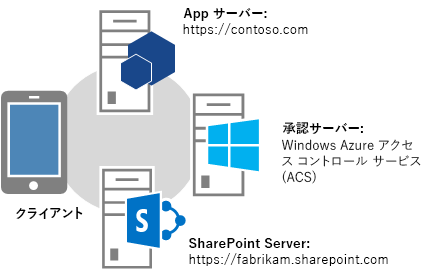
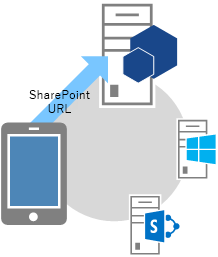
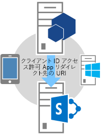
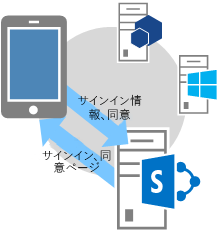
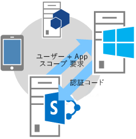
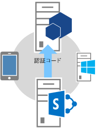
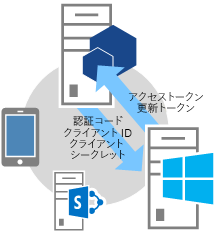
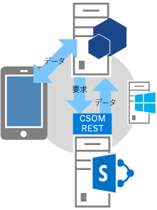

# SharePoint アドインの認証コード OAuth フロー
実行時に SharePoint のリソースにアクセスするためのアクセス許可を要求するアドインの OAuth フローおよび OAuthAuthorize.aspx ページと SharePoint のリダイレクト URI の使用方法について説明します。
## 実行時に SharePoint のアクセス許可を要求するアドインの概要を取得する
<a name="Overview"> </a>


> **メモ**
> この記事では、読者が  [低信頼承認を使用する SharePoint アドインの作成](creating-sharepoint-add-ins-that-use-low-trust-authorization.md) および OAuth の基礎となっている概念や原理を理解していることを前提としています。OAuth の詳細については、「 [OAuth.net](http://oauth.net/)」および「 [Web 承認プロトコル (OAuth)](http://datatracker.ietf.org/doc/active/#oauth)」を参照してください。 


一部のシナリオでは、アドインは、実行時に SharePoint のリソースにアクセスするためのアクセス許可を要求できます (つまり、アドインのインストール時ではなく **実行時に、SharePoint のリソースにアクセスするためのアクセス許可を動的に要求できます** )。これらのアドインは、必ずしも SharePoint から起動されていたり、SharePoint にインストールされている必要さえありません。たとえば、ネイティブ デバイス アドインや任意の Web サイトから起動されるアドインでもかまいません。また、実行時に SharePoint のリソースにアクセスする必要のある Office アドインケーションから起動された Office アドインであってもかまいません。


> **メモ**
> この種類のアドインは、アドインでアクセスするリソースに対する管理権限を持つユーザーのみが実行できます。たとえば、アドインが特定の Web サイトに対する読み取りアクセス許可のみを要求する場合、その Web サイトに対する読み取り権限を持っていても管理権限がないユーザーはこのアドインを実行できません。 


これらのアプリが SharePoint にアクセスするには、まず、販売者ダッシュボードまたは appregnew.aspx ページを介して **アドインを登録する** 必要があります。販売者ダッシュボードまたは appregnew.aspx を介したアドインの登録の詳細については、「 [SharePoint アドイン 2013 を登録する](register-sharepoint-add-ins-2013.md)」を参照してください。


アドインを登録すると、ユーザーやグループと同じように、 *セキュリティ プリンシパル*  になって ID が割り当てられます。この ID は、アドイン プリンシパルと呼ばれます。ユーザーやグループと同様に、アドイン プリンシパルにも特定のアクセス許可があります。アドイン プリンシパルの詳細については、「 [SharePoint アドイン 2013 を登録する](register-sharepoint-add-ins-2013.md)」を参照してください。


アドインを登録する場合に、アドインのプリンシパルのクライアント ID、クライアント シークレット、アドイン ドメイン、およびリダイレクト URI を取得します。この情報は、認証サーバーである Microsoft Azure アクセス制御サービス (ACS) に登録されます。


## 実行時にアクセス許可を要求するアドインの OAuth のフローを理解する
<a name="Flow"> </a>

このセクションでは、実行時にアクセス許可を要求する SharePoint アドインの OAuth 認証および承認フローの概要を示します。ここで説明するフローは、 **認証コード フロー** と呼ばれます。 SharePoint から起動されていないアドインが SharePoint のリソースにアクセスする手順を説明します。


> **メモ**
> フローには、実行時の **アドイン、SharePoint、認証サーバー (ACS)、およびエンド ユーザーの間の一連のやりとりが含まれます** 。このため、フローでは SharePoint Online または SharePoint のファームのいずれかがインターネットに接続していて ACS と通信できることが必要です。インターネットに接続していない SharePoint ファームは、 [高信頼承認システム](creating-sharepoint-add-ins-that-use-high-trust-authorization.md)を使用する必要があります。 


SharePoint とは別にホストされる Web アプリケーションまたはサービスが必要です。アドインがデバイス アドインであったとしても、ACS (上記を参照) に登録できる Web アプリケーションまたはサービスの URL が必要です。これは、Web コンポーネントが他の何にも使用されないとしても必要です。わかりやすくするために、この記事ではアドインが、Contoso.com という Web アプリケーションであると想定します。アプリケーションは SharePoint クライアント オブジェクト モデル (CSOM) または SharePoint REST API を使用して、SharePoint への呼び出しを行います。アプリケーションが最初に SharePoint にアクセスしようとすると、SharePoint は Contoso.com アプリケーションに送信できる認証コードを ACS に要求します。Contoso.com アプリケーションはその認証コードを使用して ACS にアクセス トークンを要求します。アクセス トークンを取得すると、Contoso.com アプリケーションは SharePoint への要求すべてにそのアクセス トークンを含めます。


### フローの詳細な例
<a name="Fly"> </a>

Contoso がオンラインで写真印刷サービスを提供しているとします。写真を印刷したいユーザーがいます。そのユーザーは Contoso 写真印刷サービスに同意して、写真ライブラリ内の写真を印刷します。この写真ライブラリは、そのユーザー自身が SharePoint Online サイト  `fabrikam.sharepoint.com` で管理しているものです。





写真印刷アプリケーションが登録され、Contoso には、クライアント ID、クライアント シークレット、リダイレクト URI があります。Contoso がアドインの登録時に提供したリダイレクト URI は  `https://contoso.com/RedirectAccept.aspx` です。クライアント ID とクライアント シークレット情報は、写真編集アプリケーションの web.config ファイルに含まれています。次に、クライアント ID とクライアント シークレット情報を web.config ファイルに入力する方法の例を示します。



```XML

<configuration>
  <appSettings>
    <add key="ClientId" value="c78d058c-7f82-44ca-a077-fba855e14d38 "/>
    <add key="ClientSecret" value="SbALAKghPXTjbBiLQZP+GnbmN+vrgeCMMvptbgk7T6w= "/>

  </appSettings>

</configuration>
```

認証コードのフローの手順を次に示します。


> **ヒント**
> これらの手順は TokenHelper.cs (または .vb) ファイルのメソッドを参照します。このマネージ コードはコンパイルされていないため、これに関する参照トピックはありません。ただし、ファイルそのものには、それぞれのクラス、メンバー パラメーター、および戻り値について詳細なコメントが付いています。これらの手順を読む際に参照できるよう、このファイルのコピーを開いておくことをお勧めします。 


||||
|:-----|:-----|:-----|
|**1** <br/> ||**クライアントはアプリケーションを開き、その後アプリをデータのある SharePoint サイトに誘導します。** <br/> ユーザーが Contoso の写真印刷用 Web サイトにアクセスします。UI はSharePoint Online サイトに保存されている写真をユーザーが印刷できることを示します。この例の URL は  `https://contoso.com/print/home.aspx` です。 <br/> 写真印刷アドインは、ユーザーに印刷する写真がある場所の URL を入力するよう求めます。ユーザーは、SharePoint Online のサイトを指す URL ( `https://fabrikam.sharepoint.com/`) を入力します。  <br/> |
|**2** <br/> ||**アドインは SharePoint サイト承認 URL にリダイレクトします。** <br/> ユーザーがボタンをクリックし写真を取得しようとすると、Contoso 写真印刷アドインはブラウザーを  `https://fabrikam.sharepoint.com/` にリダイレクトします。このリダイレクトは HTTP 302 リダイレクト応答です。 <br/> Microsoft .NET を使用している場合は、 **Response.Redirect** を使用して、コードからリダイレクトを実行できます。プロジェクトで TokenHelper.cs (または .vb) ファイルを使用すると、コードは、オーバーロードされた **GetAuthorizationUrl** メソッド (3 つの引数を指定したオーバーロード) を呼び出すことができます。このメソッドは OAuthAuthorize.aspx リダイレクト URL を構成します。また、コードで URL を手動で構成することもできます。 <br/> たとえば、 **GetAuthorizationUrl** メソッドを呼び出して OAuthAuthorize.aspx リダイレクト URL を構成する場合、プロジェクトで TokenHelper.cs (または .vb) を使用すると、次のようなコードになります。 <br/>  `Response.Redirect(TokenHelper.GetAuthorizationUrl(`           `sharePointSiteUrl.ToString(),`           `"Web.Read List.Write",`           `"https://contoso.com/RedirectAccept.aspx"));` <br/> TokenHelper.cs (または .vb) で **GetAuthorizationUrl** メソッドの 3 つのパラメーターのオーバーロードを調べると、2 番目のパラメーターがアクセス許可のスコープ パラメーターであることがわかります。これはアドインが要求する短縮形のスペース区切りのアクセス許可リストです。 アクセス許可のスコープの詳細は、「 [アクセス許可のスコープ エイリアスと OAuthAuthorize.aspx ページの利用方法を理解する](#Scope)」を参照してください。3 番目のパラメーターはアドインが AppRegNew.aspx ページに登録されるときに使用されたものと同じリダイレクト URI である必要があります。登録の詳細については、「 [SharePoint アドイン 2013 を登録する](register-sharepoint-add-ins-2013.md)」を参照してください。また、戻された文字列がクエリ文字列のパラメーターを含む URL であることもわかります。  <br/> OAuthAuthorize.aspx リダイレクト URL は手動で構成できます。たとえば、ここの例では、Contoso 写真印刷アドインはユーザーを次の URL にリダイレクトします。  <br/>  `https://fabrikam.sharepoint.com/_layouts/15/OAuthAuthorize.aspx?client_id=client_GUID&amp;scope=app_permissions_list&amp;response_type=code&amp;redirect_uri=redirect_uri` <br/> 例が示すように、Contoso 写真印刷アドインは、OAuth クライアント ID とリダイレクト URI を Fabrikam のサイトにクエリ文字列パラメーターとして送信します。次に、サンプルのクエリ文字列の値を指定した GET 要求の例を示します。わかりやすいように改行を入れています。実際のターゲット URL は 1 行です。  <br/>  `GET /authcode HTTP/1.1`           `Host: fabrikam.sharepoint.com`                     `/oauthauthorize.aspx`           `?client_id= c78d058c-7f82-44ca-a077-fba855e14d38`           `&amp;scope=list.read`           `&amp;response_type=code`           `&amp;redirect_uri= https%3A%2F%2Fcontoso%2Ecom%2Fredirectaccept.aspx`           <br/> 別の同意ポップアップ ダイアログを表示する場合は、次のように、URL の構成にクエリ パラメーター **IsDlg=1** を追加します。 <br/>  `/oauthauthorize.aspx?IsDlg=1&amp;client_id= c78d058c-7f82-44ca-a077-fba855e14d38&amp;scope=list.read&amp;response_type=code&amp;redirect_uri= https%3A%2F%2Fcontoso%2Ecom%2Fredirectaccept.aspx` <br/> |
|**3** <br/> ||**SharePoint は同意ページを表示し、ユーザーがアドインにアクセス許可を付与できます。** <br/> ユーザーが Fabrikam の SharePoint Online サイトにまだサインインしていない場合は、ユーザーにサインインするように指示されます。ユーザーがサインインすると、SharePointが HTML の同意ページをレンダリングします。  <br/> 同意ページで、ユーザーは、Contoso 写真印刷アプリが要求しているアクセス許可を付与 (または拒否) するかどうか尋ねられます。ここの例では、ユーザーが Fabrikam で管理している写真ライブラリへの読み取りアクセスをアドインに付与します。  <br/> |
|**4** <br/> ||**SharePoint は短時間有効な認証コードを ACS サーバーに要求します。** <br/> Fabrikam の SharePoint Online サイトは、このユーザーとアドインの組み合わせに固有の存続期間の短い (約 5 分の) 認証コードを作成するように ACS に要求します。  <br/> ACS は認証コードを Fabrikam のサイトに送信します。  <br/> |
|**5** <br/> ||**SharePoint Online サイトはアドインの登録済みリダイレクト URL にリダイレクトして、認証コードをアドインに渡します。** <br/> Fabrikam の SharePoint Online サイトは、HTTP 302 応答を利用してブラウザーを Contoso にリダイレクトします。このリダイレクトに使用される URL の構成には、写真編集アドインの登録時に提供したリダイレクト URI が使用されます。また、この URL の構成には、認証コードがクエリ文字列として含まれています。この例で使用するリダイレクト URL は次のようになります。  <br/>  `https://contoso.com/RedirectAccept.aspx?code=<authcode>` <br/> |
|**6** <br/> ||**アドインは認証コードを使用して ACS にアクセス トークンを要求します。ACS は要求を検証し、認証コードを無効にし、アクセス トークンと更新 トークンをアドインに送信します。** <br/> Contoso はクエリ パラメーターから認証コードを取得し、アクセス トークンの要求時に、認証コードに加えてクライアント ID とクライアント シークレットを ACS に送信します。  <br/> マネージ コードと SharePoint CSOM、TokenHelper.cs (または .vb) ファイルを使用している場合、ACS への要求を作成するメソッドは **GetClientContextWithAuthorizationCode** になります。この場合、コードは次のようになります ( `authCode` は、認証コードが割り当てられた変数です)。 <br/>  `TokenHelper.GetClientContextWithAuthorizationCode(`           `"https://fabrikam.sharepoint.com/",`           `"00000003-0000-0ff1-ce00-000000000000",`           `authCode,`           `"1ee82b34-7c1b-471b-b27e-ff272accd564",`           `new Uri(Request.Url.GetLeftPart(UriPartial.Path)));`           <br/> TokenHelper.cs (または .vb) ファイルを調べると、 **GetClientContextWithAuthorizationCode** メソッドの 2 番目のパラメーターが `targetPrincipalName` であることがわかります。この値は、SharePoint にアクセスするアドインでは必ず、定数 " `00000003-0000-0ff1-ce00-000000000000`" である必要があります。また、 **GetClientContextWithAuthorizationCode** からの呼び出しの階層をトレースすると、web.config ファイルからクライアント ID とシークレットを取得していることも分かります。 <br/> ACS は Contoso の要求を受け取ると、クライアント ID、クライアント シークレット、リダイレクト URI、および承認コードを検証します。これらがすべて有効であれば、ACS は認証コードを無効にし (認証コードは 1 回しか使用できません)、更新トークンとアクセス トークンを作成します。このアクセス トークンは、Contoso に返されます。  <br/> Contoso アプリケーションは、このアクセス トークンを後の要求で再利用するためにキャッシュできます。既定では、アクセス トークンの有効期限は 12 時間です。各アクセス トークンは、元の認証要求で指定されたユーザー アカウントに固有で、その要求で指定されたサービスに対するアクセスのみを許可します。アドインはアクセス トークンを安全に保管しておく必要があります。  <br/> Contoso アプリケーションは更新トークンもキャッシュできます。既定では、更新トークンの有効期限は 6 か月間です。アクセス トークンの有効期限が切れた場合はいつでも、更新トークンを使用して ACS から新しいアクセス トークンを取得できます。トークンについての詳細は、「 [SharePoint のプロバイダー向けのホスト型低信頼アドインでセキュリティ トークンを処理する](handle-security-tokens-in-provider-hosted-low-trust-sharepoint-add-ins.md)」を参照してください。  <br/> |
|**7** <br/> ||**これで、アドインはアクセス トークンを使用して SharePoint サイトにデータを要求し、それをユーザーに表示できるようになります。** <br/> Contoso はアクセス トークンを使用して SharePoint への REST API 呼び出しまたは CSOM 要求を行うことができます。このとき、OAuth アクセス トークンを HTTP **Authorization** ヘッダーで渡します。 <br/> SharePoint は Contoso が要求する情報を返します。この要求の作成方法の詳細については、「 [SharePoint のプロバイダー向けのホスト型低信頼アドインでセキュリティ トークンを処理する](handle-security-tokens-in-provider-hosted-low-trust-sharepoint-add-ins.md)」を参照してください。  <br/> |
 

## アクセス許可のスコープ エイリアスと OAuthAuthorize.aspx ページの利用方法を理解する
<a name="Scope"> </a>

このセクションでは、「 [SharePoint 2013 でのアドインのアクセス許可](add-in-permissions-in-sharepoint-2013.md)」の記事を理解していることを前提としています。表 1 に、その記事に示すものと同じアドイン アクセス許可要求スコープの URI を示します。ただし、この表には、 **スコープ エイリアス** という列を 1 つ追加しています。また、実行時に SharePoint のリソースへのアクセス許可を要求するアドインは、フル コントロール権限を要求することはできないため、 **使用可能な権限** 列でフル コントロール権限は使用可能として記載されていません。


 **スコープ エイリアス** 列に示す値は、 **スコープ URI** 列の値に対応する省略形です。エイリアスは、実行時に SharePoint のリソースにアクセスするためのアクセス許可を要求するアドインによってのみ使用されます。(スコープ URI の値は、SharePoint から起動したアドインのアドイン マニフェストで使用されます。これらのアドインは、アドインのインストール中にアクセス許可を要求します。)


また、スコープ エイリアスは OAuthAuthorize.aspx リダイレクト ページのコンテキストでのみ使用されます。前のセクションで説明した OAuth フローの手順 2 のように、アドインがマネージ コードを使用している場合、プロジェクトの TokenHelper.cs (または .vb) の **GetAuthorizationUrl** メソッドを呼び出すときにエイリアスが使用されます。別の例を次に示します。



```cs

Response.Redirect(TokenHelper.GetAuthorizationUrl(
    sharePointSiteUrl.ToString(), 
    "Web.Read List.Write ", 
    "https://contoso.com/RedirectAccept.aspx "));
```

 _scope_ パラメーター値 `Web.Read List.Write` は、スコープ エイリアスを使用して権限を要求する方法の一例です。 _scope_ パラメーターには、権限のスコープと適切な要求をスペースで区切って指定します。


マネージ コードを使用していない場合、スコープ エイリアスは、リダイレクト URL の scope フィールドで使用されます。次に例を示します。


 `https://fabrikam.sharepoint.com/_layout/15/OAuthAuthorize.aspx?client_id=c78d058c-7f82-44ca-a077-fba855e14d38&amp;scope=list.write&amp;response_type=code&amp;redirect_uri=https%3A%2F%2Fcontoso%2Ecom%2Fredirectaccept.aspx`


> **メモ**
> スコープについては、「 [SharePoint 2013 でのアドインのアクセス許可](add-in-permissions-in-sharepoint-2013.md)」を参照してください。 


**表 1. SharePoint アドイン アクセス許可要求スコープの URI とそれに対応するエイリアス**

||||
|:-----|:-----|:-----|
|**範囲 URI** <br/> |**範囲エイリアス** <br/> |**使用可能な権限** <br/> |
|http://sharepoint/content/sitecollection  <br/> |サイト  <br/> |読み取り、書き込み、 管理  <br/> |
|http://sharepoint/content/sitecollection/web  <br/> |Web  <br/> |読み取り、書き込み、 管理  <br/> |
|http://sharepoint/content/sitecollection/web/list  <br/> |リスト  <br/> |読み取り、書き込み、 管理  <br/> |
|http://sharepoint/content/tenant  <br/> |AllSites  <br/> |読み取り、書き込み、 管理  <br/> |
|http://sharepoint/bcs/connection  <br/> |なし (現在サポートなし)  <br/> |読み取り  <br/> |
|http://sharepoint/search  <br/> |検索  <br/> |QueryAsUserIgnoreAppPrincipal  <br/> |
|http://sharepoint/projectserver  <br/> |ProjectAdmin  <br/> |管理  <br/> |
|http://sharepoint/projectserver/projects  <br/> |プロジェクト  <br/> |読み取り、書き込み  <br/> |
|http://sharepoint/projectserver/projects/project  <br/> |プロジェクト  <br/> |読み取り、書き込み  <br/> |
|http://sharepoint/projectserver/enterpriseresources  <br/> |ProjectResources  <br/> |読み取り、書き込み  <br/> |
|http://sharepoint/projectserver/statusing  <br/> |ProjectStatusing  <br/> |SubmitStatus  <br/> |
|http://sharepoint/projectserver/reporting  <br/> |ProjectReporting  <br/> |読み取り  <br/> |
|http://sharepoint/projectserver/workflow  <br/> |ProjectWorkflow  <br/> |昇格  <br/> |
|http://sharepoint/social/tenant  <br/> |AllProfiles  <br/> |読み取り、書き込み、 管理  <br/> |
|http://sharepoint/social/core  <br/> |ソーシャル  <br/> |読み取り、書き込み、 管理  <br/> |
|http://sharepoint/social/microfeed  <br/> |Microfeed  <br/> |読み取り、書き込み、 管理  <br/> |
|http://sharepoint/taxonomy  <br/> |TermStore  <br/> |読み取り、書き込み  <br/> |
 

## リダイレクト URI の利用方法とサンプルのリダイレクト ページの表示方法の説明
<a name="RedirectURI"> </a>


実行時にアクセス許可を要求するアドインによって使用される **リダイレクト URI** は、 **許可された後に SharePoint によりブラウザーがリダイレクトされる URI** (認証コードがクエリ パラメーターとして組み込まれています) です。前述のフローの説明の手順 2 に、 **GetAuthorizationUrl** メソッドへの呼び出しの中にこの URI がハードコーディングされている例が示されています。また、次の例に示すように、ASP.NET アドインが web.config ファイルに リダイレクト URI を保存することもできます。



```XML

<configuration>
  <appSettings>
    <add key="RedirectUri" value="https://contoso.com/RedirectAccept.aspx" />
  </appSettings>
<configuration>
```

値は  `WebConfigurationManager.AppSettings.Get("RedirectUri")` への呼び出しを使用して取得できます。


 **リダイレクト URI の エンドポイントは、クエリ パラメーターから認証コードを取得して、アクセス トークンを取得するために使用します。** アクセス トークンは SharePoint へのアクセスに使用できます。通常、エンドポイントは、SharePointへのアクセスを最初にしようとした同じページまたはコント ローラーのメソッド、または Web メソッドです。ただし、認証トークンのみを取得して、別のページまたはメソッドにリダイレクトするページまたはメソッドにすることもできます。特別なページまたはメソッドで、認証トークンを渡したりキャッシュしたりできます。 (有効期限は約 5 分です。) また、認証トークンを使用して、キャッシュするアクセス トークンを取得することもできます。


ASP.NET アプリケーションのそのようなページのコード ビハインドの例を、以下に示します。このコードについて、次の点に注意してください。


- Office Developer Tools for Visual Studio によって生成される TokenHelper.cs ファイルを使用します。


- コードは、認証コードを保持する "code" クエリ パラメーターがあることを前提としています。これは、SharePoint だけが認証コードを渡したときにのみページを呼び出すので安全です。


- CSOM クライアント コンテキスト オブジェクトを使用して SharePoint にアクセスしますが、単純にそのオブジェクトをサーバーにキャッシュして、別のページにリダイレクトできます。


- **GetClientContextWithAuthorizationCode**メソッドは、認証コードを使用して、アクセス コードを取得します。 次に、SharePoint クライアント コンテキスト オブジェクトを作成し、 **ExecutingWebRequest** イベントのオブジェクトのハンンドラーを変更して、SharePoint へのすべての要求にアクセス トークンを含めるようにします。 アクセス トークンは、実際には、オブジェクトの内部にキャッシュされます。


- **GetClientContextWithAuthorizationCode** メソッドは、リダイレクト URL を `rUrl` パラメーターで ACS に送信しますが、ACS は認証コードが盗まれた場合にそれを ID の形式として使用します。ACS は再度リダイレクトするためにこれを利用するこはしないので、このコードが自分自身にエンドレスでリダイレクトすることはありません。


- このコードは、期限切れのアクセス トークンを処理するためのプロビジョニングをしません。クライアント コンテキスト オブジェクトは作成されると、同じアクセス トークンを使用し続けます。更新トークンはまったく使用しません。これは、アクセス トークンの有効期間より短いセッションでのみ使用されるアドインに適した戦略です。


更新トークンを使用して新しいアクセス トークンを取得するより複雑な例は、次のセクションを参照してください。



```cs

public partial class RedirectAccept : System.Web.UI.Page
{
    protected void Page_Load(object sender, EventArgs e)
    {
        string authCode = Request.QueryString["code"];
        Uri rUri = new Uri("https://contoso.com/RedirectAccept.aspx");

        using (ClientContext context = TokenHelper.GetClientContextWithAuthorizationCode(
            "https://fabrikam.sharepoint.com/", 
            "00000003-0000-0ff1-ce00-000000000000",
            authCode,
            "1ee82b34-7c1b-471b-b27e-ff272accd564".
            rUri))
       {
           context.Load(context.Web);
           context.ExecuteQuery();

           Response.Write("<p>" + context.Web.Title + "</p>");
       }
    }
}

```


## SharePoint にアクセスする、ページのコード ビハインドのサンプルを取得する
<a name="Default"> </a>

Default.aspx ページのコード ビハインドを次に示します。このページは、Default ページがアドインの開始ページであり、アドインに対して登録されたリダイレクト URL でもあるシナリオを想定しています。このコードに関して、次の点に注意してください。


- **Page_Load** メソッドは、まずクエリ文字列の認証コードを確認します。SharePoint によってブラウザーがページにリダイレクトされていれば、認証コードがあるはずです。存在する場合、コードはそれを使用して、新しい更新トークンを取得します。これは、持続可能なキャッシュにキャッシュして、複数のセッションで利用します。


- メソッドは、キャッシュの更新トークンを確認します。 

  - 更新トークンが存在しない場合は、SharePoint に必要なアクセス許可 (Web スコープのアクセスの書き込み権限) を通知して、SharePoint に認証コードを求めます。ユーザーはアクセス許可を付与するよう求められ、付与した場合は、ACS から認証コードを取得して、この同じページへのリダイレクトのクエリ パラメーターとして送信します。SharePoint


  - キャッシュされた更新トークンがある場合、メソッドはそれを利用して、ACS から直接、アクセス トークンを取得します。この記事の前のセクションの終わりの例で示すように、アクセス トークンを使用して、SharePoint クライアント コンテキストオブジェクトを作成します。キャッシュされた更新トークンを使用して ACS からアクセス トークンを直接取得し、セッションの開始時に SharePoint に対して追加のネットワーク呼び出しを行うことを回避します。これにより、更新トークンのキャッシュ有効期限内でアドインを再実行する場合は、起動がより高速になります。


- 前のセクションの終わりの例と同じように、このコードは有効期限の切れたアクセス トークンを処理する準備はしていません。クライアント コンテキスト オブジェクトが作成されると、同じアクセス トークンを使用し続けます。アクセス トークンの有効期限切れから保護する 1 つの方法は、更新トークンに加えてアクセス トークンもキャッシュすることです。そして、キャッシュに有効期限の切れていないアクセス トークンがない場合にのみ、 **GetAccessToken** メソッドを呼び出すよう以下のコードを変更します。ただし、例えば Cookie などで、クライアントに更新トークンをキャッシュできるのであれば、アクセス トークンはサーバー側のキャッシュにのみ入れるようにしてください。更新トークンは ACS によってのみ暗号化と非暗号化されます。しかし、アクセス トークンは単にエンコード (Base 64 エンコード) されているだけであり、man-in-the-middle 攻撃により容易に出コードされてしまいます。


- このコードで参照される **TokenCache** クラスを以下に定義します。



```cs

using System;
using System.Collections.Generic;
using System.Linq;
using System.Web;
using System.Web.UI;
using System.Web.UI.WebControls;
using Microsoft.SharePoint.Samples;
using Microsoft.SharePoint.Client;

namespace DynamicAppPermissionRequest
{
    public partial class Default : System.Web.UI.Page
    {
        protected void Page_Load(object sender, EventArgs e)
        {
            Uri sharePointSiteUrl = new Uri("https://fabrikam.sharpoint.com/print/");

            if (Request.QueryString["code"] != null)
            {
                TokenCache.UpdateCacheWithCode(Request, Response, sharePointSiteUrl);
            }

            if (!TokenCache.IsTokenInCache(Request.Cookies))
            {
                Response.Redirect(TokenHelper.GetAuthorizationUrl(sharePointSiteUrl.ToString(), 
                                                                  "Web.Write"));
            }
            else
            {
                string refreshToken = TokenCache.GetCachedRefreshToken(Request.Cookies);
                string accessToken = 
                TokenHelper.GetAccessToken(
                           refreshToken, 
                           "00000003-0000-0ff1-ce00-000000000000", 
                           sharePointSiteUrl.Authority, 
                           TokenHelper.GetRealmFromTargetUrl(sharePointSiteUrl)).AccessToken;

                using (ClientContext context = 
                       TokenHelper.GetClientContextWithAccessToken(sharePointSiteUrl.ToString(), 
                                                                   accessToken))
                {
                    context.Load(context.Web);
                    context.ExecuteQuery();

                    Response.Write("<p>" + context.Web.Title + "</p>");
                }
            }
        }
    }
}
```

次に、前のサンプル コードが呼び出すトークン キャッシュ モジュールのコード例を示します。これはキャッシュとして Cookie を使用しています。キャッシュのオプションはほかにもあります。詳細については、「 [SharePoint のプロバイダー向けのホスト型低信頼アドインでセキュリティ トークンを処理する](handle-security-tokens-in-provider-hosted-low-trust-sharepoint-add-ins.md)」を参照してください。



```cs

using System;
using System.Collections.Generic;
using System.Linq;
using System.Web;
using Microsoft.SharePoint.Samples;

namespace DynamicAppPermissionRequest
{
    public static class TokenCache
    {
        private const string REFRESH_TOKEN_COOKIE_NAME = "RefreshToken";

        public static void UpdateCacheWithCode(HttpRequest request, 
                                               HttpResponse response, 
                                               Uri targetUri)
        {
            string refreshToken = 
                TokenHelper.GetAccessToken(
                    request.QueryString["code"], 
                    "00000003-0000-0ff1-ce00-000000000000", 
                    targetUri.Authority, 
                    TokenHelper.GetRealmFromTargetUrl(targetUri), 
                    new Uri(request.Url.GetLeftPart(UriPartial.Path)))
                   .RefreshToken;
            SetRefreshTokenCookie(response.Cookies, refreshToken);
            SetRefreshTokenCookie(request.Cookies, refreshToken);
        }

        internal static string GetCachedRefreshToken(HttpCookieCollection requestCookies)
        {
            return GetRefreshTokenFromCookie(requestCookies);
        }

        internal static bool IsTokenInCache(HttpCookieCollection requestCookies)
        {
            return requestCookies[REFRESH_TOKEN_COOKIE_NAME] != null;
        }

        private static string GetRefreshTokenFromCookie(HttpCookieCollection cookies)
        {
            if (cookies[REFRESH_TOKEN_COOKIE_NAME] != null)
            {
                return cookies[REFRESH_TOKEN_COOKIE_NAME].Value;
            }
            else
            {
                return null;
            }
        }

        private static void SetRefreshTokenCookie(HttpCookieCollection cookies, 
                                                  string refreshToken)
        {
            if (cookies[REFRESH_TOKEN_COOKIE_NAME] != null)
            {
                cookies[REFRESH_TOKEN_COOKIE_NAME].Value = refreshToken;
            }
            else
            {
                HttpCookie cookie = new HttpCookie(REFRESH_TOKEN_COOKIE_NAME, 
                                                   refreshToken);
                cookie.Expires = DateTime.Now.AddDays(30);
                cookies.Add(cookie);
            }
        }
    }
}

```


## その他の技術情報
<a name="AR"> </a>


-  [SharePoint アドインの承認と認証](authorization-and-authentication-of-sharepoint-add-ins.md)


-  [低信頼承認を使用する SharePoint アドインの作成](creating-sharepoint-add-ins-that-use-low-trust-authorization.md)


-  [SharePoint アドイン](sharepoint-add-ins.md)


-  [SharePoint アドインのオンプレミスの開発環境をセットアップする](set-up-an-on-premises-development-environment-for-sharepoint-add-ins.md)


-  [プロバイダー ホスト型 SharePoint アドインの作成を始める](get-started-creating-provider-hosted-sharepoint-add-ins.md)


