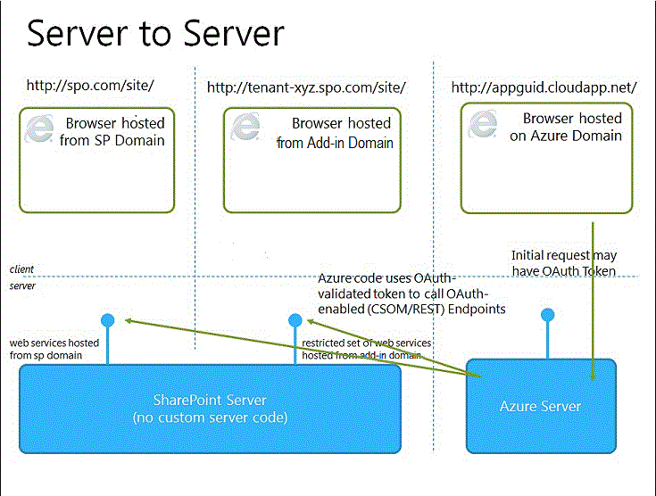

# SharePoint アドインを開発およびホスティングするためのパターンを選択する
SharePoint アドインのコンポーネントをホストするさまざまな方法について説明しています。
SharePoint 2013 のアドイン モデルでは、さまざまなホスティング パターンと開発パターンが導入されています。一部のパターンは、相互に組み合わせて使用できます。たとえば、アドインでは SharePoint によってホストされるコンポーネントとリモートでホストされるコンポーネントを組み合わせることができます。使用するパターンを決定する最も有効な方法は、独自の要件、テクノロジ、目標を基にして、それらを SharePoint アドインによって有効になるオプションおよび可能性と一致させることです。
  
    
    

## 開発パターンを選択するときの考慮事項

SharePoint アドインによって、SharePoint のリソースやサービスを利用するときに使用できるプログラミング言語や技術スタックの範囲が広がります。オプションの正確な範囲は、アドインの種類と、選択するホスティング パターンにより変わります。パターンを組み合わせることもできます。
  
    
    

### SharePoint ホスト型アドイン

最も簡単なオプションから始めます。SharePoint ホスト型アドイン、つまりすべてのコンポーネントが社内または Office 365 の SharePoint ファームでホストされるアドインです。SharePoint ホスト型アドインは、ホスト Web と呼ばれる SharePoint 2013 Web サイトにインストールされます。SharePoint ホスト型アドインのリソースは、アドイン Web と呼ばれる、ホスト Web とは別のサブサイトでホストされます。 [ホスト Web とアドイン Web の違い](host-webs-add-in-webs-and-sharepoint-components-in-sharepoint-2013.md)を理解しておくことが重要です。SharePoint ホスト型アドインの基本的なアーキテクチャを図 1 に示します。
  
    
    

**図 1. SharePoint ホスト型アドインのアーキテクチャ**

  
    
    

  
    
    

  
    
    
SharePoint ホスト型アドインとリモートにホストされるコンポーネントを含むアドインを組み合わせることができますが、アドイン Web 上で実行するアドインまたはアドインの一部には、アドインがホストされる場所、アドインが承認される方法、使用できる言語の 3 つの重要なコンポーネントに関して、以下の一連の要件があります。
  
    
    

|**コンポーネント**|**SharePoint ホスト型アドインの要件**|
|:-----|:-----|
|アドインのコンポーネントがホストされる場所    |SharePoint ファームの別のアドイン ドメイン内    |
|アドインが承認される方法    |サインインしているユーザーの特権    |
|アドインが使用できる言語    |JavaScript (および SharePoint 2013 JSOM ライブラリ) + HTML    |
   
このパターンは展開が最も簡単であり、「 [Napa Office 365 開発ツールを使用して基本的な SharePoint ホスト型アドインを作成する](create-a-basic-sharepoint-hosted-add-in-by-using-napa-office-365-development-too.md)」を使用できます。SharePoint ホスト型アドインの作成を決定する前に、以下のことを考慮する必要があります。
  
    
    

|**利点**|**考慮事項**|
|:-----|:-----|
|リストや Web パーツなどの共通の SharePoint アイテムを再利用できます。    |アドインでは JavaScript しか使用できず、サーバー側コードは使用できません。    |
|比較的簡単に作成して展開できるので、小規模なチームの生産性を向上させるアドイン、およびビジネス ルールがあまり複雑ではないビジネス プロセスの自動化に適しています。    |アドインにはサインインしているユーザーの承認特権しかありません。    |
   
 [SharePoint ホスト型の SharePoint アドインの作成を始める](get-started-creating-sharepoint-hosted-sharepoint-add-ins.md)
  
    
    

### プロバイダー ホスト型アドイン

プロバイダー ホスト型 SharePoint アドインには、SharePoint ファームの外部で展開およびホストされるコンポーネントが含まれます。このようなコンポーネントはホスト Web にインストールされますが、リモート コンポーネントは別のサーバー (これは SharePoint ファームのサーバーであってはなりません) でホストされます。プロバイダー ホスト型アドインの基本的なアーキテクチャを図 2 に示します。
  
    
    

**図 2. プロバイダー ホスト型アドインのアーキテクチャ**

  
    
    

  
    
    

  
    
    
次の表では、プロバイダー ホスト型アドインのホスティング場所、アドインの承認、および言語に関する要件が、SharePoint ホスト型アドインほど厳密ではないことを示します。
  
    
    

|**コンポーネント**|**プロバイダー ホスト型アドインの要件**|
|:-----|:-----|
|アドインのコンポーネントがホストされる場所    |任意の Web サーバーまたはホスティング サービス    |
|アドインが承認される方法    |OAuth または JavaScript クロス ドメイン ライブラリ    |
|アドインが使用できる言語    |Web サーバーまたはホスティング サービスでサポートされている任意の言語    |
   
プロバイダー ホスト型アドインは、SharePoint サイトと対話しますが、リモート サイトのリソースやサービスも使用します。プロバイダー ホスト型アドインの作成を決定する前に、以下のことを考慮する必要があります。
  
    
    

|**利点**|**考慮事項**|
|:-----|:-----|
|アドインを Microsoft Azure または Microsoft 以外のプラットフォームをなどの任意のリモート Web プラットフォームでホストします。    |リモート コンポーネントのインストール、アップグレード、およびアンインストールのロジックを作成する必要があります。    |
|SharePoint クライアント オブジェクト モデル、JavaScript クロスドメイン ライブラリ、または SharePoint 2013  [REST/OData ベースの Web サービス](http://msdn.microsoft.com/magazine/dn198245.aspx)のいずれかを使用して、SharePoint と対話できます。    |SharePoint との各対話方法には、 [データにアクセスするための対応するオプション](secure-data-access-and-client-object-models-for-sharepoint-add-ins.md)があります。    |
| [3 つの承認システム](three-authorization-systems-for-sharepoint-add-ins.md)のいずれかを使用して、SharePoint データに対する承認を得ます。    |アドインでの SharePoint へのアクセスを承認するために OAuth とクロスドメイン ライブラリのどちらを使用するかを決定する必要があります。    |
   

## ホスティング パターンを開発目標と一致させる

技術的な利点と各オプションの制約を考慮するだけでなく、ホスティング パターンを決定するときは、開発目標についても考える必要があります。次の表を参考にして、ニーズに最適なホスティング パターンを選択してください。
  
    
    

|**要件**|**推奨されるホスティング パターン**|**例**|
|:-----|:-----|:-----|
|新しい SharePoint エンティティだけを使用およびプロビジョニングする    |SharePoint でホストされる    |ユーザー選択コントロールを含むアドイン、および SharePoint ユーザーに関する情報を SharePoint リストに格納するアドイン    |
|既存の SharePoint エンティティを使用し、外部の (SharePoint 以外の) Web サービスと対話する    |プロバイダーによってホストされる    |ホスト Web の既存の SharePoint リストから顧客の住所を取得し、Web アプリケーションの地図サービスを使用してその場所を表示するアドイン    |
|新しい SharePoint エンティティをプロビジョニングし、外部の Web サービスと対話する    |SharePoint ホスト型とプロバイダー ホスト型の組み合わせ    |ユーザーによって提供された、または既存の SharePoint リストから取得した住所の緯度と経度の座標を格納できるように、アプリ Web に SharePoint リストをプロビジョニングする地図アドイン    |
   

## プロバイダー ホスト型アドインのホスティング パターンを選択するときの考慮事項

SharePoint ホスト型アドインは、アドイン Web でホストされるため、ホスティング パターンが固定されています。プロバイダー ホスト型アドインは、アドインのさまざまなコンポーネントのホスティングに関してより柔軟であるため、この型のアドインを作成する場合は、目標と要件を適切なホスティング パターンに一致させる必要があります。 
  
    
    

### OAuth またはクロスドメイン ライブラリ

プロバイダー ホスト型アドインとその構築方法を検討するときに考慮しなければならない最も重要なことの 1 つは、SharePoint と対話するためのアドインの承認方法です。プロバイダー ホスト型アドインには、JavaScript クロスドメイン ライブラリと OAuth という 2 つの選択肢があります。 
  
    
    
 [クロスドメイン ライブラリ](access-sharepoint-2013-data-from-add-ins-using-the-cross-domain-library.md)を使用すると、プロキシを介してアドインのリモート コンポーネントから複数のドメインと対話できます。クライアント側コードと、SharePoint にサインインしているユーザーの権限が十分な場合は、クロスドメイン ライブラリが適切なオプションです。クロスドメイン ライブラリは、ファイアウォールを介してリモート呼び出しを行う場合にも便利です。 
  
    
    
OAuth は承認用のオープン プロトコルであり、管理しやすい方法で、クライアント アプリケーション (デスクトップ、Web、モバイル アプリケーション) から安全に承認できます。リモート Web アプリケーションで実行し、SharePoint 2013 と通信する SharePoint アドインを構築する場合、多くの場合は OAuth を使用する必要があります。クライアント側コード (HTML + JavaScript) を排他的に使用できないリモートでホストされる Web アプリケーションから SharePoint を呼び出すときは常に、OAuth が必要です。 [SharePoint アドインでの OAuth の動作の詳細](creating-sharepoint-add-ins-that-use-low-trust-authorization.md)。
  
    
    
「 [SharePoint アドインのセキュリティで保護されたデータ アクセスとクライアント オブジェクト モデル](secure-data-access-and-client-object-models-for-sharepoint-add-ins.md)」および「 [SharePoint アドインの 3 つの承認システム](three-authorization-systems-for-sharepoint-add-ins.md)」では、OAuth とクロスドメイン ライブラリの選択について詳しく説明されています。
  
    
    

### OAuth と社内 SharePoint ファーム

SharePoint 2013 の社内展開を使用している場合は、OAuth を使用できますが、高信頼性アドインを作成するか、Office 365 テナンシーを使用するかを選択する必要があります。Office 365 は Microsoft Azure アクセス制御サービス (ACS) を信頼ブローカーとして使用しており、Office 365 テナンシーにアクセスできない場合は、 [SharePoint の高信頼性アドインを作成する](create-high-trust-sharepoint-add-ins.md)を使用する必要があります。このモデルは、証明書を使用して、アドインと SharePoint の間の信頼を確立します。高信頼性アドインを SharePoint ファームのアドイン カタログに追加できますが、Office ストアで販売することはできません。Office 365 テナンシーにアクセスできる場合は、それを SharePoint 2013 のオンプレミスのインストールにリンクし、 [オンプレミスの SharePoint にインストールされるアドインの信頼ブローカーとして ACS を使用](use-an-office-365-sharepoint-site-to-authorize-provider-hosted-add-ins-on-an-on.md)できます。
  
    
    
次の表では、アドインの SharePoint コンポーネントとリモート コンポーネントの両方をホスティングするために可能なすべてのパターン、および OAuth を使用している場合に使用できる信頼ブローカーを示します。ACS を使用して、SharePoint と、SharePoint 2013 のオンプレミス インストールにインストールされる SharePoint アドインの間に信頼を確立するには、Office 365 テナントにアクセスする必要があることに注意してください。
  
    
    

|**SharePoint コンポーネントの場所**|**リモート コンポーネントの場所**|**信頼ブローカー**|
|:-----|:-----|:-----|
|社内    |クラウド内    |ACS、証明書    |
|社内    |社内    |ACS、証明書    |
|Office 365 SharePoint サイト    |クラウド内    |ACS    |
|Office 365 SharePoint サイト    |社内    |ACS    |
   

## プロバイダーによるホスティングと SharePoint によるホスティングを組み合わせる

SharePoint によってホストされるコンポーネントとクラウドでホストされるコンポーネントの両方を含むアドインを構築することもできます。たとえば、 [カスタム SharePoint リストとコンテンツ タイプを含むクラウドによりホストされるアドイン](create-a-provider-hosted-add-in-that-includes-a-custom-sharepoint-list-and-conte.md)を作成できます。このアーキテクチャを使用する場合、設計と手法ではモデルに組み込むセキュリティの制限事項を考慮する必要があります。SharePoint でホストされるコード コンポーネントでは JavaScript だけを使用でき、リモートでホストされるコンポーネントでは OAuth またはクロスドメイン ライブラリを使用して SharePoint Web サイトと対話する必要があります。この手法を検討するときは、 [SharePoint 2013 でのアドイン承認の動作方法](authorization-and-authentication-of-sharepoint-add-ins.md)を理解しておいてください。図 4 では、Microsoft Azure を使用してアドインのリモート コンポーネントをホストし、OAuth を使用する場合の、このアーキテクチャの動作を示します。
  
    
    

**図 4. OAuth と Windows Azure を使用するときの SharePoint アドインのサーバー間の通信**

  
    
    

  
    
    

  
    
    
 [クラウドによるホスティングと SharePoint によるホスティングを組み合わせたアドインの作成方法。](create-a-provider-hosted-add-in-that-includes-a-custom-sharepoint-list-and-conte.md)
  
    
    
プロバイダーによるホスティングと SharePoint によるホスティングを組み合わせるときの考慮事項を次に示します。
  
    
    

|**利点**|**考慮事項**|
|:-----|:-----|
|2 つのアプローチのすべての利点。    |より複雑なアーキテクチャでは、サーバー間通信およびクロスサイト スクリプティングの制限に関して、慎重に計画を立てる必要があります。    |
   

## Azure Web ロールのプロバイダー ホスト型アドイン

Web アプリケーションの替わりに Microsoft Azure Web ロールでプロバイダー ホスト型 SharePoint アドイン をホストできます (Web アプリケーションがオンプレミスか Azure Web サイト かは無関係)。基本的に言って、Azure Web ロールはインターネット インフォメーション サービス (IIS) に基づく Web サイトであり、Azure にホストされます。ホスティング サービスと、Azure Web ロールのスケーラビリティとを活用できます。SharePoint アドインのパフォーマンスとユーザビリティも向上できます。これは特にアドインが頻繁に用いられる場合や、時間の経過に伴ってアドインの需要が変化する場合にそう言えます。SharePoint アドインにより多くのサーバー リソースが必要になったら、Azure はそれらのリソースをアドインに動的に割り当てることができます。
  
    
    
Azure Web ロールの詳細については、以下のリンクを参照してください。
  
    
    

-  [クラウド サービスとは](http://www.windowsazure.com/ja-jp/manage/services/cloud-services/what-is-a-cloud-service/)
    
  
-  [Microsoft Azure の紹介](http://azure.microsoft.com/ja-jp/documentation/articles/fundamentals-introduction-to-azure/)
    
  
-  [自動スケーリングと Microsoft Azure](http://msdn.microsoft.com/ja-jp/library/hh680945%28v=pandp.50%29.aspx)
    
  
前提条件として Microsoft Azure SDK for .NET (VS 2012) 1.8.1 が必要です ( [Web Platform Installer](http://www.microsoft.com/web/downloads/platform.aspx) を使用してインストールできます) 。
  
    
    
vsnv でプロジェクトを作成するために使用する方法は、まず SharePoint アドイン プロジェクトを開始してから Azure Web ロール プロジェクトを追加するか、それとも Azure プロジェクトを開始してから SharePoint プロジェクトを追加するかに応じて異なります。
  
    
    

### クラウド サービスを既存のアドインに追加する

プロバイダー ホスト型 SharePoint アドインが既にあり、そのアドインを Azure でホストする場合、SharePoint アドインのソリューションで Web アプリケーション プロジェクトを選択します。メニュー バーで、[ **プロジェクト**]、[ **Microsoft Azure クラウド サービス プロジェクトの追加**] の順にクリックします。Azure プロジェクト  _NameOfTheWebAppProject_.Azure が SharePoint アドインのソリューションに追加されます。Web プロジェクトの Web ロールも Azure クラウド サービスのプロジェクトに追加されます。Office Developer Tools for Visual Studio 2012 は、Web ロールが SharePoint アドインで機能するために必要なプロジェクト プロパティを設定します。
  
    
    

### アドインを既存の Web ロールに追加する

プロバイダー ホスト型 SharePoint アドインのホストとして使用する Web ロールが既に Azure クラウド サービスにある場合、Visual Studio で Azure クラウド プロジェクトを開き、[ **ソリューション エクスプローラー**] で Web ロール プロジェクトを選択します。メニュー バーで [ **プロジェクト**]、[ **SharePoint アドイン プロジェクトの追加**] の順に選択します。プロバイダー ホスト型 SharePoint アドインのプロジェクト  _NameOfTheWebAppProject_.Azure が作成され、ソリューションに追加されます。Visual Studio では Azure Web ロールを SharePoint アドインの Web プロジェクト ホストと言います。
  
    
    

## その他の技術情報

詳細については、次の資料を参照してください。
  
    
    

-  [SharePoint アドインのアーキテクチャおよび開発環境に関する重要な要素](important-aspects-of-the-sharepoint-add-in-architecture-and-development-landscap.md)
    
  
-  [SharePoint アドイン](sharepoint-add-ins.md)
    
  
-  [SharePoint 2013 のホスト Web、アドイン Web、および SharePoint コンポーネント](host-webs-add-in-webs-and-sharepoint-components-in-sharepoint-2013.md)
    
  
-  [SharePoint アドインの承認と認証](authorization-and-authentication-of-sharepoint-add-ins.md)
    
  
-  [SharePoint のアドインのコンテキスト トークン OAuth フロー](context-token-oauth-flow-for-sharepoint-add-ins.md)
    
  
-  [Office 365 SharePoint サイトを使用してオンプレミスの SharePoint サイトのプロバイダー向けのホスト型アドインに権限を付与する](use-an-office-365-sharepoint-site-to-authorize-provider-hosted-add-ins-on-an-on.md)
    
  
-  [SharePoint アドインと SharePoint ソリューションの比較](http://msdn.microsoft.com/library/0e9efadb-aaf2-4c0d-afd5-d6cf25c4e7a8%28Office.15%29.aspx)
    
  
-  [プロバイダー ホスト型 SharePoint アドインの作成を始める](get-started-creating-provider-hosted-sharepoint-add-ins.md)
    
  
-  [SharePoint ホスト型の SharePoint アドインの作成を始める](get-started-creating-sharepoint-hosted-sharepoint-add-ins.md)
    
  
-  [SharePoint のカスタムのリストおよびコンテンツ タイプを含む、プロバイダー向けのホスト型アドインを作成する](create-a-provider-hosted-add-in-that-includes-a-custom-sharepoint-list-and-conte.md)
    
  

