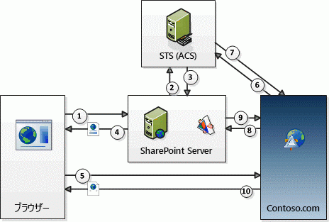

# SharePoint のアドインのコンテキスト トークン OAuth フロー
SharePointでの低信頼性プロバイダー ホスト型アドインの OAuth 認証と承認フローについて説明します。
## OAuth と SharePoint プロバイダー ホスト型 SharePoint アドインの概要

SharePoint において、 **プロバイダー ホスト型の低信頼性アドインの OAuth 認証と承認フローには、ユーザーのアドイン、SharePoint、承認サーバー、およびブラウザーの間で実行時に行われる一連の対話が含まれます** 。このシナリオにおける承認サーバーは Microsoft Azure アクセス制御サービス (ACS) です。
  
    
    
プロバイダー ホスト型アドインには、SharePoint とは別個のリモート Web アプリケーションまたはサービスがあります。これは、SharePoint ファームや SharePoint Online テナンシーの一部ではなく、クラウドで、あるいは社内サーバーでホストすることができます。この記事では、リモート コンポーネントを Contoso.com と呼ぶことにします。
  
    
    

> [!メモ]
> リモート コンポーネントは、SharePoint 項目 (リストやリスト項目など) に発生したイベントに応答するイベント レシーバーをホストすることもできます。Contoso.com が応答できるリモート イベントの例として、リスト イベント (リスト項目の追加や削除など) や、Web イベント (サイトの追加や削除など) があります。リモート イベント レシーバーを作成する方法の詳細については、「 [SharePoint アドインでリモート イベント レシーバーを作成する](create-a-remote-event-receiver-in-sharepoint-add-ins.md)」を参照してください。 
  
    
    

Contoso.com では、SharePoint クライアント オブジェクト モデル (CSOM) または SharePoint REST API を使用して、SharePoint への呼び出しを行います。Contoso.com アプリケーションは、OAuth のトークン受け渡しフローを使用して SharePoint で認証を行います。 **SharePoint と Contoso.com は相互に信頼していませんが、どちらも ACS を信頼しているため** 、ACS によって発行されたトークンを受け入れます。関係するトークンは 3 つあります。ACS は SharePoint のためにコンテキスト トークンを作成します。SharePoint はこれを Constoso.com に転送します。Contoso.com は、コンテキスト トークンが ACS によって発行されたものであることを検証し、そうであればそのトークンを信頼します。その後、Contoso.com は、コンテキスト トークンからリフレッシュ トークンを抽出し、それを使用してアクセス トークンを ACS から直接取得します。Contoso.com は SharePoint に対するすべての要求にこのアクセス トークンを含めます。SharePoint は、アクセス トークンが ACS によって発行されたものであることを検証し、そうであれば Contoso.com からの要求に応答します。
  
    
    
リモート コンポーネントに **トークン処理コードを記述します** 。(ただし、リモート コンポーネントが .NET にホストされている場合、Microsoft Office Developer Tools for Visual Studio によってサンプル コードが提供されており、これが大部分の処理を行います。) トークン処理コードの詳細については、「 [SharePoint のプロバイダー向けのホスト型低信頼アドインでセキュリティ トークンを処理する](handle-security-tokens-in-provider-hosted-low-trust-sharepoint-add-ins.md)」を参照してください。
  
    
    

## フローを使用するための前提条件を満たす

SharePoint アドイン がコンテキスト トークン フローを使用できるようにするには、事前に予備的な手順を実行しておく必要があります。 
  
    
    

- SharePoint アドインを社内の SharePoint ファームにインストールする場合、SharePoint Online にのみインストールする場合には適用されない、以下のセットアップ要件があります。
    
  - アドインをサポートするように **ファームを構成する必要があります** 。(これは、実際には、コンテキスト トークン フローを使用しない場合も含め、すべての SharePoint アドインをファームにインストールする場合の要件です。) 詳細については、「 [SharePoint アドインの環境を構成する (SharePoint 2013)](http://technet.microsoft.com/ja-jp/library/fp161236%28v=office.15%29.aspx)」を参照してください。
    
  
  - アドインをインストールする **お客様** は、 **Office 365 アカウントを持っている必要があります** 。これは、ACS にアクセスするために必要です。お客様は、他の目的のために自分のアカウントを使用する必要はありません。
    
  
  - Office 365 が ACS に対して持つ信頼関係を共有するようにファームを構成する必要があります。これは、Windows PowerShell スクリプトを使用して簡単に行えます。詳細については、「 [Office 365 SharePoint サイトを使用してオンプレミスの SharePoint サイトのプロバイダー向けのホスト型アドインに権限を付与する](use-an-office-365-sharepoint-site-to-authorize-provider-hosted-add-ins-on-an-on.md)」を参照してください。
    
  
- アドインを SharePoint Online にインストールするか、社内の SharePoint ファームにインストールするかにかかわらず、 **SharePoint アドインを ACS に登録する必要があります** 。これを実行する方法の詳細については、「 [SharePoint アドイン 2013 を登録する](register-sharepoint-add-ins-2013.md)」を参照してください。登録の一環として、アドインは ACS にクライアント ID とクライアント シークレットなどを提供します。
    
  

## コンテキスト トークン フローの手順を確認する

以下の図に、SharePoint プロバイダー ホスト型アドインの OAuth 認証と承認フローを示します。
  
    
    

**OAuth コンテキスト トークン フロー**

  
    
    

  
    
    

  
    
    
図中の番号に対応する手順は次のとおりです。
  
    
    

  
    
    

1. ユーザーが SharePoint アドインを SharePoint から起動します。これが実行される方法は、アドインの設計によって決まります。
    
  - アドインがアドイン パーツ (実質的には **IFRAME** を囲むラッパー) 内のリモート Web アプリケーション (Contoso.com にある) を表示するように設計されている場合、アドインの起動は、アドイン パーツの含まれる SharePoint ページに移動するだけで実行できます。(ユーザーがまだログオンしていない場合は、ユーザーがログオンするように SharePoint からメッセージが出ます。) SharePoint がページを処理し、ページ上に Contoso.com アプリケーションからのコンポーネントがあることを検出します。(アドイン パーツの詳細については、「 [アドイン パーツを作成して SharePoint アドインと共にインストールする](create-add-in-parts-to-install-with-your-sharepoint-add-in.md)」を参照してください。)
    
  
  - アドインがブラウザー内のページ全体を使用するように設計されている場合、ユーザーがそのアドインを起動するには、SharePoint の Web サイトの [ **Site Contents**] ページにあるアドイン タイルをクリックします。(他のバリエーションとして、リモート コンポーネントを起動するカスタム メニューやリボン項目がアドインに組み込まれている場合があります。)
    
  
2. アドインを起動する方法にかかわらず、SharePoint は Contoso.com アプリケーションに送信できるコンテキスト トークンを取得する必要があります。そのため、SharePoint コンテキストに関する情報 (現在のユーザー、リモート アプリケーション URL、その他) を格納するコンテキストトークンを作成するように ACS に依頼します。コンテキスト トークンには、暗号化されたリフレッシュ トークンも含まれています。
    
  
3. ACS は、Contoso.com のアドイン シークレットを使用したアルゴリズムでコンテキスト トークンに署名し、それを SharePoint に返信します。ACS と Contoso.com アドインだけがシークレットを知っています。
    
  
4. Contoso.com アプリケーションがアドイン パーツに表示される場合、SharePoint は、アドイン パーツをホストするページをレンダリングし、アドイン パーツ内の **IFRAME** がコンテンツを取得するために呼び出す URL にコンテキスト トークンを追加します。Contoso.com アプリケーションがページ全体の場合、SharePoint はブラウザーを Constoso.com にリダイレクトし、リダイレクト応答の一部としてコンテキスト トークンを組み込みます。
    
  
5. コンテキスト トークンは、Contoso.com サーバーに送信されるブラウザー要求に組み込まれます。
    
  
6. Contoso.com サーバーは、コンテキスト トークンを受け取り、署名を検証します (これを実行できるのは、クライアント シークレットを知っているからです)。これにより、Contoso.com は、トークンが ACS によって発行されたものであり、SharePoint を詐称する第三者から発行されたものではないことを確認できます。Contoso.com は、コンテキスト トークンからリフレッシュ トークンを抽出し、それをクライアント ID やクライアント シークレットなどの他の情報と一緒に ACS に送信して、SharePoint にアクセスするためのアクセス トークンを要求します。
    
  
7. ACS はリフレッシュ トークンを検証し、自身で発行したトークンであることを確認してから、Contoso.com にアクセス トークンを返信します。オプションとして、Contoso.com はこのアクセス トークンをキャッシュし、SharePoint にアクセスするときに毎回 ACS にアクセス トークンを依頼しないで済むようにできます。既定では、アクセス トークンは一度に数時間は有効です (この記事の執筆の時点では、ACS が SharePoint に発行するアクセス トークンの既定の有効期間は 12 時間ですが、これは変更される可能性があります)。各アクセス トークンは、承認を求める最初の要求で指定されたユーザー アカウントに固有のもので、その要求で指定されたサービス (この場合は SharePoint) に対するアクセス許可のみを付与します。リフレッシュ トークンの有効期限はさらに長くなっており (この記事の執筆の時点では 6 か月)、これもキャッシュすることができます。したがって、リフレッシュ トークンそのものが期限切れになるまでは、同じリフレッシュ トークンを ACS からの新しいアクセス トークンに対して再利用できます。(トークンのキャッシュの詳細については、「 [SharePoint のプロバイダー向けのホスト型低信頼アドインでセキュリティ トークンを処理する](handle-security-tokens-in-provider-hosted-low-trust-sharepoint-add-ins.md)」を参照してください。) リフレッシュ トークンが期限切れになると、Contoso.com は新しいコンテキスト トークンを取得することによって新しいリフレッシュ トークンを取得することができます。これが行われる方法の詳細については、「 [新しいコンテキスト トークンを取得する](handle-security-tokens-in-provider-hosted-low-trust-sharepoint-add-ins.md#GetNewContextToken)」を参照してください。
    
  
8. Contoso.com は、アクセス トークンを使用して SharePoint REST API 呼び出しを行うか、SharePoint に CSOM 要求を出します。これは、HTTP **Authorization** ヘッダーに入れて OAuth アクセス トークンを渡すことによって行われます。ヘッダーを作成するサンプル コードは、Office Developer Tools for Visual Studio に添付されています (リモート コンポーネントが .NET プラットフォームでホストされている場合)。
    
  
9. SharePoint は、アクセス トークンを検証し、トークンが ACS によって発行されたものであることを確認します。その後、Contoso.com から要求されたデータを Contoso.com に送信するか、Contoso.com から要求された作成、読み取り、更新、削除 (CRUD) 操作を実行します。
    
  
10. Contoso.com アプリケーションのページがブラウザー (または、アドイン パーツの **IFRAME**) 内でレンダリングされます。
    
  

## その他の技術情報

-  [SharePoint アドインの承認と認証](authorization-and-authentication-of-sharepoint-add-ins.md)
    
  
-  [SharePoint 2013 でのアドインのアクセス許可](add-in-permissions-in-sharepoint-2013.md)
    
  
-  [SharePoint アドインのアーキテクチャおよび開発環境に関する重要な要素](important-aspects-of-the-sharepoint-add-in-architecture-and-development-landscap.md)
    
  
-  [SharePoint ホスト型の SharePoint アドインの作成を始める](get-started-creating-sharepoint-hosted-sharepoint-add-ins.md)
    
  

