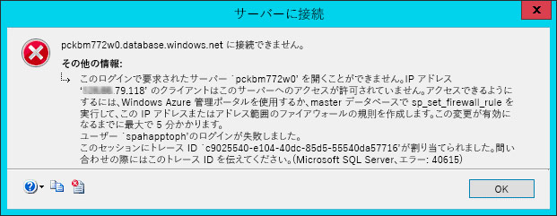

# 自動ホスト型 SharePoint アドインをプロバイダー向けのホスト型アドインに変換する
自動ホスト型の SharePoint アドイン をプロバイダー向けのホスト型アドインへ変換する方法を説明します。
Microsoft SharePoint 2013 は SharePoint サイトの拡張に、ソリューション ベースのカスタマイズを使用する従来のアプローチに加えて、新しいアプローチを導入しました。このアドイン モデルと呼ばれる SharePoint 用の新しい拡張モデルを使うと、開発者は、社内、SharePoint Online、またはハイブリッド展開のいずれで動作している場合でも、SharePoint 環境に展開できるカスタム実装を作成することができます。
  
    
    

開発者は、2 種類の SharePoint アドインを構築できます。1 番目の SharePoint ホスト型アドインは、主にブラウザーで動作します。この種類のアドインをサポートする、HTML、CSS、イメージ、および JavaScript などの資産は、すべて SharePoint で保存および提供されます。他の種類のアドインは、クラウド アドイン モデル (CAM) に分類され、SharePoint の外部にある別のサーバーで主に動作し、クライアント側のオブジェクト モデル (CSOM) と REST API を使用する SharePoint で通信します。それらのアドインは、SharePoint 2013 がサポートしていて定評のある OAuth 2.0 プロトコルを使用して識別されます。
開発者は、プロバイダー向けのホスト型アドインまたは自動ホスト型アドインのどちらかのアドイン モデルを使用してアドインを実装することができました。自動ホスト型アドインは、SharePoint 2013 がリリースされたときに、プレビュー プログラムとしてリリースされましたが、2014 年 5 月、Microsoft は、プレビュー プログラムを終了することと自動ホスト型アドインの作成をこれ以後サポートしないことをアナウンスしました。アナウンスの詳細については、「 [自動ホスト型アドインのプレビュー プログラムの更新](http://blogs.office.com/2014/05/16/update-on-autohosted-apps-preview-program/)」を参照してください。
  
    
    

この記事では、自動ホスト型アドインをプロバイダー向けのホスト型アドインに変換し移行する方法を説明します。しかし、2 つのアプローチの間の特有のいくつかの違いに関する知識が変換プロセスを大幅に単純化するのに役立つため、開発者がこのことを理解することは重要です。
## 自動ホスト型アドインをプロバイダー向けのホスト型アドインに変換するための前提条件

- すべての  [プロバイダー向けのホスト型アドインを開発するための前提条件](get-started-creating-provider-hosted-sharepoint-add-ins.md#SP15createselfhostapp_bk_prereq)。
    
  
- Azure SDK v2.3。 [こちらのダウンロード センターのページ](http://azure.microsoft.com/ja-jp/downloads/)からインストールします。
    
  

### 中核となる概念の理解

自動ホスト型アドインをプロバイダー向けのホスト型アドインに変換する前に、SharePoint アドイン の基本を理解し、SharePoint ホスト型、プロバイダー向けのホスト型、自動ホスト型の SharePoint アドイン の間に生じる違いを理解する必要があります。表 1 に一覧表示されている記事を読めば、それらを理解することができます。
  
    
    

**表 1. 自動ホスト型アドインをプロバイダー向けのホスト型アドインに変換するための中核の概念**

|**記事のタイトル**|**説明**|
|:-----|:-----|
| [SharePoint アドイン](sharepoint-add-ins.md)   |エンドユーザー向けの小型で使いやすいソリューションであるアドインを作成できる、SharePoint 2013の新しいアドイン モデルについて説明します。    |
| [SharePoint アドインのアーキテクチャおよび開発環境に関する重要な要素](important-aspects-of-the-sharepoint-add-in-architecture-and-development-landscap.md)   |SharePoint アドインと SharePoint アドイン用のモデルのアーキテクチャの側面 (アドインのホスティング オプション、ユーザー インターフェイス (UI) オプション、展開システム、セキュリティ システム、ライフサイクルなど) について説明しています。    |
| [SharePoint アドインを開発およびホスティングするためのパターンを選択する](choose-patterns-for-developing-and-hosting-your-sharepoint-add-in.md)   |SharePoint アドイン をホストするためのさまざまな方法を説明しています。    |
| [SharePoint 2013 のホスト Web、アドイン Web、および SharePoint コンポーネント](host-webs-add-in-webs-and-sharepoint-components-in-sharepoint-2013.md)   |ホスト Web とアドイン Web の違いを説明します。また、どのような SharePoint 2013 コンポーネントを SharePoint アドインに含めることができるのか、何がホスト Web に展開され、何がアドイン Web に展開されるのか、アドイン Web がどのように分離ドメインに展開されるのかも説明します。    |
   

## アドインの変換

自動ホスト型 SharePoint アドイン をプロバイダー向けのホスト型アドインへ変換するには、2 つまたは 3 つのコンポーネントの変更が必要です。
  
    
    

- SharePoint アドイン本体
    
  
- リモート Web アプリケーションまたはサービス
    
  
- アドイン内の Microsoft Azure SQL データベース (存在する場合)
    
  
SharePoint の自動ホスト型アドインは、インストール時に Azure Web サイト と Microsoft Azure SQL データベース を自動的に展開していますが、プロバイダー向けのホスト型アドインは、リモート Web アプリケーションおよび任意の Web プラットフォームに存在する他のサービスを保有することができます。この記事では、リモート コンポーネント自動ホスト型アドインが、プロバイダー向けのホスト型アドインへ変換した後も Azure サービスに留まると仮定しています。
  
    
    
次のセクションでは、自動ホスト型アドインをプロバイダー向けのホスト型アドインへ変換するプロセスを説明します。実際のアドインよりも変換手順に集中するために、自動ホスト型アドインの例には、単純な Customer Manager を使用します。これは 3 つのプロジェクトで構成されます。
  
    
    

- CustomersDb: 必要となる *.dacpac を生成する SQL データベース プロジェクトです。このプロジェクトには定義済みのスキーマはないことに注意してください。このプロジェクトは単にデータベースを作成するために使用されます。スキーマは ASP.NET Web アプリケーションによって作成されるためです。
    
  
- CustomerManagerAH: 作成する SharePoint アドイン パッケージに、ASP.NET の Web アプリケーション プロジェクトと Azure SQL データ層アプリケーションを含めるように構成された SharePoint 自動ホスト型アドインです。
    
  
- CustomerManagerAHWeb: Entity Framework Code First with Migrations アプローチを使用してデータベース スキーマを作成して、データベースの読み取り/書き込みを行う ASP.NET MVC の Web アプリケーションです。
    
  
このアドインは ASP.NET MVC の Web アプリケーションであり、Microsoft Azure SQL データベース の表から顧客を表示したり、新しい顧客を追加したりすることができます。これは匿名の Web アプリケーションであり、誰でも顧客を参照または追加することができます。自動ホスト型アドインおよび関連するプロジェクト用の Visual Studio ソリューションは、次の公開リポジトリからダウンロードできます。「 [Autohosted-Migration-Code-Samples](https://github.com/OfficeDev/Auto-Hosted-Migration-Code-Samples)」。
  
    
    
SharePoint 2013 の自動ホスト型アドインをプロバイダー向けのホスト型アドインへ変換するには、複数の手順があります。各手順は以下のセクションで説明します。
  
    
    

1. Microsoft Azure SQL データベース の展開
    
  
2. Azure Web サイト を作成してリモート Web アプリケーションをホストする
    
  
3. SharePoint サイトでアドインを登録する
    
  
4. リモート Web アプリケーション用に Azure Web サイト を更新および展開する
    
  
5. SharePoint プロバイダー向けのホスト型アドインの更新および展開
    
  

### Azure SQL データベースの展開

自動ホスト型アドインをプロバイダー向けのホスト型アドインに変換する最初の手順は、ASP.NET Web アプリケーションが依存する Microsoft Azure SQL データベース をデプロイすることです。Microsoft Azure SQL データベース を作成する方法は数多くありますが、そのいくつかは Microsoft Azure ドキュメント サイト、「 [データベースを Azure にデプロイする方法](http://azure.microsoft.com/ja-jp/documentation/articles/sql-database-deploy/)」にあります。
  
    
    
以下の手順で説明するアプローチでは、データ層アプリケーション展開モデルを使用します。これは SharePoint 自動ホスト型アドインにデータベースを展開するためのモデルであり、データ層アプリケーション パッケージ (*.dacpac) の生成、およびそれを使用したデータベースの作成が含まれます。
  
    
    

#### Azure SQL データベースの作成と展開

最初に、Visual Studio で自動ホスト型ソリューションを開き、データベース プロジェクト [ **CustomerDb**] を右クリックしてから [ **ビルド**] を選択します。これにより、 `[..]\\bin\\[debug | release]` フォルダーに CustomerDb.dacpac ファイルが作成されます。
  
    
    
次の手順では、新しい Microsoft Azure SQL データベース を作成します。[ **Azure 管理ポータル**] (https://manage.windowsazure.com) にログインして、ダッシュボードの読み込みが終わったら、欄外で SQL DATABASES リンクを選択します。
  
    
    

**Azure 管理ポータルの Azure SQL Database ダッシュボード**

  
    
    

  
    
    

  
    
    
トップ ナビゲーションで [ **サーバー**] リンクをクリックしてから、次の図に示すフッターの [ **追加**] ボタンをクリックします。
  
    
    

**Azure 管理ポータルの Azure SQL Database ダッシュボード**

  
    
    

  
    
    
![Azure SQL DB の [追加] ボタン](images/ConvertAuto2ProviderFig4.jpg)
  
    
    
表示される [ **サーバーの作成**] ダイアログで、サーバーのアクセス権のあるユーザーについて Azure の [ **サブスクリプション**]、[ **ログイン名**] および [ **パスワード**] を選択し、事前に Azure Web サイト を作成したときに使用したのと同じ [ **地域**] を選択します。ログイン名およびパスワードは、後の手順で必要となるため記録しておいてください。
  
    
    

**Azure 管理ポータルの Azure SQL Database の作成**

  
    
    

  
    
    
![Azure SQL の [新規 DB] ダイアログ](images/ConvertAuto2ProviderFig5.jpg)
  
    
    
このフォームを入力したら、右下の [ **チェック アイコン**] をクリックしてデータベースを作成します。サーバーを作成している間にアクセスできるリソースは、他の Azure サービスだけです。Microsoft Azure SQL データベース の名前を記録しておいてください。後の手順で必要になるからです。
  
    
    
Microsoft Azure SQL データベース に接続してデータベースを展開するには、データベースを展開するコンピューターからのトラフィックを許可するように、ファイアウォールの規則を作成する必要があります。作成しない場合、Microsoft Azure SQL データベース への接続は、次の図の例と同様のエラーによって拒否されます。
  
    
    

**Azure SQL Database への接続エラー**

  
    
    

  
    
    

  
    
    
ファイアウォールの規則を作成するには、 **[Azure 管理ポータル]** 内で、事前に作成した Microsoft Azure SQL データベース を選択してから、トップ ナビゲーションにある **[構成]** リンクをクリックします。 **[使用できる IP アドレス]** セクションでは、次の図 のように、自分の IP アドレスが現在示されています。 **[使用できる IP アドレスに追加します]** をクリックしてファイアウォールの規則を追加します。これによって Microsoft Azure SQL データベース とデータベースの展開への接続が可能となります。フッターにある **[保存]** ボタンをクリックすることを忘れないでください。
  
    
    

**Azure 管理ポータルでの Azure SQL Database のファイアウォールの規則の作成**

  
    
    

  
    
    

  
    
    
次の手順ではデータベースを展開します。この作業は、Azure SDK v2.3 を使用する Visual Studio から実行できます。インストールは、 [こちらのダウンロード センターのページ](http://azure.microsoft.com/ja-jp/downloads/)から実行します。Visual Studio で、[ **SQL Server オブジェクト エクスプローラー**] ツール ウィンドウを開き、[ **SQL Server**] ノードを右クリックしてから [ **SQL Server の追加**] を選択します。
  
    
    

**Azure SQL Database のサーバー エクスプローラーへの追加**

  
    
    

  
    
    

  
    
    
[ **サーバーに接続**] ダイアログで [ **サーバー名**] を入力し、[ **SQL Server 認証**] に [ **認証**] を設定し、Microsoft Azure SQL データベース を作成したときに定義したものと同じ [ **ログイン**] と [ **パスワード**] を入力します。このサーバー名は、サーバーの完全修飾名 ( `[server-name].database.windows.net`) である必要があります。次の図を参照してください。
  
    
    

**Visual Studio の Azure SQL Database への接続**

  
    
    

  
    
    
![[サーバーへの SQL ログイン] ダイアログ](images/ConvertAuto2Providerfig9.jpg)
  
    
    
Microsoft Azure SQL データベース へ接続後、新しく追加されたサーバーのノードを展開し、[ **データベース**] ノードを右クリックしてから、[ **データ層アプリケーションを発行**] を選択して発行ウィザードを開きます。
  
    
    
[ **ソース データ層アプリケーション (.dacpac)**] セクションで、[ **参照**] ボタンを使用してデータベース プロジェクトが前の手順で構築されたときに作成した *.dacpac ファイルを探し、[ **データベース名**] に CustomerDb が設定されていることを確認してから、[ **発行**] をクリックして Microsoft Azure SQL データベース の CustomerDb を発行します。
  
    
    

**Visual Studio を使用してデータ層アプリケーションを Azure SQL Database に発行する**

  
    
    

  
    
    
![[DACPAC の公開] ダイアログ](images/ConvertAuto2ProviderFig10.jpg)
  
    
    
Visual Studio [ **SQL Server オブジェクト エクスプローラー**] ツール ウィンドウを更新して、[ **データベース**] ノード以下にリストされた CustomerDb を確認します。
  
    
    

    
> **メモ**
>  データベースが自動ホスト型アドイン用にどのような方法で作成されたかによって、Azure への展開用に余分の作業が必要になる場合があります。詳しいガイダンスについては、MSDN の次の記事を参照してください。
>  [Converting between Data-tier Application Projects and Database Projects](http://msdn.microsoft.com/library/40b51f5a-d52c-44ac-8f84-037a0917af33.aspx)
>  [Creating &amp; Managing Data-Tier Application](http://msdn.microsoft.com/library/18907b6c-7678-4182-9304-fe56fdb9f0bd.aspx)
  
    
    

#### 展開後のアクション

Microsoft Azure SQL データベース の作成後に、データベースへの接続の確立で使用する接続文字列のコピーを作成します。これは 2 つの方法で取得することができます。1 つは [ **Azure の管理ポータル**] (https://manage.windowsazure.com) へログインして、前回の手順 (CustomerDb) で作成された Microsoft Azure SQL データベース へ移動する方法です。データベースの [ **ダッシュボード**] ページで、[ **接続文字列の表示**] リンクをクリックして、接続文字列のリストを確認します。後での使用のために [ **ADO.NET**] 接続文字列のコピーを作成します。
  
    
    

**Azure SQL Database 接続文字列を Azure の管理ポータルから取得する**

  
    
    

  
    
    
![[Azure SQL 接続文字列] ダイアログ](images/ConvertAuto2Providerfig11.jpg)
  
    
    
接続文字列を取得するもう 1 つの方法は、Azure SDK v2.3 がインストールされている Visual Studio 内から行う方法です。Visual Studio の [ **SQL Server オブジェクト エクスプローラー**] ツール ウィンドウ内で、[ **CustomerDb**] データベースを選択します。データベースを選択後、[ **プロパティ**] ツール ウィンドウを表示して接続文字列を確認します。これは上述の [ **Azure の管理ポータル**] と同じ値です。
  
    
    

**Azure SDK を介して Visual Studio から Azure SQL Database 接続文字列を取得する**

  
    
    

  
    
    

  
    
    

  
    
    

  
    
    

### Azure Web サイト の作成

次の手順では、プロバイダー向けのホスト型アドイン用にリモート Web アプリケーションが配置される場所に、新しい Azure Web サイト を作成します。アドインの登録には、リモート Web アプリケーションの URL が必要になるため、この作業は最初に実行する必要があります。ただし SharePoint へのアドインの登録は、ASP.NET Web アプリケーション用のファイルの展開より先に実行します。これは登録プロセスからの 2 つの出力 (クライアント IDとクライアント シークレット) が ASP.NET Web アプリケーション ファイルの展開に先駆けて必要となるためです。
  
    
    
新しい Azure Web サイト を作成するには、最初に **[Azure の管理ポータル]** (https://manage.windowsazure.com) にログインします。 ダッシュボードの読み込みが終わったら、次の図に示すように、左側の余白にある **[Web サイト]** ナビゲーション リンクをクリックしてフッターにある **[新規作成]** ボタンをクリックします。
  
    
    

**Azure の管理ポータルの Azure Web サイト ダッシュボード**

  
    
    

  
    
    

  
    
    
次に、新しい Web サイト ウィザードで、 [ **コンピューティング**]、[ **Web サイト**]、[ **簡易作成**] を選択してから、[ **URL**] と [ **Web ホスティング プラン**] を指定します。 最後に、Web サイトを作成する [ **地域**] を指定します。この地域を忘れないようにしてください。後で作成する Microsoft Azure SQL データベース でも同じ地域を使用するためです。 また Wb ホスティング プランがすでに存在しない場合や新しいプランを使用したい場合は、[ **新しい Web ホスティング プランの作成**] を選択します。次の図に例を示します。
  
    
    

**Azure の管理ポータルで Azure Web サイトを作成する**

  
    
    

  
    
    
![[Azure Web サイトの作成] ダイアログ](images/ConvertAuto2Providerfig14.jpg)
  
    
    
Azure Web サイト の作成後、そのサイトで使用した URL を記録します。上記の図では、作成したサイトは  `http://spahapptoph.azurewebsites.net` です。
  
    
    

### 新しいアドインの登録

アドイン モデルを使用して作成されたすべての SharePoint アドイン は、SharePoint とリモート Web アプリケーションの間の信頼を確立するために、ホストする SharePoint ファームまたはテナントに登録する必要があります。これには、次の値を指定する SharePoint に新しいアドイン プリンシパルを登録します。
  
    
    

- **クライアント ID** - アドイン ID
    
  
- **クライアント シークレット** - アドインのパスワード
    
  
- **タイトル** - アドインの名前
    
  
- **アドイン ドメイン** - リモート Web アプリケーションのトップレベル ドメイン
    
  
自動ホスト型アドインが SharePoint Online にインストールされると、Office 365 はアドイン プリンシパルを自動的に作成します。リモート Web アプリケーションの URL を知っているのは、そのサイトを自動的に作成するためです。さらにクライアント ID およびクライアント シークレットも取り込んで、リモート Web アプリケーションの web.config に追加します。web.config とは、Microsoft が提供するクラス (TokenHelper.cs または .vb ファイル) が、要求を検証したり SharePoint を認証するときに参照する場所です。
  
    
    
しかし、プロバイダー向けのホスト型アドインでは、開発者はアドインを手動で登録し、ASP.NET Web プロジェクトの web.config を手動で更新する必要があります。
  
    
    
新しいアドインを登録するには、アドインをインストールする SharePoint Web サイトのアドイン登録ページへ移動します。このページは、 `http://[SharePoint-site-url]/_layouts/15/appregnew.aspx` にあります。アドイン登録ページで、 **[アドインの種類]** を **[Web サーバーで実行中のアドイン]** に設定してから、2 つの **[生成]** ボタンをクリックして新しい **[クライアント ID]** および **[クライアント シークレット]** を作成します。 **[タイトル]** フィールドにアドインの名前を入力し、前回の手順で作成した対象 Azure Web サイト の URL を **[アドイン ドメイン]** フィールドに入力します。最後に **[作成]** ボタンをクリックします。
  
    
    
アドインが登録されると、SharePoint は、登録の作成のフォームに使用した情報の概要を表示します。この情報、具体的にはクライアント ID およびクライアント シークレットをコピーして保管しておくことは非常に重要です。後の手順で必要となるためです。
  
    
    

### リモート Web アプリケーション/ Azure Web サイト 構成の変更

次の手順は、リモート Web アプリケーションを、自動ホスト型アドインではなくプロバイダー向けのホスト型アドインとして展開できるように再構成することです。ASP.NET サイトを Azure Web サイト に展開する方法は複数あります。Visual Studio から直接、Visual Studio Online などのソース コントロールから自動的に、または GitHub から展開する方法、さらには試験済みで本物の FTP オプションを使用する方法もあります。この記事では Visual Studio を使用します。しかし、Web アプリケーションを展開するには、まずプロバイダー向けのホスト型アドインと動作するためにいくつかの更新が必要です。
  
    
    

#### リモート Web アプリケーション プロジェクトの更新

ASP.NET MVC Web アプリケーション内で実行する必要がある大きな変化は、web.config ファイルにあります。このファイルには、 **<appSettings>** ノード内に 3 つの設定があります。それらは、 **ClientId**、 **ClientSecret**、および **SqlAzureConnectionString** です。最初の 2 つは Microsoft 提供のクラス (TokenHelper.cs または .vb) により、リモート Web アプリケーションから SharePoint への認証および通信を容易にするために使用されます。最後の `SqlAzureConnectionString` は、アドインが Microsoft Azure SQL データベース へ接続するために使用します。
  
    
    
SharePoint の自動ホスト型アドインの場合、これらの設定用の値は、アドインのインストール時に Azure Web サイト および Microsoft Azure SQL データベース が作成される際に Office 365 が入力します。しかし、プロバイダー向けのホスト型アドインでは、これらはアドインが展開される前に手動で設定される必要があります。
  
    
    
1 つのオプションは、上記の手順による 3 つの設定に値を貼り付けることですが、このアプローチの欠点は、いったんそれらの変更が必要になると、web.config を手動で更新して Azure Web サイト へ再展開しなければならないことです。
  
    
    
その他のオプションとして、単にこれらの設定をクリア (各種設定キーはそのままで、 **value=""** 属性を空の文字列に設定) して、代わりにそれらを **Azure の管理ポータル** から Azure Web サイト 設定で定義する方法があります。このアプローチから、各種の設定はコードベースの更新なしに変更できることが分かります。
  
    
    
これには、 **[Azure の管理ポータル]** (https://manage.windowsazure.com) にログインして、前の手順で作成した Azure Web サイト に移動します。Azure Web サイト ダッシュボード ページから、トップ ナビゲーション メニューの **[構成]** をクリックし **[アドインの設定]** セクションまで下へスクロールします。 3 つの新しいアドイン設定を、web.config ファイルにある同名の設定を使用して追加します。これまでの手順で取得した値を ClientId、ClientSecret、および SqlAzureConnectionString に対して使用します。
  
    
    
Microsoft Azure SQL データベース 接続文字列が正確で有効であることを確認してください。接続文字列は [ **Azure Management Portal**] と Visual Studio では、パスワード属性はマスクに置換されるからです。接続文字列内のマスクされたパスワードは、Microsoft Azure SQL データベース のログインを作成する際に、定義済みの正しいパスワードを使用するように変更する必要があります。
  
    
    

#### リモート Web アプリケーションを Azure Web サイト へ展開する

ここで ASP.NET MVC Web アプリケーション ファイルをリモート Web アプリケーションとして Azure Web サイト へ展開する必要があります。Visual Studio 内で Web プロジェクトを右クリックして [ **発行**] を選択します。これにより [ **Web の発行**] ウィザード ダイアログを起動します。このダイアログで、[ **Windows Azure の Web サイト**] オプションを選択して [ **発行**] をクリックします。
  
    
    

**Visual Studio の [Web の発行] ダイアログ**

  
    
    

  
    
    
![Visual Studio での [Web サイトの公開] ダイアログ](images/ConvertAuto2Providerfig17.jpg)
  
    
    
次の手順では、以下の図に示すように、ここまでの手順で作成した Azure Web サイト の名前を選択して [ **OK**] をクリックし、さらにサイトの URL が HTTPS であることを確認します。
  
    
    

**既存の Azure Web サイトへ ASP.NET Web アプリケーションを発行する**

  
    
    

  
    
    
![[既存の Web サイトの選択] ダイアログ](images/ConvertAuto2ProviderFig18.png)
  
    
    
最後の手順では、[ **接続の検証**] ボタンをクリックして、各種設定と接続状態が良好であることを確認し、最後に [ **発行**] をクリックします。これで Visual Studio は、ASP.NET Web アプリケーションの Azure Web サイト への展開を開始します。
  
    
    
Web サイトの展開後、Visual Studio は、既定のデバッギング ブラウザーを起動して Azure Web サイト へ移動します。しかし、このサイトの表示はエラーになることが予想されます。エラーが予想されるのは、ASP.NET MVC コントローラーが、SharePoint からの HTTP POST 要求のヘッダーで、特定の値をコントローラーに送信することが想定される属性 (具体的には  `SharePointContextFilter`) でデコレートされているにもかかわらず、既定では、ブラウザーが HTTP GET 要求を送信するためです。
  
    
    

    
> **メモ**
> ASP.NET Web アプリケーションをデプロイする際の追加オプションについては、「Azure Web サイト:  [Azure Web サイトのデプロイ方法](http://azure.microsoft.com/ja-jp/documentation/articles/web-sites-deploy/)」にある Azure のドキュメントを参照してください。 
  
    
    

#### 展開後のアクション

次の手順は、サイトの URL のコピーです。
  
    
    

#### Azure Web サイト のカスタム ドメインと SSL 証明書

すべての Azure Web サイト では、次の命名規則を使用します:  `http[s]://[site-name].azurewebsites.net`。Microsoft では、 `*.azurewebsites.net` ドメイン下にあるすべての Web サイトにワイルドカード SSL 証明書を既に追加済みですが、顧客は、各自の Azure Web サイト でカスタム ドメインを自由に利用し、同時にそれらのカスタム ドメインには顧客独自の SSL 証明書を使用できます。
  
    
    
カスタム ドメインの使用の詳細については、「 [Azure Web サイトのカスタム ドメイン名の構成](http://azure.microsoft.com/ja-jp/documentation/articles/web-sites-custom-domain-name/)」にある Azure のドキュメントを参照してください。カスタム ドメイン名へのカスタム SSL 証明書の追加の詳細については、「 [Azure の Web サイトでの HTTPS の有効化](http://azure.microsoft.com/ja-jp/documentation/articles/web-sites-configure-ssl-certificate/)」にある Azure のドキュメントを参照してください。
  
    
    

### SharePoint アドイン プロジェクトの再構成

最後の手順は、SharePoint アドイン プロジェクトの再構成です。SharePoint アドインの Visual Studio プロジェクトでは、アドイン タイプが自動ホスト型に構成されています。最初に、SharePoint アドイン プロジェクトの AppManifest.xml ファイルを開き、 **[ホスティングの種類]** オプションを **[自動ホスト型]** から **[プロバイダー向けのホスト型]** へ変更することによって、自動ホスト型からプロバイダー向けのホスト型に変更します。
  
    
    
さらに、アドインの [ **スタート ページ**] をリモート Web アプリケーションのスタート ページの URL (Azure Web サイト の URL) を指すように設定します。クエリ文字列の値 {StandardTokens} が存在しなければ、含めることを忘れないでください。これで SharePoint がリモート Web アプリケーションを開いたときに、コアのクエリ文字列トークンを URL に確実に追加します。
  
    
    
次に、Visual Studio の [ **ソリューション エクスプローラー**] と [ **プロパティ**] ツール ウィンドウ内にある SharePoint アドイン プロジェクトを選択し、[ **Web プロジェクト**] プロパティを [ **(None)**] に設定することによって、SharePoint アドイン プロジェクトにある ASP.NET MVC Web アプリケーションへの参照を削除します。図 20 を参照してください。
  
    
    

**SharePoint アドイン パッケージからリモート Web アプリケーションを削除する**

  
    
    

  
    
    

  
    
    
最後の手順では、一部の設定がデザイナー内で公開されていないため、AppManifest.xml ファイルの手動の更新が必要です。この作業は、AppManifest.xml ファイルの既存の変更を保存してから、同じファイルを [ **ソリューション エクスプローラー**] で右クリックして [ **コードの表示**] を選択することで行います。
  
    
    

**コード ビューで AppManifest.xml ファイルを開く**

  
    
    

  
    
    

  
    
    
AppManifest.xml ファイルのコードの表示内で、ASP.NET MVC Web アプリケーション プロジェクトと SQL データ層アプリケーション プロジェクトへの 2 つの参照を削除します。これらは SharePoint プロバイダー向けのホスト型アドイン内では必要ないからです。
  
    
    
次に、新しい GUID を作成して、 **ProductId** 属性にある既存の GUID と置き換えます。これで SharePoint に対して、これが既存のアドインの更新ではなく新しいアドインであることを知らせます。
  
    
    

    
> **重要**
> 既存の ProductID が使用されていた場合、SharePoint は、変換されたアドインがインストールされていると、「指定されたアドインと異なる別のアドインに同じバージョンと製品 ID が付けられています。」というエラーを返します。 
  
    
    

次に、 **<RemoteWebApplication>** 要素を探し、同一の GUID となるように **ClientId** 属性を更新します。この GUID は、アドインを SharePoint に登録する際に取得したもので、さらに Azure Web サイト の web.config アドイン設定で使用されたものです。
  
    
    

**SharePoint プロバイダー向けのホスト型アドインの ClientID を設定する**

  
    
    

  
    
    

  
    
    
すべての変更を AppManifest.xml ファイルに保存すると、このアドインは SharePoint プロバイダー向けのホスト型アドインとしてテストする準備が整っています。アドインを SharePoint ファームまたは SharePoint Online サイトに展開して、変換手順が正しく実行されたことを確認します。
  
    
    

## その他の技術情報

SharePoint アドイン モデル、SharePoint ホスト型アドイン、またはアドイン モデルの詳細については、「 [Office 開発者ブログ](http://blogs.office.com/dev/)」を参照してください。SharePoint アドインの作成、および自動ホスト型アドインからプロバイダー向けのホスト型アドインへ移行を支援するための開発ツール、スクリプト、およびユーティリティについてのニュースと更新情報があります。
  
    
    

