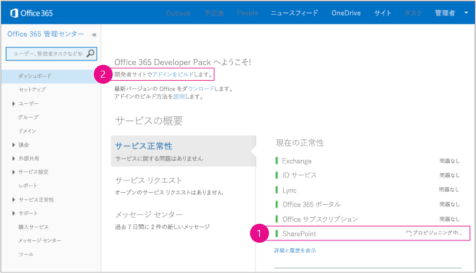
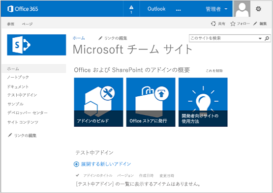

# Napa Office 365 開発ツールを使用して基本的な SharePoint ホスト型アドインを作成する
Napa Office 365 開発ツール を使用して基本的な SharePoint ホスト型 SharePoint アドインを作成する方法を説明します。


![[実行] ボタン](images/Apps_NAPA_Run_Button.png)  [このサンプルをすぐに実行](http://go.microsoft.com/fwlink/?LinkId=313212)
Napa は、SharePoint ホスト型 SharePoint アドインの作成に使用できるツールです。Napa 自体は、 **開発者向けサイト** テンプレートを使って作成する SharePoint Online Web サイト上にインストールできる (プロバイダー ホスト型) SharePoint アドインとして実装されます。SharePoint 開発者向けサイトのホーム ページには **テスト中アドイン** と呼ばれるライブラリがあります。開発者向けサイトの作成と Napa のインストールに関する指示については、この記事の中で後述します。


> **メモ**
> オンプレミスの SharePoint に Napa をインストールすることはできません。 


Napa を使用すると、Visual Studio ではなくブラウザーの中で SharePoint アドインを作成できます。より高度なシナリオが必要なときは、いつでもプロジェクトをダウンロードして Visual Studio で開くことができます。


この記事では、Napaを使用して簡単な SharePoint ホスト型 SharePoint アドインを作成する方法を説明します。ここで作成するアドインには、リストとリスト アイテムを管理するためのコントロールとコードが含まれています。
> **メモ**
> Napa を使用して作成できるのは SharePoint ホスト型の SharePoint アドインだけで、プロバイダー ホスト型は作成できません。両者の違いについては、「 [SharePoint アドイン](sharepoint-add-ins.md)」を参照してください。 <BR /><BR /> 「 [SharePoint 2013 でアドイン Web コンポーネントを更新する](update-add-in-web-components-in-sharepoint-2013.md)」で説明されている SharePoint のアドイン更新セマンティクスは Napa では使用できません。したがって、Napa で作成したアドインを更新する必要がある場合には、最初に Visual Studio にエクスポートする必要があります。その方法に関する指示は、この記事で後述します。 <BR /><BR /> Visual Studio を使用して SharePoint アドインを作成することもできます。詳細については、「 [SharePoint ホスト型の SharePoint アドインの作成を始める](get-started-creating-sharepoint-hosted-sharepoint-add-ins.md)」を参照してください。 


## Office 365 開発者向けサイト を取得する (オプション)
<a name="Prerequisites"> </a>

開発用に使用できる SharePoint Online サブスクリプションをまだ取得していない場合は、このセクションを利用して取得します。取得している場合は、「 [Napa のインストール](#Overview)」にスキップします。


> **メモ**
>  既に Office 365 開発者向けサイト にアクセスできる可能性があります。<BR /><BR /> **MSDN サブスクライバーになっておられますか?** MSDN のサブスクライバーが所有する Visual Studio Ultimate および Visual Studio Premium には、特典として Office 365 Developer サブスクリプションが付いています。 [すぐに特典を利用できます。](https://msdn.microsoft.com/subscriptions/manage/default.aspx)<BR /><BR /> **以下のいずれかの Office 365 サブスクリプション プランをお持ちですか。**<BR /><BR /> **お持ちの場合には、Office 365 サブスクリプションの管理者は  [Office 365 管理センター](https://portal.microsoftonline.com/admin/default.aspx)を利用して開発者向けサイト** を作成できます。詳細については、「 [既存の Office 365 サブスクリプション内で開発者向けサイトを作成する](create-a-developer-site-on-an-existing-office-365-subscription.md)」を参照してください。 


Office 365 プランを取得する方法は 2 つあります。


-  [無料の 30 日間の試用版](https://portal.microsoftonline.com/Signup/MainSignUp.aspx?OfferId=6881A1CB-F4EB-4db3-9F18-388898DAF510&amp;DL=DEVELOPERPACK) を使用します。1 つのユーザー ライセンスが付属しています。


-  [Office 365 Developer サブスクリプション](https://portal.microsoftonline.com/Signup/MainSignUp.aspx?OfferId=C69E7747-2566-4897-8CBA-B998ED3BAB88&amp;DL=DEVELOPERPACK)を購入します。


> **ヒント**
> 後続の手順を引き続き参照できるように、これらのリンクは新しいウィンドウまたはタブで開きます。 


**図 1. Office 365 開発者向けサイトのドメイン名**


1. サインアップ フォームの最初のページ (図にはありません) は説明不要です。要求された個人情報だけを入力して、[ **次へ**] を選択します。


2. 図 1 の 2 番目のページで、サブスクリプションの管理者のユーザー ID を指定します。


3. **onmicrosoft.com** のサブドメインを作成します。

    サインアップの後で、生成された資格情報 ( _UserID_@ _yourdomain_.onmicrosoft.com の形式) を使用して、アカウントを管理する Office 365 ポータル サイトにサインインする必要があります。SharePoint Online 開発者向けサイトは、新しいドメイン **http:// _yourdomain_.sharepoint.com** にプロビジョニングされます。


4. [ **次へ**] を選択し、フォームの最後のページに入力します。電話番号を入力して確認コードを取得することを選んだ場合は、携帯電話か固定電話回線の電話番号を入力できますが、VoIP (ボイス オーバー IP) 番号は入力 *できません*  。


> **メモ**
> 開発者アカウントにサインアップしようとするときに別の Microsoft アカウントでログオンしている場合は、「入力されたユーザー ID は機能しませんでした。有効なユーザー ID ではない可能性があります。組織で割り当てられたユーザー ID を入力していることを確認してください。ユーザー ID は通常、 *someone@example.com*  または *someone@example.onmicrosoft.com*  の形式です」のようなメッセージが表示されることがあります。> このメッセージが表示された場合、使用していた Microsoft アカウントからログアウトし、もう一度やり直してください。引き続きこのメッセージが表示される場合は、ブラウザー キャッシュを消去するか、[ **InPrivate ブラウズ**] に切り替え、フォームにデータを入力します。 


サインアップ プロセスが終了したら、ブラウザーで Office 365 インストール ページが開きます。[管理] アイコンを選択して管理センターのページを開きます。


**図 2. Office 365 管理センターのページ**





1. 開発者向けサイト のプロビジョニングが終了するまで待ちます。プロビジョニングが完了した後、ブラウザーで 管理センターのページを最新の情報に更新します。


2. その後、ページの左上の [ **アドインをビルド**] リンクをクリックして、開発者向けサイト を開きます。表示されるサイトは、図 3 のようなサイトのはずです。ページに [ **テスト中アドイン**] の一覧があります。これで、SharePoint の開発者向けサイトのテンプレートを使用して Web サイトが作成されたことを確認できます。このようなサイトではなく、通常のチーム サイトが表示される場合は、数分待ってから、もう一度サイトを起動してください。


3. サイトの URL を書き留めておきます。これは、Visual Studio で SharePoint アドイン プロジェクトを作成するときに使われます。


**図 3. 開発者向けサイトのホーム ページと [テスト中アドイン] の一覧**





## Napa のインストール
<a name="Overview"> </a>

 サブスクリプションが元々 Office 365 開発者向けサイトとして作成されていない場合は、 サブスクリプションの管理 UI 内に開発者向けサイトを作成してから、そこに Napa をインストールする必要があります。このサイトを作成するための指示については、「 [既存の Office 365 サブスクリプション内で開発者向けサイトを作成する](create-a-developer-site-on-an-existing-office-365-subscription.md)」を参照してください。


Napa をインストールするには、開発者向けサイトを開き、[ **サイト コンテンツ**] > [ **アドインの追加**] > [ **SharePoint ストア**] を選択します。ストアで、Napa を検索してインストールします (Office 365 開発者向けサイトがある場合は、サイトの作成時に Napa が既にインストールされている可能性があり、その場合は [ **サイト コンテンツ**] ページに表示されます)。


## SharePoint アドインのプロジェクトを作成する
<a name="Create"> </a>


1. Office 365 ページで Napa アドインを開きます。


2. [ **新しいプロジェクトの追加**] タイルを選択し、[ **SharePoint 用アドイン**] タイルを選択します。


3. プロジェクトに「Test SharePoint Add-in」という名前を付けて、[ **作成**] ボタンを選択します。

    コード エディターが開き、既定の Web ページが表示されます。このページには、何も作業しなくても実行できるサンプル コードが既に含まれています。


## ホーム ページにコントロールを追加する
<a name="AddControls1"> </a>

SharePoint アドインで、標準の SharePoint リストを作成および削除するためのコントロールと、SharePoint アドインの Web にあるリストの現在の数を取得するためのコントロールを既定のホーム ページに追加します。コントロール用のコードは後から追加します。


### ホーム ページにコントロールを追加するには


1. ページの左側にある **[ページ]** フォルダーの下で、 **[Default.aspx]** ページがまだ選択されていない場合は選択します。

    Default.aspx Web ページがコード エディターに表示されます。


2.  `PlaceHolderMain` セクションで、既存の HTML の下に次のコードを追加します。

 ```HTML

<br />
<div>
    <button id="getListCount">Get count of lists in web</button>
</div>
<br />
<div id="starter">
    <input type="text" value="List name here" id="createlistbox"/><button id="createlistbutton">Create List</button>
    <p>
    Lists
    <br />
    <select id="selectlistbox" ></select><button id="deletelistbutton">Delete Selected List</button>
    </p>
</div>
 ```


この HTML によって以下のコントロールが作成されます。

  - SharePoint アドインの Web にあるリストの数を取得するボタン。


  - 標準の SharePoint リストを作成するためのボタンと、リストを削除するためのボタン。


  - アドイン内で利用できるリストの一覧。


## リストを作成および削除するためのコードを追加する
<a name="AddCode1"> </a>

ここでは、SharePoint アドインでユーザーがリストを作成および削除できるようにするための JavaScript コードを追加します。


### リストを作成および削除するためのコードを追加するには


1. **[スクリプト]** フォルダーを選択して、 **[App.js]** リンクを選択します。

    プロジェクト テンプレートの既定の JavaScript コード ファイルが開いて編集できる状態になります。このファイルには、SharePoint アドインで使用するコードが含まれています。既存のファイルの代わりに別の .js ファイルを追加して、そのファイルにコードを追加することもできます。しかし、この例では、用意されている **App.js** ファイルにコードを追加します。

    次の手順では、前の手順で作成したコントロール用の関数を定義します。


|**関数名**|**説明**|
|:-----|:-----|
| `getWebProperties()` <br/> |**getListCount** コントロールに接続され、Web にあるリストの数を取得します。 <br/> |
| `createlist()` <br/> |**createListButton** コントロールに接続され、標準の SharePoint リストを作成します。 <br/> |
| `deletelist()` <br/> |**deletelistbutton** コントロールに接続され、利用可能なリストの一覧からユーザーが選択したリストを削除します。 <br/> |
 

また、後から説明する  `welcome()` 関数と `displayLists()` 関数も呼び出します。


2. [ **App.js**] ファイルで、 `web`、 `lists`、 `listItemcollection` 変数を 2 つの既定の変数に追加し、 `$(document).ready()` 関数のコードを次の例のように変更します。

    > **メモ**
      > このコードではエラーの波線が表示されます。波線は後の手順で消えます。 

 ```

'use strict';

var context = SP.ClientContext.get_current();
var user = context.get_web().get_currentUser();
var web = context.get_web();
var lists = web.get_lists();
var listItemCollection;  // This variable is used later when you add list items.

(function () {

// This code runs when the DOM is ready and creates a context object which is 
// needed to use the SharePoint object model.
$(document).ready(function () {
    getUserName();
    $("#getListCount").click(function (event) {
        getWebProperties();
        event.preventDefault();
    });

    $("#createlistbutton").click(function (event) {
        createlist();
        event.preventDefault();
    });

    $("#deletelistbutton").click(function (event) {
        deletelist();
        event.preventDefault();
    });
        displayLists();
    });

 ```


次の手順では、定義した JavaScript 関数を追加します。コード内の各関数は  `executeQueryAsync()` を呼び出して実行されます。この呼び出しは SharePoint のクライアント側オブジェクトモデル (CSOM) を使用して、現在保留中の要求をサーバー上で非同期に実行します。関数が非同期に実行されると、スクリプトはサーバーからの応答を待たずに処理を続行します。 `executeQueryAsync()` の個々の呼び出しには 2 つのイベント ハンドラーが含まれています。1 つのハンドラーは関数が正常に実行された場合に応答し、もう 1 つのハンドラーは関数が失敗した場合に応答します。次の表に主要な関数を示します。


|**関数名**|**説明**|
|:-----|:-----|
| `welcome()` <br/> |現在の Web コンテキスト参照を取得し、その参照を使用して現在のユーザー情報をコンテキストに設定します。  <br/> |
| `getWebProperties()` <br/> |現在の Web にあるリストのコレクションを取得し、リストの数を返します。  <br/> |
| `displaylists()` <br/> |Web にあるリストの現在のコレクションを取得します。取得に成功した場合は、利用可能なリストの一覧にコレクション内の各リストの名前を追加します。  <br/> |
| `createlist()` <br/> |標準の SharePoint リスト (リスト テンプレートの種類 **genericList**) を作成し、ユーザーが [ **createlistbox**] コントロールで指定した名前を割り当てます。別の種類のリストも作成できます。リストの種類の詳細については、「 [SPListTemplateType 列挙](http://go.microsoft.com/fwlink/?LinkId=256687)」を参照してください。  <br/> |
| `deletelist()` <br/> |利用可能なリストの一覧からユーザーが選択したリストを削除します。  <br/> |
 
3. [ **App.js**] の  `onGetUserNameFail()` 関数の後に次のコードを追加します。

 ```

function getWebProperties() {
        // Get the number of lists in the current web.
        context.load(lists);
        context.executeQueryAsync(onWebPropsSuccess, onWebPropsFail);
    }

    function onWebPropsSuccess(sender, args) {
        alert('Number of lists in web: ' + lists.get_count());
    }

    function onWebPropsFail(sender, args) {
        alert('Failed to get list. Error: ' + args.get_message());
    }

    function displayLists() {
        // Get the available SharePoint lists, and then set them into 
        // the context.
        lists = web.get_lists();
        context.load(lists);
        context.executeQueryAsync(onGetListsSuccess, onGetListsFail);
    }

    function onGetListsSuccess(sender, args) {
        // Success getting the lists. Set references to the list 
        // elements and the list of available lists.
        var listEnumerator = lists.getEnumerator();
        var selectListBox = document.getElementById("selectlistbox");
        if (selectListBox.hasChildNodes()) {
            while (selectListBox.childNodes.length >= 1) {
                selectListBox.removeChild(selectListBox.firstChild);
            }
        }
        // Traverse the elements of the collection, and load the name of
        // each list into the dropdown list box.
        while (listEnumerator.moveNext()) {
            var selectOption = document.createElement("option");
            selectOption.value = listEnumerator.get_current().get_title();
            selectOption.innerHTML = listEnumerator.get_current().get_title();
            selectListBox.appendChild(selectOption);
        }
    }

    function onGetListsFail(sender, args) {
        // Lists couldn't be loaded - display error.
        alert('Failed to get list. Error: ' + args.get_message());
    }

function createlist() {
        // Create a generic SharePoint list with the name that the user specifies.
        var listCreationInfo = new SP.ListCreationInformation();
        var listTitle = document.getElementById("createlistbox").value;
        listCreationInfo.set_title(listTitle);
        listCreationInfo.set_templateType(SP.ListTemplateType.genericList);
        lists = web.get_lists();
        var newList = lists.add(listCreationInfo);
        context.load(newList);
        context.executeQueryAsync(onListCreationSuccess, onListCreationFail);
    }

    function onListCreationSuccess() {
        displayLists();
    }

    function onListCreationFail(sender, args) {
        alert('Failed to create the list. ' + args.get_message());
    }

    function deletelist() {
        // Delete the list that the user specifies.
        var selectListBox = document.getElementById("selectlistbox");
        var selectedListTitle = selectListBox.value;
        var selectedList = web.get_lists().getByTitle(selectedListTitle);
        selectedList.deleteObject();
        context.executeQueryAsync(onDeleteListSuccess, onDeleteListFail);
    }

    function onDeleteListSuccess() {
        displayLists();
    }

    function onDeleteListFail(sender, args) {
        alert('Failed to delete the list. ' + args.get_message());
    }
 ```


## 実行する
<a name="Run1"> </a>

これで UI とコードの最初の部分が完成したので、アドインを実行して正常に動作するかどうかを確認してみましょう。


### アドインを実行するには


1. ページの下部にある実行 ( ![[実行] ボタン](images/Apps_NAPA_Run_Button.png) ) ボタンを選択します。

    アドインがパッケージ化され、展開され、Office 365 開発者向けサイトにインストールされます。

    インストールが終わると、SharePoint アドインが起動します。ポップアップ ブロックが有効になっているなどの理由でアドインが自動的に起動しない場合は、アドインのリンクを選択してアドインを起動します。


2. [ **Click here to launch your add-in in a new window**] リンクを選択します。

    SharePoint アドインの画面が表示されます。


3. [ **Get count of lists in web**] ボタンを選択します。

    現在の SharePoint アドインの Web に 2 つのリストが含まれていることを示すダイアログ ボックスが表示されます (Web にはデザイン ギャラリー リストとマスター ページ ギャラリー リストが既定で含まれています)。


4. [ **List name here**] ボックスに「Test List」と入力し、[ **Create List**] ボタンを選択します。


5. [ **Lists**] 一覧を開いて、新しいリストが一覧に表示されていることを確認します。


6. [ **Get count of lists in web**] ボタンをもう一度選択します。

    Web には、先ほど作成したリストを含む 3 つのリストが含まれています。


7. [ **Lists**] 一覧で [ **Test List**] を選択し、[ **Delete Selected List**] ボタンを選択します。

    利用可能なリストの一覧から [ **Test List**] が消えます。


8. 終了したら、ブラウザー ウィンドウを閉じて、[ **アドインの起動**] ウィンドウの [ **閉じる**] ボタンを選択し、編集していたプロジェクトに戻ります。


## リスト アイテムを追加および削除するためのコードとコントロールを追加する
<a name="AddControls2"> </a>

リストを作成および削除できるようになったところで、今度は以下の手順を実行してリスト アイテムを追加および削除できるようにします。


### リスト アイテムを追加および削除するためのコードとコントロールを追加するには


1. Default.aspx ファイルを選択して編集します。


2.  `selectlistbox` 要素の下に、次のコードを追加します。

 ```XML

<p>
    Items
    <br />
    <input type="text" value="item name here" id="createitembox"/><button id="createitembutton">Create Item</button>
    </p>
    <p>
    <select id="selectitembox"></select> <button id="deleteitembutton">Delete Selected Item</button>
    </p>
 ```


このコードは、ユーザーがアイテムの名前を指定するための入力ボックス、リストにアイテムを追加するためのボタン、およびリストからアイテムを削除するためのボタンを追加します。


3. **App.js** ファイルを選択して編集します。


4.  `$(document).ready()` 関数で、ユーザーが [ **アイテムの作成**] ボタンと [ **選択したアイテムの削除**] ボタンを選択したときに呼び出される関数の定義を追加します。また、[ **リスト**] リスト ボックスの jQuery イベント ハンドラーを追加し、新しいリストを選択したときにリスト アイテムが更新されるようにします。

 ```

$("#createitembutton").click(function (event) {
            createitem();
            event.preventDefault();
        });

        $("#deleteitembutton").click(function (event) {
            deleteitem();
            event.preventDefault();
        });

        // Update the list items dropdown when a new list
        // is selected in the Lists dropdown.
        $("#selectlistbox").change(function (event) {
            getitems();
            event.preventDefault();
        });
 ```


> **メモ**
> アドインを実行するときにリスト アイテムが表示されない場合は、 `displayLists();` ステートメントが前のコードの後にあることを確認します。

次の手順で、新しく定義した JavaScript 関数と、サポート関数 ( `getItems()`) を追加します。次の表は、主要な関数の機能を示しています。


|**関数名**|**説明**|
|:-----|:-----|
| `createItem()` <br/> |ユーザーが選択したリストにアイテムを追加し、ユーザーが [ **Items**] ボックスで指定した名前をアイテムに割り当てます。  <br/> |
| `deleteItem()` <br/> |ユーザーがリストから選択したアイテムを削除します。  <br/> |
| `getItems()` <br/> |ユーザーが選択したリストのアイテムのコレクション (とその子) を取得します。  <br/> |
 
5. [ **App.js**] の末尾 ( `onDeleteListFail()` 関数の後) にこのコードを追加します。

 ```

function createitem() {
    // Retrieve the list that the user chose, and add an item to it.
    var selectListBox = document.getElementById("selectlistbox");
    var selectedListTitle = selectListBox.value;
    var selectedList = web.get_lists().getByTitle(selectedListTitle);

    var listItemCreationInfo = new SP.ListItemCreationInformation();
    var newItem = selectedList.addItem(listItemCreationInfo);
    var listItemTitle = document.getElementById("createitembox").value;
    newItem.set_item('Title', listItemTitle);
    newItem.update();
    context.load(newItem);
    context.executeQueryAsync(onItemCreationSuccess, onItemCreationFail);
}

function onItemCreationSuccess() {
    // Refresh the list of items.
    getitems();
}

function onItemCreationFail(sender, args) {
    // The item couldn't be created - display an error message.
    alert('Failed to create the item. ' + args.get_message());
}

function deleteitem() {
    // Delete the item that the user chose.
    var selectListBox = document.getElementById("selectlistbox");
    var selectedListTitle = selectListBox.value;
    var selectedList = web.get_lists().getByTitle(selectedListTitle);
    var selectItemBox = document.getElementById("selectitembox");
    var selectedItemID = selectItemBox.value;
    var selectedItem = selectedList.getItemById(selectedItemID);
    selectedItem.deleteObject();
    selectedList.update();
    context.load(selectedList);
    context.executeQueryAsync(onDeleteItemSuccess, onDeleteItemFail);
}

function onDeleteItemSuccess() {
    // Refresh the list of items.
    getitems();
}

function onDeleteItemFail(sender, args) {
    // The item couldn't be deleted - display an error message.
    alert('Failed to delete the item. ' + args.get_message());
}

function getitems() {
    // Using a CAML query, get the items in the list that the user chose, and 
    // set the context to the collection of list items.
    var selectListBox = document.getElementById("selectlistbox");
    var selectedList = selectListBox.value;
    var selectedListTitle = web.get_lists().getByTitle(selectedList);
    var camlQuery = new SP.CamlQuery();
    camlQuery.set_viewXml("<View><ViewFields>" +
        "<FieldRef Name='ID' />" +
        "<FieldRef Name='Title' />" +
        "</ViewFields></View>')");
    listItemCollection = selectedListTitle.getItems(camlQuery);
    context.load(listItemCollection, "Include(Title, ID)");
    context.executeQueryAsync(onGetItemsSuccess, onGetItemsFail);
}

function onGetItemsSuccess(sender, args) {
    // The list items were retrieved.
    // Show all child nodes.
    var listItemEnumerator = listItemCollection.getEnumerator();
    var selectItemBox = document.getElementById("selectitembox");
    if (selectItemBox.hasChildNodes()) {
        while (selectItemBox.childNodes.length >= 1) {
     selectItemBox.removeChild(selectItemBox.firstChild);
        }
    }
        while (listItemEnumerator.moveNext()) {
            var selectOption = document.createElement("option");
            selectOption.value = listItemEnumerator.get_current().get_item('ID');
            selectOption.innerHTML = listItemEnumerator.get_current().get_item('Title');
            selectItemBox.appendChild(selectOption);
        }
}

function onGetItemsFail(sender, args) {
    // The list items couldn't be retrieved - display an error message.
    alert('Failed to get items. Error: ' + args.get_message());
}
 ```


## 修正した SharePoint アドインを実行する
<a name="Run2"> </a>

UI とコードがすべて完成したので、アドインを実行して正常に動作するかどうかを確認してみましょう。


### 修正した SharePoint アドインを実行するには


1. ページの下部にある [ **実行**] ボタンを再度選択します。


2. [ **List name here**] ボックスに「New Test List」と入力し、[ **Create List**] ボタンを選択します。

    新しいリストが [ **Lists**] 一覧に追加されます。


3. [ **Lists**] 一覧で、[ **New Test List**] を選択します。


4. [ **Item name here**] ボックスに「Item 1」と入力し、[ **Create Item**] ボタンを選択します。

    新しいリスト アイテムが [ **Items**] 一覧に表示されます。


5. 前の手順を繰り返して「Item 2」および「Item 3」を追加します。


6. アイテムの一覧で [ **Item 2**] を選択し、[ **Delete Selected Item**] ボタンを選択します。

    [ **Item 2**] がアイテムの一覧から消えます。


7. 終了したら、ブラウザー ウィンドウを閉じます。


## プロジェクトを Visual Studio にエクスポートする
<a name="NextSteps"> </a>

図 3 に示すように [ **Visual Studio で開く**] ボタンを選択してプロジェクトを Visual Studio で開きます。Napaによって必要なツールが自動的にインストールされ、プロジェクトが Visual Studio で開きます。


**図 3. [Visual Studio で開く] ボタン**


![[Visual Studio で開く] ボタン](images/Apps_Napa_OpenInVS.png)


## その他の技術情報
<a name="Additional"> </a>


-  [SharePoint 2013 開発の概要](http://msdn.microsoft.com/library/f86e2695-4d7a-4fc5-bc23-689de96c4b06%28Office.15%29.aspx)


-  [SharePoint アドイン](sharepoint-add-ins.md)


