# SAP Gateway を使用するクラウド ビジネス アドインを作成する
 SAP Gateway for Microsoft を使用して SAP データにアクセスするための LightSwitch SharePoint のプロバイダー向けのホスト型アドインの作成方法について説明します。
この記事では、Microsoft の開発チームが SAP Gateway for Microsoft を使用して SAP データにアクセスするための LightSwitch SharePoint のプロバイダー向けのホスト型アドインを作成するために使用した重要な手順を取り上げます。このアドインは、SAP データに対する CRUD 操作をサポートしており、SharePoint 画像ライブラリの画像を表示したり、SharePoint 画像ライブラリに画像をアップロードしたりするために使用できます。


この記事の目的は、アドインの重要なポイントを示し、同様のアドインを作成するのにお役立ていただくことです。学習効果を高めるため、有効なソリューションの作成方法を確認するためのコード サンプルが用意されており、そのリンクが記事の中に含まれています。
 **サンプルのダウンロード:** [サンプル: SAP Gateway for Microsoft にアクセスするためのクラウド ビジネス アドインの開発](https://code.msdn.microsoft.com/Sample-Developing-a-Cloud-25d6d1ea)


## 始める前に

この記事の手順を実行するには、次の前提条件があります。


- Microsoft Azure Active Directory (Azure AD) テナンシーに関連付けられている Office 365 のドメインにある **Office 365 開発者向けサイト** 。「 [Office 365 Developer サイトへのサインアップ、ツールと環境のセットアップ、およびアドインの展開の開始](https://msdn.microsoft.com/ja-jp/library/office/fp179924%28v=office.15%29.aspx)」または「 [方法: 既存の Office 365 サブスクリプション内に開発者向けサイトを作成する](http://msdn.microsoft.com/ja-jp/library/office/jj692554%28v=office.15%29.aspx)」を参照してください。


- **Visual Studio 2013 Update 4** 以降。「 [Visual Studio 2013 へようこそ](https://msdn.microsoft.com/ja-jp/library/dd831853.aspx)」から入手できます。


- **Microsoft Office Developer Tools for Visual Studio。** Visual Studio 2013 Update 4 以降に付属するバージョンです。


- **SAP Gateway for Microsoft** は Microsoft Azure で展開および構成されています。詳細については、「 [SAP Gateway for Microsoft](http://go.microsoft.com/fwlink/?LinkId=507635)」のドキュメントを参照してください。


- **Microsoft Azure の組織アカウント。** 「 [アプリが Office 365 API にアクセスできるように Azure AD を使用してアプリを手動で登録する](http://go.microsoft.com/fwlink/?LinkID=512580)」を参照してください。

    > **メモ**
      > アカウントを作成したら、Office 365 アカウントにログインして (login.microsoftonline.com) 一時パスワードを変更してください。 
- サンプル データがある **SAP OData エンドポイント** 。 [SAP Gateway for Microsoft](http://go.microsoft.com/fwlink/?LinkId=507635) のドキュメントを参照してください。


- **Azure AD の基本的な知識。** 「 [Azure AD の概要](http://msdn.microsoft.com/ja-jp/library/azure/dn655157.aspx)」を参照してください。


- **SharePoint アドインの作成に関する基本的な知識。** 「 [方法: プロバイダー向けのホスト型の基本的な SharePoint アドインを作成する](http://msdn.microsoft.com/ja-jp/library/office/fp142381%28v=office.15%29.aspx)」を参照してください。


- **Azure AD での OAuth 2.0 に関する基本的な知識。** 「 [Azure AD での OAuth 2.0](https://msdn.microsoft.com/library/azure/dn645545.aspx/)」およびその子トピックを参照してください。


## ソリューションの概要

Contoso Motors は、自動車販売特約店が自動車の在庫に関する情報を営業担当者や提携する他の販売特約店と共有する現実世界の会社を表す架空の自動車販売会社です。このアドインを使用することにより、営業担当者は自動車の在庫の現在の状態を確認できます (アドインは SAP Gateway for Microsoft を使用して SAP からこの情報に直接アクセスします)。すべてのデータは SAP に格納され、それぞれの車の画像は SharePoint Online の画像ライブラリに格納されます。SAP のデータと SharePoint 画像ライブラリのデータが一緒になって、このアドインに表示されます。アドイン内でマネージャーおよび管理者は、SAP 内のそれぞれの車に関する詳細なデータに対して標準の CRUD 操作を実行できます。


この記事の例では、SellerDashboard アドインは SAP の自動車の在庫データと SharePoint 画像ライブラリ内のそれぞれの画像を操作します。このアドインでは、SAP 内のそれぞれの車に関する詳細情報に対する標準の CRUD (作成、読み取り、更新、および削除) 操作がサポートされています。


> **ヒント**
> このアドインのビデオ デモンストレーションについては、BrightTalk のビデオ「 [SAP と Microsoft の詳しい説明: SAP Gateway for Microsoft と Microsoft Azure](http://go.microsoft.com/fwlink/?LinkId=517378)」をご覧ください。アプリの機能のデモは、タイムラインの 48:00 分から開始します。 


 **コードのアーキテクチャ**


SellerDashboard ソリューションには、8 つのプロジェクトが含まれ、次の画像に示すように、BoxXDataStudio および SellerDashboardStudio という 2 つのカテゴリに分かれています。


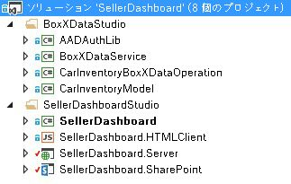


### BoxXDataStudio

このスタジオには、SAP Gateway for Microsoft を操作するのに必要なすべてのコンポーネントが含まれます。


- **AADAuthLib**

    このコンポーネントは、シングルトン パターンを使用する  [Azure AD の認証コード フロー](https://msdn.microsoft.com/ja-jp/library/azure/dn645542.aspx)を実行するのに使用されます。

    次のコード スニペットはメイン関数を示します。これは AADAuthLib コンポーネントが提供するものです。詳細については、AADAuthLib/AuthUtil.cs サンプル コードのヘルパー クラスを参照してください。


 ```cs

// Use the auth code, acquire the refresh token and access token, and store them in the current session
        public bool AcquireTokenFromAuthCode(string authCode, string redirectUrl = "redirectUrl")
        {
            if (!IsAuthorized &amp;&amp; !string.IsNullOrEmpty(authCode))
            {
                AuthenticationResult authResult = _authContext.AcquireTokenByAuthorizationCode(authCode,
                    new Uri(ConfigurationManager.AppSettings["ida:" + redirectUrl]),
                    _clientCredential,
                    ConfigurationManager.AppSettings["ida:ResourceUrl"]);

                HttpContext.Current.Session["RefreshToken"] = authResult.RefreshToken;
                HttpContext.Current.Session["AccessToken-" + ConfigurationManager.AppSettings["ida:ResourceUrl"]] = new Tuple<string, DateTimeOffset>(authResult.AccessToken, authResult.ExpiresOn);

                return true;
            }

            return false;
  }

 // Provide the access token, which is stored in the current session, if the access token expired, use the refresh token get a new one.
 public string AccessToken
        {
            get
            {
                if (!IsAuthorized) throw new UnauthorizedAccessException();

                var accessToken = HttpContext.Current.Session["AccessToken-" + ConfigurationManager.AppSettings["ida:ResourceUrl"]] as Tuple<string, DateTimeOffset>;

                if (IsAccessTokenValid(accessToken))
                {
                    return accessToken.Item1;
                }

                accessToken = RenewAccessToken();
                HttpContext.Current.Session["AccessToken-" + ConfigurationManager.AppSettings["ida:ResourceUrl"]] = accessToken;

                return accessToken.Item1;
            }
  }
 ```

- **BoxXDataService**

    これは WCF RIA サービスです。Azure でホストされる SellerDashboard サーバー側コンポーネントによって使用されるインターフェイスであり、SAP Gateway for Microsoft からの SAP データ ソースを使用します。

    次のコード スニペットは、WCF RIA サービスでサポートされている CRUD Web メソッドです。詳細については、BoxXDataService/BoxXDataService.cs を参照してください。


 ```cs

[Query(IsDefault = true)]
        public IQueryable<InventoryItem> GetAllCarInventory()
        {
            BoxXDataReader dataReader = BoxXDataReader.Instance;
            IInventoryCollection dataCollection = ModelFactory.CreateInventoryCollection(dataReader.SchemaPropertyNames);
            IInventoryQuery query = QueryFactory.CreateQuery();
            dataReader.GetData(dataCollection, query);

            return dataCollection.Items.Cast<InventoryItem>().AsQueryable();
        }

        [Update]
        public void UpdateCarInventoryItem(InventoryItem carInventoryItem)
        {
            BoxXDataUpdater dataUpdater = BoxXDataUpdater.Instance;
            dataUpdater.UpdateInventoryItem(carInventoryItem);
        }

        [Insert]
        public void InsertCarInventoryItem(InventoryItem carInventoryItem)
        {
            BoxXDataCreater dataCreater = BoxXDataCreater.Instance;
            dataCreater.CreateInventoryItem(carInventoryItem);
        }

        [Delete]
        public void DeleteCarInventoryItem(InventoryItem carInventoryItem)
        {
            BoxXDataDeleter.DeleteInventoryItem(carInventoryItem.ID);
 }
 ```

- **CarInventoryBoxXDataOperation**

    これは、BoxXDataService の実際の CRUD 実装です。次の画像は、CarInventoryBoxXDataOperation の主なコード アーキテクチャを示します。CRUD 名前空間は CRUD 操作の実装に使用され、Util 名前空間は CRUD 名前空間のヘルパー コードです。

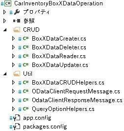


- **CarInventoryModel**

    これは、データ モデルとユーティリティの実装に使用されるライブラリ プロジェクトです。データ モデルの定義は、SAP データ スキーマに基づく、SAP Gateway for Microsoft で使用される OData エンドポイントのメタデータと一致している必要があります。BoxXDataService および CarInventoryBoxXDataOperation は、SAP データベース項目を車の在庫のインスタンスに変換するのに、このプロジェクトを使用します。

    次の画像は、主要なコンポーネントを示します。


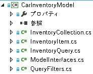


### SellerDashboardStudio

SellerDashboardStudio には、標準の LightSwitch SharePoint アドインのコンポーネントが含まれます。


- **SellerDashboard**

    SellerDashboard はスタートアップ プロジェクトであり、SellerDashboard アドインを Azure Web サイトに、その SharePoint アドインを SharePoint 開発者向けサイトに発行するために使用されます。


- **SellerDashboard.HTMLClient**

    このコンポーネントには、画面、カスタム コントロール、および写真のアップロード コントロールが含まれます。次の画像は、その主要なコンポーネントを示します。


- 
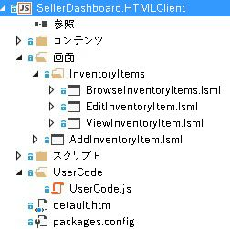


    SellerDashboard.HTML.Client には、次の 4 つの画面が含まれます。

  - BrowseInventoryItems は、すべての在庫品目の基本的な情報を参照するのに使用されるホーム画面です。


  - ViewInventoryItem は、在庫品目ごとの詳細なビューを表示するのに使用される詳細画面です。


  - EditInventoryItem は、在庫品目を編集するのに使用される編集用のポップアップ画面です。


  - AddInventoryItem は、新しい在庫品目を追加するのに使用される追加用のポップアップ画面です。


    UserCode.js ファイルには、UX カスタム コントロール コードが含まれます。

    Scripts フォルダーに含まれている photohelper.js ファイルおよび sharepointauthhelper.js ファイルは、記事「 [チュートリアル: LightSwitch を使用した SharePoint アドインの作成](http://msdn.microsoft.com/ja-jp/library/jj969621.aspx)」で示されているガイダンスに基づいています。


- **SellerDashboard.Server**

    このコンポーネントには、WCF RIA データ ソース、SharePoint データ ソース、および写真のアップロード Web API が含まれます。次の画像は、その主要なコンポーネントを示します。

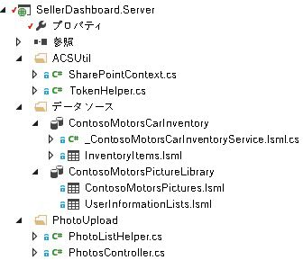


    SharePointContext.cs および TokenHelper.cs は、SharePoint に対する認証用のクライアント コンテキストを提供するヘルパー クラスです。これにより、車の写真を画像ライブラリにアップロードするために写真のアップロード Web API を使用できるようになります。PhotoListHelper.cs ファイルおよび PhotosController.cs ファイルは、写真のアップロード Web API を実装します。LightSwitch による写真のアップロード Web API の使用方法については、「 [チュートリアル: LightSwitch を使用した SharePoint アドインの作成](https://msdn.microsoft.com/ja-jp/library/jj969621.aspx)」を参照してください。


- **SellerDashboard.SharePoint**

    このコンポーネントは、LightSwitch ソリューションの後に追加され、SharePoint プロジェクトを有効にします。このコンポーネントを使用して、画像ライブラリに使用される SharePoint サイトを構成し、アドインに必要なアクセス許可を設定できます。SellerDashboard には、画像ライブラリをホストする SharePoint サイトに対してフル コントロール アクセス許可レベルが付与される必要があります。


## 実装


### 概要

次の画像は、SellerDashboard を構成するコンポーネントを示します。実線はデータ フローを示し、点線は OAuth フローを示しています。緑色のコンポーネントは SAP データの操作に関連し、青色のコンポーネントは SharePoint の画像ライブラリの操作に関連し、オレンジ色のコンポーネントは SellerDashboard アプリ全体の操作を表しています。


 **SellerDashboard ソリューション**


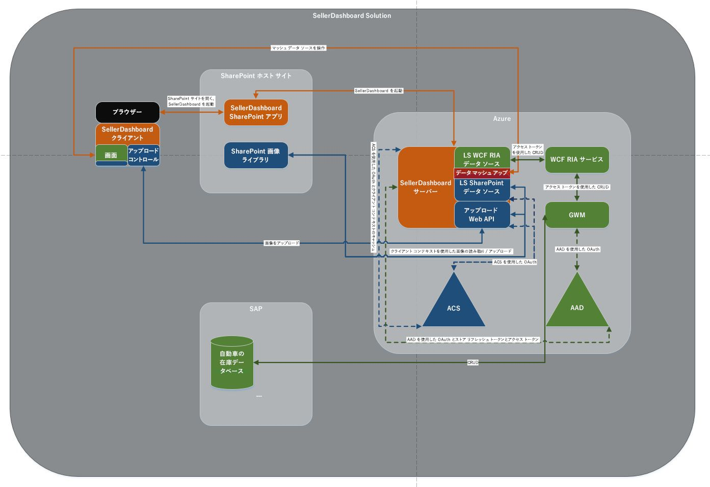


### データ マッシュアップ

LightSwitch は、2 つのデータ ソースの間のリレーションシップをデザイナーに追加することによって、データ マッシュアップをサポートします。


 **SAP データ ソース**


-  *SAP データベースのデータ スキーマ* 

    次のスニペットは、SAP Gateway for Microsoft のデータ スキーマの例を示します。


 ```XML

<?xml version="1.0" encoding="UTF-8"?> 
- <edmx:Edmx xmlns:sap="http://www.sap.com/Protocols/SAPData" xmlns:m="http://schemas.microsoft.com/ado/2007/08/dataservices/metadata" 
xmlns:edmx:"http://schemas.microsoft.com/ado/2007/06/edmx" Version="1.0">
   - <edmx:DataServices m:DataServiceVersion="2.0">
      - <Schema xml:lang="en" xmlns="http://schemas.microsoft.com/ado/2008/09/edm" Namespace="ZCAR_POC_SRV">
         - <EntityType sap:content-version="1" Name="ContosoMotors">
              - <Key>
                     <PropertyRef Name="ID"/>
               </Key>
               <Property Name="ContactPhone" Type="Edm.String"/>
               <Property Name="ContactEmail" Type="Edm.String"/>
               <Property Name="ID" Type="Edm.Int32" Nullable="false"/>
               <Property Name="BuyerEmail" Type="Edm.String" MaxLength="255"/>
               <Property Name="MaxPower" Type="Edm.Int32" Nullable="false"/>
               <Property Name="Engine" Type="Edm.String" Nullable="false" MaxLength="255"/>
               <Property Name="BodyStyle" Type="Edm.String" Nullable="false" MaxLength="255"/>
               <Property Name="Transmission" Type="Edm.String" Nullable="false" MaxLength="255"/>
               <Property Name="Year" Type="Edm.Int32" Nullable="false"/>
               <Property Name="Model" Type="Edm.String" Nullable="false" MaxLength="255"/>
               <Property Name="Brand" Type="Edm.String" Nullable="false" MaxLength="255"/>
               <Property Name="ExtColor" Type="Edm.String" Nullable="false" MaxLength="255"/>
              <Property Name="IntColor" Type="Edm.String" Nullable="false" MaxLength="255"/>
              <Property Name="ContactName" Type="Edm.String" Nullable="false" MaxLength="255"/>
              <Property Name="Price" Type="Edm.String" Nullable="false"/>
              <Property Name="StockNo" Type="Edm.String" Nullable="false"/>
              <Property Name="Arrived_Date" Type="Edm.DateTime" Nullable="false" Precision="0"/>
              <Property Name="Status" Type="Edm.String" Nullable="false" MaxLength="255"/>
      </EntityType>
   - <EntityContainer Name="ZCAR_POC_SRV_Entities" m:IsDefaultEntityContainer="true">
          <EntitySet sap:content-version="1" Name="ContosoMotorsCollection" sap:searchable="true" EntityType="ZCAR_POC_SRV.ContosoMotors"/>
     </EntityContainer>
     <atom:link xmlns:atom="http://www.w3.org/2005/Atom" href="http://contoso.cloudapp.net:8080/perf/sap/opu/odata/sap/ZCAR_POC_SRV/$metadata" rel="self"/>
     <atom:link xmlns:atom="http://www.w3.org/2005/Atom" href="http://contoso.cloudapp.net:8080/perf/sap/opu/odata/sap/ZCAR_POC_SRV/$metadata" rel="latest-version"/>
</Schema>
</edmx:DataServices>
</edms:Edmx>           

 ```


    これは、テスト データベースであり、プロパティの種類と Null 許容値はシナリオに基づいています。ID は PropertyRef であり、OData CRUD 操作は ID に基づいています。StockNo プロパティは、データを SharePoint の画像ライブラリに格納されている車の写真と組み合わせるのに使用されます。


-  *RIA サービスに対して定義されるデータ モデル* 

 ```cs

public interface IInventoryItem
    	{
        IEnumerable<InventoryPropertyName> ValidPropertyNames { get; }
        bool IsValid { get; }

        int ID { get; set; }
        DateTime ArrivedDate { get; set; }
        string BodyStyle { get; set; }
        string Brand { get; set; }
        string BuyerEmail { get; set; }
        string ContactEmail { get; set; }
        string ContactName { get; set; }
        string ContactPhone { get; set; }
        string Engine { get; set; }
        string ExtColor { get; set; }
        IEnumerable<Uri> Images { get; }
        string IntColor { get; set; }
        int MaxPower { get; set; }
        string Model { get; set; }
        decimal Price { get; set; }
        bool Removed { get; }
        string Status { get; set; }
        string StockNo { get; set; }
        string Transmission { get; set; }
        int Year { get; set; }

        void AddImageUrl(Uri url);
        bool CopyFrom(IInventoryItem other);
        object GetPropertyValue(InventoryPropertyName property);
        void MarkAsRemoved();
        void SetPropertyValue(InventoryPropertyName property, object value);
       }

    	public interface IInventoryCollection
       {
        IEnumerable<InventoryPropertyName> QueriedPropertyNames { get; }
        IEnumerable<IInventoryItem> Items { get; }
        bool Valid { get; }

        IInventoryItem this[int id] { get; }
        bool Contains(int id);
        void AddItem(IInventoryItem inventoryItem);
        IInventoryCollection Filter(Predicate<IInventoryItem> match);
        bool CopyFrom(IInventoryCollection other);
}

 ```


    SAP データベース スキーマに含まれていないプロパティはすべて無視できます。たとえば、 **Images** プロパティはスケーラビリティを考慮するために追加されました。このデータ モデルは、実際の SAP データベースと SellerDashboard.Server データ ソースの間の中間層です。LightSwitch プロジェクトには、View および Server の 2 つのコンポーネントがあります。Server 側に外部データ ソースを追加するとき、LightSwitch は Server 側のデータ ソースに追加される抽象データ層を作成するうえで役立ちます。

    多くのプロパティは、SAP データベース スキーマのプロパティと同じ型です。例外は StockNo で、その型が **int** から **string** に変更されています。これは、StockNo が SAP データと SharePoint 画像ライブラリのリレーションシップを定義する手段として使用されるためです。

    > **ヒント**
      > SharePoint 画像ライブラリに格納されている値が **Text** 型であるため、StockNo は、 **string** 型でなければなりません。データ マッシュアップを実行するには、これら 2 つの型が一致していなければなりません。

    2 つのインターフェイスは、CarInventoryModel/InventoryItem.cs と CarInventoryModel/InventoryCollection.cs で実装されます。


-  *LightSwitch サーバー側で使用されるデータ ソース* 

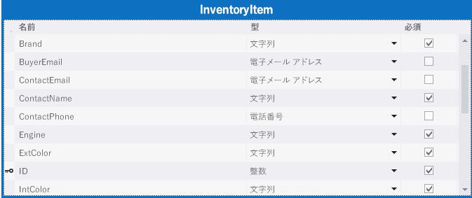


    SellerDashboard サーバーでは、WCF RIA サービス (BoxXDataService) を追加すると、CarInventoryModel で定義されるデータ モデルが含められ、関連するデータ テーブルが作成されます。一部のプロパティの型は変更できます。たとえば、 **BuyerEmail** 型を **String** から **Email Address** に変更でき、LightSwitch はクライアント側の電子メール形式のチェックをサポートします。


 **SharePoint 画像ライブラリ**


SharePoint ホスト サイトの画像ライブラリには ContosoMotorsPictureLibrary という名前が付けられ、StockNo、ThumbnailUrl、および FullImageUrl という 3 つの新しい列が含まれています。それらすべては、 **Text** フィールドとして構成されています。


> **ヒント**
> 列名は大文字と小文字を区別します。 


 StockNo 列は、SAP データとのリレーションシップを作成するのに使用されます。ThumbnailUrl 列と FullImageUrl 列は、関係する画像への URL を便利な方法で取得するのに使用されます。


 *LightSwitch サーバー側で使用されるデータ ソース* 


ContosoMotorsPicture は、LightSwitch サーバー側で SharePoint ホスト サイトの画像ライブラリをマッピングする LightSwitch データ ソース モデルです。


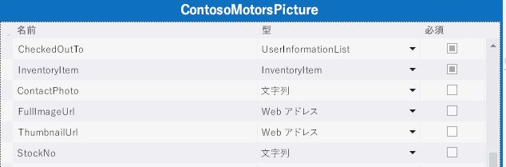


 **データ リレーションシップ**


InventoryItem と ContosoMotorsPicture の間に一対ゼロ リレーションシップまたは一対一リレーションシップを追加します。以下の図では、これがどのようになるかを、Visual Studio の LightSwitch を使用して示します。


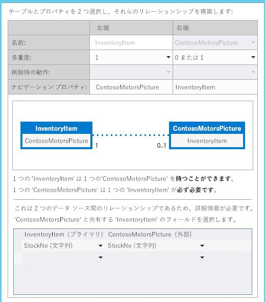


### Azure AD および ACS での OAuth

このセクションでは、アドインが Azure AD およびアクセス制御サービス (ACS) で OAuth を実装する方法の概要を示します。


 ** 概要**


SellerDashboard は、SharePoint 画像ライブラリと SAP データ (SAP Gateway for Microsoft による) の両方で機能する必要のある SharePoint のプロバイダー向けのホスト型アドインです。


SharePoint 画像ライブラリにアクセスするために SellerDashboard は ACS の認証を受けて、そこからアクセス トークンを取得する必要があります。しかし、SellerDashboard は SAP データにアクセスするために Azure AD から別のアクセス トークンを取得する必要があります。これは、SAP Gateway for Microsoft では Azure AD を使用して認証および承認を行うためです。


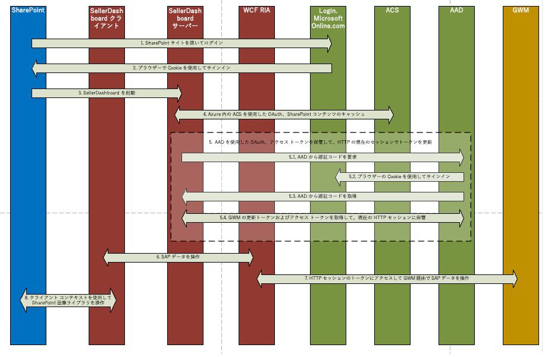


 **実装**


SellerDashboard は SharePoint のプロバイダー向けのホスト型アドインであり、SharePoint のクライアント側オブジェクト モデルを使用することによって画像のアップロード操作をサポートします。 SharePoint コンテキスト (SharePoint ホスト用のクライアント コンテキストを作成するために使用される) はキャッシュされ、次いでクライアント コンテキストはアップロード Web API によって使用されます。


ACS での OAuth のプロセスが完了すると、認証要求が Azure AD に送信されます。そのために、アドインは Cookie を使用して Login.MicrosoftOnline.com にサインインし、Azure AD 承認コード フローを完了します。このコード フローによりリフレッシュ トークンが返され、アドインはこれをセッション中の将来の認証要求用にキャッシュします。このプロセスで使用されるコードを次に示します。



```cs

protected override void Page_Load(object sender, EventArgs e)
{
    if (!IsPostBack)
    {
 SharePointContext spContext = SharePointContextProvider.Current.GetSharePointContext(Context);
        if (spContext != null)
        {
     // Cache the SharePoint Context, which will be used to create Client Context for SharePoint host
            _spContext = spContext;
        }

		
        // Acquire refresh token and access token, and store them in the current session, which will be used do the OAuth with AAD for operating the SAP data
        AuthUtil.Instance.AcquireTokenFromAuthCode(Request.QueryString["code"]);

        if (!AuthUtil.Instance.IsAuthorized)
        {
             Response.Redirect(AuthUtil.Instance.AuthCodeUrl);
        }
     }

     base.Page_Load(sender, e);
 }
```

詳細については、コード サンプル内の SellerDashBoard.Server/SharePointLaunch.aspx.cs および AADAuthLib/AuthUtil.cs を参照してください。


SellerDashboard.Server には SharePointContext.cs ファイルおよび TokenHelper.cs ファイルが含まれます。これらのファイルは SharePoint ホストのアプリ専用クライアント コンテキストを取得するために使用されます。これら 2 つのファイルは、Visual Studio によって SharePoint プロジェクトに自動的に追加されます (Visual Studio では、プロジェクトに < *yourprojectname*  >Web という名前を付けます。たとえば、SharePointAppWeb などです)。その後、これら 2 つのファイルを SellerDashboard アドインのソース コードにコピーして、プロジェクトに含めることができます。


### SAP Gateway for Microsoft から SAP データに対して行う CRUD 操作

次のコード スニペットは、CRUD 操作のメイン コード ロジックを示します。詳細については、コード サンプル内の CarInventoryBoxXDataOperation の実装を参照してください。


 **BoxXDataCreater**



```cs

        public void CreateInventoryItem(IInventoryItem inventoryItem)
        {
            if (_model == null)
            {
                _model = BoxXDataCRUDHelpers.GetMetadata(BoxXDataCRUDHelpers.MetadataUrl);
            }

            // Create new entry request generate
            var requestMessage = new ODataClientRequestMessage(new Uri(BoxXDataCRUDHelpers.DataCollectionUrl),
                                                                ODataConstants.MethodPost);
            BoxXDataCRUDHelpers.CreateEntryRequestHeaderSetter(requestMessage, AuthUtil.Instance.AccessToken);
            BoxXDataCRUDHelpers.SetODataRequestContent(requestMessage, _model, inventoryItem);

            // Create new entry request execute
            IODataResponseMessage responseMessage = requestMessage.GetResponse();

        }
BoxXDataReader
 public void GetData(IInventoryCollection dataCollection, IInventoryQuery query)
        {
            GetValueWithoutLocallyFiltering(dataCollection, query);

            if (query.Filters.Any())
            {
                var filteredCollection = dataCollection.Filter(inventoryItem =>
                    query.Filters.Any(filter => filter.Match(inventoryItem)));

                dataCollection.CopyFrom(filteredCollection);
            }
        }
```

 **BoxXDataUpdater**



```cs

public void UpdateInventoryItem(IInventoryItem inventoryItem)
        {
            if (_model == null)
            {
                _model = BoxXDataCRUDHelpers.GetMetadata(BoxXDataCRUDHelpers.MetadataUrl);
            }

            // Update existing entry request generate
            var requestMessage = new ODataClientRequestMessage(new Uri(BoxXDataCRUDHelpers.DataCollectionUrl + '(' + inventoryItem.ID + ')'),
                                                                ODataConstants.MethodPut);
            BoxXDataCRUDHelpers.UpdateEntryRequestHeaderSetter(requestMessage, AuthUtil.Instance.AccessToken);
            BoxXDataCRUDHelpers.SetODataRequestContent(requestMessage, _model, inventoryItem);

            // Update existing entry request execute
            IODataResponseMessage responseMessage = requestMessage.GetResponse();
        }
BoxXDataDeleter
 public static void DeleteInventoryItem(int ID)
        {
            // Delete existing entry request generate
            var requestMessage = new ODataClientRequestMessage(new Uri(BoxXDataCRUDHelpers.DataCollectionUrl + '(' + ID + ')'),
                                                                ODataConstants.MethodDelete);
            BoxXDataCRUDHelpers.DeleteEntryRequestHeaderSetter(requestMessage, AuthUtil.Instance.AccessToken);

            // Delete existing entry request execute
            IODataResponseMessage responseMessage = requestMessage.GetResponse();
        }
```


### SharePoint 画像ライブラリへの写真のアップロード

写真のアップロード コントロールと写真のアップロード Web API の実装は、次のコードを使用して写真を SharePoint 画像ライブラリにアップロードするために使用されます。このコードは、記事「 [チュートリアル: LightSwitch を使用した SharePoint アドインの作成](https://msdn.microsoft.com/ja-jp/library/jj969621.aspx)」のガイダンスに基づいています。


 **photohelper.js の変更について:**


uploadForm に新しいフィールドが追加され、StockNo を写真のアップロード Web API に渡すのに使用されます。



```

uploadForm = $(
             '<form id="uploadForm" method="POST" enctype="multipart/form-data" action="' + API_URL + '"  data-ajax="false" target="uploadTargetIFrame">' +
             '   <input name="fileInput" id="fileInput" type="file" size="30" data-theme="c" accept="image/*" multiple="true"/>' +
             '   <input type="hidden" name=' + screen.InventoryItem.StockNo + '>' +
             '</form>');

```

画像の URL をキャッシュするためのロジックと画像のセットバック ロジックを追加します。



```

function completeUpload(uploadedFiles) {
            var fullImageUrl = uploadedFiles[0];
            var photoNameWithExt = fullImageUrl.substr(fullImageUrl.lastIndexOf('/') + 1);
            var photoNameWithoutExt = photoNameWithExt.substr(0, photoNameWithExt.lastIndexOf("."));
            var photoPathUri = fullImageUrl.substr(0, fullImageUrl.lastIndexOf('/'));
            var photoExt = photoNameWithExt.substr(photoNameWithExt.lastIndexOf(".") + 1, photoNameWithExt.length);
            var thumbnailUrl = photoPathUri + "/_t/" + photoNameWithoutExt + "_" + photoExt + ".jpg";
            setCacheUrl(screen.InventoryItem.StockNo, fullImageUrl + "*#00#" + thumbnailUrl);
            setDetailsCarPicture(fullImageUrl);
            screen.closePopup();
        }
```

 **PhotosController.cs の変更について:**


SharePoint ホストに対してアプリ専用のクライアント コンテキストを使用します。これは、キャッシュされた SharePoint コンテキストによって作成されます。


これを行うのは、ContosoMotorsPictureLibrary が SellerDashboard アドインではなく、SharePoint ホスト サイトに属しているためです。さらに、写真の削除に関連するコードを削除してください。



```cs

private ClientContext AppWebContext
    {
        get
        {
            if (appWebContext == null)
            {
                appWebContext = SharePointLaunch.getAppWebContext();
            }
            return appWebContext;
        }
    }

```

 **PhotoListHelper.cs の変更について:**


画像の更新ロジックを追加します。これは、古い画像アイテムが存在する場合にそれを削除し、新しい画像アイテムを追加します。新しい画像アイテムの StockNo を割り当て、同時に FullImageUrl 値と ThumbnailUrl 値を新しい画像アイテムに設定します。



```cs

            // Delete the old picture item
            foreach (ListItem item in items)
            {
                if (!string.IsNullOrEmpty((string)(item["StockNo"])))
                {
                    string tempStockNo = item["StockNo"].ToString();
                    if (tempStockNo.Equals(stockNo))
                    {
                        item.DeleteObject();
                        siteContext.ExecuteQuery();
                        break;
                    }
                }
            }

            // Update the new picture item
            foreach (ListItem item in items)
            {
                string fullImageName = item["FileLeafRef"].ToString();
                string thumbnailName = fullImageName.Replace('.', '_') + ".jpg";

                if (photoUri.Contains(fullImageName))
                {
                    item["StockNo"] = stockNo;
                    item["FullImageUrl"] = photoUri;
                    item["ThumbnailUrl"] = photoUri.Replace(fullImageName, "_t/" + thumbnailName);
                    item.Update();
                    siteContext.ExecuteQuery();
                    break;
                }
            }



```


### ユーザー エクスペリエンス

特別なシナリオの要求に対応できるよう、多くのカスタム コントロールが実装されています。関連するコードは UserCode.js ファイル内で見つけることができます。LightSwitch デザイナーを使用して簡単なユーザー インターフェイスをすばやく作成できます。[共通の画面セット] でテストの要求を満たすことができます。ユーザー インターフェイスは、このドキュメントの中心的な内容ではないため、ここで詳細は取り上げません。


## アプリを展開する

アドインを展開するには、このセクションの手順を実行します。このアドインを展開する前に、SAP Gateway for Microsoft が Azure テナントで展開され、構成されていることを確認します。


### Azure Web サイトを作成する


1.  [Microsoft Azure ポータル](http://go.microsoft.com/fwlink/?LinkID=512959) にグローバル管理者としてログインします。


2. 左側のメニューで、 **[Web サイト]** をクリックします。

    > **メモ**
      > この Web サイトは、SellerDashboard 用に SharePoint のプロバイダー向けのホスト型アドインをホストするために使用します。 
3. ページの下部にあるコマンド バーで、 **[新規]** をクリックします。


4. **[計算] > [Web サイト] > [クリック作成]** の順にクリックします。


5. 使用する URL の最初の部分を **[URL]** ボックスに入力し、[Web ホスティング プラン] を選択して、 **[Web サイトの作成]** をクリックします。この URL は、この記事の後のセクションでアドインを登録するときに必要になりますので、コピーしておいてください。たとえば、Constoso.azurewebsites.net を使用します。


### SharePoint アプリを登録する

空の SharePoint アドインを使用して、SharePoint Online の画像ライブラリから車の画像を取得するために必要な読み取りのアクセス許可を SharePoint アドインに付与します。この画像ライブラリが含まれている SharePoint サイトに SharePoint アドインを登録するとともに、サイトに対する読み取りのアクセス許可をアドインに付与するには、以下の手順を実行します。


### SharePoint アドインを登録するには


1. ソリューション エクスプ ローラーでソリューションを開きます。


2. SharePoint アドインのプロパティで、画像ライブラリを含む SharePoint サイトの **サイト URL** を入力します。表示されるログインのダイアログで、サイトの所有者としてログインします。


3. アプリケーションのマニフェストで読み取りのアクセス許可を設定します。

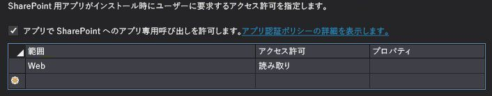


4. アドインをスタートアップ プロジェクトとして設定し、プロジェクトを実行します。ContosoMotorsCarInventoryWeb/Web.config ファイルに ClientID と ClientSecret の値が表示されます。コードは次のようになります。

 ```XML

<add key="ClientId" value="06af1059-8916-4851-a271-2705e8cf53c6"/>
<add key="ClientSecret" value="LypZu2yVajlHfPLRn5J2hBrwCk5aBOHxE4PtKCjIQkk="/>
 ```

5. ContosoMotorsCarInventoryWeb/TokenHelper.cs の [ホストされるアドインの構成] で、ClientID と ClientSecret の値を上記の値に置き換えます。コードは次のようになります。

 ```cs

private static readonly string ClientId = "06af1059-8916-4851-a271-2705e8cf53c6";
private static readonly string ClientSecret = "LypZu2yVajlHfPLRn5J2hBrwCk5aBOHxE4PtKCjIQkk=";

 ```


### Web アプリケーションを Azure AD に登録する

このセクションの手順では、Azure の管理ポータルからサンプル アドインを登録する方法を説明します。


1. Azure のサービス管理者または共同管理者アカウントを使用して、 [Azure 管理ポータル](http://go.microsoft.com/fwlink/?LinkID=512959)にログインします。


2. 左側のナビゲーション ウィンドウで、 **[Active Directory]** をクリックします。


3. [Active Directory] ページで、SAP Gateway for Microsoft に構成したディレクトリをクリックします。

    > **ヒント**
      >  どのディレクトリを使用したか分からない場合は、SAP Gateway for Microsoft 管理者に問い合わせてください。ヒント: SAP Gateway for Microsoft のユーザーとグループを含むディレクトリです。
4. 上部のナビゲーション バーで、 **[アプリケーション]** をクリックします。


5. ページの下部で、 **[追加]** をクリックします。


6. 表示されるダイアログで、 **[組織が開発中のアプリケーションを追加]** をクリックします。


7. **[アプリケーションの追加]** ダイアログ ボックスで、アプリケーションに、たとえば「SellerDashboard」などの名前を付けます。


8. アプリケーションの種類として、 **[Web アプリケーションまたは Web API]** を選択してから、右矢印をクリックします。


9. **[プロパティの追加]** ダイアログ ボックスで、以前に (「Azure Web サイトを作成する」セクションで) 作成したサイトの URL をサインオン URL として使用します。たとえば、 *https://Constoso.azurewebsites.net*  を使用します。


10. **アプリ ID URI** で、 **サインオン URL** の末尾にアプリケーション名を付加するなど、一意の URI を指定します。たとえば、 *https://Constoso.azurewebsites.net/SellerDashboard*  などです (Constoso.azurewebsites.net は、この記事で以前作成したサイト)。


11. アプリケーションを作成するには、チェックマークをクリックします。 

    アプリケーションの Azure ダッシュボードが開き、成功を示すメッセージが表示されます。


> **メモ**
> アドインを Azure AD に 2 回登録する必要があります。1 回はデバッグのため、もう 1 回は運用を目的とした展開のためです (手順 10 を参照)。 > アドインをデバッグ用に登録するには、Visual Studio debugger (F5) を実行できるように、SellerDashboard.Server プロジェクトのデバッグ URL と共に **サインオン URL** と **アプリ ID URI** を使用します。この URL は、https://localhost. *nnnn*  の形式です。ここで、 *nnnn*  はポート番号です。この URL は、Visual Studio の [プロパティ] ウィンドウで確認できます。> 次に、運用のために展開する準備ができたら、登録内容を編集して正しい運用 URL を使用します。 


### アプリケーションの設定を構成する

前の手順で作成した新しいアプリケーションの設定を構成します。 


1. [アプリケーション] ページの上部で、 **[構成]** をクリックします。


2. 必要な場合はパラメーターを設定し、次の表で説明するように構成設定を書き留めます。


|**パラメーター**|**アクション**|
|:-----|:-----|
|クライアント ID  <br/> |"クライアント ID" フィールドに表示される値をコピーします。  <br/> |
|クライアント シークレット  <br/> | 新しいアプリケーション キーを生成します。 <br/>  [キー] セクションで、1 年または 2 年の期間を選択します。 <br/>  ページの下部にあるコマンド バーで、 **[保存]** をクリックします。 <br/>  キーの値が表示されます。 <br/>  将来の使用のためにキーの値をコピーし、保存します。ページから移動すると、キーの値を取得することはできません。 <br/> |
|アプリ ID URI  <br/> |**[アドイン ID URI]** フィールドに表示される値をコピーします。 <br/> |
 

    以降の手順で必要になるため、この情報を手元に置くことを覚えておいてください。


3. **[他のアプリケーションへのアクセス許可]** セクションで、以下を実行します。

1. SAP Gateway for Microsoft アプリケーションを選択します。


2. **[デリゲートされたアクセス許可]** 列で、SellerDashboard 用の SharePoint のプロバイダー向けのホスト型アドインが必要とする SAP Gateway for Microsoft に対するアクセス許可のボックスを有効にします。


4. ページの下部にあるコマンド バーで、 **[保存]** をクリックします。


### 展開に必要な構成を置き換える


1. SellerDashboardHTMLClient/UserCode.js を見つけて、次のコードのプレース ホルダーを検索します。

 ```cs

sharePointUrl: "Replace with your SharePoint host site",
// https://fake_domain.sharepoint.com/sites/Developer
SharePointRootUrl: "Replace with your SharePoint root site"
 // https://fake_domain.sharepoint.com/ 

 ```


1. sharePointUrl 値を SharePoint サイトに置き換えます。SharePoint サイトはアドインのインストール先であり、画像ライブラリもそこに含まれます。


2. sharePointRootUrl 値を関連する SharePoint ルート サイトに置き換えます。


2. SellerDashboard ソリューションで SellerDashboard.Server/Web.config を見つけ、次の構成のプレースホルダーを検索します。

 ```XML

<add key="ClientSecret" value="MwMp1yxOyy8BGhfD5d9VvuqlRbhaqWESxVNLzgpYNHU=" />
<add key="ClientId" value="ed138b32-c89d-4f22-b74d-7d9d5044b260" />
<add key="Ida:ClientId" value="Replace with Azure register add-in client id" />
<add key="Ida:ClientSecret" value="Replace with Azure register add-in client secret" />
<add key="Ida:TenantId" value="Replace with the SAP Gateway for Microsoft tenant domain, for example <yourDomain>.onmicrosoft.com" />
<add key="Ida:RedirectUrl" value="Replace with the Azure host site, for example https://contoso.azurewebsites.net/SharePointLaunch.aspx" />
<add key="Ida:ResourceUrl" value="Replace with the SAP Gateway for Microsoft instance, for example http://contoso.cloudapp.net/" />
<add key="Ida:ODataServiceBaseUrl" value="Replace with the SAP OData endpoint url, for example https://contoso.cloudapp.net:8081/perf/sap/opu/odata/sap/ZCAR_POC_SRV/" />
<add key="Ida:ODataServiceMetadataUrl" value="Replace with the SAP OData endpoint metadata url, for example https://contoso.cloudapp.net:8081/perf/sap/opu/odata/sap/ZCAR_POC_SRV/$metadata" />
<add key="Ida:DataCollection" value="Replace with OData EntitySet name, for example ContosoMotorsCollection" />
<add key="Ida:ODataFeedOrEntryFormat" value="application/atom+xml" />
<add key="Ida:ODataMetadataFormat" value="application/xml" />
<add key="Ida:ODataContentType" value="application/xml" />
<add key="Ida:ODataVersion" value="2.0" />
<add key="Ida:ODataMaxVersion" value="3.0" />
<add key="Ida:ODataWriterTypeName" value="Replace with the OData EntityType, for example ZCAR_POC_SRV.ContosoMotors" />
<add key="Ida:DefaultID" value="1024" />
<add key="Ida:DefaultStockNo" value="2048" />
<add key="Ida:SPPicLib" value="Replace with you picture library name, for example ContosoMotorsPictureLibrary" />
 ```


1. ClientId と ClientSecret の値を以前の手順で取得した値に置き換えます。


2. Ida:ClientId と Ida:ClientSectet の値を Azure AD アプリからの値に置き換えます。


3. Ida:TenantId 値を < *yourDomain*  >.onmicrosoft.com に置き換えます。

    たとえば、組織アカウントが someone@< *yourDomain*  >.onmicrosoft.com であれば、< *yourDomain*  >.onmicrosoft.com に置き換えなければなりません。


4. Ida:RedirectUrl 値を、このアドインをホストする、Azure 上に作成したテスト サイトに置き換えます。


5. Ida:ResourceUrl 値を、Azure で展開および構成された SAP Gateway for Microsoft インスタンスに置き換えます。


6. Ida:ODataServiceBaseUrl 値を SAP Gateway for Microsoft インスタンスの OData エンドポイント URL に置き換えます。


7. Ida:ODataServiceMetadataUrl 値を SAP Gateway for Microsoft インスタンスの OData エンドポイント メタデータ URL に置き換えます。


8. Ida:DataCollection 値を置き換えます。この値は、メタデータから取得できます。たとえば、ContosoMotorsCollection を使用します。


9. Ida:ODataWriterTypeName 値を置き換えます。正しい値はメタデータから取得できます。 

    たとえば、次の値を使用します。


 ```XML

ZCAR_POC_SRV.ContosoMotors

<EntityContainer Name="ZCAR_POC_SRV_Entities" m:IsDefaultEntityContainer="true">
     <EntitySet sap:content-version="1" Name="ContosoMotorsCollection" sap:searchable="true" EntityType="ZCAR_POC_SRV.ContosoMotors"/>
</EntityContainer>
<atom:link xmlns:atom="http://www.w3.org/2005/Atom" href="http://contoso.cloudapp.net:8080/perf/sap/opu/odata/sap/ZCAR_POC_SRV.ContosoMotors"/>
 ```

10. Ida:SPPicLib 値を、SharePoint ホスト サイトで作成した画像ライブラリ名に置き換えます。


### プロジェクトを発行する


1. SellerDashboard ソリューションで SellerDashboard プロジェクトを探します。


2. SellerDashboard を右クリックして、プロジェクトを発行します。


3. **[プロバイダーでホストされる]** を選択します。


4. **[Windows Azure]** を選択します。


5. グローバル管理者としてサインインします。


6. Azure で作成した Web サイトを選択します。


7. HTTPS を使用することを指定します。


8. 既定のデータ接続文字列を使用します。


9. Azure でホスト Web サイトとして作成した Web サイトを入力します。前の手順で取得した ClientId と ClientSecret の値を入力します。


10. 発行します。

     発行済みパッケージを取得します。


### アプリをインストールする


1. SharePoint の展開サイトにサイト管理者としてログインします。


2. サイトのホーム ページで、 **[展開する新しいアドイン]** をクリックします。


3. 発行プロセスで取得したパッケージを選択します。


4. 展開し、信頼します。


## 外部コードの一覧


|**Web ソース**|**コレクション**|**コードの場所**|**ライセンス**|
|:-----|:-----|:-----|:-----|
| [アンケート アドインのチュートリアル: LightSwitch を使用した SharePoint アプリケーションの開発](http://code.msdn.microsoft.com/Survey-App-Tutorial-a70d0afd) <br/>  [チュートリアル: LightSwitch を使用した SharePoint アドインの作成](https://msdn.microsoft.com/ja-jp/library/jj969621.aspx) <br/> |**写真アップローダー:** <br/> PhotoListHelper.cs  <br/> PhotosController.cs  <br/> Global.asax.cs  <br/> | [アンケート アドインのチュートリアル: LightSwitch を使用した SharePoint アドインの開発 (C#)](http://www.getcodesamples.com/src/2571E87E/) <br/> |Apache License, Version 2.0  <br/> |
|null  <br/> |**ACS 認証:** <br/> SharePointContext.cs  <br/> TokenHelper.cs  <br/> |**VS 内部テンプレート:** <br/> Visual C#/Office/SharePoint/Apps/AppforSharePoint  <br/> ||
 

