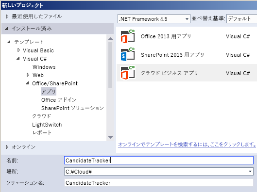
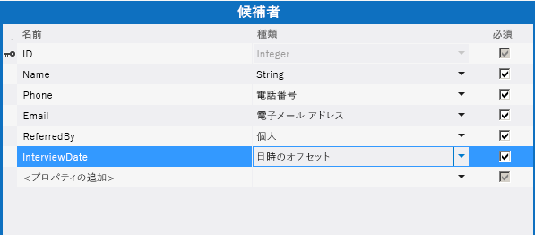
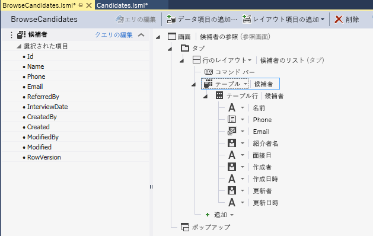
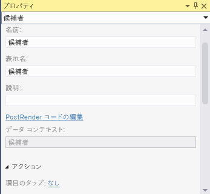
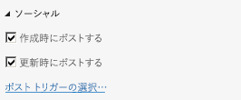

# ソーシャル ニュースフィード付きのクラウド ビジネス アドインを作成する
Visual Studio で [ **クラウド ビジネス アドイン**] テンプレートを使用することにより、ユーザーが SharePoint データを表示、追加、更新できる SharePoint アドインを作成できます。[ **クラウド ビジネス アドイン**] のプロジェクトの種類では、Visual Studio LightSwitch テクノロジの使用により、SharePoint でホストされるビジネス アドインの作成プロセスが大幅に簡略化されています。このチュートリアルでは、求職者を追跡するアドインを作成し、SharePoint for Office 365 ソーシャル統合機能を利用して、アドインにニュース フィードを提供します。完全なサンプル アプリケーションを次の MSDN Code Gallery からダウンロードできます:  [ソーシャル ニュースフィードを使用したクラウド ビジネス アドインの作成](http://code.msdn.microsoft.com/Creating-a-Cloud-Business-8540c0c9)
## 前提条件

このチュートリアルでは Visual Studio 2013 が必要です。


このアドインをホストするには、SharePoint 2013 サイトまたは Office 365 の SharePoint 開発者向けサイトを使用する必要があります。これについては、「 [Office 365 開発者向けサイトにサインアップする](http://go.microsoft.com/fwlink/?LinkId=263490)」を参照してください。


## [クラウド ビジネス アドイン] プロジェクトの作成
<a name="bk_create"> </a>

 クラウド ビジネス アドインを作成するには、最初に、Visual Studio の [ **クラウド ビジネス アドイン**] プロジェクト テンプレートを使用します。


### プロジェクトを作成するには


1. メニュー バーで [ **ファイル**]、[ **新規**]、[ **プロジェクト**] の順にクリックします。

    [ **新しいプロジェクト**] ダイアログ ボックスが表示されます。


2. 図 1 のように、テンプレートの一覧で、[ **Visual Basic**] または [ **Visual C#**] ノードを展開して、[ **Office/SharePoint**] ノードを展開し、[ **アドイン**] ノードを選択してから、[ **クラウド ビジネス アドイン**]を選択します。

   **図 1. プロジェクトの追加**





3. [ **名前**] テキスト ボックスに [CandidateTracker] と入力し、[ **OK**] をクリックします。

    [ **新しいクラウド ビジネス アドイン**] ウィザードが開きます。


4. [ **新しいクラウド ビジネス アドイン**] ウィザードで、Office 365 Developer サイトの URL を入力し、[ **完了**] ボタンを選択します。

    URL の形式は、https://  _MySite_.sharepoint.com/sites/Developer/ にします。

    [ **CandidateTracker**] ソリューションが 4 種類のプロジェクト、つまりトップレベルの [ **CandidateTracker**] プロジェクト、[ **CandidateTracker.HTMLClient**] プロジェクト、[ **CandidateTracker.Server**] プロジェクト、[ **CandidateTracker.SharePoint**] プロジェクトと共にソリューション エクスプローラーに追加されます。


## データと画面の追加
<a name="bk_add"> </a>

Candidate Tracker アドインにはデータベース テーブルと、データを表示、追加、更新するための画面が必要です。データベース テーブルは [ **Server**] プロジェクトで作成し、画面は [ **HTMLClient**] プロジェクトで作成します。


### データベース テーブルを追加するには


1. [ **ソリューション エクスプローラー**] で [ **CandidateTracker.Server**] ノードのショートカット メニューを開き、[ **テーブルの追加**] を選択します。

    エンティティ デザイナーが開きます。


2. [ **プロパティ**] ウィンドウで、[ **名前**] プロパティのテキスト ボックスに [求職者] と入力します。


3. エンティティ デザイナーで [ **<プロパティの追加>**] リンクをクリックし、[名前] と入力します。


4. [型] の規定値である **String** を適用し、[ **必須**] チェック ボックスはチェックを付けたままで、 **Enter** を押します。


5. [ **<プロパティの追加>**] リンクをクリックし、[電話] と入力して、 **Tab** キーを押します。


6. [ **種類**] 列で [ **電話番号**] を選択し、Tab キーを 2 回押します。

    [ **電話番号**] は、書式設定と電話番号の検証を自動的に行う カスタム ビジネス タイプ です。


7. 次の行の [名前] に [ **Email**] と入力し、[ **種類**] では [ **電子メール アドレス**] を選択します。

    [ **電子メール アドレス**] も、電子メール アドレスを検証するカスタム ビジネス タイプです。


8. 次の行で [ReferredBy] を [ **名前**] に入力し、[ **種類**] では [ **人**] を選択します。

    [ **人**] ビジネス タイプは、SharePoint ユーザー プロファイル サービスへの接続を提供します。これにより、Active Directory からユーザー情報を取得できます。


9. 次の行で InterviewDate を [ **名前**] に入力し、[ **日時オフセット**] を [ **種類**] で選択します。

    [ **日時オフセット**] ビジネス タイプにより日付と時刻が UTC 形式で格納されます。これによりユーザーがさまざまなタイム ゾーンで正しい時刻を確認できます。

    図 2 では、エンティティ全体が示されています。


   **図 2. [求職者] エンティティ**





### 参照画面を作成するには


1. エンティティ デザイナーの [ **パースペクティブ**] バーで、[ **HTML クライアント**] タブを選択して、ツール バーの [ **画面**] を選択します。

    [ **新しい画面の追加**] ダイアログ ボックスが表示されます。


2. [ **新しい画面の追加**] ダイアログ ボックスの [ **画面テンプレートの選択**] の一覧で、[ **データの参照画面**] を選択します。


3. [ **画面データ**] の一覧で [ **求職者**] を選択し、[ **OK**] をクリックします。

    画面デザイナーが開きます。左ペインにはデータ エンティティが、右ペインには画面レイアウトが表示されています。


4. 図 3 で示されているように、画面デザイナーの右ペインで [ **リスト | 求職者**] ノードを選択し、[ **リスト**] の一覧を展開して、[ **テーブル**] を選択します。

   **図 3. 「テーブル」コントロール**





    これにより **求職者**情報が、既定の一覧形式ではなく表形式で表示されます。

    テーブルに対して定義したフィールドのほかに、[作成者]、[作成日時]、[更新者]、[更新日時] の 4 つのフィールドがあることに注意してください。 これらのフィールドにより、項目がいつだれによって追加または最後に更新されたかを示す監査証跡が作成されます。 


### 追加画面を作成するには


1. 画面デザイナーで [ **コマンド バー**] ノードのショートカット メニューを開き、[ **ボタンの追加**] を選択します。


2. 図 4 で示されているように、[ **ボタンの追加**] ダイアログ ボックスで [ **showTab**] の一覧を展開し、[ **addAndEditNew**] を選択して、[ **OK**] をクリックします。

   **図 4. [ボタンの追加] ダイアログ ボックス**


![[Add Button] ダイアログ ボックス](images/CBAadd.PNG)


    [ **新しい画面の追加**] ダイアログ ボックスが表示されます。


3. [ **新しい画面の追加**] ダイアログ ボックスで、既定値をそのまま使用して [ **OK**] をクリックします。


新しい画面デザイナーのウィンドウが開きます。


### 編集画面を作成するには


1. [ **BrowseCandidates.lsml**] デザイナー タブを選択し、画面デザイナーで [ **テーブル | 求職者**] ノードを選択します。


2. 図 5 で示されているように、 [ **プロパティ**] ウィンドウで、[ **項目のタップ**] リンクを選択します。

   **図 5. [項目のタップ] リンク**





    [ **項目のタップ アクションの編集**] ダイアログ ボックスが表示されます。


3. 図 6 で示すように、[ **項目のタップ アクションの編集**] ダイアログ ボックスで [ **showTab**] の一覧を展開し、[ **editSelected**] を選択して、[ **OK**] ボタンをクリックします。

   **図 6. [項目のタップ アクションの編集] ダイアログ ボックス**


![[Edit ItemTap Action] ダイアログ ボックス](images/CBAaction.PNG)


### アドインをテストするには


1. メニュー バーで、[ **デバッグ**]、[ **デバッグ開始**] の順に選択します。

    コンピューターで SharePoint アドインを初めて実行すると、Localhost 証明書をインストールするよう指示されます。これは、クラウド ビジネス アドインが、常に SSL (Secure Sockets Layer) を使用するためです。この証明書を使用すれば、アドインを起動するたびにセキュリティ警告が表示されることはありません。 この証明書は Localhost にのみ適用されるので、システムのセキュリティが損なわれる心配はありません。


2. [ **セキュリティの警告**] ダイアログ ボックスで [ **はい**] をクリックします。


3. [ **セキュリティ警告**] ダイアログ ボックスが表示された場合は、[ **はい**] をクリックします。

    Web ブラウザーが表示されます。


4. [ **サインイン**] ページで [ **サインイン**] ボタンをクリックします。


5. パスワードを入力し、[ **サインイン**] ボタンをクリックします。


6. メッセージが表示されたら、[ **信頼する**] ボタンをクリックします。


7. [ **求職者の参照**] () 画面で、[ **求職者の追加**] ボタンをクリックします。

    [ **求職者の追加**] 画面が開きます。


8. [ **求職者の追加**] 画面で、名前、電話番号、および電子メール アドレスを入力します。


9. [ **参照事項**] フィールドを選択し、自分の名前の最初の 3 文字を入力します。

    自分のフル ネームが一覧に表示されます。 サイトが Active Directory に接続されている場合、入力した 3 文字で始まる名前を持つすべてのユーザーの一覧が表示されます。


10. オプションで [ **面接日**] の日時を変更し、[ **保存**] ボタンをクリックして、[ **求職者の参照**] 画面に戻ります。

    追加した求職者が表示されます。行を選択すると、[ **求職者の追加/編集**] 画面が開きます。 一部のフィールドがカスタム ビジネス タイプから特殊な動作を継承していることに注意してください。 番号をダイヤルするには [ **電話**] フィールドを、電子メールを送信するには [ **電子メール**] フィールドを選択します。また、自分の連絡先情報を確認するには [ **作成者**] フィールドをポイントします。


11. ブラウザー ウィンドウを閉じてアドインを終了します。


## ニュースフィードの追加
<a name="bk_feed"> </a>

SharePoint for Office 365 の機能の 1 つにニュースフィードの追加があります。これにより、ユーザーが一覧のアクティビティを追跡し、コメントを追加できます。 クラウド ビジネス アドインにより、アドインのニュースフィードの作成が容易になります。


### ソーシャル統合を有効にするには


1. [ **Candidates.lsml**] デザイナー タブを選択し、[ **パースペクティブ**] バーで [ **サーバー**] タブを選択します。


2. 図 7 で示されているように、[ **プロパティ**] ウィンドウで、[ **作成時にポストする**] チェック ボックスおよび [ **更新時にポストする**] チェック ボックスを選択します。

   **図 7. [ソーシャル] プロパティ**





3. [ **ポスト トリガーの選択**] リンクをクリックします。

    [ **ポスト トリガーの選択**] ダイアログ ボックスが表示されます。


4. [ **ポスト トリガーの選択**] ダイアログ ボックスで [ **すべてのフィールド**] チェック ボックスをクリアし、[ **面接日**] チェック ボックスを選択して、[ **OK**] ボタンをクリックします。


### アドインをテストするには


1. メニュー バーで、[ **デバッグ**]、[ **デバッグ開始**] の順に選択します。


2. [ **求職者の参照**] 画面で、以前に作成した求職者を選択します。


3. [ **求職者の追加/編集**] 画面で [ **面接日**] を変更し、[ **保存**] ボタンをクリックします。


4. [ **求職者の追加**] ボタンをクリックし、別の求職者を追加します。


5. [ **求職者の参照**] 画面の SharePoint のクロム バーで、[ **ニュースフィード**] リンクをクリックします。

    新しいブラウザー ウィンドウで[ **Candidate Tracker のニュースフィード**]が開きます。このニュースフィードには、追加された求職者と更新された求職者の 2 つのエントリが含まれます。 ポストの [ **いいね**] リンクを選択するか、[ **返信**] リンクを選択してコメントを追加できます。 


6. 両方のブラウザー ウィンドウを閉じて、アドインを終了します。


## 検証の追加
<a name="bk_validate"> </a>

多くのビジネス アドインで、マネージャーだけが面接日を変更できるようにするなど、特定の機能へのアクセスを制限する必要が出てきます。 クラウド ビジネス アドインでこれを行うには、検証ロジックを記述します。この場合は、現在のユーザーが特定の Active Directory のセキュリティ グループのメンバーかどうかを確認するコードを記述します。


### 検証を追加するには


1. [ **Candidates.lsml**] デザイナー タブを選択し、[ **パースペクティブ**] バーで [ **サーバー**] タブを選択します。


2. ツール バーの [ **コードの記述**] の一覧を展開し、 **Candidates_Validate** メソッドを選択します。

    コード エディターが開きます。


3. コード エディターで、 **Candidates_Validate** メソッドに次のコードを追加します。

 ```VB.net

If Not Application.User.Department = "Hiring Managers" Then
                results.AddEntityError("Permission denied")
            End If
 ```


 ```cs

if (!(Application.User.Department == "Hiring Managers")) {
results.AddEntityError("Permission denied");
}
 ```


    **Validate** メソッドは、ユーザーがレコードを保存しようとしたときに実行されます。 ユーザーが Hiring Managers セキュリティ グループのメンバーである場合、レコードは保存されます。メンバーでない場合、"アクセス許可は拒否されました" というエラー メッセージが表示され、レコードは破棄されます。


Hiring Managers という名前の実際のセキュリティ グループのメンバーでない場合、この時点でアドインを実行し新しい求職者を追加すると、高い可能性でエラー メッセージが表示されます。 "Hiring Managers" を、自身が所属するセキュリティ グループの名前に変更し、もう一度実行します。 これで、求職者を追加するアクセス許可が付与されました。


## 次の手順
<a name="bk_validate"> </a>

おめでとうございます! 最初のクラウド ビジネス アドインを作成できました。 このアドインをユーザーと共有する場合は、次の手順でアドインを発行します。「 [方法: クラウド ビジネス アドインを Office 365 に発行する](http://msdn.microsoft.com/ja-jp/library/vstudio/dn454601.aspx)」または「 [SharePoint アドインの発行](http://msdn.microsoft.com/ja-jp/library/office/apps/jj164070.aspx)」を参照してください。


もちろん、これはシンプルな例に過ぎません。本格的な機能を備えたアドインを作成するために行えることはまだたくさんあります。 [クラウド ビジネス アドイン] のテンプレートは LightSwitch テクノロジに基づいているので、LightSwitch ドキュメントからも情報を入手できます。「 [SharePoint 用 LightSwitch アドイン](http://msdn.microsoft.com/ja-jp/library/vstudio/jj969620.aspx)」を参照してください。


## その他の記述情報
<a name="bk_addresources"> </a>


-  [クラウド ビジネス アドインを作成する](create-cloud-business-add-ins.md)


