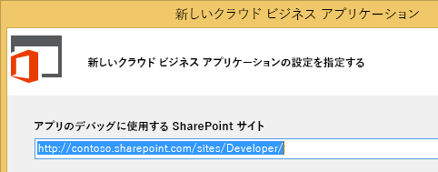

# クラウド ビジネス アドインを作成する
クラウド ビジネス アドインのテンプレートを Visual Studio で使用して、データの追加と管理に最適化された SharePoint アドイン 2013 または Office 365 上の SharePoint を作成できます。
> **メモ**
> SharePoint 2013 用アドインのテンプレートを使用して SharePoint アドインを作成することも可能です。 

### クラウド ビジネス アドインを作成するには

1. メニュー バーで、[ **ファイル**]、[ **新規作成**]、[ **プロジェクト**] の順に選択します。

    [ **新しいプロジェクト**] ダイアログ ボックスが表示されます。

2. 図 1 のように、テンプレートの一覧で、[ **Visual Basic**] または [ **Visual C#**] ノードを展開して、[ **Office/SharePoint**] ノードを展開し、[ **アドイン**] ノードを選択してから、[ **クラウド ビジネス アドイン**] を選択します。

   **図 1. [クラウド ビジネス アドイン] テンプレート**

3. [ **名前**] テキスト ボックスにプロジェクトの名前を入力して、[ **OK**] ボタンをクリックします。

    [ **新しいクラウド ビジネス アドイン**] ウィザードが開きます。

4. 図 2 のように [ **新しいクラウド ビジネス アドイン**] ウィザードで SharePoint サーバーまたは Office 365 Developer サイトのサイト URL を入力し、[ **完了**] ボタンをクリックします。

   **図 2. SharePoint の URL**

    URL の形式は、https://  _MySite_.sharepoint.com/sites/Developer/ にします。

    ソリューション エクスプローラーに、トップレベル プロジェクト、[ **HTMLClient**] プロジェクト、[ **サーバー**] プロジェクト、[ **SharePoint**] プロジェクトという 4 つのプロジェクトを含んだソリューションが追加されます。

### クラウド ビジネス アドインのサイトを変更するには

1. 図 3 のように、[ **ソリューション エクスプローラー**] で、トップレベル プロジェクト ノードのショートカット メニューを開き、[ **プロパティ**] を選択します。

   **図 3. トップレベル プロジェクト ノード**

    アプリケーション デザイナーが開きます。

2. 図 4 に示すように、アプリケーション デザイナーで [ **SharePoint**] タブを選択します。

   **図 4. [SharePoint] タブ**

3. [ **サイト URL**] リストで、SharePoint サーバーまたは Office 365 Developer サイト用の既存 URL を選択するか サイト URL を入力します。

4. [ **検証**] ボタンをクリックして、URL を検証します。

## その他の技術情報

-  [クラウド ビジネス アドインを開発する](develop-cloud-business-add-ins.md)

-  [クラウド ビジネス アドインを作成する](create-cloud-business-add-ins.md)

