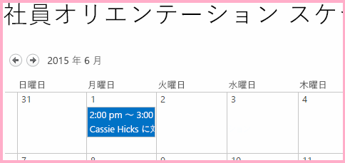
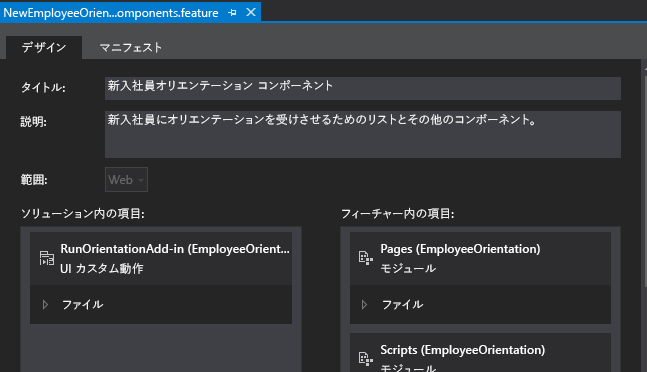

# SharePoint アドインのホスト Web にカスタムのリボンのボタンを作成する
SharePoint アドインのホスト Web にカスタム リボンのボタン コマンドを追加します。
これは、SharePoint ホスト型 SharePoint アドインの開発の基本に関する記事のシリーズの 9 番目です。 [SharePoint アドイン](sharepoint-add-ins.md)およびこのシリーズの前の記事についてまず理解しておく必要があります。

-  [SharePoint ホスト型の SharePoint アドインの作成を始める](get-started-creating-sharepoint-hosted-sharepoint-add-ins.md)

-  [SharePoint 用の SharePoint ホスト型アドインを展開してインストールする](deploy-and-install-a-sharepoint-hosted-sharepoint-add-in.md)

-  [SharePoint 用の SharePoint ホスト型アドインにカスタム列を追加する](add-custom-columns-to-a-sharepoint-hostedsharepoint-add-in.md)

-  [SharePoint ホスト型 SharePoint アドインにカスタム コンテンツ タイプを追加する](add-a-custom-content-type-to-a-sharepoint-hostedsharepoint-add-in.md)

-  [SharePoint ホスト型 SharePoint アドイン内のページに Web パーツを追加する](add-a-web-part-to-a-page-in-a-sharepoint-hosted-sharepoint-add-in.md)

-  [SharePoint ホスト型 SharePoint アドインにワークフローを追加する](add-a-workflow-to-a-sharepoint-hosted-sharepoint-add-in.md)

-  [SharePoint ホスト型 SharePoint アドインにカスタム ページとスタイルを追加する](add-a-custom-page-and-style-to-a-sharepoint-hosted-sharepoint-add-in.md)

-  [SharePoint ホスト型 SharePoint アドインにカスタムのクライアント側レンダリングを追加する](add-custom-client-side-rendering-to-a-sharepoint-hosted-sharepoint-add-in.md)

> **メモ**
> SharePoint ホスト型アドインに関するこのシリーズを続けて学習している場合は、このトピックの学習に使用できる Visual Studio ソリューションがあります。また、 [SharePoint_SP-hosted_Add-Ins_Tutorials](https://github.com/OfficeDev/SharePoint_SP-hosted_Add-Ins_Tutorials) でリポジトリをダウンロードして、BeforeRibbon.sln ファイルを開くこともできます。

すべての SharePoint アドインは、アドインのタイルをクリックすることによって、ホスト Web の [ **サイト コンテンツ**] ページから実行できます。SharePoint アドインの機能は、カスタム アクション (カスタム リボン ボタンまたはカスタム メニュー項目)　としてホスト Web に公開することもできます。この記事では、ホスト Web 上のリボンにボタンを追加します。
## ホスト Web を準備する

ホスト Web の予定表のリボンにボタンを追加します。SharePoint 開発者向けサイトの UI で次の手順を実行します。

1. サイトのホーム ページで、[ **サイト コンテンツ**] > [ **追加とアドイン**] > [ **予定表**] を選択します。

2. [ **予定表の追加**] ダイアログで、[ **名前**] に「新入社員オリエンテーションのスケジュール」と入力してから、[ **作成**] を選択します。

3. 予定表が開いたら、[ **追加**] リンクが日付に表示されるまで任意の日付にカーソルを置き、[ **追加**] をクリックします。 

4. [ **新入社員オリエンテーションのスケジュール - 新しいアイテム**] ダイアログで、[ **タイトル**] に「Orient Cassi Hicks」と入力します。他のフィールドは既定の状態のままにし、[ **保存**] をクリックします。

    予定表は、次のようになります。

   **カスタムの予定表**

> **重要**
> 次の手順では、Visual Studio の UI に予定表を表示する必要がありますが、予定表を作成したときに Visual Studio が開いていた場合は必要ありません。続行する前に、Visual Studio を閉じて、開発者向けサイトにログインしているすべてのブラウザー ウィンドウと PowerShell コンソールからもログアウトします。 

## リボン カスタム アクションを追加する

1. [ **ソリューション エクスプローラー**] で、[ **EmployeeOrientation**] プロジェクトを右クリックし、[ **追加**] > [ **新しいアイテム**] > [ **Office/SharePoint**] > [ **リボン カスタム アクション**] を選択します。それに「RunOrientationAdd-in」という名前を付けてから、[ **追加**] を選択します。

2. [ **ニュー項目のカスタム動作の作成**] ウィザードがいくつか質問します。次の表の中から回答してください。

|**プロパティに関する質問**|**回答**|
|:-----|:-----|
|カスタム アクションをどこに公開しますか?    |[ **ホスト Web**] を選択します。    |
|カスタム アクションのスコープをどの範囲に設定しますか?    |[ **リスト インスタンス**] ([リスト テンプレート] *ではない*  ) を選択します。   |
|カスタム アクションのスコープを特定のどのアイテムに設定しますか?    |[ **新入社員オリエンテーションのスケジュール**] を選択します。    |
|コントロールをどこに配置しますか?    |ドロップダウン選択は使用しません。代わりに、[ **Ribbon.Calendar.Events.Actions.Controls._children**] と入力します (3 番目の部分である **Events** はリボンのタブを識別し、4 番目の部分である **Actions** はボタンのグループを識別します)。   |
|メニュー アイテムのテキストはどのようにしますか?    |「 **新入社員オリエンテーション**」と入力します。    |
|カスタム アクションによる移動先はどこですか?    |ドロップダウン選択は使用しません。代わりに、[ **~appWebUrl/Lists/NewEmployeesInSeattle**] と入力します。これは、リストのリスト ビュー ページであり、アドイン Web 上にあるため、ホスト Web 上のリボン ボタンを使用すると、ページはアドイン Web ページで開きます。    |
 
3. [ **完了**] を選択します。 

## アドイン Web フィーチャーを検査する

[ **ソリューション エクスプローラー**] で、[ **Features**] フォルダーを展開し、[ **NewEmployeeOrientationComponents**] フィーチャーを選択します。フィーチャー デザイナーが開きます。

作成したカスタム アクション [ **RunOrientationAdd-in**] は、[ **フィーチャー内のアイテム**] ではなく、[ **ソリューション内のアイテム**] にリストされていることに注意してください。これは、フィーチャーはアドイン Web に展開されていますが、カスタム アクションはホスト Web に展開されているためです。運用環境への展開用にアドインを Visual Studio にパッケージ化するか、Visual Studio で F5 キーを押すと、Office Developer Tools for Visual Studio は特別なホスト Web フィーチャーを作成し、カスタム アクションを追加し、それをホスト Web に展開します。ホスト Web フィーチャーは決して編集しないでください。フィーチャーがパッケージ化のときまで作成されないのはこのためです。

**フィーチャー デザイナー**

## アドインを実行してテストする

1. F5 キーを使用して、アドインを展開して実行します。Visual Studio はテスト用 SharePoint サイトにアドインを一時的にインストールし、すぐにアドインを実行します。 

2. SharePoint アドイン の既定のページが開きます。開発者向けサイトのホーム ページ (つまり、ホスト Web) に移動します。ページの左上に階層リンクがあります。

3. ホスト Web のホーム ページで、[ **サイト コンテンツ**] を選択し、[ **サイト コンテンツ**] ページで、[ **新入社員オリエンテーションのスケジュール**] 予定表 ([ **新入社員オリエンテーション**] アドインではない) をクリックします。

4. 予定表が表示されたら、[ **Orient Cassie Hicks**] イベントをクリックします。リボンの [ **イベント**] タブが自動的に開かない場合は、開いてください。次のようになります。

   **カスタム ボタンがあるリボンのイベント タブ**

![[イベント] リボンと「新入社員オリエンテーション」という名前のカスタム ボタン](images/916ecbba-11ff-45b6-a8e9-ba717ae6fe0b.png)

5. リボンの [ **アクション**] グループで、[ **新入社員オリエンテーション**] をクリックします。[ **シアトルの新入社員**] のリスト ビュー ページが開きます。

6. デバッグ セッションを終了するには、ブラウザー ウィンドウを閉じるか、Visual Studio でデバッグを停止します。F5 を押すたびに、Visual Studio は以前のバージョンのアドインを取り消し、最新のアドインをインストールします。

7. このアドインおよび他の記事の Visual Studio ソリューションを操作し、それが終了したら前回のアドインを取り消すとよいでしょう。[ **ソリューション エクスプローラー**] のプロジェクトを右クリックして、[ **取り消し**] を選択します。

## 

このシリーズの次の記事では、JavaScript を SharePoint アドインに追加し、JavaScript オブジェクト モデルを使用して SharePoint データにアクセスします。 [SharePoint データで動作するように SharePoint JavaScript API を使用する](use-the-sharepoint-javascript-apis-to-work-with-sharepoint-data.md)。

