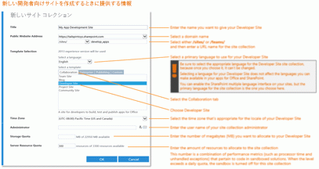

# 既存の Office 365 サブスクリプション内で開発者向けサイトを作成する
Office 365 開発者向けサイト を使うと、セットアップが容易になるので、Office アドインと SharePoint アドイン の作成、テスト、展開にとりかかれるまでに費やす時間を短縮できます。多くの Office 365 Business、Enterprise、Education、および Government サブスクリプションには、開発者向けサイト の作成に使用できるサイト テンプレートが組み込まれています。
 **始める前に**

- 開発者向けサイトをサポートする **Office 365 サブスクリプションがあることを確認してください。** 次のいずれかの Office 365 サブスクリプション プランがある場合、開発者向けサイト を既存のサブスクリプション内に作成できます。

> Office 365 Midsize Business

> Office 365 Enterprise E1、E3、E4、E5、または K1

> Office 365 Education A2、A3、または A4

> Office 365 Government G1、G3、G4、または K1

- **Office 365 Small Business サブスクリプションがある場合は、** 単一のサイト コレクションのみサポートされるので、開発者向けサイト コレクションを作成できません。ご自分の業務用に Office 365 を計画することに関する詳細については、「 [SharePoint Online: ソフトウェアの境界と制限](http://office.microsoft.com/ja-jp/office365-sharepoint-online-enterprise-help/sharepoint-online-software-boundaries-and-limits-HA102694293.aspx)」を参照してください。

- Office 365 Enterprise オファリングの詳細については、 [プランと料金](http://products.office.com/ja-jp/business/office-365-enterprise-e1-business-software)を参照してください。

## 開発者向けサイトの作成

1. グローバル管理者または SharePoint Online 管理者として Office 365 にログインします。

    開発者向けサイトなどの **新しいサイト コレクションを作成するには、グローバル管理者または SharePoint Online 管理者としてサインインする必要があります**。Office 365 にサインインしたときに管理者のオプションを確認できるのは管理者だけです。管理者でない場合は、社内の管理者に連絡して、次のいずれかの操作を依頼します。

  - 開発者向けサイト を作成できるように自身への管理者権限の付与を依頼します。

  - 開発者向けサイト を作成し、サイト コレクションの管理者として自身を指定するように依頼します。

2. 上部にあるナビゲーション バーの左端の [アプリの起動] ボタンをクリックします。

3. **[管理]** タイルをクリックします。

4. 左側のナビゲーション ツリーで、 **[管理]** を展開して、 **[SharePoint]** を選びます。

5. [ **SharePoint 管理センター** ] の [ **サイト コレクション** ] タブで、 **[新規] > [プライベート サイト コレクション]** をクリックします。

!\[SharePoint 管理センターの新規サイト コレクション オプション](images/SPAdminCenter_newSiteCollection.png)

6. [ **新しいサイト コレクション** ] ダイアログ ボックスで、開発者向けサイトの情報を入力します。

    **以下のイメージをクリックして、手順を追ってダイアログ ボックス内の新しいサイト コレクション オプションの指定方法を調べるか、イメージの下の表をガイドとして参照してください。**
     

|||
|:-----|:-----|
|[ **タイトル** ]   |開発者向けサイトに付ける名前です。    |
|[ **パブリック Web サイトのアドレス** ] の一覧   |ドメイン名と URL パス ( **/sites/** か **/teams/** のどちらか) を選択してからサイト コレクションの URL 名を入力します。   |
|[ **テンプレートの選択** ] セクションの [ **言語の選択** ] の一覧   |開発者向けサイトで使用する第一言語です。    **開発者向けサイト コレクションの言語は、一度選択すると変更できないため、必ず適切な言語を選択してください。**   開発者向けサイトの言語を選択しても、Office アドインや SharePoint アドインで利用可能にできる言語には影響しません。    サイトでは SharePoint の複数言語インターフェイスを有効にできますが、サイト コレクションの第一言語はここで選択する言語になります。    |
|[ **テンプレートの選択**] セクションの [ **テンプレートの選択**] の下にある [ **グループ作業**] タブ    |[ **開発者向けサイト**] を選択します。    |
|[ **タイム ゾーン**]    |開発者向けサイトのロケールにとって適切なタイム ゾーンです。    |
|[ **管理者**]    |サイト コレクション管理者のユーザー名。    |
|[ **記憶域のクォータ**]    |この開発者向けサイトのサイト コレクションに割り当てるメガバイト (MB) の数です。    |
|[ **サーバー リソース クォータ**]    |サイト コレクションに割り当てるリソースの量です。    この数字は、セキュリティで保護されたソリューションのコードに関連する (プロセッサ時間やハンドルされない例外などの) パフォーマンス メトリックの組み合わせです。1 日あたりのクォータを超えると、このサイト コレクションではサンドボックスが無効になります。    |
 
7. [ **OK** ] をクリックします。

    [ **サイト コレクション**] ボックスの一覧に、新しい開発者向けサイトの URL が表示されます。サイトの作成が終了したら、URL に移動して、開発者向けサイトを開くことができます。

!\[新しいサイト コレクションのプロビジョニング](images/SPAdminCenter_newSiteCollection_provisioning.png)

## その他の技術情報

-  [SharePoint アドイン](sharepoint-add-ins.md)

-  [サイト コレクションを作成または削除する](http://office.microsoft.com/ja-jp/office365-sharepoint-online-enterprise-help/create-or-delete-a-site-collection-HA102772354.aspx?CTT=1)

